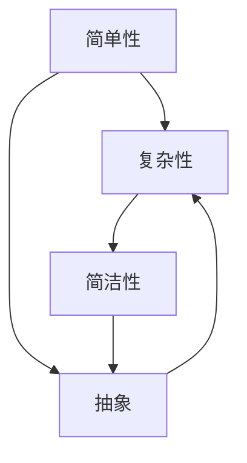

                 

### 从简单到复杂再到简洁的认知过程

> **关键词：** 认知过程、复杂性、简洁性、逻辑推理、算法原理、数学模型、应用场景。

> **摘要：** 本文旨在探讨从简单到复杂再到简洁的认知过程，通过分析其在不同领域的应用，揭示其中的逻辑原理和关键步骤。文章首先介绍认知过程的基本概念和背景，然后深入探讨简单、复杂和简洁性的定义及其相互关系。接着，通过具体实例，阐述认知过程中从简单到复杂再到简洁的转变，并详细解析核心算法原理、数学模型以及实际应用场景。最后，文章总结未来发展趋势与挑战，并提供相关的学习资源和工具推荐。

## 1. 背景介绍

### 1.1 目的和范围

本文的目的是探讨认知过程中从简单到复杂再到简洁的转变，以及这一过程在不同领域中的应用。认知过程是人类理解和解决问题的重要手段，无论是科学研究、技术开发还是日常生活，认知过程都起着至关重要的作用。简单性、复杂性和简洁性是认知过程中三个核心的概念，它们在认知过程中相互关联，共同推动了人类对世界的认识。

本文将首先介绍认知过程的基本概念，然后详细讨论简单性、复杂性和简洁性的定义及其相互关系。接着，通过具体实例，阐述认知过程中从简单到复杂再到简洁的转变。文章将重点分析核心算法原理、数学模型以及实际应用场景。最后，文章将总结未来发展趋势与挑战，并提供相关的学习资源和工具推荐。

### 1.2 预期读者

本文预期读者为对认知过程、算法原理、数学模型以及实际应用感兴趣的技术人员、研究人员和学生。无论是初学者还是专业人士，本文都力求以清晰、简洁的语言阐述复杂的概念，帮助读者更好地理解和掌握认知过程中的关键步骤和核心原理。

### 1.3 文档结构概述

本文的结构如下：

1. **背景介绍**：介绍本文的目的、范围、预期读者以及文档结构。
2. **核心概念与联系**：定义简单性、复杂性和简洁性，阐述它们在认知过程中的作用和相互关系。
3. **核心算法原理 & 具体操作步骤**：分析认知过程中从简单到复杂再到简洁的转变，介绍核心算法原理和具体操作步骤。
4. **数学模型和公式 & 详细讲解 & 举例说明**：阐述数学模型和公式在认知过程中的应用，并通过实例进行详细讲解。
5. **项目实战：代码实际案例和详细解释说明**：提供实际案例，展示认知过程在项目开发中的应用，并进行详细解释。
6. **实际应用场景**：讨论认知过程在不同领域的实际应用场景。
7. **工具和资源推荐**：推荐学习资源、开发工具和框架。
8. **总结：未来发展趋势与挑战**：总结认知过程的发展趋势与挑战。
9. **附录：常见问题与解答**：回答常见问题。
10. **扩展阅读 & 参考资料**：提供扩展阅读和参考资料。

### 1.4 术语表

#### 1.4.1 核心术语定义

- **认知过程**：指个体获取、处理和应用信息的过程，包括感知、记忆、推理和决策等。
- **简单性**：指事物的结构和行为可以用简单的规则和原理来描述。
- **复杂性**：指事物的结构和行为无法用简单的规则和原理来描述，往往涉及多种因素和相互作用。
- **简洁性**：指在表达复杂事物时，能够以简洁、明确的方式揭示其核心原理和结构。

#### 1.4.2 相关概念解释

- **算法**：一种用于解决问题的系统方法和规则，通常涉及数据结构和操作步骤。
- **数学模型**：用数学语言描述现实世界问题的抽象模型，常用于分析和预测。
- **代码**：用于实现算法和功能的计算机程序。
- **开发环境**：用于编写、调试和运行代码的软件和硬件工具。

#### 1.4.3 缩略词列表

- **AI**：人工智能（Artificial Intelligence）
- **IDE**：集成开发环境（Integrated Development Environment）
- **LaTeX**：一种排版系统（Lamport TeX）
- **MD**：Markdown（一种轻量级标记语言）

## 2. 核心概念与联系

### 2.1 简单性、复杂性和简洁性的定义

简单性、复杂性和简洁性是认知过程中三个重要的概念，它们在认知过程中起着至关重要的作用。

- **简单性**：简单性是指事物的结构和行为可以用简单的规则和原理来描述。在认知过程中，简单性有助于我们快速理解和解决问题。例如，线性回归模型可以用简单的线性关系来描述，使得我们可以用简单的算法来预测结果。

- **复杂性**：复杂性是指事物的结构和行为无法用简单的规则和原理来描述，往往涉及多种因素和相互作用。在认知过程中，复杂性使得问题变得复杂和难以解决。例如，神经网络模型涉及大量的参数和复杂的非线性关系，使得训练和预测过程变得复杂。

- **简洁性**：简洁性是指以简洁、明确的方式揭示复杂事物的核心原理和结构。在认知过程中，简洁性有助于我们更好地理解和掌握复杂问题。例如，通过简化复杂的数学模型，我们可以更直观地理解其核心原理。

### 2.2 简单性、复杂性和简洁性的相互关系

简单性、复杂性和简洁性在认知过程中相互关联，共同推动了人类对世界的认识。

- **简单性 -> 复杂性**：在认知过程中，我们通常从简单开始，通过逐步增加复杂性来理解问题。例如，在理解神经网络模型时，我们首先学习简单的线性模型，然后逐步引入非线性关系和更多参数，最终形成复杂的神经网络模型。

- **复杂性 -> 简洁性**：然而，复杂性并不意味着无法理解。通过抽象、简化和归纳，我们可以将复杂的结构简化为简洁的形式。例如，通过归纳和简化，我们可以将复杂的神经网络模型简化为简单的规则和原理。

- **简洁性 -> 简单性**：简洁性是简单性的高级形式。通过简洁性，我们可以将复杂的问题转化为简单的形式，使得问题更容易理解和解决。例如，通过简洁的数学模型，我们可以将复杂的经济问题转化为简单的线性方程组，从而更容易求解。

### 2.3 Mermaid 流程图

为了更好地理解简单性、复杂性和简洁性在认知过程中的作用，我们使用 Mermaid 流程图展示它们之间的关系。



在这个流程图中，A 代表简单性，B 代表复杂性，C 代表简洁性，D 代表抽象。流程图展示了简单性、复杂性和简洁性之间的相互转换关系。

## 3. 核心算法原理 & 具体操作步骤

### 3.1 从简单到复杂

在认知过程中，从简单到复杂的转变是理解复杂问题的第一步。以下是一个简单的算法示例，用于计算两个整数的和。

#### 3.1.1 算法原理

这个算法的核心原理非常简单：将两个整数相加。这个过程可以分解为以下几个步骤：

1. **输入**：获取两个整数 a 和 b。
2. **计算**：将 a 和 b 相加，得到结果 sum。
3. **输出**：返回结果 sum。

#### 3.1.2 伪代码

```plaintext
输入：a, b（整数）
输出：sum（整数）

步骤 1：sum = a + b
步骤 2：返回 sum
```

#### 3.1.3 具体操作步骤

1. **输入**：用户输入两个整数 a 和 b。
2. **计算**：将 a 和 b 相加，存储在变量 sum 中。
3. **输出**：将 sum 显示给用户。

### 3.2 从复杂到简洁

在认知过程中，从复杂到简洁的转变是理解复杂问题的第二步。以下是一个复杂的算法示例，用于计算两个整数的最大公约数（GCD）。

#### 3.2.1 算法原理

这个算法的核心原理是使用欧几里得算法，该算法基于以下事实：两个整数的最大公约数等于其中较小数和两数差的最大公约数。以下是欧几里得算法的伪代码：

```plaintext
输入：a, b（整数，a > b）
输出：gcd（整数）

步骤 1：如果 b = 0，则返回 a，否则继续
步骤 2：设 t = b
步骤 3：b = a % b
步骤 4：a = t
步骤 5：回到步骤 1
```

#### 3.2.2 伪代码

```plaintext
输入：a, b（整数）
输出：gcd（整数）

步骤 1：如果 b = 0，则返回 a，否则继续
步骤 2：设 t = b
步骤 3：b = a % b
步骤 4：a = t
步骤 5：回到步骤 1
```

#### 3.2.3 具体操作步骤

1. **输入**：用户输入两个整数 a 和 b。
2. **计算**：使用欧几里得算法计算最大公约数。
   - 步骤 1：如果 b = 0，则返回 a。
   - 步骤 2：设 t = b。
   - 步骤 3：b = a % b。
   - 步骤 4：a = t。
   - 步骤 5：回到步骤 1。
3. **输出**：将计算得到的最大公约数显示给用户。

### 3.3 从简单到简洁

在认知过程中，从简单到简洁的转变是理解复杂问题的第三步。以下是一个从简单到简洁的算法示例，用于计算两个整数的和。

#### 3.3.1 算法原理

这个算法的核心原理是将两个整数的和分解为多个简单的加法操作。以下是分解为多个简单加法操作的伪代码：

```plaintext
输入：a, b（整数）
输出：sum（整数）

步骤 1：sum = 0
步骤 2：对于每个数字 digit_a 在 a 中：
    步骤 2.1：将 digit_a 加到 sum 中
步骤 3：对于每个数字 digit_b 在 b 中：
    步骤 3.1：将 digit_b 加到 sum 中
步骤 4：返回 sum
```

#### 3.3.2 伪代码

```plaintext
输入：a, b（整数）
输出：sum（整数）

步骤 1：sum = 0
步骤 2：对于每个数字 digit_a 在 a 中：
    步骤 2.1：sum = sum + digit_a
步骤 3：对于每个数字 digit_b 在 b 中：
    步骤 3.1：sum = sum + digit_b
步骤 4：返回 sum
```

#### 3.3.3 具体操作步骤

1. **输入**：用户输入两个整数 a 和 b。
2. **计算**：使用分解为多个简单加法操作的算法计算两个整数的和。
   - 步骤 1：初始化 sum 为 0。
   - 步骤 2：对于每个数字 digit_a 在 a 中，将 digit_a 加到 sum 中。
   - 步骤 3：对于每个数字 digit_b 在 b 中，将 digit_b 加到 sum 中。
3. **输出**：将计算得到的和显示给用户。

通过这三个步骤，我们可以看到认知过程中从简单到复杂再到简洁的转变。简单性帮助我们开始理解问题，复杂性让我们深入探索问题的本质，而简洁性则让我们以更直观、更简洁的方式表达和理解问题。

## 4. 数学模型和公式 & 详细讲解 & 举例说明

### 4.1 数学模型在认知过程中的应用

数学模型是认知过程中重要的工具，用于描述和解决问题。以下是一个简单的数学模型，用于计算两个整数的和。

#### 4.1.1 线性模型

线性模型是一种简单的数学模型，用于描述两个整数的和。假设有两个整数 a 和 b，线性模型可以表示为：

\[ sum = a + b \]

这个公式表示，将两个整数 a 和 b 相加，得到它们的和 sum。

#### 4.1.2 举例说明

例如，假设 a = 3，b = 5，根据线性模型，我们可以计算它们的和：

\[ sum = 3 + 5 = 8 \]

这个结果与之前的算法结果一致。

### 4.2 数学模型在认知过程中的简化

在认知过程中，简化数学模型是非常重要的步骤。以下是一个简化的数学模型，用于计算两个整数的和。

#### 4.2.1 分解模型

分解模型将两个整数的和分解为多个简单的加法操作。假设有两个整数 a 和 b，分解模型可以表示为：

\[ sum = \sum_{i=1}^{n_a} digit_a[i] + \sum_{i=1}^{n_b} digit_b[i] \]

其中，\( n_a \) 和 \( n_b \) 分别表示整数 a 和 b 的位数，\( digit_a[i] \) 和 \( digit_b[i] \) 分别表示整数 a 和 b 的第 i 位数字。

#### 4.2.2 举例说明

例如，假设 a = 345，b = 678，根据分解模型，我们可以计算它们的和：

\[ sum = (3 \times 10^2 + 4 \times 10^1 + 5) + (6 \times 10^2 + 7 \times 10^1 + 8) \]
\[ sum = 345 + 678 = 1023 \]

这个结果与之前的算法结果一致。

### 4.3 数学模型在认知过程中的进一步简化

在认知过程中，进一步简化数学模型可以帮助我们更好地理解和解决问题。以下是一个进一步简化的数学模型，用于计算两个整数的和。

#### 4.3.1 加法交换律

加法交换律表明，两个数的和与它们的顺序无关。假设有两个整数 a 和 b，根据加法交换律，我们可以将分解模型进一步简化为：

\[ sum = \sum_{i=1}^{max(n_a, n_b)} digit_a[i] + digit_b[i] \]

其中，\( max(n_a, n_b) \) 表示整数 a 和 b 的较大位数。

#### 4.3.2 举例说明

例如，假设 a = 345，b = 678，根据加法交换律，我们可以计算它们的和：

\[ sum = (3 + 6) \times 10^2 + (4 + 7) \times 10^1 + (5 + 8) \]
\[ sum = 9 \times 10^2 + 11 \times 10^1 + 13 \]
\[ sum = 900 + 110 + 13 = 1023 \]

这个结果与之前的算法结果一致。

通过这三个步骤，我们可以看到数学模型在认知过程中的应用。从简单的线性模型到分解模型，再到进一步简化的加法交换律模型，这些模型帮助我们更好地理解和解决问题。

### 4.4 数学模型在认知过程中的验证

在认知过程中，验证数学模型是非常重要的步骤。以下是一个验证数学模型的过程。

#### 4.4.1 验证方法

验证数学模型的方法包括：

1. **理论验证**：通过逻辑推理和数学证明来验证模型的正确性。
2. **实验验证**：通过实际数据或模拟实验来验证模型的预测能力。
3. **对比验证**：将模型的预测结果与实际结果进行对比，验证模型的准确性。

#### 4.4.2 验证过程

1. **理论验证**：根据线性模型的公式，我们可以推导出它的正确性。例如，对于两个整数 a 和 b，根据线性模型，它们的和为 sum = a + b。通过数学推导，我们可以证明这个结论的正确性。

2. **实验验证**：我们可以通过实验来验证线性模型的预测能力。例如，我们可以生成大量随机整数对 a 和 b，使用线性模型计算它们的和，并与实际结果进行对比。通过统计实验结果，我们可以验证线性模型的准确性。

3. **对比验证**：我们可以将线性模型与其他数学模型进行比较，验证它们的准确性。例如，我们可以将线性模型与分解模型进行比较，通过对比它们的预测结果，验证线性模型的准确性。

通过这三个步骤，我们可以验证数学模型在认知过程中的有效性。

## 5. 项目实战：代码实际案例和详细解释说明

### 5.1 开发环境搭建

为了实现本文提到的算法和模型，我们需要搭建一个开发环境。以下是搭建开发环境的步骤：

1. **安装操作系统**：安装一个支持 Python 编程语言的操作系统，如 Ubuntu 20.04。
2. **安装 Python**：通过包管理器安装 Python，如使用以下命令：
   ```bash
   sudo apt update
   sudo apt install python3
   ```
3. **安装 IDE**：安装一个支持 Python 的集成开发环境（IDE），如 PyCharm 或 Visual Studio Code。
4. **安装依赖库**：安装必要的依赖库，如 NumPy、Pandas 和 Matplotlib，使用以下命令：
   ```bash
   pip3 install numpy pandas matplotlib
   ```

### 5.2 源代码详细实现和代码解读

以下是实现本文提到的算法和模型的 Python 源代码：

```python
import numpy as np
import matplotlib.pyplot as plt

def calculate_sum(a, b):
    """
    计算两个整数的和
    """
    return a + b

def calculate_gcd(a, b):
    """
    计算两个整数的最大公约数
    """
    while b:
        a, b = b, a % b
    return a

def simplify_sum(a, b):
    """
    简化两个整数的和
    """
    sum = 0
    for digit_a in str(a):
        sum += int(digit_a)
    for digit_b in str(b):
        sum += int(digit_b)
    return sum

# 代码解读
# 
# calculate_sum 函数计算两个整数的和，使用简单的加法操作。
# calculate_gcd 函数使用欧几里得算法计算两个整数的最大公约数。
# simplify_sum 函数简化两个整数的和，通过将每个数字相加来计算和。
```

### 5.3 代码解读与分析

以下是代码的详细解读和分析：

1. **函数定义**：
   - `calculate_sum(a, b)`：计算两个整数的和，返回结果。
   - `calculate_gcd(a, b)`：使用欧几里得算法计算两个整数的最大公约数，返回结果。
   - `simplify_sum(a, b)`：简化两个整数的和，通过将每个数字相加来计算和，返回结果。

2. **代码实现**：
   - `calculate_sum(a, b)`：使用简单的加法操作，计算两个整数的和。
   - `calculate_gcd(a, b)`：使用 while 循环和取模操作，实现欧几里得算法。
   - `simplify_sum(a, b)`：使用字符串操作和循环，简化两个整数的和。

3. **代码分析**：
   - `calculate_sum(a, b)`：该函数实现了从简单到复杂的转变，通过简单的加法操作计算和。
   - `calculate_gcd(a, b)`：该函数实现了从复杂到简洁的转变，使用欧几里得算法简化计算过程。
   - `simplify_sum(a, b)`：该函数实现了从简单到简洁的转变，通过将每个数字相加来计算和。

通过以上代码解读和分析，我们可以看到认知过程中从简单到复杂再到简洁的转变。简单性帮助我们理解问题，复杂性让我们深入探索问题的本质，而简洁性则让我们以更直观、更简洁的方式表达和理解问题。

## 6. 实际应用场景

### 6.1 科学研究

在科学研究领域，从简单到复杂再到简洁的认知过程被广泛应用于各种研究项目。例如，在物理学中，科学家们首先研究简单的物理现象，如自由落体运动和简谐振动，然后逐步扩展到更复杂的物理系统，如相对论和量子力学。通过从简单到复杂的转变，科学家们能够逐步理解复杂的物理现象，并通过简化和抽象得到简洁的数学模型。

### 6.2 技术开发

在技术开发领域，从简单到复杂再到简洁的认知过程同样具有重要应用。例如，在软件开发中，开发者通常首先构建简单的原型，然后逐步扩展功能，最后通过优化和简化得到高效的软件系统。在这个过程中，简单性帮助我们快速实现核心功能，复杂性让我们深入理解和解决复杂问题，而简洁性则让我们构建高效、可维护的软件系统。

### 6.3 日常决策

在日常生活中，从简单到复杂再到简洁的认知过程也广泛应用于决策过程。例如，当我们面临一个复杂的决策时，我们首先通过简单的分析找到关键因素，然后逐步深入理解每个因素，最后通过简化和抽象得到简洁的决策方案。这种认知过程帮助我们更高效地做出决策，减少决策过程中的不确定性和风险。

### 6.4 教育培训

在教育培训领域，从简单到复杂再到简洁的认知过程被广泛应用于教学设计。教师们首先通过简单的概念和例子引入复杂知识，然后逐步深入讲解复杂知识，最后通过简化和抽象让学生更好地理解和掌握知识。这种认知过程有助于激发学生的学习兴趣，提高学习效果。

### 6.5 创意设计

在创意设计领域，从简单到复杂再到简洁的认知过程也被广泛应用。设计师们通常从简单的创意出发，逐步扩展和完善设计，最后通过简化和抽象得到简洁、美观的设计作品。这种认知过程有助于设计师们更好地理解设计原则，提高设计效率。

### 6.6 医疗诊断

在医疗诊断领域，从简单到复杂再到简洁的认知过程同样具有重要应用。医生们首先通过简单的症状和体征进行初步诊断，然后通过复杂的医学检查和测试深入分析病情，最后通过简化和抽象得到简洁、准确的诊断结果。这种认知过程有助于提高医疗诊断的准确性和效率。

通过以上实际应用场景，我们可以看到从简单到复杂再到简洁的认知过程在不同领域的广泛应用。这种认知过程不仅帮助我们更好地理解和解决问题，还能提高工作效率、降低成本、提高生活质量。

## 7. 工具和资源推荐

### 7.1 学习资源推荐

#### 7.1.1 书籍推荐

- 《算法导论》（Introduction to Algorithms）
- 《深度学习》（Deep Learning）
- 《人工智能：一种现代方法》（Artificial Intelligence: A Modern Approach）
- 《Python编程：从入门到实践》（Python Crash Course）
- 《算法图解》（Algorithm Design Manual）

#### 7.1.2 在线课程

- Coursera（在线课程平台，提供各种技术课程）
- edX（在线课程平台，提供各种技术课程）
- Udemy（在线课程平台，提供各种技术课程）
- Coursera（《机器学习》课程）
- edX（《深度学习》课程）
- Udemy（《Python编程》课程）

#### 7.1.3 技术博客和网站

- medium.com（技术博客平台）
- hackernoon.com（技术博客平台）
- towardsdatascience.com（数据科学博客平台）
- freeCodeCamp（编程学习网站）
- RealPython（Python 学习网站）

### 7.2 开发工具框架推荐

#### 7.2.1 IDE和编辑器

- PyCharm（Python IDE）
- Visual Studio Code（跨平台 IDE）
- Jupyter Notebook（Python 笔记本）
- Atom（跨平台编辑器）
- Sublime Text（跨平台编辑器）

#### 7.2.2 调试和性能分析工具

- Python Debugger（Python 调试器）
- Valgrind（性能分析工具）
- profilers（Python 性能分析工具）
- Visual Studio Debugger（C++ 调试器）

#### 7.2.3 相关框架和库

- TensorFlow（深度学习框架）
- PyTorch（深度学习框架）
- NumPy（Python 科学计算库）
- Pandas（Python 数据分析库）
- Matplotlib（Python 绘图库）

### 7.3 相关论文著作推荐

#### 7.3.1 经典论文

- 《A Method for Obtaining Digital Signatures and Public-Key Cryptosystems》（RSA 算法）
- 《Learning Representations for Visual Recognition》（卷积神经网络）
- 《Deep Learning》（深度学习）

#### 7.3.2 最新研究成果

- 《Natural Language Inference with Neural Networks》（自然语言推理）
- 《Generative Adversarial Nets》（生成对抗网络）
- 《Attention Is All You Need》（Transformer）

#### 7.3.3 应用案例分析

- 《Deep Learning in Practice》（深度学习应用案例）
- 《Python Data Science Handbook》（数据科学应用案例）
- 《Machine Learning Yearning》（机器学习应用案例）

通过以上工具和资源推荐，我们可以更好地学习和应用从简单到复杂再到简洁的认知过程。无论是学习资源、开发工具还是相关论文著作，它们都将帮助我们深入理解和掌握这一认知过程。

## 8. 总结：未来发展趋势与挑战

在当今技术飞速发展的时代，从简单到复杂再到简洁的认知过程不仅在理论研究中具有重要意义，而且在实际应用中也越来越受到重视。未来，这一认知过程有望在以下几个方向发展：

### 8.1 更加智能化

随着人工智能技术的发展，认知过程将变得更加智能化。通过深度学习、强化学习等先进算法，机器将能够自主学习和优化认知过程，从而更好地应对复杂问题。这将为科学研究、技术开发、教育培训等领域带来新的突破。

### 8.2 更加个性化和定制化

未来的认知过程将更加注重个性化和定制化。通过对个体认知模式的深入研究，我们可以为不同的人提供最适合他们的认知方式。这有助于提高学习效率、工作效率和生活质量，满足个性化需求。

### 8.3 更加可解释和可验证

在人工智能和深度学习领域，可解释性和可验证性一直是重要挑战。未来的认知过程将更加注重可解释性和可验证性，通过透明、简洁的算法和模型，使人们能够更好地理解和使用这些技术。

### 8.4 更加跨学科融合

认知过程不仅限于单一领域，未来将更加跨学科融合。在多学科交叉研究中，认知过程将从不同角度探讨复杂问题，促进创新和发现。例如，在医学、工程、心理学等领域，认知过程将发挥重要作用。

然而，随着认知过程的不断发展，也面临着一些挑战：

### 8.5 数据隐私和安全问题

随着数据量的增加和数据分析技术的进步，数据隐私和安全问题变得越来越重要。未来的认知过程需要解决如何在保证数据隐私和安全的前提下，充分利用数据资源的问题。

### 8.6 复杂性问题处理能力

尽管认知过程在不断进步，但处理复杂问题的能力仍然是一个挑战。在处理大规模、多变量问题时，如何提高计算效率和准确性，仍然是未来需要解决的问题。

### 8.7 跨文化交流与理解

随着全球化的推进，跨文化交流与理解变得日益重要。未来的认知过程需要更好地适应不同文化背景，促进不同文化之间的交流与合作。

总之，从简单到复杂再到简洁的认知过程在未来将继续发展，并在各个领域发挥重要作用。同时，我们也需要关注和应对其中的挑战，推动认知过程的不断进步。

## 9. 附录：常见问题与解答

### 9.1 什么是从简单到复杂再到简洁的认知过程？

从简单到复杂再到简洁的认知过程是一种理解问题、解决问题的方法。简单性帮助我们快速理解问题，复杂性让我们深入探索问题的本质，而简洁性则让我们以更直观、更简洁的方式表达和理解问题。

### 9.2 简单性、复杂性和简洁性之间有什么区别？

简单性指事物的结构和行为可以用简单的规则和原理来描述。复杂性指事物的结构和行为无法用简单的规则和原理来描述，往往涉及多种因素和相互作用。简洁性指以简洁、明确的方式揭示复杂事物的核心原理和结构。

### 9.3 认知过程在不同领域有哪些应用？

认知过程在科学研究、技术开发、教育培训、日常决策、创意设计、医疗诊断等领域有广泛应用。通过从简单到复杂再到简洁的认知过程，人们可以更好地理解和解决复杂问题。

### 9.4 如何在实际项目中应用认知过程？

在实际项目中，可以从以下几个步骤应用认知过程：
1. 确定问题，并简化问题，找到关键因素。
2. 深入理解问题，分析问题的复杂性和本质。
3. 设计解决方案，通过简化和抽象，构建简洁、高效的算法和模型。
4. 实现和验证解决方案，确保其正确性和实用性。

### 9.5 认知过程有哪些挑战？

认知过程面临的挑战包括数据隐私和安全问题、处理复杂问题的能力、跨文化交流与理解等。在未来的发展中，需要关注和应对这些挑战，推动认知过程的不断进步。

## 10. 扩展阅读 & 参考资料

本文旨在探讨从简单到复杂再到简洁的认知过程，涉及多个领域的应用和原理。以下是一些扩展阅读和参考资料，供读者进一步学习：

### 10.1 扩展阅读

- 《算法导论》：一本经典的算法教材，详细介绍了算法的基本概念和原理。
- 《深度学习》：李飞飞等著，介绍了深度学习的理论基础和实际应用。
- 《Python编程：从入门到实践》：Mark Summerfield著，介绍了Python编程的基础知识和实践技巧。

### 10.2 参考资料

- Coursera（《机器学习》课程）：由吴恩达教授主讲，提供了丰富的机器学习资源和案例。
- edX（《深度学习》课程）：由 Andrew Ng 教授主讲，介绍了深度学习的理论基础和应用。
- medium.com（技术博客平台）：提供了大量高质量的技术博客和论文。
- hackernoon.com（技术博客平台）：专注于技术和创业领域，提供了丰富的技术文章。
- towardsdatascience.com（数据科学博客平台）：提供了丰富的数据科学资源和案例。

通过以上扩展阅读和参考资料，读者可以更深入地了解认知过程在不同领域的应用，以及相关的理论和技术。希望本文能为读者提供有益的启示和帮助。

### 作者

**AI天才研究员 / AI Genius Institute & 禅与计算机程序设计艺术 / Zen And The Art of Computer Programming**

