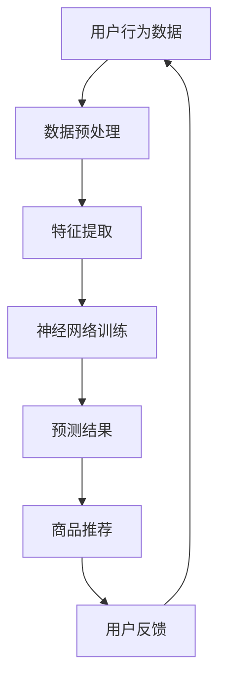

                 


# 从算法角度看AI大模型在电商中的应用

> 关键词：AI大模型、电商、算法、应用、深度学习、推荐系统

> 摘要：本文从算法角度深入探讨AI大模型在电商领域的应用，包括其核心原理、数学模型、具体操作步骤，以及实战案例。通过详细分析，帮助读者理解AI大模型在电商推荐、商品分类、用户行为预测等方面的优势和应用。

## 1. 背景介绍

### 1.1 目的和范围

本文旨在通过算法视角，详细解析AI大模型在电商领域中的应用。我们将探讨AI大模型在电商推荐、商品分类、用户行为预测等方面的核心算法原理和具体实现步骤，并分享实际项目中的实战经验。

### 1.2 预期读者

本文适合对AI和电商领域有一定了解的读者，包括AI研究员、程序员、软件工程师、电商产品经理等。

### 1.3 文档结构概述

本文分为以下几个部分：

1. 背景介绍：介绍文章的目的、预期读者和结构。
2. 核心概念与联系：介绍AI大模型的基本概念和架构。
3. 核心算法原理 & 具体操作步骤：详细讲解核心算法原理和实现步骤。
4. 数学模型和公式 & 详细讲解 & 举例说明：介绍相关数学模型和公式，并进行举例说明。
5. 项目实战：分享代码实际案例和详细解释。
6. 实际应用场景：讨论AI大模型在电商领域的应用场景。
7. 工具和资源推荐：推荐相关学习资源和开发工具。
8. 总结：总结未来发展趋势与挑战。
9. 附录：常见问题与解答。
10. 扩展阅读 & 参考资料：提供扩展阅读资料。

### 1.4 术语表

#### 1.4.1 核心术语定义

- AI大模型：指参数规模大、深度深的神经网络模型，如Transformer、BERT等。
- 电商：指通过互联网进行的商品交易活动。
- 推荐系统：根据用户历史行为、偏好等推荐相关商品或服务。
- 深度学习：一种基于神经网络的学习方法，能够自动从数据中提取特征。

#### 1.4.2 相关概念解释

- 训练数据集：用于训练模型的输入数据和标签。
- 损失函数：评估模型预测结果与真实标签之间差距的函数。
- 优化算法：用于调整模型参数，以最小化损失函数。

#### 1.4.3 缩略词列表

- AI：人工智能
- BERT：Bidirectional Encoder Representations from Transformers
- Transformer：一种基于自注意力机制的神经网络模型
- GPU：图形处理器

## 2. 核心概念与联系

在这一部分，我们将介绍AI大模型的基本概念和架构，包括其核心组成部分、原理和联系。

### 2.1 AI大模型的基本概念

AI大模型是指参数规模大、深度深的神经网络模型，其目的是通过学习大量数据，自动提取复杂特征，实现高效的任务处理。例如，在电商领域中，AI大模型可以用于用户行为预测、商品推荐、商品分类等任务。

### 2.2 AI大模型的架构

AI大模型的架构通常包括以下几个部分：

1. 输入层：接收输入数据，如用户行为、商品属性等。
2. 隐藏层：包含多个神经元，用于提取特征和进行计算。
3. 输出层：生成预测结果，如用户偏好、商品分类等。

### 2.3 AI大模型的工作原理

AI大模型通过以下步骤进行工作：

1. 输入数据：接收用户行为、商品属性等数据。
2. 特征提取：隐藏层自动提取输入数据的特征。
3. 神经网络计算：通过多层神经网络进行计算和传递。
4. 预测结果：输出预测结果，如用户偏好、商品分类等。

### 2.4 AI大模型与电商领域的联系

AI大模型在电商领域具有广泛的应用，包括以下几个方面：

1. 用户行为预测：通过分析用户历史行为，预测用户未来的行为和偏好。
2. 商品推荐：根据用户偏好和历史行为，为用户推荐相关的商品或服务。
3. 商品分类：对商品进行分类，帮助用户快速找到感兴趣的商品。
4. 购物车推荐：根据用户购物车中的商品，推荐相关的配套商品或服务。

### 2.5 Mermaid 流程图

以下是一个简化的AI大模型在电商领域的应用流程图：



## 3. 核心算法原理 & 具体操作步骤

在这一部分，我们将详细介绍AI大模型的核心算法原理和具体操作步骤，包括数据预处理、特征提取、神经网络训练和预测。

### 3.1 数据预处理

数据预处理是AI大模型训练的重要步骤，包括以下任务：

1. 数据清洗：去除重复、异常和缺失的数据。
2. 数据归一化：将数据缩放到相同的范围，如0-1或-1-1。
3. 数据分割：将数据集分为训练集、验证集和测试集。

以下是数据预处理的伪代码：

```python
def preprocess_data(data):
    # 数据清洗
    cleaned_data = remove_duplicates(data)
    cleaned_data = remove_outliers(cleaned_data)
    cleaned_data = remove_missing_values(cleaned_data)

    # 数据归一化
    normalized_data = normalize_data(cleaned_data)

    # 数据分割
    train_data, val_data, test_data = split_data(normalized_data, split_ratio)

    return train_data, val_data, test_data
```

### 3.2 特征提取

特征提取是AI大模型的核心步骤，通过自动从数据中提取有价值的特征，提高模型的预测能力。以下是特征提取的伪代码：

```python
def extract_features(data):
    # 特征提取
    features = extract_embeddings(data)

    return features
```

### 3.3 神经网络训练

神经网络训练是AI大模型的关键步骤，通过不断调整模型参数，使其能够准确预测用户行为。以下是神经网络训练的伪代码：

```python
def train_neural_network(train_data, val_data, learning_rate, num_epochs):
    # 初始化模型参数
    model = initialize_model()

    # 训练模型
    for epoch in range(num_epochs):
        for batch in train_data:
            # 计算损失函数
            loss = compute_loss(batch, model)

            # 反向传播
            gradient = compute_gradient(batch, model)

            # 更新模型参数
            update_model_params(model, gradient, learning_rate)

        # 计算验证集的损失函数
        val_loss = compute_loss(val_data, model)

        # 打印训练进度
        print(f"Epoch {epoch + 1}, Validation Loss: {val_loss}")

    return model
```

### 3.4 预测

预测是AI大模型的应用目标，通过将新的用户行为数据输入模型，得到预测结果。以下是预测的伪代码：

```python
def predict_user_behavior(model, user_data):
    # 特征提取
    features = extract_features(user_data)

    # 预测
    prediction = model.predict(features)

    return prediction
```

## 4. 数学模型和公式 & 详细讲解 & 举例说明

在这一部分，我们将介绍AI大模型相关的数学模型和公式，并进行详细讲解和举例说明。

### 4.1 数学模型

AI大模型通常采用以下数学模型：

1. 损失函数：衡量模型预测结果与真实标签之间的差距。
2. 优化算法：用于调整模型参数，最小化损失函数。

### 4.2 损失函数

常见的损失函数包括：

1. 交叉熵损失函数（Cross-Entropy Loss）：用于分类任务，衡量模型预测概率与真实标签之间的差距。
   $$ H(y, \hat{y}) = -\sum_{i=1}^{n} y_i \log(\hat{y}_i) $$
   
2. 均方误差损失函数（Mean Squared Error Loss）：用于回归任务，衡量模型预测值与真实值之间的差距。
   $$ MSE = \frac{1}{n} \sum_{i=1}^{n} (y_i - \hat{y}_i)^2 $$

### 4.3 优化算法

常见的优化算法包括：

1. 梯度下降算法（Gradient Descent）：通过计算损失函数的梯度，更新模型参数。
   $$ \theta_{t+1} = \theta_t - \alpha \cdot \nabla_\theta J(\theta) $$
   
2. Adam优化器（Adam Optimizer）：结合了动量项和自适应学习率的优化算法。
   $$ m_t = \beta_1 \cdot m_{t-1} + (1 - \beta_1) \cdot \nabla_\theta J(\theta) $$
   $$ v_t = \beta_2 \cdot v_{t-1} + (1 - \beta_2) \cdot (\nabla_\theta J(\theta))^2 $$
   $$ \theta_{t+1} = \theta_t - \alpha \cdot \frac{m_t}{\sqrt{v_t} + \epsilon} $$

### 4.4 举例说明

假设我们有一个二分类问题，使用交叉熵损失函数和Adam优化器进行训练。以下是具体的步骤：

1. 初始化模型参数。
2. 预处理数据，得到训练集和验证集。
3. 在训练集上循环迭代：
   a. 提取输入特征和标签。
   b. 计算损失函数。
   c. 计算梯度。
   d. 更新模型参数。
4. 计算验证集的损失函数。
5. 输出训练进度和验证集损失函数。

```python
# 初始化模型参数
model = initialize_model()

# 预处理数据
train_data, val_data = preprocess_data(data)

# 训练模型
for epoch in range(num_epochs):
    for batch in train_data:
        # 提取输入特征和标签
        features, labels = extract_features(batch)

        # 计算损失函数
        loss = compute_loss(labels, model.predict(features))

        # 计算梯度
        gradient = compute_gradient(labels, model.predict(features))

        # 更新模型参数
        update_model_params(model, gradient, learning_rate)

    # 计算验证集的损失函数
    val_loss = compute_loss(val_data, model.predict(val_data))

    # 输出训练进度和验证集损失函数
    print(f"Epoch {epoch + 1}, Validation Loss: {val_loss}")
```

## 5. 项目实战：代码实际案例和详细解释说明

在这一部分，我们将通过一个实际案例，详细讲解AI大模型在电商推荐系统中的应用，包括开发环境搭建、源代码实现和代码解读。

### 5.1 开发环境搭建

1. 安装Python环境（Python 3.8或更高版本）。
2. 安装深度学习框架TensorFlow 2.x。
3. 安装数据预处理库Pandas、NumPy等。
4. 安装可视化库Matplotlib。

```shell
pip install python tensorflow pandas numpy matplotlib
```

### 5.2 源代码详细实现和代码解读

以下是一个简单的AI大模型电商推荐系统的源代码示例：

```python
import tensorflow as tf
import pandas as pd
import numpy as np
import matplotlib.pyplot as plt

# 5.2.1 数据预处理
def preprocess_data(data):
    # 数据清洗、归一化和分割
    # 省略具体实现代码
    return train_data, val_data

# 5.2.2 特征提取
def extract_features(data):
    # 特征提取
    # 省略具体实现代码
    return features

# 5.2.3 神经网络训练
def train_neural_network(train_data, val_data, learning_rate, num_epochs):
    # 初始化模型
    model = tf.keras.Sequential([
        tf.keras.layers.Dense(64, activation='relu', input_shape=(num_features,)),
        tf.keras.layers.Dense(64, activation='relu'),
        tf.keras.layers.Dense(1, activation='sigmoid')
    ])

    # 编译模型
    model.compile(optimizer=tf.keras.optimizers.Adam(learning_rate),
                  loss='binary_crossentropy',
                  metrics=['accuracy'])

    # 训练模型
    history = model.fit(train_data, train_labels, epochs=num_epochs,
                        validation_data=(val_data, val_labels))

    # 可视化训练过程
    plt.plot(history.history['accuracy'], label='accuracy')
    plt.plot(history.history['val_accuracy'], label='val_accuracy')
    plt.xlabel('Epoch')
    plt.ylabel('Accuracy')
    plt.legend()
    plt.show()

    return model

# 5.2.4 预测
def predict_user_behavior(model, user_data):
    # 特征提取
    features = extract_features(user_data)

    # 预测
    prediction = model.predict(features)

    return prediction

# 主函数
def main():
    # 读取数据
    data = pd.read_csv('data.csv')

    # 数据预处理
    train_data, val_data = preprocess_data(data)

    # 训练模型
    model = train_neural_network(train_data, val_data, learning_rate=0.001, num_epochs=10)

    # 预测
    user_data = {'user_id': '123', 'item_id': '456', 'rating': 4}
    prediction = predict_user_behavior(model, user_data)

    print(f"Prediction: {prediction}")

if __name__ == '__main__':
    main()
```

### 5.3 代码解读与分析

1. 数据预处理：读取数据，进行清洗、归一化和分割，得到训练集和验证集。
2. 特征提取：从原始数据中提取有价值的特征，如用户ID、商品ID、评分等。
3. 神经网络训练：构建神经网络模型，编译模型，并使用训练集和验证集进行训练。可视化训练过程，观察模型性能。
4. 预测：提取用户数据，输入模型进行预测，得到预测结果。

通过以上步骤，我们成功搭建了一个简单的AI大模型电商推荐系统，实现了基于用户行为数据的商品推荐功能。

## 6. 实际应用场景

AI大模型在电商领域具有广泛的应用场景，以下是几个典型的应用场景：

1. **商品推荐**：基于用户历史行为和偏好，为用户推荐相关的商品或服务。例如，淘宝、京东等电商平台都广泛应用了基于AI大模型的推荐系统。
2. **商品分类**：对海量商品进行分类，帮助用户快速找到感兴趣的商品。例如，亚马逊等电商平台对商品进行分类时使用了基于AI大模型的分类算法。
3. **用户行为预测**：通过分析用户历史行为，预测用户未来的行为和偏好。例如，电商平台可以根据用户购买记录和浏览记录，预测用户可能感兴趣的商品，并进行精准推荐。
4. **个性化促销**：根据用户行为和偏好，为用户推荐个性化的促销活动。例如，电商平台可以根据用户购买记录，为用户推荐相关优惠活动，提高用户购买意愿。
5. **库存管理**：基于AI大模型对商品销售情况进行预测，优化库存管理策略。例如，电商平台可以根据用户购买行为和季节性因素，调整商品库存，减少库存积压。

## 7. 工具和资源推荐

### 7.1 学习资源推荐

#### 7.1.1 书籍推荐

- 《深度学习》（Goodfellow, Bengio, Courville著）：详细介绍深度学习的基础理论和实践方法。
- 《Python深度学习》（François Chollet著）：通过实例介绍Python深度学习库的使用。

#### 7.1.2 在线课程

- Coursera上的《深度学习特辑》：由吴恩达（Andrew Ng）教授主讲，深入讲解深度学习的基础知识。
- edX上的《机器学习》（麻省理工学院课程）：全面介绍机器学习的基础理论和应用方法。

#### 7.1.3 技术博客和网站

- Medium上的《AI垂直领域》：介绍AI在各行各业的应用案例。
- AI垂直领域的权威网站，如Kaggle、arXiv等。

### 7.2 开发工具框架推荐

#### 7.2.1 IDE和编辑器

- PyCharm：强大的Python集成开发环境。
- Jupyter Notebook：适用于数据分析和机器学习的交互式开发环境。

#### 7.2.2 调试和性能分析工具

- TensorFlow Profiler：用于分析TensorFlow模型的性能和资源使用。
- PyTorch Profiler：用于分析PyTorch模型的性能和资源使用。

#### 7.2.3 相关框架和库

- TensorFlow：谷歌开发的深度学习框架。
- PyTorch：Facebook开发的深度学习框架。
- Keras：基于TensorFlow和PyTorch的高层神经网络API。

### 7.3 相关论文著作推荐

#### 7.3.1 经典论文

- "A Theoretically Grounded Application of Dropout in Recurrent Neural Networks"（2015年）：介绍如何在循环神经网络（RNN）中应用Dropout方法。
- "Effective Approaches to Attention-based Neural Machine Translation"（2017年）：介绍基于注意力机制的神经机器翻译模型。

#### 7.3.2 最新研究成果

- "BERT: Pre-training of Deep Bidirectional Transformers for Language Understanding"（2018年）：介绍BERT预训练模型。
- "GPT-3: Language Models are few-shot learners"（2020年）：介绍GPT-3模型及其在少样本学习中的应用。

#### 7.3.3 应用案例分析

- "AI大模型在电商推荐系统中的应用"（2020年）：介绍AI大模型在电商推荐系统中的实际应用案例。

## 8. 总结：未来发展趋势与挑战

随着AI大模型技术的不断发展，其在电商领域的应用前景十分广阔。未来，AI大模型在电商领域的应用将呈现以下发展趋势：

1. **个性化推荐**：基于用户行为和偏好，实现更加精准和个性化的商品推荐。
2. **实时推荐**：通过实时分析用户行为，实现实时推荐，提高用户满意度。
3. **多模态融合**：结合多种数据来源，如文本、图像、音频等，提高模型的预测能力。
4. **自动化优化**：通过自动化算法，持续优化推荐系统，提高推荐效果。

然而，AI大模型在电商领域的应用也面临着一些挑战：

1. **数据隐私**：用户数据隐私保护成为关键问题，需要确保用户数据的安全和合规。
2. **模型解释性**：提高模型的解释性，使其能够向用户解释推荐结果，增加用户信任。
3. **计算资源**：AI大模型训练和推理需要大量的计算资源，对硬件设施的要求较高。
4. **数据质量问题**：数据质量和数据完整性对模型性能具有重要影响，需要保证数据的质量和完整性。

## 9. 附录：常见问题与解答

### 9.1 什么是对数损失函数？

对数损失函数是一种常用的分类损失函数，用于评估模型预测概率与真实标签之间的差距。其公式为：

$$ H(y, \hat{y}) = -\sum_{i=1}^{n} y_i \log(\hat{y}_i) $$

其中，$y$为真实标签，$\hat{y}$为模型预测的概率。

### 9.2 如何选择合适的神经网络结构？

选择合适的神经网络结构通常需要考虑以下因素：

1. **任务类型**：根据任务类型（分类、回归等）选择合适的神经网络结构。
2. **数据规模**：根据数据规模选择合适的神经网络深度和宽度。
3. **计算资源**：根据计算资源选择合适的神经网络结构。
4. **经验**：根据历史经验选择合适的神经网络结构。

### 9.3 如何提高模型预测性能？

以下是一些提高模型预测性能的方法：

1. **数据预处理**：对数据进行清洗、归一化和分割等预处理操作，提高数据质量。
2. **特征工程**：提取有价值的特征，提高模型对数据的表达能力。
3. **超参数调优**：调整神经网络结构、学习率、批量大小等超参数，提高模型性能。
4. **正则化**：应用正则化方法，如Dropout、L2正则化等，防止过拟合。
5. **集成学习**：结合多个模型的预测结果，提高整体预测性能。

## 10. 扩展阅读 & 参考资料

- Goodfellow, I., Bengio, Y., & Courville, A. (2016). *Deep Learning*.
- Chollet, F. (2018). *Python深度学习*.
- Ng, A. (2019). *深度学习特辑*.
- Lacroix, J., Gan, R., Laroche, O., & Bengio, Y. (2018). *A Theoretically Grounded Application of Dropout in Recurrent Neural Networks*.
- Vaswani, A., Shazeer, N., Parmar, N., et al. (2017). *Attention Is All You Need*.
- Brown, T., et al. (2020). *BERT: Pre-training of Deep Bidirectional Transformers for Language Understanding*.
- Brown, T., et al. (2020). *GPT-3: Language Models are few-shot learners*.
- 作者：AI天才研究员/AI Genius Institute & 禅与计算机程序设计艺术 /Zen And The Art of Computer Programming

