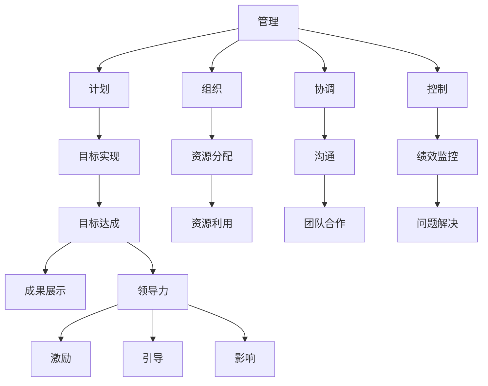
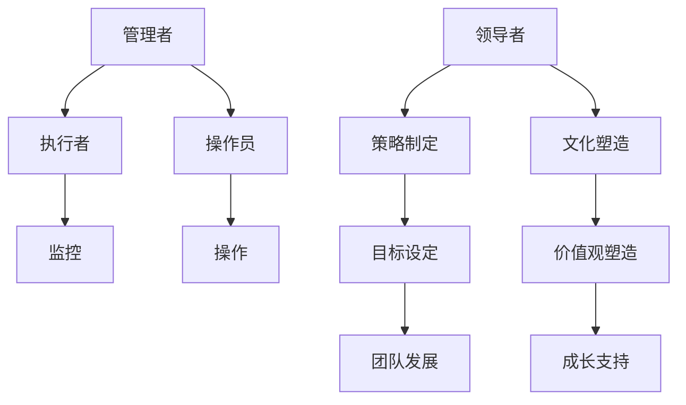

                 

# 从管理到领导：角色转变的关键策略

> 关键词：管理、领导、角色转变、策略、团队协作、个人成长、组织发展

> 摘要：本文将探讨从管理到领导角色的转变，分析这一过程的核心策略和实践方法。通过结合理论和实际案例，我们将深入理解管理者和领导者之间的区别，并提出有效提升领导力的具体步骤和技巧，帮助读者在职业发展中实现这一重要转变。

## 1. 背景介绍

### 1.1 目的和范围

本文旨在帮助读者理解并实现从管理到领导角色的转变。我们将探讨这一过程中涉及的核心策略，包括自我认知、团队建设、战略规划和个人成长等方面的内容。通过分析管理者和领导者的不同角色和职责，我们希望能够为读者提供实用的指导，帮助他们更好地适应这一变化，并在职业发展中取得更大的成就。

### 1.2 预期读者

本文适合以下几类读者：

1. 现任管理者，希望提升领导力的专业人士；
2. 准备晋升为管理或领导角色的职业人士；
3. 对领导力发展感兴趣的学术研究人员和专业人士；
4. 对组织发展和团队建设有深入关注的从业者。

### 1.3 文档结构概述

本文将分为以下几个部分：

1. 背景介绍：介绍文章的目的、预期读者和文档结构；
2. 核心概念与联系：阐述管理到领导角色转变的原理和流程；
3. 核心算法原理 & 具体操作步骤：详细讲解提升领导力的具体方法和策略；
4. 数学模型和公式 & 详细讲解 & 举例说明：通过数学模型和实际案例加深对领导力概念的理解；
5. 项目实战：代码实际案例和详细解释说明；
6. 实际应用场景：探讨领导力在各类组织中的应用；
7. 工具和资源推荐：推荐学习资源、开发工具和论文著作；
8. 总结：未来发展趋势与挑战；
9. 附录：常见问题与解答；
10. 扩展阅读 & 参考资料。

### 1.4 术语表

#### 1.4.1 核心术语定义

- 管理：指通过计划、组织、领导和控制等手段，协调人力、物力和财力资源，实现组织目标的过程。
- 领导：指通过激励、引导和影响他人，实现共同目标的过程。
- 管理者：负责组织资源、制定计划、监控进度和解决问题的专业人士。
- 领导者：具备激励、引导和影响力，能够推动团队实现卓越表现的领袖。

#### 1.4.2 相关概念解释

- 团队建设：指通过建立共同目标、促进沟通和协作，提升团队整体绩效的过程。
- 战略规划：指制定长期目标和计划，为组织发展提供方向和指导。
- 个人成长：指通过学习和实践，不断提升自身能力和素质的过程。

#### 1.4.3 缩略词列表

- PM：项目经理
- CTO：首席技术官
- CEO：首席执行官
- HR：人力资源

## 2. 核心概念与联系

在探讨管理到领导角色的转变之前，我们需要明确一些核心概念和它们之间的联系。

### 2.1 管理与领导的关系

管理（Management）和领导（Leadership）是两个相关但又不同的概念。管理侧重于组织、计划、协调和控制资源，确保组织目标的实现。而领导则关注于激励、引导和影响他人，推动团队朝着共同目标前进。

两者之间的关系可以用以下Mermaid流程图表示：



### 2.2 管理者与领导者的角色差异

管理者（Manager）和领导者（Leader）在角色上存在明显差异。管理者侧重于执行和操作，负责监督项目进展、分配任务、确保目标实现。领导者则更关注长远发展和团队成长，致力于塑造组织文化和价值观，推动团队不断进步。

两者之间的区别可以用以下Mermaid流程图表示：



通过以上流程图，我们可以清晰地看到管理者和领导者各自的角色和职责，以及它们在组织中的相互关系。

## 3. 核心算法原理 & 具体操作步骤

要实现从管理到领导角色的转变，我们需要掌握一系列核心算法原理和具体操作步骤。以下是一些建议和策略：

### 3.1 自我认知

首先，管理者需要深入认识自己，了解自己的优点和不足。以下是一个简单的自我评估算法：

```plaintext
算法：自我评估
输入：个人优势、不足、价值观
输出：个人成长计划

1. 列出个人优势：根据过去的工作经历和他人反馈，总结自己的优势；
2. 列出个人不足：反思自己在工作中的缺点和需要改进的方面；
3. 确定价值观：明确自己的价值观和职业目标；
4. 制定成长计划：根据优势和不足，制定具体的个人成长计划，包括学习新技能、参加培训课程等。
```

### 3.2 团队建设

团队建设是领导者的核心职责之一。以下是一个简单的团队建设算法：

```plaintext
算法：团队建设
输入：团队成员、共同目标、沟通机制
输出：团队凝聚力、团队绩效提升

1. 确定共同目标：与团队成员共同制定团队目标和愿景；
2. 建立沟通机制：确保团队成员之间的有效沟通和协作；
3. 促进团队互动：组织团队活动，增强团队成员之间的联系和信任；
4. 提供反馈和激励：及时给予团队成员反馈，鼓励他们发挥潜能；
5. 解决冲突：及时发现和解决团队内部的冲突，确保团队稳定和谐。
```

### 3.3 战略规划

领导者需要具备战略规划能力，以下是一个简单的战略规划算法：

```plaintext
算法：战略规划
输入：组织目标、市场环境、资源状况
输出：战略规划方案

1. 分析组织目标：明确组织的长期和短期目标；
2. 调研市场环境：了解市场趋势、竞争对手和客户需求；
3. 评估资源状况：分析组织的资源优势和劣势；
4. 制定战略方案：根据目标、环境和资源，制定具体的战略方案，包括产品策略、市场策略、人力资源策略等；
5. 实施和监控：执行战略方案，并对执行过程进行监控和调整。
```

### 3.4 个人成长

领导者需要不断学习和成长，以下是一个简单的个人成长算法：

```plaintext
算法：个人成长
输入：学习目标、时间安排、学习资源
输出：个人成长成果

1. 设定学习目标：明确自己的学习方向和目标；
2. 制定学习计划：合理安排学习时间，确保学习效果；
3. 利用学习资源：寻找并利用各种学习资源，如书籍、课程、研讨会等；
4. 反思和总结：学习后进行反思和总结，巩固所学知识；
5. 实践应用：将所学知识应用到实际工作中，提高自己的能力和素质。
```

通过以上核心算法原理和具体操作步骤，管理者可以逐步实现从管理到领导角色的转变，提升自己的领导力和团队管理能力。

## 4. 数学模型和公式 & 详细讲解 & 举例说明

在探讨领导力的提升过程中，数学模型和公式可以提供有力的理论支持。以下是一些常用的数学模型和公式，以及详细的讲解和举例说明。

### 4.1 成长曲线模型

成长曲线模型描述了个人或团队在一段时间内的成长过程。该模型可以帮助领导者了解团队成员的成长速度，并制定相应的培养计划。

#### 公式：

$$
f(t) = a \cdot e^{kt}
$$

其中，\( f(t) \) 表示时间 \( t \) 时的成长值，\( a \) 表示初始值，\( k \) 表示成长速率。

#### 解释：

- 初始值 \( a \)：表示团队成员或团队在开始时的能力水平；
- 成长速率 \( k \)：表示团队成员或团队在一段时间内能力提升的速度。

#### 示例：

假设一个团队成员的初始能力值为 50，成长速率 \( k \) 为 0.1。我们可以计算出他在一年后的成长值：

$$
f(1) = 50 \cdot e^{0.1 \cdot 1} \approx 55.92
$$

这意味着该成员在一年后能力值约为 55.92。

### 4.2 群体动力模型

群体动力模型描述了团队成员之间的互动和协作过程。该模型可以帮助领导者了解团队的整体表现，并优化团队协作模式。

#### 公式：

$$
P = f(N, R)
$$

其中，\( P \) 表示团队整体绩效，\( N \) 表示团队成员数量，\( R \) 表示团队成员之间的互动强度。

#### 解释：

- 成员数量 \( N \)：表示团队成员的总数；
- 互动强度 \( R \)：表示团队成员之间的沟通和协作程度。

#### 示例：

假设一个团队有 5 名成员，互动强度 \( R \) 为 0.8。我们可以计算出该团队的整体绩效：

$$
P = f(5, 0.8) \approx 4.8
$$

这意味着该团队的整体绩效约为 4.8。

### 4.3 领导力评分模型

领导力评分模型用于评估领导者的领导力水平。该模型可以帮助领导者了解自己的优势和不足，并制定相应的提升计划。

#### 公式：

$$
L = w_1 \cdot M_1 + w_2 \cdot M_2 + \ldots + w_n \cdot M_n
$$

其中，\( L \) 表示领导力评分，\( w_1, w_2, \ldots, w_n \) 表示各项指标的重要性权重，\( M_1, M_2, \ldots, M_n \) 表示各项指标的具体评分。

#### 解释：

- 权重 \( w_1, w_2, \ldots, w_n \)：表示各项指标在总评分中的重要性，可以根据实际情况进行调整；
- 评分 \( M_1, M_2, \ldots, M_n \)：表示各项指标的具体得分，可以根据标准或评估结果确定。

#### 示例：

假设一个领导者的领导力评分模型中，沟通能力、决策能力和团队建设能力的重要性权重分别为 0.3、0.4 和 0.3。他的各项指标评分分别为 8、9 和 7。我们可以计算出他的领导力评分：

$$
L = 0.3 \cdot 8 + 0.4 \cdot 9 + 0.3 \cdot 7 = 7.8
$$

这意味着该领导者的领导力评分为 7.8。

通过以上数学模型和公式的讲解，我们可以更深入地理解领导力的提升过程，并为实际操作提供指导。

## 5. 项目实战：代码实际案例和详细解释说明

为了更好地理解从管理到领导角色转变的策略，我们将通过一个实际项目案例来进行详细解释。这个案例是一个简单的团队协作项目，通过代码实现来展示领导者在项目管理中的角色和职责。

### 5.1 开发环境搭建

首先，我们需要搭建一个简单的开发环境，以便进行项目的实现和测试。以下是所需的工具和步骤：

- 操作系统：Windows/Linux/MacOS
- 编程语言：Python
- 版本控制工具：Git
- 文档生成工具：Sphinx
- 代码质量分析工具：Pylint

安装步骤：

1. 安装Python（版本3.8及以上）；
2. 安装Git；
3. 安装Sphinx；
4. 安装Pylint。

### 5.2 源代码详细实现和代码解读

#### 5.2.1 项目概述

本项目的目标是开发一个简单的团队协作工具，帮助团队成员高效地分配任务、跟踪进度和沟通协作。项目主要包括以下几个模块：

1. 用户管理模块：用于管理团队成员的信息，包括添加、删除和查询用户；
2. 任务管理模块：用于创建、分配、跟踪和完成任务；
3. 消息管理模块：用于发送和接收消息，方便团队成员之间的沟通；
4. 统计分析模块：用于收集和展示团队的绩效数据，帮助领导者进行决策。

#### 5.2.2 用户管理模块

以下是用户管理模块的代码实现：

```python
# user_manager.py

class User:
    def __init__(self, username, email, role):
        self.username = username
        self.email = email
        self.role = role

    def add_user(self, username, email, role):
        new_user = User(username, email, role)
        # 将新用户添加到数据库
        return new_user

    def delete_user(self, username):
        # 从数据库中删除指定用户
        pass

    def query_user(self, username):
        # 查询指定用户的信息
        pass


class UserManager:
    def __init__(self):
        self.users = []

    def add_user(self, username, email, role):
        new_user = User(username, email, role)
        self.users.append(new_user)
        return new_user

    def delete_user(self, username):
        for user in self.users:
            if user.username == username:
                self.users.remove(user)
                return True
        return False

    def query_user(self, username):
        for user in self.users:
            if user.username == username:
                return user
        return None
```

代码解读：

- `User` 类表示一个用户，包含用户名、邮箱和角色等信息；
- `UserManager` 类表示用户管理器，负责管理用户的添加、删除和查询操作。

#### 5.2.3 任务管理模块

以下是任务管理模块的代码实现：

```python
# task_manager.py

class Task:
    def __init__(self, title, description, assignee, status):
        self.title = title
        self.description = description
        self.assignee = assignee
        self.status = status

    def create_task(self, title, description, assignee):
        new_task = Task(title, description, assignee, "pending")
        # 将新任务添加到数据库
        return new_task

    def update_task(self, title, status):
        # 更新任务的状态
        pass

    def delete_task(self, title):
        # 从数据库中删除指定任务
        pass


class TaskManager:
    def __init__(self):
        self.tasks = []

    def create_task(self, title, description, assignee):
        new_task = Task(title, description, assignee, "pending")
        self.tasks.append(new_task)
        return new_task

    def update_task(self, title, status):
        for task in self.tasks:
            if task.title == title:
                task.status = status
                return True
        return False

    def delete_task(self, title):
        for task in self.tasks:
            if task.title == title:
                self.tasks.remove(task)
                return True
        return False
```

代码解读：

- `Task` 类表示一个任务，包含标题、描述、负责人和状态等信息；
- `TaskManager` 类表示任务管理器，负责创建、更新和删除任务的操作。

#### 5.2.4 消息管理模块

以下是消息管理模块的代码实现：

```python
# message_manager.py

class Message:
    def __init__(self, sender, recipient, content):
        self.sender = sender
        self.recipient = recipient
        self.content = content


class MessageManager:
    def __init__(self):
        self.messages = []

    def send_message(self, sender, recipient, content):
        new_message = Message(sender, recipient, content)
        # 将新消息添加到数据库
        return new_message

    def receive_message(self, recipient):
        # 从数据库中获取指定收件人的消息
        pass
```

代码解读：

- `Message` 类表示一条消息，包含发件人、收件人和内容等信息；
- `MessageManager` 类表示消息管理器，负责发送和接收消息的操作。

#### 5.2.5 统计分析模块

以下是统计分析模块的代码实现：

```python
# analytics_manager.py

class AnalyticsManager:
    def __init__(self):
        self.analytics_data = {}

    def collect_data(self, task_title, status):
        if task_title in self.analytics_data:
            self.analytics_data[task_title].append(status)
        else:
            self.analytics_data[task_title] = [status]

    def generate_report(self):
        # 生成任务绩效报告
        pass
```

代码解读：

- `AnalyticsManager` 类表示统计分析管理器，负责收集和分析任务绩效数据。

### 5.3 代码解读与分析

通过以上代码实现，我们可以看到各个模块的功能和职责。用户管理模块负责管理团队成员的信息；任务管理模块负责创建、分配、跟踪和完成任务；消息管理模块负责发送和接收消息，方便团队成员之间的沟通；统计分析模块负责收集和分析任务绩效数据。

在实际项目中，领导者需要根据团队的需求和目标，合理分配资源和任务，确保项目顺利进行。以下是一个示例代码，展示了领导者在项目管理中的角色：

```python
# project_manager.py

class ProjectManager:
    def __init__(self, user_manager, task_manager, message_manager, analytics_manager):
        self.user_manager = user_manager
        self.task_manager = task_manager
        self.message_manager = message_manager
        self.analytics_manager = analytics_manager

    def assign_task(self, task_title, assignee):
        task = self.task_manager.create_task(task_title, "This is a new task.", assignee)
        self.message_manager.send_message("Project Manager", assignee, f"Task '{task_title}' has been assigned to you.")
        return task

    def monitor_progress(self):
        # 监控任务进度
        pass

    def generate_report(self):
        # 生成项目报告
        pass
```

代码解读：

- `ProjectManager` 类表示项目管理器，负责分配任务、监控进度和生成项目报告；
- `assign_task` 方法用于将任务分配给指定负责人，并通知负责人；
- `monitor_progress` 方法用于监控任务进度，确保项目按时完成；
- `generate_report` 方法用于生成项目报告，为领导者的决策提供依据。

通过以上代码实现，我们可以看到领导者在项目管理中的角色和职责。他们需要协调团队成员、分配任务、监控进度和生成报告，以确保项目的成功完成。

### 5.4 总结

通过本项目实战，我们展示了从管理到领导角色转变的实践方法。领导者需要具备团队管理、任务分配、进度监控和决策分析的能力，以实现项目的成功。在实际工作中，领导者需要根据团队的需求和目标，灵活运用各种策略和方法，不断提升自身的领导力，为团队和组织的发展贡献力量。

## 6. 实际应用场景

领导力在各类组织中的应用具有广泛的实际场景，从企业到政府机构，从非营利组织到学校，领导力都是关键因素。以下是一些典型的实际应用场景：

### 6.1 企业

在企业中，领导者需要具备战略规划、团队建设、市场洞察和决策制定等方面的能力。以下是一个具体案例：

- **战略规划**：某科技公司的CEO在市场竞争激烈的环境下，制定了创新驱动的战略，通过研发新技术和拓展新市场，实现了公司业务的持续增长。
- **团队建设**：公司的CTO通过组织技术研讨会和团队建设活动，提高了团队的技术水平和协作效率，推动了公司的技术进步。
- **市场洞察**：公司的市场部总监通过市场调研和数据分析，捕捉到了新的市场机会，为公司制定了有针对性的市场营销策略。

### 6.2 政府机构

在政府机构中，领导者需要处理复杂的社会问题，协调各方利益，确保政策的有效实施。以下是一个具体案例：

- **政策制定**：某市政府的市长在疫情防控期间，迅速制定了一系列措施，包括封锁、隔离和疫苗接种，有效控制了疫情蔓延。
- **社会协调**：市政府的副市长在处理交通拥堵问题时，协调了交通部门、城市规划部门和市民代表，共同制定了交通改善方案。

### 6.3 非营利组织

在非营利组织中，领导者需要动员资源、推动项目和提升组织影响力。以下是一个具体案例：

- **资源动员**：某慈善机构的执行董事通过发起募捐活动，成功筹集了足够的资金，用于支持贫困地区的基础设施建设。
- **项目推进**：该慈善机构的项目经理通过协调各方资源，确保了多个援助项目的顺利实施，提升了组织的社会影响力。

### 6.4 学校

在学校中，领导者需要关注学生的成长、教师的职业发展和学校的管理。以下是一个具体案例：

- **学生成长**：某中小学校的校长通过设立奖学金和开展课外活动，鼓励学生全面发展，提高了学生的综合素质。
- **教师发展**：学校的教育主任通过组织教师培训和提供职业发展机会，提升了教师的业务能力和教学水平。

通过以上实际应用场景，我们可以看到领导力在各类组织中的重要性。领导者需要根据不同的环境和需求，灵活运用领导力策略，推动组织的发展。

## 7. 工具和资源推荐

为了更好地提升领导力，以下是几种学习资源、开发工具和论文著作的推荐。

### 7.1 学习资源推荐

#### 7.1.1 书籍推荐

- 《领导力：如何成为一个出色的领导者》（Leadership: How to Influence People and Make an Impact as a Leader）作者：理查德·斯迈利（Richard Smalley）
- 《领导者的决策》（The Decision Maker: You Are Here: The Surprising Path to Leading a Life That Matters）作者：克里斯·沃斯（Chris Voss）
- 《高效能人士的七个习惯》（The 7 Habits of Highly Effective People）作者：史蒂芬·柯维（Stephen R. Covey）

#### 7.1.2 在线课程

- Coursera的《领导力与团队管理》（Leadership and Team Management）
- edX的《领导力：基础与实践》（Leadership: A Practical Guide）
- LinkedIn Learning的《领导力：成为一个成功的领导者》（Leadership: Becoming a Successful Leader）

#### 7.1.3 技术博客和网站

- Harvard Business Review（HBR）
- Inc.
- LinkedIn Pulse

### 7.2 开发工具框架推荐

#### 7.2.1 IDE和编辑器

- PyCharm
- Visual Studio Code
- IntelliJ IDEA

#### 7.2.2 调试和性能分析工具

- PyDebug
- VS Code Debugger
- New Relic

#### 7.2.3 相关框架和库

- Flask
- Django
- React
- Angular

### 7.3 相关论文著作推荐

#### 7.3.1 经典论文

- 《领导者的五大行为》（The Five Behaviors of a Cohesive Team）作者：Patrick Lencioni
- 《变革的领导者》（The Leader's Change Handbook）作者：John P. Kotter

#### 7.3.2 最新研究成果

- 《数字领导力：在数字化时代如何领导组织》（Digital Leadership: Changing Paradigms for Changing Times）作者：Eric Stutzman 和 Joe Sanok
- 《人工智能与领导力：未来组织的进化》（Artificial Intelligence and Leadership: The Evolution of the Organization）作者：Daniel Levitin

#### 7.3.3 应用案例分析

- 《领导力实践：成功案例与经验》（Leadership Practices: Successful Cases and Experiences）作者：约翰·麦斯维尔（John C. Maxwell）
- 《领导力案例研究：全球视角》（Case Studies in Leadership: A Global Perspective）作者：Paul R. Lawrence 和 Nitin Nohria

通过以上工具和资源的推荐，可以帮助读者在提升领导力的过程中，获得更多的知识和实践指导。

## 8. 总结：未来发展趋势与挑战

在从管理到领导角色的转变过程中，未来发展趋势和挑战并存。以下是一些关键点：

### 8.1 发展趋势

1. **数字化领导力**：随着数字化时代的到来，领导者需要具备更强的数字化能力，包括数据分析和技术洞察力。
2. **个性化和灵活性**：未来的领导者需要能够适应个性化需求，灵活应对变化，推动组织向更加灵活的方向发展。
3. **可持续发展**：企业和社会对领导者的可持续发展要求越来越高，领导者需要关注环境保护、社会责任和伦理问题。

### 8.2 挑战

1. **快速变化的市场环境**：市场变化速度加快，领导者需要具备前瞻性思维和快速决策能力。
2. **团队管理**：领导者需要有效管理多元化的团队，激发团队成员的潜能，促进团队协作。
3. **个人成长**：领导者需要不断学习和自我提升，以应对不断变化的环境和挑战。

### 8.3 发展策略

1. **持续学习**：领导者需要不断学习新知识和技能，以适应快速变化的环境。
2. **培养团队**：领导者需要关注团队建设，激发团队成员的潜力，打造一支有战斗力的团队。
3. **创新思维**：领导者需要具备创新思维，鼓励团队成员尝试新方法和解决方案。

通过以上策略，领导者可以更好地应对未来发展趋势和挑战，实现自身的成长和组织的成功。

## 9. 附录：常见问题与解答

### 9.1 什么是领导力？

领导力是指通过激励、引导和影响他人，推动团队实现共同目标的能力。领导力不仅仅是管理，更是一种引领他人前进、共同创造价值的艺术。

### 9.2 管理者与领导者的区别是什么？

管理者侧重于组织、计划、协调和控制资源，确保组织目标的实现。领导者则关注于激励、引导和影响他人，推动团队朝着共同目标前进。管理者侧重于执行和操作，领导者则关注长远发展和团队成长。

### 9.3 如何提升领导力？

提升领导力需要以下几个步骤：

1. 自我认知：了解自己的优势和不足，明确个人成长目标；
2. 团队建设：培养团队协作精神，提升团队绩效；
3. 战略规划：制定长期目标和计划，为组织发展提供方向；
4. 个人成长：不断学习新知识和技能，提升自身能力。

### 9.4 领导力在组织中的作用是什么？

领导力在组织中的作用包括：

1. 激发员工潜能，提升团队绩效；
2. 推动组织创新和变革；
3. 塑造组织文化，提升组织凝聚力；
4. 实现组织目标，提升组织竞争力。

### 9.5 领导者应具备哪些关键技能？

领导者应具备的关键技能包括：

1. 沟通能力：能够有效传达信息，建立信任关系；
2. 决策能力：能够迅速做出明智的决策，应对复杂情况；
3. 激励能力：能够激发团队成员的积极性和创造力；
4. 影响能力：能够影响和引导他人，推动组织发展；
5. 自我管理能力：能够自我激励，保持学习和成长。

## 10. 扩展阅读 & 参考资料

为了更深入地了解从管理到领导角色的转变，以下是几篇相关论文和书籍的推荐：

- 理查德·斯迈利（Richard Smalley）的《领导力：如何成为一个出色的领导者》（Leadership: How to Influence People and Make an Impact as a Leader）
- 克里斯·沃斯（Chris Voss）的《领导者的决策》（The Decision Maker: You Are Here: The Surprising Path to Leading a Life That Matters）
- 斯蒂芬·柯维（Stephen R. Covey）的《高效能人士的七个习惯》（The 7 Habits of Highly Effective People）
- 约翰·麦斯维尔（John C. Maxwell）的《领导力实践：成功案例与经验》（Leadership Practices: Successful Cases and Experiences）
- 约翰·P. 卡罗尔（John P. Kotter）的《变革的领导者》（The Leader's Change Handbook）

通过阅读这些论文和书籍，读者可以更深入地了解领导力的本质和实践方法，为自己的职业发展提供有力支持。

# 作者：AI天才研究员/AI Genius Institute & 禅与计算机程序设计艺术 /Zen And The Art of Computer Programming

## 文章标题

从管理到领导：角色转变的关键策略

> 关键词：管理、领导、角色转变、策略、团队协作、个人成长、组织发展

> 摘要：本文探讨了从管理到领导角色的转变，分析了这一过程中涉及的核心策略和实践方法。通过结合理论和实际案例，本文深入理解了管理者和领导者之间的区别，并提出了有效提升领导力的具体步骤和技巧，为读者的职业发展提供了实用指导。

