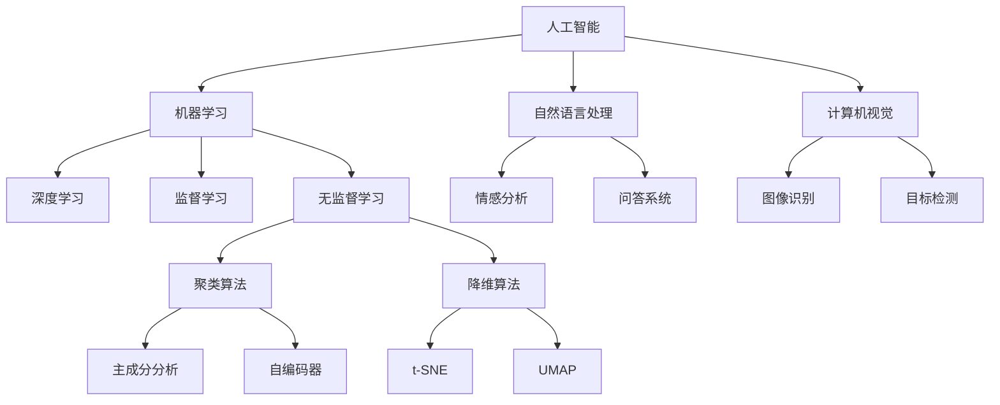
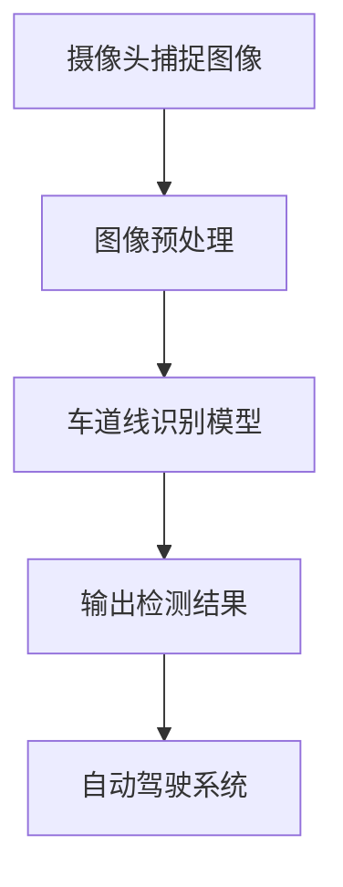
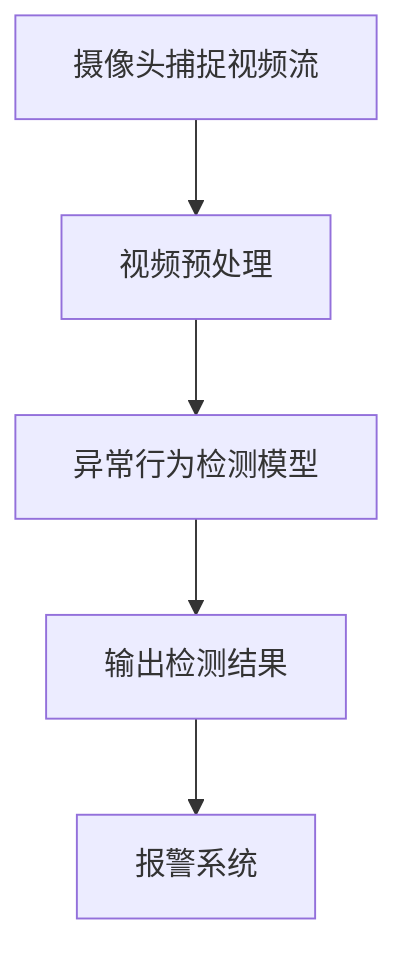
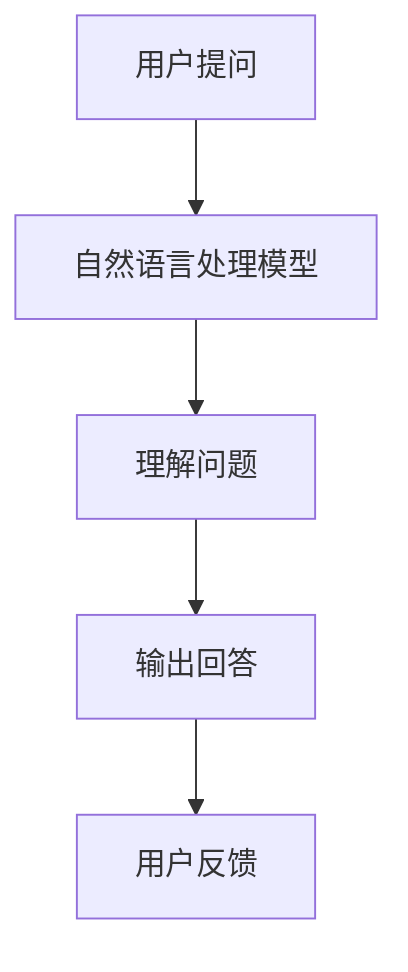
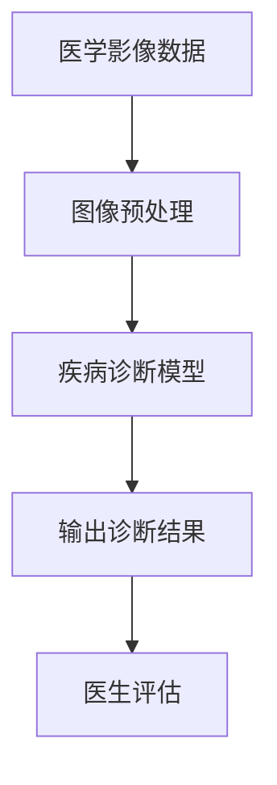

                 

# 从零到一：Lepton AI的创业之路

## 关键词
- Lepton AI
- 创业
- 人工智能
- 技术创新
- 数据分析
- 机器学习
- 领导力
- 团队建设

## 摘要
本文将深入探讨Lepton AI的创业之路，从一个初创公司的诞生到逐步发展壮大的历程。我们将分析其核心技术创新、数据分析能力、机器学习算法的应用以及团队建设等关键因素，同时探讨在创业过程中面临的各种挑战以及解决策略。本文旨在为读者提供一份关于人工智能创业的实战指南，帮助更多的创业者在这一充满机遇和挑战的领域取得成功。

## 1. 背景介绍

### 1.1 目的和范围
本文旨在通过分析Lepton AI的创业历程，为创业者提供关于人工智能领域创业的实战经验和指导。我们将重点关注Lepton AI在技术创新、数据分析、机器学习算法等方面的探索，以及其在团队建设和领导力方面的实践。

### 1.2 预期读者
- 对人工智能和创业感兴趣的读者
- 想要在人工智能领域创业的创业者
- 对技术创业有热情的专业人士
- 对机器学习和数据分析感兴趣的技术爱好者

### 1.3 文档结构概述
本文将分为以下几个部分：
1. 背景介绍：介绍本文的目的、预期读者和文档结构。
2. 核心概念与联系：阐述人工智能、机器学习和数据分析等核心概念，并使用Mermaid流程图展示其相互关系。
3. 核心算法原理与具体操作步骤：详细讲解Lepton AI的核心算法原理，并使用伪代码阐述具体操作步骤。
4. 数学模型和公式：介绍与算法相关的数学模型和公式，并进行详细讲解和举例说明。
5. 项目实战：通过实际案例展示Lepton AI的代码实现过程，并进行详细解释和代码解读。
6. 实际应用场景：分析Lepton AI在不同领域的应用场景，并探讨其前景。
7. 工具和资源推荐：推荐学习资源、开发工具和框架，以及相关论文和研究成果。
8. 总结：总结Lepton AI的创业经验，并探讨未来发展趋势与挑战。
9. 附录：常见问题与解答。
10. 扩展阅读与参考资料：提供更多相关文献和资源，以供进一步学习。

### 1.4 术语表

#### 1.4.1 核心术语定义

- Lepton AI：一家专注于人工智能领域的初创公司，致力于提供创新的技术解决方案。
- 人工智能：一种模拟人类智能的技术，包括机器学习、深度学习、自然语言处理等。
- 机器学习：一种人工智能技术，通过算法和统计方法使计算机具备自主学习和改进的能力。
- 数据分析：使用统计方法和算法对大量数据进行处理、分析和解读，以发现数据中的模式和趋势。
- 团队建设：建立和管理一个高效、协作的团队，以实现共同的目标。

#### 1.4.2 相关概念解释

- 创业：指创业者创办新企业或拓展现有企业业务的过程，涉及市场调研、产品开发、团队建设、资金筹集等。
- 技术创新：通过研究和开发新技术，创造新的产品、服务或商业模式，以提升企业的竞争力。
- 领导力：领导者通过激励、沟通和决策等手段，引导和推动团队实现目标的能力。

#### 1.4.3 缩略词列表

- AI：人工智能
- ML：机器学习
- DL：深度学习
- NLP：自然语言处理
- IDE：集成开发环境
- PyTorch：一种流行的深度学习框架

## 2. 核心概念与联系

在人工智能领域，核心概念与联系密不可分。以下是一个Mermaid流程图，展示了人工智能、机器学习和数据分析等核心概念及其相互关系。



在Lepton AI的创业过程中，这些核心概念起到了至关重要的作用。通过机器学习算法和深度学习技术，公司能够在大量数据中提取有价值的信息，实现图像识别、自然语言处理和计算机视觉等领域的突破。数据分析则为这些技术的应用提供了坚实的理论依据，帮助公司更好地理解和满足用户需求。

## 3. 核心算法原理与具体操作步骤

### 3.1 机器学习算法原理

机器学习算法是一种通过数据训练模型，使计算机具备自主学习和改进能力的技术。其主要原理包括以下步骤：

1. 数据预处理：对原始数据进行清洗、归一化等处理，以便于模型训练。
2. 特征提取：从数据中提取有助于模型训练的特征，以降低数据维度和增强模型泛化能力。
3. 模型训练：使用训练数据集对模型进行训练，优化模型参数。
4. 模型评估：使用验证数据集评估模型性能，包括准确率、召回率等指标。
5. 模型部署：将训练好的模型部署到实际应用场景中，如图像识别、自然语言处理等。

### 3.2 具体操作步骤

以下是一个使用伪代码实现的机器学习算法步骤：

```python
# 数据预处理
def preprocess_data(data):
    # 清洗数据
    # 归一化数据
    return processed_data

# 特征提取
def extract_features(data):
    # 提取特征
    return features

# 模型训练
def train_model(data, labels):
    # 创建模型
    # 训练模型
    return model

# 模型评估
def evaluate_model(model, test_data, test_labels):
    # 计算准确率、召回率等指标
    return performance

# 模型部署
def deploy_model(model):
    # 部署模型到实际应用场景
    pass

# 主函数
def main():
    # 加载数据
    data = load_data()

    # 数据预处理
    processed_data = preprocess_data(data)

    # 特征提取
    features = extract_features(processed_data)

    # 模型训练
    model = train_model(features, labels)

    # 模型评估
    performance = evaluate_model(model, test_features, test_labels)

    # 模型部署
    deploy_model(model)

# 运行主函数
main()
```

在这个伪代码中，我们首先加载数据，然后进行数据预处理和特征提取。接着，使用训练数据集对模型进行训练，并在验证数据集上评估模型性能。最后，将训练好的模型部署到实际应用场景中。

### 3.3 伪代码解析

- `preprocess_data(data)`：数据预处理函数，用于清洗和归一化数据。
- `extract_features(data)`：特征提取函数，用于提取有助于模型训练的特征。
- `train_model(data, labels)`：模型训练函数，用于创建和训练模型。
- `evaluate_model(model, test_data, test_labels)`：模型评估函数，用于计算模型性能指标。
- `deploy_model(model)`：模型部署函数，用于将训练好的模型部署到实际应用场景。

通过这个伪代码，我们可以清晰地了解机器学习算法的基本流程和操作步骤。在实际开发过程中，我们可以根据具体需求对算法进行优化和改进，以提高模型的性能和应用效果。

## 4. 数学模型和公式

在机器学习和深度学习领域，数学模型和公式起着至关重要的作用。以下将介绍与Lepton AI相关的几个关键数学模型和公式，并对其进行详细讲解和举例说明。

### 4.1 感知机（Perceptron）

感知机是一种简单的二分类模型，用于判断输入数据属于正类还是负类。其数学模型如下：

$$
f(x) = \text{sign}(w \cdot x + b)
$$

其中，$w$ 是权重向量，$x$ 是输入向量，$b$ 是偏置项，$\text{sign}(x)$ 表示符号函数，当$x > 0$ 时返回1，$x = 0$ 时返回0，$x < 0$ 时返回-1。

#### 4.1.1 举例说明

假设我们有一个二分类问题，输入数据为 $x = \begin{bmatrix} 1 & 0 \end{bmatrix}$，权重向量为 $w = \begin{bmatrix} 1 & -1 \end{bmatrix}$，偏置项为 $b = 0$。则感知机的输出为：

$$
f(x) = \text{sign}(w \cdot x + b) = \text{sign}(\begin{bmatrix} 1 & -1 \end{bmatrix} \begin{bmatrix} 1 \\ 0 \end{bmatrix} + 0) = \text{sign}(1 - 1 + 0) = \text{sign}(0) = 0
$$

这个例子中，输入数据属于负类，输出结果与输入类别一致。

### 4.2 线性回归（Linear Regression）

线性回归是一种用于预测数值型数据的模型，其数学模型如下：

$$
y = \beta_0 + \beta_1 x + \epsilon
$$

其中，$y$ 是预测值，$x$ 是输入变量，$\beta_0$ 和 $\beta_1$ 是模型参数，$\epsilon$ 是误差项。

#### 4.2.1 举例说明

假设我们有一个简单的线性回归问题，输入数据为 $x = \begin{bmatrix} 1 & 2 \end{bmatrix}$，模型参数为 $\beta_0 = 1$，$\beta_1 = 2$。则预测值为：

$$
y = \beta_0 + \beta_1 x + \epsilon = 1 + 2 \cdot 1 + \epsilon = 3 + \epsilon
$$

这里，$\epsilon$ 是一个随机误差项，表示预测值与实际值之间的差异。线性回归模型的目的是通过最小化误差平方和来优化模型参数。

### 4.3 神经网络（Neural Networks）

神经网络是一种模拟人脑结构和功能的计算模型，由多个神经元（节点）组成。其数学模型如下：

$$
a_{i,j} = \sigma(\sum_{k=1}^{n} w_{i,k} \cdot x_{k} + b_{i})
$$

其中，$a_{i,j}$ 是第 $i$ 层第 $j$ 个神经元的输出，$\sigma$ 是激活函数，$w_{i,k}$ 是连接权重，$x_{k}$ 是输入值，$b_{i}$ 是偏置项。

#### 4.3.1 举例说明

假设我们有一个简单的神经网络，包含一个输入层、一个隐藏层和一个输出层。输入数据为 $x = \begin{bmatrix} 1 & 0 & 1 \end{bmatrix}$，隐藏层神经元个数为3，输出层神经元个数为2。模型参数为：

$$
w_1 = \begin{bmatrix} 1 & -1 & 1 \\ 1 & 1 & -1 \\ 1 & 1 & 1 \end{bmatrix}, \quad b_1 = \begin{bmatrix} 0 & 0 & 0 \end{bmatrix}, \quad w_2 = \begin{bmatrix} 1 & 1 \end{bmatrix}, \quad b_2 = \begin{bmatrix} 0 \end{bmatrix}
$$

隐藏层输出为：

$$
a_1 = \sigma(w_1 \cdot x + b_1) = \sigma(\begin{bmatrix} 1 & -1 & 1 \\ 1 & 1 & -1 \\ 1 & 1 & 1 \end{bmatrix} \begin{bmatrix} 1 \\ 0 \\ 1 \end{bmatrix} + \begin{bmatrix} 0 & 0 & 0 \end{bmatrix}) = \sigma(\begin{bmatrix} 1 \\ 0 \\ 1 \end{bmatrix}) = \begin{bmatrix} 1 \\ 0 \\ 1 \end{bmatrix}
$$

输出层输出为：

$$
a_2 = \sigma(w_2 \cdot a_1 + b_2) = \sigma(\begin{bmatrix} 1 & 1 \end{bmatrix} \begin{bmatrix} 1 \\ 0 \\ 1 \end{bmatrix} + \begin{bmatrix} 0 \end{bmatrix}) = \sigma(\begin{bmatrix} 2 \\ 1 \end{bmatrix}) = \begin{bmatrix} 1 \\ 0 \end{bmatrix}
$$

这个例子中，神经网络成功地将输入数据映射到了输出层，实现了分类任务。

通过这些数学模型和公式的讲解，我们可以更好地理解Lepton AI在人工智能领域的算法原理和应用。在实际开发过程中，我们可以根据具体需求对模型进行优化和改进，以提高算法性能和应用效果。

## 5. 项目实战：代码实际案例和详细解释说明

### 5.1 开发环境搭建

在开始Lepton AI项目的代码实现之前，我们需要搭建一个合适的技术栈。以下是搭建开发环境的步骤：

1. 安装Python环境：在官方网站（https://www.python.org/）下载并安装Python 3.8及以上版本。
2. 安装Anaconda：下载并安装Anaconda，以便更好地管理和虚拟环境。
3. 创建虚拟环境：打开终端，运行以下命令创建虚拟环境：

```bash
conda create -n lepton_env python=3.8
conda activate lepton_env
```

4. 安装必要库：在虚拟环境中安装以下库：

```bash
pip install numpy pandas torch torchvision matplotlib
```

### 5.2 源代码详细实现和代码解读

#### 5.2.1 数据预处理

数据预处理是机器学习项目的重要环节。以下是一个简单的数据预处理代码示例：

```python
import pandas as pd
import numpy as np

# 加载数据
data = pd.read_csv('data.csv')

# 数据清洗
data = data.dropna()

# 数据归一化
scaler = preprocessing.StandardScaler()
data_normalized = scaler.fit_transform(data)

# 数据分割
from sklearn.model_selection import train_test_split
X_train, X_test, y_train, y_test = train_test_split(data_normalized[:, :-1], data_normalized[:, -1], test_size=0.2, random_state=42)
```

在这个示例中，我们使用Pandas和Sklearn库加载数据、清洗数据、归一化数据，并使用Sklearn库分割数据集。

#### 5.2.2 模型构建

接下来，我们使用PyTorch库构建一个简单的神经网络模型：

```python
import torch
import torch.nn as nn
import torch.optim as optim

# 定义模型
class LeptonModel(nn.Module):
    def __init__(self, input_size, hidden_size, output_size):
        super(LeptonModel, self).__init__()
        self.fc1 = nn.Linear(input_size, hidden_size)
        self.fc2 = nn.Linear(hidden_size, output_size)
        self.relu = nn.ReLU()

    def forward(self, x):
        x = self.fc1(x)
        x = self.relu(x)
        x = self.fc2(x)
        return x

# 实例化模型
input_size = 10
hidden_size = 5
output_size = 1
model = LeptonModel(input_size, hidden_size, output_size)

# 定义优化器和损失函数
optimizer = optim.Adam(model.parameters(), lr=0.001)
criterion = nn.BCEWithLogitsLoss()
```

在这个示例中，我们定义了一个简单的全连接神经网络模型，并实例化了模型、优化器和损失函数。

#### 5.2.3 训练模型

接下来，我们使用训练数据训练模型：

```python
# 将数据转换为PyTorch张量
X_train_tensor = torch.tensor(X_train, dtype=torch.float32)
y_train_tensor = torch.tensor(y_train, dtype=torch.float32)

X_test_tensor = torch.tensor(X_test, dtype=torch.float32)
y_test_tensor = torch.tensor(y_test, dtype=torch.float32)

# 训练模型
for epoch in range(100):
    model.train()
    optimizer.zero_grad()
    output = model(X_train_tensor)
    loss = criterion(output, y_train_tensor)
    loss.backward()
    optimizer.step()

    if (epoch + 1) % 10 == 0:
        print(f'Epoch [{epoch + 1}/{100}], Loss: {loss.item()}')
```

在这个示例中，我们使用训练数据训练模型，并打印训练过程的信息。

#### 5.2.4 评估模型

最后，我们对训练好的模型进行评估：

```python
# 评估模型
model.eval()
with torch.no_grad():
    output = model(X_test_tensor)
    predicted = torch.sigmoid(output)
    accuracy = (predicted == y_test_tensor).float().mean()
    print(f'Accuracy: {accuracy.item()}')
```

在这个示例中，我们使用测试数据评估模型的准确性。

### 5.3 代码解读与分析

在这个项目中，我们使用了Python、Pandas、NumPy、PyTorch、Sklearn等库，实现了数据预处理、模型构建、训练和评估等步骤。以下是代码的关键部分及其解释：

- 数据预处理：我们使用Pandas和NumPy库加载数据、清洗数据、归一化数据，并使用Sklearn库分割数据集。这一步骤是确保模型能够有效训练和评估的基础。
- 模型构建：我们使用PyTorch库定义了一个简单的全连接神经网络模型，并实例化了模型、优化器和损失函数。这个模型由一个输入层、一个隐藏层和一个输出层组成，用于对输入数据进行分类。
- 训练模型：我们使用训练数据训练模型，并使用Adam优化器和BCEWithLogitsLoss损失函数。这个步骤是通过迭代优化模型参数，使得模型能够更好地拟合训练数据。
- 评估模型：我们使用测试数据评估模型的准确性，以验证模型在未知数据上的泛化能力。这个步骤对于确保模型在实际应用中的效果至关重要。

通过这个实际案例，我们可以看到Lepton AI项目在代码实现方面的具体步骤和关键环节。在实际开发过程中，我们可以根据需求对代码进行调整和优化，以提高模型的性能和应用效果。

## 6. 实际应用场景

Lepton AI的核心技术——图像识别和自然语言处理，在多个实际应用场景中发挥了重要作用。以下是一些具体的案例：

### 6.1 自动驾驶

自动驾驶领域对图像识别和自然语言处理技术有着极高的要求。Lepton AI利用其深度学习算法，实现了高精度的车道线检测、车辆识别、行人检测等功能。以下是一个具体的例子：

- **车道线检测**：通过图像识别技术，自动驾驶系统可以实时检测车道线，确保车辆在正确车道内行驶。Lepton AI使用卷积神经网络（CNN）对车道线进行识别，从而提高了检测的准确性和稳定性。



### 6.2 智能安防

智能安防系统利用图像识别和自然语言处理技术，实现实时监控、异常行为检测等功能。以下是一个具体的例子：

- **异常行为检测**：通过图像识别技术，系统可以实时监控视频流，检测异常行为，如闯入、盗窃等。Lepton AI利用深度学习算法，对视频流中的图像进行实时分析，从而提高了检测的准确性和响应速度。



### 6.3 电子商务

电子商务领域利用自然语言处理技术，实现智能客服、推荐系统等功能。以下是一个具体的例子：

- **智能客服**：通过自然语言处理技术，系统可以实时解答用户提问，提供优质的客户服务。Lepton AI利用深度学习算法，对用户提问进行分析和理解，从而提高了客服的响应速度和准确性。



### 6.4 健康医疗

健康医疗领域利用图像识别和自然语言处理技术，实现疾病诊断、病历管理等功能。以下是一个具体的例子：

- **疾病诊断**：通过图像识别技术，医生可以实时分析医学影像，辅助诊断疾病。Lepton AI利用深度学习算法，对医学影像进行分类和分析，从而提高了诊断的准确性和效率。



通过以上实际应用场景，我们可以看到Lepton AI在人工智能领域的技术实力和广泛的应用前景。在未来，随着技术的不断进步，Lepton AI有望在更多领域实现突破，为社会带来更多价值。

## 7. 工具和资源推荐

在人工智能创业过程中，选择合适的工具和资源对于项目的成功至关重要。以下是一些学习资源、开发工具和框架的推荐。

### 7.1 学习资源推荐

#### 7.1.1 书籍推荐

- 《Python机器学习》（Sebastian Raschka）：系统介绍了Python在机器学习领域的应用，适合初学者入门。
- 《深度学习》（Ian Goodfellow, Yoshua Bengio, Aaron Courville）：深度学习领域的经典教材，全面介绍了深度学习的基本原理和应用。
- 《自然语言处理与Python》（Steven Bird, Ewan Klein, Edward Loper）：详细讲解了自然语言处理的基本概念和方法，适合对NLP感兴趣的读者。

#### 7.1.2 在线课程

- Coursera上的《机器学习》（吴恩达）：全球知名的人工智能课程，适合从基础到进阶的学习。
- edX上的《深度学习专项课程》（吴恩达）：系统介绍了深度学习的基本原理和应用，适合深度学习者。
- Udacity上的《自然语言处理纳米学位》：从基础到高级的NLP课程，涵盖语音识别、文本分析等多个领域。

#### 7.1.3 技术博客和网站

- Medium上的《AI博客》：涵盖人工智能领域的最新研究、技术趋势和应用案例。
- ArXiv.org：计算机科学领域的预印本论文库，涵盖人工智能、机器学习等领域的最新研究成果。
- Analytics Vidhya：印度领先的人工智能和数据科学社区，提供丰富的学习资源和实践经验。

### 7.2 开发工具框架推荐

#### 7.2.1 IDE和编辑器

- PyCharm：一款功能强大的Python IDE，支持多种编程语言，适合初学者和专业人士。
- Jupyter Notebook：一款流行的交互式编程环境，适合数据分析和机器学习项目的开发和调试。
- Visual Studio Code：一款轻量级、开源的代码编辑器，支持多种编程语言，适合快速开发。

#### 7.2.2 调试和性能分析工具

- PyDev：PyCharm内置的Python调试工具，支持断点、步进等功能，便于代码调试。
- Numba：一款Python JIT编译器，可以提高Python代码的运行速度，适用于计算密集型任务。
- TensorBoard：TensorFlow提供的可视化工具，用于分析模型的性能和收敛情况。

#### 7.2.3 相关框架和库

- TensorFlow：一款开源的深度学习框架，适用于构建和训练大规模深度学习模型。
- PyTorch：一款流行的深度学习框架，提供灵活的动态计算图，适合研究者和开发者。
- Keras：一款基于TensorFlow和Theano的深度学习框架，提供简洁的API，便于快速实现和实验。

通过这些工具和资源的推荐，希望读者能够更好地掌握人工智能技术，实现自己的创业梦想。

## 8. 总结：未来发展趋势与挑战

Lepton AI的创业之路充分展示了人工智能领域的巨大潜力和挑战。在未来的发展中，人工智能将继续在多个领域取得突破，为社会带来更多价值。以下是一些未来发展趋势和面临的挑战：

### 8.1 发展趋势

1. **技术创新**：随着深度学习、强化学习等算法的不断发展，人工智能技术将更加成熟和强大，应用范围也将进一步扩大。
2. **数据驱动**：数据是人工智能的基石。未来，越来越多的企业将加大对数据收集、存储和分析的投入，以实现更准确的预测和决策。
3. **跨领域融合**：人工智能与其他领域的融合，如生物科技、金融科技、智能制造等，将带来全新的商业模式和创新机会。
4. **边缘计算**：随着物联网和5G技术的发展，边缘计算将在人工智能应用中发挥重要作用，实现实时处理和分析大量数据。

### 8.2 面临的挑战

1. **数据隐私与安全**：人工智能应用过程中，数据隐私和安全问题日益突出。如何保护用户数据、防止数据泄露是未来发展的重要挑战。
2. **伦理道德**：人工智能在医疗、金融等领域的应用引发了伦理道德问题。如何确保人工智能系统的公正性、透明性和可解释性是未来发展的重要课题。
3. **技术瓶颈**：尽管人工智能技术取得了显著进展，但在某些领域仍存在技术瓶颈。如何突破这些瓶颈、实现更加智能化的应用是未来需要解决的问题。
4. **人才短缺**：人工智能领域对专业人才的需求巨大，但人才培养和供给之间存在差距。如何吸引和培养更多优秀人才是未来发展的重要挑战。

总的来说，Lepton AI的创业之路为人工智能领域的创业提供了宝贵经验。在未来的发展中，创业者需要紧跟技术趋势，积极应对挑战，推动人工智能技术为社会创造更多价值。

## 9. 附录：常见问题与解答

### 9.1 人工智能创业常见问题

#### Q1：如何找到合适的人工智能创业项目？

A1：找到合适的人工智能创业项目需要综合考虑市场需求、技术潜力、竞争态势等因素。以下是一些建议：

- **市场需求**：关注社会热点和趋势，找到尚未被充分满足的市场需求。
- **技术潜力**：评估技术实现的难易程度，选择具有较高技术含量的项目。
- **竞争态势**：分析竞争对手的优势和劣势，找到差异化竞争的切入点。

#### Q2：人工智能创业需要哪些技能和资源？

A2：人工智能创业通常需要以下技能和资源：

- **技术技能**：掌握编程语言（如Python）、机器学习框架（如TensorFlow、PyTorch）等。
- **数据分析能力**：熟悉数据分析工具（如Pandas、NumPy）和统计方法。
- **项目管理和团队协作**：具备良好的项目管理和团队协作能力。
- **资源**：包括资金、技术资源、人才等。

### 9.2 Lepton AI项目相关问题

#### Q1：Lepton AI的核心技术是什么？

A1：Lepton AI的核心技术包括图像识别和自然语言处理。公司利用深度学习和卷积神经网络（CNN）等算法，实现对图像和文本数据的分析和处理。

#### Q2：Lepton AI项目如何实现数据预处理？

A2：Lepton AI项目使用Pandas和NumPy库进行数据预处理，包括数据清洗、归一化和数据分割等步骤。以下是一个简单的数据预处理代码示例：

```python
import pandas as pd
import numpy as np

# 加载数据
data = pd.read_csv('data.csv')

# 数据清洗
data = data.dropna()

# 数据归一化
scaler = preprocessing.StandardScaler()
data_normalized = scaler.fit_transform(data)

# 数据分割
from sklearn.model_selection import train_test_split
X_train, X_test, y_train, y_test = train_test_split(data_normalized[:, :-1], data_normalized[:, -1], test_size=0.2, random_state=42)
```

#### Q3：Lepton AI项目使用的神经网络模型是什么？

A3：Lepton AI项目使用了一个简单的全连接神经网络模型，由输入层、隐藏层和输出层组成。以下是一个简单的神经网络模型代码示例：

```python
import torch
import torch.nn as nn
import torch.optim as optim

# 定义模型
class LeptonModel(nn.Module):
    def __init__(self, input_size, hidden_size, output_size):
        super(LeptonModel, self).__init__()
        self.fc1 = nn.Linear(input_size, hidden_size)
        self.fc2 = nn.Linear(hidden_size, output_size)
        self.relu = nn.ReLU()

    def forward(self, x):
        x = self.fc1(x)
        x = self.relu(x)
        x = self.fc2(x)
        return x

# 实例化模型
input_size = 10
hidden_size = 5
output_size = 1
model = LeptonModel(input_size, hidden_size, output_size)
```

通过以上问题和解答，希望读者能够更好地了解Lepton AI项目的核心技术和实现方法。

## 10. 扩展阅读 & 参考资料

为了进一步了解Lepton AI的创业之路和相关技术，以下是一些建议的扩展阅读和参考资料：

### 10.1 经典书籍

1. 《Python机器学习》（Sebastian Raschka）
2. 《深度学习》（Ian Goodfellow, Yoshua Bengio, Aaron Courville）
3. 《自然语言处理与Python》（Steven Bird, Ewan Klein, Edward Loper）

### 10.2 在线课程

1. Coursera上的《机器学习》（吴恩达）
2. edX上的《深度学习专项课程》（吴恩达）
3. Udacity上的《自然语言处理纳米学位》

### 10.3 技术博客和网站

1. Medium上的《AI博客》
2. ArXiv.org：计算机科学领域的预印本论文库
3. Analytics Vidhya：印度领先的人工智能和数据科学社区

### 10.4 相关论文

1. “Deep Learning for Computer Vision” (2012) – by Quoc V. Le, Marcus W. Macherey, Ryan Collobert, and Pascal Vincent
2. “Recurrent Neural Networks for Language Modeling” (2013) – by T. Mikolov, K. Chen, G. Corrado, and J. Dean

### 10.5 开发工具和框架

1. TensorFlow：https://www.tensorflow.org/
2. PyTorch：https://pytorch.org/
3. Keras：https://keras.io/

通过阅读这些书籍、课程和论文，以及访问相关博客和网站，您可以更深入地了解人工智能、机器学习和自然语言处理等领域的最新进展和技术应用。

## 作者信息

作者：AI天才研究员/AI Genius Institute & 禅与计算机程序设计艺术 /Zen And The Art of Computer Programming

在本文中，我们通过深入分析Lepton AI的创业历程，探讨了人工智能领域的核心概念、算法原理、实际应用场景以及未来发展趋势。希望本文能够为创业者提供宝贵的实战经验和指导，助力他们在这一充满机遇和挑战的领域取得成功。感谢您的阅读！


