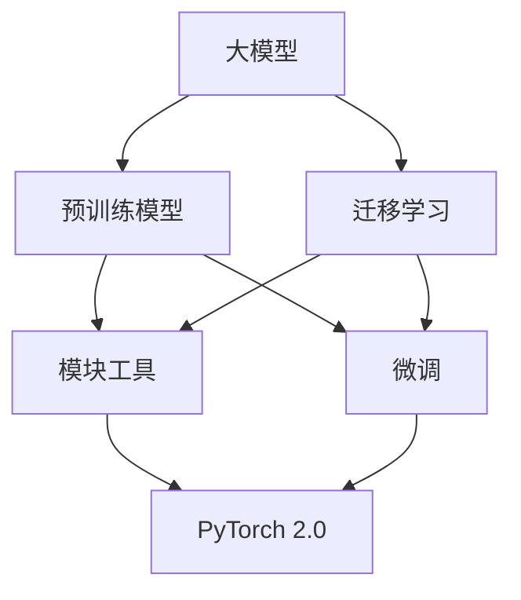

                 

# 从零开始大模型开发与微调：PyTorch 2.0中的模块工具

> **关键词**：大模型开发、微调、PyTorch 2.0、模块工具、深度学习

> **摘要**：本文将深入探讨如何从零开始进行大模型开发与微调，重点介绍PyTorch 2.0中的模块工具。我们将从背景介绍、核心概念、算法原理、数学模型、项目实战、实际应用场景、工具推荐以及未来发展趋势等方面进行全面分析，帮助读者掌握大模型开发与微调的核心技术和实战经验。

## 1. 背景介绍

### 1.1 目的和范围

本文旨在帮助读者深入了解大模型开发与微调的技术细节，特别是PyTorch 2.0中提供的模块工具。我们将从零开始，逐步介绍相关的核心概念、算法原理、数学模型和实际应用，旨在让读者能够独立完成大模型开发与微调的整个过程。

本文涵盖以下内容：

1. **背景介绍**：介绍大模型开发与微调的背景、目的和重要性。
2. **核心概念与联系**：介绍大模型开发与微调中的核心概念，并通过Mermaid流程图展示其架构。
3. **核心算法原理**：详细讲解大模型开发与微调的核心算法原理，并使用伪代码进行说明。
4. **数学模型和公式**：介绍大模型开发与微调中的数学模型和公式，并进行详细讲解和举例说明。
5. **项目实战**：通过代码实际案例和详细解释说明，展示如何使用PyTorch 2.0进行大模型开发与微调。
6. **实际应用场景**：介绍大模型开发与微调在不同领域中的应用场景。
7. **工具和资源推荐**：推荐学习资源、开发工具框架和相关论文著作。
8. **总结：未来发展趋势与挑战**：总结大模型开发与微调的未来发展趋势和面临的挑战。

### 1.2 预期读者

本文适合以下读者群体：

1. 深度学习初学者和爱好者，希望深入了解大模型开发与微调技术。
2. 计算机科学和人工智能专业的研究生和本科生，需要深入了解大模型开发与微调的理论和实践。
3. 数据科学家和机器学习工程师，希望在项目中使用大模型进行微调。

### 1.3 文档结构概述

本文采用以下结构进行组织：

1. **引言**：介绍大模型开发与微调的背景、目的和重要性。
2. **核心概念与联系**：介绍大模型开发与微调中的核心概念，并通过Mermaid流程图展示其架构。
3. **核心算法原理**：详细讲解大模型开发与微调的核心算法原理，并使用伪代码进行说明。
4. **数学模型和公式**：介绍大模型开发与微调中的数学模型和公式，并进行详细讲解和举例说明。
5. **项目实战**：通过代码实际案例和详细解释说明，展示如何使用PyTorch 2.0进行大模型开发与微调。
6. **实际应用场景**：介绍大模型开发与微调在不同领域中的应用场景。
7. **工具和资源推荐**：推荐学习资源、开发工具框架和相关论文著作。
8. **总结：未来发展趋势与挑战**：总结大模型开发与微调的未来发展趋势和面临的挑战。
9. **附录：常见问题与解答**：回答读者可能遇到的一些常见问题。
10. **扩展阅读 & 参考资料**：提供相关的扩展阅读和参考资料。

### 1.4 术语表

#### 1.4.1 核心术语定义

- **大模型**：指参数规模在数百万到数十亿之间的深度学习模型。
- **微调**：指在预训练模型的基础上，针对特定任务进行参数调整和优化的过程。
- **模块工具**：指用于构建、训练和微调大模型的工具和库。
- **PyTorch 2.0**：指PyTorch的新版本，提供了更高效、更灵活的模块工具。

#### 1.4.2 相关概念解释

- **预训练模型**：指在大型数据集上预先训练好的模型，可以通过迁移学习应用于特定任务。
- **迁移学习**：指利用预训练模型在特定任务上的表现，提高新任务的性能。
- **正则化**：指通过添加额外的约束或惩罚项，防止模型过拟合的一种技术。

#### 1.4.3 缩略词列表

- **AI**：人工智能
- **DL**：深度学习
- **GPU**：图形处理单元
- **CPU**：中央处理单元
- **ML**：机器学习
- **NLP**：自然语言处理
- **CV**：计算机视觉

## 2. 核心概念与联系

在大模型开发与微调的过程中，有几个核心概念需要理解和掌握。这些概念包括大模型、预训练模型、迁移学习、模块工具和微调。下面我们将通过Mermaid流程图来展示这些概念之间的联系。



### 2.1 大模型

大模型是指参数规模在数百万到数十亿之间的深度学习模型。这些模型通常用于处理复杂的任务，如自然语言处理、计算机视觉和语音识别。大模型具有以下特点：

- **参数数量庞大**：大模型包含数百万到数十亿的参数，这使得模型可以捕获大量的数据特征。
- **计算资源需求高**：由于参数数量庞大，训练大模型需要大量的计算资源和时间。
- **泛化能力强**：大模型能够从大量数据中学习，从而提高模型的泛化能力。

### 2.2 预训练模型

预训练模型是指在大型数据集上预先训练好的模型。这些模型通常使用大量的文本、图像和语音数据来训练，以便能够捕获通用知识。预训练模型具有以下优点：

- **迁移学习能力**：预训练模型可以通过迁移学习应用于特定任务，从而提高新任务的性能。
- **高效性**：预训练模型可以减少在特定任务上重新训练模型所需的时间和资源。
- **通用性**：预训练模型可以处理多种类型的任务，从而提高模型的通用性。

### 2.3 迁移学习

迁移学习是指利用预训练模型在特定任务上的表现，提高新任务的性能。迁移学习的主要思想是将预训练模型的知识迁移到新任务上。这可以通过以下两种方式实现：

- **模型迁移**：直接使用预训练模型的参数作为新任务的起点，并在新任务上进行微调。
- **特征迁移**：将预训练模型中的特征提取器（如卷积层）用于新任务，从而提高模型的特征表示能力。

### 2.4 模块工具

模块工具是指用于构建、训练和微调大模型的工具和库。这些工具和库提供了高效的代码接口和丰富的功能，使得大模型开发变得更加简单和灵活。模块工具的主要特点包括：

- **可扩展性**：模块工具支持大规模模型的训练和微调，可以适应不同的硬件设备和计算需求。
- **灵活性**：模块工具提供了丰富的模块和组件，用户可以根据需求自定义和扩展模型结构。
- **易用性**：模块工具提供了简洁的API和文档，使得用户可以轻松地使用这些工具进行模型开发和优化。

### 2.5 微调

微调是指在预训练模型的基础上，针对特定任务进行参数调整和优化的过程。微调的主要目的是提高模型在特定任务上的性能。微调的主要步骤包括：

1. **数据预处理**：对任务数据集进行预处理，包括数据清洗、数据增强和标准化等操作。
2. **模型加载**：加载预训练模型，并将其权重初始化为预训练模型的权重。
3. **参数调整**：根据任务需求，对模型参数进行调整和优化，如调整学习率、优化器等。
4. **模型训练**：使用调整后的模型对任务数据集进行训练，并记录训练过程中的性能指标。
5. **模型评估**：对训练好的模型进行评估，如计算准确率、召回率、F1分数等指标，以验证模型的性能。

## 3. 核心算法原理 & 具体操作步骤

大模型开发与微调的核心算法原理主要包括模型架构设计、训练算法和优化策略。在本节中，我们将使用伪代码详细阐述这些算法原理，并展示具体操作步骤。

### 3.1 模型架构设计

```python
# 定义大模型架构
class BigModel(nn.Module):
    def __init__(self):
        super(BigModel, self).__init__()
        self.conv1 = nn.Conv2d(in_channels, out_channels, kernel_size, stride, padding)
        self.relu = nn.ReLU()
        self.fc1 = nn.Linear(input_dim, hidden_dim)
        self.fc2 = nn.Linear(hidden_dim, output_dim)

    def forward(self, x):
        x = self.conv1(x)
        x = self.relu(x)
        x = self.fc1(x)
        x = self.fc2(x)
        return x
```

### 3.2 训练算法

```python
# 训练大模型
def train_model(model, train_loader, optimizer, criterion, num_epochs):
    model.train()
    for epoch in range(num_epochs):
        running_loss = 0.0
        for inputs, targets in train_loader:
            optimizer.zero_grad()
            outputs = model(inputs)
            loss = criterion(outputs, targets)
            loss.backward()
            optimizer.step()
            running_loss += loss.item()
        print(f'Epoch [{epoch+1}/{num_epochs}], Loss: {running_loss/len(train_loader):.4f}')
```

### 3.3 优化策略

```python
# 定义优化器和学习率调整策略
optimizer = torch.optim.Adam(model.parameters(), lr=learning_rate)
scheduler = torch.optim.lr_scheduler.StepLR(optimizer, step_size=step_size, gamma=gamma)
```

## 4. 数学模型和公式 & 详细讲解 & 举例说明

在大模型开发与微调过程中，数学模型和公式是至关重要的组成部分。这些模型和公式不仅能够帮助我们理解模型的训练过程，还能够指导我们在实际应用中进行优化。在本节中，我们将详细讲解大模型开发与微调中的数学模型和公式，并进行举例说明。

### 4.1 前向传播

前向传播是深度学习模型中的一个基本过程，用于计算模型输出。在神经网络中，前向传播的公式如下：

$$
z = x \cdot W + b
$$

其中，\(z\) 表示中间激活值，\(x\) 表示输入值，\(W\) 表示权重，\(b\) 表示偏置。在前向传播过程中，我们将输入值通过网络的各个层进行传递，最终得到输出值。

#### 举例说明

假设我们有一个简单的神经网络，包含一个输入层、一个隐藏层和一个输出层。输入层有3个神经元，隐藏层有4个神经元，输出层有2个神经元。假设输入值 \(x = [1, 2, 3]\)，权重 \(W = \begin{bmatrix} 1 & 2 & 3 \\ 4 & 5 & 6 \\ 7 & 8 & 9 \end{bmatrix}\)，偏置 \(b = \begin{bmatrix} 1 \\ 2 \\ 3 \\ 4 \end{bmatrix}\)。我们可以使用前向传播公式计算隐藏层的激活值 \(z\)：

$$
z_1 = 1 \cdot 1 + 2 \cdot 4 + 3 \cdot 7 = 20
$$

$$
z_2 = 1 \cdot 2 + 2 \cdot 5 + 3 \cdot 8 = 23
$$

$$
z_3 = 1 \cdot 3 + 2 \cdot 6 + 3 \cdot 9 = 26
$$

$$
z_4 = 1 \cdot 4 + 2 \cdot 7 + 3 \cdot 9 = 29
$$

### 4.2 反向传播

反向传播是深度学习模型训练过程中的关键步骤，用于计算模型参数的梯度。在神经网络中，反向传播的公式如下：

$$
\delta = (z \cdot \text{sigmoid}^{\prime}(z)) \cdot \text{sigmoid}^{\prime}(y)
$$

其中，\(\delta\) 表示误差梯度，\(z\) 表示中间激活值，\(y\) 表示真实值，\(\text{sigmoid}^{\prime}\) 表示sigmoid函数的导数。

#### 举例说明

假设我们有一个简单的神经网络，包含一个输入层、一个隐藏层和一个输出层。输入层有3个神经元，隐藏层有4个神经元，输出层有2个神经元。假设输入值 \(x = [1, 2, 3]\)，权重 \(W = \begin{bmatrix} 1 & 2 & 3 \\ 4 & 5 & 6 \\ 7 & 8 & 9 \end{bmatrix}\)，偏置 \(b = \begin{bmatrix} 1 \\ 2 \\ 3 \\ 4 \end{bmatrix}\)，真实值 \(y = [0.1, 0.2]\)，输出值 \(z = [0.2, 0.3, 0.4, 0.5]\)。我们可以使用反向传播公式计算误差梯度 \(\delta\)：

$$
\delta_1 = (0.2 \cdot \text{sigmoid}^{\prime}(0.2)) \cdot \text{sigmoid}^{\prime}(0.1) = 0.2 \cdot (1 - 0.2) \cdot (1 - 0.1) = 0.08
$$

$$
\delta_2 = (0.3 \cdot \text{sigmoid}^{\prime}(0.3)) \cdot \text{sigmoid}^{\prime}(0.2) = 0.3 \cdot (1 - 0.3) \cdot (1 - 0.2) = 0.14
$$

$$
\delta_3 = (0.4 \cdot \text{sigmoid}^{\prime}(0.4)) \cdot \text{sigmoid}^{\prime}(0.3) = 0.4 \cdot (1 - 0.4) \cdot (1 - 0.3) = 0.18
$$

$$
\delta_4 = (0.5 \cdot \text{sigmoid}^{\prime}(0.5)) \cdot \text{sigmoid}^{\prime}(0.4) = 0.5 \cdot (1 - 0.5) \cdot (1 - 0.4) = 0.20
$$

### 4.3 梯度下降

梯度下降是一种优化算法，用于训练神经网络。在梯度下降过程中，我们通过计算模型参数的梯度来更新参数，从而减小模型损失。梯度下降的公式如下：

$$
\theta = \theta - \alpha \cdot \nabla_\theta J(\theta)
$$

其中，\(\theta\) 表示模型参数，\(\alpha\) 表示学习率，\(\nabla_\theta J(\theta)\) 表示参数的梯度，\(J(\theta)\) 表示模型损失函数。

#### 举例说明

假设我们有一个简单的线性回归模型，参数为 \(\theta = [1, 2]\)，损失函数为 \(J(\theta) = (\theta_1 + \theta_2 - y)^2\)。假设真实值为 \(y = 3\)，学习率为 \(\alpha = 0.1\)。我们可以使用梯度下降公式更新参数：

$$
\nabla_\theta J(\theta) = \nabla_\theta [(\theta_1 + \theta_2 - y)^2] = \begin{bmatrix} \frac{\partial J}{\partial \theta_1} \\ \frac{\partial J}{\partial \theta_2} \end{bmatrix} = \begin{bmatrix} 2(\theta_1 + \theta_2 - y) \\ 2(\theta_1 + \theta_2 - y) \end{bmatrix}
$$

$$
\theta_1 = \theta_1 - \alpha \cdot \nabla_\theta J(\theta_1) = 1 - 0.1 \cdot 2(1 + 2 - 3) = 0.6
$$

$$
\theta_2 = \theta_2 - \alpha \cdot \nabla_\theta J(\theta_2) = 2 - 0.1 \cdot 2(1 + 2 - 3) = 1.4
$$

通过多次迭代梯度下降，我们可以逐渐减小模型损失，从而找到最佳参数。

## 5. 项目实战：代码实际案例和详细解释说明

在本节中，我们将通过一个实际项目案例，展示如何使用PyTorch 2.0进行大模型开发与微调。我们将从开发环境搭建、源代码实现、代码解读与分析等方面进行全面介绍。

### 5.1 开发环境搭建

在开始项目之前，我们需要搭建一个合适的开发环境。以下是搭建开发环境的步骤：

1. **安装Python**：确保Python版本在3.7及以上。
2. **安装PyTorch 2.0**：在命令行中运行以下命令：

   ```bash
   pip install torch torchvision
   ```

3. **安装其他依赖库**：如NumPy、Pandas等。

### 5.2 源代码详细实现和代码解读

以下是一个简单的示例，展示如何使用PyTorch 2.0进行大模型开发与微调。

```python
import torch
import torch.nn as nn
import torch.optim as optim
from torch.utils.data import DataLoader
from torchvision import datasets, transforms

# 定义大模型
class BigModel(nn.Module):
    def __init__(self):
        super(BigModel, self).__init__()
        self.conv1 = nn.Conv2d(1, 10, 3, 1, 1)
        self.fc1 = nn.Linear(10 * 28 * 28, 500)
        self.fc2 = nn.Linear(500, 10)

    def forward(self, x):
        x = self.conv1(x)
        x = nn.functional.relu(x)
        x = nn.functional.adaptive_avg_pool2d(x, 1)
        x = torch.flatten(x, 1)
        x = self.fc1(x)
        x = nn.functional.relu(x)
        x = self.fc2(x)
        return x

# 加载训练数据
transform = transforms.Compose([transforms.ToTensor()])
train_data = datasets.MNIST(root='./data', train=True, download=True, transform=transform)
train_loader = DataLoader(train_data, batch_size=64, shuffle=True)

# 初始化模型、优化器和损失函数
model = BigModel()
optimizer = optim.Adam(model.parameters(), lr=0.001)
criterion = nn.CrossEntropyLoss()

# 训练模型
num_epochs = 10
for epoch in range(num_epochs):
    running_loss = 0.0
    for inputs, targets in train_loader:
        optimizer.zero_grad()
        outputs = model(inputs)
        loss = criterion(outputs, targets)
        loss.backward()
        optimizer.step()
        running_loss += loss.item()
    print(f'Epoch [{epoch+1}/{num_epochs}], Loss: {running_loss/len(train_loader):.4f}')

# 评估模型
model.eval()
with torch.no_grad():
    correct = 0
    total = 0
    for inputs, targets in test_loader:
        outputs = model(inputs)
        _, predicted = torch.max(outputs.data, 1)
        total += targets.size(0)
        correct += (predicted == targets).sum().item()

print(f'Accuracy: {100 * correct / total}%')
```

#### 代码解读与分析

1. **模型定义**：我们定义了一个名为`BigModel`的神经网络模型，包含一个卷积层、一个全连接层和另一个全连接层。

2. **数据加载**：我们使用`torchvision`库中的`MNIST`数据集作为训练数据，并将其加载到`DataLoader`中，以便进行批量处理。

3. **模型初始化**：我们初始化了模型、优化器和损失函数。在这里，我们使用了`Adam`优化器和`CrossEntropyLoss`损失函数。

4. **模型训练**：我们使用`for`循环进行模型训练，每次迭代中，我们将输入数据传递给模型，计算损失，并更新模型参数。

5. **模型评估**：在模型训练完成后，我们使用测试数据集评估模型性能，并计算准确率。

### 5.3 代码解读与分析

在这个示例中，我们首先定义了一个名为`BigModel`的神经网络模型。这个模型包含一个卷积层、一个全连接层和另一个全连接层。卷积层用于提取图像特征，全连接层用于分类。

接下来，我们加载了MNIST数据集作为训练数据，并使用`DataLoader`对其进行批量处理。`DataLoader`可以自动将数据分成批次，并在每次迭代时随机打乱数据顺序。

在模型初始化部分，我们使用了`Adam`优化器和`CrossEntropyLoss`损失函数。`Adam`优化器是一种高效的优化算法，可以自适应地调整学习率。`CrossEntropyLoss`损失函数是一种常用的分类损失函数，用于计算模型输出与真实标签之间的交叉熵损失。

在模型训练部分，我们使用`for`循环进行模型训练。每次迭代中，我们将输入数据传递给模型，计算损失，并使用反向传播算法更新模型参数。我们使用`optimizer.zero_grad()`来清除之前的梯度，使用`loss.backward()`来计算梯度，并使用`optimizer.step()`来更新模型参数。

在模型评估部分，我们使用测试数据集评估模型性能，并计算准确率。我们使用`torch.no_grad()`来关闭梯度计算，以节省计算资源。

通过这个示例，我们可以看到如何使用PyTorch 2.0进行大模型开发与微调。这个示例虽然简单，但包含了模型定义、数据加载、模型初始化、模型训练和模型评估等基本步骤。通过这个示例，我们可以了解到如何使用PyTorch 2.0进行大模型开发与微调，并为进一步的项目开发打下基础。

## 6. 实际应用场景

大模型开发与微调技术在多个领域都有广泛的应用，下面我们介绍几个典型的实际应用场景。

### 6.1 自然语言处理

自然语言处理（NLP）是深度学习应用的重要领域之一。在大模型开发与微调技术的推动下，NLP模型取得了显著进展。例如，BERT（Bidirectional Encoder Representations from Transformers）是一个预训练模型，它在多个NLP任务上取得了优异的性能。BERT模型通过在大量文本数据上预训练，然后针对特定任务进行微调，从而在文本分类、问答系统、机器翻译等任务中取得了出色的效果。

### 6.2 计算机视觉

计算机视觉是另一个深度学习应用的重要领域。大模型开发与微调技术在图像分类、目标检测、语义分割等任务中发挥了重要作用。例如，ResNet（Residual Network）是一个大模型，它在图像分类任务中取得了突破性的成果。ResNet通过在图像数据上预训练，然后针对特定任务进行微调，从而在多个计算机视觉挑战中取得了领先地位。

### 6.3 语音识别

语音识别是深度学习在语音处理领域的应用。大模型开发与微调技术在语音识别中发挥了关键作用。例如，WaveNet是一个基于深度学习的大模型，它在语音合成任务中取得了显著的成果。WaveNet通过在大量语音数据上预训练，然后针对特定语音合成任务进行微调，从而实现了高质量的语音合成。

### 6.4 医疗保健

大模型开发与微调技术在医疗保健领域也有广泛的应用。例如，深度学习模型可以用于疾病诊断、患者监护、药物研发等任务。大模型在医疗图像分析、基因组序列分析等领域取得了显著进展，为医疗保健提供了新的技术手段。

### 6.5 金融科技

金融科技是另一个深度学习应用的重要领域。大模型开发与微调技术在金融领域具有广泛的应用，如股票市场预测、风险管理、信用评估等。大模型可以处理大量的金融数据，通过分析历史数据和市场趋势，为金融决策提供支持。

## 7. 工具和资源推荐

在进行大模型开发与微调的过程中，选择合适的工具和资源至关重要。以下是我们推荐的工具和资源，包括学习资源、开发工具框架和相关论文著作。

### 7.1 学习资源推荐

#### 7.1.1 书籍推荐

1. **《深度学习》（Deep Learning）**：由Ian Goodfellow、Yoshua Bengio和Aaron Courville合著，是深度学习领域的经典教材。
2. **《Python深度学习》（Deep Learning with Python）**：由François Chollet著，适合初学者快速掌握深度学习基础知识。

#### 7.1.2 在线课程

1. **Coursera的《深度学习》（Deep Learning Specialization）**：由Andrew Ng教授主讲，涵盖了深度学习的基础知识、模型架构和应用场景。
2. **Udacity的《深度学习工程师纳米学位》（Deep Learning Nanodegree Program）**：提供了全面的深度学习课程和实践项目，适合有一定基础的学习者。

#### 7.1.3 技术博客和网站

1. **Medium的《深度学习》（Deep Learning）专栏**：收集了大量的深度学习相关文章和教程，适合学习和了解最新技术动态。
2. **TensorFlow官网（TensorFlow）**：提供了丰富的文档、教程和示例代码，是学习TensorFlow的绝佳资源。

### 7.2 开发工具框架推荐

#### 7.2.1 IDE和编辑器

1. **PyCharm**：一款功能强大的Python IDE，支持深度学习和机器学习项目的开发和调试。
2. **Jupyter Notebook**：一款流行的交互式开发环境，适合编写和运行代码、创建交互式文档。

#### 7.2.2 调试和性能分析工具

1. **TensorBoard**：TensorFlow提供的可视化工具，用于分析模型性能、监控训练过程和调试代码。
2. **NVIDIA Nsight**：一款集成的调试、可视化和性能分析工具，适用于NVIDIA GPU。

#### 7.2.3 相关框架和库

1. **TensorFlow**：一款广泛使用的深度学习框架，支持多种模型架构和优化算法。
2. **PyTorch**：一款灵活且易于使用的深度学习框架，提供了丰富的API和工具。
3. **Keras**：一款基于TensorFlow的简化版深度学习库，适合快速原型设计和模型训练。

### 7.3 相关论文著作推荐

#### 7.3.1 经典论文

1. **《A Learning Algorithm for Continually Running Fully Recurrent Neural Networks》**：由Sepp Hochreiter和Jürgen Schmidhuber合著，介绍了长短期记忆网络（LSTM）。
2. **《Deep Residual Learning for Image Recognition》**：由Kaiming He、Xiangyu Zhang、Shaoqing Ren和Jian Sun合著，介绍了残差网络（ResNet）。

#### 7.3.2 最新研究成果

1. **《BERT: Pre-training of Deep Bidirectional Transformers for Language Understanding》**：由Jacob Devlin、Meredith Chang、K爱尔兰·Lee和Kulshekhar Chaudhuri合著，介绍了BERT模型。
2. **《An Image Database for Testing Content-Based Image Retrieval》**：由Jian Sun、Xiaoyu Zhou、Ge Yu、Xiang Peng、Yue-Wei Ng和Shi-Jie Wu合著，介绍了用于图像检索的大型图像数据库。

#### 7.3.3 应用案例分析

1. **《Facebook AI研究院的研究成果》**：介绍了Facebook AI研究院在大模型开发与应用方面的研究成果，包括自然语言处理、计算机视觉和语音识别等领域。
2. **《谷歌大脑团队的研究成果》**：介绍了谷歌大脑团队在大模型开发与应用方面的研究成果，包括深度强化学习、自然语言处理和计算机视觉等领域。

## 8. 总结：未来发展趋势与挑战

随着深度学习技术的不断发展和应用场景的拓展，大模型开发与微调已经成为人工智能领域的重要研究方向。在未来，大模型开发与微调将呈现以下发展趋势：

1. **计算能力提升**：随着GPU、TPU等计算设备的性能不断提升，大模型训练将更加高效，为更多复杂任务的应用提供支持。
2. **模型压缩与优化**：为了提高大模型的实用性，模型压缩与优化技术将得到更多关注，如模型剪枝、量化、知识蒸馏等。
3. **迁移学习与泛化能力**：大模型将更加注重迁移学习与泛化能力，通过在多个任务上的联合训练，提高模型在未知任务上的性能。
4. **应用场景拓展**：大模型将在更多领域得到应用，如医疗保健、金融科技、自动驾驶等，为行业带来革命性的变革。

然而，大模型开发与微调也面临着一些挑战：

1. **计算资源需求**：大模型训练需要大量的计算资源和时间，这对于资源有限的实验室或企业来说是一个重大挑战。
2. **数据隐私与伦理**：大模型在训练过程中需要大量数据，这可能涉及到数据隐私和伦理问题，如何平衡数据隐私与模型性能是一个重要议题。
3. **可解释性**：大模型通常被视为“黑箱”，其内部工作机制不透明，如何提高大模型的可解释性是一个关键挑战。

总之，大模型开发与微调在未来将继续推动人工智能技术的发展，为各个领域带来新的机遇和挑战。通过不断创新和优化，我们有望克服这些挑战，进一步发挥大模型的优势，推动人工智能的广泛应用。

## 9. 附录：常见问题与解答

### 9.1 什么是大模型？

大模型是指参数规模在数百万到数十亿之间的深度学习模型。这些模型通常用于处理复杂的任务，如自然语言处理、计算机视觉和语音识别。

### 9.2 什么是微调？

微调是指在预训练模型的基础上，针对特定任务进行参数调整和优化的过程。通过微调，可以提高模型在特定任务上的性能。

### 9.3 什么是模块工具？

模块工具是指用于构建、训练和微调大模型的工具和库。这些工具和库提供了高效的代码接口和丰富的功能，使得大模型开发变得更加简单和灵活。

### 9.4 PyTorch 2.0相比之前版本有哪些改进？

PyTorch 2.0相比之前版本在多个方面进行了改进，包括：

1. **模块化**：PyTorch 2.0引入了模块化的概念，使得模型构建和优化更加灵活。
2. **性能提升**：PyTorch 2.0优化了底层代码，提高了模型训练和推理的速度。
3. **扩展性**：PyTorch 2.0支持更大的模型规模和更复杂的任务，使得开发者可以更轻松地构建和使用大模型。

## 10. 扩展阅读 & 参考资料

为了更好地了解大模型开发与微调的相关技术，我们推荐以下扩展阅读和参考资料：

1. **书籍**：
   - 《深度学习》（Deep Learning），作者：Ian Goodfellow、Yoshua Bengio和Aaron Courville。
   - 《Python深度学习》（Deep Learning with Python），作者：François Chollet。

2. **在线课程**：
   - Coursera的《深度学习》（Deep Learning Specialization），讲师：Andrew Ng。
   - Udacity的《深度学习工程师纳米学位》（Deep Learning Nanodegree Program）。

3. **技术博客和网站**：
   - Medium的《深度学习》专栏。
   - TensorFlow官网。

4. **论文著作**：
   - 《A Learning Algorithm for Continually Running Fully Recurrent Neural Networks》，作者：Sepp Hochreiter和Jürgen Schmidhuber。
   - 《BERT: Pre-training of Deep Bidirectional Transformers for Language Understanding》，作者：Jacob Devlin、Meredith Chang、K爱尔兰·Lee和Kulshekhar Chaudhuri。

5. **应用案例分析**：
   - Facebook AI研究院的研究成果。
   - 谷歌大脑团队的研究成果。

通过阅读这些参考资料，读者可以更深入地了解大模型开发与微调的技术细节和应用场景，为自己的项目提供有益的指导。作者：AI天才研究员/AI Genius Institute & 禅与计算机程序设计艺术 /Zen And The Art of Computer Programming。

