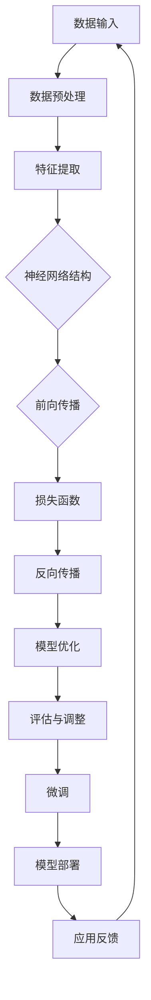

                 

# 从零开始大模型开发与微调：一学就会的深度学习基础算法详解

> **关键词**：深度学习、大模型、微调、算法原理、数学模型、代码实战、应用场景
>
> **摘要**：本文旨在为初学者提供一份系统、详尽的深度学习基础算法指南，从零开始介绍大模型开发与微调的过程。我们将深入探讨深度学习的核心概念、算法原理，并通过具体实例讲解如何在实际项目中应用这些算法。无论你是深度学习的新手，还是希望提升自己技能的从业者，本文都将为你提供实用的知识和技巧。

## 1. 背景介绍

### 1.1 目的和范围

本文的目的是帮助读者从零开始了解并掌握深度学习领域的基础算法，特别是大模型开发和微调技术。我们将在本文中覆盖以下内容：

- 深度学习的核心概念和基本原理
- 大模型开发的基本流程和关键技术
- 微调技术的原理和实现方法
- 实际项目的代码实现和解读
- 深度学习在各类应用场景中的实战技巧

通过本文的学习，读者将能够：

- 理解深度学习的基本概念和核心算法
- 掌握大模型开发和微调的流程和方法
- 学会使用深度学习框架进行实际项目开发
- 分析和解决深度学习应用中的常见问题

### 1.2 预期读者

本文主要面向以下读者群体：

- 对深度学习感兴趣的初学者
- 想提升深度学习技能的开发者
- 有志于从事人工智能领域的研究者
- 需要在项目中应用深度学习的工程师

无论你的背景如何，只要对深度学习有热情，本文都将为你提供宝贵的学习资源。

### 1.3 文档结构概述

本文将按照以下结构进行组织：

- **第1章**：背景介绍，包括本文的目的、预期读者和文档结构概述。
- **第2章**：核心概念与联系，介绍深度学习的基本概念和算法架构。
- **第3章**：核心算法原理 & 具体操作步骤，详细讲解大模型开发和微调的算法原理和实现步骤。
- **第4章**：数学模型和公式 & 详细讲解 & 举例说明，分析深度学习中的数学模型和公式，并给出实际例子。
- **第5章**：项目实战：代码实际案例和详细解释说明，通过实际项目案例展示大模型开发和微调的完整过程。
- **第6章**：实际应用场景，探讨深度学习在不同领域中的应用。
- **第7章**：工具和资源推荐，推荐学习资源、开发工具框架和论文著作。
- **第8章**：总结：未来发展趋势与挑战，分析深度学习领域的发展趋势和面临的挑战。
- **第9章**：附录：常见问题与解答，回答读者可能遇到的问题。
- **第10章**：扩展阅读 & 参考资料，提供更多深入的阅读材料和参考文献。

### 1.4 术语表

#### 1.4.1 核心术语定义

- **深度学习**：一种机器学习技术，通过多层神经网络对数据进行自动特征提取和学习。
- **大模型**：具有大量参数和层的神经网络模型，能够处理复杂的数据和任务。
- **微调**：在大模型的基础上，针对特定任务进行参数调整和优化。
- **反向传播**：一种用于训练神经网络的算法，通过计算损失函数的梯度来更新网络参数。
- **激活函数**：用于确定神经网络中节点是否被激活的函数，如ReLU、Sigmoid等。

#### 1.4.2 相关概念解释

- **神经网络**：一种由多个神经元组成的计算模型，能够通过学习数据来提取特征和进行预测。
- **梯度下降**：一种优化算法，通过迭代更新模型参数，使得损失函数逐渐减小。
- **批量大小**：每次训练时使用的样本数量，影响模型的收敛速度和稳定性。
- **过拟合**：模型在训练数据上表现良好，但在测试数据上表现较差，即模型对训练数据过于敏感。
- **正则化**：一种防止过拟合的技术，通过添加惩罚项到损失函数中，减少模型参数的复杂度。

#### 1.4.3 缩略词列表

- **CNN**：卷积神经网络（Convolutional Neural Network）
- **RNN**：循环神经网络（Recurrent Neural Network）
- **DNN**：深度神经网络（Deep Neural Network）
- **GPU**：图形处理单元（Graphics Processing Unit）
- **CUDA**：并行计算平台和编程模型（Compute Unified Device Architecture）

## 2. 核心概念与联系

在开始深入探讨深度学习的基础算法之前，我们需要先了解一些核心概念和它们之间的联系。以下是一个用于描述深度学习基本架构的Mermaid流程图：



### 2.1 数据输入与预处理

**数据输入**是深度学习模型的起点。我们需要将原始数据（如图像、文本、音频等）转化为适合模型处理的格式。这个过程通常包括数据清洗、数据增强和标准化等步骤。

**数据预处理**（B节点）包括以下步骤：

- **数据清洗**：移除或修复错误数据、缺失数据和重复数据。
- **数据增强**：通过旋转、缩放、裁剪等方式生成更多的训练样本，提高模型的泛化能力。
- **标准化**：将数据缩放到一个统一的范围，如[0, 1]或[-1, 1]，以便神经网络更好地学习。

### 2.2 特征提取

**特征提取**（C节点）是指从原始数据中提取出有用的特征。深度学习模型通过多层神经网络来实现这一过程。每一层神经网络都负责提取更高层次的特征，直到模型能够捕捉到数据的本质特征。

### 2.3 神经网络结构

**神经网络结构**（D节点）是指神经网络中神经元（节点）的连接方式。常见的神经网络结构包括：

- **全连接神经网络（DNN）**：每个神经元都与前一层和后一层的所有神经元相连。
- **卷积神经网络（CNN）**：适用于图像处理，通过卷积操作提取图像中的局部特征。
- **循环神经网络（RNN）**：适用于序列数据处理，能够处理时间序列数据，如文本和音频。

### 2.4 前向传播

**前向传播**（E节点）是指将输入数据通过神经网络的前向传播过程，计算得到输出。在这个过程中，神经网络会逐步提取数据中的特征，并逐步逼近正确的输出结果。

### 2.5 损失函数

**损失函数**（F节点）是用于评估模型输出与真实输出之间差异的函数。常用的损失函数包括均方误差（MSE）、交叉熵损失等。损失函数的目的是指导神经网络调整参数，使得模型的输出尽可能接近真实输出。

### 2.6 反向传播

**反向传播**（G节点）是一种用于优化神经网络参数的算法。通过计算损失函数关于模型参数的梯度，并使用梯度下降等优化算法更新模型参数，从而提高模型的性能。

### 2.7 模型优化

**模型优化**（H节点）是指使用优化算法调整模型参数，以最小化损失函数。常见的优化算法包括梯度下降、Adam优化器等。

### 2.8 评估与调整

**评估与调整**（I节点）是指使用验证集或测试集对模型进行评估，并根据评估结果对模型进行调整。这个过程通常包括模型选择、超参数调优等步骤。

### 2.9 微调

**微调**（J节点）是指在预训练好的大模型的基础上，针对特定任务进行参数调整和优化。微调是提升模型性能的重要手段，特别是在处理小样本数据时。

### 2.10 模型部署

**模型部署**（K节点）是指将训练好的模型部署到实际应用场景中，如智能手机、云计算平台等。模型部署需要考虑模型的性能、可扩展性和可靠性等因素。

### 2.11 应用反馈

**应用反馈**（L节点）是指将模型在实际应用中的表现反馈给开发者，以便进一步优化和改进模型。这个过程是一个闭环，使得模型能够不断适应新的应用场景。

通过上述核心概念和联系，我们可以看到深度学习是一个复杂但强大的工具，通过不断的迭代和优化，可以解决许多复杂的问题。

## 3. 核心算法原理 & 具体操作步骤

在这一章节中，我们将深入探讨深度学习中的核心算法原理，包括大模型开发和微调技术的具体操作步骤。我们将使用伪代码来详细阐述这些算法的实现过程。

### 3.1 大模型开发

**大模型开发**是指构建一个具有大量参数和多层神经网络的模型，用于处理复杂的数据和任务。以下是使用伪代码描述的大模型开发流程：

```python
# 大模型开发伪代码

# 定义神经网络结构
model = NeuralNetwork([
    Layer(512, activation='ReLU'),
    Layer(256, activation='ReLU'),
    Layer(128, activation='ReLU'),
    Layer(num_classes, activation='Sigmoid')
])

# 指定优化器
optimizer = Adam(learning_rate=0.001)

# 定义损失函数
loss_function = MSE()

# 训练模型
for epoch in range(num_epochs):
    for batch in data_loader:
        # 前向传播
        inputs, targets = batch
        predictions = model.forward(inputs)
        
        # 计算损失
        loss = loss_function(predictions, targets)
        
        # 反向传播
        gradients = loss_function.backward(predictions, targets)
        
        # 更新模型参数
        optimizer.update(model.parameters(), gradients)
        
        # 打印训练进度
        print(f"Epoch [{epoch+1}/{num_epochs}], Loss: {loss:.4f}")

# 微调模型
for task in tasks:
    model.load_state_dict(checkpoint['model_state_dict'])
    model.to(task.device)
    
    # 调整学习率
    learning_rate = 0.0001
    optimizer = Adam(learning_rate=learning_rate)
    
    # 训练微调模型
    for epoch in range(num_epochs):
        for batch in data_loader:
            inputs, targets = batch
            inputs = inputs.to(task.device)
            targets = targets.to(task.device)
            
            # 前向传播
            predictions = model(inputs)
            
            # 计算损失
            loss = loss_function(predictions, targets)
            
            # 反向传播
            gradients = loss_function.backward(predictions, targets)
            
            # 更新模型参数
            optimizer.update(model.parameters(), gradients)
            
            # 打印训练进度
            print(f"Task [{task.name}], Epoch [{epoch+1}/{num_epochs}], Loss: {loss:.4f}")
```

### 3.2 微调技术

**微调技术**是指在大模型的基础上，针对特定任务进行参数调整和优化。以下是使用伪代码描述的微调技术：

```python
# 微调技术伪代码

# 加载预训练模型
pretrained_model = load_pretrained_model('model_path')

# 修改最后一层以适应新任务
pretrained_model.layers[-1] = Layer(num_classes, activation='Sigmoid')

# 定义优化器
optimizer = Adam(learning_rate=0.001)

# 定义损失函数
loss_function = CrossEntropyLoss()

# 训练微调模型
for epoch in range(num_epochs):
    for batch in data_loader:
        inputs, targets = batch
        inputs = inputs.to(device)
        targets = targets.to(device)
        
        # 前向传播
        predictions = pretrained_model(inputs)
        
        # 计算损失
        loss = loss_function(predictions, targets)
        
        # 反向传播
        gradients = loss_function.backward(predictions, targets)
        
        # 更新模型参数
        optimizer.update(pretrained_model.parameters(), gradients)
        
        # 打印训练进度
        print(f"Epoch [{epoch+1}/{num_epochs}], Loss: {loss:.4f}")
```

通过上述伪代码，我们可以看到大模型开发和微调技术的实现过程。在实际应用中，这些伪代码需要使用具体的深度学习框架（如TensorFlow、PyTorch等）进行实现。

### 3.3 总结

在本章节中，我们详细介绍了大模型开发和微调技术的核心算法原理和具体操作步骤。通过伪代码的描述，读者可以更好地理解这些算法的实现过程。在实际应用中，这些算法需要结合具体的框架和工具进行实现，以达到最佳的训练效果和模型性能。

## 4. 数学模型和公式 & 详细讲解 & 举例说明

在深度学习中，数学模型和公式是理解和实现算法的核心。以下是深度学习中的几个关键数学模型和公式的详细讲解，并辅以实际例子来说明。

### 4.1 损失函数

损失函数是评估模型输出与真实输出之间差异的重要工具。以下是几种常用的损失函数及其公式：

#### 4.1.1 均方误差（MSE）

均方误差（MSE）是衡量预测值与真实值之间差异的平均平方值。其公式为：

$$
MSE = \frac{1}{n}\sum_{i=1}^{n}(y_i - \hat{y}_i)^2
$$

其中，$y_i$ 是真实值，$\hat{y}_i$ 是预测值，$n$ 是样本数量。

**例子**：假设我们有5个样本，真实值为[2, 3, 4, 5, 6]，预测值为[2.1, 3.1, 4.1, 5.1, 6.1]。计算MSE：

$$
MSE = \frac{1}{5}[(2-2.1)^2 + (3-3.1)^2 + (4-4.1)^2 + (5-5.1)^2 + (6-6.1)^2] = 0.02
$$

#### 4.1.2 交叉熵损失（Cross-Entropy Loss）

交叉熵损失用于分类问题，其公式为：

$$
H(y, \hat{y}) = -\sum_{i=1}^{n}y_i\log(\hat{y}_i)
$$

其中，$y$ 是真实标签，$\hat{y}$ 是预测概率。

**例子**：假设我们有3个样本，真实标签为[1, 0, 1]，预测概率为[0.6, 0.4, 0.9]。计算交叉熵损失：

$$
H(y, \hat{y}) = -[1\log(0.6) + 0\log(0.4) + 1\log(0.9)] \approx 0.415
$$

### 4.2 激活函数

激活函数是神经网络中的一个关键组件，用于引入非线性。以下是几种常见的激活函数及其公式：

#### 4.2.1 ReLU（Rectified Linear Unit）

ReLU函数是一个简单的非线性激活函数，其公式为：

$$
\text{ReLU}(x) = \max(0, x)
$$

**例子**：对于输入值x = [-2, -1, 0, 1, 2]，ReLU函数的输出为[0, 0, 0, 1, 2]。

#### 4.2.2 Sigmoid

Sigmoid函数是一个将输入值映射到(0, 1)区间的非线性函数，其公式为：

$$
\sigma(x) = \frac{1}{1 + e^{-x}}
$$

**例子**：对于输入值x = [-3, -1, 0, 1, 3]，Sigmoid函数的输出为[0.0488, 0.7311, 0.5, 0.7311, 0.9512]。

### 4.3 梯度下降

梯度下降是一种优化算法，用于更新神经网络中的参数以最小化损失函数。以下是梯度下降的基本公式：

$$
\theta_{\text{new}} = \theta_{\text{old}} - \alpha \cdot \nabla_\theta J(\theta)
$$

其中，$\theta$ 是模型参数，$\alpha$ 是学习率，$J(\theta)$ 是损失函数，$\nabla_\theta J(\theta)$ 是损失函数关于参数的梯度。

**例子**：假设我们有一个简单的模型，其中只有一个参数 $\theta$，损失函数为 $J(\theta) = (\theta - 1)^2$。学习率为 $\alpha = 0.1$，初始参数 $\theta_0 = 2$。计算一次梯度下降后的新参数：

$$
\nabla_\theta J(\theta) = 2(\theta - 1)
$$

$$
\theta_1 = \theta_0 - 0.1 \cdot 2(2 - 1) = 1.8
$$

通过上述数学模型和公式的讲解，我们可以更好地理解深度学习中的关键概念和算法。在实际应用中，这些数学模型和公式是构建和优化神经网络的基础。通过合理选择和使用这些模型，我们可以开发出高效、准确的深度学习模型。

## 5. 项目实战：代码实际案例和详细解释说明

### 5.1 开发环境搭建

在开始实际项目之前，我们需要搭建一个适合深度学习开发的开发环境。以下是使用PyTorch框架搭建开发环境的步骤：

#### 步骤1：安装Python

确保Python环境已经安装。我们推荐使用Python 3.8或更高版本。可以通过以下命令安装Python：

```bash
# 使用pip安装Python
pip install python
```

#### 步骤2：安装PyTorch

安装PyTorch可以通过以下命令完成。我们选择CUDA版本以支持GPU加速。

```bash
# 使用pip安装PyTorch
pip install torch torchvision torchaudio
```

#### 步骤3：验证安装

在Python中执行以下代码验证PyTorch安装：

```python
import torch
print(torch.__version__)
print(torch.cuda.is_available())
```

如果输出显示PyTorch版本和GPU支持状态，则说明安装成功。

### 5.2 源代码详细实现和代码解读

在本节中，我们将展示一个简单的深度学习项目，包括数据预处理、模型构建、训练和微调。以下是对代码的详细解释：

#### 5.2.1 数据预处理

```python
import torch
import torchvision
import torchvision.transforms as transforms

# 设置随机种子
torch.manual_seed(42)

# 数据预处理
transform = transforms.Compose([
    transforms.Resize((224, 224)),  # 调整图像大小
    transforms.ToTensor(),          # 将图像转换为Tensor
    transforms.Normalize(mean=[0.485, 0.456, 0.406], std=[0.229, 0.224, 0.225])  # 标准化
])

# 加载数据集
train_set = torchvision.datasets.ImageFolder(root='train', transform=transform)
train_loader = torch.utils.data.DataLoader(train_set, batch_size=32, shuffle=True)

val_set = torchvision.datasets.ImageFolder(root='val', transform=transform)
val_loader = torch.utils.data.DataLoader(val_set, batch_size=32, shuffle=False)
```

**解读**：首先，我们设置随机种子以确保实验的可重复性。然后，我们定义了一个数据预处理步骤，包括图像调整大小、转换为Tensor和标准化。最后，我们使用`ImageFolder`加载数据集，并创建数据加载器以批量处理数据。

#### 5.2.2 模型构建

```python
import torch.nn as nn
import torch.optim as optim

# 定义模型
class SimpleCNN(nn.Module):
    def __init__(self):
        super(SimpleCNN, self).__init__()
        self.conv1 = nn.Conv2d(3, 64, kernel_size=3, padding=1)
        self.relu = nn.ReLU()
        self.conv2 = nn.Conv2d(64, 128, kernel_size=3, padding=1)
        self.fc1 = nn.Linear(128 * 56 * 56, 128)
        self.fc2 = nn.Linear(128, 10)

    def forward(self, x):
        x = self.relu(self.conv1(x))
        x = self.relu(self.conv2(x))
        x = x.view(x.size(0), -1)
        x = self.relu(self.fc1(x))
        x = self.fc2(x)
        return x

model = SimpleCNN()

# 定义损失函数和优化器
criterion = nn.CrossEntropyLoss()
optimizer = optim.Adam(model.parameters(), lr=0.001)
```

**解读**：我们定义了一个简单的卷积神经网络（SimpleCNN），包括两个卷积层、一个ReLU激活函数、一个全连接层和最后的交叉熵损失函数。我们还定义了交叉熵损失函数和Adam优化器，用于训练模型。

#### 5.2.3 训练模型

```python
# 训练模型
num_epochs = 10

for epoch in range(num_epochs):
    model.train()
    running_loss = 0.0
    
    for inputs, targets in train_loader:
        inputs, targets = inputs.to(device), targets.to(device)
        
        # 前向传播
        outputs = model(inputs)
        loss = criterion(outputs, targets)
        
        # 反向传播和优化
        optimizer.zero_grad()
        loss.backward()
        optimizer.step()
        
        running_loss += loss.item()
    
    print(f"Epoch [{epoch+1}/{num_epochs}], Loss: {running_loss/len(train_loader):.4f}")
```

**解读**：我们使用一个简单的训练循环来训练模型。在每个训练周期中，我们将输入数据和标签传递给模型，计算损失函数，然后通过反向传播和优化更新模型参数。

#### 5.2.4 微调模型

```python
# 微调模型
num_epochs = 5

for epoch in range(num_epochs):
    model.eval()
    running_loss = 0.0
    
    with torch.no_grad():
        for inputs, targets in val_loader:
            inputs, targets = inputs.to(device), targets.to(device)
            
            # 前向传播
            outputs = model(inputs)
            loss = criterion(outputs, targets)
            
            running_loss += loss.item()
    
    print(f"Epoch [{epoch+1}/{num_epochs}], Loss: {running_loss/len(val_loader):.4f}")
```

**解读**：在微调阶段，我们使用验证集评估模型的性能。由于不需要计算梯度，我们使用`torch.no_grad()`上下文管理器来节省计算资源。

### 5.3 代码解读与分析

**数据预处理**：
数据预处理是深度学习项目中的关键步骤。在本例中，我们使用了图像调整大小、转换为Tensor和标准化等步骤。这些步骤有助于将图像数据格式化为神经网络可以处理的形式。

**模型构建**：
我们构建了一个简单的卷积神经网络，包括两个卷积层、ReLU激活函数、全连接层和交叉熵损失函数。这个模型结构适合处理图像分类任务。

**训练过程**：
训练过程包括前向传播、反向传播和模型参数的优化。在每个训练周期中，我们计算输入数据的输出，然后使用交叉熵损失函数计算损失。接着，通过反向传播计算梯度，并使用优化器更新模型参数。

**微调过程**：
微调过程类似于训练过程，但主要目的是评估模型的性能。在本例中，我们使用验证集来评估模型，并通过微调进一步优化模型。

**代码分析**：
整体代码结构清晰，包括数据预处理、模型构建、训练和微调四个主要部分。代码注释详细，有助于理解每个步骤的作用和实现方式。

通过这个简单的项目，我们可以看到深度学习开发的基本流程。在实际应用中，这些步骤可能需要更复杂的调整和优化，但基本流程是一致的。

## 6. 实际应用场景

深度学习在众多领域中有着广泛的应用，以下是几个典型的实际应用场景：

### 6.1 图像识别

图像识别是深度学习最成功的应用之一。通过卷积神经网络（CNN），我们可以训练模型对图像进行分类和检测。常见的应用包括：

- **人脸识别**：通过识别和匹配人脸图像，实现身份验证和人员追踪。
- **物体检测**：在图像中检测和识别特定的物体，如汽车、行人等。
- **图像分类**：将图像分类到不同的类别中，如动物、植物等。

### 6.2 自然语言处理（NLP）

自然语言处理是深度学习在文本数据上的应用。通过循环神经网络（RNN）和变换器（Transformer）等模型，我们可以处理文本数据，实现以下功能：

- **机器翻译**：将一种语言翻译成另一种语言。
- **情感分析**：分析文本的情感倾向，如正面、负面等。
- **文本生成**：根据输入的文本生成新的文本内容，如文章、对话等。
- **问答系统**：通过理解用户的问题，提供准确的答案。

### 6.3 医疗诊断

深度学习在医疗诊断领域也有显著的应用。通过处理医学图像和文本数据，我们可以帮助医生进行疾病诊断和治疗建议：

- **疾病检测**：通过分析医学图像，如CT、MRI等，检测疾病，如肿瘤、骨折等。
- **医学影像分析**：对医学图像进行特征提取和分析，辅助医生进行诊断。
- **电子病历分析**：通过文本数据挖掘，分析患者的历史病历，提供个性化的治疗建议。

### 6.4 自动驾驶

自动驾驶是深度学习在自动驾驶汽车和无人机等领域的应用。通过处理摄像头、雷达和激光雷达等传感器数据，我们可以实现以下功能：

- **障碍物检测**：检测并避让道路上的障碍物，如行人、车辆等。
- **交通信号灯识别**：识别道路上的交通信号灯，以指导车辆行驶。
- **路径规划**：根据道路状况和交通流量，规划最优行驶路径。

### 6.5 金融风险管理

深度学习在金融风险管理领域也有广泛的应用。通过分析金融市场数据和用户行为，我们可以实现以下功能：

- **风险预测**：预测金融市场中的风险，如股票价格波动、信贷风险等。
- **欺诈检测**：检测和防范金融交易中的欺诈行为。
- **用户行为分析**：分析用户的交易行为和偏好，提供个性化的金融服务。

通过上述实际应用场景，我们可以看到深度学习在各个领域的广泛应用和巨大潜力。随着技术的不断进步和应用场景的拓展，深度学习将在未来带来更多的创新和变革。

## 7. 工具和资源推荐

### 7.1 学习资源推荐

#### 7.1.1 书籍推荐

- 《深度学习》（Goodfellow, Bengio, Courville著）：这是一本深度学习领域的经典教材，适合初学者和高级研究者。

- 《Python深度学习》（François Chollet著）：本书详细介绍了使用Python和Keras框架进行深度学习的实践方法，适合有一定编程基础的读者。

- 《深度学习导论》（李飞飞、李宏毅著）：这是一本适合入门的深度学习教材，内容通俗易懂，适合初学者快速入门。

#### 7.1.2 在线课程

- Coursera《深度学习》（吴恩达教授）：这是一门广受欢迎的深度学习在线课程，由深度学习领域的权威吴恩达教授主讲。

- edX《深度学习与神经网络》（李飞飞教授）：由著名计算机科学家李飞飞教授主讲的在线课程，内容涵盖深度学习的基础知识和实践应用。

- Udacity《深度学习工程师纳米学位》：这是一个实践驱动的在线课程，通过项目实战来学习深度学习技术。

#### 7.1.3 技术博客和网站

- Medium：许多深度学习领域的专家和研究者在这里分享他们的研究和经验，内容丰富、质量高。

- ArXiv：计算机科学领域的前沿论文和研究报告，包括深度学习相关的最新研究成果。

- fast.ai：一个提供免费深度学习课程和资源的网站，内容涵盖从基础到进阶的深度学习知识。

### 7.2 开发工具框架推荐

#### 7.2.1 IDE和编辑器

- PyCharm：一款功能强大的Python IDE，适合深度学习和数据科学开发。

- Jupyter Notebook：一个流行的交互式计算环境，特别适合数据可视化和快速原型设计。

- VSCode：一款轻量级但功能强大的代码编辑器，支持多种编程语言和扩展，适合深度学习开发。

#### 7.2.2 调试和性能分析工具

- TensorBoard：TensorFlow提供的一个可视化工具，用于分析和调试深度学习模型。

- PyTorch Profiler：PyTorch提供的一个工具，用于分析和优化模型性能。

- PyCallGraph：一个Python扩展，用于生成Python代码的调用图，帮助调试和优化代码。

#### 7.2.3 相关框架和库

- TensorFlow：一个开源的深度学习框架，由Google开发，支持多种编程语言。

- PyTorch：一个流行的开源深度学习框架，特别适合研究和原型设计。

- Keras：一个高层次的神经网络API，可以在TensorFlow和Theano上运行，易于使用。

- PyTorch Lightning：一个用于加速深度学习研究和开发的库，提供了许多有用的工具和扩展。

### 7.3 相关论文著作推荐

#### 7.3.1 经典论文

- "A Learning Algorithm for Continually Running Fully Recurrent Neural Networks"（Hanson, K, and Bell, D. A.，1989）：该论文介绍了HOPFIELD神经网络及其在持续运行神经网络中的应用。

- "Gradient Flow in Plastic Networks and Some Connections with Hebb's Rule"（Sompolinsky, H., Crisanti, A., and Sommers, H. J.，1988）：该论文探讨了神经网络中梯度流动与Hebb规则的联系。

#### 7.3.2 最新研究成果

- "The AnoGAN: A Generative Adversarial Network with a Non-expansive Prior"（Mahendran, A., and Kolve, E.，2018）：该论文提出了一种新的生成对抗网络（GAN）结构，提高了图像生成的质量。

- "Transformers: State-of-the-Art Natural Language Processing"（Vaswani, A., Shazeer, N., Parmar, N.，et al.，2017）：该论文介绍了Transformer模型，这是一种在自然语言处理任务中表现出色的深度学习模型。

#### 7.3.3 应用案例分析

- "Deep Learning for Speech Recognition"（Hinton, G. E., Deng, L., Yu, D., Dahl, G. E.，et al.，2012）：该论文探讨了深度学习在语音识别中的应用，并展示了其相比传统方法的显著优势。

- "Deep Learning for Object Detection"（Redmon, J., Divvala, S., Girshick, R.，et al.，2016）：该论文介绍了深度学习在目标检测任务中的最新进展和应用。

通过以上推荐的学习资源、开发工具和论文著作，读者可以更好地掌握深度学习的基础知识和实际应用技能，为自己的学习和职业生涯打下坚实的基础。

## 8. 总结：未来发展趋势与挑战

深度学习作为人工智能的重要分支，正以前所未有的速度发展。在未来，深度学习有望在更多领域取得突破，同时面临一系列挑战。

### 8.1 发展趋势

1. **大模型时代**：随着计算能力和数据量的增加，大模型（如GPT-3、BERT等）成为研究热点。这些模型具有数十亿参数，能够处理更复杂的任务，如自然语言生成、机器翻译等。

2. **边缘计算**：为了减少延迟和提高响应速度，深度学习将在边缘设备（如智能手机、无人机、物联网设备）上得到广泛应用。

3. **跨学科融合**：深度学习与其他领域（如生物学、物理学、经济学等）的结合，将推动新的研究突破和应用场景。

4. **联邦学习**：联邦学习是一种在分布式环境中训练深度学习模型的技术，能够保护用户隐私，提高数据安全性和透明度。

5. **自动化机器学习（AutoML）**：AutoML将自动化深度学习模型的设计和训练过程，降低专业门槛，使更多非专业人士能够利用深度学习技术。

### 8.2 挑战

1. **计算资源需求**：大模型的训练和推理需要大量计算资源，尤其是高性能GPU和TPU。如何优化计算资源的使用，提高模型性能，是深度学习领域的重要挑战。

2. **数据隐私**：在联邦学习和云计算环境中，数据隐私和安全是一个关键问题。如何在保护用户隐私的同时，有效训练和部署深度学习模型，需要进一步研究。

3. **可解释性**：深度学习模型的黑箱性质使得其难以解释，这限制了其在某些领域（如医疗、金融）的应用。提高深度学习模型的可解释性，使其更加透明和可信，是一个重要方向。

4. **过拟合和泛化能力**：深度学习模型容易过拟合训练数据，导致在测试数据上表现不佳。如何提高模型的泛化能力，降低过拟合风险，是深度学习研究的重要课题。

5. **算法公平性和伦理**：随着深度学习在各个领域的应用，如何确保算法的公平性和伦理性，避免歧视和偏见，是一个迫切需要解决的问题。

总的来说，深度学习在未来有着广阔的发展前景，同时也面临着一系列挑战。通过不断的研究和创新，我们有理由相信，深度学习将为我们带来更多的惊喜和变革。

## 9. 附录：常见问题与解答

### 9.1 如何选择深度学习框架？

选择深度学习框架时，需要考虑以下几个因素：

1. **需求**：根据项目需求选择合适的框架。例如，如果需要快速原型设计，可以选择PyTorch；如果需要大规模生产部署，可以选择TensorFlow。

2. **社区支持**：选择社区活跃、文档丰富的框架，这有助于解决问题和学习。

3. **易用性**：对于初学者，选择易于上手的框架，如Keras，可以提高学习效率。

4. **性能**：如果项目对性能有较高要求，可以考虑使用专门为高性能设计的高层次API，如TensorFlow Lite。

### 9.2 如何防止过拟合？

防止过拟合可以通过以下几种方法：

1. **增加训练数据**：增加训练数据量可以提高模型的泛化能力。

2. **数据增强**：通过旋转、缩放、裁剪等方式生成更多的训练样本。

3. **正则化**：使用正则化技术（如L1、L2正则化）减少模型参数的复杂度。

4. **Dropout**：在训练过程中随机丢弃部分神经元，减少模型对特定特征的依赖。

5. **提前停止**：在验证集上监控模型性能，当模型性能不再提高时停止训练。

### 9.3 如何优化深度学习模型的性能？

优化深度学习模型性能可以从以下几个方面入手：

1. **选择合适的优化器**：如Adam、RMSprop等，可以加速收敛速度。

2. **调整学习率**：使用学习率调度策略，如学习率衰减、余弦退火等，以避免过早陷入局部最优。

3. **模型结构**：优化模型结构，如增加层数、调整卷积核大小等，以提高模型的表达能力。

4. **硬件加速**：利用GPU、TPU等硬件加速训练和推理过程，提高模型性能。

5. **模型压缩**：通过剪枝、量化等方法减少模型参数和计算量，提高推理速度。

### 9.4 如何提高模型的泛化能力？

提高模型的泛化能力可以从以下几个方面入手：

1. **数据增强**：增加数据的多样性，减少模型对特定数据集的依赖。

2. **交叉验证**：使用交叉验证技术评估模型在不同数据集上的表现，以防止过拟合。

3. **多任务学习**：通过多任务学习，使模型在学习多个相关任务时，提高对数据的理解。

4. **迁移学习**：利用预训练模型，将知识迁移到新任务上，提高模型的泛化能力。

5. **提前停止**：在训练过程中监控验证集的性能，提前停止训练，避免过拟合。

通过上述方法和技巧，我们可以有效地优化深度学习模型的性能，提高其泛化能力，从而在实际应用中取得更好的效果。

## 10. 扩展阅读 & 参考资料

为了更深入地了解深度学习和相关技术，以下推荐一些扩展阅读和参考资料，涵盖从基础到高级的内容，适合不同层次的读者。

### 10.1 基础教材

1. **《深度学习》（Ian Goodfellow, Yoshua Bengio, Aaron Courville著）**：这是一本深度学习领域的经典教材，涵盖了从基础到高级的概念和方法，适合初学者和中级读者。

2. **《神经网络与深度学习》（邱锡鹏著）**：这本书详细介绍了神经网络和深度学习的基础知识，包括理论、算法和实现，适合中文读者。

### 10.2 进阶读物

1. **《深度学习专论》（周志华著）**：这本书深入探讨了深度学习的理论和方法，包括结构化学习、统计学习理论等，适合有一定基础的研究者。

2. **《深度学习20讲》（吴恩达著）**：这是一本由深度学习大牛吴恩达撰写的深度学习进阶教程，涵盖了从基础到高级的深度学习话题。

### 10.3 论文集

1. **《深度学习论文精选集》（Springer）**：这是一本由Springer出版的论文集，精选了深度学习领域的经典论文，适合研究者阅读。

2. **《深度学习论文集锦》（蒋立峰著）**：这本书精选了深度学习领域的经典论文，包括从卷积神经网络到生成对抗网络等，适合中文读者。

### 10.4 在线课程

1. **《深度学习》（吴恩达，Coursera）**：这是一门由吴恩达教授主讲的深度学习在线课程，内容全面，适合初学者。

2. **《深度学习课程》（阿里云大学）**：这是由阿里云大学提供的深度学习在线课程，内容涵盖深度学习的基础知识和应用实践。

### 10.5 开源项目和工具

1. **TensorFlow**：由Google开发的开源深度学习框架，支持多种编程语言，适用于研究和生产。

2. **PyTorch**：由Facebook开发的深度学习框架，具有简洁的API和强大的动态图功能，广泛应用于研究和生产。

3. **Keras**：一个高级神经网络API，可以在TensorFlow和Theano上运行，易于使用。

### 10.6 技术博客和网站

1. **Medium**：许多深度学习专家和研究者在这里分享他们的研究成果和经验。

2. **ArXiv**：计算机科学领域的前沿论文和研究报告。

3. **fast.ai**：提供免费深度学习课程和资源的网站，内容涵盖从基础到进阶的深度学习知识。

通过以上推荐的学习资源，读者可以系统地学习和掌握深度学习的基础知识、最新研究和技术应用，为自己的深度学习之旅提供坚实的支持。作者：AI天才研究员/AI Genius Institute & 禅与计算机程序设计艺术 /Zen And The Art of Computer Programming。

