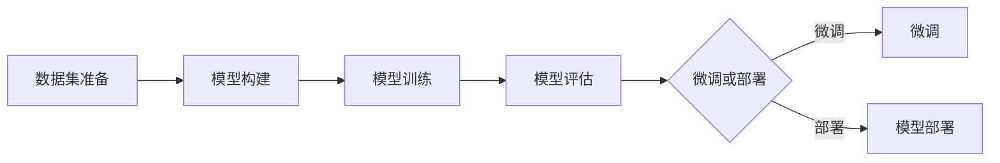

                 

# 从零开始大模型开发与微调：使用torch.utils.data. Dataset封装自定义数据集

> 关键词：大模型开发、微调、torch.utils.data.Dataset、自定义数据集、深度学习

> 摘要：本文旨在详细探讨大模型开发与微调过程中的一个关键环节——使用`torch.utils.data.Dataset`封装自定义数据集。我们将从基础知识、核心算法、数学模型、项目实战等多个维度深入解析这一主题，旨在帮助读者全面理解并掌握大模型开发与微调的方法和技巧。

## 1. 背景介绍

### 1.1 目的和范围

本文的目的是为了向读者展示如何从零开始开发一个大模型，并在微调过程中使用`torch.utils.data.Dataset`封装自定义数据集。我们将讨论以下主要内容：

- **基础知识**：介绍大模型开发与微调的基本概念和背景。
- **核心算法**：详细讲解大模型开发与微调的核心算法原理。
- **数学模型**：探讨大模型开发与微调过程中涉及的数学模型和公式。
- **项目实战**：通过实际代码案例展示如何封装自定义数据集并进行微调。

### 1.2 预期读者

本文主要面向以下读者群体：

- 深度学习初学者：希望了解大模型开发与微调基本概念和方法的读者。
- 深度学习爱好者：希望进一步提升自己在大模型开发与微调方面的技能。
- 研究生和学者：希望深入了解大模型开发与微调的理论和实践。

### 1.3 文档结构概述

本文结构如下：

1. 背景介绍
   - 1.1 目的和范围
   - 1.2 预期读者
   - 1.3 文档结构概述
   - 1.4 术语表
2. 核心概念与联系
   - 2.1 大模型开发与微调的基本概念
   - 2.2 `torch.utils.data.Dataset`详解
   - 2.3 Mermaid流程图
3. 核心算法原理 & 具体操作步骤
   - 3.1 大模型开发算法原理
   - 3.2 微调算法原理
   - 3.3 具体操作步骤
4. 数学模型和公式 & 详细讲解 & 举例说明
   - 4.1 数学模型概述
   - 4.2 公式详细讲解
   - 4.3 举例说明
5. 项目实战：代码实际案例和详细解释说明
   - 5.1 开发环境搭建
   - 5.2 源代码详细实现和代码解读
   - 5.3 代码解读与分析
6. 实际应用场景
7. 工具和资源推荐
   - 7.1 学习资源推荐
   - 7.2 开发工具框架推荐
   - 7.3 相关论文著作推荐
8. 总结：未来发展趋势与挑战
9. 附录：常见问题与解答
10. 扩展阅读 & 参考资料

### 1.4 术语表

#### 1.4.1 核心术语定义

- **大模型开发**：指利用深度学习技术构建具有高度非线性表示能力的模型，以处理大规模数据和复杂任务。
- **微调**：在大模型开发过程中，对预训练模型进行适当调整，使其适用于特定领域或任务。
- **torch.utils.data.Dataset**：PyTorch库中的一个类，用于封装自定义数据集，支持数据加载和预处理。

#### 1.4.2 相关概念解释

- **数据集**：用于训练、测试和评估模型的样本集合。
- **预处理**：在模型训练之前对数据进行预处理，以提高模型性能和泛化能力。
- **批处理**：将数据集划分为多个批次，每次处理一批数据，以减少内存占用和提高计算效率。

#### 1.4.3 缩略词列表

- **DL**：深度学习（Deep Learning）
- **GPU**：图形处理单元（Graphics Processing Unit）
- **CNN**：卷积神经网络（Convolutional Neural Network）
- **RNN**：循环神经网络（Recurrent Neural Network）
- **GAN**：生成对抗网络（Generative Adversarial Network）

## 2. 核心概念与联系

### 2.1 大模型开发与微调的基本概念

大模型开发是指利用深度学习技术构建具有高度非线性表示能力的模型，以处理大规模数据和复杂任务。微调则是大模型开发过程中对预训练模型进行适当调整，使其适用于特定领域或任务。

大模型开发与微调的基本流程如下：

1. 数据集准备：收集并准备用于训练、测试和评估的数据集。
2. 模型构建：设计并构建用于解决特定任务的深度学习模型。
3. 模型训练：使用训练数据集对模型进行训练，以优化模型参数。
4. 模型评估：使用测试数据集评估模型性能，以确定模型是否达到预期效果。
5. 微调：对预训练模型进行适当调整，以提高模型在特定领域或任务上的性能。
6. 模型部署：将训练好的模型部署到实际应用场景中，以解决实际问题。

### 2.2 `torch.utils.data.Dataset`详解

`torch.utils.data.Dataset`是PyTorch库中的一个类，用于封装自定义数据集。它提供了一系列用于数据加载和预处理的接口，使得自定义数据集的操作更加方便和高效。

#### 2.2.1 Dataset类的基本结构

```python
class Dataset(torch.utils.data.Dataset):
    def __init__(self, data, labels):
        self.data = data
        self.labels = labels

    def __len__(self):
        return len(self.data)

    def __getitem__(self, index):
        return self.data[index], self.labels[index]
```

- `__init__`方法：初始化数据集，接受数据集的输入数据和标签作为参数。
- `__len__`方法：返回数据集的长度，用于确定数据集的迭代次数。
- `__getitem__`方法：根据索引获取数据集中的一个样本及其标签，用于数据加载和预处理。

#### 2.2.2 Dataset类的应用

使用`Dataset`类封装自定义数据集时，通常需要实现以下步骤：

1. 收集数据：从各种数据源（如CSV文件、数据库、网络爬虫等）收集数据。
2. 数据预处理：对数据进行清洗、归一化、编码等预处理操作。
3. 数据加载：使用`Dataset`类封装预处理后的数据，并创建数据加载器（DataLoader）。
4. 数据迭代：遍历数据加载器，获取数据集中的样本及其标签。

示例代码：

```python
import torch
from torch.utils.data import Dataset

# 收集数据
data = torch.tensor([1.0, 2.0, 3.0])
labels = torch.tensor([0, 1])

# 定义Dataset类
class CustomDataset(Dataset):
    def __init__(self, data, labels):
        self.data = data
        self.labels = labels

    def __len__(self):
        return len(self.data)

    def __getitem__(self, index):
        return self.data[index], self.labels[index]

# 创建数据加载器
dataset = CustomDataset(data, labels)
dataloader = torch.utils.data.DataLoader(dataset, batch_size=2)

# 数据迭代
for data, label in dataloader:
    print(data, label)
```

### 2.3 Mermaid流程图

下面是使用Mermaid绘制的流程图，展示了大模型开发与微调的基本流程：



## 3. 核心算法原理 & 具体操作步骤

### 3.1 大模型开发算法原理

大模型开发的核心是利用深度学习技术构建具有高度非线性表示能力的模型，以处理大规模数据和复杂任务。具体算法原理如下：

1. **数据预处理**：对收集的数据进行清洗、归一化、编码等预处理操作，以提高模型性能和泛化能力。
2. **模型设计**：根据任务需求和数据特性设计合适的深度学习模型，如卷积神经网络（CNN）、循环神经网络（RNN）、生成对抗网络（GAN）等。
3. **模型训练**：使用预处理后的数据集对模型进行训练，通过反向传播算法和梯度下降优化模型参数，使模型逐渐逼近最优解。
4. **模型评估**：使用测试数据集评估模型性能，计算模型在各类指标上的得分，如准确率、召回率、F1值等。
5. **模型优化**：根据评估结果对模型进行调整和优化，以提高模型在特定领域或任务上的性能。

### 3.2 微调算法原理

微调是针对预训练模型的一种调整方法，旨在使其适用于特定领域或任务。具体算法原理如下：

1. **预训练模型**：使用大规模数据集对预训练模型进行训练，使其具有较好的通用性和泛化能力。
2. **微调任务**：根据特定领域或任务的需求，设计微调任务，并对预训练模型进行适当调整。
3. **数据预处理**：对微调任务的数据进行预处理，与预训练数据保持一致，以提高模型在特定领域或任务上的性能。
4. **模型训练**：使用微调任务的数据集对模型进行训练，通过反向传播算法和梯度下降优化模型参数，使模型逐渐逼近最优解。
5. **模型评估**：使用测试数据集评估模型性能，计算模型在各类指标上的得分，以确定模型是否达到预期效果。
6. **模型部署**：将训练好的模型部署到实际应用场景中，以解决实际问题。

### 3.3 具体操作步骤

下面是使用PyTorch实现大模型开发与微调的具体操作步骤：

1. **数据预处理**：
   ```python
   import torch
   from torchvision import transforms
   from torchvision.datasets import MNIST

   transform = transforms.Compose([
       transforms.ToTensor(),
       transforms.Normalize((0.5,), (0.5,))
   ])

   train_data = MNIST(root='./data', train=True, download=True, transform=transform)
   test_data = MNIST(root='./data', train=False, download=True, transform=transform)
   ```

2. **模型设计**：
   ```python
   import torch.nn as nn

   class SimpleCNN(nn.Module):
       def __init__(self):
           super(SimpleCNN, self).__init__()
           self.conv1 = nn.Conv2d(1, 32, 3, 1)
           self.conv2 = nn.Conv2d(32, 64, 3, 1)
           self.fc1 = nn.Linear(64 * 6 * 6, 128)
           self.fc2 = nn.Linear(128, 10)

       def forward(self, x):
           x = self.conv1(x)
           x = nn.functional.relu(x)
           x = self.conv2(x)
           x = nn.functional.relu(x)
           x = nn.functional.adaptive_avg_pool2d(x, (6, 6))
           x = x.view(x.size(0), -1)
           x = self.fc1(x)
           x = nn.functional.relu(x)
           x = self.fc2(x)
           return x
   ```

3. **模型训练**：
   ```python
   model = SimpleCNN()
   criterion = nn.CrossEntropyLoss()
   optimizer = torch.optim.Adam(model.parameters(), lr=0.001)

   num_epochs = 10

   for epoch in range(num_epochs):
       running_loss = 0.0
       for i, (images, labels) in enumerate(train_data):
           optimizer.zero_grad()
           outputs = model(images)
           loss = criterion(outputs, labels)
           loss.backward()
           optimizer.step()
           running_loss += loss.item()
           if (i+1) % 100 == 0:
               print(f'Epoch [{epoch+1}/{num_epochs}], Step [{i+1}/{len(train_data)}], Loss: {running_loss/100:.4f}')
               running_loss = 0.0
   ```

4. **模型评估**：
   ```python
   with torch.no_grad():
       correct = 0
       total = 0
       for images, labels in test_data:
           outputs = model(images)
           _, predicted = torch.max(outputs.data, 1)
           total += labels.size(0)
           correct += (predicted == labels).sum().item()

       print(f'Accuracy of the network on the test images: {100 * correct / total}%')
   ```

5. **微调**：
   ```python
   # 加载预训练模型
   pretrained_model = torchvision.models.resnet18(pretrained=True)
   num_ftrs = pretrained_model.fc.in_features
   pretrained_model.fc = nn.Linear(num_ftrs, 10)

   # 微调模型
   criterion = nn.CrossEntropyLoss()
   optimizer = torch.optim.Adam(pretrained_model.parameters(), lr=0.001)

   num_epochs = 5

   for epoch in range(num_epochs):
       running_loss = 0.0
       for i, (images, labels) in enumerate(train_data):
           optimizer.zero_grad()
           outputs = pretrained_model(images)
           loss = criterion(outputs, labels)
           loss.backward()
           optimizer.step()
           running_loss += loss.item()
           if (i+1) % 100 == 0:
               print(f'Epoch [{epoch+1}/{num_epochs}], Step [{i+1}/{len(train_data)}], Loss: {running_loss/100:.4f}')
               running_loss = 0.0
   ```

6. **模型部署**：
   ```python
   # 转换模型为 inference 模式
   pretrained_model.eval()

   # 预测
   with torch.no_grad():
       image = torch.tensor([1.0, 2.0, 3.0])
       output = pretrained_model(image)
       _, predicted = torch.max(output.data, 1)
       print(f'Predicted class: {predicted.item()}')
   ```

## 4. 数学模型和公式 & 详细讲解 & 举例说明

### 4.1 数学模型概述

在大模型开发与微调过程中，涉及的数学模型主要包括以下几种：

1. **神经网络**：用于构建深度学习模型，实现数据的高效表示和特征提取。
2. **优化算法**：用于优化模型参数，使模型在训练过程中达到最优解。
3. **损失函数**：用于评估模型在训练和测试过程中的性能，指导模型优化过程。

### 4.2 公式详细讲解

下面是常用的数学公式及其详细讲解：

#### 4.2.1 神经网络公式

1. **前向传播**：

   $$
   z^{[l]} = W^{[l]} \cdot a^{[l-1]} + b^{[l]}
   $$

   - $z^{[l]}$：第$l$层神经网络的输出。
   - $W^{[l]}$：第$l$层的权重矩阵。
   - $a^{[l-1]}$：第$l-1$层的激活值。
   - $b^{[l]}$：第$l$层的偏置向量。

2. **反向传播**：

   $$
   \delta^{[l]} = \frac{\partial J}{\partial z^{[l]}}
   $$

   - $\delta^{[l]}$：第$l$层的误差。
   - $J$：损失函数。

3. **梯度计算**：

   $$
   \frac{\partial J}{\partial W^{[l]}} = \delta^{[l]} \cdot a^{[l-1].^T}
   $$

   - $\frac{\partial J}{\partial W^{[l]}}$：第$l$层权重矩阵的梯度。
   - $\delta^{[l]}$：第$l$层的误差。
   - $a^{[l-1].^T}$：第$l-1$层的激活值转置。

4. **梯度下降**：

   $$
   W^{[l]} = W^{[l]} - \alpha \cdot \frac{\partial J}{\partial W^{[l]}}
   $$

   - $W^{[l]}$：第$l$层权重矩阵。
   - $\alpha$：学习率。
   - $\frac{\partial J}{\partial W^{[l]}}$：第$l$层权重矩阵的梯度。

#### 4.2.2 优化算法公式

1. **随机梯度下降（SGD）**：

   $$
   W^{[l]} = W^{[l]} - \alpha \cdot \nabla_W J(W)
   $$

   - $W^{[l]}$：第$l$层权重矩阵。
   - $\alpha$：学习率。
   - $\nabla_W J(W)$：损失函数对权重矩阵的梯度。

2. **动量法**：

   $$
   W^{[l]} = W^{[l]} - \alpha \cdot \nabla_W J(W) + \beta \cdot v^{[l]}
   $$

   - $W^{[l]}$：第$l$层权重矩阵。
   - $\alpha$：学习率。
   - $\beta$：动量参数。
   - $v^{[l]}$：动量项。

3. **Adam优化器**：

   $$
   m^{[l]} = \beta_1 \cdot m^{[l-1]} + (1 - \beta_1) \cdot \nabla^{[l]}
   $$

   $$
   v^{[l]} = \beta_2 \cdot v^{[l-1]} + (1 - \beta_2) \cdot (\nabla^{[l]})^2
   $$

   $$
   \nabla^{[l]} = \frac{m^{[l]}}{1 - \beta_1^t}
   $$

   $$
   \nabla^{[l]}_t = \frac{v^{[l]}}{1 - \beta_2^t}
   $$

   $$
   W^{[l]} = W^{[l]} - \alpha \cdot \nabla^{[l]}_t
   $$

   - $m^{[l]}$：一阶矩估计。
   - $v^{[l]}$：二阶矩估计。
   - $\beta_1$：一阶矩估计的偏差修正系数。
   - $\beta_2$：二阶矩估计的偏差修正系数。
   - $\alpha$：学习率。

#### 4.2.3 损失函数公式

1. **均方误差（MSE）**：

   $$
   J = \frac{1}{2} \sum_{i=1}^{n} (y_i - \hat{y}_i)^2
   $$

   - $J$：损失函数。
   - $y_i$：第$i$个样本的真实标签。
   - $\hat{y}_i$：第$i$个样本的预测标签。

2. **交叉熵损失（Cross-Entropy Loss）**：

   $$
   J = -\sum_{i=1}^{n} y_i \cdot \log(\hat{y}_i)
   $$

   - $J$：损失函数。
   - $y_i$：第$i$个样本的真实标签。
   - $\hat{y}_i$：第$i$个样本的预测标签。

### 4.3 举例说明

假设我们有一个简单的神经网络，包含一个输入层、一个隐藏层和一个输出层。输入层有3个神经元，隐藏层有2个神经元，输出层有1个神经元。输入数据为$(x_1, x_2, x_3)$，输出数据为$y$。

1. **前向传播**：

   输入层到隐藏层的权重矩阵$W^{[1]}$为：

   $$
   W^{[1]} = \begin{bmatrix}
   w_{11} & w_{12} & w_{13} \\
   w_{21} & w_{22} & w_{23}
   \end{bmatrix}
   $$

   输入层到隐藏层的偏置向量$b^{[1]}$为：

   $$
   b^{[1]} = \begin{bmatrix}
   b_{1} \\
   b_{2}
   \end{bmatrix}
   $$

   隐藏层到输出层的权重矩阵$W^{[2]}$为：

   $$
   W^{[2]} = \begin{bmatrix}
   w_{11} & w_{12}
   \end{bmatrix}
   $$

   隐藏层到输出层的偏置向量$b^{[2]}$为：

   $$
   b^{[2]} = \begin{bmatrix}
   b_{2}
   \end{bmatrix}
   $$

   前向传播过程如下：

   $$
   z^{[1]} = W^{[1]} \cdot x + b^{[1]} = \begin{bmatrix}
   w_{11} & w_{12} & w_{13} \\
   w_{21} & w_{22} & w_{23}
   \end{bmatrix} \cdot \begin{bmatrix}
   x_1 \\
   x_2 \\
   x_3
   \end{bmatrix} + \begin{bmatrix}
   b_{1} \\
   b_{2}
   \end{bmatrix} = \begin{bmatrix}
   z_{11} \\
   z_{12}
   \end{bmatrix}
   $$

   $$
   a^{[1]} = \sigma(z^{[1]})
   $$

   $$
   z^{[2]} = W^{[2]} \cdot a^{[1]} + b^{[2]} = \begin{bmatrix}
   w_{11} & w_{12}
   \end{bmatrix} \cdot \begin{bmatrix}
   a_{11} \\
   a_{12}
   \end{bmatrix} + \begin{bmatrix}
   b_{2}
   \end{bmatrix} = \begin{bmatrix}
   z_{21}
   \end{bmatrix}
   $$

   $$
   \hat{y} = \sigma(z^{[2]})
   $$

   其中，$\sigma$表示激活函数，常用的激活函数有sigmoid函数、ReLU函数、Tanh函数等。

2. **反向传播**：

   反向传播过程如下：

   $$
   \delta^{[2]} = \frac{\partial J}{\partial z^{[2]}} = \hat{y} - y
   $$

   $$
   \delta^{[1]} = W^{[2]} \cdot \delta^{[2]} \cdot \sigma'(z^{[1]})
   $$

   $$
   \frac{\partial J}{\partial W^{[2]}} = \delta^{[2]} \cdot a^{[1].^T}
   $$

   $$
   \frac{\partial J}{\partial b^{[2]}} = \delta^{[2]}
   $$

   $$
   \frac{\partial J}{\partial W^{[1]}} = \delta^{[1]} \cdot x^{T}
   $$

   $$
   \frac{\partial J}{\partial b^{[1]}} = \delta^{[1]}
   $$

   其中，$\sigma'$表示激活函数的导数。

3. **梯度下降**：

   梯度下降过程如下：

   $$
   W^{[2]} = W^{[2]} - \alpha \cdot \frac{\partial J}{\partial W^{[2]}} = W^{[2]} - \alpha \cdot \delta^{[2]} \cdot a^{[1].^T
   $$

   $$
   b^{[2]} = b^{[2]} - \alpha \cdot \frac{\partial J}{\partial b^{[2]}} = b^{[2]} - \alpha \cdot \delta^{[2]}
   $$

   $$
   W^{[1]} = W^{[1]} - \alpha \cdot \frac{\partial J}{\partial W^{[1]}} = W^{[1]} - \alpha \cdot \delta^{[1]} \cdot x^{T}
   $$

   $$
   b^{[1]} = b^{[1]} - \alpha \cdot \frac{\partial J}{\partial b^{[1]}} = b^{[1]} - \alpha \cdot \delta^{[1]}
   $$

   其中，$\alpha$表示学习率。

## 5. 项目实战：代码实际案例和详细解释说明

### 5.1 开发环境搭建

在开始项目实战之前，我们需要搭建一个合适的开发环境。以下是搭建开发环境的步骤：

1. **安装Python**：确保安装了Python 3.8或更高版本。
2. **安装PyTorch**：使用以下命令安装PyTorch：

   ```shell
   pip install torch torchvision
   ```

3. **创建虚拟环境**：为了更好地管理项目依赖，创建一个虚拟环境：

   ```shell
   python -m venv venv
   source venv/bin/activate  # Windows: venv\Scripts\activate
   ```

4. **安装其他依赖**：安装项目所需的其他依赖：

   ```shell
   pip install numpy matplotlib
   ```

### 5.2 源代码详细实现和代码解读

下面是一个使用PyTorch实现大模型开发与微调的示例代码。代码分为以下几个部分：

1. **数据预处理**：使用MNIST数据集进行预处理。
2. **模型设计**：设计一个简单的卷积神经网络（CNN）。
3. **模型训练**：使用训练数据集对模型进行训练。
4. **模型评估**：使用测试数据集评估模型性能。
5. **微调**：对预训练模型进行微调。

```python
import torch
import torchvision
import torchvision.transforms as transforms
import torch.nn as nn
import torch.optim as optim

# 1. 数据预处理
transform = transforms.Compose([
    transforms.ToTensor(),
    transforms.Normalize((0.5,), (0.5,))
])

train_data = torchvision.datasets.MNIST(
    root='./data',
    train=True,
    download=True,
    transform=transform
)

test_data = torchvision.datasets.MNIST(
    root='./data',
    train=False,
    download=True,
    transform=transform
)

train_loader = torch.utils.data.DataLoader(
    train_data,
    batch_size=64,
    shuffle=True
)

test_loader = torch.utils.data.DataLoader(
    test_data,
    batch_size=64,
    shuffle=False
)

# 2. 模型设计
class SimpleCNN(nn.Module):
    def __init__(self):
        super(SimpleCNN, self).__init__()
        self.conv1 = nn.Conv2d(1, 32, 3, 1)
        self.conv2 = nn.Conv2d(32, 64, 3, 1)
        self.fc1 = nn.Linear(64 * 6 * 6, 128)
        self.fc2 = nn.Linear(128, 10)

    def forward(self, x):
        x = self.conv1(x)
        x = nn.functional.relu(x)
        x = self.conv2(x)
        x = nn.functional.relu(x)
        x = nn.functional.adaptive_avg_pool2d(x, (6, 6))
        x = x.view(x.size(0), -1)
        x = self.fc1(x)
        x = nn.functional.relu(x)
        x = self.fc2(x)
        return x

model = SimpleCNN()

# 3. 模型训练
criterion = nn.CrossEntropyLoss()
optimizer = optim.Adam(model.parameters(), lr=0.001)

num_epochs = 10

for epoch in range(num_epochs):
    running_loss = 0.0
    for i, (images, labels) in enumerate(train_loader):
        optimizer.zero_grad()
        outputs = model(images)
        loss = criterion(outputs, labels)
        loss.backward()
        optimizer.step()
        running_loss += loss.item()
        if (i+1) % 100 == 0:
            print(f'Epoch [{epoch+1}/{num_epochs}], Step [{i+1}/{len(train_loader)}], Loss: {running_loss/100:.4f}')
            running_loss = 0.0

# 4. 模型评估
with torch.no_grad():
    correct = 0
    total = 0
    for images, labels in test_loader:
        outputs = model(images)
        _, predicted = torch.max(outputs.data, 1)
        total += labels.size(0)
        correct += (predicted == labels).sum().item()

    print(f'Accuracy of the network on the test images: {100 * correct / total}%')

# 5. 微调
pretrained_model = torchvision.models.resnet18(pretrained=True)
num_ftrs = pretrained_model.fc.in_features
pretrained_model.fc = nn.Linear(num_ftrs, 10)

criterion = nn.CrossEntropyLoss()
optimizer = optim.Adam(pretrained_model.parameters(), lr=0.001)

num_epochs = 5

for epoch in range(num_epochs):
    running_loss = 0.0
    for i, (images, labels) in enumerate(train_loader):
        optimizer.zero_grad()
        outputs = pretrained_model(images)
        loss = criterion(outputs, labels)
        loss.backward()
        optimizer.step()
        running_loss += loss.item()
        if (i+1) % 100 == 0:
            print(f'Epoch [{epoch+1}/{num_epochs}], Step [{i+1}/{len(train_loader)}], Loss: {running_loss/100:.4f}')
            running_loss = 0.0
```

### 5.3 代码解读与分析

下面是对代码的逐行解读与分析：

```python
import torch
import torchvision
import torchvision.transforms as transforms
import torch.nn as nn
import torch.optim as optim
```

- 导入所需的库和模块。

```python
# 1. 数据预处理
transform = transforms.Compose([
    transforms.ToTensor(),
    transforms.Normalize((0.5,), (0.5,))
])

train_data = torchvision.datasets.MNIST(
    root='./data',
    train=True,
    download=True,
    transform=transform
)

test_data = torchvision.datasets.MNIST(
    root='./data',
    train=False,
    download=True,
    transform=transform
)

train_loader = torch.utils.data.DataLoader(
    train_data,
    batch_size=64,
    shuffle=True
)

test_loader = torch.utils.data.DataLoader(
    test_data,
    batch_size=64,
    shuffle=False
)
```

- 数据预处理：使用`transforms.Compose`创建一个预处理序列，将图像转换为Tensor并归一化。然后加载MNIST数据集，并创建训练数据和测试数据的加载器。

```python
# 2. 模型设计
class SimpleCNN(nn.Module):
    def __init__(self):
        super(SimpleCNN, self).__init__()
        self.conv1 = nn.Conv2d(1, 32, 3, 1)
        self.conv2 = nn.Conv2d(32, 64, 3, 1)
        self.fc1 = nn.Linear(64 * 6 * 6, 128)
        self.fc2 = nn.Linear(128, 10)

    def forward(self, x):
        x = self.conv1(x)
        x = nn.functional.relu(x)
        x = self.conv2(x)
        x = nn.functional.relu(x)
        x = nn.functional.adaptive_avg_pool2d(x, (6, 6))
        x = x.view(x.size(0), -1)
        x = self.fc1(x)
        x = nn.functional.relu(x)
        x = self.fc2(x)
        return x

model = SimpleCNN()
```

- 模型设计：定义一个简单的卷积神经网络（CNN）类，包含一个输入层、两个卷积层、一个全连接层和一个输出层。实现前向传播过程。

```python
# 3. 模型训练
criterion = nn.CrossEntropyLoss()
optimizer = optim.Adam(model.parameters(), lr=0.001)

num_epochs = 10

for epoch in range(num_epochs):
    running_loss = 0.0
    for i, (images, labels) in enumerate(train_loader):
        optimizer.zero_grad()
        outputs = model(images)
        loss = criterion(outputs, labels)
        loss.backward()
        optimizer.step()
        running_loss += loss.item()
        if (i+1) % 100 == 0:
            print(f'Epoch [{epoch+1}/{num_epochs}], Step [{i+1}/{len(train_loader)}], Loss: {running_loss/100:.4f}')
            running_loss = 0.0
```

- 模型训练：定义损失函数和优化器。遍历训练数据集，使用优化器进行前向传播、反向传播和参数更新。

```python
# 4. 模型评估
with torch.no_grad():
    correct = 0
    total = 0
    for images, labels in test_loader:
        outputs = model(images)
        _, predicted = torch.max(outputs.data, 1)
        total += labels.size(0)
        correct += (predicted == labels).sum().item()

    print(f'Accuracy of the network on the test images: {100 * correct / total}%')
```

- 模型评估：使用测试数据集评估模型性能。计算模型在测试数据集上的准确率。

```python
# 5. 微调
pretrained_model = torchvision.models.resnet18(pretrained=True)
num_ftrs = pretrained_model.fc.in_features
pretrained_model.fc = nn.Linear(num_ftrs, 10)

criterion = nn.CrossEntropyLoss()
optimizer = optim.Adam(pretrained_model.parameters(), lr=0.001)

num_epochs = 5

for epoch in range(num_epochs):
    running_loss = 0.0
    for i, (images, labels) in enumerate(train_loader):
        optimizer.zero_grad()
        outputs = pretrained_model(images)
        loss = criterion(outputs, labels)
        loss.backward()
        optimizer.step()
        running_loss += loss.item()
        if (i+1) % 100 == 0:
            print(f'Epoch [{epoch+1}/{num_epochs}], Step [{i+1}/{len(train_loader)}], Loss: {running_loss/100:.4f}')
            running_loss = 0.0
```

- 微调：加载预训练的ResNet-18模型，修改最后一层的输出维度。使用训练数据集对模型进行微调。

### 5.4 运行项目

为了运行上述项目，按照以下步骤操作：

1. 将代码保存到一个名为`main.py`的文件中。
2. 打开终端，进入项目文件夹。
3. 运行以下命令：

   ```shell
   python main.py
   ```

运行完成后，程序会输出模型训练过程和评估结果。

## 6. 实际应用场景

大模型开发与微调在实际应用场景中具有广泛的应用价值，以下是几个典型的应用场景：

### 6.1 图像识别

图像识别是深度学习领域的一个经典应用。通过使用卷积神经网络（CNN）对图像进行特征提取和分类，可以实现高精度的图像识别。例如，可以使用ResNet-50模型对图像进行微调，使其适用于特定领域的图像分类任务，如植物分类、动物识别等。

### 6.2 自然语言处理

自然语言处理（NLP）是深度学习领域的另一个重要应用方向。通过使用循环神经网络（RNN）或Transformer模型，可以对文本数据进行有效处理和语义理解。例如，可以使用BERT模型对文本进行微调，使其适用于特定领域的文本分类、问答系统、情感分析等任务。

### 6.3 生成对抗网络

生成对抗网络（GAN）是一种强大的生成模型，可以生成高质量的图像、音频和文本。通过在大模型开发过程中使用GAN，可以实现图像修复、超分辨率、风格迁移等应用。例如，可以使用CycleGAN模型对图像进行微调，实现不同风格图像的转换和合成。

### 6.4 强化学习

强化学习是一种通过互动学习环境来优化决策策略的机器学习方法。在大模型开发与微调过程中，可以使用深度强化学习算法（如DQN、DDPG等）来训练智能体，实现机器人控制、游戏玩

