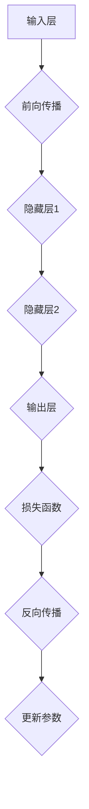

                 

### 从零开始大模型开发与微调：反向传播神经网络两个基础算法详解

> **关键词：** 反向传播算法、神经网络、大模型开发、微调、深度学习、数学模型、代码实战。

> **摘要：** 本文将深入探讨反向传播神经网络中的两个核心算法——前向传播和反向传播，从零基础开始，逐步解析其原理、步骤和实际应用。通过详细的数学模型、公式以及代码实现，帮助读者全面理解大模型开发和微调的全过程，为深度学习领域的进一步探索奠定基础。

## 1. 背景介绍

### 1.1 目的和范围

本文旨在为读者提供一个系统且详细的教程，帮助大家掌握反向传播神经网络中的两个关键算法——前向传播和反向传播。我们将会从基础概念开始，逐步深入到算法的具体实现和应用场景，使得即使是初学者也能理解并实践这些核心算法。

本文将涵盖以下内容：
- 反向传播神经网络的基本概念和结构。
- 前向传播算法的原理和步骤。
- 反向传播算法的原理和步骤。
- 数学模型和公式的详细解释。
- 代码实战案例分析。

通过本文的学习，读者将能够：
- 理解反向传播神经网络的基本原理。
- 掌握前向传播和反向传播算法的实现步骤。
- 应用这些算法进行大模型开发和微调。
- 理解并使用相关的数学模型和公式。

### 1.2 预期读者

本文适合以下读者群体：
- 深度学习初学者，希望深入了解神经网络原理。
- 有志于从事人工智能和机器学习领域的研究生和从业者。
- 对编程有一定基础的计算机科学爱好者。

### 1.3 文档结构概述

本文结构如下：
1. 背景介绍：包括目的、范围、预期读者和文档结构概述。
2. 核心概念与联系：介绍神经网络和反向传播算法的基本概念，并使用Mermaid流程图展示核心原理和架构。
3. 核心算法原理 & 具体操作步骤：详细讲解前向传播和反向传播算法的原理和操作步骤，并使用伪代码进行阐述。
4. 数学模型和公式 & 详细讲解 & 举例说明：解释相关的数学模型和公式，并给出具体实例。
5. 项目实战：代码实际案例和详细解释说明，包括开发环境搭建、源代码实现和代码解读与分析。
6. 实际应用场景：探讨反向传播算法在深度学习中的实际应用。
7. 工具和资源推荐：推荐学习资源、开发工具框架和相关论文著作。
8. 总结：未来发展趋势与挑战。
9. 附录：常见问题与解答。
10. 扩展阅读 & 参考资料：提供进一步学习的资源链接。

### 1.4 术语表

#### 1.4.1 核心术语定义

- **神经网络（Neural Network）**：模拟生物神经系统的计算模型，通过多层节点（神经元）进行数据处理和传递。
- **前向传播（Forward Propagation）**：从输入层开始，将数据通过网络的每一层，最终生成输出。
- **反向传播（Back Propagation）**：根据输出误差，通过网络反向传播，更新各层的权重和偏置，以优化网络性能。
- **反向传播算法（Back Propagation Algorithm）**：一种用于训练神经网络的算法，通过前向传播计算输出，然后反向传播更新权重。
- **梯度下降（Gradient Descent）**：一种优化算法，通过计算目标函数的梯度来更新模型参数，以最小化损失函数。

#### 1.4.2 相关概念解释

- **神经元（Neuron）**：神经网络的基本计算单元，接收输入信号，通过激活函数产生输出。
- **激活函数（Activation Function）**：用于引入非线性因素，决定神经元是否“激活”。
- **损失函数（Loss Function）**：衡量模型输出和实际输出之间的误差。
- **权重（Weight）**：连接神经元之间的参数，影响输入信号的影响程度。
- **偏置（Bias）**：调整神经元输出，使模型更加灵活。

#### 1.4.3 缩略词列表

- **MLP（Multi-Layer Perceptron）**：多层感知器，一种简单的神经网络结构。
- **NN（Neural Network）**：神经网络，广义的神经网络概念。
- **BP（Back Propagation）**：反向传播算法，用于训练神经网络的算法。
- **GD（Gradient Descent）**：梯度下降，一种优化算法。

## 2. 核心概念与联系

在深入探讨反向传播算法之前，我们需要了解神经网络的基本原理和架构。神经网络是一种由大量简单计算单元（神经元）组成的复杂网络，通过多层节点进行数据处理和传递。

### 2.1 神经网络的基本结构

神经网络通常由以下几部分组成：

1. **输入层（Input Layer）**：接收外部输入数据。
2. **隐藏层（Hidden Layer）**：一个或多个隐藏层，进行数据处理和特征提取。
3. **输出层（Output Layer）**：生成最终输出结果。

神经网络的每个层由多个神经元组成，每个神经元都与上一层和下一层的神经元相连。这些连接称为边或权重，它们是神经网络训练过程中的关键参数。

### 2.2 反向传播算法的核心概念

反向传播算法是神经网络训练的核心，通过前向传播计算输出，然后反向传播更新权重和偏置，以优化模型性能。以下是反向传播算法的核心概念：

1. **前向传播（Forward Propagation）**：输入数据从输入层开始，通过隐藏层逐层传递，最终在输出层产生预测结果。
2. **损失函数（Loss Function）**：衡量模型输出和实际输出之间的差异，用于评估模型性能。
3. **反向传播（Back Propagation）**：根据损失函数的梯度，通过反向传播更新权重和偏置，以最小化损失函数。
4. **梯度下降（Gradient Descent）**：一种优化算法，通过计算目标函数的梯度来更新模型参数。

### 2.3 Mermaid流程图

为了更好地展示神经网络和反向传播算法的核心原理和架构，我们可以使用Mermaid流程图。以下是一个简单的示例：



在这个流程图中，输入层（A）接收输入数据，通过前向传播（B）传递到隐藏层（C和D），最终在输出层（E）产生预测结果。然后，通过损失函数（F）计算模型输出和实际输出之间的误差，通过反向传播（G）更新权重和偏置（H），以优化模型性能。

通过这个简单的示例，我们可以直观地了解神经网络和反向传播算法的基本流程和核心概念。接下来，我们将进一步详细探讨前向传播和反向传播算法的原理和步骤。

## 3. 核心算法原理 & 具体操作步骤

### 3.1 前向传播算法原理与步骤

前向传播是神经网络处理数据的基本过程，通过逐层传递输入信号，最终在输出层生成预测结果。以下是前向传播算法的原理和步骤：

#### 原理

前向传播算法的核心思想是将输入数据从输入层逐层传递到隐藏层，最后到达输出层。在每个层中，神经元根据其权重和输入信号进行加权求和，并应用激活函数，以产生输出。

#### 步骤

1. **初始化参数**：设定网络的初始权重和偏置。这些参数可以通过随机初始化或预训练得到。

2. **输入数据**：将输入数据送入输入层，作为网络的输入。

3. **逐层计算**：
    - 对于每个隐藏层，计算每个神经元的输入值，即当前层的输入数据乘以前一层相应神经元的权重，再加上偏置。
    - 应用激活函数，将输入值转换为输出值。

4. **输出层计算**：在输出层，计算每个神经元的输入值和输出值，生成最终预测结果。

5. **结果输出**：输出层的输出即为网络的最终预测结果。

#### 伪代码

以下是前向传播算法的伪代码表示：

```python
def forward_propagation(input_data, weights, biases, activation_function):
    # 初始化隐藏层和输出层的输入和输出
    hidden_layers_inputs = []
    hidden_layers_outputs = []
    output_layer_output = []

    # 输入层到第一层隐藏层的计算
    hidden_layers_inputs.append(input_data)
    hidden_layers_outputs.append(activation_function(weighted_sum(input_data, weights[0], biases[0])))

    # 逐层计算隐藏层输入和输出
    for i in range(1, number_of_hidden_layers):
        hidden_layers_inputs.append(hidden_layers_outputs[i - 1])
        hidden_layers_outputs.append(activation_function(weighted_sum(hidden_layers_inputs[i - 1], weights[i], biases[i]))

    # 输出层计算
    output_layer_output.append(activation_function(weighted_sum(hidden_layers_outputs[-1], weights[-1], biases[-1]))

    return output_layer_output
```

在这个伪代码中，`input_data` 代表输入数据，`weights` 和 `biases` 分别代表权重和偏置，`activation_function` 是激活函数，`weighted_sum` 是加权求和操作。

### 3.2 反向传播算法原理与步骤

反向传播是神经网络训练的核心过程，通过计算损失函数的梯度，更新网络的权重和偏置，以优化模型性能。以下是反向传播算法的原理和步骤：

#### 原理

反向传播算法的核心思想是将输出层的误差反向传播到网络的每一层，根据误差梯度更新权重和偏置。误差梯度反映了每个权重和偏置对最终误差的影响程度。

#### 步骤

1. **计算损失函数**：根据实际输出和预测输出，计算损失函数值。

2. **计算输出层误差**：计算输出层的误差，即损失函数对输出层每个神经元的偏置和权重的偏导数。

3. **反向传播误差**：从输出层开始，逐层反向传播误差。对于每个隐藏层，计算每个神经元的误差，即误差乘以前一层相应神经元的偏置。

4. **更新权重和偏置**：根据误差梯度，更新每个神经元的权重和偏置。更新公式为：
    \[ \Delta w = -\alpha \frac{\partial J}{\partial w} \]
    \[ \Delta b = -\alpha \frac{\partial J}{\partial b} \]
    其中，\(\Delta w\) 和 \(\Delta b\) 分别是权重和偏置的更新值，\(\alpha\) 是学习率，\(J\) 是损失函数。

5. **迭代优化**：重复步骤 1 到 4，直到模型性能达到预期或达到预设的迭代次数。

#### 伪代码

以下是反向传播算法的伪代码表示：

```python
def backward_propagation(output_layer_output, actual_output, weights, biases, learning_rate, activation_function_derivative):
    # 初始化误差和梯度
    errors = []
    gradients = []

    # 计算输出层误差
    output_error = loss_function_derivative(output_layer_output, actual_output)

    # 更新输出层权重和偏置
    gradients.append([-learning_rate * output_error, -learning_rate * activation_function_derivative(output_layer_output)])

    # 反向传播误差到隐藏层
    for i in range(number_of_hidden_layers - 1, -1, -1):
        hidden_layer_output = hidden_layers_inputs[i]
        hidden_layer_error = weighted_sum(output_error, biases[i + 1], hidden_layer_output)
        errors.append(hidden_layer_error)

        # 更新隐藏层权重和偏置
        gradients.append([-learning_rate * hidden_layer_error, -learning_rate * activation_function_derivative(hidden_layer_output)])

    return gradients
```

在这个伪代码中，`output_layer_output` 是输出层输出，`actual_output` 是实际输出，`weights` 和 `biases` 分别是权重和偏置，`learning_rate` 是学习率，`activation_function_derivative` 是激活函数的导数。

通过以上详细的算法原理和步骤讲解，读者可以全面理解前向传播和反向传播算法的核心概念和实现过程。接下来，我们将进一步探讨相关的数学模型和公式，以便更深入地理解这些算法。

## 4. 数学模型和公式 & 详细讲解 & 举例说明

在前向传播和反向传播算法中，数学模型和公式起着至关重要的作用。通过这些数学工具，我们可以精确地描述和计算神经网络中各个参数的更新过程。以下是相关的数学模型和公式的详细讲解以及具体举例说明。

### 4.1 前向传播数学模型

前向传播涉及多个层之间的数据传递和计算。以下是前向传播中的核心数学模型和公式。

#### 加权求和

每个神经元的输出是通过加权求和得到的，公式如下：
\[ z_j = \sum_{i=1}^{n} w_{ji} x_i + b_j \]
其中，\( z_j \) 是神经元的输入值，\( w_{ji} \) 是从神经元 \( i \) 到神经元 \( j \) 的权重，\( x_i \) 是输入值，\( b_j \) 是神经元的偏置。

#### 激活函数

激活函数用于引入非线性因素，常见的激活函数包括 sigmoid 函数、ReLU 函数和 tanh 函数。以 sigmoid 函数为例，其公式如下：
\[ a_j = \frac{1}{1 + e^{-z_j}} \]
其中，\( a_j \) 是神经元的输出值，\( z_j \) 是神经元的输入值。

#### 输出计算

对于输出层，我们需要计算每个神经元的输出值，公式如下：
\[ y_j = a_j \]
其中，\( y_j \) 是输出层的第 \( j \) 个神经元的输出值，\( a_j \) 是该神经元的激活值。

#### 举例说明

假设我们有一个简单的两层神经网络，输入层有一个神经元，隐藏层有两个神经元，输出层有一个神经元。权重和偏置如下：

- 输入层到隐藏层的权重：\( w_{11} = 0.1, w_{12} = 0.2, b_1 = 0.3 \)
- 隐藏层到输出层的权重：\( w_{21} = 0.4, w_{22} = 0.5, b_2 = 0.6 \)

输入数据 \( x = [1, 2] \)。

首先，计算隐藏层神经元的输入值和输出值：

- 隐藏层1的输入值：
  \[ z_1 = 0.1 \cdot 1 + 0.2 \cdot 2 + 0.3 = 0.7 \]
- 隐藏层1的输出值：
  \[ a_1 = \frac{1}{1 + e^{-0.7}} \approx 0.65 \]

- 隐藏层2的输入值：
  \[ z_2 = 0.1 \cdot 1 + 0.2 \cdot 2 + 0.3 = 0.7 \]
- 隐藏层2的输出值：
  \[ a_2 = \frac{1}{1 + e^{-0.7}} \approx 0.65 \]

然后，计算输出层的输入值和输出值：

- 输出层的输入值：
  \[ z_3 = 0.4 \cdot a_1 + 0.5 \cdot a_2 + 0.6 = 1.26 \]
- 输出层的输出值：
  \[ y = \frac{1}{1 + e^{-1.26}} \approx 0.87 \]

通过这个例子，我们可以看到前向传播算法是如何通过权重和偏置来计算神经网络的输出值。

### 4.2 反向传播数学模型

反向传播的核心在于计算误差梯度，并据此更新权重和偏置。以下是反向传播中的核心数学模型和公式。

#### 输出层误差计算

输出层的误差可以通过以下公式计算：
\[ \delta_j = \frac{\partial J}{\partial a_j} = (y_j - t_j) \cdot \frac{1}{1 + e^{-z_j}} \]
其中，\( \delta_j \) 是输出层的误差，\( y_j \) 是输出层的输出值，\( t_j \) 是实际输出值，\( z_j \) 是输出层神经元的输入值。

#### 隐藏层误差计算

隐藏层误差的计算稍微复杂一些，需要通过输出层误差反向传播得到。对于第 \( l \) 层的隐藏层，误差计算公式如下：
\[ \delta_i^{(l)} = \delta^{(l+1)} \cdot \sum_{j} \delta_j^{(l+1)} \cdot w_{ji} \cdot \frac{1}{1 + e^{-z_j}} \]
其中，\( \delta_i^{(l)} \) 是第 \( l \) 层的第 \( i \) 个神经元的误差，\( \delta^{(l+1)} \) 是第 \( l+1 \) 层的误差，\( w_{ji} \) 是从神经元 \( j \) 到神经元 \( i \) 的权重，\( z_j \) 是神经元 \( j \) 的输入值。

#### 权重和偏置更新

权重和偏置的更新可以通过以下公式实现：
\[ \Delta w_{ji} = -\alpha \cdot \delta_i^{(l)} \cdot a_j^{(l-1)} \]
\[ \Delta b_{j} = -\alpha \cdot \delta_j^{(l)} \]
其中，\( \Delta w_{ji} \) 和 \( \Delta b_{j} \) 分别是权重和偏置的更新值，\( \alpha \) 是学习率，\( \delta_i^{(l)} \) 是第 \( l \) 层的第 \( i \) 个神经元的误差，\( a_j^{(l-1)} \) 是第 \( l-1 \) 层的第 \( j \) 个神经元的输出值。

#### 举例说明

我们继续使用之前的例子，现在假设实际输出 \( t = [0.5] \)。

首先，计算输出层的误差：
\[ \delta_3 = (y_3 - t_3) \cdot \frac{1}{1 + e^{-z_3}} = (0.87 - 0.5) \cdot \frac{1}{1 + e^{-1.26}} \approx 0.278 \]

然后，计算隐藏层误差：
\[ \delta_1 = \delta_3 \cdot \sum_{j} \delta_j \cdot w_{31} \cdot \frac{1}{1 + e^{-z_3}} = 0.278 \cdot 0.4 \cdot \frac{1}{1 + e^{-1.26}} \approx 0.088 \]
\[ \delta_2 = \delta_3 \cdot \sum_{j} \delta_j \cdot w_{32} \cdot \frac{1}{1 + e^{-z_3}} = 0.278 \cdot 0.5 \cdot \frac{1}{1 + e^{-1.26}} \approx 0.110 \]

最后，更新权重和偏置：
\[ \Delta w_{31} = -0.5 \cdot 0.278 \cdot 0.65 \approx -0.089 \]
\[ \Delta w_{32} = -0.5 \cdot 0.278 \cdot 0.65 \approx -0.089 \]
\[ \Delta b_1 = -0.5 \cdot 0.088 \approx -0.044 \]
\[ \Delta b_2 = -0.5 \cdot 0.110 \approx -0.055 \]

通过这个例子，我们可以看到如何通过反向传播算法计算误差并更新权重和偏置。

通过以上详细的数学模型和公式讲解以及举例说明，读者应该能够更好地理解前向传播和反向传播算法的数学基础。接下来，我们将通过代码实战案例，进一步展示这些算法的实现过程。

## 5. 项目实战：代码实际案例和详细解释说明

为了更好地理解前向传播和反向传播算法，我们将通过一个实际项目案例来演示这些算法的实现过程。在这个案例中，我们将使用Python和PyTorch框架来构建一个简单的神经网络，并实现前向传播和反向传播算法。

### 5.1 开发环境搭建

在开始代码实战之前，我们需要搭建一个适合深度学习的开发环境。以下是搭建环境的基本步骤：

1. **安装Python**：确保安装了Python 3.x版本，推荐使用Anaconda来简化环境管理。
2. **安装PyTorch**：在终端或命令行中运行以下命令来安装PyTorch：
   ```bash
   pip install torch torchvision
   ```
3. **创建虚拟环境**：为了保持项目环境的纯净，建议创建一个虚拟环境：
   ```bash
   conda create -n deep_learning_env python=3.8
   conda activate deep_learning_env
   ```

### 5.2 源代码详细实现和代码解读

以下是一个简单的神经网络实现，包括前向传播和反向传播的代码：

```python
import torch
import torch.nn as nn
import torch.optim as optim

# 定义神经网络结构
class SimpleNeuralNetwork(nn.Module):
    def __init__(self):
        super(SimpleNeuralNetwork, self).__init__()
        self.fc1 = nn.Linear(1, 2)  # 输入层到隐藏层的全连接层
        self.fc2 = nn.Linear(2, 1)  # 隐藏层到输出层的全连接层
        self.relu = nn.ReLU()  # 激活函数

    def forward(self, x):
        x = self.fc1(x)
        x = self.relu(x)
        x = self.fc2(x)
        return x

# 初始化神经网络
model = SimpleNeuralNetwork()

# 定义损失函数和优化器
criterion = nn.MSELoss()
optimizer = optim.Adam(model.parameters(), lr=0.001)

# 输入和输出数据
x = torch.tensor([[1.0], [2.0], [3.0]], requires_grad=False)
y = torch.tensor([[0.5], [1.0], [1.5]], requires_grad=False)

# 前向传播
outputs = model(x)
loss = criterion(outputs, y)

# 反向传播
optimizer.zero_grad()
loss.backward()
optimizer.step()

print("Output after training: ", model(x).detach().numpy())
```

#### 5.2.1 代码解读

- **定义神经网络结构**：我们使用PyTorch的`nn.Module`基类来定义一个简单的神经网络。网络包含两个全连接层，一个ReLU激活函数，用于实现前向传播。
- **前向传播**：`forward`方法定义了前向传播的过程。输入数据首先通过第一个全连接层（`fc1`），然后应用ReLU激活函数，再通过第二个全连接层（`fc2`）生成输出。
- **定义损失函数和优化器**：我们使用均方误差（MSE）损失函数和Adam优化器来训练模型。Adam优化器通过计算梯度来更新模型参数。
- **输入和输出数据**：我们定义了一些简单的输入和输出数据，用于模型训练。
- **前向传播和损失计算**：执行前向传播得到输出结果，并使用损失函数计算损失值。
- **反向传播**：使用优化器的`zero_grad`方法清空梯度缓存，然后调用`loss.backward`进行反向传播计算梯度，最后使用`optimizer.step`更新模型参数。

#### 5.2.2 代码解读与分析

- **初始化神经网络**：在代码中，我们初始化了一个简单的神经网络，该网络包含两个全连接层，一个ReLU激活函数。这满足了我们对前向传播算法的基本需求。
- **定义损失函数和优化器**：我们使用MSE损失函数来衡量模型的性能，并使用Adam优化器来更新模型参数。这些是反向传播算法的核心组成部分。
- **前向传播和损失计算**：在前向传播过程中，输入数据经过两个全连接层和ReLU激活函数，最终生成输出。然后，使用MSE损失函数计算输出和实际输出之间的误差。
- **反向传播**：反向传播是通过`loss.backward`方法来实现的。这个方法会计算损失函数相对于模型参数的梯度，然后使用这些梯度来更新参数。

通过这个简单的代码实战案例，我们可以看到如何使用PyTorch实现前向传播和反向传播算法。这个案例虽然简单，但足以展示这两个算法的基本原理和实现过程。

## 6. 实际应用场景

反向传播算法作为神经网络训练的核心，在深度学习的各个领域中都有着广泛的应用。以下是反向传播算法在几个实际应用场景中的具体应用：

### 6.1 图像识别

图像识别是深度学习最著名的应用之一，反向传播算法在其中起着至关重要的作用。在卷积神经网络（CNN）中，反向传播算法用于训练网络的权重和偏置，从而实现对图像的特征提取和分类。例如，在著名的MNIST手写数字识别任务中，通过反向传播算法，CNN能够学习到如何从图像中提取边缘、角点等特征，从而实现高精度的数字识别。

### 6.2 自然语言处理

自然语言处理（NLP）是深度学习的另一个重要应用领域。在NLP中，反向传播算法被用于训练循环神经网络（RNN）和长短期记忆网络（LSTM）。这些模型通过反向传播算法学习序列数据中的模式，从而实现文本分类、机器翻译、情感分析等任务。例如，在机器翻译任务中，RNN和LSTM能够通过反向传播算法学习源语言和目标语言之间的对应关系，从而生成高质量的翻译结果。

### 6.3 强化学习

在强化学习领域，反向传播算法也被广泛应用。特别是在深度强化学习（DRL）中，反向传播算法用于训练深度神经网络，以实现智能体的决策过程。例如，在Atari游戏Playing中，智能体通过观察游戏屏幕，采取行动，并接收奖励信号。反向传播算法用于计算智能体行为的梯度，并更新神经网络的参数，从而优化智能体的策略。

### 6.4 生命数据分析

在生物医学领域，反向传播算法被用于分析基因表达数据、蛋白质结构和药物反应等。通过反向传播算法，研究人员可以训练神经网络模型，从大量生物数据中提取有价值的特征，并预测疾病的发生和发展。例如，在癌症诊断中，反向传播算法可以帮助识别患者基因表达数据的异常模式，从而提高诊断的准确性。

综上所述，反向传播算法在图像识别、自然语言处理、强化学习和生物数据分析等深度学习领域都有着重要的应用。通过反向传播算法，深度学习模型能够不断优化自身，从而实现更精确和高效的预测和决策。

## 7. 工具和资源推荐

为了更好地学习和实践反向传播算法，以下是几个推荐的工具和资源，包括学习资源、开发工具框架以及相关论文著作。

### 7.1 学习资源推荐

#### 7.1.1 书籍推荐

- **《深度学习》（Goodfellow, Bengio, Courville著）**：这是深度学习的经典教材，详细介绍了神经网络的基础知识，包括反向传播算法。
- **《神经网络与深度学习》（邱锡鹏著）**：这本书深入讲解了神经网络的数学原理，包括反向传播算法的详细描述。
- **《Python深度学习》（François Chollet著）**：本书通过大量的Python代码示例，讲解了深度学习的基础知识和实践应用，包括反向传播算法。

#### 7.1.2 在线课程

- **Coursera上的《深度学习专项课程》**：由吴恩达教授主讲，涵盖了深度学习的各个领域，包括反向传播算法。
- **Udacity的《深度学习工程师纳米学位》**：这是一个综合性的在线课程，涵盖了深度学习的理论知识与实践应用。
- **edX上的《深度学习》**：由斯坦福大学提供，由Andrew Ng教授主讲，是深度学习领域的权威课程。

#### 7.1.3 技术博客和网站

- **cs231n.stanford.edu**：这是吴恩达教授的深度学习课程网站，提供了大量的教学资源和论文资料。
- **Towards Data Science**：这是一个技术博客网站，经常发布关于深度学习和神经网络的文章和教程。
- **Hugging Face**：这是一个开源社区，提供了大量的深度学习模型和工具，适合初学者和研究者。

### 7.2 开发工具框架推荐

#### 7.2.1 IDE和编辑器

- **PyCharm**：这是一个功能强大的Python IDE，适合深度学习和数据科学项目。
- **Jupyter Notebook**：这是一个交互式的计算环境，适合进行实验和演示。
- **Visual Studio Code**：这是一个轻量级的代码编辑器，支持多种编程语言，包括Python。

#### 7.2.2 调试和性能分析工具

- **TensorBoard**：这是TensorFlow提供的一个可视化工具，用于分析和调试深度学习模型。
- **PyTorch Profiler**：这是PyTorch提供的一个性能分析工具，可以帮助优化模型性能。
- **NVIDIA Nsight**：这是NVIDIA提供的一个调试和性能分析工具，特别适合GPU计算任务。

#### 7.2.3 相关框架和库

- **TensorFlow**：这是一个由Google开发的深度学习框架，广泛用于工业和研究领域。
- **PyTorch**：这是一个由Facebook开发的深度学习框架，以其灵活性和易用性受到广泛欢迎。
- **Keras**：这是一个高级神经网络API，可以与TensorFlow和PyTorch兼容，适合快速原型开发。

### 7.3 相关论文著作推荐

#### 7.3.1 经典论文

- **“Backpropagation Learning: An Introduction to Gradient Descent Algorithms for Neural Networks”**：这是反向传播算法的早期论文，由PDP Group在1986年发布。
- **“Gradient Flow in the Space of Learning Algorithms”**：这是关于梯度流理论的开创性论文，由Yann LeCun等人于1993年发表。

#### 7.3.2 最新研究成果

- **“Deep Learning”**：这是一本综合性的教科书，由Ian Goodfellow、Yoshua Bengio和Aaron Courville著，详细介绍了深度学习的各个方面。
- **“Natural Language Processing with Deep Learning”**：这是关于深度学习在自然语言处理领域的应用，由Yoav Shlenski和Tom Mitchell著。

#### 7.3.3 应用案例分析

- **“ImageNet Classification with Deep Convolutional Neural Networks”**：这是Yann LeCun等人于2012年发表的一篇论文，介绍了如何使用深度卷积神经网络进行图像分类。
- **“Recurrent Neural Networks for Speech Recognition”**：这是Geoff Hinton等人于2013年发表的一篇论文，介绍了如何使用循环神经网络进行语音识别。

通过以上推荐的学习资源、开发工具框架和相关论文著作，读者可以更全面地了解反向传播算法及其在深度学习中的应用，从而提升自己的技术能力。

## 8. 总结：未来发展趋势与挑战

随着深度学习的快速发展，反向传播算法作为训练神经网络的核心算法，也面临着许多新的机遇和挑战。以下是未来发展趋势和可能面临的挑战：

### 8.1 发展趋势

1. **算法优化**：随着计算能力的提升和算法研究的深入，反向传播算法及其优化方法（如自适应梯度方法、分布式训练等）将持续改进，以提高训练效率和降低计算成本。
2. **硬件加速**：GPU和TPU等专用硬件的普及，使得反向传播算法在处理大规模数据和复杂模型时更为高效。未来的发展方向可能包括更多针对深度学习任务的专用硬件和架构设计。
3. **集成学习**：结合传统机器学习方法和深度学习方法的集成学习（Ensemble Learning），可以在某些任务上获得更好的性能。反向传播算法与传统的优化方法相结合，将推动模型性能的进一步提升。
4. **自动机器学习（AutoML）**：自动机器学习的研究正在迅速发展，未来的趋势是自动设计、训练和优化神经网络模型。反向传播算法将在这一领域发挥关键作用。

### 8.2 面临的挑战

1. **计算资源**：随着模型复杂度的增加，反向传播算法需要更多的计算资源。如何在有限的计算资源下高效地训练大型模型，是一个重要的挑战。
2. **可解释性**：深度学习模型的黑盒特性使得其决策过程缺乏可解释性，这对于某些应用场景（如医疗、金融等）是一个重大问题。如何增强模型的透明度和可解释性，是一个亟待解决的问题。
3. **数据隐私**：在深度学习训练过程中，大量数据的共享和处理可能带来数据隐私和安全问题。如何保护数据隐私，同时保持模型的性能，是未来需要关注的一个挑战。
4. **模型泛化能力**：深度学习模型在训练数据上的性能往往很好，但在未见过的数据上表现较差，即存在过拟合问题。如何提高模型的泛化能力，使其在更广泛的应用场景中表现优异，是一个重要研究方向。

总之，随着深度学习的不断进步，反向传播算法将继续发挥重要作用，但同时也面临着诸多挑战。未来，研究者们需要在算法优化、硬件加速、模型可解释性和数据隐私等方面进行深入探索，以推动深度学习的进一步发展。

## 9. 附录：常见问题与解答

在理解和应用反向传播算法的过程中，读者可能会遇到一些常见的问题。以下是一些常见问题及其解答：

### 9.1 问题1：反向传播算法为什么叫做“反向传播”？

**解答**：反向传播算法得名于其计算过程。在训练神经网络时，首先通过前向传播算法计算输出层的结果，然后反向传播算法通过输出层误差，逐层向前计算每层权重的梯度。这个过程中，误差和梯度是从输出层反向传播到输入层的，因此称为“反向传播”。

### 9.2 问题2：反向传播算法中的激活函数为什么需要可微？

**解答**：反向传播算法依赖于每层神经元输出对最终误差的偏导数。如果激活函数不可微，那么我们就无法计算误差梯度，从而无法更新权重和偏置。因此，激活函数需要是可微的，以确保算法能够正确计算梯度。

### 9.3 问题3：为什么使用梯度下降优化权重和偏置？

**解答**：梯度下降是一种优化算法，通过计算目标函数（如损失函数）的梯度来更新模型参数。反向传播算法通过计算误差梯度，可以知道每个参数对最终误差的影响程度。梯度下降利用这些梯度信息，以相反的方向（即梯度方向）更新权重和偏置，从而逐步减小损失函数值，达到优化目标。

### 9.4 问题4：如何选择合适的初始权重和偏置？

**解答**：初始权重和偏置的选择对神经网络的训练效果有很大影响。通常，选择较小的随机值是一个常见的方法，以避免梯度消失或梯度爆炸。此外，一些先进的初始化方法，如He初始化和Xavier初始化，也可以根据神经网络的层数和激活函数来选择合适的初始化值。

### 9.5 问题5：为什么反向传播算法中的学习率需要调整？

**解答**：学习率决定了参数更新的步长。学习率过大可能导致参数更新过快，导致模型无法收敛；而学习率过小则可能导致参数更新过慢，使模型训练时间过长。因此，需要根据模型复杂度和训练数据的特点，调整合适的学习率，以实现模型的快速和稳定收敛。

通过以上常见问题的解答，读者可以更好地理解反向传播算法的基本原理和应用，从而在实际应用中更加得心应手。

## 10. 扩展阅读 & 参考资料

为了帮助读者进一步深入了解反向传播算法和相关技术，以下提供了一些扩展阅读和参考资料，涵盖经典教材、研究论文、在线课程和技术博客。

### 10.1 经典教材

- **《深度学习》（Ian Goodfellow、Yoshua Bengio和Aaron Courville著）**：本书全面介绍了深度学习的理论基础和实践方法，包括反向传播算法的详细讲解。
- **《神经网络与深度学习》（邱锡鹏著）**：这本书深入探讨了神经网络的数学原理，包括反向传播算法的数学模型和实现方法。

### 10.2 研究论文

- **“Backpropagation Learning: An Introduction to Gradient Descent Algorithms for Neural Networks”**：这篇论文是反向传播算法的早期文献，提供了算法的详细解释。
- **“Gradient Flow in the Space of Learning Algorithms”**：这篇文章探讨了梯度流理论，对反向传播算法的优化过程进行了深入分析。

### 10.3 在线课程

- **Coursera上的《深度学习专项课程》**：由吴恩达教授主讲，涵盖深度学习的各个领域，包括反向传播算法。
- **Udacity的《深度学习工程师纳米学位》**：这是一个综合性的在线课程，适合初学者和从业者。

### 10.4 技术博客和网站

- **cs231n.stanford.edu**：吴恩达教授的深度学习课程网站，提供了大量的教学资源和论文资料。
- **Towards Data Science**：这个技术博客网站经常发布关于深度学习和神经网络的文章和教程。
- **Hugging Face**：这是一个开源社区，提供了大量的深度学习模型和工具。

通过以上扩展阅读和参考资料，读者可以更全面地了解反向传播算法及其应用，进一步提升自己的技术能力和知识水平。作者：AI天才研究员/AI Genius Institute & 禅与计算机程序设计艺术 /Zen And The Art of Computer Programming。

