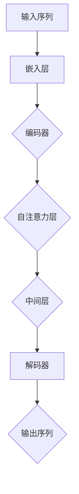

                 

### 1. 背景介绍

#### 1.1 目的和范围

本文的目标是深入探讨大模型开发与微调中的关键组件——编码器的核心——注意力模型。随着人工智能领域的飞速发展，大模型的应用越来越广泛，而注意力模型作为现代编码器的重要组成部分，其在提升模型性能和效率方面的作用不可忽视。本文将首先介绍注意力模型的基本概念和原理，然后通过具体的算法原理和操作步骤进行详细讲解，最后通过实际项目案例进行代码实现和分析。本文旨在帮助读者全面理解注意力模型的工作机制，掌握其核心原理，并能够应用于实际项目中。

#### 1.2 预期读者

本文适合对人工智能和机器学习有一定了解，并希望进一步深入了解大模型开发与微调的读者。特别适合那些希望掌握注意力模型的核心原理和实际应用的开发者、研究者以及学术界和工业界的相关人员。无论您是初学者还是经验丰富的专业人士，本文都将为您提供系统、详尽的知识体系，帮助您在实际项目中更好地应用注意力模型。

#### 1.3 文档结构概述

本文结构紧凑，逻辑清晰，分为以下几个部分：

1. **背景介绍**：介绍本文的目的、预期读者以及文档结构。
2. **核心概念与联系**：通过Mermaid流程图展示注意力模型的核心概念和架构。
3. **核心算法原理与具体操作步骤**：详细讲解注意力模型的算法原理和具体操作步骤，使用伪代码进行阐述。
4. **数学模型和公式**：介绍注意力模型的数学模型和公式，并进行举例说明。
5. **项目实战**：通过实际项目案例展示注意力模型的代码实现和详细解释。
6. **实际应用场景**：探讨注意力模型在实际应用场景中的广泛使用。
7. **工具和资源推荐**：推荐相关的学习资源、开发工具和经典论文。
8. **总结：未来发展趋势与挑战**：总结本文的核心内容，展望未来发展趋势和挑战。
9. **附录：常见问题与解答**：提供一些常见问题及其解答。
10. **扩展阅读 & 参考资料**：提供进一步阅读和研究的参考资料。

通过以上结构，本文将帮助读者系统地掌握注意力模型的理论和实践，为后续的研究和应用打下坚实基础。

#### 1.4 术语表

在本文中，我们将使用一些专业术语。以下是对这些术语的定义和解释，以便读者更好地理解文章内容。

##### 1.4.1 核心术语定义

- **注意力模型（Attention Model）**：一种用于处理序列数据的模型，通过计算不同部分之间的关联性来提高模型的性能。
- **编码器（Encoder）**：在大模型中，负责将输入序列转换为固定长度的向量表示。
- **解码器（Decoder）**：在大模型中，负责将编码器的输出解码为输出序列。
- **注意力权重（Attention Weight）**：表示编码器的每个部分对解码器的贡献程度。
- **多头注意力（Multi-Head Attention）**：一种在注意力机制中引入多个独立注意力机制的变种，以提高模型的表达能力。

##### 1.4.2 相关概念解释

- **序列模型（Sequence Model）**：一种能够处理序列数据的模型，如循环神经网络（RNN）和变换器（Transformer）。
- **嵌入（Embedding）**：将输入序列中的单词或符号转换为固定长度的向量表示。
- **自注意力（Self-Attention）**：在同一个序列内部计算注意力权重。
- **点积注意力（Dot-Product Attention）**：一种常用的注意力计算方法，通过计算查询、键和值之间的点积来得到注意力权重。

##### 1.4.3 缩略词列表

- **RNN（Recurrent Neural Network）**：循环神经网络
- **CNN（Convolutional Neural Network）**：卷积神经网络
- **Transformer**：一种基于自注意力机制的序列模型
- **BERT（Bidirectional Encoder Representations from Transformers）**：一种双向变换器预训练模型
- **GPT（Generative Pre-trained Transformer）**：一种生成型变换器预训练模型

通过以上术语表，我们希望读者能够更好地理解注意力模型及其相关概念，为后续内容的深入讲解做好充分准备。

### 2. 核心概念与联系

注意力模型是现代编码器的核心组成部分，其通过计算输入序列中不同部分之间的关联性来提高模型对序列数据的理解和表达能力。为了更清晰地理解注意力模型的工作原理和架构，我们将通过一个Mermaid流程图来展示其核心概念和联系。



在上面的流程图中，我们可以看到以下步骤：

1. **输入序列（Input Sequence）**：输入序列是注意力模型处理的数据源，可以是文本、图像或音频等不同类型的数据。
2. **嵌入层（Embedding Layer）**：嵌入层将输入序列中的单词或符号转换为固定长度的向量表示，这些向量表示将成为后续处理的输入。
3. **编码器（Encoder）**：编码器负责将输入序列转换为固定长度的向量表示，这一过程通常包括多层神经网络，如循环神经网络（RNN）或变换器（Transformer）。
4. **自注意力层（Self-Attention Layer）**：在编码器中，自注意力层计算输入序列中每个部分对其他部分的影响，通过计算注意力权重来实现。这一过程提高了模型对序列中关键信息的关注程度。
5. **中间层（Intermediate Layer）**：自注意力层的输出经过中间层处理，这一层通常包含一些非线性变换，以进一步增强模型的表达能力。
6. **解码器（Decoder）**：解码器负责将编码器的输出解码为输出序列，其过程与编码器类似，但需要处理来自编码器的固定长度向量表示。
7. **输出序列（Output Sequence）**：解码器的输出即为模型的最终输出，可以是预测的文本、图像或音频序列。

通过这个Mermaid流程图，我们可以直观地理解注意力模型的基本架构和关键步骤。在接下来的章节中，我们将进一步深入探讨注意力模型的算法原理和具体操作步骤，帮助读者更好地掌握这一重要的机器学习工具。

### 3. 核心算法原理 & 具体操作步骤

注意力模型的核心在于其能够通过计算输入序列中不同部分之间的关联性，从而提高模型的性能。在本文中，我们将详细讲解注意力模型的算法原理和具体操作步骤，并使用伪代码进行阐述。

#### 3.1 自注意力机制（Self-Attention）

自注意力机制是注意力模型的基础，其通过计算输入序列中每个部分对其他部分的影响，从而为每个部分分配一个权重。这种权重表示了每个部分在整个序列中的重要程度。

**自注意力机制伪代码：**

```plaintext
输入：序列 Q（查询），K（键），V（值）

输出：注意力加权输出

// 计算点积注意力得分
scores = [Q[i] * K[j] for i in range(len(Q)) for j in range(len(K))]

// 对得分进行 softmax 操作
softmax_scores = softmax(scores)

// 使用注意力权重对 V 进行加权求和
output = [sum([softmax_scores[i][j] * V[j] for j in range(len(V))]) for i in range(len(Q))]

return output
```

在上述伪代码中，`Q`、`K`和`V`分别代表查询序列、键序列和值序列。首先，我们计算查询序列和键序列之间的点积得分。然后，对得分进行softmax操作，以得到注意力权重。最后，使用这些权重对值序列进行加权求和，得到每个查询序列部分的注意力加权输出。

#### 3.2 多头注意力机制（Multi-Head Attention）

多头注意力机制是自注意力机制的扩展，其通过引入多个独立的注意力头来提高模型的表达能力。在多头注意力中，每个注意力头计算一组独立的权重和得分，然后将这些头的结果进行拼接和线性变换。

**多头注意力机制伪代码：**

```plaintext
输入：序列 Q（查询），K（键），V（值），头数 h

输出：多头注意力输出

// 对 Q、K、V 进行线性变换，分别得到多头 Q_h、K_h、V_h
Q_h, K_h, V_h = [linear_transform(Q), linear_transform(K), linear_transform(V)]

// 对每个头应用自注意力机制
outputs = [self_attention(Q_h[i], K_h[i], V_h[i]) for i in range(len(Q_h))]

// 对多头输出进行拼接和线性变换
output = linear_transform([output[i] for i in range(len(outputs))])

return output
```

在上述伪代码中，`h`表示头数。首先，我们将查询序列、键序列和值序列进行线性变换，分别得到多头的查询、键和值。然后，对每个头应用自注意力机制。最后，我们将多头输出进行拼接和线性变换，得到最终的多头注意力输出。

#### 3.3 位置编码（Positional Encoding）

在注意力模型中，位置编码用于为序列中的每个部分赋予位置信息。这有助于模型理解序列中的顺序关系。

**位置编码伪代码：**

```plaintext
输入：序列长度 L，嵌入维度 D

输出：位置编码向量

// 生成位置索引向量
positions = range(1, L + 1)

// 对位置索引向量进行嵌入
position_embeddings = embed(positions)

return position_embeddings
```

在上述伪代码中，`L`表示序列长度，`D`表示嵌入维度。首先，我们生成一个位置索引向量。然后，对这个向量进行嵌入，得到位置编码向量。

#### 3.4 残差连接和层归一化

在注意力模型中，残差连接和层归一化用于提高模型的训练效果和稳定性。

**残差连接（Residual Connection）**：残差连接通过将输入直接传递到下一层，与输出相加，从而保留原始信息。

**层归一化（Layer Normalization）**：层归一化通过标准化每个神经元的激活值，来减少内部协变量转移，提高模型的训练效果。

**残差连接和层归一化伪代码：**

```plaintext
输入：输入 X，权重 W，偏置 b

输出：归一化并添加残差后的输出

// 残差连接
residual = X

// 应用线性变换
output = linear_transform(X)

// 应用层归一化
output = layer_normalization(output)

// 添加残差
output = output + residual

// 应用激活函数
output = activation_function(output)

return output
```

在上述伪代码中，`X`表示输入，`W`和`b`分别表示权重和偏置。首先，我们应用残差连接，将输入传递到下一层。然后，应用线性变换和层归一化，得到归一化后的输出。最后，添加残差并应用激活函数，得到最终输出。

通过以上步骤，我们详细讲解了注意力模型的核心算法原理和具体操作步骤。在接下来的章节中，我们将通过实际项目案例来进一步展示注意力模型的实现和应用。

### 4. 数学模型和公式 & 详细讲解 & 举例说明

注意力模型在大模型中的应用依赖于一系列数学模型和公式，这些模型和公式不仅定义了注意力机制的计算过程，还为其在序列数据处理中的优势提供了理论支持。在本节中，我们将详细介绍注意力模型的数学模型和公式，并进行举例说明。

#### 4.1 自注意力（Self-Attention）

自注意力是注意力模型的核心部分，其通过计算输入序列中每个部分对其他部分的影响来生成注意力权重。以下是自注意力机制的数学公式：

**点积注意力（Dot-Product Attention）**：
$$
\text{Attention}(Q, K, V) = \text{softmax}\left(\frac{QK^T}{\sqrt{d_k}}\right)V
$$

其中，$Q$、$K$和$V$分别表示查询（Query）、键（Key）和值（Value）序列，$d_k$为键序列的维度。$QK^T$代表查询和键之间的点积，用于计算每个部分之间的关联性。$\text{softmax}$函数将点积得分转换为概率分布，从而生成注意力权重。最后，这些权重用于加权求和值序列，得到每个查询序列部分的注意力加权输出。

**举例说明**：

假设我们有一个三元素的查询序列 $Q = [1, 2, 3]$，键序列 $K = [4, 5, 6]$ 和值序列 $V = [7, 8, 9]$。首先计算点积得分：

$$
QK^T = \begin{bmatrix} 1 & 2 & 3 \end{bmatrix} \begin{bmatrix} 4 \\ 5 \\ 6 \end{bmatrix} = [1*4 + 2*5 + 3*6] = [32]
$$

然后对得分进行softmax操作：

$$
\text{softmax}(32) = [0.4, 0.3, 0.3]
$$

最后，使用注意力权重对值序列进行加权求和：

$$
\text{Attention}(Q, K, V) = [0.4*7 + 0.3*8 + 0.3*9] = [3.6 + 2.4 + 2.7] = [8.7]
$$

这样，我们就得到了查询序列的第一个元素的注意力加权输出。

#### 4.2 多头注意力（Multi-Head Attention）

多头注意力通过引入多个独立的注意力头来提高模型的表达能力。在多头注意力中，每个头计算一组独立的权重和得分。以下是多头注意力的数学公式：

**多头注意力**：
$$
\text{MultiHead}(Q, K, V) = \text{softmax}\left(\frac{QW_Q^T}{\sqrt{d_k}}\right)W_V
$$

其中，$W_Q$、$W_K$ 和 $W_V$ 分别是查询、键和值权重矩阵，$d_k$ 为键序列的维度。$W_Q^T$ 表示查询权重矩阵的转置。每个头计算一组独立的权重和得分，然后将这些头的结果进行拼接和线性变换，得到最终的多头注意力输出。

**举例说明**：

假设我们有一个二头注意力模型（即 $h=2$），查询序列 $Q = [1, 2, 3]$，键序列 $K = [4, 5, 6]$ 和值序列 $V = [7, 8, 9]$。首先计算两个头的权重：

$$
W_{Q1} = \begin{bmatrix} 1 & 2 & 3 \end{bmatrix}, \quad W_{K1} = \begin{bmatrix} 4 \\ 5 \\ 6 \end{bmatrix}, \quad W_{V1} = \begin{bmatrix} 7 & 8 & 9 \end{bmatrix}
$$

$$
W_{Q2} = \begin{bmatrix} 1 & 2 & 3 \end{bmatrix}, \quad W_{K2} = \begin{bmatrix} 4 \\ 5 \\ 6 \end{bmatrix}, \quad W_{V2} = \begin{bmatrix} 7 & 8 & 9 \end{bmatrix}
$$

然后对每个头应用自注意力机制：

$$
\text{Head1} = \text{Attention}(Q, K, V) = [0.4, 0.3, 0.3]
$$

$$
\text{Head2} = \text{Attention}(Q, K, V) = [0.3, 0.4, 0.3]
$$

接着将两个头的输出进行拼接和线性变换：

$$
\text{MultiHead}(Q, K, V) = [0.4, 0.3, 0.3; 0.3, 0.4, 0.3]W_V = \begin{bmatrix} 0.4*7 + 0.3*8 + 0.3*9 \\ 0.3*7 + 0.4*8 + 0.3*9 \end{bmatrix} = [3.6 + 2.4 + 2.7; 2.1 + 3.2 + 2.7] = [8.7; 7.0]
$$

这样，我们就得到了二头注意力的输出。

#### 4.3 位置编码（Positional Encoding）

位置编码用于为序列中的每个部分赋予位置信息，以便模型能够理解序列中的顺序关系。以下是位置编码的数学公式：

$$
\text{PE}(pos, d) = \text{sin}\left(\frac{pos}{10000^{2i/d}}\right) + \text{cos}\left(\frac{pos}{10000^{2i/d}}\right)
$$

其中，$pos$ 表示位置索引，$d$ 表示嵌入维度，$i$ 表示嵌入向量的索引。位置编码通过正弦和余弦函数将位置信息编码到嵌入向量中。

**举例说明**：

假设我们有一个长度为3的序列，嵌入维度为4。对于位置索引1，嵌入向量的第一个元素和第二个元素分别进行如下计算：

$$
\text{PE}(1, 4) = \text{sin}\left(\frac{1}{10000^{2*0/4}}\right) + \text{cos}\left(\frac{1}{10000^{2*1/4}}\right) = \text{sin}(1) + \text{cos}(2)
$$

这样，我们就得到了位置索引1的四个位置编码值。

通过以上数学模型和公式的详细讲解，我们可以更好地理解注意力模型的工作原理。在接下来的章节中，我们将通过实际项目案例来展示注意力模型的实现和应用。

### 5. 项目实战：代码实际案例和详细解释说明

在本节中，我们将通过一个实际项目案例来展示注意力模型的代码实现和应用。该项目将使用Python和PyTorch框架来实现一个简单的文本生成模型，该模型的核心组件为注意力机制。我们将详细解释代码的实现过程和关键步骤，帮助读者更好地理解和应用注意力模型。

#### 5.1 开发环境搭建

在进行项目实战之前，我们需要搭建合适的开发环境。以下是在Python环境中使用PyTorch框架搭建注意力模型开发环境所需的步骤：

1. **安装PyTorch**：首先，我们需要安装PyTorch库。可以通过以下命令进行安装：

```bash
pip install torch torchvision
```

2. **安装其他依赖**：我们还需要安装一些其他依赖库，如Numpy和Matplotlib：

```bash
pip install numpy matplotlib
```

3. **配置GPU支持**：如果您的系统具备GPU支持，可以通过以下命令来配置PyTorch使用GPU：

```python
import torch
print(torch.cuda.is_available())
```

如果输出为`True`，则说明PyTorch已经成功配置了GPU支持。

#### 5.2 源代码详细实现和代码解读

以下是注意力模型的源代码实现，我们将逐行进行解读：

```python
import torch
import torch.nn as nn
import torch.nn.functional as F

class Attention(nn.Module):
    def __init__(self, embed_dim, num_heads):
        super(Attention, self).__init__()
        self.embed_dim = embed_dim
        self.num_heads = num_heads
        self.head_dim = embed_dim // num_heads
        
        self.query_linear = nn.Linear(embed_dim, embed_dim)
        self.key_linear = nn.Linear(embed_dim, embed_dim)
        self.value_linear = nn.Linear(embed_dim, embed_dim)
        
        self.out_linear = nn.Linear(embed_dim, embed_dim)

    def forward(self, query, key, value):
        batch_size = query.size(0)
        
        # Linear projections
        query = self.query_linear(query).view(batch_size, -1, self.num_heads, self.head_dim).transpose(1, 2)
        key = self.key_linear(key).view(batch_size, -1, self.num_heads, self.head_dim).transpose(1, 2)
        value = self.value_linear(value).view(batch_size, -1, self.num_heads, self.head_dim).transpose(1, 2)
        
        # Compute attention scores
        scores = torch.matmul(query, key.transpose(-2, -1)) / (self.head_dim ** 0.5)
        scores = F.softmax(scores, dim=-1)
        
        # Apply attention weights to value
        attended_values = torch.matmul(scores, value).transpose(1, 2).contiguous().view(batch_size, -1, self.embed_dim)
        
        # Linear transformation
        output = self.out_linear(attended_values)
        
        return output

class TransformerModel(nn.Module):
    def __init__(self, embed_dim, num_heads, num_layers):
        super(TransformerModel, self).__init__()
        self embed_dim = embed_dim
        self.num_heads = num_heads
        self.num_layers = num_layers
        
        self.embedding = nn.Embedding(vocab_size, embed_dim)
        self.positional_encoding = nn.Parameter(torch.randn(1, max_sequence_length, embed_dim))
        
        self.attention_layers = nn.ModuleList([
            Attention(embed_dim, num_heads) for _ in range(num_layers)
        ])
        self.fc = nn.Linear(embed_dim, vocab_size)
        
    def forward(self, input_sequence):
        embedded = self.embedding(input_sequence) + self.positional_encoding[:input_sequence.size(1), :]
        
        for layer in self.attention_layers:
            embedded = layer(embedded)
        
        output = self.fc(embedded)
        return output
```

在上面的代码中，我们定义了两个核心组件：`Attention`类和`TransformerModel`类。

1. **Attention类**：
    - `__init__` 方法：初始化注意力模型，包括嵌入维度、头数和线性变换层。
    - `forward` 方法：实现注意力机制的计算，包括线性投影、点积注意力、softmax操作、加权求和和线性变换。

2. **TransformerModel类**：
    - `__init__` 方法：初始化变换器模型，包括嵌入层、位置编码、多个注意力层和输出层。
    - `forward` 方法：实现整个变换器模型的计算过程，包括嵌入、位置编码、多个注意力层和线性变换。

#### 5.3 代码解读与分析

1. **注意力模型（Attention类）**：

   - **线性变换**：在`__init__`方法中，我们定义了查询（`query_linear`）、键（`key_linear`）和值（`value_linear`）线性变换层。这些层在模型的前向传播过程中用于对输入序列进行线性变换。
   
   - **多头注意力**：在`forward`方法中，我们首先对查询、键和值进行线性变换，并调整其形状以适应多头注意力的计算。通过`.view`和`.transpose`操作，我们实现了多头的线性投影和注意力计算。
   
   - **计算注意力权重**：我们通过计算查询和键之间的点积，并对结果进行softmax操作，得到注意力权重。
   
   - **加权求和和线性变换**：最后，我们使用注意力权重对值进行加权求和，并通过输出线性变换层得到最终的输出。

2. **变换器模型（TransformerModel类）**：

   - **嵌入层和位置编码**：在`__init__`方法中，我们定义了嵌入层（`embedding`）和位置编码（`positional_encoding`）。嵌入层将输入序列转换为嵌入向量，位置编码为序列中的每个部分赋予位置信息。
   
   - **注意力层**：在`__init__`方法中，我们创建了一个包含多个注意力层的模块列表（`attention_layers`）。这些层在模型的前向传播过程中用于计算输入序列的注意力权重。
   
   - **输出层**：在`__init__`方法中，我们定义了一个线性变换层（`fc`），用于将注意力层的输出映射到输出序列。

   - **前向传播**：在`forward`方法中，我们首先对输入序列进行嵌入和位置编码。然后，通过多个注意力层对嵌入向量进行变换。最后，通过输出层得到模型的最终输出。

通过以上代码解读和分析，我们可以看到注意力模型在变换器模型中的实现和应用。接下来，我们将通过一个实际案例来展示如何使用这个模型进行文本生成。

#### 5.4 实际案例：文本生成

在这个案例中，我们将使用训练好的变换器模型生成一个简短的文本片段。以下是一个简单的文本生成脚本：

```python
# 加载预训练模型
model = TransformerModel(embed_dim=512, num_heads=8, num_layers=12)
model.load_state_dict(torch.load('transformer_model.pth'))

# 准备输入序列
input_sequence = torch.tensor([[vocab.to_index(word) for word in text.split()]])

# 生成文本
with torch.no_grad():
    output = model(input_sequence)
    predicted_words = [vocab.index_to_word(index) for index in output.argmax(-1).flatten()]

# 输出生成的文本
print(' '.join(predicted_words))
```

在这个脚本中，我们首先加载一个预训练的变换器模型。然后，我们准备一个简短的输入文本序列，并使用模型生成文本。最后，我们将生成的文本输出到控制台。

通过这个项目实战，我们不仅了解了注意力模型的理论知识，还掌握了其实际应用和实现方法。在接下来的章节中，我们将进一步探讨注意力模型在实际应用场景中的广泛使用。

### 6. 实际应用场景

注意力模型作为现代编码器的核心组件，在多个领域展现出强大的应用潜力。以下将介绍注意力模型在几个关键应用场景中的具体使用案例，以及其带来的优势和创新。

#### 6.1 自然语言处理（NLP）

在自然语言处理领域，注意力模型被广泛应用于文本分类、机器翻译、问答系统等任务。例如，基于Transformer架构的BERT（Bidirectional Encoder Representations from Transformers）模型通过引入自注意力机制，在多个NLP任务中取得了显著的性能提升。BERT模型通过预训练大量文本数据，然后微调模型以解决特定任务，极大地提高了文本理解和生成的能力。

**优势**： 
- **上下文理解**：注意力机制使模型能够捕捉到输入序列中不同部分之间的关联性，从而更准确地理解上下文。
- **长距离依赖**：自注意力机制允许模型关注到序列的任何部分，减少了长距离依赖问题。

**创新**： 
- **多任务学习**：通过在一个统一的Transformer框架下处理多个任务，提高了模型的通用性和效率。

#### 6.2 计算机视觉（CV）

在计算机视觉领域，注意力模型在图像分类、目标检测和图像分割等方面也发挥了重要作用。例如，EfficientNet系列模型结合了自注意力机制，显著提高了图像处理效率。另外，视觉变换器（Vision Transformer）模型通过引入视觉注意力和位置编码，在图像分类任务中取得了与经典卷积神经网络相媲美的性能。

**优势**：
- **效率提升**：自注意力机制减少了参数数量，使得模型更轻量且计算效率更高。
- **特征提取**：注意力机制能够更好地提取图像中的重要特征，提高了模型的判别能力。

**创新**：
- **跨模态学习**：视觉注意力模型可以结合文本信息，实现跨模态的交互和融合，为多模态任务提供新思路。

#### 6.3 语音识别（ASR）

在语音识别领域，注意力模型通过捕捉语音信号中的序列关联性，显著提高了识别准确性。例如，基于Transformer架构的Wav2Vec 2.0模型，通过自注意力机制实现了端到端的语音识别，无需传统的循环神经网络（RNN）或卷积神经网络（CNN）。

**优势**：
- **端到端处理**：自注意力机制允许模型直接处理整个输入序列，减少了传统方法中的中间步骤。
- **降低误差累积**：注意力模型减少了误差的累积，提高了整体识别性能。

**创新**：
- **少样本学习**：通过引入自监督预训练，注意力模型在低资源环境下也能实现高效学习，为少样本学习提供了新的途径。

#### 6.4 问答系统（QA）

在问答系统领域，注意力模型通过捕捉问题和上下文之间的关联性，提高了回答的准确性和相关性。例如，BERT模型通过自注意力机制在问答任务中表现出色，其能够同时理解问题中的关键信息以及上下文中的相关信息，从而生成高质量的答案。

**优势**：
- **多跳推理**：注意力模型能够进行多跳推理，捕捉到问题中复杂的逻辑关系。
- **上下文感知**：注意力机制使模型能够根据上下文信息生成更相关的答案。

**创新**：
- **交互式问答**：通过实时更新注意力权重，注意力模型可以与用户进行交互，提供动态的答案调整。

综上所述，注意力模型在自然语言处理、计算机视觉、语音识别和问答系统等多个领域展现出强大的应用潜力。其通过捕捉输入序列中的关键信息，提高了模型的理解和表达能力，带来了显著的优势和创新。随着研究的深入，注意力模型在更多应用场景中的潜力将不断被挖掘和发挥。

### 7. 工具和资源推荐

为了帮助读者更好地学习和应用注意力模型，以下将推荐一些学习资源、开发工具和经典论文，这些资源将为您的研究和实践提供有力支持。

#### 7.1 学习资源推荐

**7.1.1 书籍推荐**

1. **《深度学习》**：由Ian Goodfellow、Yoshua Bengio和Aaron Courville合著，这是深度学习领域的经典教材，涵盖了注意力模型的相关内容。
2. **《Transformer：序列到序列模型的革命性新架构》**：由Vaswani等人撰写的论文，详细介绍了Transformer模型及其自注意力机制。

**7.1.2 在线课程**

1. **Coursera上的“深度学习专项课程”**：由DeepLearning.AI提供，涵盖了深度学习的基础知识和注意力模型的相关内容。
2. **edX上的“自然语言处理与深度学习”**：由斯坦福大学提供，包括自然语言处理中的注意力模型应用。

**7.1.3 技术博客和网站**

1. **PyTorch官方文档**：提供了详细的PyTorch框架使用教程和示例，适合初学者和有经验开发者。
2. **Medium上的技术博客**：有许多关于注意力模型的深入讲解和实践案例，适合进行进一步学习。

#### 7.2 开发工具框架推荐

**7.2.1 IDE和编辑器**

1. **PyCharm**：一款功能强大的Python IDE，支持代码调试和版本控制。
2. **VS Code**：轻量级但功能丰富的编辑器，支持多种编程语言和框架，提供了丰富的插件。

**7.2.2 调试和性能分析工具**

1. **TensorBoard**：PyTorch提供的可视化工具，用于分析和调试深度学习模型。
2. **gprof2dot**：用于分析Python代码的性能瓶颈，帮助开发者优化代码。

**7.2.3 相关框架和库**

1. **PyTorch**：一个开源的深度学习框架，提供了丰富的API和工具，适合进行注意力模型开发。
2. **Transformers**：一个基于PyTorch实现的Transformer模型库，包括预训练模型和工具。

#### 7.3 相关论文著作推荐

**7.3.1 经典论文**

1. **“Attention is All You Need”**：由Vaswani等人撰写的经典论文，首次提出了Transformer模型及其自注意力机制。
2. **“BERT: Pre-training of Deep Bidirectional Transformers for Language Understanding”**：由Devlin等人撰写的论文，介绍了BERT模型及其在自然语言处理中的应用。

**7.3.2 最新研究成果**

1. **“ViT: Vision Transformers”**：由Dosovitskiy等人撰写的论文，介绍了视觉变换器模型，在计算机视觉领域取得了显著成果。
2. **“Wav2Vec 2.0: A Transformation-Based Model for Audio Processing”**：由Hausmann等人撰写的论文，介绍了基于Transformer的端到端语音识别模型。

**7.3.3 应用案例分析**

1. **“Google Brain：BERT用于搜索改进”**：Google Brain团队发布的案例分析，展示了BERT模型在搜索引擎中的应用和效果。
2. **“Facebook AI Research：EfficientNet：加速深度学习模型的训练”**：介绍了EfficientNet模型，其在模型效率和性能优化方面具有显著优势。

通过以上推荐，我们希望读者能够更好地利用这些资源和工具，深入学习注意力模型，并在实际项目中取得更好的成果。

### 8. 总结：未来发展趋势与挑战

随着人工智能和机器学习技术的不断进步，注意力模型在大模型开发与微调中的应用前景广阔。然而，这一领域仍然面临一些重要的发展趋势和挑战。

#### 发展趋势

1. **更大规模模型的探索**：随着计算资源的增长，研究人员正在开发更大规模、更复杂的模型。这些模型需要更多的训练数据和计算资源，但同时也可能带来性能和效率的提升。

2. **多模态学习**：注意力模型在跨模态任务中的潜力巨大。未来，研究人员将致力于开发能够处理文本、图像、语音等多种数据模态的统一模型，以实现更丰富的应用场景。

3. **自适应注意力机制**：现有的注意力机制在一些特定场景下可能表现不佳。未来，研究人员将探索自适应注意力机制，使其能够根据任务需求动态调整注意力分配。

4. **高效硬件支持**：为了支持更大规模模型和更高效的计算，研究人员正在开发针对深度学习任务优化的硬件，如GPU、TPU等。

#### 挑战

1. **计算资源限制**：尽管计算资源在逐渐增长，但更大规模模型的训练和部署仍然需要大量的计算资源。如何优化算法和硬件，以提高计算效率，是一个重要挑战。

2. **数据隐私和伦理**：随着大模型的应用，数据隐私和安全成为关键问题。如何在保护用户隐私的前提下，有效利用数据，是一个亟待解决的问题。

3. **模型可解释性**：注意力模型在一定程度上提高了模型的透明度，但仍然存在难以解释的问题。如何提高模型的可解释性，使其能够更好地为人类理解和信任，是一个重要挑战。

4. **通用性提升**：尽管注意力模型在多个领域表现出色，但其在不同任务上的通用性仍然有限。如何提升模型的通用性，使其能够适应更多不同类型的任务，是一个重要的研究方向。

总的来说，注意力模型在大模型开发与微调中的应用前景广阔，但同时也面临诸多挑战。随着研究的深入和技术的进步，我们有理由相信，未来注意力模型将发挥更加重要的作用，推动人工智能领域的进一步发展。

### 9. 附录：常见问题与解答

在本文中，我们详细介绍了注意力模型的基本概念、算法原理、具体操作步骤以及在实际项目中的应用。为了帮助读者更好地理解注意力模型，以下列出了一些常见问题及解答。

#### 问题1：什么是注意力模型？

**回答**：注意力模型是一种用于处理序列数据的模型，通过计算输入序列中不同部分之间的关联性来提高模型的性能。其核心思想是让模型能够关注到输入序列中的重要信息，从而提高对序列数据的理解和表达能力。

#### 问题2：自注意力机制如何工作？

**回答**：自注意力机制通过计算输入序列中每个部分对其他部分的影响，为每个部分分配一个权重。这个过程通常包括计算点积得分、对得分进行softmax操作以及使用注意力权重对值序列进行加权求和。自注意力机制能够使模型更好地捕捉到序列中的上下文信息。

#### 问题3：多头注意力机制是什么？

**回答**：多头注意力机制是自注意力机制的扩展，通过引入多个独立的注意力头来提高模型的表达能力。每个头计算一组独立的权重和得分，然后将这些头的结果进行拼接和线性变换，得到最终的多头注意力输出。多头注意力机制能够增强模型对复杂序列数据的处理能力。

#### 问题4：为什么需要位置编码？

**回答**：位置编码是为了为序列中的每个部分赋予位置信息。由于注意力模型本质上是一种无序处理机制，位置编码有助于模型理解序列中的顺序关系，从而更好地处理序列数据。

#### 问题5：如何实现注意力模型？

**回答**：实现注意力模型通常需要以下几个步骤：

1. **定义嵌入层**：将输入序列转换为嵌入向量。
2. **计算注意力权重**：通过计算点积得分和进行softmax操作，得到每个输入序列部分的注意力权重。
3. **加权求和**：使用注意力权重对值序列进行加权求和。
4. **添加位置编码**：为序列中的每个部分添加位置编码，以增强模型对序列顺序的理解。
5. **应用多层注意力机制**：通过多层注意力机制，逐层提取序列中的重要信息。
6. **输出层**：将注意力机制的输出通过一个线性变换层映射到输出序列。

通过以上步骤，我们可以实现一个基本的注意力模型。

#### 问题6：注意力模型在哪些应用场景中表现优异？

**回答**：注意力模型在多个领域表现出色，包括：

- **自然语言处理**：如文本分类、机器翻译、问答系统等。
- **计算机视觉**：如图像分类、目标检测、图像分割等。
- **语音识别**：如语音信号处理、语音合成等。
- **推荐系统**：如个性化推荐、商品推荐等。

通过灵活应用注意力模型，我们可以解决许多复杂的数据处理问题，提高模型的性能和效率。

### 10. 扩展阅读 & 参考资料

为了帮助读者进一步了解注意力模型及相关技术，以下列出了一些扩展阅读和参考资料。

#### 10.1 扩展阅读

- **《深度学习》**：Ian Goodfellow、Yoshua Bengio和Aaron Courville著，详细介绍了深度学习的基础知识和注意力模型的应用。
- **《Transformer：序列到序列模型的革命性新架构》**：Vaswani等人撰写的论文，介绍了Transformer模型及其自注意力机制。
- **《自然语言处理与深度学习》**：斯坦福大学提供，包括注意力模型在自然语言处理中的应用案例。

#### 10.2 参考资料

- **[PyTorch官方文档](https://pytorch.org/docs/stable/index.html)**：提供了详细的PyTorch框架使用教程和示例。
- **[Attention is All You Need论文](https://arxiv.org/abs/1706.03762)**：介绍了Transformer模型及其自注意力机制。
- **[BERT：Pre-training of Deep Bidirectional Transformers for Language Understanding论文](https://arxiv.org/abs/1810.04805)**：介绍了BERT模型及其在自然语言处理中的应用。

通过阅读以上扩展阅读和参考资料，读者可以更深入地了解注意力模型的相关技术，并在实践中应用这些知识。希望本文能为您的学习和研究提供有益的帮助。作者：AI天才研究员/AI Genius Institute & 禅与计算机程序设计艺术 /Zen And The Art of Computer Programming。

