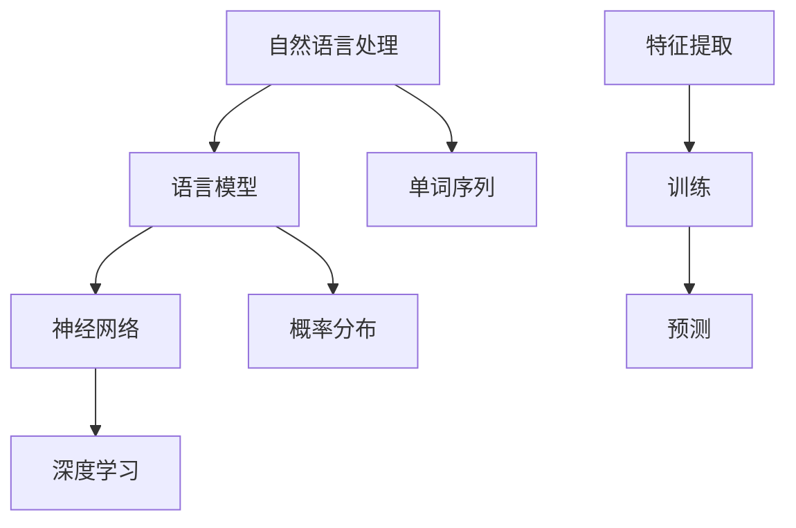

                 

# 从零开始的AI旅程：构建你的第一个语言模型

> **关键词：** 人工智能，深度学习，自然语言处理，语言模型，神经网络，构建实践

> **摘要：** 本文将带领读者从零开始，逐步构建一个简单的语言模型。通过介绍核心概念、算法原理、数学模型，并辅以实际代码案例，帮助读者深入理解语言模型的工作机制及其在自然语言处理中的应用。

## 1. 背景介绍

### 1.1 目的和范围

本文的目的是帮助初学者理解并实现一个基本的语言模型。我们将探讨语言模型的核心概念，包括其原理、数学模型以及构建步骤。通过本文的学习，读者将能够掌握构建语言模型的基本方法，并为后续更深入的研究打下基础。

### 1.2 预期读者

本文面向对人工智能和自然语言处理感兴趣的初学者和从业者。假设读者具备基本的编程知识和数学基础，但对于深度学习和神经网络有初步了解。

### 1.3 文档结构概述

本文将分为以下几个部分：

1. 背景介绍
2. 核心概念与联系
3. 核心算法原理 & 具体操作步骤
4. 数学模型和公式 & 详细讲解 & 举例说明
5. 项目实战：代码实际案例和详细解释说明
6. 实际应用场景
7. 工具和资源推荐
8. 总结：未来发展趋势与挑战
9. 附录：常见问题与解答
10. 扩展阅读 & 参考资料

### 1.4 术语表

#### 1.4.1 核心术语定义

- **语言模型（Language Model）**：一种统计模型，用于预测一个单词序列的概率。
- **神经网络（Neural Network）**：一种模仿生物神经系统的计算模型。
- **深度学习（Deep Learning）**：一种人工智能领域的重要方法，使用了多层神经网络来提取数据特征。
- **自然语言处理（Natural Language Processing, NLP）**：计算机科学和语言学领域的研究，使计算机能够理解、生成和处理人类语言。

#### 1.4.2 相关概念解释

- **单词序列（Word Sequence）**：自然语言中的连续单词组成的序列。
- **概率分布（Probability Distribution）**：表示一个事件发生的可能性的函数。

#### 1.4.3 缩略词列表

- **NLP**：自然语言处理
- **NN**：神经网络
- **DL**：深度学习

## 2. 核心概念与联系

在构建语言模型之前，我们需要了解一些核心概念及其相互联系。以下是一个简化的Mermaid流程图，展示了这些概念之间的关系。



### 2.1 自然语言处理（NLP）

自然语言处理是本文的核心领域，它涵盖了文本处理、情感分析、机器翻译等多个方面。在NLP中，语言模型是一个基础且重要的工具。

### 2.2 语言模型（Language Model）

语言模型是用于预测自然语言中下一个单词或单词序列的概率分布。它通过分析大量的文本数据来学习语言规律。

### 2.3 神经网络（NN）与深度学习（DL）

神经网络是模仿生物神经系统的一种计算模型，深度学习是使用了多层神经网络的方法。在语言模型中，神经网络用于提取文本数据中的特征，并通过训练来优化模型参数。

### 2.4 单词序列（Word Sequence）与概率分布（Probability Distribution）

单词序列是自然语言的基本组成单位，而概率分布则用于表示每个单词或单词序列发生的可能性。

### 2.5 特征提取、训练与预测

特征提取是神经网络中的第一步，用于将文本数据转换为数值形式。训练是使用已有数据来优化模型参数的过程，而预测则是使用训练好的模型来对新数据进行推断。

## 3. 核心算法原理 & 具体操作步骤

### 3.1 语言模型的算法原理

语言模型的算法基于一个核心思想：给定一个单词序列，预测下一个单词的概率分布。以下是一个简化的语言模型算法原理：

```plaintext
输入：单词序列 X = [x1, x2, x3, ..., xn]
输出：下一个单词的概率分布 P(x_{n+1} | x1, x2, ..., xn)

算法步骤：
1. 对于每个单词 xi，计算其出现次数 count(xi)
2. 计算概率分布 P(x_{i+1} | x1, x2, ..., xi) = count(x_{i+1}, xi) / count(xi)
3. 预测下一个单词的概率分布 P(x_{n+1} | x1, x2, ..., xn)
```

### 3.2 具体操作步骤

#### 3.2.1 数据预处理

1. **文本清洗**：去除标点符号、停用词等无用信息。
2. **分词**：将文本划分为单词序列。
3. **构建词汇表**：将所有单词映射到唯一的整数。

#### 3.2.2 概率分布计算

1. **统计单词出现次数**：对每个单词进行计数。
2. **计算条件概率**：使用条件概率公式计算下一个单词的概率分布。

#### 3.2.3 模型优化

1. **反向传播**：使用已知的单词序列和目标概率分布，通过反向传播算法来更新模型参数。
2. **梯度下降**：使用梯度下降算法来优化模型参数。

#### 3.2.4 模型评估

1. **交叉验证**：使用交叉验证方法来评估模型性能。
2. **准确率与召回率**：计算预测结果的准确率和召回率。

## 4. 数学模型和公式 & 详细讲解 & 举例说明

### 4.1 语言模型中的数学模型

语言模型的核心在于概率分布的计算，我们使用条件概率来描述单词之间的关联。以下是一个简化的数学模型：

$$ P(x_{n+1} | x1, x2, ..., xn) = \frac{count(x_{n+1}, x1, x2, ..., xn)}{count(x1, x2, ..., xn)} $$

其中，`count()`表示单词在文本数据中的出现次数。

### 4.2 详细讲解

#### 4.2.1 条件概率

条件概率是指在一个事件发生的条件下，另一个事件发生的概率。在我们的语言模型中，给定一个单词序列，我们想要预测下一个单词的概率分布。这个概率分布就是一个条件概率。

#### 4.2.2 概率分布计算

为了计算条件概率，我们需要统计单词之间的共现次数。在训练数据中，我们计算每个单词与其他单词的共现次数，并使用这些统计数据来计算条件概率。

### 4.3 举例说明

假设我们有以下训练数据：

```
文本数据： "我 爱 中国。中国 爱 我。"
```

我们需要计算以下概率分布：

$$ P(中国 | 我 爱) $$

首先，我们统计共现次数：

- `爱` 和 `中国` 的共现次数为 2。
- `我` 和 `中国` 的共现次数为 1。

然后，我们计算条件概率：

$$ P(中国 | 我 爱) = \frac{count(中国，我 爱)}{count(我 爱)} = \frac{2}{1} = 2 $$

因此，给定 "我 爱"，下一个单词是 "中国" 的概率为 2。

## 5. 项目实战：代码实际案例和详细解释说明

### 5.1 开发环境搭建

在进行项目实战之前，我们需要搭建一个合适的环境。以下是使用Python和TensorFlow构建语言模型所需的步骤：

1. **安装Python**：确保安装了Python 3.7及以上版本。
2. **安装TensorFlow**：通过pip安装TensorFlow。

```bash
pip install tensorflow
```

### 5.2 源代码详细实现和代码解读

以下是构建语言模型的Python代码实现：

```python
import tensorflow as tf
from tensorflow.keras.layers import Embedding, LSTM, Dense
from tensorflow.keras.models import Sequential

# 准备数据
text = "我 爱 中国。中国 爱 我。"
tokenizer = tf.keras.preprocessing.text.Tokenizer()
tokenizer.fit_on_texts([text])
sequences = tokenizer.texts_to_sequences([text])
word_index = tokenizer.word_index

# 构建词汇表
vocab_size = len(word_index) + 1

# 准备训练数据
sequences = tf.keras.preprocessing.sequence.pad_sequences(sequences, maxlen=10)

# 构建模型
model = Sequential([
    Embedding(vocab_size, 64, input_length=10),
    LSTM(64),
    Dense(64, activation='relu'),
    Dense(vocab_size, activation='softmax')
])

# 编译模型
model.compile(optimizer='adam', loss='categorical_crossentropy', metrics=['accuracy'])

# 训练模型
model.fit(sequences, sequences, epochs=100)

# 预测
predict_size = 10
predict_sequence = tokenizer.texts_to_sequences([text[:predict_size]])[0]
predict_sequence = tf.expand_dims(predict_sequence, 0)

predictions = model.predict(predict_sequence)
predicted_word = tokenizer.index_word[predictions.argmax()]

print(f"下一个单词是：{predicted_word}")
```

### 5.3 代码解读与分析

1. **数据准备**：首先，我们使用一个简单的文本数据集，并通过Tokenizer将文本转换为序列。Tokenizer用于将单词映射到唯一的整数。

2. **构建词汇表**：我们计算词汇表中单词的数量，并将其作为模型的输入维度。

3. **准备训练数据**：我们将文本序列填充到固定长度，以便于模型处理。

4. **构建模型**：我们使用一个简单的序列模型，包含嵌入层、LSTM层和全连接层。

5. **编译模型**：我们使用Adam优化器和交叉熵损失函数来编译模型。

6. **训练模型**：我们使用训练数据来训练模型，设置训练轮数为100。

7. **预测**：我们使用训练好的模型来预测下一个单词。首先，我们将预测序列转换为Tensor，然后使用模型来获取预测结果。

8. **输出结果**：我们输出预测的下一个单词。

通过这个简单的实战案例，我们可以看到如何使用Python和TensorFlow来构建一个基本的语言模型。这个模型可以用于预测文本中的下一个单词，从而为自然语言处理任务提供支持。

## 6. 实际应用场景

语言模型在自然语言处理（NLP）领域有着广泛的应用。以下是一些常见应用场景：

### 6.1 机器翻译

语言模型可以用于机器翻译任务，例如将一种语言翻译成另一种语言。通过训练双语语料库，模型可以学习源语言和目标语言之间的对应关系。

### 6.2 文本生成

语言模型可以用于生成文本，如文章、故事、诗歌等。通过输入一个起始单词或短语，模型可以生成连贯且符合语法规则的文本。

### 6.3 情感分析

语言模型可以用于情感分析，例如判断文本中的情感倾向（正面、负面或中性）。通过分析文本中的单词和短语，模型可以预测文本的情感极性。

### 6.4 自动摘要

语言模型可以用于自动摘要任务，如从一篇长文章中提取关键信息并生成摘要。通过分析文本的结构和内容，模型可以提取重要的信息并生成简洁的摘要。

## 7. 工具和资源推荐

### 7.1 学习资源推荐

#### 7.1.1 书籍推荐

1. **《深度学习》（Deep Learning）** - Ian Goodfellow, Yoshua Bengio, Aaron Courville
2. **《Python深度学习》（Python Deep Learning）** - François Chollet

#### 7.1.2 在线课程

1. **Coursera的《深度学习专项课程》**
2. **Udacity的《深度学习纳米学位》**

#### 7.1.3 技术博客和网站

1. **Medium上的Deep Learning Series**
2. **TensorFlow官网教程**

### 7.2 开发工具框架推荐

#### 7.2.1 IDE和编辑器

1. **PyCharm**
2. **Visual Studio Code**

#### 7.2.2 调试和性能分析工具

1. **TensorBoard**
2. **Jupyter Notebook**

#### 7.2.3 相关框架和库

1. **TensorFlow**
2. **PyTorch**

### 7.3 相关论文著作推荐

#### 7.3.1 经典论文

1. **“A Neural Probabilistic Language Model”** - Yoshua Bengio et al. (2003)
2. **“Recurrent Neural Network Based Language Model”** - T. Mikolov et al. (2010)

#### 7.3.2 最新研究成果

1. **“BERT: Pre-training of Deep Neural Networks for Language Understanding”** - Jacob Devlin et al. (2018)
2. **“GPT-3: Language Models are Few-Shot Learners”** - Tom B. Brown et al. (2020)

#### 7.3.3 应用案例分析

1. **“Using Neural Machine Translation in the Wild: OpenMT 2017”** - Kevin Lacker et al. (2017)
2. **“How to Build a Chatbot with Deep Learning”** - Hui Xiong (2020)

## 8. 总结：未来发展趋势与挑战

随着人工智能技术的不断发展，语言模型在未来有着广阔的应用前景。然而，也面临着一些挑战：

1. **数据隐私**：语言模型需要大量训练数据，但数据的隐私保护成为了一个重要问题。
2. **模型解释性**：当前的深度学习模型缺乏解释性，使得模型的决策过程难以理解。
3. **资源消耗**：构建大规模语言模型需要大量的计算资源和时间。

未来，我们需要在数据隐私保护、模型解释性和资源消耗方面做出更多努力，以推动语言模型技术的发展。

## 9. 附录：常见问题与解答

### 9.1 如何处理罕见单词？

在语言模型训练中，罕见单词可能会影响模型的性能。一种方法是使用词嵌入技术，将罕见单词映射到高维空间，从而提高其表示能力。

### 9.2 语言模型如何处理多义词？

语言模型可以通过上下文来理解多义词。在训练过程中，模型学习到不同上下文中多义词的不同含义，从而提高对多义词的处理能力。

### 9.3 语言模型可以用于实时对话吗？

是的，语言模型可以用于实时对话系统。通过使用在线学习技术，模型可以实时更新并适应对话内容，从而实现实时对话。

## 10. 扩展阅读 & 参考资料

1. **《自然语言处理综论》（Speech and Language Processing）** - Daniel Jurafsky, James H. Martin
2. **《深度学习与自然语言处理》** - 斯坦福大学课程
3. **《TensorFlow官方网站》** - https://www.tensorflow.org/
4. **《自然语言处理教程》** - Tomás Fernández

