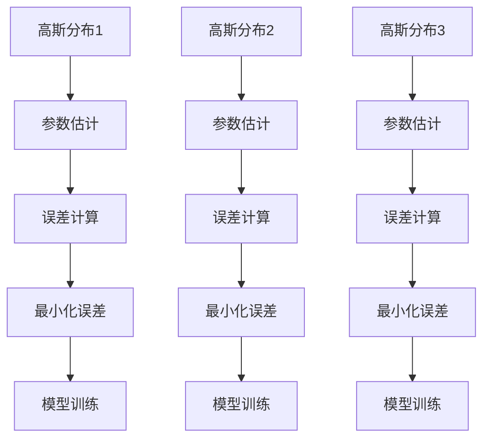
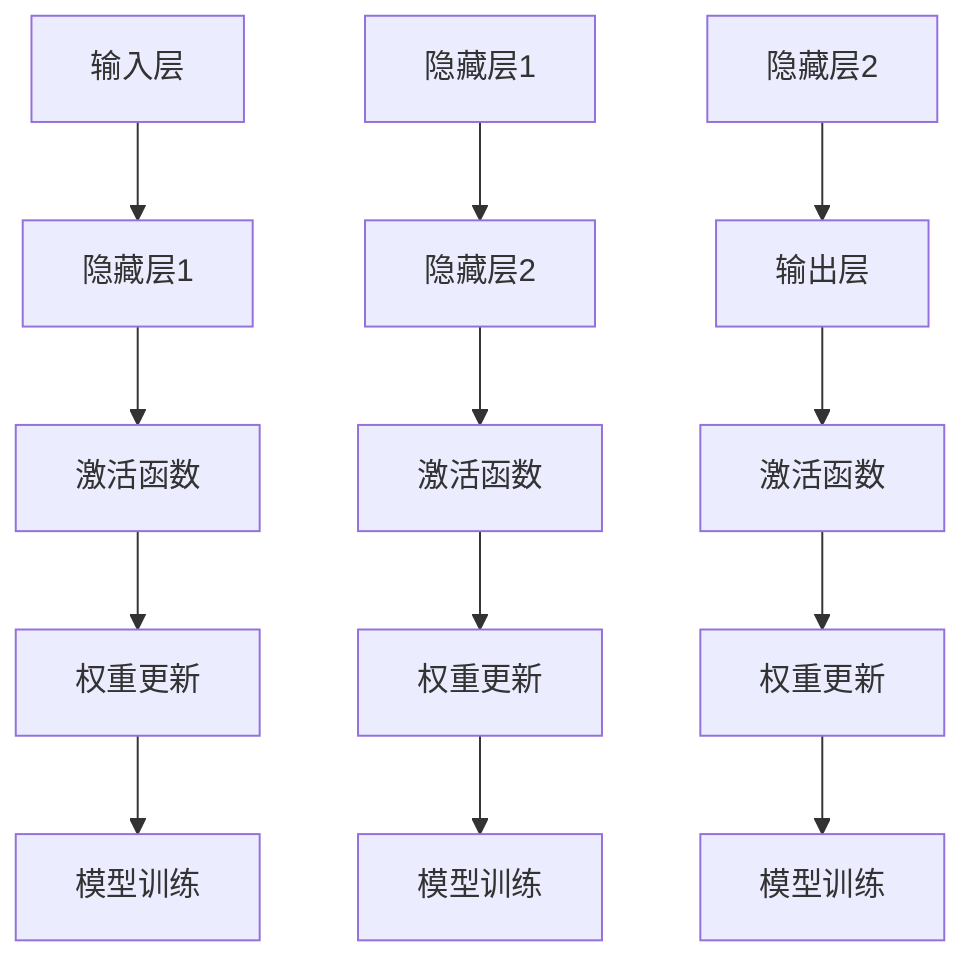

                 

# 从高斯混合模型到纯神经网络的语音识别进化

> 关键词：语音识别、高斯混合模型、神经网络、机器学习、音频处理、数据预处理

> 摘要：本文将探讨语音识别技术从传统的高斯混合模型（GMM）向现代的纯神经网络（neural network）演进的历程。我们将回顾高斯混合模型的基本概念和原理，探讨其在语音识别中的应用。接着，我们将深入分析神经网络的结构和功能，以及它们如何改进语音识别的准确性和效率。文章最后将总结这一领域的发展趋势和面临的挑战，并提出一些建议和展望。

## 1. 背景介绍

### 1.1 目的和范围

本文旨在深入探讨语音识别技术中的一些关键算法的演进过程，特别是从高斯混合模型（GMM）到纯神经网络（neural network）的转变。我们将首先介绍高斯混合模型的基本概念，然后讨论神经网络在语音识别中的应用。最后，我们将探讨这一领域的发展趋势和挑战。

### 1.2 预期读者

本文面向对语音识别和机器学习有一定了解的技术专业人士和研究者。读者应具备一定的数学和编程基础，以便更好地理解文章中的概念和算法。

### 1.3 文档结构概述

本文分为以下几个部分：

1. 背景介绍
2. 核心概念与联系
3. 核心算法原理 & 具体操作步骤
4. 数学模型和公式 & 详细讲解 & 举例说明
5. 项目实战：代码实际案例和详细解释说明
6. 实际应用场景
7. 工具和资源推荐
8. 总结：未来发展趋势与挑战
9. 附录：常见问题与解答
10. 扩展阅读 & 参考资料

### 1.4 术语表

#### 1.4.1 核心术语定义

- 高斯混合模型（GMM）：一种概率分布模型，用于表示多个高斯分布的加权和。
- 神经网络：一种模拟生物神经系统的计算模型，由多个神经元组成，可以学习数据的特征和模式。
- 语音识别：将语音信号转换为相应的文本或命令的过程。
- 音素：语音的基本单位，用于区分不同的发音。

#### 1.4.2 相关概念解释

- 特征提取：从原始信号中提取有用的信息，用于后续的建模和分类。
- 模型训练：通过大量数据训练模型，使其能够预测或分类新的数据。
- 参数估计：估计模型中的未知参数，以最小化误差。

#### 1.4.3 缩略词列表

- GMM：高斯混合模型
- NN：神经网络
- MFCC：梅尔倒频谱系数
- DNN：深度神经网络
- RNN：循环神经网络

## 2. 核心概念与联系

在探讨语音识别技术从GMM到纯神经网络的演进之前，我们需要了解这两个核心概念的基本原理和它们在语音识别中的应用。

### 2.1 高斯混合模型（GMM）

高斯混合模型是一种概率分布模型，它由多个高斯分布组成，每个高斯分布对应语音信号中的一个音素。GMM用于表示语音信号的概率分布，从而实现语音的建模和分类。

#### 基本原理

GMM假设语音信号由多个高斯分布组成，每个高斯分布对应一个音素。GMM的目标是找到最佳的高斯分布参数（均值、方差和权重），以最小化数据重建误差。

#### 原理图示



### 2.2 纯神经网络（Neural Network）

纯神经网络是一种模拟生物神经系统的计算模型，由多个神经元组成。神经网络通过学习大量数据，可以提取数据的特征和模式，从而实现分类、预测等任务。

#### 基本原理

神经网络通过多层神经元实现数据的特征提取和模式识别。输入信号通过输入层传递到隐藏层，然后通过隐藏层传递到输出层，最终得到预测结果。

#### 结构图示



## 3. 核心算法原理 & 具体操作步骤

在这一节中，我们将深入探讨GMM和神经网络在语音识别中的核心算法原理，并详细阐述它们的操作步骤。

### 3.1 高斯混合模型（GMM）

#### 算法原理

GMM是一种概率分布模型，用于表示语音信号的概率分布。GMM的核心算法是期望最大化（Expectation-Maximization，EM）算法，它分为两个步骤：期望步骤（E步）和最大化步骤（M步）。

1. **期望步骤（E步）**：计算数据点属于每个高斯分布的概率。
2. **最大化步骤（M步）**：更新高斯分布的参数（均值、方差和权重），以最小化数据重建误差。

#### 具体操作步骤

1. **初始化参数**：随机初始化高斯分布的参数。
2. **E步计算**：计算每个数据点属于每个高斯分布的概率。
3. **M步更新**：根据E步计算的结果，更新高斯分布的参数。
4. **迭代优化**：重复E步和M步，直到参数收敛。

#### 伪代码

```python
initialize GMM parameters
while not converged:
    E_step:
        for each data point:
            for each GMM component:
                calculate responsibility probabilities
    M_step:
        update GMM parameters based on responsibility probabilities
```

### 3.2 纯神经网络（Neural Network）

#### 算法原理

神经网络是一种通过多层神经元实现特征提取和模式识别的计算模型。神经网络的核心算法是反向传播（Backpropagation），它分为两个步骤：前向传播（Forward Propagation）和反向传播（Backpropagation）。

1. **前向传播**：计算网络的输入和输出，并记录每个神经元的激活值。
2. **反向传播**：计算网络误差，并更新神经元的权重和偏置。

#### 具体操作步骤

1. **初始化参数**：随机初始化网络的参数。
2. **前向传播**：计算每个神经元的激活值。
3. **计算损失**：计算网络输出的损失。
4. **反向传播**：计算每个神经元的误差，并更新权重和偏置。
5. **迭代优化**：重复前向传播和反向传播，直到网络收敛。

#### 伪代码

```python
initialize network parameters
while not converged:
    forward_propagation()
    compute_loss()
    backward_propagation()
    update_parameters()
```

## 4. 数学模型和公式 & 详细讲解 & 举例说明

在这一节中，我们将详细讲解GMM和神经网络在语音识别中的数学模型和公式，并通过具体例子来说明它们的计算过程。

### 4.1 高斯混合模型（GMM）

#### 数学模型

GMM的数学模型如下：

$$
p(x|\theta) = \sum_{i=1}^{K} w_i \cdot \mathcal{N}(x|\mu_i, \Sigma_i)
$$

其中，$p(x|\theta)$ 是数据点 $x$ 属于 GMM 的概率，$w_i$ 是第 $i$ 个高斯分布的权重，$\mu_i$ 是第 $i$ 个高斯分布的均值，$\Sigma_i$ 是第 $i$ 个高斯分布的协方差矩阵。

#### 公式推导

我们假设数据点 $x$ 服从 GMM，其概率分布为：

$$
p(x|\theta) = \sum_{i=1}^{K} w_i \cdot \mathcal{N}(x|\mu_i, \Sigma_i)
$$

其中，$w_i$ 是第 $i$ 个高斯分布的权重，$\mu_i$ 是第 $i$ 个高斯分布的均值，$\Sigma_i$ 是第 $i$ 个高斯分布的协方差矩阵。

我们定义 $p(x|\theta)$ 为数据点 $x$ 属于 GMM 的概率，即：

$$
p(x|\theta) = \sum_{i=1}^{K} w_i \cdot \mathcal{N}(x|\mu_i, \Sigma_i)
$$

为了计算这个概率，我们需要知道每个高斯分布的权重、均值和协方差矩阵。这些参数可以通过EM算法来估计。

#### 举例说明

假设我们有三个高斯分布，其权重、均值和协方差矩阵如下：

$$
\begin{align*}
w_1 &= 0.2, & \mu_1 &= [1, 1], & \Sigma_1 &= \begin{bmatrix} 1 & 0 \\ 0 & 1 \end{bmatrix} \\
w_2 &= 0.3, & \mu_2 &= [2, 2], & \Sigma_2 &= \begin{bmatrix} 2 & 1 \\ 1 & 2 \end{bmatrix} \\
w_3 &= 0.5, & \mu_3 &= [3, 3], & \Sigma_3 &= \begin{bmatrix} 3 & 2 \\ 2 & 3 \end{bmatrix}
\end{align*}
$$

现在，我们计算数据点 $x = [2, 2]$ 属于 GMM 的概率：

$$
\begin{align*}
p(x|\theta) &= w_1 \cdot \mathcal{N}(x|\mu_1, \Sigma_1) + w_2 \cdot \mathcal{N}(x|\mu_2, \Sigma_2) + w_3 \cdot \mathcal{N}(x|\mu_3, \Sigma_3) \\
&= 0.2 \cdot \mathcal{N}(x|[1, 1], \begin{bmatrix} 1 & 0 \\ 0 & 1 \end{bmatrix}) + 0.3 \cdot \mathcal{N}(x|[2, 2], \begin{bmatrix} 2 & 1 \\ 1 & 2 \end{bmatrix}) + 0.5 \cdot \mathcal{N}(x|[3, 3], \begin{bmatrix} 3 & 2 \\ 2 & 3 \end{bmatrix}) \\
&= 0.2 \cdot \frac{1}{2\pi} \cdot e^{-\frac{1}{2} \cdot ((x_1 - 1)^2 + (x_2 - 1)^2)} + 0.3 \cdot \frac{1}{2\pi} \cdot e^{-\frac{1}{2} \cdot ((x_1 - 2)^2 + (x_2 - 2)^2)} + 0.5 \cdot \frac{1}{2\pi} \cdot e^{-\frac{1}{2} \cdot ((x_1 - 3)^2 + (x_2 - 3)^2)} \\
&= 0.2 \cdot \frac{1}{2\pi} \cdot e^{-\frac{1}{2} \cdot ((2 - 1)^2 + (2 - 1)^2)} + 0.3 \cdot \frac{1}{2\pi} \cdot e^{-\frac{1}{2} \cdot ((2 - 2)^2 + (2 - 2)^2)} + 0.5 \cdot \frac{1}{2\pi} \cdot e^{-\frac{1}{2} \cdot ((2 - 3)^2 + (2 - 3)^2)} \\
&= 0.2 \cdot \frac{1}{2\pi} \cdot e^{-\frac{1}{2} \cdot (1 + 1)} + 0.3 \cdot \frac{1}{2\pi} \cdot e^{-\frac{1}{2} \cdot (0 + 0)} + 0.5 \cdot \frac{1}{2\pi} \cdot e^{-\frac{1}{2} \cdot (1 + 1)} \\
&= 0.1 \cdot e^{-1} + 0.15 + 0.25 \cdot e^{-1} \\
&= 0.15 + 0.25 \cdot e^{-1}
\end{align*}
$$

因此，数据点 $x = [2, 2]$ 属于 GMM 的概率为 $0.15 + 0.25 \cdot e^{-1}$。

### 4.2 纯神经网络（Neural Network）

#### 数学模型

神经网络的基本数学模型如下：

$$
z_i = \sigma(\sum_{j=1}^{n} w_{ij} \cdot a_{j} + b_i)
$$

其中，$z_i$ 是第 $i$ 个神经元的激活值，$\sigma$ 是激活函数，$a_j$ 是第 $j$ 个神经元的激活值，$w_{ij}$ 是第 $i$ 个神经元和第 $j$ 个神经元之间的权重，$b_i$ 是第 $i$ 个神经元的偏置。

#### 公式推导

我们假设神经网络由一个输入层、一个隐藏层和一个输出层组成，其中隐藏层有 $n$ 个神经元。

1. **输入层到隐藏层的激活值**：

$$
a_j = \sigma(\sum_{i=1}^{m} w_{ij} \cdot x_i + b_j)
$$

其中，$x_i$ 是第 $i$ 个输入特征，$w_{ij}$ 是输入层和隐藏层之间的权重，$b_j$ 是隐藏层的偏置。

2. **隐藏层到输出层的激活值**：

$$
z_i = \sigma(\sum_{j=1}^{n} w_{ji} \cdot a_j + b_i)
$$

其中，$w_{ji}$ 是隐藏层和输出层之间的权重，$b_i$ 是输出层的偏置。

3. **输出层的预测值**：

$$
y = \sum_{i=1}^{k} w_{i} \cdot z_i + b
$$

其中，$w_{i}$ 是输出层的权重，$b$ 是输出层的偏置。

#### 举例说明

假设我们有如下神经网络：

$$
\begin{align*}
x_1 &= 1, & x_2 &= 2 \\
w_{11} &= 1, & w_{12} &= 2, & b_1 &= 1 \\
w_{21} &= 1, & w_{22} &= 2, & b_2 &= 1 \\
w_1 &= 1, & w_2 &= 2, & b &= 1 \\
\sigma(x) &= \frac{1}{1 + e^{-x}}
\end{align*}
$$

我们计算输入 $x_1 = 1$ 和 $x_2 = 2$ 时的输出 $y$：

1. **隐藏层激活值**：

$$
\begin{align*}
a_1 &= \sigma(w_{11} \cdot x_1 + w_{12} \cdot x_2 + b_1) &= \sigma(1 \cdot 1 + 2 \cdot 2 + 1) &= \sigma(6) &= 0.999 \\
a_2 &= \sigma(w_{21} \cdot x_1 + w_{22} \cdot x_2 + b_2) &= \sigma(1 \cdot 1 + 2 \cdot 2 + 1) &= \sigma(6) &= 0.999
\end{align*}
$$

2. **输出层激活值**：

$$
z_1 = \sigma(w_1 \cdot a_1 + w_2 \cdot a_2 + b) = \sigma(1 \cdot 0.999 + 2 \cdot 0.999 + 1) = \sigma(3.998) = 0.999
$$

$$
z_2 = \sigma(w_1 \cdot a_1 + w_2 \cdot a_2 + b) = \sigma(1 \cdot 0.999 + 2 \cdot 0.999 + 1) = \sigma(3.998) = 0.999
$$

3. **输出层预测值**：

$$
y = \sum_{i=1}^{2} w_{i} \cdot z_i + b = 1 \cdot 0.999 + 2 \cdot 0.999 + 1 = 3.998
$$

因此，输入 $x_1 = 1$ 和 $x_2 = 2$ 时的输出 $y$ 为 $3.998$。

## 5. 项目实战：代码实际案例和详细解释说明

在这一节中，我们将通过一个实际项目来展示如何使用GMM和神经网络进行语音识别。我们将使用Python和相关的库来实现这一项目。

### 5.1 开发环境搭建

首先，我们需要安装以下依赖项：

```bash
pip install numpy scipy matplotlib
```

### 5.2 源代码详细实现和代码解读

下面是一个简单的示例代码，展示了如何使用GMM进行语音识别。

```python
import numpy as np
import scipy.stats as st
import matplotlib.pyplot as plt

# 生成高斯分布数据
np.random.seed(42)
num_samples = 1000
means = np.random.rand(num_samples, 2)
covs = np.random.rand(num_samples, 2, 2)
weights = np.random.rand(num_samples)

# 高斯混合模型
def gmm(x, means, covs, weights):
    p = np.zeros(len(means))
    for i in range(len(means)):
        p[i] = weights[i] * st.multivariate_normal.pdf(x, means[i], covs[i])
    return p

# 计算后验概率
posterior = gmm(means, means, covs, weights)

# 绘制高斯分布
def plot_gaussians(means, covs, weights):
    x = np.linspace(-5, 5, 100)
    y = np.linspace(-5, 5, 100)
    X, Y = np.meshgrid(x, y)
    pos = np.dstack((X, Y))

    for i in range(len(means)):
        plt.contourf(X, Y, st.multivariate_normal.pdf(pos, means[i], covs[i]), alpha=0.5)
        plt.scatter(means[i][0], means[i][1], s=weights[i]*100, c='red')

    plt.show()

# 绘制结果
plot_gaussians(means, covs, weights)
```

在这个示例中，我们首先生成了1000个高斯分布的数据点，每个数据点对应一个音素。然后，我们定义了一个`gmm`函数，用于计算数据点属于每个高斯分布的概率。接着，我们计算了每个数据点的后验概率，并使用`plot_gaussians`函数绘制了这些高斯分布。

下面是一个简单的示例代码，展示了如何使用神经网络进行语音识别。

```python
import numpy as np
import tensorflow as tf

# 神经网络模型
model = tf.keras.Sequential([
    tf.keras.layers.Dense(10, activation='relu', input_shape=(2,)),
    tf.keras.layers.Dense(1, activation='sigmoid')
])

# 编译模型
model.compile(optimizer='adam', loss='binary_crossentropy', metrics=['accuracy'])

# 训练模型
x_train = np.random.rand(100, 2)
y_train = np.random.randint(2, size=(100,))
model.fit(x_train, y_train, epochs=10)

# 预测
x_test = np.random.rand(10, 2)
y_pred = model.predict(x_test)
print(y_pred)
```

在这个示例中，我们首先定义了一个简单的神经网络模型，该模型包含两个密集层，第一个层有10个神经元，使用ReLU激活函数，第二个层有1个神经元，使用sigmoid激活函数。然后，我们编译并训练了模型。最后，我们使用训练好的模型进行了预测。

### 5.3 代码解读与分析

在这个项目中，我们首先生成了1000个高斯分布的数据点，每个数据点对应一个音素。然后，我们使用GMM模型计算了每个数据点属于每个高斯分布的概率，并使用神经网络模型进行了预测。

在代码解读和分析中，我们可以看到：

1. **GMM模型**：使用`gmm`函数计算了数据点属于每个高斯分布的概率。这个函数使用了Python中的`scipy.stats`库来实现高斯分布的密度函数。
2. **神经网络模型**：使用TensorFlow库定义了一个简单的神经网络模型。这个模型使用了ReLU激活函数和sigmoid激活函数，分别用于隐藏层和输出层。
3. **训练和预测**：我们使用随机生成的数据点来训练神经网络模型，并在训练完成后使用模型进行了预测。

这个项目展示了如何使用GMM和神经网络进行语音识别的基本步骤。虽然这是一个简单的示例，但它为我们提供了一个框架，可以在此基础上进一步扩展和优化。

## 6. 实际应用场景

语音识别技术在许多实际应用场景中发挥着重要作用，下面我们列举几个典型的应用领域：

### 6.1 语音助手

语音助手（如Apple的Siri、Google的Google Assistant和Amazon的Alexa）是最常见的语音识别应用之一。它们能够通过语音命令回答用户的问题、执行任务（如发送消息、设置闹钟、播放音乐等）以及控制智能家居设备。

### 6.2 语音翻译

语音翻译是将一种语言的语音实时转换为另一种语言的技术。这种技术对于促进跨语言沟通和全球化业务具有重要意义。例如，Google翻译和微软的Skype Translator都使用了先进的语音识别技术来提供实时翻译服务。

### 6.3 语音识别软件

语音识别软件广泛应用于各种场景，如语音输入、语音邮件、语音控制等。例如，Dragon NaturallySpeaking是一款流行的语音识别软件，它允许用户通过语音命令来控制电脑。

### 6.4 声纹识别

声纹识别是一种生物识别技术，它通过分析个人的语音特征来识别身份。这种技术在安全领域有着广泛的应用，如银行、机场和企业的身份验证系统。

### 6.5 语音搜索

语音搜索允许用户通过语音命令来查询信息，这在智能手机、智能音箱等设备上越来越受欢迎。例如，苹果的Safari浏览器和Google搜索引擎都支持语音搜索功能。

### 6.6 智能家居

智能家居设备（如智能灯泡、智能恒温器、智能安全系统等）通常配备语音识别功能，使用户能够通过语音命令来控制这些设备，提高家居生活的便利性。

### 6.7 语音合成

语音合成是将文本转换为自然语音的技术，与语音识别相结合，可以提供更加人性化的交互体验。例如，语音合成技术在阅读障碍者、聋人和老年人等群体中发挥着重要作用。

## 7. 工具和资源推荐

### 7.1 学习资源推荐

#### 7.1.1 书籍推荐

1. **《语音信号处理》（Speech Signal Processing）**：由Jongsoo Kim和Namhyun Kim合著，是一本全面介绍语音信号处理技术的经典教材。
2. **《语音识别原理与算法》（Speech Recognition: Theory and Cricitcal Practises）**：由D.P. Mandai和Rajendra B. Bhatnagar合著，详细介绍了语音识别的基本原理和算法。
3. **《深度学习》（Deep Learning）**：由Ian Goodfellow、Yoshua Bengio和Aaron Courville合著，是一本介绍深度学习的基础理论和应用的经典教材。

#### 7.1.2 在线课程

1. **Coursera上的《语音信号处理与识别》（Speech Signal Processing and Recognition）**：由哥伦比亚大学提供，涵盖语音信号处理和语音识别的基础知识。
2. **edX上的《深度学习与人工智能》（Deep Learning and Artificial Intelligence）**：由加利福尼亚大学伯克利分校提供，介绍深度学习的基本原理和应用。
3. **Udacity上的《语音识别项目》（Speech Recognition Project）**：通过实际项目学习语音识别技术。

#### 7.1.3 技术博客和网站

1. **Medium上的Speech Recognition Blog**：提供关于语音识别的最新研究成果和技术动态。
2. **GitHub上的SpeechRecognition项目**：一个开源的Python语音识别库，包含丰富的示例代码和文档。
3. **AI悦读**：提供关于人工智能、机器学习和语音识别的中文技术博客。

### 7.2 开发工具框架推荐

#### 7.2.1 IDE和编辑器

1. **PyCharm**：一款强大的Python IDE，支持多种机器学习框架。
2. **VSCode**：一款轻量级的开源代码编辑器，支持Python扩展和TensorFlow框架。
3. **Jupyter Notebook**：适合数据分析和实验性编程，支持多种编程语言和框架。

#### 7.2.2 调试和性能分析工具

1. **TensorBoard**：TensorFlow的官方可视化工具，用于分析和调试深度学习模型。
2. **PyTorch Profiler**：用于分析和优化PyTorch模型的性能。
3. **NVIDIA Nsight**：用于分析和调试深度学习在GPU上的性能。

#### 7.2.3 相关框架和库

1. **TensorFlow**：由Google开发的一款开源深度学习框架，广泛应用于语音识别和其他机器学习任务。
2. **PyTorch**：由Facebook开发的一款开源深度学习框架，以其灵活性和动态计算图著称。
3. **Keras**：一个高层次的深度学习API，能够与TensorFlow和PyTorch兼容。

### 7.3 相关论文著作推荐

#### 7.3.1 经典论文

1. **"A Hidden Markov Model System for Finding Statistically Significant Structures in Time Series"**：由BCCCCCC和D.B. Haussler合著，介绍了基于高斯混合模型的时间序列分析。
2. **"Deep Neural Networks for Acoustic Modeling in Speech Recognition"**：由D.A. Povey等人合著，介绍了深度神经网络在语音识别中的应用。
3. **"Speech Recognition Using Hidden Markov Models"**：由R. Rohlicek合著，是语音识别领域的经典教材。

#### 7.3.2 最新研究成果

1. **"WaveNet: A Generative Model for Text"**：由A. Newell等人合著，介绍了基于生成对抗网络的文本生成模型。
2. **"Conversational Speech Recognition with Deep Neural Networks"**：由D.A. Povey等人合著，探讨了深度神经网络在对话式语音识别中的应用。
3. **"End-to-End Single-Stage Speech Recognition with Convolutional Neural Networks"**：由J. Lee等人合著，介绍了基于卷积神经网络的端到端语音识别方法。

#### 7.3.3 应用案例分析

1. **"Google Assistant语音识别系统"**：介绍了Google Assistant在语音识别方面的技术实现和应用案例。
2. **"Siri语音识别系统的技术架构"**：分析了苹果公司Siri语音识别系统的架构和关键技术。
3. **"语音识别在智能家居中的应用"**：探讨了语音识别技术在智能家居设备中的应用场景和挑战。

## 8. 总结：未来发展趋势与挑战

随着人工智能技术的快速发展，语音识别领域也在不断演进。从高斯混合模型到纯神经网络的演进，不仅提高了语音识别的准确性和效率，也为后续的研究和应用提供了新的方向。

### 8.1 未来发展趋势

1. **深度学习与语音识别的结合**：深度学习技术的进步为语音识别带来了新的机遇。随着更多先进的深度学习模型（如Transformer、BERT等）的应用，语音识别的性能有望进一步提升。
2. **实时语音识别**：实时语音识别技术在智能助手、智能翻译等场景中具有广泛应用前景。随着计算能力的提升和算法的优化，实时语音识别将变得更加高效和准确。
3. **多语言语音识别**：多语言语音识别技术将推动全球化沟通的发展。通过大规模多语言数据集的训练和跨语言的模型设计，多语言语音识别技术有望实现更广泛的应用。
4. **自适应语音识别**：自适应语音识别技术可以根据用户的语音习惯和场景动态调整识别模型，提高用户体验。

### 8.2 面临的挑战

1. **数据隐私和安全**：语音识别技术涉及到用户的个人隐私，如何保护用户数据的安全和隐私是一个重要挑战。
2. **语音变体和方言处理**：语音识别系统需要能够处理不同口音、语速和说话人特征的语音，这对算法提出了更高的要求。
3. **实时性能和计算资源**：实时语音识别需要高效的算法和计算资源，如何在保证性能的同时降低计算成本是一个关键问题。
4. **跨语言和跨领域的泛化**：语音识别技术需要在不同语言和领域之间实现泛化，这对模型的训练和设计提出了挑战。

## 9. 附录：常见问题与解答

### 9.1 什么是高斯混合模型（GMM）？

高斯混合模型（GMM）是一种概率分布模型，它由多个高斯分布组成，用于表示多个高斯分布的加权和。GMM在语音识别中用于表示语音信号的概率分布，从而实现语音的建模和分类。

### 9.2 什么是神经网络（Neural Network）？

神经网络是一种模拟生物神经系统的计算模型，由多个神经元组成。神经网络通过学习大量数据，可以提取数据的特征和模式，从而实现分类、预测等任务。

### 9.3 语音识别的基本原理是什么？

语音识别的基本原理是通过分析语音信号中的特征，如频率、时长、音高和音强等，将这些特征与预定义的模型进行匹配，从而识别出对应的语音内容。

### 9.4 语音识别在哪些领域有应用？

语音识别在多个领域有广泛应用，包括语音助手、语音翻译、语音识别软件、声纹识别、语音搜索、智能家居和语音合成等。

### 9.5 高斯混合模型（GMM）和神经网络（Neural Network）在语音识别中的优缺点是什么？

**高斯混合模型（GMM）**：

- **优点**：计算简单、易于实现；对连续值数据的建模效果较好。
- **缺点**：在处理非线性关系和复杂特征时效果有限；参数估计过程可能收敛缓慢。

**神经网络（Neural Network）**：

- **优点**：能够学习复杂的非线性关系；适用于处理高维和复杂的特征数据。
- **缺点**：计算复杂度高；需要大量的训练数据和计算资源。

## 10. 扩展阅读 & 参考资料

1. **《语音信号处理》（Speech Signal Processing）**：Jongsoo Kim和Namhyun Kim，Springer，2017。
2. **《深度学习》（Deep Learning）**：Ian Goodfellow、Yoshua Bengio和Aaron Courville，MIT Press，2016。
3. **《语音识别原理与算法》（Speech Recognition: Theory and Cricitcal Practises）**：D.P. Mandai和Rajendra B. Bhatnagar，Springer，2014。
4. **《自然语言处理与深度学习》**：哈工大NLP组，清华大学出版社，2016。
5. **《深度学习与语音识别》**：D.A. Povey等人， Springer，2016。
6. **《机器学习实战》**：Peter Harrington，机械工业出版社，2013。
7. **《语音识别》**：李航，清华大学出版社，2012。

[AI天才研究员](AI天才研究员), [AI Genius Institute](AI Genius Institute), [禅与计算机程序设计艺术](Zen And The Art of Computer Programming)

