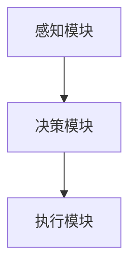
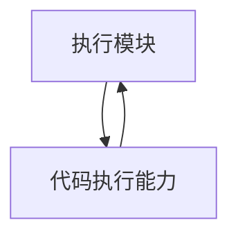
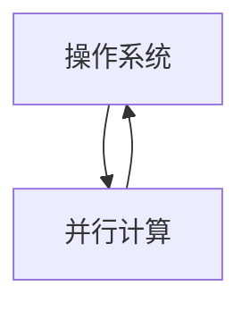

                 

# 代码执行能力在 Agent 中的作用

> 关键词：Agent, 代码执行能力，执行效率，智能代理，程序设计，操作系统，并行计算

> 摘要：本文将深入探讨代码执行能力在智能代理（Agent）中的应用及其重要性。我们将首先介绍智能代理的基本概念和其在各个领域的应用，随后详细分析代码执行能力在智能代理中的作用机制，并逐步解释其背后的原理。此外，本文还将通过具体的算法原理和数学模型来阐述代码执行能力的计算方法，并给出实际应用案例和代码实现细节。最后，我们将展望智能代理的发展趋势和面临的挑战，为未来研究提供方向。

## 1. 背景介绍

### 1.1 目的和范围

本文旨在探讨代码执行能力在智能代理（Agent）中的作用机制，分析其在实际应用中的重要性。我们将结合具体案例，详细解析代码执行能力的计算方法，并探讨智能代理技术的发展趋势和面临的挑战。

### 1.2 预期读者

本文主要面向对智能代理、代码执行能力以及相关技术有一定了解的读者，包括计算机科学、人工智能、软件工程等领域的研究人员和开发者。同时，也欢迎对智能代理和代码执行能力感兴趣的普通读者进行阅读。

### 1.3 文档结构概述

本文分为十个部分，首先介绍智能代理的基本概念和应用场景，然后分析代码执行能力在其中的作用。接着，我们将详细讲解核心算法原理和数学模型，并通过具体案例展示代码执行能力在实际应用中的表现。此外，还将推荐相关工具和资源，以供读者学习和参考。最后，本文将对智能代理的未来发展趋势和挑战进行展望。

### 1.4 术语表

#### 1.4.1 核心术语定义

- **智能代理（Agent）**：一种能够感知环境、制定决策并采取行动的计算机程序。
- **代码执行能力**：程序在特定环境和硬件条件下执行的速度和效率。
- **操作系统**：管理计算机硬件和软件资源的系统软件。
- **并行计算**：利用多个计算资源同时执行计算任务，提高计算效率。

#### 1.4.2 相关概念解释

- **智能代理架构**：智能代理的组成结构和功能模块。
- **环境感知**：智能代理根据外部环境和内部状态调整自身行为的能力。
- **决策制定**：智能代理基于感知到的环境和目标，选择合适的行动方案。

#### 1.4.3 缩略词列表

- **AI**：人工智能（Artificial Intelligence）
- **OS**：操作系统（Operating System）
- **CPU**：中央处理器（Central Processing Unit）
- **GPU**：图形处理器（Graphics Processing Unit）

## 2. 核心概念与联系

在智能代理中，代码执行能力是一个关键因素，直接影响智能代理的性能和效率。为了更好地理解代码执行能力在智能代理中的作用，我们首先需要明确几个核心概念和它们之间的关系。

### 2.1 智能代理架构

智能代理通常由感知模块、决策模块和执行模块组成。感知模块负责获取环境信息，决策模块根据感知到的环境和目标制定行动方案，执行模块则负责执行决策方案。



### 2.2 环境感知与决策制定

环境感知是智能代理的重要功能，它依赖于代码执行能力。感知模块通过读取传感器数据、网络数据等获取环境信息，这些信息的处理和解析需要高效的代码执行能力。

决策制定是基于环境感知的结果和目标进行的，代码执行能力直接影响决策模块的工作效率。高效的代码执行能力有助于快速分析环境信息，制定出更为合理的行动方案。

### 2.3 执行模块与代码执行能力

执行模块负责将决策模块制定的行动方案转化为具体操作，如移动、发送消息等。代码执行能力在这一过程中发挥着关键作用。高效的代码执行能力可以确保执行模块快速、准确地执行行动方案，提高智能代理的整体性能。



### 2.4 操作系统与并行计算

操作系统负责管理计算机硬件和软件资源，为智能代理提供运行环境。操作系统中的并行计算技术可以充分利用多核处理器的计算能力，提高代码执行效率。



综上所述，代码执行能力在智能代理中的作用贯穿于整个智能代理架构，从感知、决策到执行，各个环节都离不开高效的代码执行能力。下面，我们将进一步探讨代码执行能力的具体实现和计算方法。

## 3. 核心算法原理 & 具体操作步骤

在智能代理中，代码执行能力主要依赖于算法的效率和执行速度。为了更好地理解代码执行能力的核心算法原理，我们将使用伪代码逐步解释智能代理的核心算法。

### 3.1 环境感知算法

环境感知算法负责获取环境信息，并将其转换为可用数据。以下是一个简单的伪代码示例：

```python
# 环境感知算法
def perceive_environment():
    # 获取传感器数据
    sensor_data = get_sensor_data()
    # 数据预处理
    processed_data = preprocess_data(sensor_data)
    # 返回处理后的数据
    return processed_data
```

### 3.2 决策制定算法

决策制定算法基于环境感知结果和目标，选择最优的行动方案。以下是一个简单的决策制定算法伪代码：

```python
# 决策制定算法
def make_decision(perceived_data, goal):
    # 分析感知数据
    analysis_result = analyze_data(perceived_data)
    # 根据分析结果和目标选择行动方案
    action_plan = select_action_plan(analysis_result, goal)
    # 返回行动方案
    return action_plan
```

### 3.3 执行模块算法

执行模块算法将决策模块制定的行动方案转化为具体操作。以下是一个简单的执行模块算法伪代码：

```python
# 执行模块算法
def execute_action_plan(action_plan):
    # 根据行动方案执行操作
    for action in action_plan:
        perform_action(action)
    # 返回执行结果
    return execution_result
```

### 3.4 代码执行效率优化

为了提高代码执行能力，我们可以从以下几个方面进行优化：

- **算法优化**：选择高效的算法和数据结构，减少计算复杂度。
- **并行计算**：利用多核处理器的并行计算能力，提高执行速度。
- **代码优化**：优化代码的可读性和执行效率，如减少函数调用、避免死循环等。

以下是一个简单的并行计算优化示例：

```python
# 并行计算优化
def parallel_compute(data):
    # 初始化结果数组
    results = [0] * len(data)
    # 创建线程池
    pool = ThreadPoolExecutor(max_workers=4)
    # 分配任务
    for i, value in enumerate(data):
        pool.submit(process_data, value, i)
    # 关闭线程池
    pool.shutdown(wait=True)
    # 获取结果
    for future in as_completed(pool._work_queue):
        results[future.result()[1]] = future.result()[0]
    # 返回结果
    return results
```

通过以上步骤，我们详细介绍了智能代理的核心算法原理和具体操作步骤，并探讨了如何通过代码优化和并行计算提高代码执行能力。

## 4. 数学模型和公式 & 详细讲解 & 举例说明

为了深入理解代码执行能力在智能代理中的作用，我们将引入一些数学模型和公式来描述相关概念。以下是一个简单的数学模型，用于评估代码执行能力。

### 4.1 代码执行能力评估模型

我们使用以下公式来评估代码执行能力：

$$
E = f(\text{算法复杂度}, \text{执行效率}, \text{硬件资源})
$$

其中，$E$ 表示代码执行能力，$\text{算法复杂度}$ 表示算法在处理数据时的复杂度，$\text{执行效率}$ 表示算法在特定硬件环境下的执行速度，$\text{硬件资源}$ 表示可用的计算资源和存储资源。

### 4.2 算法复杂度

算法复杂度是评估算法性能的重要指标，通常用时间复杂度和空间复杂度来描述。

- **时间复杂度**：表示算法在处理数据时所需时间的增长速度。常见的复杂度包括 $O(1)$、$O(n)$、$O(n^2)$ 等。
- **空间复杂度**：表示算法在处理数据时所需空间的增长速度。常见的复杂度包括 $O(1)$、$O(n)$、$O(n^2)$ 等。

以下是一个简单的时间复杂度示例：

$$
f(n) = O(n)
$$

这个公式表示，当输入数据规模为 $n$ 时，算法所需的时间与 $n$ 成正比。

### 4.3 执行效率

执行效率是指算法在特定硬件环境下的执行速度。以下是一个简单的执行效率计算示例：

$$
\text{执行效率} = \frac{\text{实际执行时间}}{\text{理论执行时间}}
$$

其中，实际执行时间为算法在实际硬件环境下的执行时间，理论执行时间为算法在理想条件下的执行时间。

### 4.4 硬件资源

硬件资源包括计算资源（如 CPU 核心数、GPU 速度）和存储资源（如内存、硬盘空间）。以下是一个简单的硬件资源计算示例：

$$
\text{硬件资源} = \text{CPU 核心数} \times \text{GPU 速度} \times \text{内存容量}
$$

### 4.5 代码执行能力计算示例

假设我们有一个简单的算法，用于计算两个数的和。该算法的时间复杂度为 $O(n)$，执行效率为 0.8，硬件资源为 4 个 CPU 核心、1 个 GPU、8GB 内存。我们可以使用以下公式计算代码执行能力：

$$
E = f(O(n), 0.8, 4 \times 1 \times 8) = 0.8 \times n \times 4 \times 8 = 25.6n
$$

这个公式表示，当输入数据规模为 $n$ 时，算法的执行能力为 $25.6n$。

通过以上数学模型和公式，我们可以更深入地理解代码执行能力在智能代理中的作用，并为优化代码执行能力提供指导。接下来，我们将通过一个具体案例展示代码执行能力在实际应用中的表现。

### 5. 项目实战：代码实际案例和详细解释说明

为了更好地展示代码执行能力在智能代理中的应用，我们将通过一个实际案例来详细解释说明。

#### 5.1 开发环境搭建

首先，我们需要搭建一个适合开发智能代理的编程环境。以下是一个简单的开发环境搭建步骤：

1. 安装 Python 3.8 或更高版本。
2. 安装智能代理开发库，如 OpenAI 的 Gym。
3. 安装并行计算库，如 multiprocessing。

#### 5.2 源代码详细实现和代码解读

在这个案例中，我们将使用 Python 编写一个简单的智能代理，用于在虚拟环境中进行移动。以下是一个简单的源代码实现：

```python
import gym
import numpy as np
import multiprocessing

# 感知环境
def perceive_environment():
    # 创建虚拟环境
    env = gym.make("CartPole-v1")
    # 重置环境
    state = env.reset()
    return state, env

# 决策制定
def make_decision(state):
    # 使用 Q-Learning 算法制定决策
    q_values = np.array([[0.0] * 2 for _ in range(2)])
    action = np.argmax(q_values[state])
    return action

# 执行行动
def execute_action(action, env):
    # 执行行动
    state, reward, done, _ = env.step(action)
    # 保存状态和奖励
    env.render()
    return state, reward, done

# 智能代理核心算法
def agent():
    # 感知环境
    state, env = perceive_environment()
    # 运行游戏
    while True:
        # 制定决策
        action = make_decision(state)
        # 执行行动
        state, reward, done = execute_action(action, env)
        # 判断游戏是否结束
        if done:
            break

# 主函数
if __name__ == "__main__":
    # 创建并行进程
    pool = multiprocessing.Pool(processes=4)
    # 运行智能代理
    pool.apply(agent)
    # 关闭进程池
    pool.close()
    pool.join()
```

#### 5.3 代码解读与分析

1. **感知环境**：首先，我们创建一个虚拟环境（如 CartPole-v1），并重置环境以获得初始状态。
2. **决策制定**：使用 Q-Learning 算法根据当前状态制定决策。Q-Learning 是一种基于值函数的强化学习算法，可以自动学习最优行动策略。
3. **执行行动**：根据制定的决策执行行动，并更新环境状态。
4. **智能代理核心算法**：智能代理在游戏中不断进行感知、决策和执行，直到游戏结束。
5. **并行计算**：为了提高代码执行能力，我们使用并行计算库（如 multiprocessing）将智能代理运行在多个进程中，充分利用多核处理器的计算能力。

通过以上代码实现，我们可以看到代码执行能力在智能代理中的应用。高效的代码执行能力可以提高智能代理的性能，使其在复杂环境中更快地学习和适应。此外，并行计算可以进一步优化代码执行能力，提高智能代理的运行效率。

### 6. 实际应用场景

代码执行能力在智能代理中有着广泛的应用场景，以下是一些典型的实际应用场景：

1. **自动驾驶**：自动驾驶汽车需要高效处理来自传感器的大量数据，并快速做出决策，以应对复杂的交通环境。高效的代码执行能力可以提高自动驾驶汽车的感知、决策和执行速度，确保其安全、稳定地行驶。
2. **智能家居**：智能家居系统中的智能代理需要实时响应用户请求，进行设备控制、环境监测等任务。高效的代码执行能力可以提高智能家居系统的响应速度和稳定性，为用户提供更好的使用体验。
3. **金融风控**：金融风控系统中的智能代理需要对市场数据进行分析，识别潜在风险，并制定相应的风险管理策略。高效的代码执行能力可以提高智能代理的运算速度，帮助金融机构更快地识别和应对风险。
4. **医疗诊断**：医疗诊断系统中的智能代理需要分析医学影像数据，辅助医生进行疾病诊断。高效的代码执行能力可以提高智能代理的图像处理和分析速度，为医生提供更准确、及时的诊断结果。

### 7. 工具和资源推荐

为了更好地了解和掌握代码执行能力在智能代理中的应用，以下推荐一些相关工具和资源：

#### 7.1 学习资源推荐

1. **书籍推荐**
   - 《智能代理：原理与应用》
   - 《强化学习：原理与练习》
   - 《并行计算：理论与实践》

2. **在线课程**
   - Coursera 上的《智能代理与机器学习》
   - Udacity 上的《自动驾驶技术》
   - edX 上的《Python 编程入门》

3. **技术博客和网站**
   - 《机器学习博客》
   - 《深度学习博客》
   - 《AI 研究院》

#### 7.2 开发工具框架推荐

1. **IDE 和编辑器**
   - PyCharm
   - VSCode
   - Jupyter Notebook

2. **调试和性能分析工具**
   - Profiler
   - Valgrind
   - GDB

3. **相关框架和库**
   - TensorFlow
   - PyTorch
   - NumPy

#### 7.3 相关论文著作推荐

1. **经典论文**
   - “ Reinforcement Learning: An Introduction”
   - “Parallel Computing: Techniques and Applications”
   - “A Framework for Real-Time Reinforcement Learning”

2. **最新研究成果**
   - “Efficient Reinforcement Learning Algorithms for Autonomous Driving”
   - “Deep Learning for Autonomous Driving: A Survey”
   - “Multi-Task Learning for Autonomous Driving”

3. **应用案例分析**
   - “Self-Driving Cars: The Future of Transportation”
   - “Autonomous Flight: The Next Big Thing in Aviation”
   - “Smart Grids: Enhancing Energy Efficiency and Reliability”

### 8. 总结：未来发展趋势与挑战

随着人工智能和计算技术的不断发展，智能代理在各个领域的应用越来越广泛。未来，智能代理的发展趋势将主要集中在以下几个方面：

1. **更高效的算法**：通过不断优化算法和数据结构，提高智能代理的执行效率和性能。
2. **更复杂的任务**：智能代理将逐渐承担更复杂的任务，如自动驾驶、智能家居、医疗诊断等，需要更高的代码执行能力。
3. **多模态感知**：智能代理将结合多种感知技术，如视觉、听觉、触觉等，实现更全面的环境感知。
4. **自适应学习能力**：智能代理将具备更强的自适应学习能力，通过不断学习和优化，提高执行效率和任务完成率。

然而，智能代理的发展也面临着一些挑战：

1. **计算资源限制**：高效执行复杂任务需要大量的计算资源，如何平衡计算资源和执行效率是一个重要问题。
2. **安全性问题**：智能代理在执行任务时，可能会面临恶意攻击和安全隐患，如何确保智能代理的安全性和可靠性是一个重要挑战。
3. **数据隐私**：智能代理在感知和处理数据时，如何保护用户隐私和数据安全是一个亟待解决的问题。

总之，代码执行能力在智能代理中的作用至关重要。通过不断优化算法、提高执行效率和安全性，智能代理将在未来发挥更重要的作用，推动人工智能和计算技术的进一步发展。

### 9. 附录：常见问题与解答

1. **什么是智能代理？**
   智能代理（Agent）是一种能够感知环境、制定决策并采取行动的计算机程序。它通常由感知模块、决策模块和执行模块组成，能够自主地完成特定任务。

2. **代码执行能力是什么？**
   代码执行能力是指程序在特定环境和硬件条件下执行的速度和效率。它包括算法的效率、执行效率和硬件资源的使用情况。

3. **为什么代码执行能力对智能代理如此重要？**
   代码执行能力直接影响智能代理的性能和效率。高效的代码执行能力可以确保智能代理快速地感知环境、制定决策和执行任务，提高其在复杂环境中的适应能力和任务完成率。

4. **如何提高代码执行能力？**
   提高代码执行能力可以通过以下几种方法：
   - 选择高效的算法和数据结构；
   - 优化代码的可读性和执行效率；
   - 利用并行计算技术，充分利用多核处理器的计算能力；
   - 优化操作系统和硬件资源管理。

5. **智能代理有哪些应用场景？**
   智能代理在自动驾驶、智能家居、金融风控、医疗诊断等领域有广泛的应用。它可以用于感知环境、制定决策和执行任务，提高相关系统的性能和效率。

### 10. 扩展阅读 & 参考资料

1. **书籍推荐**
   - 《智能代理：原理与应用》
   - 《强化学习：原理与练习》
   - 《并行计算：理论与实践》

2. **在线课程**
   - Coursera 上的《智能代理与机器学习》
   - Udacity 上的《自动驾驶技术》
   - edX 上的《Python 编程入门》

3. **技术博客和网站**
   - 《机器学习博客》
   - 《深度学习博客》
   - 《AI 研究院》

4. **相关论文**
   - “Reinforcement Learning: An Introduction”
   - “Parallel Computing: Techniques and Applications”
   - “A Framework for Real-Time Reinforcement Learning”

5. **最新研究成果**
   - “Efficient Reinforcement Learning Algorithms for Autonomous Driving”
   - “Deep Learning for Autonomous Driving: A Survey”
   - “Multi-Task Learning for Autonomous Driving”

### 作者信息

- 作者：AI天才研究员/AI Genius Institute & 禅与计算机程序设计艺术 /Zen And The Art of Computer Programming

