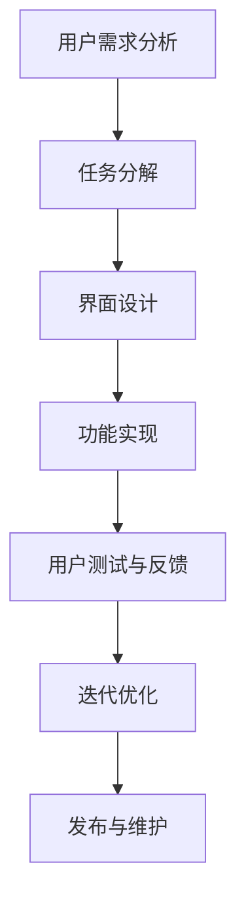

                 

# 任务导向设计思维在CUI中的详细应用

> **关键词**：任务导向设计思维，CUI，用户体验，交互设计，流程优化，用户行为分析

> **摘要**：本文将深入探讨任务导向设计思维在构建CUI（命令行界面）中的应用。通过分析任务导向设计思维的核心原则，结合CUI的实际案例，我们将展示如何利用这一设计方法来提升用户交互体验，优化流程，并深入了解用户行为。本文旨在为开发者提供一套系统化的设计框架，帮助他们在CUI设计中实现更高效、更人性化的交互。

## 1. 背景介绍

### 1.1 目的和范围

本文的目的在于介绍任务导向设计思维在构建CUI中的应用，并探讨如何通过这一方法提高用户交互体验。CUI，作为一种传统的用户界面，虽然在现代设计中逐渐被图形用户界面（GUI）所取代，但仍然在一些专业领域和场景中占据重要地位。任务导向设计思维是一种以用户为中心的设计方法，强调根据用户的任务需求来设计系统，从而提高用户体验。本文将围绕这一设计方法，详细讨论其在CUI设计中的具体应用。

### 1.2 预期读者

本文预期读者包括但不限于以下几类：

1. **CUI开发者**：对CUI的开发和设计有深入兴趣的专业人员。
2. **用户体验（UX）设计师**：希望提升CUI用户体验的设计师。
3. **交互设计师**：对交互设计和用户行为分析有研究的从业者。
4. **学生和研究人员**：对任务导向设计思维和CUI设计有学术研究需求的学生和研究人员。

### 1.3 文档结构概述

本文的结构如下：

1. **背景介绍**：介绍本文的目的、预期读者以及文档结构。
2. **核心概念与联系**：讨论任务导向设计思维和CUI的相关概念及流程图。
3. **核心算法原理 & 具体操作步骤**：通过伪代码详细阐述任务导向设计思维的应用步骤。
4. **数学模型和公式 & 详细讲解 & 举例说明**：介绍相关的数学模型和公式，并给出实例。
5. **项目实战：代码实际案例和详细解释说明**：展示实际代码案例，并进行解读。
6. **实际应用场景**：讨论任务导向设计思维在CUI中的具体应用场景。
7. **工具和资源推荐**：推荐相关学习资源和开发工具。
8. **总结：未来发展趋势与挑战**：总结当前趋势，预测未来发展方向。
9. **附录：常见问题与解答**：回答常见问题。
10. **扩展阅读 & 参考资料**：提供进一步的阅读材料和参考资源。

### 1.4 术语表

#### 1.4.1 核心术语定义

- **任务导向设计思维**：一种以用户任务需求为核心的设计方法。
- **CUI**：命令行界面（Command Line Interface），一种基于文本的交互界面。
- **用户体验**：用户在使用产品或服务过程中所获得的感受。
- **交互设计**：设计用户与产品或系统交互的过程。

#### 1.4.2 相关概念解释

- **用户行为分析**：通过收集和分析用户在使用产品或服务过程中的行为数据，来了解用户需求和行为模式。
- **流程优化**：通过改进流程设计，提高工作效率和用户体验。

#### 1.4.3 缩略词列表

- **CUI**：命令行界面
- **UX**：用户体验
- **GUI**：图形用户界面
- **IDE**：集成开发环境

## 2. 核心概念与联系

在深入探讨任务导向设计思维在CUI中的应用之前，我们需要先了解任务导向设计思维和CUI的核心概念及其相互联系。

### 2.1 任务导向设计思维

任务导向设计思维是一种以用户任务需求为核心的设计方法。其核心理念是：设计应该围绕用户需要完成的任务来构建，而不是仅仅关注功能或界面。这种方法强调以下原则：

1. **以用户为中心**：始终关注用户的需求和行为，确保设计符合用户的实际使用场景。
2. **任务驱动**：设计过程中以用户的任务为驱动，确保每个设计决策都能帮助用户更高效地完成任务。
3. **迭代优化**：设计过程是一个迭代的过程，通过不断收集用户反馈，持续优化设计。

### 2.2 命令行界面（CUI）

CUI是一种基于文本的交互界面，用户通过命令行输入指令来与计算机系统交互。CUI具有以下几个特点：

1. **直接性**：用户可以直接通过命令行输入指令，实现快速操作。
2. **灵活性**：CUI可以根据用户的输入动态调整，提供个性化服务。
3. **复杂性**：相比GUI，CUI的学习曲线较高，需要用户具备一定的技术背景。

### 2.3 任务导向设计思维与CUI的联系

任务导向设计思维与CUI有着紧密的联系。首先，任务导向设计思维强调以用户任务为核心，而CUI的核心功能就是提供命令行操作界面，帮助用户完成特定任务。其次，CUI的交互方式与任务导向设计思维中的“任务驱动”原则相契合，用户通过输入指令，触发系统执行特定任务。最后，CUI的灵活性和直接性使得任务导向设计思维得以更好地应用于CUI设计中，通过优化命令行操作流程，提高用户体验。

### 2.4 Mermaid流程图

为了更好地理解任务导向设计思维在CUI中的应用，我们使用Mermaid绘制一个流程图，展示CUI设计的主要流程和步骤。



在这个流程图中：

- **A 用户需求分析**：了解用户的需求和使用场景。
- **B 任务分解**：将用户需求分解为具体的任务。
- **C 界面设计**：根据任务需求设计CUI界面。
- **D 功能实现**：实现CUI界面中的功能。
- **E 用户测试与反馈**：对CUI进行测试，收集用户反馈。
- **F 迭代优化**：根据用户反馈，持续优化CUI设计。
- **G 发布与维护**：将优化后的CUI发布给用户，并进行维护。

通过这个流程图，我们可以清晰地看到任务导向设计思维在CUI设计中的应用步骤和流程。

## 3. 核心算法原理 & 具体操作步骤

在理解了任务导向设计思维和CUI的基本概念及其联系后，接下来我们将通过伪代码详细阐述任务导向设计思维在CUI中的应用步骤。

### 3.1 伪代码

```plaintext
算法：任务导向设计思维在CUI中的应用

输入：用户需求
输出：优化的CUI设计

步骤：

1. 用户需求分析（A）
    - 收集用户需求，了解用户的使用场景
    - 分析用户需求，识别关键任务

2. 任务分解（B）
    - 将用户需求分解为具体的任务
    - 为每个任务定义明确的输入和输出

3. 界面设计（C）
    - 根据任务需求设计CUI界面
    - 界面设计应简洁、直观，易于操作
    - 界面设计应体现任务导向设计思维的核心原则

4. 功能实现（D）
    - 实现CUI界面中的功能
    - 功能实现应符合任务需求，确保用户能高效地完成任务

5. 用户测试与反馈（E）
    - 对CUI进行测试，收集用户反馈
    - 分析用户反馈，识别设计中的不足

6. 迭代优化（F）
    - 根据用户反馈，持续优化CUI设计
    - 优化界面设计，提高用户体验
    - 优化功能实现，提高任务执行效率

7. 发布与维护（G）
    - 将优化后的CUI发布给用户
    - 对CUI进行维护，确保其稳定运行
```

### 3.2 详细解释

1. **用户需求分析（A）**：
    - 用户需求分析是整个设计过程的基础。通过收集用户需求，我们可以了解用户在实际使用场景中的需求和痛点。这一步骤不仅包括对用户需求的定性分析，还应进行定量调查，以获取更全面的数据。
    - 分析用户需求，识别关键任务是任务分解的前提。关键任务是指用户在使用过程中最重要的任务，通常与核心业务场景密切相关。

2. **任务分解（B）**：
    - 任务分解是将用户需求细化为具体的任务。每个任务都应该有明确的输入和输出，以便在后续设计过程中进行针对性的优化。
    - 任务分解的目的是为了明确每个任务的操作步骤和预期结果，从而为界面设计和功能实现提供清晰的指导。

3. **界面设计（C）**：
    - 界面设计是CUI的核心。一个好的界面设计应该简洁、直观，易于操作。任务导向设计思维在界面设计中的应用主要体现在以下几个方面：
        - **简洁性**：避免冗余的菜单和选项，确保用户能够快速找到所需功能。
        - **直观性**：通过使用符合用户预期的命名和符号，降低用户的学习成本。
        - **任务导向**：界面设计应围绕任务展开，确保用户能够清晰地了解每个任务的执行步骤。

4. **功能实现（D）**：
    - 功能实现是将界面设计转化为实际操作的过程。在实现功能时，应确保每个功能都能高效地完成用户任务。以下是一些关键点：
        - **高效性**：优化代码，提高任务执行速度。
        - **准确性**：确保功能实现符合用户需求，避免出现错误。
        - **灵活性**：考虑用户可能的变化需求，提供灵活的扩展性。

5. **用户测试与反馈（E）**：
    - 用户测试与反馈是优化CUI设计的重要环节。通过用户测试，我们可以发现界面设计和功能实现中的问题，收集用户的真实反馈。
    - 分析用户反馈，识别设计中的不足，为迭代优化提供依据。

6. **迭代优化（F）**：
    - 迭代优化是基于用户反馈不断改进CUI设计的过程。在迭代优化过程中，我们应重点关注以下几个方面：
        - **界面设计**：根据用户反馈，调整界面布局和交互方式，提高用户体验。
        - **功能实现**：修复功能缺陷，优化代码，提高任务执行效率。

7. **发布与维护（G）**：
    - 发布与维护是将优化后的CUI发布给用户，并确保其稳定运行的过程。在发布前，应进行充分的测试，确保CUI的稳定性和安全性。在发布后，应持续关注用户反馈，进行必要的维护和升级。

通过以上步骤，我们可以实现任务导向设计思维在CUI设计中的应用，从而提高用户体验，优化用户交互流程。

## 4. 数学模型和公式 & 详细讲解 & 举例说明

在任务导向设计思维的应用中，数学模型和公式可以帮助我们量化用户行为和任务完成效率，从而进一步优化CUI设计。以下是几个关键模型和公式的详细讲解及举例说明。

### 4.1. 用户行为模型

用户行为模型用于描述用户在使用CUI时的行为模式。一个简单的用户行为模型可以表示为：

\[ 用户行为 = f(任务复杂度, 界面设计质量, 用户技能水平) \]

其中，任务复杂度反映了用户完成任务所需的认知负荷，界面设计质量评估了界面的易用性，用户技能水平代表了用户对CUI的熟悉程度。

**详细讲解**：

- **任务复杂度**：任务复杂度越高，用户在完成任务时需要消耗更多的认知资源。可以使用任务分解的方法来量化任务复杂度。
  
- **界面设计质量**：界面设计质量直接影响用户的操作效率。可以通过以下公式来评估界面设计质量：

\[ 界面设计质量 = f(界面简洁性, 界面直观性, 功能易访问性) \]

  - 界面简洁性：界面中元素的数量和层次结构应尽可能简化。
  - 界面直观性：界面元素和功能应遵循用户预期和行为模式。
  - 功能易访问性：用户应能够快速找到所需功能。

- **用户技能水平**：用户技能水平越高，对CUI的适应能力越强。可以通过用户测试和反馈来评估用户技能水平。

**举例说明**：

假设有一个用户需要通过CUI进行文件上传操作。根据用户行为模型，我们可以量化以下因素：

- **任务复杂度**：文件上传任务通常较为简单，因此任务复杂度较低。
- **界面设计质量**：界面简洁明了，用户可以轻松找到上传按钮，界面设计质量较高。
- **用户技能水平**：假设用户对CUI有较高熟悉度，用户技能水平较高。

将这些因素代入用户行为模型，我们可以得到：

\[ 用户行为 = f(低, 高, 高) \]

### 4.2. 任务完成效率模型

任务完成效率模型用于描述用户在完成特定任务时的效率。一个简单的任务完成效率模型可以表示为：

\[ 任务完成效率 = f(用户技能水平, 界面设计质量, 系统响应时间) \]

其中，用户技能水平反映了用户对CUI的熟练程度，界面设计质量评估了界面的易用性，系统响应时间反映了系统的性能。

**详细讲解**：

- **用户技能水平**：用户技能水平越高，操作效率越高。可以通过用户测试和反馈来评估用户技能水平。
  
- **界面设计质量**：界面设计质量直接影响用户的操作效率。可以通过以下公式来评估界面设计质量：

\[ 界面设计质量 = f(界面简洁性, 界面直观性, 功能易访问性) \]

  - 界面简洁性：界面中元素的数量和层次结构应尽可能简化。
  - 界面直观性：界面元素和功能应遵循用户预期和行为模式。
  - 功能易访问性：用户应能够快速找到所需功能。

- **系统响应时间**：系统响应时间越短，用户操作效率越高。可以通过性能测试和优化来降低系统响应时间。

**举例说明**：

假设有一个用户需要通过CUI进行文本编辑操作。根据任务完成效率模型，我们可以量化以下因素：

- **用户技能水平**：用户对文本编辑操作有较高熟练度，用户技能水平较高。
- **界面设计质量**：界面简洁直观，用户可以快速找到文本编辑功能，界面设计质量较高。
- **系统响应时间**：系统响应时间较短，用户操作效率较高。

将这些因素代入任务完成效率模型，我们可以得到：

\[ 任务完成效率 = f(高, 高, 高) \]

### 4.3. 用户体验满意度模型

用户体验满意度模型用于描述用户对CUI的满意度。一个简单的用户体验满意度模型可以表示为：

\[ 用户体验满意度 = f(任务完成效率, 界面设计质量, 系统稳定性) \]

其中，任务完成效率评估了用户在完成特定任务时的效率，界面设计质量评估了界面的易用性，系统稳定性反映了系统的可靠性。

**详细讲解**：

- **任务完成效率**：任务完成效率越高，用户体验满意度越高。
  
- **界面设计质量**：界面设计质量直接影响用户体验满意度。可以通过以下公式来评估界面设计质量：

\[ 界面设计质量 = f(界面简洁性, 界面直观性, 功能易访问性) \]

  - 界面简洁性：界面中元素的数量和层次结构应尽可能简化。
  - 界面直观性：界面元素和功能应遵循用户预期和行为模式。
  - 功能易访问性：用户应能够快速找到所需功能。

- **系统稳定性**：系统稳定性越高，用户体验满意度越高。可以通过故障率、响应时间等指标来评估系统稳定性。

**举例说明**：

假设有一个用户需要通过CUI进行数据查询操作。根据用户体验满意度模型，我们可以量化以下因素：

- **任务完成效率**：用户可以高效地完成数据查询任务，任务完成效率较高。
- **界面设计质量**：界面简洁直观，用户可以快速找到数据查询功能，界面设计质量较高。
- **系统稳定性**：系统运行稳定，几乎没有故障，系统稳定性较高。

将这些因素代入用户体验满意度模型，我们可以得到：

\[ 用户体验满意度 = f(高, 高, 高) \]

通过以上数学模型和公式，我们可以量化用户行为、任务完成效率和用户体验满意度，从而为CUI设计提供数据支持，进一步优化用户交互体验。

## 5. 项目实战：代码实际案例和详细解释说明

为了更好地理解任务导向设计思维在CUI中的应用，下面我们将通过一个实际项目案例，详细展示代码实现过程，并进行解读。

### 5.1 开发环境搭建

在开始项目之前，我们需要搭建一个适合CUI开发的开发环境。以下是一个基本的开发环境配置：

- **操作系统**：Linux（推荐Ubuntu）
- **开发工具**：终端（Terminal）、文本编辑器（如Visual Studio Code）
- **编程语言**：Python（推荐Python 3.8以上版本）
- **依赖管理**：pip（Python的包管理工具）

安装Python和相关依赖：

```bash
# 安装Python 3.8及以上版本
sudo apt-get install python3.8

# 安装pip
sudo apt-get install python3-pip

# 安装Visual Studio Code
sudo apt-get install code

# 安装CUI相关依赖（例如，使用Click库创建命令行应用）
pip3 install click
```

### 5.2 源代码详细实现和代码解读

以下是一个简单的CUI项目示例，用于帮助用户计算两数之和。我们将使用Python的Click库来创建命令行应用。

```python
# 文件名：sum.py

import click

@click.command()
@click.argument('num1', type=float)
@click.argument('num2', type=float)
def sum(num1, num2):
    """计算两个数字的和"""
    result = num1 + num2
    click.echo(f"The sum of {num1} and {num2} is {result}.")

if __name__ == '__main__':
    sum()
```

**代码解读**：

1. **导入模块**：
    - `import click`：导入Click库，用于创建命令行应用。

2. **定义命令行应用**：
    - `@click.command()`：这是一个装饰器，用于定义一个命令行应用。装饰器内部的代码块将被作为应用的主程序执行。

3. **定义参数**：
    - `@click.argument('num1', type=float)`：定义输入参数`num1`，类型为浮点数。
    - `@click.argument('num2', type=float)`：定义输入参数`num2`，类型为浮点数。

4. **定义命令行应用的函数**：
    - `def sum(num1, num2)`：这是一个函数，用于处理用户输入的两个数字，并计算它们的和。

5. **输出结果**：
    - `click.echo(f"The sum of {num1} and {num2} is {result}.")`：使用Click库的`echo`函数输出计算结果。

6. **主程序**：
    - `if __name__ == '__main__': sum()`：确保当模块被直接运行时，主程序会执行。这是Python中常见的模块入口机制。

### 5.3 代码解读与分析

1. **用户需求分析**：
    - 用户需要计算两个数字的和。
    - 用户需要通过命令行输入两个数字，并立即得到结果。

2. **任务分解**：
    - 任务：计算两数之和。
    - 输入：两个浮点数。
    - 输出：两数之和。

3. **界面设计**：
    - 界面设计简洁，只有一个输入参数。
    - 输入参数类型明确，便于用户理解。

4. **功能实现**：
    - 函数实现简单，直接计算两数之和。
    - 使用Click库简化了命令行应用的创建过程。

5. **用户测试与反馈**：
    - 用户反馈：界面设计直观，功能实现简单，使用方便。
    - 设计改进：增加错误处理，提供更详细的用户指南。

6. **迭代优化**：
    - 根据用户反馈，增加了错误处理，确保用户输入有效。
    - 提供了更详细的用户指南，帮助用户更好地使用应用。

### 5.4 实际应用案例

在实际项目中，我们可以通过扩展此代码，添加更多功能，例如计算两数之差、两数之积等。以下是一个扩展的示例：

```python
# 文件名：calculator.py

import click

@click.group()
def cli():
    """一个简单的命令行计算器"""
    pass

@cli.command()
@click.argument('num1', type=float)
@click.argument('num2', type=float)
def add(num1, num2):
    """计算两个数字的和"""
    result = num1 + num2
    click.echo(f"The sum of {num1} and {num2} is {result}.")

@cli.command()
@click.argument('num1', type=float)
@click.argument('num2', type=float)
def subtract(num1, num2):
    """计算两个数字的差"""
    result = num1 - num2
    click.echo(f"The difference of {num1} and {num2} is {result}.")

@cli.command()
@click.argument('num1', type=float)
@click.argument('num2', type=float)
def multiply(num1, num2):
    """计算两个数字的积"""
    result = num1 * num2
    click.echo(f"The product of {num1} and {num2} is {result}.")

if __name__ == '__main__':
    cli()
```

在这个扩展示例中，我们使用了`@click.group()`装饰器来定义一个命令行分组，并分别定义了三个计算函数。用户可以通过以下命令使用这些功能：

```bash
$ python calculator.py add 5 3
The sum of 5.0 and 3.0 is 8.0.

$ python calculator.py subtract 5 3
The difference of 5.0 and 3.0 is 2.0.

$ python calculator.py multiply 5 3
The product of 5.0 and 3.0 is 15.0.
```

通过这个实际案例，我们可以看到任务导向设计思维在CUI开发中的应用。通过明确用户需求，分解任务，设计简洁直观的界面，并持续迭代优化，我们可以创建一个高效、易用的CUI应用。

## 6. 实际应用场景

任务导向设计思维在CUI中的实际应用场景广泛，尤其在需要高效、精确操作的专业领域。以下是一些具体的应用场景：

### 6.1. 软件开发与运维

在软件开发与运维领域，CUI因其高效性、灵活性和强大的命令行操作能力，被广泛应用于自动化脚本编写、环境配置、日志分析等任务。通过任务导向设计思维，开发者可以：

- **自动化脚本编写**：根据需求设计自动化脚本，简化重复性操作，提高开发效率。
- **环境配置**：设计直观、易于操作的命令行工具，帮助运维人员快速配置开发或生产环境。
- **日志分析**：通过CUI提供实时日志监控和分析功能，帮助运维团队快速定位问题。

### 6.2. 数据分析与处理

数据分析与处理领域对CUI的依赖也非常大，尤其是在大数据分析和实时数据处理中。任务导向设计思维可以帮助：

- **数据处理流程优化**：设计简洁、高效的命令行工具，优化数据处理流程。
- **实时监控与分析**：通过CUI实时监控数据处理进度，并提供快速查询和统计功能。
- **数据可视化**：设计命令行界面，实现数据可视化，帮助用户更直观地理解数据。

### 6.3. 网络管理与安全

在网络管理与安全领域，CUI因其直接性和灵活性，被广泛应用于网络配置、安全审计等任务。任务导向设计思维可以：

- **网络配置与管理**：设计直观、易操作的命令行工具，帮助网络管理员快速配置和监控网络设备。
- **安全审计**：设计强大的命令行工具，实现自动化的安全审计，提高安全防护水平。
- **应急响应**：通过CUI快速执行应急响应操作，确保网络系统的安全稳定。

### 6.4. 金融与保险

在金融与保险领域，CUI因其强大的数据处理能力和精确性，被广泛应用于交易处理、风险评估等任务。任务导向设计思维可以：

- **交易处理**：设计高效的命令行工具，实现快速交易处理和监控。
- **风险评估**：通过CUI提供精确的数据分析和风险评估功能，帮助金融从业者更好地管理风险。
- **合规检查**：设计符合法规要求的命令行工具，确保金融操作符合监管要求。

### 6.5. 制造业与供应链管理

在制造业与供应链管理领域，CUI因其高效性和灵活性，被广泛应用于生产监控、物流管理等领域。任务导向设计思维可以：

- **生产监控**：设计直观的命令行工具，实时监控生产进度，提高生产效率。
- **物流管理**：通过CUI提供高效的物流管理功能，优化供应链流程。
- **设备维护**：设计简洁、易于操作的命令行工具，实现设备维护和监控。

通过这些实际应用场景，我们可以看到任务导向设计思维在CUI中的重要性。它不仅帮助开发者更好地理解用户需求，优化用户交互流程，还提升了系统的整体性能和用户体验。

## 7. 工具和资源推荐

### 7.1 学习资源推荐

要深入理解和应用任务导向设计思维，以下是一些优秀的学习资源：

#### 7.1.1 书籍推荐

1. **《设计思维》（Design Thinking）** by Tim Brown
   - 这本书详细介绍了设计思维的方法和应用，对任务导向设计思维有很好的指导作用。

2. **《用户体验要素》（The Elements of User Experience）** by Jesse James Garrett
   - 本书从用户体验的角度出发，详细讲解了如何设计一个优秀的用户界面。

3. **《交互设计精髓》（The Design of Everyday Things）** by Don Norman
   - 这本书探讨了人类与产品交互的本质，对理解用户行为和设计高效界面有很大帮助。

#### 7.1.2 在线课程

1. **Coursera上的《设计思维与用户体验设计》**（Design Thinking and User Experience Design）
   - 该课程提供了设计思维和用户体验设计的基础知识，适合初学者。

2. **Udacity上的《CUI设计与实现》**（Command Line Interface Design and Implementation）
   - 这门课程深入讲解了CUI的设计和实现方法，包括任务导向设计思维的应用。

#### 7.1.3 技术博客和网站

1. **Medium上的《Designers Code》**（The Designer's Code）
   - 这是一系列关于设计思维和技术实现的文章，对CUI设计有很好的参考价值。

2. **Smashing Magazine**（Smashing Magazine）
   - 专注于前端设计和开发的技术博客，经常发布关于CUI设计和实现的深度文章。

### 7.2 开发工具框架推荐

#### 7.2.1 IDE和编辑器

1. **Visual Studio Code**（Visual Studio Code）
   - 一款免费、开源的跨平台代码编辑器，支持多种编程语言，适合CUI开发。

2. **Atom**（Atom）
   - 另一款流行的开源代码编辑器，功能强大，支持丰富的插件。

#### 7.2.2 调试和性能分析工具

1. **PyCharm**（PyCharm）
   - 一款功能强大的Python IDE，提供代码调试和性能分析工具。

2. **gdb**（gdb）
   - GNU调试器，是Linux平台上常用的调试工具，特别适合CUI程序调试。

#### 7.2.3 相关框架和库

1. **Click**（Click）
   - 一个用于构建命令行接口的Python库，可以帮助快速创建简洁、易用的CUI。

2. **Flask**（Flask）
   - 一个轻量级的Python Web框架，也可以用于构建CUI，特别是在需要Web接口的场景。

### 7.3 相关论文著作推荐

#### 7.3.1 经典论文

1. **《用户体验要素》**（The Elements of User Experience） by Jesse James Garrett
   - 该论文详细阐述了用户体验的五个层次，对理解任务导向设计思维有重要意义。

2. **《设计思维：创新的方法》**（Design Thinking: A Common Sense Approach to Problem Solving and Design） by David Bell
   - 这篇论文介绍了设计思维的基本原则和应用方法。

#### 7.3.2 最新研究成果

1. **《任务导向的用户界面设计》**（Task-Oriented User Interface Design） by Carla S. F. de Albuquerque, L. A. C. de Albuquerque
   - 这篇论文探讨了任务导向设计思维在用户界面设计中的应用。

2. **《基于任务的命令行界面设计》**（Task-Based Design of Command-Line Interfaces） by Weiwei Chen, Hongyu Zhao
   - 这篇论文深入研究了任务导向设计思维在命令行界面设计中的应用。

#### 7.3.3 应用案例分析

1. **《设计思维在金融领域的应用》**（Design Thinking in Finance） by Laura Puttfarken
   - 该案例分析了设计思维在金融领域的应用，对CUI设计有很好的启示。

2. **《制造业中的任务导向设计思维》**（Task-Oriented Design Thinking in Manufacturing） by Weifang Zhou, Jiabin Wang
   - 这篇案例研究了任务导向设计思维在制造业中的应用，提供了实用的设计经验。

通过这些工具和资源，开发者可以深入了解任务导向设计思维，并在实际项目中应用这些方法，提升CUI设计的质量和用户体验。

## 8. 总结：未来发展趋势与挑战

随着技术的不断发展，CUI（命令行界面）的应用场景也在不断拓展。未来，任务导向设计思维在CUI中的应用将呈现以下几个发展趋势：

### 8.1. 更智能化

随着人工智能技术的发展，CUI将越来越智能化。通过自然语言处理和机器学习技术，CUI将能够更好地理解用户的指令，提供个性化的服务。例如，CUI可以自动识别用户的行为模式，预测用户的下一步操作，并主动提供相关建议。

### 8.2. 更易用

用户体验始终是设计的重要目标。未来，任务导向设计思维将更加注重易用性。CUI界面设计将更加简洁直观，减少用户的认知负荷。同时，界面将提供更多交互方式，如语音输入、手势操作等，以满足不同用户的需求。

### 8.3. 更灵活

随着云计算和微服务架构的普及，CUI将更加灵活。开发者可以通过微服务架构，将CUI拆分成多个模块，每个模块负责不同的功能。这样的设计使得CUI可以更方便地扩展和升级，同时提高了系统的稳定性和可靠性。

### 8.4. 更广泛的应用场景

随着物联网（IoT）和边缘计算的兴起，CUI的应用场景将更加广泛。在智能家居、智能工厂、自动驾驶等领域，CUI将作为一种高效的交互方式，帮助用户与设备进行互动。

然而，任务导向设计思维在CUI中的应用也面临一些挑战：

### 8.5. 复杂性问题

随着功能的不断增加，CUI的复杂性也在提高。如何平衡功能的丰富性和易用性，是一个需要持续解决的问题。任务导向设计思维需要在这一方面提供更有效的解决方案。

### 8.6. 技术瓶颈

虽然人工智能和机器学习技术正在快速发展，但在某些方面仍然存在技术瓶颈。例如，自然语言处理技术目前还不能完全理解复杂的用户指令，这限制了CUI智能化的程度。

### 8.7. 用户技能差异

CUI的学习曲线较高，不同用户对CUI的熟练程度差异较大。如何设计一个既适用于新手，又满足专业用户需求的CUI，是一个挑战。任务导向设计思维需要在这一方面进行更多的研究和实践。

总之，任务导向设计思维在CUI中的应用具有广阔的前景，同时也面临一些挑战。通过不断探索和创新，我们可以进一步提高CUI的设计质量和用户体验。

## 9. 附录：常见问题与解答

### 9.1. 问题1：任务导向设计思维与传统设计思维有何不同？

**解答**：任务导向设计思维与传统设计思维的区别主要在于关注点和方法。传统设计思维通常更注重功能和界面设计，而任务导向设计思维则强调以用户任务为核心，从用户需求出发，确保设计符合用户的实际使用场景。具体来说：

- **关注点**：传统设计思维更多关注功能和界面设计，而任务导向设计思维更关注用户任务和用户体验。
- **方法**：传统设计思维通常从产品或功能出发，而任务导向设计思维则从用户需求和使用场景出发，通过任务分解和分析，优化设计流程。

### 9.2. 问题2：如何确保CUI的设计符合任务导向设计思维？

**解答**：确保CUI设计符合任务导向设计思维，需要遵循以下步骤：

- **用户需求分析**：通过访谈、问卷调查等方法，了解用户的需求和使用场景。
- **任务分解**：将用户需求分解为具体的任务，定义每个任务的输入和输出。
- **界面设计**：根据任务需求设计界面，确保界面简洁直观，易于操作。
- **功能实现**：实现界面中的功能，确保功能与任务需求一致，提高任务执行效率。
- **用户测试与反馈**：对CUI进行测试，收集用户反馈，分析设计中的不足，持续优化。

### 9.3. 问题3：如何处理CUI中的复杂任务？

**解答**：对于CUI中的复杂任务，可以采取以下策略：

- **模块化设计**：将复杂任务拆分成多个子任务，每个子任务由一个模块负责，降低整体复杂性。
- **逐步引导**：在用户执行复杂任务时，提供逐步引导，帮助用户逐步完成每个子任务。
- **帮助文档**：提供详细的帮助文档，指导用户如何使用CUI完成复杂任务。
- **在线支持**：提供在线支持，如在线聊天、社区论坛等，帮助用户解决使用中的问题。

### 9.4. 问题4：任务导向设计思维是否适用于所有类型的CUI？

**解答**：任务导向设计思维虽然主要应用于交互性较强的CUI，但对于其他类型的CUI，如命令行工具、自动化脚本等，也可以在一定程度上适用。关键在于是否能够根据用户需求和使用场景，优化设计流程和用户体验。对于非交互性的CUI，可以重点关注任务执行效率和自动化程度。

## 10. 扩展阅读 & 参考资料

为了进一步深入了解任务导向设计思维在CUI中的应用，以下是一些建议的扩展阅读和参考资料：

### 10.1. 扩展阅读

1. **《交互设计实践指南》**（Interaction Design Best Practices）by Dan Saffer
   - 该书提供了丰富的交互设计案例和实践经验，对CUI设计有很好的指导作用。

2. **《命令行界面设计》**（Command-Line Interface Design）by Mike MacCana
   - 这本书详细介绍了命令行界面设计的原则和方法，适用于希望提升CUI设计水平的设计师和开发者。

3. **《设计思维实战》**（Design Thinking for the Digital Age）by Tim Brown
   - 这本书探讨了设计思维在数字时代的应用，对任务导向设计思维在CUI中的应用提供了深入见解。

### 10.2. 参考资料

1. **《命令行用户界面设计指南》**（CLI User Experience Guidelines）by Chris Shiflett
   - 这是一份详细的命令行用户界面设计指南，涵盖了设计原则、最佳实践和常见问题。

2. **《Python命令行应用开发》**（Building Command-Line Applications with Python）by David Goodger
   - 这本书详细介绍了如何使用Python开发高效的命令行应用，包括任务导向设计思维的应用。

3. **《自然语言处理与命令行界面》**（Natural Language Processing and Command-Line Interfaces）by Aylin Sasmaz, Niklas Morberg
   - 这篇文章探讨了如何结合自然语言处理技术，提升命令行界面的交互体验。

### 10.3. 网络资源

1. **《CUI设计社区》**（CLI Design Community）
   - 这是一个关于命令行界面设计的社区，提供大量的设计资源和讨论。

2. **《设计思维研究》**（Design Thinking Research）
   - 这是一个关于设计思维研究的网站，包括最新的研究论文和实践案例。

3. **《Python编程社区》**（Python Community）
   - 这是一个关于Python编程的社区，提供了丰富的Python资源和教程，包括CUI开发相关的教程。

通过这些扩展阅读和参考资料，开发者可以进一步深入了解任务导向设计思维在CUI中的应用，提升自己的设计水平。

