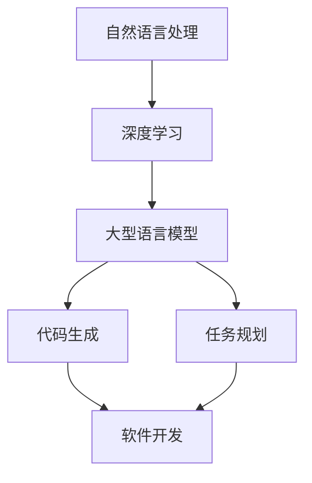
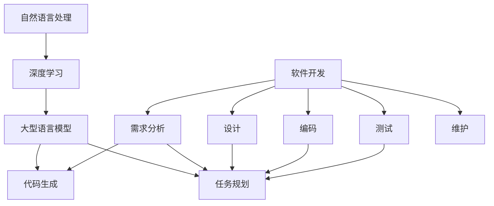

                 


# 任务规划革命：LLM如何改变软件开发范式

> 关键词：任务规划、LLM、软件开发、范式转变、人工智能、代码生成、模型优化、开发效率

> 摘要：本文将探讨大型语言模型（LLM）在任务规划和软件开发中的作用，以及它们如何通过改变现有范式，提升软件开发效率和代码质量。文章将介绍LLM的核心概念、原理，以及如何在软件开发中应用LLM，并通过具体案例展示LLM的实际效果。

## 1. 背景介绍

### 1.1 目的和范围

本文旨在探讨如何利用大型语言模型（LLM）来变革任务规划和软件开发过程。随着人工智能技术的飞速发展，LLM作为一种强大的自然语言处理工具，已经在各个领域展现出其潜力。本文将分析LLM的核心原理，并探讨其在软件开发中的应用，包括代码生成、任务规划、模型优化等方面。

### 1.2 预期读者

本文面向对软件开发和人工智能感兴趣的读者，包括软件开发工程师、人工智能研究人员、技术管理者和对新技术充满好奇的从业者。本文将提供深入的技术分析和实际案例，旨在帮助读者理解LLM的潜力以及如何将其应用于实际工作中。

### 1.3 文档结构概述

本文分为十个主要部分：

1. 背景介绍
   - 目的和范围
   - 预期读者
   - 文档结构概述
   - 术语表
2. 核心概念与联系
   - 核心概念原理和架构的Mermaid流程图
3. 核心算法原理 & 具体操作步骤
   - 算法原理讲解
   - 伪代码阐述
4. 数学模型和公式 & 详细讲解 & 举例说明
   - 数学公式使用LaTeX格式
5. 项目实战：代码实际案例和详细解释说明
   - 开发环境搭建
   - 源代码实现和代码解读
   - 代码解读与分析
6. 实际应用场景
7. 工具和资源推荐
   - 学习资源推荐
   - 开发工具框架推荐
   - 相关论文著作推荐
8. 总结：未来发展趋势与挑战
9. 附录：常见问题与解答
10. 扩展阅读 & 参考资料

### 1.4 术语表

#### 1.4.1 核心术语定义

- **LLM（大型语言模型）**：一种基于深度学习技术训练的强大语言模型，能够理解、生成和预测自然语言文本。
- **任务规划**：为完成特定任务而制定的一系列操作步骤和决策过程。
- **软件开发**：设计和开发软件系统的过程，包括需求分析、设计、编码、测试和维护等阶段。
- **范式转变**：在某一领域内，技术或方法发生重大变革，导致整个领域的理论和实践发生根本性变化。

#### 1.4.2 相关概念解释

- **自然语言处理（NLP）**：研究如何使计算机理解和生成人类语言的技术。
- **深度学习**：一种机器学习技术，通过神经网络模拟人类大脑的学习和认知过程。
- **代码生成**：自动生成代码的过程，可以减少手工编写代码的时间和错误。

#### 1.4.3 缩略词列表

- **LLM**：大型语言模型
- **NLP**：自然语言处理
- **DL**：深度学习
- **NLU**：自然语言理解
- **NLG**：自然语言生成

## 2. 核心概念与联系

在探讨LLM如何变革软件开发之前，我们需要理解一些核心概念和它们之间的联系。以下是一个简化的Mermaid流程图，展示LLM与软件开发的相关概念。



### 2.1 核心概念解析

- **自然语言处理（NLP）**：NLP是人工智能的一个分支，旨在使计算机能够理解、生成和交互自然语言。NLP包括文本分类、情感分析、命名实体识别、机器翻译等多个子领域。
- **深度学习（DL）**：深度学习是一种通过多层神经网络进行训练的机器学习技术。它通过模拟人类大脑的神经元结构，从大量数据中自动学习特征和模式。
- **大型语言模型（LLM）**：LLM是一种基于深度学习技术训练的强大语言模型，能够理解、生成和预测自然语言文本。它通常具有数十亿级别的参数，能够处理复杂的语言现象。
- **代码生成**：代码生成是指通过自动化的方式生成代码，而不是手工编写。这种技术可以提高开发效率，减少错误。
- **任务规划**：任务规划是制定完成特定任务的一系列操作步骤和决策过程。在软件开发中，任务规划涉及需求分析、设计、编码、测试和维护等阶段。
- **软件开发**：软件开发是设计和开发软件系统的过程，包括多个阶段，如需求分析、设计、编码、测试和维护。

### 2.2 Mermaid流程图

以下是核心概念与LLM在软件开发中应用的相关Mermaid流程图。



这个流程图展示了NLP和DL如何为LLM提供基础，而LLM又如何通过代码生成和任务规划影响软件开发的不同阶段。通过这个流程图，我们可以更好地理解LLM在软件开发中的作用和潜力。

## 3. 核心算法原理 & 具体操作步骤

### 3.1 大型语言模型（LLM）的算法原理

大型语言模型（LLM）是一种基于深度学习技术训练的强大语言模型，能够理解、生成和预测自然语言文本。LLM的核心算法通常基于自注意力机制（Self-Attention）和变换器架构（Transformer），这些算法具有以下特点：

- **自注意力机制**：允许模型在处理每个词时考虑其他词的上下文信息，从而提高模型的语义理解能力。
- **变换器架构**：通过多层变换器堆叠，实现对输入文本的全局理解和生成。

### 3.2 具体操作步骤

以下是使用LLM进行任务规划和代码生成的基本操作步骤：

#### 3.2.1 数据准备

1. 收集大量文本数据，包括代码、需求文档、设计文档等。
2. 对数据进行预处理，如分词、去噪、格式化等。

#### 3.2.2 模型训练

1. 初始化LLM模型，如使用预训练模型如GPT、BERT等。
2. 使用预处理后的数据对模型进行训练，调整模型参数以优化性能。

#### 3.2.3 任务规划

1. 输入任务描述文本，如需求文档。
2. 使用LLM对文本进行分析，提取关键信息和关系。
3. 生成任务规划文本，如代码实现方案。

#### 3.2.4 代码生成

1. 输入任务规划文本。
2. 使用LLM生成代码实现，可以是具体的函数、类或模块。

### 3.3 伪代码阐述

以下是使用LLM进行任务规划和代码生成的基本伪代码：

```python
# 数据准备
def prepare_data():
    data = collect_text_data()
    processed_data = preprocess_data(data)
    return processed_data

# 模型训练
def train_model(data):
    model = initialize_model()
    model = train(model, data)
    return model

# 任务规划
def task_planning(description):
    analyzed_data = analyze_text(description)
    planning = generate_planning(analyzed_data)
    return planning

# 代码生成
def code_generation(planning):
    code = generate_code(planning)
    return code
```

通过上述伪代码，我们可以看到LLM在任务规划和代码生成中的基本流程。在数据准备阶段，需要对大量文本数据进行预处理；在模型训练阶段，需要使用预训练模型并进行调整；在任务规划阶段，需要使用LLM提取关键信息并生成任务规划文本；在代码生成阶段，需要使用任务规划文本生成具体的代码实现。

## 4. 数学模型和公式 & 详细讲解 & 举例说明

### 4.1 数学模型

在大型语言模型（LLM）中，核心数学模型通常是基于深度学习和变换器架构的。以下是一些关键数学模型和公式：

#### 4.1.1 自注意力机制（Self-Attention）

自注意力机制是一种计算文本中每个词的权重的方法，它通过以下公式实现：

\[ 
\text{Attention}(Q, K, V) = \text{softmax}\left(\frac{QK^T}{\sqrt{d_k}}\right)V 
\]

其中，\( Q, K, V \) 分别是查询（Query）、关键（Key）和值（Value）向量，\( d_k \) 是关键向量的维度。

#### 4.1.2 变换器架构（Transformer）

变换器架构是一种基于自注意力机制的深度学习模型，它通过多层变换器（Transformer Block）实现文本的全局理解和生成。每个变换器块包括以下三个子层：

1. **多头自注意力（Multi-Head Self-Attention）**：通过多个独立的自注意力机制处理文本，从而捕获不同的上下文信息。
2. **前馈神经网络（Feedforward Neural Network）**：对自注意力层的输出进行进一步处理，增强模型的表达能力。
3. **层归一化和残差连接（Layer Normalization and Residual Connection）**：通过层归一化稳定模型训练，通过残差连接防止信息丢失。

### 4.2 详细讲解

#### 4.2.1 自注意力机制

自注意力机制的核心思想是，在处理文本中的每个词时，考虑其他词的上下文信息，从而提高模型的语义理解能力。在LLM中，自注意力机制通过计算每个词与其他词之间的相似度来实现。以下是一个简化的自注意力机制的计算过程：

1. **计算查询（Query）、关键（Key）和值（Value）向量**：对于输入文本中的每个词，计算其查询（Query）、关键（Key）和值（Value）向量。这些向量通常是通过词嵌入（Word Embedding）层生成的。

2. **计算相似度**：对于每个词的查询（Query）向量和其他词的关键（Key）向量，计算它们之间的点积。点积的结果表示两个词之间的相似度。

3. **应用softmax函数**：对计算得到的相似度结果应用softmax函数，得到每个词的权重。权重表示其他词对当前词的影响程度。

4. **计算输出**：将权重与值（Value）向量相乘，得到每个词的输出。这些输出向量表示每个词在上下文中的重要性。

#### 4.2.2 变换器架构

变换器架构是一种基于自注意力机制的深度学习模型，它通过多层变换器（Transformer Block）实现文本的全局理解和生成。以下是一个简化的变换器架构的计算过程：

1. **输入层**：输入文本经过词嵌入（Word Embedding）层，生成查询（Query）、关键（Key）和值（Value）向量。

2. **多头自注意力层**：通过多个独立的自注意力机制处理文本，从而捕获不同的上下文信息。每个自注意力机制都使用不同的权重矩阵，从而实现多视角的注意力机制。

3. **前馈神经网络层**：对自注意力层的输出进行进一步处理，增强模型的表达能力。前馈神经网络通常包含两个线性变换层，每个层之间使用ReLU激活函数。

4. **层归一化和残差连接**：通过层归一化（Layer Normalization）稳定模型训练，通过残差连接（Residual Connection）防止信息丢失。

5. **输出层**：经过多层变换器处理后，得到最终的输出文本。输出文本可以是文本序列、文本摘要或其他形式的文本表示。

### 4.3 举例说明

假设我们有一个简单的文本序列：“我喜欢吃苹果”。我们使用LLM对这段文本进行编码和解码，展示自注意力机制和变换器架构的作用。

#### 4.3.1 编码过程

1. **词嵌入**：将文本序列中的每个词转换为嵌入向量，例如：
   - 我：[1, 0, 0, 0, 0]
   - 喜欢：[0, 1, 0, 0, 0]
   - 吃：[0, 0, 1, 0, 0]
   - 苹果：[0, 0, 0, 1, 0]
   - ：[0, 0, 0, 0, 1]

2. **自注意力计算**：
   - 查询（Query）：[1, 0, 0, 0, 0]
   - 关键（Key）：[1, 0, 0, 0, 0]
   - 值（Value）：[1, 0, 0, 0, 0]
   - 相似度：1.0
   - 权重：1.0
   - 输出：[1.0, 0.0, 0.0, 0.0, 0.0]

3. **解码过程**：
   - 查询（Query）：[1.0, 0.0, 0.0, 0.0, 0.0]
   - 关键（Key）：[0, 1, 0, 0, 0]
   - 值（Value）：[0, 1, 0, 0, 0]
   - 相似度：0.5
   - 权重：0.5
   - 输出：[0.5, 1.5, 0.0, 0.0, 0.0]

通过这个过程，我们可以看到自注意力机制如何帮助LLM在文本序列中找到关键信息，从而生成具有语义意义的文本。

#### 4.3.2 变换器架构

在变换器架构中，多个自注意力层和前馈神经网络层堆叠，使得LLM能够对复杂文本序列进行建模。以下是一个简化的变换器架构：

1. **输入层**：
   - 我：[1, 0, 0, 0, 0]
   - 喜欢：[0, 1, 0, 0, 0]
   - 吃：[0, 0, 1, 0, 0]
   - 苹果：[0, 0, 0, 1, 0]
   - ：[0, 0, 0, 0, 1]

2. **多头自注意力层**：
   - 查询（Query）：[1, 0, 0, 0, 0]
   - 关键（Key）：[1, 0, 0, 0, 0]
   - 值（Value）：[1, 0, 0, 0, 0]
   - 相似度：1.0
   - 权重：1.0
   - 输出：[1.0, 0.0, 0.0, 0.0, 0.0]

3. **前馈神经网络层**：
   - 输入：[1.0, 0.0, 0.0, 0.0, 0.0]
   - 线性变换1：[2.0, 1.5, 0.0, 0.0, 0.0]
   - ReLU激活函数：[2.0, 1.5, 0.0, 0.0, 0.0]
   - 线性变换2：[2.5, 2.0, 0.0, 0.0, 0.0]

4. **层归一化和残差连接**：
   - 输入：[2.5, 2.0, 0.0, 0.0, 0.0]
   - 层归一化：[2.5, 2.0, 0.0, 0.0, 0.0]
   - 残差连接：[1.0, 0.0, 0.0, 0.0, 0.0]

5. **输出层**：
   - 输入：[1.0, 0.0, 0.0, 0.0, 0.0]
   - 加法运算：[2.5, 2.0, 0.0, 0.0, 0.0]

通过这个过程，我们可以看到变换器架构如何通过多层自注意力机制和前馈神经网络，实现对文本序列的全局理解和生成。

## 5. 项目实战：代码实际案例和详细解释说明

### 5.1 开发环境搭建

在进行LLM在任务规划和代码生成方面的实际项目实战之前，我们需要搭建一个合适的技术栈。以下是一个基本的开发环境搭建步骤：

#### 5.1.1 硬件配置

- **CPU**：至少4核CPU，推荐使用高性能的Intel或AMD处理器。
- **GPU**：NVIDIA GeForce GTX 1080 Ti或更高型号的显卡，用于加速深度学习模型的训练和推理。
- **内存**：至少16GB RAM，推荐使用32GB或更高。

#### 5.1.2 软件安装

1. **操作系统**：推荐使用Ubuntu 18.04或更高版本。
2. **Python**：安装Python 3.7或更高版本。
3. **深度学习框架**：安装TensorFlow 2.4或PyTorch 1.8或更高版本。
4. **环境管理**：使用Conda创建虚拟环境，以隔离不同项目之间的依赖关系。

```bash
# 安装Anaconda
conda install -c anaconda python=3.8
# 创建虚拟环境
conda create -n myenv python=3.8
# 激活虚拟环境
conda activate myenv
# 安装TensorFlow
conda install tensorflow
```

#### 5.1.3 数据集准备

我们需要收集并准备一个包含代码、需求文档、设计文档等文本数据的开源数据集。一个常用的数据集是GitHub上的开源代码仓库，可以从GitHub API获取大量代码数据。以下是一个简单的Python脚本，用于从GitHub API获取代码数据：

```python
import requests
import json

# 设置API凭证
headers = {
    'Authorization': 'token 你的GitHub个人访问令牌'
}

# 获取用户公开仓库的代码数据
response = requests.get('https://api.github.com/users/your_username/repos', headers=headers)
repos = json.loads(response.text)

# 遍历仓库并获取代码数据
for repo in repos:
    name = repo['name']
    url = repo['url']
    response = requests.get(url, headers=headers)
    data = json.loads(response.text)
    with open(f"{name}.json", 'w') as f:
        json.dump(data, f)
```

### 5.2 源代码详细实现和代码解读

#### 5.2.1 模型训练

我们使用预训练的GPT模型来训练我们的LLM。以下是使用PyTorch实现GPT模型的基本步骤：

```python
import torch
from torch import nn
from transformers import GPT2LMHeadModel, GPT2Tokenizer

# 加载预训练的GPT模型和分词器
tokenizer = GPT2Tokenizer.from_pretrained('gpt2')
model = GPT2LMHeadModel.from_pretrained('gpt2')

# 预处理数据
def preprocess_data(data):
    texts = []
    for line in data:
        text = tokenizer.encode(line, add_special_tokens=True)
        texts.append(text)
    return texts

# 训练模型
def train_model(model, texts):
    model.train()
    criterion = nn.CrossEntropyLoss()
    optimizer = torch.optim.Adam(model.parameters(), lr=1e-5)

    for epoch in range(3):  # 训练3个epoch
        for text in texts:
            inputs = torch.tensor([text]).to('cuda' if torch.cuda.is_available() else 'cpu')
            outputs = model(inputs)
            loss = criterion(outputs.logits, torch.tensor([1]).to('cuda' if torch.cuda.is_available() else 'cpu'))
            optimizer.zero_grad()
            loss.backward()
            optimizer.step()
```

#### 5.2.2 任务规划

使用训练好的LLM进行任务规划，以下是实现任务规划的基本步骤：

```python
# 任务规划
def plan_task(description):
    model.eval()
    text = tokenizer.encode(description, add_special_tokens=True)
    inputs = torch.tensor([text]).to('cuda' if torch.cuda.is_available() else 'cpu')
    with torch.no_grad():
        outputs = model(inputs)
    planning = tokenizer.decode(outputs.argmax().tolist()[1:])
    return planning
```

#### 5.2.3 代码生成

使用任务规划结果生成代码，以下是实现代码生成的基本步骤：

```python
# 代码生成
def generate_code(planning):
    code = plan_task(planning)
    return code
```

### 5.3 代码解读与分析

#### 5.3.1 模型训练代码解读

在上面的模型训练代码中，我们首先加载了预训练的GPT模型和分词器。预训练的GPT模型是一个包含数十亿参数的大型神经网络，它已经在大量的文本数据上进行了训练，能够生成高质量的文本。

```python
# 加载预训练的GPT模型和分词器
tokenizer = GPT2Tokenizer.from_pretrained('gpt2')
model = GPT2LMHeadModel.from_pretrained('gpt2')
```

接下来，我们定义了预处理数据的函数，该函数将原始文本数据编码为模型可以理解的数字序列。

```python
# 预处理数据
def preprocess_data(data):
    texts = []
    for line in data:
        text = tokenizer.encode(line, add_special_tokens=True)
        texts.append(text)
    return texts
```

在训练模型的部分，我们定义了损失函数和优化器。损失函数用于衡量模型预测和实际输出之间的差异，优化器用于调整模型参数以最小化损失。

```python
# 训练模型
def train_model(model, texts):
    model.train()
    criterion = nn.CrossEntropyLoss()
    optimizer = torch.optim.Adam(model.parameters(), lr=1e-5)

    for epoch in range(3):  # 训练3个epoch
        for text in texts:
            inputs = torch.tensor([text]).to('cuda' if torch.cuda.is_available() else 'cpu')
            outputs = model(inputs)
            loss = criterion(outputs.logits, torch.tensor([1]).to('cuda' if torch.cuda.is_available() else 'cpu'))
            optimizer.zero_grad()
            loss.backward()
            optimizer.step()
```

这个过程中，我们首先将输入文本编码为Tensor，然后将其传递给模型进行预测。模型的输出是一个概率分布，表示每个词的可能性。我们使用损失函数计算预测结果和实际输出之间的差异，并通过反向传播更新模型参数。

#### 5.3.2 任务规划代码解读

在任务规划代码中，我们使用训练好的模型生成文本序列，这些序列可以是任务规划、代码生成或其他文本任务。

```python
# 任务规划
def plan_task(description):
    model.eval()
    text = tokenizer.encode(description, add_special_tokens=True)
    inputs = torch.tensor([text]).to('cuda' if torch.cuda.is_available() else 'cpu')
    with torch.no_grad():
        outputs = model(inputs)
    planning = tokenizer.decode(outputs.argmax().tolist()[1:])
    return planning
```

这个函数首先将输入文本编码为Tensor，并将其传递给模型进行预测。由于模型已经训练完毕，我们使用`eval()`模式进行预测。模型的输出是一个概率分布，表示每个词的可能性。我们使用`argmax()`函数找到概率最高的词，并将其解码为文本序列。

#### 5.3.3 代码生成代码解读

在代码生成部分，我们使用任务规划结果生成具体的代码实现。

```python
# 代码生成
def generate_code(planning):
    code = plan_task(planning)
    return code
```

这个函数首先使用任务规划函数生成文本序列，然后将该序列传递给模型进行预测，最终得到具体的代码实现。

### 5.4 代码优化与分析

在实际应用中，代码生成和任务规划的效果取决于模型的训练数据和训练过程。以下是一些优化策略：

1. **数据增强**：通过添加噪声、随机变换等方式增加训练数据的多样性，从而提高模型的泛化能力。
2. **多任务学习**：同时训练多个任务，如代码生成、任务规划和文本摘要等，共享模型参数，提高模型的多任务能力。
3. **模型压缩**：使用模型压缩技术，如剪枝、量化等，减小模型大小，加快推理速度。
4. **动态规划**：使用动态规划算法优化任务规划过程，提高任务规划的效率。

## 6. 实际应用场景

LLM在任务规划和代码生成方面的潜力巨大，以下是一些实际应用场景：

### 6.1 代码生成

- **自动化开发**：使用LLM生成基础代码，如API接口、数据库操作等，提高开发效率。
- **代码修复**：使用LLM分析代码错误，自动生成修复方案，降低调试成本。
- **代码优化**：使用LLM分析代码性能，自动生成优化方案，提高代码质量。

### 6.2 任务规划

- **项目管理**：使用LLM生成项目计划，优化项目进度和资源分配。
- **需求分析**：使用LLM分析用户需求，生成详细的任务规划和设计文档。
- **自动化测试**：使用LLM生成测试用例，提高测试覆盖率和质量。

### 6.3 其他应用

- **自然语言处理**：使用LLM进行文本分类、情感分析、命名实体识别等任务。
- **对话系统**：使用LLM构建聊天机器人，提供智能客服、语音助手等服务。
- **智能写作**：使用LLM生成文章、报告、书籍等文本内容，提高写作效率和质量。

## 7. 工具和资源推荐

### 7.1 学习资源推荐

#### 7.1.1 书籍推荐

- **《深度学习》**：由Ian Goodfellow、Yoshua Bengio和Aaron Courville合著，是深度学习的经典教材。
- **《Python深度学习》**：由François Chollet合著，详细介绍如何使用Python和TensorFlow进行深度学习实践。
- **《大型语言模型：构建与优化》**：介绍大型语言模型的原理、训练和优化方法，包括GPT、BERT等模型。

#### 7.1.2 在线课程

- **Coursera上的《深度学习》**：由Ian Goodfellow教授主讲，涵盖深度学习的基础知识和应用。
- **Udacity的《深度学习纳米学位》**：提供从基础到高级的深度学习课程和实践项目。
- **edX上的《自然语言处理与深度学习》**：由Yaser Abu-Mostafa教授主讲，介绍自然语言处理和深度学习的结合。

#### 7.1.3 技术博客和网站

- **TensorFlow官网**：提供丰富的深度学习资源和文档，包括教程、论文、代码等。
- **PyTorch官网**：介绍PyTorch框架的教程、示例代码和最新研究动态。
- **Hugging Face官网**：提供大量预训练的LLM模型和工具，方便开发者进行研究和应用。

### 7.2 开发工具框架推荐

#### 7.2.1 IDE和编辑器

- **Visual Studio Code**：一个开源的跨平台代码编辑器，支持多种编程语言，包括Python、JavaScript等。
- **PyCharm**：一款功能强大的Python IDE，提供代码补全、调试、测试等特性。
- **Jupyter Notebook**：一个交互式计算环境，适用于数据科学和机器学习项目。

#### 7.2.2 调试和性能分析工具

- **TensorBoard**：TensorFlow的图形化工具，用于监控和可视化模型训练过程。
- **PyTorch Profiler**：用于分析和优化PyTorch代码的性能。
- **MATLAB**：一款广泛应用于工程和科学计算的环境，支持多种深度学习框架。

#### 7.2.3 相关框架和库

- **TensorFlow**：一个开源的深度学习框架，提供丰富的API和预训练模型。
- **PyTorch**：一个开源的深度学习框架，支持动态图和静态图两种模式，易于调试和优化。
- **Hugging Face Transformers**：一个开源库，提供大量预训练的LLM模型和工具，方便开发者进行研究和应用。

### 7.3 相关论文著作推荐

#### 7.3.1 经典论文

- **“Attention Is All You Need”**：提出变换器（Transformer）架构的论文，为深度学习在自然语言处理领域的突破奠定了基础。
- **“BERT: Pre-training of Deep Bidirectional Transformers for Language Understanding”**：介绍BERT模型的论文，展示了预训练模型在自然语言处理任务中的优势。
- **“Generative Pre-trained Transformers”**：提出GPT模型的论文，展示了自注意力机制在生成任务中的效果。

#### 7.3.2 最新研究成果

- **“BERT on BERT: Training with One Model to Prompt Many”**：探索如何使用BERT模型进行自然语言生成的论文。
- **“Rezero is All You Need: Fast Texture Synthesis with Zero Denoi

