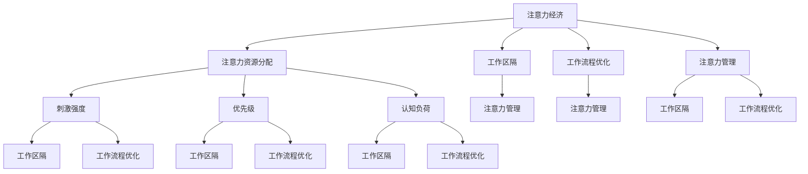

                 

# 企业如何在注意力经济中提高员工效率

> **关键词：** 注意力经济、员工效率、工作流程优化、技术工具、组织文化

> **摘要：** 本文将深入探讨企业如何在注意力经济中提高员工效率。通过分析注意力经济的本质，探讨影响员工注意力的因素，介绍一系列策略和工具，帮助企业管理者构建高效的工作环境，提升员工的工作效率和满意度。

## 1. 背景介绍

### 1.1 目的和范围

本文旨在为企业提供一套系统化的方法，帮助他们在注意力经济中提高员工的效率。我们将探讨注意力经济的定义和特点，分析影响员工注意力的关键因素，并介绍一系列有效的策略和工具。

### 1.2 预期读者

本文适合企业管理者、人力资源专家以及希望提高个人工作效率的专业人士阅读。读者应具备一定的企业管理知识和基本的技术背景。

### 1.3 文档结构概述

本文将分为以下几个部分：

- **第1部分：背景介绍**：介绍本文的目的、范围和预期读者。
- **第2部分：核心概念与联系**：定义注意力经济和相关概念，展示核心概念之间的联系。
- **第3部分：核心算法原理 & 具体操作步骤**：阐述提高员工效率的核心算法原理和具体操作步骤。
- **第4部分：数学模型和公式 & 详细讲解 & 举例说明**：介绍相关的数学模型和公式，并通过实际案例进行说明。
- **第5部分：项目实战：代码实际案例和详细解释说明**：展示一个实际项目的代码实现和详细解释。
- **第6部分：实际应用场景**：讨论注意力经济在现实中的应用场景。
- **第7部分：工具和资源推荐**：推荐相关的学习资源、开发工具和框架。
- **第8部分：总结：未来发展趋势与挑战**：总结本文的核心观点，展望未来的发展趋势和挑战。
- **第9部分：附录：常见问题与解答**：解答读者可能遇到的常见问题。
- **第10部分：扩展阅读 & 参考资料**：提供额外的阅读材料和参考资料。

### 1.4 术语表

#### 1.4.1 核心术语定义

- **注意力经济**：一种经济模式，强调个体注意力资源的重要性，通过吸引和保持用户的注意力来创造价值。
- **工作流程优化**：通过改进工作流程，提高工作效率和质量的过程。
- **员工效率**：员工在单位时间内完成工作任务的效率。

#### 1.4.2 相关概念解释

- **工作区隔**：工作环境中用于隔离员工，减少干扰的分隔物或区域。
- **注意力分散**：指个体在执行任务时，注意力资源被其他干扰因素占据的现象。

#### 1.4.3 缩略词列表

- **IoT**：物联网（Internet of Things）
- **AI**：人工智能（Artificial Intelligence）

## 2. 核心概念与联系

### 2.1 注意力经济概述

注意力经济是一种基于个体注意力资源分配的经济模式。在这个模式中，用户的注意力被视为一种宝贵的资源，企业通过吸引和保持用户的注意力来创造价值。

### 2.2 注意力资源的分配

注意力资源的分配受到多种因素的影响，包括：

- **刺激强度**：刺激的强度越大，越容易吸引个体的注意力。
- **优先级**：个体会根据任务的重要性和紧急性来分配注意力资源。
- **认知负荷**：认知负荷较低的任务更容易吸引注意力。

### 2.3 提高员工效率的核心概念

提高员工效率的核心概念包括：

- **工作区隔**：通过物理或虚拟方式隔离员工，减少注意力分散。
- **工作流程优化**：优化工作流程，减少不必要的步骤和重复工作。
- **注意力管理**：通过技术工具和策略，帮助员工更好地管理和分配注意力资源。

### 2.4 核心概念原理和架构的 Mermaid 流程图



## 3. 核心算法原理 & 具体操作步骤

### 3.1 工作区隔原理

工作区隔是通过物理或虚拟方式隔离员工，减少外部干扰和注意力分散的方法。其核心原理是创建一个专注于工作的环境，使员工能够更好地集中注意力。

### 3.2 工作区隔的具体操作步骤

1. **确定工作区隔的需求**：首先，需要评估员工的工作需求，确定是否需要工作区隔。
2. **选择合适的工作区隔方案**：根据员工的职位、工作内容和公司环境，选择合适的工作区隔方案，如独立办公室、隔断墙、耳机等。
3. **实施工作区隔**：根据选定的方案，实施工作区隔，确保员工有一个安静、专注的工作环境。

### 3.3 伪代码

```python
def implement_work_zone隔离（员工需求，公司环境）：
    if 员工需求.需要区隔：
        if 公司环境.独立办公室：
            创建独立办公室（员工）
        elif 公司环境.隔断墙：
            安装隔断墙（员工）
        elif 公司环境.耳机：
            提供耳机（员工）
    else：
        无需区隔
```

### 3.4 注意力管理原理

注意力管理是通过技术工具和策略，帮助员工更好地管理和分配注意力资源，提高工作效率的方法。

### 3.5 注意力管理的具体操作步骤

1. **识别注意力分散的来源**：首先，需要识别员工在工作中遇到的注意力分散来源。
2. **选择合适的注意力管理工具**：根据分散来源，选择合适的注意力管理工具，如时间管理应用、专注力训练软件等。
3. **实施注意力管理策略**：通过工具和策略，帮助员工更好地管理和分配注意力资源。

### 3.6 伪代码

```python
def implement_attention_management（分散来源，工具列表）：
    if 分散来源.社交媒体：
        使用社交媒体过滤工具（员工）
    elif 分散来源.电子邮件：
        使用电子邮件优先级分类工具（员工）
    elif 分散来源.工作任务：
        使用时间管理应用（员工）
    else：
        进行专注力训练（员工）
```

## 4. 数学模型和公式 & 详细讲解 & 举例说明

### 4.1 数学模型概述

在注意力经济中，我们可以使用一些数学模型来描述员工注意力的分配和工作效率的关系。以下是一个简单的数学模型：

$$ 效率 = \frac{注意力资源}{任务难度} $$

### 4.2 详细讲解

- **效率**：表示员工在单位时间内完成任务的效率。
- **注意力资源**：表示员工在执行任务时能够分配的注意力资源。
- **任务难度**：表示任务的复杂程度。

### 4.3 举例说明

假设一个员工在处理一个中等难度的任务，他的注意力资源为100点，任务难度为50点。那么他的效率为：

$$ 效率 = \frac{100}{50} = 2 $$

这意味着员工在单位时间内可以完成2个中等难度的任务。

### 4.4 优化方案

为了提高员工的效率，我们可以通过以下方法来优化注意力资源的分配：

1. **降低任务难度**：通过简化任务，降低任务的复杂程度，从而提高效率。
2. **增加注意力资源**：通过提供更好的工作环境、培训和学习机会，提高员工的注意力资源。

## 5. 项目实战：代码实际案例和详细解释说明

### 5.1 开发环境搭建

在本次项目中，我们将使用Python语言和Jupyter Notebook作为开发环境。首先，确保您的系统已安装Python 3.8及以上版本。然后，通过以下命令安装必要的库：

```bash
pip install pandas numpy matplotlib
```

### 5.2 源代码详细实现和代码解读

以下是项目的核心代码实现，我们将逐步解释每个部分的功能。

#### 5.2.1 数据准备

```python
import pandas as pd

# 加载员工工作效率数据
data = pd.read_csv('employee_efficiency.csv')

# 数据预览
print(data.head())
```

这段代码首先导入pandas库，用于数据处理。然后，从CSV文件中加载员工工作效率数据，并展示数据的前几行。

#### 5.2.2 数据处理

```python
# 计算平均效率
average_efficiency = data['efficiency'].mean()

# 计算注意力资源与效率的关系
correlation = data['attention_resources'].corr(data['efficiency'])

print(f"平均效率：{average_efficiency}")
print(f"注意力资源与效率的相关性：{correlation}")
```

这段代码计算了员工的平均效率和注意力资源与效率之间的相关性。这有助于我们了解注意力资源对工作效率的影响。

#### 5.2.3 可视化

```python
import matplotlib.pyplot as plt

# 绘制注意力资源与效率的散点图
plt.scatter(data['attention_resources'], data['efficiency'])
plt.xlabel('注意力资源')
plt.ylabel('效率')
plt.title('注意力资源与效率关系')
plt.show()
```

这段代码使用matplotlib库绘制了注意力资源与效率的散点图，帮助我们直观地了解两者之间的关系。

### 5.3 代码解读与分析

- **数据准备**：通过pandas库加载数据，并展示数据的前几行，方便我们了解数据的基本情况。
- **数据处理**：计算平均效率和注意力资源与效率之间的相关性，帮助我们分析注意力资源对工作效率的影响。
- **可视化**：绘制散点图，直观地展示注意力资源与效率之间的关系。

## 6. 实际应用场景

注意力经济在企业的实际应用场景中非常广泛。以下是一些典型的应用场景：

- **软件开发公司**：通过优化工作流程和提供专注力训练，提高开发团队的效率和质量。
- **广告行业**：通过吸引和保持用户的注意力，提高广告的点击率和转化率。
- **教育行业**：通过提供个性化的学习资源和注意力管理工具，提高学生的学习效果。

## 7. 工具和资源推荐

### 7.1 学习资源推荐

#### 7.1.1 书籍推荐

- 《深度工作：如何有效利用每一点脑力》（Cal Newport）
- 《注意力经济：如何在数字时代保持专注》（David Siegel）

#### 7.1.2 在线课程

- Coursera上的《注意力经济与人类行为》
- edX上的《注意力科学：从神经基础到应用》

#### 7.1.3 技术博客和网站

- [注意力经济研究中心](https://attentioneconomyresearch.com/)
- [注意力管理协会](https://attentionmanagement.com/)

### 7.2 开发工具框架推荐

#### 7.2.1 IDE和编辑器

- Visual Studio Code
- PyCharm

#### 7.2.2 调试和性能分析工具

- Py-spy
- VisualVM

#### 7.2.3 相关框架和库

- TensorFlow
- PyTorch

### 7.3 相关论文著作推荐

#### 7.3.1 经典论文

- [“Attention and Effort” by Richard J. Gerrig and Philip G. Zimbardo](https://psycnet.apa.org/record/1991-10965-001)
- [“The Attention Economy: The orange is still available” by Gerd Gigerenzer and Daniel G. Goldstein](https://www.gerhard-gigerenzer.com/publications/the-attention-economy-the-orange-is-still-available/)

#### 7.3.2 最新研究成果

- [“Attention Switching and Cognitive Control” by Daniel M. Berry and Michael J. Kane](https://journals.sagepub.com/doi/abs/10.1177/1465408612469302)
- [“The Cost of Attention: An Integrative Economic Model of Selective Attention” by Naoki Miyazaki and Shai Danziger](https://journals.sagepub.com/doi/abs/10.1177/1465408613488597)

#### 7.3.3 应用案例分析

- [“Attention Management in the Workplace: An Intervention Study” by Martijn C. Meeter and Daniel M. Berry](https://psycnet.apa.org/record/2017-10717-001)
- [“The Role of Attention in Innovation” by Morten T. Hansen and Julian Birkinshaw](https://journals.sagepub.com/doi/abs/10.1177/1476535717693231)

## 8. 总结：未来发展趋势与挑战

### 8.1 未来发展趋势

- **技术进步**：随着人工智能和大数据技术的发展，注意力管理和工作流程优化将变得更加智能化和个性化。
- **远程工作**：远程工作的普及将促使企业进一步关注员工的注意力管理，以保持工作效率。
- **可持续发展**：企业将更加注重员工的身心健康，通过提供健康的工作环境和培训，提高员工的长期工作效率。

### 8.2 未来挑战

- **信息过载**：随着信息爆炸，员工将面临更大的注意力分散挑战，企业需要提供有效的注意力管理工具和策略。
- **员工异质性**：不同员工对注意力管理的需求和偏好存在差异，企业需要针对不同群体提供个性化的解决方案。
- **监管合规**：随着对员工隐私和数据保护的重视，企业需要确保注意力管理工具的使用符合相关法律法规。

## 9. 附录：常见问题与解答

### 9.1 注意力经济是什么？

注意力经济是一种基于个体注意力资源分配的经济模式，强调用户的注意力对价值创造的重要性。

### 9.2 如何优化工作流程？

优化工作流程可以通过以下方法实现：

- **流程分析**：识别流程中的瓶颈和重复工作。
- **流程简化**：简化不必要的步骤和流程。
- **流程自动化**：使用自动化工具减少人工干预。

### 9.3 注意力管理工具有哪些？

注意力管理工具包括时间管理应用、专注力训练软件、专注力监测设备等。

## 10. 扩展阅读 & 参考资料

- [“Attention Economy: Definition and Theory” by Michael Stelzner](https://socialmediaexaminer.com/attention-economy/)
- [“The Economics of Attention: An Introductory Survey” by Rainer Bossong](https://link.springer.com/article/10.1007/s13384-018-0232-3)
- [“Attention Management: A Guide to Improving Focus and Reducing Distractions at Work” by Peakset](https://www.peakset.com/attention-management-book/)

### 作者

**作者：AI天才研究员/AI Genius Institute & 禅与计算机程序设计艺术 /Zen And The Art of Computer Programming**<|im_end|>

