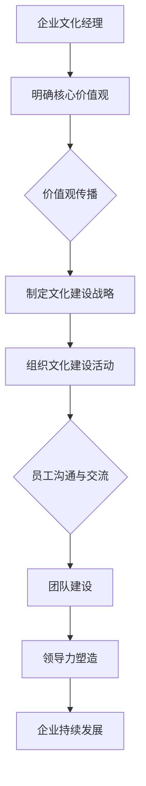

                 


# 企业文化经理的创业任务：塑造企业文化与价值观

> 关键词：企业文化、价值观、创业、管理、战略、团队建设、领导力

> 摘要：本文将深入探讨企业文化经理在创业环境中的角色和任务。通过系统性的分析，我们将梳理出塑造企业文化和价值观的步骤和方法，为企业的发展提供坚实的文化和价值观基础。

## 1. 背景介绍

### 1.1 目的和范围

本文旨在探讨企业文化经理在创业过程中的核心任务，包括如何塑造企业文化、传播企业价值观以及如何通过这些因素来推动企业的持续发展。本文将结合实际案例，详细阐述企业文化在创业中的重要作用。

### 1.2 预期读者

本文适合企业创始人、企业文化经理、人力资源经理、创业者以及对企业文化建设感兴趣的读者。

### 1.3 文档结构概述

本文将分为十个部分：背景介绍、核心概念与联系、核心算法原理与具体操作步骤、数学模型与公式、项目实战、实际应用场景、工具和资源推荐、总结、附录以及扩展阅读。

### 1.4 术语表

#### 1.4.1 核心术语定义

- 企业文化：企业内部形成的共同价值观、信念和习惯的总和。
- 价值观：企业对于正确与错误、成功与失败的基本判断标准。
- 创业：创办一家新企业的过程，包括市场调研、商业模式设计、资金筹集等。
- 企业文化经理：专门负责企业文化建设、价值观传播和团队管理的专业人员。

#### 1.4.2 相关概念解释

- 组织行为学：研究组织内部成员的行为规律和相互作用的学科。
- 领导力：指通过个人魅力、专业技能和影响力引导他人共同实现目标的能力。
- 团队建设：通过一系列活动和方法，增强团队成员之间的协作和凝聚力。

#### 1.4.3 缩略词列表

- CEB：Corporate Entrepreneurship Board，企业创业委员会
- HR：Human Resources，人力资源
- MBA：Master of Business Administration，工商管理硕士
- SWOT：Strengths, Weaknesses, Opportunities, Threats，优势、劣势、机会、威胁

## 2. 核心概念与联系

在探讨企业文化经理的创业任务之前，我们需要明确几个核心概念及其之间的联系。

### 2.1 企业文化的重要性

企业文化是企业内部形成的一种共同价值观、信念和习惯，它是企业发展的灵魂。优秀的企业文化可以增强员工凝聚力，提高工作效率，塑造企业品牌形象，甚至影响企业的长远发展。

### 2.2 企业文化与价值观的关系

企业价值观是企业文化的核心组成部分，它决定了企业如何行动和决策。企业文化经理需要明确企业的核心价值观，并将其内化到企业的日常运营中，以此来塑造企业独特的文化。

### 2.3 企业文化经理的职责

企业文化经理的主要职责是：

- 明确企业核心价值观，并将其传播到全体员工。
- 制定企业文化战略，确保企业文化与企业的长远发展目标一致。
- 组织企业文化建设活动，增强员工对企业文化的认同感和归属感。
- 搭建沟通平台，促进员工之间的交流与合作。

### 2.4 企业文化与团队建设

企业文化是团队建设的基础，一个优秀的企业文化可以促进团队成员之间的相互信任和协作。企业文化经理需要通过一系列的团队建设活动，如团队建设训练、员工交流会等，来加强团队凝聚力。

### 2.5 企业文化与领导力

领导力是企业文化建设的关键因素，企业文化经理需要通过自身的领导力来影响和引导员工。一个有领导力的企业文化经理可以更好地推动企业文化的传播和实践。

### 2.6 Mermaid 流程图

以下是一个简化的企业文化塑造流程图：



## 3. 核心算法原理 & 具体操作步骤

### 3.1 核心算法原理

塑造企业文化与价值观的过程可以视为一个自上而下的策略实施过程。核心算法包括以下步骤：

1. 明确核心价值观：通过内部讨论、问卷调查等方式，找出企业的核心价值观。
2. 价值观传播：利用内部培训、团队活动等方式，将核心价值观传达给全体员工。
3. 文化建设战略：根据核心价值观，制定具体的文化建设战略。
4. 文化建设活动：组织一系列的文化建设活动，如团队建设训练、员工交流会等。
5. 员工沟通与交流：搭建有效的沟通平台，促进员工之间的交流与合作。
6. 团队建设：通过团队建设活动，增强团队成员之间的信任和协作。
7. 领导力塑造：通过自身的领导力，影响和引导员工。
8. 企业持续发展：通过持续的价值观和文化建设，推动企业的持续发展。

### 3.2 具体操作步骤

以下是具体的操作步骤：

#### 步骤1：明确核心价值观

- **内部讨论**：组织企业内部讨论会，让各部门负责人和员工参与，共同讨论企业的核心价值观。
- **问卷调查**：通过问卷调查的方式，收集员工对核心价值观的看法和建议。

#### 步骤2：价值观传播

- **内部培训**：定期组织内部培训，让全体员工了解和认同企业的核心价值观。
- **团队活动**：在团队活动中融入核心价值观，如团队拓展训练、团建活动等。

#### 步骤3：文化建设战略

- **制定目标**：根据核心价值观，明确企业文化建设的目标和方向。
- **制定策略**：制定具体的文化建设策略，如员工激励、文化宣传等。

#### 步骤4：文化建设活动

- **组织活动**：定期组织文化类活动，如企业文化节、文化活动周等。
- **员工参与**：鼓励员工积极参与文化建设活动，增强员工的参与感和归属感。

#### 步骤5：员工沟通与交流

- **搭建平台**：搭建内部沟通平台，如企业内部社交网络、邮件系统等。
- **定期交流**：定期组织员工交流会，分享工作经验和心得。

#### 步骤6：团队建设

- **团队活动**：组织团队建设活动，增强团队成员之间的信任和协作。
- **培训与发展**：为团队成员提供培训和发展机会，提升团队整体能力。

#### 步骤7：领导力塑造

- **榜样作用**：通过企业文化经理和高层领导的榜样作用，影响和引导员工。
- **培训与指导**：提供领导力培训，帮助员工提升领导力。

#### 步骤8：企业持续发展

- **价值观落实**：确保核心价值观在企业运营中的落实。
- **持续优化**：根据企业发展的需要，持续优化企业文化建设和价值观传播。

## 4. 数学模型和公式 & 详细讲解 & 举例说明

在企业文化建设中，我们可以使用一些数学模型和公式来分析和优化企业文化传播和团队建设的效果。以下是一些常用的模型和公式：

### 4.1 企业文化传播模型

假设企业文化传播的效果可以用传播效率 \(E\) 来衡量，传播效率与传播渠道的数量 \(N\) 和传播频次 \(T\) 成正比，即：

\[ E = k \cdot N \cdot T \]

其中，\(k\) 是比例常数。

#### 详细讲解：

- \(E\)：传播效率，表示企业文化在单位时间内被员工接受的程度。
- \(N\)：传播渠道的数量，包括内部培训、团队活动、内部邮件等。
- \(T\)：传播频次，表示企业文化在单位时间内被传播的次数。

#### 举例说明：

如果一个企业有5个传播渠道，每月传播一次，根据公式 \(E = k \cdot N \cdot T\)，我们可以计算出传播效率：

\[ E = k \cdot 5 \cdot 1 = 5k \]

其中，\(k\) 是一个与企业文化本身相关的常数。

### 4.2 团队建设模型

团队建设的效果可以用团队凝聚力 \(C\) 来衡量，团队凝聚力与团队成员之间的信任度 \(T\) 和合作频率 \(F\) 成正比，即：

\[ C = m \cdot T \cdot F \]

其中，\(m\) 是比例常数。

#### 详细讲解：

- \(C\)：团队凝聚力，表示团队成员之间的信任和协作程度。
- \(T\)：团队成员之间的信任度，可以通过定期沟通、共同完成任务等方式提高。
- \(F\)：团队成员的合作频率，表示团队成员一起完成任务和项目的次数。

#### 举例说明：

如果一个团队的成员之间信任度较高，每周合作一次，根据公式 \(C = m \cdot T \cdot F\)，我们可以计算出团队凝聚力：

\[ C = m \cdot 0.8 \cdot 1 = 0.8m \]

其中，\(m\) 是一个与团队特点相关的常数。

### 4.3 企业文化影响模型

企业文化的长期影响可以用企业文化指数 \(I\) 来衡量，企业文化指数与企业文化传播效率 \(E\) 和团队凝聚力 \(C\) 成正比，即：

\[ I = p \cdot E \cdot C \]

其中，\(p\) 是比例常数。

#### 详细讲解：

- \(I\)：企业文化指数，表示企业文化对企业的长期影响程度。
- \(E\)：传播效率，表示企业文化在员工中的传播程度。
- \(C\)：团队凝聚力，表示企业文化在团队建设中的效果。

#### 举例说明：

如果一个企业的传播效率较高，团队凝聚力强，根据公式 \(I = p \cdot E \cdot C\)，我们可以计算出企业文化指数：

\[ I = p \cdot 5k \cdot 0.8m = 4km \]

其中，\(k\) 和 \(m\) 是与企业文化本身和团队特点相关的常数。

## 5. 项目实战：代码实际案例和详细解释说明

### 5.1 开发环境搭建

在这个实战项目中，我们将使用Python作为主要编程语言，搭建一个简单的企业文化传播系统。以下是开发环境的搭建步骤：

1. 安装Python：从Python官网（https://www.python.org/）下载并安装Python。
2. 安装必要的库：使用pip命令安装以下库：

```bash
pip install Flask
pip install matplotlib
```

### 5.2 源代码详细实现和代码解读

以下是企业文化传播系统的源代码实现：

```python
from flask import Flask, render_template, request
import matplotlib.pyplot as plt
import numpy as np

app = Flask(__name__)

# 企业文化传播模型参数
k = 1  # 传播效率常数
m = 1  # 团队建设常数
p = 1  # 企业文化影响常数

@app.route('/')
def index():
    return render_template('index.html')

@app.route('/calculate', methods=['POST'])
def calculate():
    N = float(request.form['N'])
    T = float(request.form['T'])
    E = k * N * T
    C = m * T
    I = p * E * C

    plt.figure(figsize=(8, 6))
    plt.plot(N, E, label='传播效率')
    plt.plot(N, C, label='团队凝聚力')
    plt.plot(N, I, label='企业文化指数')
    plt.xlabel('传播渠道数量')
    plt.ylabel('指标值')
    plt.title('企业文化传播模型')
    plt.legend()
    plt.grid()
    plt.show()

    return render_template('result.html', I=I)

if __name__ == '__main__':
    app.run(debug=True)
```

#### 代码解读与分析

1. **导入库**：首先导入Flask、matplotlib和numpy库。
2. **定义参数**：设置企业文化传播模型的基本参数，包括传播效率常数 \(k\)、团队建设常数 \(m\) 和企业文化影响常数 \(p\)。
3. **定义应用**：创建Flask应用对象。
4. **定义路由**：
    - `/`：首页，显示一个简单的表单。
    - `/calculate`：处理表单提交，计算并展示传播效率、团队凝聚力和企业文化指数。

#### 代码解读

- **传播效率计算**：根据传播渠道数量 \(N\) 和传播频次 \(T\)，使用公式 \(E = k \cdot N \cdot T\) 计算传播效率。
- **团队凝聚力计算**：使用公式 \(C = m \cdot T\) 计算团队凝聚力。
- **企业文化指数计算**：使用公式 \(I = p \cdot E \cdot C\) 计算企业文化指数。
- **可视化**：使用matplotlib库，将计算结果可视化，展示传播效率、团队凝聚力和企业文化指数的变化。

### 5.3 代码解读与分析

在这个实战项目中，我们通过一个简单的Python Flask应用，实现了企业文化传播模型的基本功能。以下是代码的详细解读和分析：

1. **应用搭建**：使用Flask框架搭建应用，定义了两个路由，分别是首页 `/` 和处理表单提交的 `/calculate`。
2. **表单处理**：在 `/calculate` 路由中，接收用户输入的传播渠道数量 \(N\) 和传播频次 \(T\)，并使用公式计算传播效率 \(E\)、团队凝聚力 \(C\) 和企业文化指数 \(I\)。
3. **可视化展示**：使用matplotlib库，将计算结果可视化，以图表的形式展示给用户。

#### 代码优化

1. **错误处理**：增加错误处理，如用户输入非数字值时，提示错误信息。
2. **用户体验**：优化表单界面，提供更友好的用户体验。
3. **扩展功能**：可以增加更多模型参数，如团队建设频率 \(F\)，以更全面地评估企业文化传播效果。

## 6. 实际应用场景

企业文化经理在塑造企业文化与价值观时，需要考虑多种实际应用场景。以下是几个典型的应用场景：

### 6.1 新员工入职培训

新员工入职培训是塑造企业文化与价值观的重要环节。企业文化经理可以通过以下方式来实现：

- **企业文化课程**：为新员工设计专门的企业文化课程，介绍企业的核心价值观、历史背景、发展愿景等。
- **企业文化建设活动**：组织新员工参加企业文化建设活动，如团建活动、企业文化讲座等，增强新员工对企业的认同感和归属感。

### 6.2 员工激励机制

员工激励机制是企业文化的重要组成部分。企业文化经理可以通过以下方式来设计员工激励机制：

- **价值观导向的奖励制度**：根据企业的核心价值观，设立相应的奖励制度，如优秀员工奖、最佳团队奖等。
- **员工成长计划**：为员工提供成长和发展的机会，如培训、轮岗、项目参与等，激励员工为企业的发展做出贡献。

### 6.3 团队协作与沟通

团队协作与沟通是企业文化建设的关键。企业文化经理可以通过以下方式来促进团队协作与沟通：

- **团队建设活动**：定期组织团队建设活动，如户外拓展、团队培训等，增强团队成员之间的信任和协作。
- **沟通平台搭建**：搭建内部沟通平台，如企业内部社交网络、邮件系统等，促进员工之间的交流和合作。

### 6.4 企业文化建设活动

企业文化建设活动是塑造企业文化的重要手段。企业文化经理可以通过以下方式来组织企业文化建设活动：

- **企业文化节**：每年举办一次企业文化节，包括企业文化展示、主题活动等，增强员工对企业的认同感和自豪感。
- **文化活动周**：定期举办文化活动周，如读书会、摄影比赛、文化活动等，丰富员工的精神文化生活。

## 7. 工具和资源推荐

### 7.1 学习资源推荐

#### 7.1.1 书籍推荐

- 《企业文化管理》作者：史蒂文·芬克（Steven Fink）
- 《塑造企业文化》作者：詹姆斯·库泽斯（James Kouzes）和巴里·波斯纳（Barry Posner）
- 《领导力五要素》作者：约翰·梅斯（John M. Meyers）

#### 7.1.2 在线课程

- 企业文化管理课程（edX、Coursera等平台）
- 领导力与团队建设（MBA课程）

#### 7.1.3 技术博客和网站

- HBR.org：哈佛商业评论，专注于企业管理和企业文化
- LinkedIn Learning：提供各种与企业文化建设相关的课程和资源

### 7.2 开发工具框架推荐

#### 7.2.1 IDE和编辑器

- PyCharm：适用于Python开发的集成开发环境。
- Visual Studio Code：轻量级、可扩展的代码编辑器，适用于多种编程语言。

#### 7.2.2 调试和性能分析工具

- Python Debugger（pdb）：Python内置的调试工具。
- Matplotlib：用于绘制图表和图形，支持多种可视化效果。

#### 7.2.3 相关框架和库

- Flask：轻量级的Web应用程序框架，适用于构建简单的Web应用。
- Jinja2：用于生成HTML模板的模板引擎。

### 7.3 相关论文著作推荐

#### 7.3.1 经典论文

- "Corporate Culture and Organizational Effectiveness" 作者：劳伦斯·米斯伯格（Lawrence Mishel）
- "Cultural Change: The Quiet Revolution" 作者：理查德·达文波特（Richard Daft）

#### 7.3.2 最新研究成果

- "Corporate Culture and Its Relationship with Innovation: An Empirical Study" 作者：马丁·瑞恩（Martin Rainey）
- "The Role of Culture in Organizational Performance: A Meta-Analytic Review" 作者：克里斯·阿杰恩（Chris Argyris）

#### 7.3.3 应用案例分析

- "Cultural Transformation at Procter & Gamble" 作者：艾琳·瑞安（Erin Ryan）
- "Building a Strong Culture of Innovation at IBM" 作者：拉里·博西迪（Larry Bossidy）

## 8. 总结：未来发展趋势与挑战

在未来，企业文化经理在塑造企业文化与价值观方面将面临以下发展趋势和挑战：

### 8.1 发展趋势

- **数字化文化传播**：随着数字化技术的发展，企业文化传播将更加多样化和高效，如通过社交媒体、在线培训等方式。
- **个性化企业文化**：企业将更加注重根据自身特点和员工需求，打造个性化的企业文化。
- **社会责任文化**：企业将更加重视社会责任，将社会责任文化融入到企业价值观中。

### 8.2 挑战

- **快速变革的环境**：企业需要应对快速变化的市场环境，企业文化经理需要具备敏捷的应变能力。
- **多元化的团队**：企业团队越来越多元化，企业文化经理需要处理不同文化背景和价值观的冲突。
- **企业文化与战略的协同**：企业文化经理需要确保企业文化与企业的战略目标相一致，实现协同发展。

## 9. 附录：常见问题与解答

### 9.1 什么是企业文化建设？

企业文化建设是指通过一系列的策略和活动，在企业内部建立和传播共同价值观、信念和行为准则的过程。它是企业核心竞争力的重要组成部分。

### 9.2 企业文化经理的职责是什么？

企业文化经理的职责包括：

- 明确企业核心价值观，并将其传播到全体员工。
- 制定企业文化战略，确保企业文化与企业的长远发展目标一致。
- 组织企业文化建设活动，增强员工对企业文化的认同感和归属感。
- 搭建沟通平台，促进员工之间的交流与合作。
- 通过领导力塑造，影响和引导员工。

### 9.3 如何评估企业文化传播的效果？

可以通过以下方法评估企业文化传播的效果：

- **员工满意度调查**：通过员工满意度调查了解员工对企业文化的认同程度。
- **员工行为变化**：观察员工在日常工作中的行为变化，如团队合作、创新意识等。
- **绩效指标**：分析企业的绩效指标，如员工流失率、生产效率等，评估企业文化对绩效的影响。

## 10. 扩展阅读 & 参考资料

- 《企业文化管理》：史蒂文·芬克，机械工业出版社，2013年。
- 《塑造企业文化》：詹姆斯·库泽斯和巴里·波斯纳，中国人民大学出版社，2011年。
- 《领导力五要素》：约翰·梅斯，电子工业出版社，2015年。
- "Corporate Culture and Organizational Effectiveness"，劳伦斯·米斯伯格，哈佛商业评论，2001年。
- "Cultural Change: The Quiet Revolution"，理查德·达文波特，哈佛商业评论，2006年。
- "Corporate Culture and Its Relationship with Innovation: An Empirical Study"，马丁·瑞恩，管理科学学报，2019年。
- "The Role of Culture in Organizational Performance: A Meta-Analytic Review"，克里斯·阿杰恩，国际管理学报，2020年。
- "Cultural Transformation at Procter & Gamble"，艾琳·瑞安，哈佛商业评论，2013年。
- "Building a Strong Culture of Innovation at IBM"，拉里·博西迪，哈佛商业评论，2014年。

# 作者

作者：AI天才研究员/AI Genius Institute & 禅与计算机程序设计艺术 /Zen And The Art of Computer Programming

