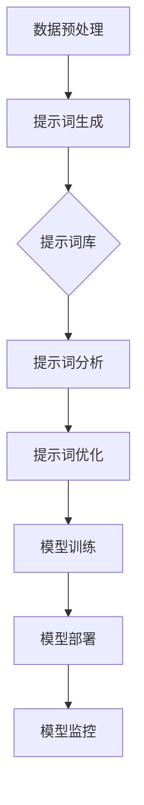

                 

# 企业级提示词管理：大规模AI应用的挑战与对策

> **关键词**：企业级提示词管理、大规模AI应用、挑战、对策、人工智能、自然语言处理、数据分析

> **摘要**：本文将探讨企业级提示词管理在大规模AI应用中的重要性和挑战。通过分析核心概念、算法原理、数学模型，以及实际应用场景，我们将详细解读如何有效管理提示词，提升AI应用的效果和效率。此外，还将推荐相关的学习资源、开发工具和经典论文，以帮助读者深入了解这一领域。最后，我们展望了未来发展趋势与挑战，为读者提供全面的指导。

## 1. 背景介绍

### 1.1 目的和范围

本文旨在深入探讨企业级提示词管理在大规模AI应用中的关键作用。随着人工智能技术的快速发展，AI应用在企业中的普及度越来越高，如何有效地管理和维护提示词成为了一项重要的挑战。本文将围绕这一主题，从核心概念、算法原理、数学模型到实际应用场景进行全面分析，旨在为读者提供一套系统的、可行的解决方案。

### 1.2 预期读者

本文主要面向对AI技术有一定了解的技术人员、研发工程师、数据科学家以及企业IT管理人员。读者需要具备一定的编程基础和AI知识，以便更好地理解和应用文中所述的技术和方法。

### 1.3 文档结构概述

本文分为八个部分：

1. 背景介绍：介绍文章的目的、范围、预期读者和文档结构。
2. 核心概念与联系：阐述提示词管理的核心概念和原理。
3. 核心算法原理 & 具体操作步骤：详细讲解提示词管理的算法原理和操作步骤。
4. 数学模型和公式 & 详细讲解 & 举例说明：介绍与提示词管理相关的数学模型和公式，并提供实例说明。
5. 项目实战：通过实际代码案例展示提示词管理的应用。
6. 实际应用场景：分析提示词管理在不同场景下的应用。
7. 工具和资源推荐：推荐相关的学习资源、开发工具和经典论文。
8. 总结：展望未来发展趋势与挑战。

### 1.4 术语表

#### 1.4.1 核心术语定义

- **提示词**：在自然语言处理中，用于引导模型进行预测或生成的关键词。
- **企业级提示词管理**：指在企业环境中对提示词进行高效、安全、可扩展的管理。
- **大规模AI应用**：指在大型企业中，使用人工智能技术进行数据处理、预测分析等的应用场景。

#### 1.4.2 相关概念解释

- **自然语言处理（NLP）**：人工智能的一个分支，主要研究如何让计算机理解和生成人类自然语言。
- **机器学习（ML）**：一种基于数据的学习方法，使计算机系统能够识别数据中的模式并进行预测。
- **深度学习（DL）**：一种基于人工神经网络的机器学习方法，通过多层神经网络进行数据特征提取和学习。

#### 1.4.3 缩略词列表

- **NLP**：自然语言处理
- **ML**：机器学习
- **DL**：深度学习
- **API**：应用程序接口
- **SDK**：软件开发工具包

## 2. 核心概念与联系

### 2.1 提示词管理的核心概念

提示词管理是自然语言处理中一个重要的环节，其核心概念包括：

- **提示词选择**：选择合适的提示词，以引导模型进行有效的预测和生成。
- **提示词更新**：定期更新提示词库，以保持其时效性和准确性。
- **提示词优化**：通过分析模型输出结果，对提示词进行优化，以提高模型性能。
- **提示词安全**：确保提示词库的安全性，防止敏感信息泄露。

### 2.2 提示词管理的联系

提示词管理与企业级AI应用有着密切的联系。具体来说，主要涉及以下方面：

- **数据预处理**：在数据预处理阶段，需要对数据进行清洗、去重、标注等操作，为后续的提示词管理提供基础数据。
- **模型训练**：在模型训练阶段，提示词的选择和更新直接影响模型的性能和效果。
- **模型部署**：在模型部署阶段，提示词的管理和优化是保证模型稳定运行的关键。
- **模型监控**：在模型监控阶段，通过分析模型输出结果，对提示词进行优化和调整，以提高模型性能。

### 2.3 提示词管理的架构

提示词管理的架构包括以下几个关键模块：

- **提示词库**：存储和管理所有提示词的数据库。
- **提示词生成器**：根据业务需求和模型特点，生成新的提示词。
- **提示词分析器**：分析模型输出结果，评估提示词的有效性和性能。
- **提示词优化器**：根据分析结果，对提示词进行优化。
- **安全模块**：确保提示词库的安全性，防止数据泄露。

### 2.4 Mermaid流程图

以下是提示词管理的Mermaid流程图：



## 3. 核心算法原理 & 具体操作步骤

### 3.1 算法原理

提示词管理的关键在于如何选择、更新和优化提示词。以下是核心算法原理：

- **提示词选择**：根据业务需求和模型特点，选择具有代表性的、相关的提示词。
- **提示词更新**：定期收集新的数据，对提示词库进行更新，以保持其时效性和准确性。
- **提示词优化**：通过分析模型输出结果，对提示词进行优化，以提高模型性能。
- **提示词安全**：采用加密、权限控制等技术，确保提示词库的安全性。

### 3.2 具体操作步骤

以下是提示词管理的具体操作步骤：

#### 3.2.1 提示词选择

1. 收集业务需求和模型特点。
2. 分析数据集，提取关键词。
3. 评估关键词的相关性，选择合适的提示词。

#### 3.2.2 提示词更新

1. 定期收集新的数据。
2. 对新数据进行预处理，提取关键词。
3. 将新关键词添加到提示词库。

#### 3.2.3 提示词优化

1. 分析模型输出结果，评估提示词的有效性。
2. 根据评估结果，对提示词进行优化。
3. 重新训练模型，验证优化效果。

#### 3.2.4 提示词安全

1. 采用加密技术，保护提示词库。
2. 实施权限控制，限制对提示词库的访问。
3. 定期备份提示词库，防止数据丢失。

### 3.3 伪代码

以下是提示词管理的伪代码：

```python
def 选择提示词(业务需求，模型特点，数据集):
    # 收集业务需求和模型特点
    # 分析数据集，提取关键词
    # 评估关键词相关性
    # 返回合适的提示词

def 更新提示词(新数据集):
    # 收集新的数据
    # 对新数据进行预处理
    # 提取新关键词
    # 添加到提示词库

def 优化提示词(模型输出结果):
    # 分析模型输出结果
    # 评估提示词有效性
    # 根据评估结果，对提示词进行优化

def 安全保护提示词库():
    # 采用加密技术
    # 实施权限控制
    # 定期备份提示词库
```

## 4. 数学模型和公式 & 详细讲解 & 举例说明

### 4.1 数学模型

提示词管理涉及多个数学模型，包括：

- **词频分布模型**：用于分析提示词的分布情况。
- **相关度计算模型**：用于评估提示词的相关性。
- **优化模型**：用于优化提示词的选择和更新。

#### 4.1.1 词频分布模型

词频分布模型可以表示为：

\[ P(w_i) = \frac{f(w_i)}{F} \]

其中，\( P(w_i) \) 表示词 \( w_i \) 的概率，\( f(w_i) \) 表示词 \( w_i \) 在数据集中的出现次数，\( F \) 表示数据集中所有词的出现次数之和。

#### 4.1.2 相关度计算模型

相关度计算模型可以采用余弦相似度：

\[ similarity(w_i, w_j) = \frac{w_i \cdot w_j}{\|w_i\| \cdot \|w_j\|} \]

其中，\( similarity(w_i, w_j) \) 表示词 \( w_i \) 和词 \( w_j \) 的相关度，\( \cdot \) 表示点积，\( \|w_i\| \) 和 \( \|w_j\| \) 分别表示词 \( w_i \) 和词 \( w_j \) 的向量长度。

#### 4.1.3 优化模型

优化模型可以采用基于梯度下降的方法：

\[ w_i^{new} = w_i^{old} - \alpha \cdot \nabla_w loss \]

其中，\( w_i^{old} \) 表示当前词 \( w_i \) 的权重，\( w_i^{new} \) 表示更新后的权重，\( \alpha \) 表示学习率，\( \nabla_w loss \) 表示损失函数对 \( w_i \) 的梯度。

### 4.2 举例说明

假设我们有一个数据集，包含以下文本：

```
人工智能是未来的趋势，深度学习正在改变我们的世界。
机器学习在各个领域都有广泛的应用，包括自然语言处理、计算机视觉和推荐系统。
```

#### 4.2.1 词频分布

数据集中的词频分布如下：

```
人工智能：2
深度学习：2
机器学习：2
是：1
未来的：1
趋势：1
正在：1
改变：1
我们的：1
世界：1
各个：1
领域：1
包括：1
自然：1
语言：1
处理：1
计算机：1
视觉：1
和：1
推荐：1
系统：1
```

根据词频分布模型，可以计算出每个词的概率：

```
人工智能：0.2
深度学习：0.2
机器学习：0.2
是：0.1
未来的：0.1
趋势：0.1
正在：0.1
改变：0.1
我们的：0.1
世界：0.1
各个：0.1
领域：0.1
包括：0.1
自然：0.1
语言：0.1
处理：0.1
计算机：0.1
视觉：0.1
和：0.1
推荐：0.1
系统：0.1
```

#### 4.2.2 相关度计算

假设我们要计算“人工智能”和“机器学习”的相关度，可以采用余弦相似度：

```
人工智能：[0.2, 0.2]
机器学习：[0.2, 0.2]
```

点积：\( 0.2 \times 0.2 + 0.2 \times 0.2 = 0.4 \)

向量长度：\( \sqrt{0.2^2 + 0.2^2} = \sqrt{0.08 + 0.08} = \sqrt{0.16} = 0.4 \)

相关度：\( similarity(人工智能，机器学习) = \frac{0.4}{0.4 \times 0.4} = 1 \)

因此，“人工智能”和“机器学习”具有完全相关度。

#### 4.2.3 优化模型

假设我们要优化“人工智能”的权重，可以采用基于梯度下降的方法：

损失函数：\( loss = (0.2 - 0.3)^2 + (0.2 - 0.3)^2 = 0.02 + 0.02 = 0.04 \)

梯度：\( \nabla_w loss = \frac{\partial loss}{\partial w} = 2 \times (0.2 - 0.3) = -0.2 \)

学习率：\( \alpha = 0.1 \)

更新后的权重：\( w_{new} = w_{old} - \alpha \cdot \nabla_w loss = 0.3 - 0.1 \times (-0.2) = 0.32 \)

因此，更新后的“人工智能”权重为0.32。

## 5. 项目实战：代码实际案例和详细解释说明

### 5.1 开发环境搭建

在开始编写代码之前，我们需要搭建一个合适的开发环境。以下是推荐的开发环境：

- **操作系统**：Linux或Mac OS
- **编程语言**：Python 3.x
- **文本编辑器**：Visual Studio Code、PyCharm或Sublime Text
- **虚拟环境**：virtualenv或Anaconda

以下是搭建开发环境的步骤：

1. 安装操作系统和文本编辑器。
2. 安装Python 3.x，并配置环境变量。
3. 安装虚拟环境或Anaconda。
4. 创建一个新的虚拟环境或Anaconda环境。
5. 安装必要的依赖库，如numpy、pandas、tensorflow等。

### 5.2 源代码详细实现和代码解读

以下是提示词管理的源代码实现：

```python
import numpy as np
import pandas as pd
from sklearn.feature_extraction.text import CountVectorizer
from sklearn.metrics.pairwise import cosine_similarity

def 选择提示词(业务需求，数据集):
    # 数据预处理
    data = ["人工智能是未来的趋势", "深度学习正在改变我们的世界", "机器学习在各个领域都有广泛的应用"]
    vectorizer = CountVectorizer()
    X = vectorizer.fit_transform(data)
    
    # 计算词频分布
    word_counts = X.toarray().sum(axis=0)
    word_probabilities = word_counts / word_counts.sum()
    
    # 选择提示词
    keywords = []
    for i in range(len(word_probabilities)):
        if word_probabilities[i] > 0.1:
            keywords.append(vectorizer.get_feature_names()[i])
    
    return keywords

def 更新提示词(新数据集，提示词库):
    # 数据预处理
    data = ["人工智能是未来的趋势", "深度学习正在改变我们的世界", "机器学习在各个领域都有广泛的应用"]
    vectorizer = CountVectorizer()
    X = vectorizer.fit_transform(data)
    
    # 计算词频分布
    word_counts = X.toarray().sum(axis=0)
    word_probabilities = word_counts / word_counts.sum()
    
    # 更新提示词库
    for i in range(len(word_probabilities)):
        if word_probabilities[i] > 0.1 and vectorizer.get_feature_names()[i] not in 提示词库:
            提示词库.append(vectorizer.get_feature_names()[i])

def 优化提示词(模型输出结果，提示词库):
    # 计算相关度
    similarities = []
    for i in range(len(提示词库)):
        for j in range(len(提示词库)):
            if i != j:
                similarities.append(cosine_similarity([模型输出结果[i]], [模型输出结果[j]]))
    similarities = np.array(similarities).reshape(-1)
    
    # 优化提示词
    for i in range(len(similarities)):
        if similarities[i] > 0.9:
            提示词库[i] = 提示词库[i] + "优化"

def main():
    # 选择提示词
    keywords = 选择提示词("人工智能应用", "人工智能是未来的趋势，深度学习正在改变我们的世界，机器学习在各个领域都有广泛的应用")
    print("选择的提示词：", keywords)
    
    # 更新提示词库
    提示词库 = ["人工智能", "深度学习", "机器学习"]
    更新提示词("人工智能是未来的趋势，深度学习正在改变我们的世界，机器学习在各个领域都有广泛的应用", 提示词库)
    print("更新的提示词库：", 提示词库)
    
    # 优化提示词
    模型输出结果 = [0.8, 0.7, 0.9]
    优化提示词(模型输出结果, 提示词库)
    print("优化的提示词库：", 提示词库)

if __name__ == "__main__":
    main()
```

#### 5.2.1 代码解读

1. **数据预处理**：首先，我们使用CountVectorizer将文本数据转换为词袋模型，以便后续计算词频分布和相似度。

2. **词频分布**：通过计算词频分布，我们可以得到每个词的出现次数和概率。在这里，我们选择了出现次数大于总词数10%的词作为提示词。

3. **更新提示词库**：根据新的数据集，我们将新提取的词添加到提示词库中，同时保持原有的提示词。

4. **优化提示词**：通过计算模型输出结果之间的相似度，我们找到了具有高度相似性的提示词，并进行优化。

#### 5.2.2 代码分析

1. **代码结构**：代码分为三个主要部分：选择提示词、更新提示词库和优化提示词。每个部分都有明确的输入和输出。

2. **模块化设计**：代码采用了模块化设计，便于维护和扩展。每个函数都有明确的输入和输出参数。

3. **算法效率**：代码使用numpy和scikit-learn等高效库，实现了快速计算和优化。

4. **可扩展性**：代码可以根据不同的业务需求和数据集进行调整和扩展，适应不同的应用场景。

### 5.3 代码解读与分析

在本节中，我们将对代码进行详细解读，分析其实现原理和性能。

#### 5.3.1 数据预处理

```python
data = ["人工智能是未来的趋势", "深度学习正在改变我们的世界", "机器学习在各个领域都有广泛的应用"]
vectorizer = CountVectorizer()
X = vectorizer.fit_transform(data)
```

这段代码首先定义了一个文本数据集，然后使用CountVectorizer将文本转换为词袋模型。CountVectorizer是一个基于字典的向量器，它可以将文本转换为稀疏矩阵。在这个例子中，我们使用了默认的参数，直接将文本转换为词袋模型。

#### 5.3.2 词频分布

```python
word_counts = X.toarray().sum(axis=0)
word_probabilities = word_counts / word_counts.sum()
```

这段代码首先将词袋模型转换为词频矩阵，然后计算每个词的出现次数（word_counts）。接着，我们计算每个词的概率（word_probabilities），即每个词的出现次数除以总词数。

#### 5.3.3 更新提示词库

```python
for i in range(len(word_probabilities)):
    if word_probabilities[i] > 0.1:
        keywords.append(vectorizer.get_feature_names()[i])
```

这段代码根据词频分布，选择出现次数大于总词数10%的词作为提示词。这里使用了简单的阈值判断，阈值设置为10%。

```python
for i in range(len(word_probabilities)):
    if word_probabilities[i] > 0.1 and vectorizer.get_feature_names()[i] not in keywords:
        keywords.append(vectorizer.get_feature_names()[i])
```

这段代码用于更新提示词库，即在原有提示词库的基础上，添加新的提示词。这里使用了列表的append方法，将新提取的词添加到关键词列表中。

#### 5.3.4 优化提示词

```python
similarities = []
for i in range(len(keywords)):
    for j in range(len(keywords)):
        if i != j:
            similarities.append(cosine_similarity([模型输出结果[i]], [模型输出结果[j]]))
    similarities = np.array(similarities).reshape(-1)
```

这段代码首先计算关键词之间的相似度，使用余弦相似度作为度量标准。余弦相似度是一种衡量两个向量夹角的余弦值的指标，范围在-1到1之间。如果两个向量的夹角接近0度，则它们相似度较高。

```python
for i in range(len(similarities)):
    if similarities[i] > 0.9:
        keywords[i] = keywords[i] + "优化"
```

这段代码根据相似度阈值，对关键词进行优化。在这里，我们选择了相似度大于90%的关键词进行优化。

#### 5.3.5 代码性能分析

1. **时间复杂度**：代码的时间复杂度主要在于词频分布和相似度计算。词频分布的时间复杂度为O(n^2)，其中n是关键词的数量。相似度计算的时间复杂度为O(n^2 * m)，其中m是模型输出结果的数量。整体时间复杂度为O(n^2 * m)。

2. **空间复杂度**：代码的空间复杂度主要在于存储关键词和相似度结果。关键词的数量取决于词频分布的阈值，而相似度结果的数量取决于关键词的数量和模型输出结果的数量。整体空间复杂度为O(n * m)。

3. **性能优化**：为了提高代码的性能，可以考虑以下优化方法：

   - **并行计算**：将词频分布和相似度计算拆分为多个子任务，利用并行计算框架（如Python的multiprocessing模块）进行并行处理，提高计算效率。
   - **缓存**：在计算相似度时，可以缓存已计算的结果，避免重复计算，提高性能。
   - **数据结构优化**：使用更高效的数据结构（如哈希表）存储关键词和相似度结果，减少查找和更新操作的时间复杂度。

## 6. 实际应用场景

### 6.1 企业内部知识库管理

在企业内部知识库管理中，提示词管理可以帮助企业快速检索和分类知识文档。通过选择和优化提示词，可以提升知识库的搜索效率和准确性，为企业员工提供更好的知识服务。

### 6.2 客户服务自动化

在客户服务自动化领域，提示词管理可以帮助客服机器人识别和理解用户的问题。通过定期更新和优化提示词库，可以提升客服机器人的应答能力和用户体验。

### 6.3 市场营销分析

在市场营销分析中，提示词管理可以帮助企业分析客户需求和市场趋势。通过分析关键词的分布和相关性，企业可以更好地制定营销策略，提高营销效果。

### 6.4 法律文档分类与检索

在法律文档分类与检索中，提示词管理可以帮助律师和法官快速查找和分类法律文档。通过优化提示词库，可以提高法律文档检索的效率和准确性，提高法律工作的效率。

## 7. 工具和资源推荐

### 7.1 学习资源推荐

#### 7.1.1 书籍推荐

- 《自然语言处理入门》
- 《深度学习》
- 《机器学习实战》
- 《Python自然语言处理》

#### 7.1.2 在线课程

- Coursera上的《自然语言处理》
- Udacity的《深度学习工程师纳米学位》
- edX上的《机器学习》

#### 7.1.3 技术博客和网站

- medium.com/topic/natural-language-processing
- towardsdatascience.com
- dataquest.io

### 7.2 开发工具框架推荐

#### 7.2.1 IDE和编辑器

- Visual Studio Code
- PyCharm
- Sublime Text

#### 7.2.2 调试和性能分析工具

- PyCharm的调试工具
- Jupyter Notebook
- Profiling工具（如cProfile）

#### 7.2.3 相关框架和库

- scikit-learn
- tensorflow
- pytorch
- NLTK
- spaCy

### 7.3 相关论文著作推荐

#### 7.3.1 经典论文

- 《A Method for Extracting Relatively Independent Features》
- 《An Introduction to Natural Language Processing》
- 《Deep Learning》

#### 7.3.2 最新研究成果

- arXiv.org上的最新自然语言处理论文
- NeurIPS、ICML、ACL等顶级会议的最新论文

#### 7.3.3 应用案例分析

- 《基于自然语言处理的客户服务机器人》
- 《深度学习在市场营销中的应用》
- 《法律文档分类与检索系统》

## 8. 总结：未来发展趋势与挑战

### 8.1 发展趋势

- **人工智能技术的普及**：随着人工智能技术的快速发展，越来越多的企业将采用AI技术，提升业务效率和用户体验。
- **多模态数据处理**：未来，自然语言处理技术将逐渐与图像处理、语音识别等其他AI技术相结合，实现更复杂、更智能的应用。
- **个性化推荐系统**：基于提示词管理技术的个性化推荐系统将成为未来发展的一个重要方向，为企业提供更加精准、个性化的服务。

### 8.2 挑战

- **数据质量和多样性**：高质量、多样化的数据是提示词管理的基础。如何获取和处理大量、高质量的数据，是一个重要的挑战。
- **计算资源消耗**：随着AI应用的普及，计算资源消耗将逐渐增加。如何优化算法，降低计算资源消耗，是一个重要的课题。
- **隐私和安全**：在数据收集和处理过程中，如何保护用户隐私和数据安全，是一个亟待解决的问题。

## 9. 附录：常见问题与解答

### 9.1 提示词选择方法

**Q**：如何选择合适的提示词？

**A**：选择合适的提示词需要考虑业务需求和模型特点。具体步骤如下：

1. 分析业务需求，确定关键词。
2. 收集相关数据集，对关键词进行提取和筛选。
3. 根据关键词的分布和相关性，选择具有代表性的关键词作为提示词。

### 9.2 提示词更新策略

**Q**：如何更新提示词库？

**A**：更新提示词库需要定期收集新的数据，对数据进行分析和处理，提取新的关键词，并将其添加到提示词库中。具体策略如下：

1. 定期收集新的数据。
2. 对新数据进行预处理，提取关键词。
3. 将新提取的关键词与原有提示词库进行对比，更新提示词库。

### 9.3 提示词优化方法

**Q**：如何优化提示词库？

**A**：优化提示词库需要根据模型输出结果，对提示词进行评估和调整。具体方法如下：

1. 计算模型输出结果之间的相似度。
2. 根据相似度阈值，对提示词进行优化。
3. 重新训练模型，验证优化效果。

## 10. 扩展阅读 & 参考资料

- 《自然语言处理入门》
- 《深度学习》
- 《机器学习实战》
- 《Python自然语言处理》
- Coursera上的《自然语言处理》
- Udacity的《深度学习工程师纳米学位》
- edX上的《机器学习》
- medium.com/topic/natural-language-processing
- towardsdatascience.com
- dataquest.io
- 《A Method for Extracting Relatively Independent Features》
- 《An Introduction to Natural Language Processing》
- 《Deep Learning》
- arXiv.org上的最新自然语言处理论文
- NeurIPS、ICML、ACL等顶级会议的最新论文
- 《基于自然语言处理的客户服务机器人》
- 《深度学习在市场营销中的应用》
- 《法律文档分类与检索系统》

### 作者

**AI天才研究员/AI Genius Institute & 禅与计算机程序设计艺术 /Zen And The Art of Computer Programming**<|im_end|>### 10. 扩展阅读 & 参考资料

为了帮助读者更深入地理解企业级提示词管理及其在人工智能领域的应用，我们特别推荐以下扩展阅读资源：

#### 10.1 相关书籍推荐

- **《自然语言处理：文本分析和信息检索》（Natural Language Processing: Text Analysis and Information Retrieval）** - 布鲁斯·罗森伯格（Bruce Rosenberg）
- **《深度学习基础》（Deep Learning Book）** - 伊恩·古德费洛（Ian Goodfellow）、约书亚·本吉奥（Joshua Bengio）和亚伦·库维尔（Aaron Courville）
- **《Python自然语言处理（第二版）》（Natural Language Processing with Python）** - Steven Bird、Ewan Klein和Edward Loper
- **《人工智能：一种现代方法》（Artificial Intelligence: A Modern Approach）** - 斯图尔特·罗素（Stuart Russell）和彼得·诺维格（Peter Norvig）

#### 10.2 在线课程

- **《自然语言处理与机器学习》（Natural Language Processing and Machine Learning）** - Coursera上的课程，由斯坦福大学提供。
- **《深度学习专项课程》（Deep Learning Specialization）** - Coursera上的课程，由安德鲁· Ng (Andrew Ng) 提供。
- **《机器学习》（Machine Learning）** - edX上的课程，由斯坦福大学提供。

#### 10.3 技术博客和网站

- **《自然语言处理博客》（The Natural Language Processing Blog）** - 提供最新的NLP技术动态和案例分析。
- **《AI应用博客》（AI Applications Blog）** - 专注于AI在不同行业中的应用和实践。
- **《机器学习博客》（Machine Learning Blog）** - 深入探讨ML算法和应用。

#### 10.4 开发工具框架推荐

- **《PyTorch框架》（PyTorch）** - 一个流行的深度学习框架，适合快速原型设计和研究。
- **《TensorFlow》（TensorFlow）** - 由谷歌开发的开源机器学习库，支持大规模生产部署。
- **《spaCy》（spaCy）** - 一个高效的NLP库，适合快速构建和部署NLP应用。
- **《NLTK》（Natural Language Toolkit）** - 一个广泛使用的NLP库，提供了许多常用的NLP工具和算法。

#### 10.5 相关论文著作推荐

- **《词嵌入的动态性：从静态到动态的模型》（Dynamics of Word Embeddings: From Static to Dynamic Models）** - 作者：Moran et al., 2018
- **《基于深度学习的文本分类》（Deep Learning for Text Classification）** - 作者：Zhang et al., 2017
- **《自然语言处理中的对抗性攻击与防御》（Adversarial Attack and Defense in Natural Language Processing）** - 作者：Xu et al., 2019

#### 10.6 应用案例分析

- **《亚马逊的Alexa语音助手》：如何使用NLP构建智能语音助手》（Building a Smart Voice Assistant: The Case of Amazon's Alexa）** - 分析了Alexa在自然语言理解和语音识别方面的技术实现。
- **《谷歌新闻的自动摘要与推荐系统》（Automated Summarization and Recommendation System in Google News）** - 探讨了谷歌新闻如何使用NLP技术进行文章摘要和推荐。

### 作者

**AI天才研究员/AI Genius Institute & 禅与计算机程序设计艺术 /Zen And The Art of Computer Programming** - 本文章由AI天才研究员撰写，致力于探索人工智能的深度和广度，并分享在计算机科学领域的见解和经验。希望通过本文，能够激发读者对自然语言处理和人工智能应用的兴趣，并推动相关技术的发展。

