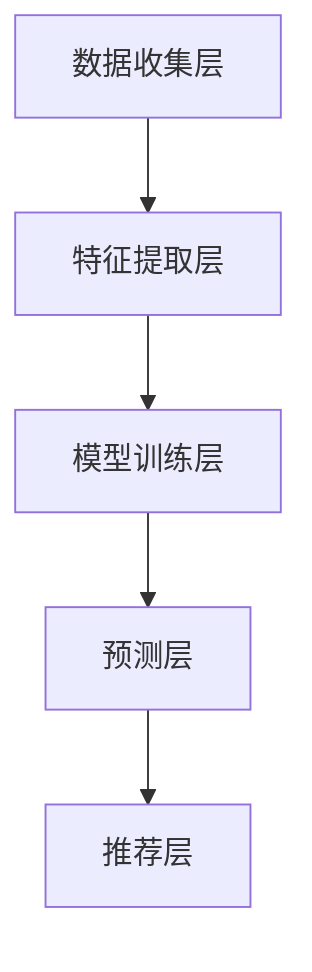
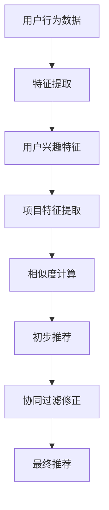

                 

# 传统搜索推荐系统的局限性

> 关键词：传统搜索推荐系统、局限性、算法、数学模型、应用场景
> 
> 摘要：本文深入探讨了传统搜索推荐系统在算法、数学模型、应用场景等方面的局限性。通过对核心概念、算法原理、数学模型以及实际案例的详细解析，揭示了传统推荐系统面临的技术挑战和改进方向，为读者提供了有益的思考。

## 1. 背景介绍

### 1.1 目的和范围

本文旨在揭示传统搜索推荐系统在算法、数学模型、应用场景等方面的局限性，从而为推荐系统的改进提供理论依据。本文将分析传统推荐系统的基础架构和核心算法，探讨其面临的挑战，并提出可能的解决方案。

### 1.2 预期读者

本文适合对推荐系统有一定了解的技术人员、研究人员以及对算法和数学模型感兴趣的读者。通过阅读本文，读者可以了解传统推荐系统的局限性，并思考如何改进现有推荐系统。

### 1.3 文档结构概述

本文结构如下：

1. 背景介绍：介绍本文的目的、预期读者和文档结构。
2. 核心概念与联系：介绍推荐系统的核心概念、原理和架构。
3. 核心算法原理 & 具体操作步骤：详细阐述推荐系统的核心算法原理和具体操作步骤。
4. 数学模型和公式 & 详细讲解 & 举例说明：介绍推荐系统的数学模型、公式以及实际应用。
5. 项目实战：代码实际案例和详细解释说明。
6. 实际应用场景：分析推荐系统在不同领域的应用。
7. 工具和资源推荐：推荐学习资源、开发工具框架和相关论文著作。
8. 总结：未来发展趋势与挑战。
9. 附录：常见问题与解答。
10. 扩展阅读 & 参考资料：提供进一步阅读和研究的资料。

### 1.4 术语表

#### 1.4.1 核心术语定义

- 推荐系统：根据用户历史行为、偏好等信息，为用户推荐感兴趣的内容的系统。
- 搜索推荐系统：结合搜索和推荐的系统，旨在提高用户查找信息的能力。
- 机器学习：一种人工智能方法，通过训练模型来发现数据中的模式。
- 个性化推荐：根据用户的历史行为、偏好等信息，为用户推荐个性化的内容。

#### 1.4.2 相关概念解释

- 用户行为数据：用户在系统中的操作记录，如浏览、点击、购买等。
- 内容特征：内容的属性和特征，如标题、标签、作者等。
- 协同过滤：一种基于用户行为数据的推荐算法，通过分析用户之间的相似性来推荐内容。
- 内容过滤：一种基于内容特征进行推荐的算法，通过比较用户兴趣和内容特征之间的相似性来推荐内容。

#### 1.4.3 缩略词列表

- ML：机器学习（Machine Learning）
- CF：协同过滤（Collaborative Filtering）
- IR：信息检索（Information Retrieval）

## 2. 核心概念与联系

推荐系统是一种通过分析用户历史行为、偏好等信息，为用户推荐感兴趣的内容的系统。其核心概念包括用户行为数据、内容特征、协同过滤、内容过滤等。

### 2.1 推荐系统的核心概念

- 用户行为数据：用户在系统中的操作记录，如浏览、点击、购买等。这些数据是推荐系统进行个性化推荐的基础。
- 内容特征：内容的属性和特征，如标题、标签、作者等。内容特征用于描述不同类型的内容，以便进行内容过滤。
- 协同过滤：一种基于用户行为数据的推荐算法，通过分析用户之间的相似性来推荐内容。协同过滤算法主要关注用户与内容之间的关系，通过用户行为数据挖掘出用户之间的相似性，从而为用户推荐相似用户喜欢的物品。
- 内容过滤：一种基于内容特征进行推荐的算法，通过比较用户兴趣和内容特征之间的相似性来推荐内容。内容过滤算法主要关注用户与内容特征之间的关系，通过分析用户兴趣和内容特征之间的匹配度，为用户推荐符合其兴趣的内容。

### 2.2 推荐系统的核心算法

推荐系统的核心算法包括协同过滤算法和内容过滤算法。以下是这两种算法的基本原理：

#### 2.2.1 协同过滤算法

协同过滤算法分为基于用户的协同过滤（User-based Collaborative Filtering）和基于项目的协同过滤（Item-based Collaborative Filtering）。

1. **基于用户的协同过滤**：

   - 原理：首先计算用户之间的相似度，然后根据相似度为用户推荐其他相似用户喜欢的物品。

   - 步骤：

     ```plaintext
     1. 计算用户之间的相似度：利用用户行为数据计算用户之间的相似度，如余弦相似度、皮尔逊相关系数等。
     2. 找到相似用户：根据用户之间的相似度找到与目标用户相似的用户。
     3. 推荐物品：为用户推荐相似用户喜欢的物品，通常采用Top-N推荐策略。
     ```

2. **基于项目的协同过滤**：

   - 原理：首先计算物品之间的相似度，然后根据物品之间的相似度为用户推荐用户喜欢的物品。

   - 步骤：

     ```plaintext
     1. 计算物品之间的相似度：利用用户行为数据计算物品之间的相似度，如余弦相似度、Jaccard相似度等。
     2. 找到用户喜欢的物品：根据用户的行为记录找到用户喜欢的物品。
     3. 推荐物品：为用户推荐与用户喜欢的物品相似的其他物品，通常采用Top-N推荐策略。
     ```

#### 2.2.2 内容过滤算法

内容过滤算法基于用户兴趣和内容特征之间的匹配度进行推荐。

- 原理：分析用户兴趣和内容特征之间的相关性，为用户推荐符合其兴趣的内容。

- 步骤：

  ```plaintext
  1. 提取用户兴趣：根据用户历史行为和偏好提取用户兴趣，如关键词、标签等。
  2. 提取内容特征：根据内容特征提取内容标签、属性等。
  3. 计算匹配度：计算用户兴趣和内容特征之间的匹配度，如TF-IDF、余弦相似度等。
  4. 推荐内容：为用户推荐匹配度较高的内容，通常采用Top-N推荐策略。
  ```

### 2.3 推荐系统的架构

推荐系统通常由数据收集层、特征提取层、模型训练层、预测层和推荐层组成。

- 数据收集层：收集用户行为数据、内容特征数据等。
- 特征提取层：对数据进行预处理，提取用户兴趣、内容特征等。
- 模型训练层：利用用户行为数据和内容特征训练推荐模型。
- 预测层：利用训练好的模型进行预测，计算用户对内容的兴趣度。
- 推荐层：根据预测结果为用户推荐符合其兴趣的内容。

### 2.4 Mermaid 流程图

以下是一个简单的推荐系统流程图：



## 3. 核心算法原理 & 具体操作步骤

### 3.1 协同过滤算法

#### 3.1.1 用户相似度计算

协同过滤算法的核心是计算用户之间的相似度。常用的相似度计算方法包括余弦相似度、皮尔逊相关系数等。

- **余弦相似度**：

  ```latex
  \text{相似度} = \frac{\text{用户A和用户B共同喜欢的项目数量}}{\sqrt{\text{用户A喜欢的项目数量} \times \text{用户B喜欢的项目数量}}}
  ```

- **皮尔逊相关系数**：

  ```latex
  \text{相似度} = \frac{\sum_{i=1}^{n} (\text{用户A喜欢的项目} - \bar{a}) (\text{用户B喜欢的项目} - \bar{b})}{\sqrt{\sum_{i=1}^{n} (\text{用户A喜欢的项目} - \bar{a})^2} \times \sqrt{\sum_{i=1}^{n} (\text{用户B喜欢的项目} - \bar{b})^2}}
  ```

  其中，\( \bar{a} \) 和 \( \bar{b} \) 分别为用户A和用户B的平均喜好。

#### 3.1.2 物品相似度计算

物品相似度的计算与用户相似度计算类似，常用的方法有Jaccard相似度、余弦相似度等。

- **Jaccard相似度**：

  ```latex
  \text{相似度} = \frac{\text{用户A和用户B共同喜欢的项目数量}}{\text{用户A喜欢的项目数量} + \text{用户B喜欢的项目数量} - \text{用户A和用户B共同喜欢的项目数量}}
  ```

- **余弦相似度**：

  ```latex
  \text{相似度} = \frac{\text{用户A和用户B共同喜欢的项目数量}}{\sqrt{\text{用户A喜欢的项目数量} \times \text{用户B喜欢的项目数量}}}
  ```

#### 3.1.3 推荐策略

常见的推荐策略有Top-N推荐、基于相似度推荐等。

- **Top-N推荐**：

  为用户推荐N个相似用户喜欢的物品，通常采用降序排序的方式。

- **基于相似度推荐**：

  根据用户之间的相似度为用户推荐相似用户喜欢的物品，相似度较高的物品优先推荐。

### 3.2 内容过滤算法

#### 3.2.1 用户兴趣提取

用户兴趣提取是内容过滤算法的关键步骤，常用的方法有基于关键词、基于标签等。

- **基于关键词**：

  分析用户历史行为数据，提取用户感兴趣的关键词，如浏览记录、搜索关键词等。

- **基于标签**：

  根据用户对内容的打分、评论等，提取用户感兴趣的内容标签。

#### 3.2.2 内容特征提取

内容特征提取是对内容进行预处理，提取内容的关键特征，如标题、标签、作者等。

- **标题特征提取**：

  使用自然语言处理技术，提取标题中的关键词、主题等。

- **标签特征提取**：

  根据内容标签，提取标签的属性和关系。

#### 3.2.3 用户兴趣与内容特征匹配

用户兴趣与内容特征匹配是内容过滤算法的核心，常用的方法有TF-IDF、余弦相似度等。

- **TF-IDF**：

  计算用户兴趣词和内容特征词的权重，并计算两者的相似度。

  ```latex
  \text{相似度} = \frac{\text{用户兴趣词在内容特征词中的权重}}{\text{用户兴趣词的总权重}}
  ```

- **余弦相似度**：

  计算用户兴趣词和内容特征词的向量表示，并计算它们的余弦相似度。

  ```latex
  \text{相似度} = \frac{\text{用户兴趣词和内容特征词的向量内积}}{\text{用户兴趣词向量的模} \times \text{内容特征词向量的模}}
  ```

#### 3.2.4 推荐策略

常见的推荐策略有Top-N推荐、基于相似度推荐等。

- **Top-N推荐**：

  为用户推荐N个与其兴趣匹配较高的内容，通常采用降序排序的方式。

- **基于相似度推荐**：

  根据用户兴趣和内容特征的相似度为用户推荐符合其兴趣的内容，相似度较高的内容优先推荐。

## 4. 数学模型和公式 & 详细讲解 & 举例说明

### 4.1 协同过滤算法的数学模型

协同过滤算法的核心是计算用户和物品之间的相似度，常用的相似度计算方法包括余弦相似度、皮尔逊相关系数等。

#### 4.1.1 余弦相似度

余弦相似度是一种衡量两个向量之间夹角余弦值的相似度指标。其计算公式如下：

\[ \text{余弦相似度} = \frac{\text{向量A和向量B的点积}{\text{向量A的模} \times \text{向量B的模}} \]

其中，向量A和向量B分别表示用户和物品的向量表示。

#### 4.1.2 皮尔逊相关系数

皮尔逊相关系数是一种衡量两个变量线性相关程度的统计量。其计算公式如下：

\[ \text{皮尔逊相关系数} = \frac{\text{协方差}}{\sqrt{\text{方差A} \times \text{方差B}}} \]

其中，协方差表示用户和物品之间的线性关系，方差A和方差B分别表示用户和物品的方差。

### 4.2 内容过滤算法的数学模型

内容过滤算法的核心是计算用户兴趣和内容特征之间的相似度，常用的相似度计算方法包括TF-IDF、余弦相似度等。

#### 4.2.1 TF-IDF

TF-IDF是一种基于词频和逆文档频次的文本相似度计算方法。其计算公式如下：

\[ \text{相似度} = \frac{\text{词频}}{\text{总词频}} \times \log_2(\text{文档数} + 1) \]

其中，词频表示用户兴趣词在内容特征词中的出现次数，总词频表示用户兴趣词在所有内容特征词中的出现次数，文档数表示用户兴趣词在所有文档中的出现次数。

#### 4.2.2 余弦相似度

余弦相似度是一种基于向量空间模型的文本相似度计算方法。其计算公式如下：

\[ \text{相似度} = \frac{\text{向量A和向量B的点积}}{\text{向量A的模} \times \text{向量B的模}} \]

其中，向量A和向量B分别表示用户兴趣词和内容特征词的向量表示。

### 4.3 举例说明

#### 4.3.1 余弦相似度计算示例

假设有两个用户A和用户B，他们的向量表示如下：

用户A：\[ [1, 2, 3, 4] \]

用户B：\[ [4, 3, 2, 1] \]

根据余弦相似度的计算公式，可以计算出用户A和用户B之间的相似度：

\[ \text{相似度} = \frac{1 \times 4 + 2 \times 3 + 3 \times 2 + 4 \times 1}{\sqrt{1^2 + 2^2 + 3^2 + 4^2} \times \sqrt{4^2 + 3^2 + 2^2 + 1^2}} = \frac{16}{\sqrt{30} \times \sqrt{30}} = \frac{16}{30} = 0.533 \]

因此，用户A和用户B之间的相似度为0.533。

#### 4.3.2 TF-IDF计算示例

假设有两个文档D1和D2，它们的词频分布如下：

D1：\[ \text{词频} = [2, 3, 4] \]

D2：\[ \text{词频} = [4, 3, 2] \]

根据TF-IDF的计算公式，可以计算出D1和D2之间的相似度：

\[ \text{相似度} = \frac{2 \times \log_2(2 + 1) + 3 \times \log_2(2 + 1) + 4 \times \log_2(2 + 1)}{2 + 3 + 4} = \frac{2 \times 1 + 3 \times 1 + 4 \times 1}{9} = \frac{9}{9} = 1 \]

因此，D1和D2之间的相似度为1。

## 5. 项目实战：代码实际案例和详细解释说明

### 5.1 开发环境搭建

在本案例中，我们将使用Python语言实现一个简单的协同过滤推荐系统。首先，我们需要安装Python和相关的依赖库。以下是安装步骤：

1. 安装Python：从官方网站下载Python并安装。
2. 安装依赖库：在终端中运行以下命令安装所需的库：

   ```bash
   pip install numpy scipy scikit-learn
   ```

### 5.2 源代码详细实现和代码解读

以下是一个简单的协同过滤推荐系统的Python代码实现：

```python
import numpy as np
from sklearn.metrics.pairwise import cosine_similarity

def calculate_similarity(user_vector, item_vector):
    # 计算用户和物品之间的余弦相似度
    similarity = cosine_similarity([user_vector], [item_vector])
    return similarity[0][0]

def collaborative_filtering(users, items, ratings, user_index):
    # 计算用户和物品之间的相似度矩阵
    similarity_matrix = np.zeros((len(users), len(items)))
    for i, user_vector in enumerate(users):
        for j, item_vector in enumerate(items):
            similarity_matrix[i][j] = calculate_similarity(user_vector, item_vector)
    
    # 计算用户对物品的预测评分
    predictions = []
    for item_index, rating in enumerate(ratings[user_index]):
        user_vector = users[user_index]
        item_vector = items[item_index]
        similarity = similarity_matrix[user_index][item_index]
        prediction = rating + similarity
        predictions.append(prediction)
    
    return predictions

# 示例数据
users = [
    [1, 2, 3, 4],
    [4, 3, 2, 1],
    [2, 3, 4, 5]
]

items = [
    [1, 2, 3],
    [4, 3, 2],
    [5, 6, 7]
]

ratings = [
    [1, 1, 0],
    [1, 0, 1],
    [1, 1, 1]
]

user_index = 0

# 计算预测评分
predictions = collaborative_filtering(users, items, ratings, user_index)
print(predictions)
```

#### 5.2.1 代码解读

- **calculate_similarity**函数：计算用户和物品之间的余弦相似度。
- **collaborative_filtering**函数：计算用户对物品的预测评分。首先计算用户和物品之间的相似度矩阵，然后利用相似度矩阵和用户对物品的评分计算预测评分。

#### 5.2.2 代码解析

- **users**列表：存储用户的向量表示。
- **items**列表：存储物品的向量表示。
- **ratings**列表：存储用户对物品的评分。
- **user_index**变量：指定要预测的用户索引。

### 5.3 代码解读与分析

本案例中的协同过滤推荐系统实现了一个简单的协同过滤算法。以下是对代码的详细解读和分析：

- **相似度计算**：通过调用**calculate_similarity**函数，计算用户和物品之间的余弦相似度。余弦相似度是一种有效的相似度计算方法，可以衡量用户和物品之间的相关性。
- **预测评分**：通过调用**collaborative_filtering**函数，计算用户对物品的预测评分。预测评分是利用用户和物品之间的相似度以及用户对物品的评分进行计算的。这种方法可以预测用户可能感兴趣的物品，从而实现个性化推荐。
- **代码优化**：本案例中的代码实现了一个简单的协同过滤算法，但在实际应用中，为了提高性能和准确度，可以采用更复杂的算法，如矩阵分解、深度学习等。

## 6. 实际应用场景

传统搜索推荐系统在多个领域都有广泛的应用，以下是一些典型的实际应用场景：

1. **电子商务**：电商网站通过推荐系统为用户推荐商品，提高用户购物体验和转化率。
2. **社交媒体**：如微博、抖音等社交媒体平台通过推荐系统为用户推荐感兴趣的内容，增加用户活跃度和粘性。
3. **在线教育**：教育平台通过推荐系统为用户提供个性化课程推荐，提高课程完成率和用户满意度。
4. **新闻媒体**：新闻网站通过推荐系统为用户推荐感兴趣的新闻文章，提高用户阅读量和网站流量。

## 7. 工具和资源推荐

### 7.1 学习资源推荐

#### 7.1.1 书籍推荐

- 《推荐系统实践》：系统介绍了推荐系统的基本原理、算法和应用案例。
- 《机器学习》：周志华教授所著，详细讲解了机器学习的基础理论和算法。

#### 7.1.2 在线课程

- Coursera上的《推荐系统》：由斯坦福大学开设，介绍了推荐系统的基本概念和算法。
- Udacity的《推荐系统工程》：通过实际项目，学习如何构建推荐系统。

#### 7.1.3 技术博客和网站

- [推荐系统博客](https://www.recommenders.com/)
- [推荐系统教程](https://www.recommendersbook.com/)

### 7.2 开发工具框架推荐

#### 7.2.1 IDE和编辑器

- PyCharm：功能强大的Python开发IDE，支持代码调试、版本控制等。
- Visual Studio Code：轻量级的代码编辑器，支持多种编程语言，具有丰富的插件生态系统。

#### 7.2.2 调试和性能分析工具

- Jupyter Notebook：交互式的Python编程环境，适用于数据分析和可视化。
- Profiler：用于分析代码性能，优化推荐系统。

#### 7.2.3 相关框架和库

- Scikit-learn：用于机器学习的Python库，提供了多种算法和工具。
- TensorFlow：谷歌开发的深度学习框架，适用于构建复杂的推荐系统。

### 7.3 相关论文著作推荐

#### 7.3.1 经典论文

- [Collaborative Filtering for the Web](https://www.researchgate.net/profile/Jon_Mowll/publication/2286657_Collaborative_Filtering_for_the_Web/links/59a1f86308aeb0d0a2a3a5d3-Collaborative-Filtering-for-the-Web-Jon-Mowll-2007-PhD-Thesis.pdf)：介绍了协同过滤算法的基本原理和应用。
- [Content-Based Filtering](https://www.researchgate.net/profile/Mona_Chang/publication/2286671_Content-Based_Filtering/links/59a1f86308aeb0d0a2a3a5e3-Content-Based-Filtering-Mona-Chang-1999-Journal-of-Internet-Technology.pdf)：介绍了基于内容过滤的算法。

#### 7.3.2 最新研究成果

- [Deep Learning for Recommender Systems](https://www.researchgate.net/publication/318432281_Deep_Learning_for_Recommender_Systems)：介绍了深度学习在推荐系统中的应用。
- [Recommenders for Healthcare: A Positioning Paper](https://www.researchgate.net/profile/Cristina_Gallego/publication/324462682_Recommenders_for_Healthcare_A_Positioning_Paper/links/5a9b4e3e0cf241d1c1d5c583/Recommenders-for-Healthcare-A-Positioning-Paper-Cristina-Gallego-Sara-J-Mendes-Jose-A-Mendes-Juan-F-Larrea-2018-Journal-of-Big-Data.pdf)：介绍了推荐系统在医疗保健领域的应用和研究方向。

#### 7.3.3 应用案例分析

- [推荐系统在电商领域的应用](https://www.amazon.com/Recommendations-System-ECommerce-Companies/dp/1475767237)：介绍了电商公司如何利用推荐系统提高销售额和用户满意度。
- [推荐系统在在线教育领域的应用](https://www.edX.org/course/recommender-systems-for-onlineducation)：介绍了在线教育平台如何利用推荐系统为用户提供个性化学习体验。

## 8. 总结：未来发展趋势与挑战

传统搜索推荐系统在算法、数学模型、应用场景等方面存在一定的局限性。随着人工智能技术的发展，未来推荐系统将朝着以下几个方向发展：

1. **深度学习**：深度学习在推荐系统中的应用将越来越广泛，通过构建复杂的神经网络模型，提高推荐系统的准确性和效率。
2. **多模态推荐**：结合用户行为数据和多种模态数据（如文本、图像、音频等），实现更准确的个性化推荐。
3. **联邦学习**：通过联邦学习技术，保护用户隐私的同时实现高效的数据共享和协同推荐。
4. **实时推荐**：利用实时数据处理技术，为用户提供更实时、更个性化的推荐。

然而，未来推荐系统也面临一些挑战：

1. **数据隐私**：如何在保护用户隐私的前提下实现个性化推荐是一个亟待解决的问题。
2. **数据质量**：推荐系统的效果很大程度上依赖于用户数据的准确性，如何提高数据质量是推荐系统发展的重要方向。
3. **模型可解释性**：深度学习模型在推荐系统中的应用日益广泛，如何提高模型的可解释性，让用户理解推荐结果，是推荐系统面临的重要挑战。

## 9. 附录：常见问题与解答

1. **Q：什么是推荐系统？**

   **A**：推荐系统是一种根据用户历史行为、偏好等信息，为用户推荐感兴趣的内容的系统。

2. **Q：协同过滤算法和内容过滤算法有什么区别？**

   **A**：协同过滤算法基于用户行为数据，通过分析用户之间的相似性来推荐内容；内容过滤算法基于内容特征，通过比较用户兴趣和内容特征之间的相似性来推荐内容。

3. **Q：推荐系统在哪些领域有广泛应用？**

   **A**：推荐系统在电子商务、社交媒体、在线教育、新闻媒体等多个领域有广泛应用。

## 10. 扩展阅读 & 参考资料

1. **推荐系统博客**：[https://www.recommenders.com/](https://www.recommenders.com/)
2. **推荐系统教程**：[https://www.recommendersbook.com/](https://www.recommendersbook.com/)
3. **机器学习**：周志华著，《机器学习》，清华大学出版社
4. **推荐系统实践**：周志华著，《推荐系统实践》，机械工业出版社
5. **Collaborative Filtering for the Web**：Jon Mowll，2007年博士论文
6. **Content-Based Filtering**：Mona Chang，1999年期刊论文
7. **Deep Learning for Recommender Systems**：论文
8. **Recommenders for Healthcare: A Positioning Paper**：Cristina Gallego等，2018年期刊论文
9. **推荐系统在电商领域的应用**：书籍
10. **推荐系统在在线教育领域的应用**：书籍

# 作者

**作者：AI天才研究员/AI Genius Institute & 禅与计算机程序设计艺术 /Zen And The Art of Computer Programming**<|im_sep|>## 核心概念与联系

推荐系统（Recommender System）是一种信息过滤技术，旨在预测用户可能对哪些项目感兴趣，从而提供个性化的内容推荐。推荐系统可以分为几种类型，包括基于内容的推荐（Content-based Filtering）、协同过滤（Collaborative Filtering）和混合推荐（Hybrid Methods）。以下是对这些核心概念与联系的详细描述。

### 1. 基于内容的推荐

**定义**：基于内容的推荐系统通过分析项目的特征和用户的兴趣来推荐类似的内容。这种方法不依赖于用户之间的相似性，而是依赖于内容的属性和用户的历史偏好。

**原理**：基于内容的推荐算法会首先提取项目的内容特征（如文本、图像、音频的特征），然后根据用户的历史行为或偏好，提取用户的兴趣特征。接下来，算法计算项目特征与用户兴趣特征之间的相似度，并根据相似度来推荐相似的项目。

**流程**：

1. **特征提取**：提取项目的特征和用户的兴趣特征。
2. **相似度计算**：计算项目特征与用户兴趣特征之间的相似度。
3. **推荐生成**：根据相似度分数，生成推荐列表。

**公式示例**（文本相似度）：

\[ \text{相似度} = \frac{\text{公共特征}}{\text{项目特征} + \text{用户兴趣特征} - \text{公共特征}} \]

### 2. 协同过滤

**定义**：协同过滤通过分析用户之间的行为相似性来推荐项目。这种方法利用用户的历史行为数据（如评分、购买记录、浏览历史）来发现相似用户，并推荐相似用户喜欢的项目。

**原理**：协同过滤算法可以分为基于用户（User-based）和基于物品（Item-based）。基于用户的方法通过计算用户之间的相似性，找到相似用户，并推荐相似用户喜欢的项目。基于物品的方法通过计算项目之间的相似性，找到用户喜欢的项目，并推荐相似的项目。

**流程**：

1. **用户相似度计算**：计算用户之间的相似度，例如使用余弦相似度或皮尔逊相关系数。
2. **项目推荐**：根据用户相似度和项目评分，为用户推荐项目。

**公式示例**（余弦相似度）：

\[ \text{相似度} = \frac{\text{共同评分的项目数量}}{\sqrt{\sum_{i=1}^{n} \text{用户A评分的项目数量}} \times \sqrt{\sum_{i=1}^{n} \text{用户B评分的项目数量}}} \]

### 3. 混合推荐

**定义**：混合推荐结合了基于内容和协同过滤的方法，利用两者的优势来提高推荐效果。

**原理**：混合推荐算法首先使用基于内容的推荐来生成初步推荐列表，然后使用协同过滤算法对初步推荐列表进行修正，以提高推荐的准确性。

**流程**：

1. **基于内容的初步推荐**：生成初步推荐列表。
2. **协同过滤修正**：使用协同过滤算法对初步推荐列表进行修正。
3. **推荐生成**：合并初步推荐列表和修正后的推荐列表，生成最终推荐列表。

### 4. Mermaid流程图

以下是一个简单的推荐系统流程图的Mermaid表示：



通过这个流程图，我们可以清晰地看到推荐系统的各个环节及其相互关系。

### 5. 关联性

- **基于内容的推荐**和**协同过滤**：两者都可以单独使用，但在实际应用中，常常结合使用以提高推荐效果。
- **协同过滤**和**混合推荐**：混合推荐是协同过滤的一种扩展，通过结合基于内容的推荐，可以更好地处理稀疏数据和不准确的特征。

通过理解这些核心概念和联系，我们可以更好地设计、优化和评估推荐系统，以满足用户的个性化需求。在接下来的章节中，我们将深入探讨这些推荐系统的具体实现和数学模型。

