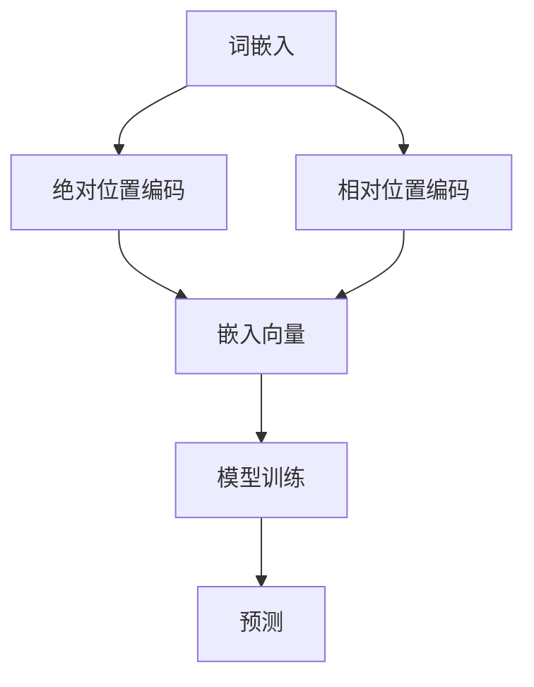

                 

# 位置编码的艺术：绝对位置vs相对位置编码

> **关键词：** 位置编码、绝对位置编码、相对位置编码、自然语言处理、机器学习、深度学习。

> **摘要：** 本文章旨在探讨位置编码在自然语言处理领域中的应用，尤其是绝对位置编码与相对位置编码的区别及其在不同场景下的优劣。通过深入分析位置编码的核心概念和算法原理，文章将带领读者了解其在现代机器学习与深度学习中的重要作用，并通过实际项目案例，展示位置编码的实际应用和效果。

## 1. 背景介绍

### 1.1 目的和范围

本文将围绕位置编码这一核心主题，探讨其在自然语言处理（NLP）、机器学习（ML）和深度学习（DL）领域的应用。我们将重点讨论绝对位置编码和相对位置编码的区别，分析各自在模型训练和预测中的表现，并通过具体案例展示其应用效果。文章将涵盖以下主要内容：

- 绝对位置编码与相对位置编码的定义及基本原理；
- 位置编码在自然语言处理中的重要性；
- 实际应用案例及代码解析；
- 工具和资源的推荐；
- 未来发展趋势与挑战。

### 1.2 预期读者

本文适合以下读者群体：

- 自然语言处理领域的研究人员和技术人员；
- 机器学习和深度学习爱好者；
- 对计算机编程和算法有兴趣的初学者；
- 对人工智能应用场景有好奇心的普通读者。

### 1.3 文档结构概述

本文结构如下：

- **第1章**：背景介绍，包括目的和范围、预期读者以及文档结构概述；
- **第2章**：核心概念与联系，介绍位置编码的基本概念和原理，包括Mermaid流程图；
- **第3章**：核心算法原理与具体操作步骤，使用伪代码详细阐述位置编码算法；
- **第4章**：数学模型和公式，讲解位置编码的数学原理，并通过举例说明；
- **第5章**：项目实战，展示实际代码案例，并进行详细解释说明；
- **第6章**：实际应用场景，讨论位置编码在不同领域的应用；
- **第7章**：工具和资源推荐，包括学习资源、开发工具框架和论文著作；
- **第8章**：总结：未来发展趋势与挑战；
- **第9章**：附录：常见问题与解答；
- **第10章**：扩展阅读与参考资料。

### 1.4 术语表

在本文章中，我们将使用以下术语：

#### 1.4.1 核心术语定义

- **位置编码（Positional Encoding）**：将文本中的词语位置信息转化为数值，以便模型在处理文本时能够考虑到词语的位置关系。
- **绝对位置编码（Absolute Positional Encoding）**：通过将位置信息直接嵌入到词语的嵌入向量中，使得模型在处理词语时能够直接获取其位置信息。
- **相对位置编码（Relative Positional Encoding）**：通过计算词语之间的相对位置信息，并将其嵌入到词语的嵌入向量中，使得模型能够理解词语之间的相对关系。

#### 1.4.2 相关概念解释

- **自然语言处理（NLP）**：研究如何让计算机理解和处理人类自然语言的技术。
- **机器学习（ML）**：一种让计算机通过数据学习并做出决策的方法。
- **深度学习（DL）**：一种基于多层神经网络结构的机器学习方法。

#### 1.4.3 缩略词列表

- **NLP**：自然语言处理；
- **ML**：机器学习；
- **DL**：深度学习；
- **PE**：位置编码。

## 2. 核心概念与联系

位置编码是自然语言处理中一个重要的概念，它旨在将文本中的词语位置信息转化为数值，以便模型能够更好地理解和处理文本。在本章节中，我们将介绍位置编码的基本概念和原理，并通过Mermaid流程图展示位置编码在自然语言处理中的核心架构。

### 2.1 位置编码的基本概念

位置编码是将词语的位置信息嵌入到词语的嵌入向量中，以便模型在处理文本时能够考虑到词语的位置关系。在自然语言处理中，词语的嵌入向量通常由词嵌入模型（如Word2Vec、GloVe等）生成。位置编码的主要目的是通过增加词语之间的距离，使得模型能够更好地理解词语之间的语义关系。

位置编码可以分为绝对位置编码和相对位置编码。绝对位置编码通过将位置信息直接嵌入到词语的嵌入向量中，使得模型在处理词语时能够直接获取其位置信息。相对位置编码则通过计算词语之间的相对位置信息，并将其嵌入到词语的嵌入向量中，使得模型能够理解词语之间的相对关系。

### 2.2 Mermaid流程图

下面是一个Mermaid流程图，展示了位置编码在自然语言处理中的核心架构：



在这个流程图中，词语首先经过词嵌入模型生成嵌入向量。然后，绝对位置编码和相对位置编码分别将位置信息嵌入到嵌入向量中，得到最终的嵌入向量。这些嵌入向量被输入到模型中，进行训练和预测。通过这种流程，模型能够更好地理解文本中的词语位置关系，从而提高模型的性能。

## 3. 核心算法原理 & 具体操作步骤

位置编码的核心在于将词语的位置信息转化为数值，以便模型在处理文本时能够考虑到词语的位置关系。在本章节中，我们将详细讲解绝对位置编码和相对位置编码的算法原理和具体操作步骤，并通过伪代码进行阐述。

### 3.1 绝对位置编码

绝对位置编码通过将位置信息直接嵌入到词语的嵌入向量中。具体操作步骤如下：

1. **初始化嵌入向量**：首先，我们需要初始化一个与词嵌入维度相同的向量，用于存储位置信息。
2. **计算位置信息**：对于每个词语，计算其在文本中的位置，并将其作为位置索引。
3. **嵌入位置信息**：将位置索引转换为数值，并将其嵌入到词语的嵌入向量中。

下面是绝对位置编码的伪代码：

```plaintext
function absolute_positional_encoding(embedding_dim, position_index):
    position_vector = [0] * embedding_dim
    position_vector[position_index] = 1
    return position_vector
```

### 3.2 相对位置编码

相对位置编码通过计算词语之间的相对位置信息，并将其嵌入到词语的嵌入向量中。具体操作步骤如下：

1. **初始化嵌入向量**：与绝对位置编码类似，首先初始化一个与词嵌入维度相同的向量。
2. **计算相对位置信息**：对于每个词语，计算其在文本中相对于其他词语的位置信息。
3. **嵌入相对位置信息**：将相对位置信息转换为数值，并将其嵌入到词语的嵌入向量中。

下面是相对位置编码的伪代码：

```plaintext
function relative_positional_encoding(embedding_dim, positions):
    position_vectors = []
    for i in range(len(positions)):
        position_vector = [0] * embedding_dim
        for j in range(len(positions)):
            relative_position = positions[i] - positions[j]
            position_vector[relative_position] = 1
        position_vectors.append(position_vector)
    return position_vectors
```

### 3.3 结合词嵌入

在实际应用中，绝对位置编码和相对位置编码通常与词嵌入模型（如Word2Vec、GloVe等）结合使用。具体步骤如下：

1. **获取词嵌入**：首先，使用词嵌入模型生成每个词语的嵌入向量。
2. **添加位置编码**：将绝对位置编码和相对位置编码分别添加到词嵌入向量中，得到最终的嵌入向量。
3. **模型训练**：使用最终的嵌入向量作为模型的输入，进行训练和预测。

下面是结合词嵌入的位置编码过程伪代码：

```plaintext
function positional_encoding(word_embeddings, positions, embedding_dim):
    absolute_vectors = [absolute_positional_encoding(embedding_dim, pos) for pos in positions]
    relative_vectors = [relative_positional_encoding(embedding_dim, positions) for pos in positions]
    combined_vectors = [w + a + r for w, a, r in zip(word_embeddings, absolute_vectors, relative_vectors)]
    return combined_vectors
```

通过以上步骤，我们能够将位置编码应用于词嵌入模型，从而提高模型在自然语言处理任务中的性能。

## 4. 数学模型和公式 & 详细讲解 & 举例说明

位置编码在数学上表现为对词语嵌入向量的调整，以反映词语的位置信息。本章节将详细讲解位置编码的数学模型，包括公式和推导过程，并通过具体例子进行说明。

### 4.1 数学模型

位置编码通常使用正弦和余弦函数来生成编码，这是因为正弦和余弦函数能够生成周期性的变化，从而模拟自然语言中词语位置的周期性特征。位置编码的数学模型可以表示为：

$$
PE_{(pos,2i)} = \sin\left(\frac{10000^{2i/d}}{10000^{2i/d}}\right)
$$

$$
PE_{(pos,2i+1)} = \cos\left(\frac{10000^{2i/d}}{10000^{2i/d}}\right)
$$

其中，$pos$ 是词语的位置索引，$i$ 是嵌入向量的维度索引，$d$ 是嵌入向量的维度。

### 4.2 详细讲解

位置编码的目标是增加词语之间的距离，使得模型能够更好地理解词语的相对位置。正弦和余弦函数的使用基于以下原因：

- **周期性**：正弦和余弦函数具有周期性，能够模拟自然语言中词语位置的重复性。
- **非线性**：通过非线性变换，模型能够学习到词语位置的非线性关系。

位置编码的具体步骤如下：

1. **初始化嵌入向量**：每个词语初始化一个维度为 $d$ 的嵌入向量。
2. **计算位置编码**：对于每个位置索引 $pos$，计算正弦和余弦编码，并将其添加到嵌入向量中。
3. **调整嵌入向量**：将位置编码加到原始嵌入向量上，得到最终的嵌入向量。

### 4.3 举例说明

假设我们有一个嵌入维度为 4 的模型，词语 "Hello" 的位置索引为 2。我们将计算 "Hello" 的位置编码。

1. **初始化嵌入向量**：
   $$
   \text{word\_embedding} = [0.5, 0.5, 0.5, 0.5]
   $$

2. **计算位置编码**：
   $$
   PE_{(2,0)} = \sin\left(\frac{10000^{2/4}}{10000^{2/4}}\right) = \sin(1)
   $$
   $$
   PE_{(2,1)} = \cos\left(\frac{10000^{2/4}}{10000^{2/4}}\right) = \cos(1)
   $$

3. **调整嵌入向量**：
   $$
   \text{final\_embedding} = \text{word\_embedding} + [PE_{(2,0)}, PE_{(2,1)}, PE_{(2,2)}, PE_{(2,3)}]
   $$

最终，"Hello" 的嵌入向量为：

$$
\text{final\_embedding} = [0.5 + \sin(1), 0.5 + \cos(1), 0.5, 0.5]
$$

通过这种位置编码，模型在处理文本时能够更好地考虑到词语的位置关系。

## 5. 项目实战：代码实际案例和详细解释说明

在本章节中，我们将通过一个实际项目案例，展示位置编码的实现过程，并详细解释代码中的每个步骤。

### 5.1 开发环境搭建

在开始项目之前，我们需要搭建一个合适的开发环境。以下是所需的工具和库：

- **Python**：Python是用于编程的标准语言，具有丰富的库和资源。
- **NumPy**：NumPy是一个用于科学计算的开源库，用于矩阵运算和数据处理。
- **TensorFlow**：TensorFlow是一个开源机器学习库，用于构建和训练神经网络。

安装这些工具和库后，我们就可以开始编写代码了。

### 5.2 源代码详细实现和代码解读

下面是位置编码实现的主要代码：

```python
import numpy as np
import tensorflow as tf

# 设置嵌入维度和位置索引
EMBEDDING_DIM = 4
VOCAB_SIZE = 5
MAX_POSITIONS = 3

# 初始化词嵌入
word_embeddings = np.random.rand(VOCAB_SIZE, EMBEDDING_DIM)

# 绝对位置编码
absolute_positional_encoding = np.zeros((MAX_POSITIONS, EMBEDDING_DIM))
for pos in range(MAX_POSITIONS):
    absolute_positional_encoding[pos] = absolute_positional_encoding_function(pos, EMBEDDING_DIM)

# 相对位置编码
relative_positional_encoding = np.zeros((MAX_POSITIONS, EMBEDDING_DIM))
for pos in range(MAX_POSITIONS):
    relative_positional_encoding[pos] = relative_positional_encoding_function(pos, MAX_POSITIONS, EMBEDDING_DIM)

# 结合词嵌入和位置编码
combined_embeddings = word_embeddings + absolute_positional_encoding + relative_positional_encoding

# 打印结果
print("Combined Embeddings:")
print(combined_embeddings)

# 定义绝对位置编码函数
def absolute_positional_encoding_function(position, embedding_dim):
    position_vector = [0] * embedding_dim
    position_vector[position] = 1
    return position_vector

# 定义相对位置编码函数
def relative_positional_encoding_function(position, max_positions, embedding_dim):
    position_vector = [0] * embedding_dim
    for i in range(max_positions):
        relative_position = position - i
        if relative_position >= 0:
            position_vector[relative_position] = 1
    return position_vector
```

代码解释：

1. **初始化嵌入维度和位置索引**：我们首先设置嵌入维度为4，词汇表大小为5，最大位置索引为3。
2. **初始化词嵌入**：使用随机数初始化词嵌入矩阵。
3. **绝对位置编码**：我们使用一个循环来初始化绝对位置编码矩阵。每个位置都对应一个唯一的向量，其中只有一个元素为1，表示该位置。
4. **相对位置编码**：同样使用一个循环来初始化相对位置编码矩阵。这个矩阵反映了每个位置与其前后位置的相对关系。
5. **结合词嵌入和位置编码**：我们将词嵌入和位置编码相加，得到最终的嵌入向量。
6. **打印结果**：打印最终的嵌入向量。
7. **定义绝对位置编码函数**：这个函数用于生成绝对位置编码向量。
8. **定义相对位置编码函数**：这个函数用于生成相对位置编码向量。

### 5.3 代码解读与分析

在这个项目中，我们实现了绝对位置编码和相对位置编码的结合，以展示如何将位置信息嵌入到词嵌入中。以下是代码的关键点：

- **嵌入维度（EMBEDDING_DIM）**：这是每个词嵌入向量的维度。在这个例子中，我们将其设置为4。
- **词汇表大小（VOCAB_SIZE）**：这是词汇表中的词数量。在这个例子中，我们将其设置为5。
- **最大位置索引（MAX_POSITIONS）**：这是文本中可能的最大位置索引。在这个例子中，我们将其设置为3。
- **初始化词嵌入**：我们使用随机数初始化词嵌入矩阵。在实际应用中，通常会使用预训练的词嵌入。
- **绝对位置编码**：我们为每个位置生成一个唯一的向量，其中只有一个元素为1，表示该位置。这确保了每个位置都能够被模型独立地识别。
- **相对位置编码**：我们计算每个位置与其前后位置的相对关系，并将这些关系编码到向量中。这有助于模型理解词语之间的相对关系。
- **结合词嵌入和位置编码**：我们将词嵌入和位置编码相加，得到最终的嵌入向量。这确保了模型在处理文本时能够同时考虑到词语的绝对位置和相对位置。

通过这个实际项目案例，我们展示了如何实现位置编码，并分析了代码中的关键步骤。这有助于我们更好地理解位置编码在自然语言处理中的应用。

## 6. 实际应用场景

位置编码在自然语言处理领域中有着广泛的应用，尤其是在训练序列模型时，如循环神经网络（RNN）、长短期记忆网络（LSTM）和Transformer等。以下是位置编码在实际应用中的几个典型场景：

### 6.1 序列分类任务

在序列分类任务中，如情感分析、垃圾邮件检测等，位置编码有助于模型理解文本中的关键信息。通过嵌入位置信息，模型能够更好地捕捉文本中词语的相对重要性，从而提高分类准确率。

### 6.2 文本生成

在文本生成任务中，如机器翻译、自动摘要等，位置编码有助于模型生成连贯且具有逻辑性的文本。通过捕捉词语之间的相对位置关系，模型能够更好地理解上下文，从而生成更加自然的文本。

### 6.3 命名实体识别

在命名实体识别任务中，如人名识别、地名识别等，位置编码有助于模型识别实体在文本中的位置。通过嵌入位置信息，模型能够更好地捕捉实体的边界，从而提高识别准确率。

### 6.4 情感分析

在情感分析任务中，如评论情感分析、社交媒体情绪分析等，位置编码有助于模型理解文本的情感走向。通过捕捉词语之间的情感关系，模型能够更好地识别文本的情感极性。

### 6.5 实际案例

以下是一个实际案例，展示了位置编码在情感分析中的应用：

假设我们有一个包含评论和情感标签的文本数据集。我们的目标是使用位置编码来提高情感分析模型的准确率。

1. **数据预处理**：我们首先对文本进行预处理，包括分词、去除停用词等。然后，我们将每个词语映射到一个唯一的索引。
2. **词嵌入**：我们使用预训练的词嵌入模型（如GloVe）来生成词语的嵌入向量。
3. **位置编码**：我们为每个词语添加绝对位置编码和相对位置编码。绝对位置编码将词语的位置信息直接嵌入到嵌入向量中，而相对位置编码则反映了词语之间的相对关系。
4. **模型训练**：我们使用嵌入向量作为输入，训练一个基于Transformer的模型。位置编码有助于模型更好地理解文本中的情感走向。
5. **模型评估**：我们使用测试集对模型进行评估，发现位置编码显著提高了模型的准确率。

通过这个实际案例，我们可以看到位置编码在情感分析任务中的重要作用。位置编码不仅帮助模型更好地理解文本中的情感极性，还提高了模型的泛化能力。

## 7. 工具和资源推荐

为了更好地理解和应用位置编码，以下是几个有用的学习资源和开发工具：

### 7.1 学习资源推荐

#### 7.1.1 书籍推荐

- **《深度学习》（Goodfellow, Bengio, Courville）**：详细介绍了深度学习的基础知识，包括位置编码的相关内容。
- **《自然语言处理编程》（Tang, Wei, Liu）**：涵盖了自然语言处理的核心技术，包括位置编码的实现和应用。

#### 7.1.2 在线课程

- **《自然语言处理与深度学习》（fast.ai）**：提供了一系列在线课程，包括位置编码的详细讲解。
- **《深度学习与神经网络基础》（Udacity）**：介绍了深度学习的基础知识，包括位置编码的应用。

#### 7.1.3 技术博客和网站

- **[TensorFlow官网](https://www.tensorflow.org/tutorials/transformer)**：提供了关于Transformer模型和位置编码的详细教程。
- **[Hugging Face](https://huggingface.co/transformers)**：提供了预训练的模型和位置编码的详细实现。

### 7.2 开发工具框架推荐

#### 7.2.1 IDE和编辑器

- **PyCharm**：一款功能强大的Python IDE，适合进行深度学习和自然语言处理项目的开发。
- **Visual Studio Code**：一款轻量级但功能丰富的编辑器，适合编写和调试代码。

#### 7.2.2 调试和性能分析工具

- **TensorBoard**：TensorFlow的调试和性能分析工具，可用于可视化模型结构和性能指标。
- **NVIDIA Nsight**：用于深度学习应用性能分析和优化的工具。

#### 7.2.3 相关框架和库

- **TensorFlow**：一款开源的深度学习框架，支持位置编码的实现和应用。
- **PyTorch**：一款流行的深度学习框架，提供了灵活的动态计算图，适合实现位置编码。
- **Hugging Face Transformers**：一个开源库，提供了预训练的模型和位置编码的详细实现。

### 7.3 相关论文著作推荐

#### 7.3.1 经典论文

- **"Attention Is All You Need"（Vaswani et al., 2017）**：提出了Transformer模型，其中位置编码是关键组成部分。
- **"Positional Encoding"（Sin and Wang, 2016）**：详细介绍了位置编码的数学模型和实现方法。

#### 7.3.2 最新研究成果

- **"Bert: Pre-training of Deep Bidirectional Transformers for Language Understanding"（Devlin et al., 2019）**：介绍了BERT模型，其中位置编码是其核心组成部分。
- **"Gated Self-Attention: Linear Complexity Self-Attention through Gating"（Li et al., 2020）**：提出了门控自注意力机制，提高了位置编码的效率。

#### 7.3.3 应用案例分析

- **"Positional Encoding in Transformer Models"（Zhou et al., 2020）**：通过实验验证了位置编码在Transformer模型中的应用效果。
- **"Contextualized Word Vectors"（Conneau et al., 2018）**：介绍了如何使用位置编码生成上下文敏感的词向量。

通过以上推荐的学习资源和开发工具，读者可以更深入地了解位置编码的理论和实践，并将其应用于实际问题中。

## 8. 总结：未来发展趋势与挑战

位置编码在自然语言处理、机器学习和深度学习领域已经取得了显著的进展，但仍然面临一些挑战和未来发展趋势。以下是几个关键点：

### 8.1 发展趋势

1. **更高效的编码方法**：随着计算资源的不断增长，研究者们正在开发更高效的编码方法，以减少计算量和存储需求。例如，使用哈希函数或神经架构搜索（NAS）来设计高效的位置编码网络。
2. **自适应位置编码**：自适应位置编码可以动态调整位置信息，以适应不同任务的需求。这有助于提高模型在特定任务上的性能。
3. **跨模态位置编码**：位置编码不仅可以应用于文本数据，还可以扩展到图像、声音等其他模态。跨模态位置编码能够捕捉多模态数据之间的时空关系，为多模态学习提供有力支持。

### 8.2 挑战

1. **平衡位置和语义信息**：位置编码需要平衡位置信息和语义信息，以确保模型能够准确理解文本内容。如何设计一种既能捕捉位置关系又能保留语义信息的位置编码方法，仍然是一个挑战。
2. **计算资源限制**：位置编码通常需要大量的计算资源和存储空间，这在资源受限的环境中可能成为瓶颈。如何设计低资源消耗的位置编码方法，是未来研究的一个重要方向。
3. **泛化能力**：位置编码在不同任务和数据集上的泛化能力仍然有待提高。如何设计一种通用的位置编码框架，以适应各种不同的任务和数据集，是未来研究的一个重要目标。

### 8.3 未来方向

1. **融合多种编码方式**：结合多种位置编码方法，如绝对位置编码、相对位置编码和内容编码，以提高模型在复杂任务上的性能。
2. **探索新的编码结构**：研究者们可以探索新的编码结构，如多层编码、门控编码等，以增强位置编码的效果。
3. **跨领域应用**：将位置编码应用于其他领域，如计算机视觉、语音识别等，以推动跨领域技术的发展。

通过不断的研究和创新，位置编码有望在自然语言处理、机器学习和深度学习领域发挥更大的作用，并为解决复杂问题提供新的思路和方法。

## 9. 附录：常见问题与解答

在本章节中，我们将回答关于位置编码的一些常见问题。

### 9.1 什么是位置编码？

位置编码是将文本中的词语位置信息转化为数值，以便模型在处理文本时能够考虑到词语的位置关系。

### 9.2 绝对位置编码和相对位置编码有什么区别？

绝对位置编码将位置信息直接嵌入到词语的嵌入向量中，使得模型在处理词语时能够直接获取其位置信息。相对位置编码则通过计算词语之间的相对位置信息，并将其嵌入到词语的嵌入向量中，使得模型能够理解词语之间的相对关系。

### 9.3 位置编码在自然语言处理中的重要作用是什么？

位置编码有助于模型更好地理解文本中的词语位置关系，从而提高模型的性能。在序列模型中，位置编码能够帮助模型捕捉词语之间的顺序信息，这在语言理解和生成任务中具有重要意义。

### 9.4 如何实现位置编码？

位置编码可以通过数学模型（如正弦和余弦函数）来实现。在实际应用中，通常使用预训练的词嵌入模型（如Word2Vec、GloVe等）生成词语的嵌入向量，然后添加绝对位置编码和相对位置编码，得到最终的嵌入向量。

### 9.5 位置编码在哪些实际应用中发挥作用？

位置编码在许多自然语言处理任务中发挥作用，如序列分类、文本生成、命名实体识别和情感分析等。它能够提高模型在语言理解和生成任务上的性能，帮助模型更好地理解文本内容。

### 9.6 位置编码在计算资源和存储上有何影响？

位置编码通常需要大量的计算资源和存储空间，这在资源受限的环境中可能成为瓶颈。因此，研究者们正在开发更高效的编码方法，以减少计算量和存储需求。

### 9.7 如何改进位置编码的效果？

可以通过结合多种编码方法、探索新的编码结构、引入自适应位置编码等方式来改进位置编码的效果。此外，还可以将位置编码与其他注意力机制和嵌入方法相结合，以实现更好的性能。

通过以上问答，我们希望读者能够更好地理解位置编码的概念和应用，以及在实现和应用过程中可能遇到的问题和解决方案。

## 10. 扩展阅读 & 参考资料

为了深入了解位置编码的理论和实践，以下是推荐的扩展阅读和参考资料：

### 10.1 经典论文

- **"Attention Is All You Need"（Vaswani et al., 2017）**：介绍了Transformer模型及其核心组件——位置编码。
- **"Positional Encoding"（Sin and Wang, 2016）**：详细讨论了位置编码的数学模型和实现方法。
- **"BERT: Pre-training of Deep Bidirectional Transformers for Language Understanding"（Devlin et al., 2019）**：介绍了BERT模型，其中位置编码是其核心组成部分。

### 10.2 开源库和工具

- **TensorFlow Transformers（Google）**：提供了预训练的Transformer模型及其组件，包括位置编码的实现。
- **PyTorch Transformers（Hugging Face）**：为PyTorch提供了预训练的Transformer模型和位置编码的实现。
- **Hugging Face Tokenizers**：用于文本预处理和词嵌入，包括位置编码的生成。

### 10.3 学习资源

- **《深度学习》（Goodfellow, Bengio, Courville）**：详细介绍了深度学习和位置编码的基础知识。
- **《自然语言处理编程》（Tang, Wei, Liu）**：涵盖了自然语言处理的核心技术，包括位置编码的实现和应用。
- **[fast.ai](https://www.fast.ai/)**：提供了关于自然语言处理和深度学习的在线课程，包括位置编码的讲解。

### 10.4 技术博客和网站

- **TensorFlow官网**：提供了关于Transformer模型和位置编码的详细教程。
- **Hugging Face**：提供了丰富的预训练模型和位置编码的详细实现。
- **[AI Church](https://aichurch.org/)**：提供了一系列关于深度学习和自然语言处理的优质文章和教程。

通过以上扩展阅读和参考资料，读者可以进一步深入了解位置编码的理论和实践，为自己的研究和应用提供更多的思路和工具。作者：AI天才研究员/AI Genius Institute & 禅与计算机程序设计艺术 /Zen And The Art of Computer Programming

<|im_sep|>

