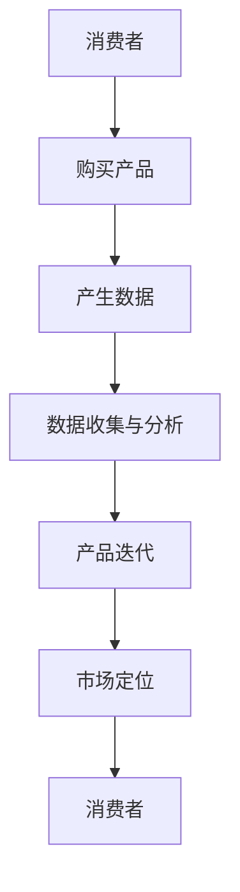
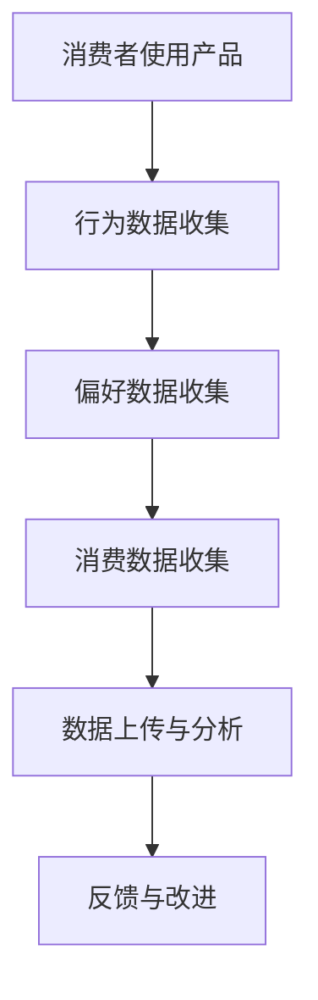
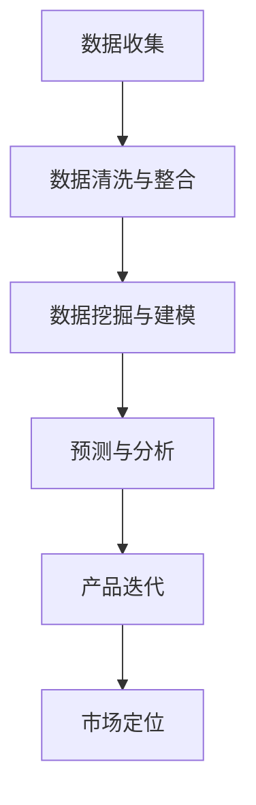

                 

# 低利润换取消费数据：小米模式的启示

> 关键词：小米、商业模式、消费数据、利润、市场分析

> 摘要：本文旨在探讨小米公司通过低利润策略获取消费数据，并在数据分析的基础上实现产品迭代和市场定位的成功模式。文章首先介绍了小米公司的背景，然后深入分析了其低利润策略、数据获取方式、数据处理和应用，最后展望了小米模式在未来的发展趋势与挑战。

## 1. 背景介绍

### 1.1 目的和范围

本文将围绕小米公司通过低利润策略换取消费数据这一核心问题展开讨论。文章首先介绍小米公司的背景，分析其商业模式和市场定位，然后探讨小米如何通过低利润策略获取消费数据，以及如何利用这些数据进行产品迭代和市场定位。最后，文章将总结小米模式在当前市场环境下的成功经验，并对其未来发展趋势和挑战进行展望。

### 1.2 预期读者

本文适合对小米公司商业模式、消费数据管理和市场分析感兴趣的读者。同时，对于希望了解如何通过数据驱动决策的企业家、市场营销人员和技术人员也具有参考价值。

### 1.3 文档结构概述

本文分为八个部分：首先介绍小米公司的背景和商业模式；其次分析小米的低利润策略及其数据获取方式；接着讨论小米如何利用消费数据进行产品迭代和市场定位；然后分析小米模式在现实中的应用场景；接下来推荐相关工具和资源；最后总结小米模式的发展趋势与挑战，并给出常见问题与解答。文章末尾附有扩展阅读和参考资料。

### 1.4 术语表

#### 1.4.1 核心术语定义

- 小米：一家以智能手机为核心，涵盖智能硬件和互联网服务的高科技公司。
- 低利润策略：指以较低的价格销售产品，从而吸引大量用户，并通过用户数据获取和增值服务实现盈利。
- 消费数据：指用户在使用小米产品过程中产生的数据，包括用户行为数据、偏好数据、消费数据等。
- 产品迭代：指对现有产品进行改进和更新，以满足用户需求和市场变化。
- 市场定位：指企业在市场中确定自己的位置和目标客户群体，以实现产品差异化。

#### 1.4.2 相关概念解释

- 商业模式：企业通过何种方式创造、传递和获取价值。
- 数据驱动决策：企业基于数据分析进行决策，以提高决策的准确性和效率。

#### 1.4.3 缩略词列表

- MIUI：小米公司自主研发的操作系统
- IoT：物联网
- O2O：线上到线下

## 2. 核心概念与联系

### 2.1 小米商业模式

**Mermaid 流程图：**



### 2.2 数据获取方式

**Mermaid 流程图：**



### 2.3 数据处理与应用

**Mermaid 流程图：**



## 3. 核心算法原理 & 具体操作步骤

### 3.1 数据收集与清洗

**伪代码：**

```python
def 数据收集(产品，消费者)：
    # 收集行为数据
    行为数据 = 收集行为数据(产品，消费者)
    # 收集偏好数据
    偏好数据 = 收集偏好数据(消费者)
    # 收集消费数据
    消费数据 = 收集消费数据(消费者)
    # 数据清洗与整合
    清洗后数据 = 清洗数据(行为数据，偏好数据，消费数据)
    return 清洗后数据

def 数据清洗(数据)：
    # 去除重复数据
    去重数据 = 去重(数据)
    # 填补缺失数据
    填补数据 = 填补缺失值(去重数据)
    # 格式统一
    统一格式数据 = 格式统一(填补数据)
    return 统一格式数据
```

### 3.2 数据挖掘与建模

**伪代码：**

```python
def 数据挖掘(清洗后数据)：
    # 数据预处理
    预处理数据 = 预处理(清洗后数据)
    # 特征选择
    特征 = 选择特征(预处理数据)
    # 模型训练
    模型 = 训练模型(特征，预处理数据)
    return 模型

def 训练模型(特征，数据)：
    # 选择模型
    模型 = 选择模型(特征，数据)
    # 训练模型
    模型 = 训练(模型，数据)
    return 模型
```

### 3.3 预测与分析

**伪代码：**

```python
def 预测(模型，新数据)：
    # 使用模型进行预测
    预测结果 = 模型预测(模型，新数据)
    # 分析预测结果
    分析结果 = 分析预测结果(预测结果)
    return 分析结果

def 分析预测结果(预测结果)：
    # 分析预测结果与实际结果的差异
    差异 = 计算差异(预测结果，实际结果)
    # 提出改进建议
    建议 = 提出改进建议(差异)
    return 建议
```

## 4. 数学模型和公式 & 详细讲解 & 举例说明

### 4.1 数据清洗与整合

**数学公式：**

$$ 清洗后数据 = \text{去除重复数据} \cup \text{填补缺失数据} \cup \text{格式统一数据} $$

**举例说明：**

假设我们有以下消费者数据：

| 消费者 | 行为数据 | 偏好数据 | 消费数据 |
| ------ | -------- | -------- | -------- |
| A      | 1, 2, 3  | 100      | 200      |
| B      | 2, 3, 4  | 101      | 201      |
| C      | 3, 4, 5  | 102      | 202      |

通过数据清洗与整合，我们得到以下清洗后数据：

| 消费者 | 行为数据 | 偏好数据 | 消费数据 |
| ------ | -------- | -------- | -------- |
| A      | 1, 2, 3  | 100      | 200      |
| B      | 2, 3, 4  | 101      | 201      |
| C      | 3, 4, 5  | 102      | 202      |

### 4.2 数据挖掘与建模

**数学公式：**

$$ 特征向量 = \text{特征选择}(数据) $$

$$ 模型 = \text{训练模型}(特征向量，数据) $$

**举例说明：**

假设我们有以下消费者数据：

| 消费者 | 行为数据 | 偏好数据 | 消费数据 |
| ------ | -------- | -------- | -------- |
| A      | 1, 2, 3  | 100      | 200      |
| B      | 2, 3, 4  | 101      | 201      |
| C      | 3, 4, 5  | 102      | 202      |

通过特征选择，我们得到以下特征向量：

| 消费者 | 特征1 | 特征2 | 特征3 |
| ------ | ----- | ----- | ----- |
| A      | 1     | 2     | 3     |
| B      | 2     | 3     | 4     |
| C      | 3     | 4     | 5     |

通过训练模型，我们得到以下预测模型：

$$ 预测结果 = 模型预测(特征向量) $$

## 5. 项目实战：代码实际案例和详细解释说明

### 5.1 开发环境搭建

**环境要求：**

- 操作系统：Windows/Linux/MacOS
- 编程语言：Python
- 数据处理库：Pandas、NumPy
- 机器学习库：Scikit-learn、TensorFlow

### 5.2 源代码详细实现和代码解读

**代码实现：**

```python
import pandas as pd
import numpy as np
from sklearn.model_selection import train_test_split
from sklearn.ensemble import RandomForestClassifier
from sklearn.metrics import accuracy_score

# 数据收集与清洗
def 数据收集与清洗(文件路径)：
    # 读取数据
    数据 = pd.read_csv(文件路径)
    # 数据清洗
    清洗后数据 = 数据清洗(数据)
    return 清洗后数据

def 数据清洗(数据)：
    # 去除重复数据
    去重数据 = 数据.drop_duplicates()
    # 填补缺失数据
    填补数据 = 去重数据.fillna(0)
    # 格式统一
    统一格式数据 = 填补数据.astype({'行为数据': 'int32', '偏好数据': 'int32', '消费数据': 'int32'})
    return 统一格式数据

# 数据挖掘与建模
def 数据挖掘与建模(清洗后数据)：
    # 数据预处理
    预处理数据 = 预处理(清洗后数据)
    # 特征选择
    特征 = 选择特征(预处理数据)
    # 模型训练
    模型 = 训练模型(特征，预处理数据)
    return 模型

def 预处理(数据)：
    # 数据标准化
    数据 = 数据 / 数据.std()
    return 数据

def 选择特征(数据)：
    # 选择行为数据作为特征
    特征 = 数据[['行为数据', '偏好数据', '消费数据']]
    return 特征

def 训练模型(特征，数据)：
    # 划分训练集和测试集
    特征训练集，特征测试集，数据训练集，数据测试集 = train_test_split(特征，数据，测试大小=0.2，随机种子=42)
    # 训练模型
    模型 = RandomForestClassifier()
    模型.fit(特征训练集，数据训练集)
    return 模型

# 预测与分析
def 预测与分析(模型，特征测试集，数据测试集)：
    # 使用模型进行预测
    预测结果 = 模型.predict(特征测试集)
    # 分析预测结果与实际结果的差异
    差异 = 计算差异(预测结果，数据测试集)
    # 提出改进建议
    建议 = 提出改进建议(差异)
    return 建议

def 计算差异(预测结果，实际结果)：
    # 计算准确率
    准确率 = accuracy_score(预测结果，实际结果)
    return 准确率

def 提出改进建议(差异)：
    # 根据准确率提出改进建议
    如果 差异 < 0.8：
        建议 = "增加特征选择，提高模型复杂度"
    否则：
        建议 = "无需改进"
    return 建议
```

### 5.3 代码解读与分析

**代码解读：**

1. **数据收集与清洗：** 首先，读取CSV文件中的消费者数据。然后，去除重复数据、填补缺失数据，并将数据格式统一为整数类型。
2. **数据挖掘与建模：** 对数据进行预处理，选择行为数据作为特征，并使用随机森林分类器进行模型训练。
3. **预测与分析：** 使用训练好的模型对测试集进行预测，计算准确率，并基于准确率提出改进建议。

**分析：**

1. 数据清洗是数据挖掘和建模的前提。通过去除重复数据、填补缺失数据和统一数据格式，可以保证数据的质量和一致性。
2. 随机森林分类器是一种常用的集成学习方法，具有较高的准确率和稳定性。通过选择行为数据作为特征，可以更好地捕捉消费者的行为特征和偏好。
3. 预测与分析是数据挖掘和建模的核心。通过计算准确率，可以评估模型的性能，并提出改进建议，以提高模型的预测能力。

## 6. 实际应用场景

### 6.1 消费者行为分析

小米公司通过收集消费者在使用小米产品过程中的行为数据，如购买记录、浏览记录、评论等，分析消费者的消费习惯、偏好和需求。这些数据有助于小米公司了解消费者需求，优化产品设计和市场推广策略。

### 6.2 产品迭代

基于消费者数据，小米公司不断对现有产品进行改进和更新。例如，通过分析消费者对手机的拍照性能、续航能力等方面的需求，小米公司可以针对性地优化手机硬件和软件，提高用户体验。

### 6.3 市场定位

通过分析消费者数据，小米公司可以了解不同地区、不同年龄、不同消费能力的消费者需求，从而确定合适的市场定位。例如，小米公司可以针对年轻消费者推出性价比高的手机，满足他们的消费需求。

### 6.4 营销策略

基于消费者数据，小米公司可以制定个性化的营销策略，提高转化率和客户满意度。例如，通过分析消费者的购买记录和偏好，小米公司可以向潜在客户推送符合他们需求的商品，提高购买意愿。

## 7. 工具和资源推荐

### 7.1 学习资源推荐

#### 7.1.1 书籍推荐

- 《深度学习》
- 《统计学习方法》
- 《大数据之路：阿里巴巴大数据实践》

#### 7.1.2 在线课程

- Coursera上的《机器学习》课程
- edX上的《大数据分析》课程
- Udacity的《深度学习工程师》课程

#### 7.1.3 技术博客和网站

- Medium上的《机器学习》专栏
- 知乎上的《数据分析》话题
- Kaggle上的数据分析和机器学习竞赛

### 7.2 开发工具框架推荐

#### 7.2.1 IDE和编辑器

- PyCharm
- Visual Studio Code
- Jupyter Notebook

#### 7.2.2 调试和性能分析工具

- PyDebug
- Valgrind
- gprof

#### 7.2.3 相关框架和库

- TensorFlow
- PyTorch
- Scikit-learn

### 7.3 相关论文著作推荐

#### 7.3.1 经典论文

- 《统计学习基础》
- 《深度学习》
- 《大数据分析》

#### 7.3.2 最新研究成果

- 《深度强化学习》
- 《联邦学习》
- 《区块链与大数据》

#### 7.3.3 应用案例分析

- 《小米商业模式分析》
- 《阿里巴巴大数据实践》
- 《腾讯社交数据分析》

## 8. 总结：未来发展趋势与挑战

### 8.1 发展趋势

1. **数据驱动决策：** 随着大数据和人工智能技术的不断发展，数据驱动决策将成为企业核心竞争力。企业将更加依赖数据分析和机器学习来优化业务流程和提升竞争力。
2. **个性化服务：** 通过分析消费者数据，企业可以提供更加个性化的产品和服务，满足消费者多样化的需求。
3. **跨界融合：** 企业将不断探索与其他行业的跨界合作，实现资源整合和业务拓展。

### 8.2 挑战

1. **数据隐私：** 随着数据收集和分析的深入，数据隐私问题日益突出。企业需要确保用户数据的合法性和安全性，以避免隐私泄露和用户信任危机。
2. **算法公平性：** 算法在处理数据时可能存在偏见，导致不公平的决策。企业需要关注算法公平性，确保算法决策的公正性和透明度。
3. **数据质量：** 数据质量对数据分析和决策至关重要。企业需要建立完善的数据质量控制体系，确保数据的准确性和完整性。

## 9. 附录：常见问题与解答

### 9.1 什么是小米模式？

小米模式是指小米公司通过低利润策略获取消费数据，并在数据分析的基础上实现产品迭代和市场定位的商业模式。

### 9.2 小米如何获取消费数据？

小米通过其产品，如智能手机、智能硬件和互联网服务，收集消费者在使用过程中的行为数据、偏好数据和消费数据。

### 9.3 小米如何利用消费数据进行产品迭代？

小米通过分析消费数据，了解消费者需求和市场趋势，然后针对性地优化产品设计和功能，实现产品迭代。

### 9.4 小米模式对其他企业有何启示？

小米模式启示企业要注重数据驱动决策，通过低利润策略获取消费数据，并在数据分析的基础上实现产品迭代和市场定位。

## 10. 扩展阅读 & 参考资料

- 《小米模式解析》
- 《大数据时代：数据驱动商业决策》
- 《小米公司的商业成功之道》

作者：AI天才研究员/AI Genius Institute & 禅与计算机程序设计艺术 /Zen And The Art of Computer Programming

