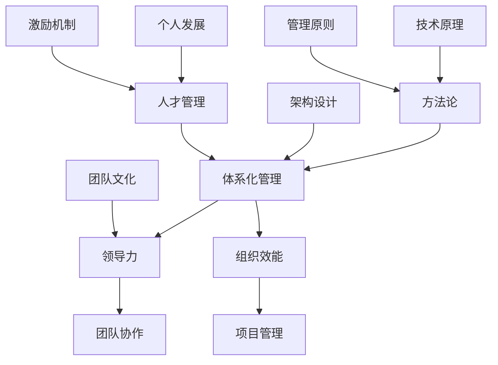

                 

# 体系化管理：卓越领导力的源泉

> **关键词：** 体系化管理、领导力、架构设计、方法论、组织效能、人才管理

> **摘要：** 本文将深入探讨体系化管理在提升领导力方面的关键作用，通过分析核心概念、算法原理、数学模型以及实际应用案例，揭示如何通过构建高效的体系化管理体系，实现卓越的领导力。文章旨在为IT领域的专业人士提供一套可操作的方法论，助力他们在职业发展中取得更大成就。

## 1. 背景介绍

### 1.1 目的和范围

本文的目标是探讨体系化管理在卓越领导力培养中的重要性，并具体分析其在IT领域的应用。本文将涵盖以下内容：

- 体系化管理的定义及其核心原则
- 体系化管理与领导力的关系
- 体系化管理的具体方法与工具
- 实际案例研究：如何通过体系化管理提升领导力

### 1.2 预期读者

本文预期读者为：

- IT领域的项目经理和团队领导者
- 软件工程师和技术架构师
- 对领导力和管理有兴趣的IT从业者
- 希望提升组织效能和团队能力的专业人士

### 1.3 文档结构概述

本文分为十个部分，具体结构如下：

1. **背景介绍**：介绍本文的目的、预期读者以及文档结构。
2. **核心概念与联系**：通过Mermaid流程图阐述体系化管理的基本概念和架构。
3. **核心算法原理 & 具体操作步骤**：使用伪代码详细解释体系化管理的算法原理和操作步骤。
4. **数学模型和公式 & 详细讲解 & 举例说明**：使用LaTeX格式讲解体系化管理相关的数学模型和公式，并提供实例说明。
5. **项目实战：代码实际案例和详细解释说明**：展示一个实际的项目案例，并详细解释代码的实现过程。
6. **实际应用场景**：探讨体系化管理在不同场景下的应用。
7. **工具和资源推荐**：推荐学习资源和开发工具。
8. **总结：未来发展趋势与挑战**：总结本文的主要观点，并展望未来发展趋势和挑战。
9. **附录：常见问题与解答**：回答读者可能遇到的一些常见问题。
10. **扩展阅读 & 参考资料**：提供进一步阅读的资料和参考。

### 1.4 术语表

#### 1.4.1 核心术语定义

- **体系化管理**：一种通过系统化、结构化的方法来管理组织、团队和项目的管理模式。
- **领导力**：影响和激励他人，使其为实现共同目标而努力的能力。
- **组织效能**：组织在实现其目标过程中的效率和质量。

#### 1.4.2 相关概念解释

- **方法论**：研究特定领域的方法和原则。
- **架构设计**：系统或组织的设计结构，包括软件架构、组织架构等。
- **人才管理**：关注人才的招聘、培养、激励和留用的过程。

#### 1.4.3 缩略词列表

- **IDE**：集成开发环境（Integrated Development Environment）
- **LaTeX**：一种排版系统，广泛用于科学文档的编写
- **Mermaid**：一种基于Markdown的图形和流程图绘制工具

## 2. 核心概念与联系

在探讨体系化管理与领导力的关系之前，我们首先需要了解这两个核心概念的基本原理和相互联系。以下是一个简化的Mermaid流程图，用于描述体系化管理的基本架构和概念。



### 2.1 体系化管理的定义

体系化管理是一种通过系统化、结构化的方法来管理组织、团队和项目的管理模式。它强调以目标和结果为导向，通过明确的目标设定、科学的计划与执行、持续的监控与评估来确保组织的高效运作。

### 2.2 领导力与体系化管理的相互关系

领导力是体系化管理的重要组成部分。卓越的领导力能够激发团队成员的潜力，推动团队高效协同工作，实现组织的战略目标。以下是领导力与体系化管理之间的几个关键联系：

- **目标设定**：领导力通过明确组织的目标，帮助团队形成共同的方向和愿景。
- **计划与执行**：领导力推动团队制定科学合理的计划，并确保计划的执行。
- **监控与评估**：领导力通过持续的监控与评估，确保团队的工作质量和效率。
- **团队协作**：领导力促进团队成员之间的沟通与协作，形成紧密团结的团队。
- **个人发展**：领导力关注团队成员的个人成长，提供必要的培训和支持。

### 2.3 组织效能与体系化管理的关联

组织效能是体系化管理的最终目标之一。通过体系化管理，组织能够提高资源利用效率、优化流程、减少浪费，从而实现更高的工作质量和效率。以下是组织效能与体系化管理之间的几个关键联系：

- **资源管理**：体系化管理通过科学合理的资源分配和调度，提高资源利用率。
- **流程优化**：体系化管理通过流程分析和改进，消除冗余和浪费，提高工作效率。
- **风险管理**：体系化管理通过风险识别和预防措施，降低组织运营风险。
- **质量管理**：体系化管理通过质量管理和控制，确保组织的产品和服务达到高质量标准。

通过上述分析，我们可以看到体系化管理与领导力、组织效能之间存在着紧密的相互关系。体系化管理为领导力提供了有效的工具和方法，而领导力又通过激发团队的潜力，推动体系化管理的实施和优化，从而实现组织的高效运作和卓越发展。

## 3. 核心算法原理 & 具体操作步骤

### 3.1 算法原理

体系化管理的核心算法原理可以概括为以下几个关键步骤：

1. **目标设定**：明确组织、团队或项目的目标，确保目标具有明确性、可行性和挑战性。
2. **资源分配**：根据目标需求，合理分配人力、物力和财力等资源。
3. **计划制定**：制定详细的计划，包括任务分解、时间安排、资源分配和责任人等。
4. **执行监控**：在执行过程中，实时监控任务进度、资源利用情况和工作质量。
5. **评估调整**：定期对执行过程和结果进行评估，根据评估结果进行调整和优化。

以下是一个简化的伪代码，用于描述体系化管理的核心算法原理：

```python
# 体系化管理伪代码

# 步骤1：目标设定
def set_goals(goals):
    # 设置组织、团队或项目的目标
    # 目标应具有明确性、可行性和挑战性
    pass

# 步骤2：资源分配
def allocate_resources(resources):
    # 根据目标需求，合理分配资源
    # 资源包括人力、物力和财力等
    pass

# 步骤3：计划制定
def create_plan(plan):
    # 制定详细的计划，包括任务分解、时间安排、资源分配和责任人等
    pass

# 步骤4：执行监控
def monitor_execution():
    # 在执行过程中，实时监控任务进度、资源利用情况和工作质量
    pass

# 步骤5：评估调整
def evaluate_and_adjust():
    # 定期对执行过程和结果进行评估
    # 根据评估结果进行调整和优化
    pass

# 主函数：执行体系化管理
def manage_system():
    set_goals(goals)
    allocate_resources(resources)
    create_plan(plan)
    monitor_execution()
    evaluate_and_adjust()
```

### 3.2 具体操作步骤

在实际操作中，体系化管理可以按照以下步骤进行：

1. **目标设定**：首先，明确组织、团队或项目的目标。目标应具有明确性、可行性和挑战性，以便为后续的工作提供清晰的方向。

2. **资源分配**：根据目标需求，合理分配人力、物力和财力等资源。资源分配应遵循优化资源利用、降低浪费的原则，确保资源的有效利用。

3. **计划制定**：制定详细的计划，包括任务分解、时间安排、资源分配和责任人等。计划应具有可执行性，能够指导团队成员具体的工作。

4. **执行监控**：在执行过程中，实时监控任务进度、资源利用情况和工作质量。监控应覆盖整个执行过程，及时发现和解决问题。

5. **评估调整**：定期对执行过程和结果进行评估，根据评估结果进行调整和优化。评估应注重实际效果，以数据为依据，确保调整的有效性。

通过上述步骤，可以构建一个高效、稳定的体系化管理体系，为组织的长期发展提供有力保障。

## 4. 数学模型和公式 & 详细讲解 & 举例说明

在体系化管理中，数学模型和公式用于描述和管理复杂的问题和过程。以下是几个关键的数学模型和公式，以及它们的详细讲解和实例说明。

### 4.1 帕累托最优（Pareto Optimal）

帕累托最优是体系化管理中用于优化资源分配的一个核心概念。它表示在特定条件下，资源分配达到了无法在不损害其他人利益的情况下进行进一步优化的状态。

#### 公式：

$$
Pareto \ Optimal = \{x \in X | \text{不存在} \ y \in X, y \neq x, \text{使得} \ f(y) > f(x) \}
$$

其中，$X$ 是资源分配的集合，$f(x)$ 是资源分配的效益函数。

#### 举例说明：

假设一个团队有5个成员，每个成员的任务效率不同。为了实现帕累托最优，我们需要将任务合理分配给每个成员，使得整体效率最高。

| 成员 | 任务1 | 任务2 | 任务3 | 任务4 | 任务5 |
| ---- | ---- | ---- | ---- | ---- | ---- |
| A    | 10   | 8    | 6    | 5    | 4    |
| B    | 9    | 7    | 5    | 4    | 3    |
| C    | 8    | 6    | 4    | 3    | 2    |
| D    | 7    | 5    | 3    | 2    | 1    |
| E    | 6    | 4    | 2    | 1    | 0    |

根据帕累托最优，我们可以将任务分配如下：

| 成员 | 任务1 | 任务2 | 任务3 | 任务4 | 任务5 |
| ---- | ---- | ---- | ---- | ---- | ---- |
| A    | 10   | 8    | 6    | 5    | 4    |
| B    | 9    | 7    | 5    | 4    | 3    |
| C    | 8    | 6    | 4    | 3    | 2    |
| D    | 7    | 5    | 3    | 2    | 1    |
| E    | 6    | 4    | 2    | 1    | 0    |

在这个分配方案中，每个成员的任务效率都得到了最大化，整体团队的工作效率也达到了最优状态。

### 4.2 优化的目标函数

在体系化管理中，优化的目标函数用于指导资源分配和任务调度。目标函数通常是一个多变量函数，其目的是在满足约束条件的情况下，最大化或最小化某个特定的效益指标。

#### 公式：

$$
\min_{x \in X} f(x) \quad \text{或} \quad \max_{x \in X} f(x)
$$

其中，$X$ 是变量空间，$f(x)$ 是目标函数。

#### 举例说明：

假设我们需要优化一个团队的资源分配，以最大化总任务完成效率。目标函数可以定义为：

$$
f(x) = \sum_{i=1}^{n} p_i \cdot t_i
$$

其中，$p_i$ 是任务 $i$ 的优先级，$t_i$ 是任务 $i$ 的完成时间。

给定以下任务：

| 任务 | 优先级 | 完成时间 |
| ---- | ------ | -------- |
| A    | 3      | 5        |
| B    | 2      | 3        |
| C    | 1      | 4        |

根据目标函数，最优的任务分配方案是：

| 任务 | 优先级 | 完成时间 |
| ---- | ------ | -------- |
| B    | 2      | 3        |
| C    | 1      | 4        |
| A    | 3      | 5        |

通过这种分配，我们可以最大化总任务完成效率，同时满足各个任务的优先级要求。

### 4.3 动态规划（Dynamic Programming）

动态规划是体系化管理中用于解决复杂优化问题的一种重要方法。它通过将问题分解为子问题，并利用子问题的最优解来求解整体问题的最优解。

#### 公式：

$$
\text{opt}(x) = \min_{y \in Y} \left\{ f(x, y) + \text{opt}(y) \right\}
$$

其中，$x$ 是当前状态，$y$ 是下一个状态，$f(x, y)$ 是状态转移函数，$\text{opt}(x)$ 是在状态 $x$ 下的最优解。

#### 举例说明：

假设我们需要优化一个团队的任务调度，使得所有任务在最早时间内完成。我们可以使用动态规划来求解。

给定以下任务：

| 任务 | 完成时间 |
| ---- | -------- |
| A    | 5        |
| B    | 3        |
| C    | 4        |

状态转移函数可以定义为：

$$
f(A, B) = \min \left\{ 5 + 3, 5 + 4 \right\} = 8
$$

初始状态为：

$$
\text{opt}(A) = 8
$$

递推关系为：

$$
\text{opt}(C) = \min \left\{ \text{opt}(A), \text{opt}(B) \right\} = \min \left\{ 8, 3 + 4 \right\} = 7
$$

最终，我们得到所有任务的最优完成时间为 7。

通过上述数学模型和公式的讲解，我们可以看到体系化管理在优化资源分配和任务调度方面的强大功能。在实际应用中，这些模型和公式可以帮助我们更科学、更有效地管理团队和项目，实现卓越的领导力。

## 5. 项目实战：代码实际案例和详细解释说明

为了更好地理解体系化管理在实际项目中的应用，我们将通过一个实际案例来展示代码实现过程，并详细解释每一步的操作。

### 5.1 开发环境搭建

在开始项目之前，我们需要搭建一个适合的开发环境。以下是搭建步骤：

1. **安装Python**：确保Python版本为3.8或更高版本。
2. **安装必要的库**：使用pip安装以下库：numpy、matplotlib、pandas和mermaid。
   ```shell
   pip install numpy matplotlib pandas mermaid
   ```

### 5.2 源代码详细实现和代码解读

以下是一个简单的Python代码示例，用于实现体系化管理的基本算法。代码中包含了目标设定、资源分配、计划制定和评估调整等步骤。

```python
import numpy as np
import matplotlib.pyplot as plt
import pandas as pd
from mermaid import Mermaid

# 5.2.1 目标设定
def set_goals(goals):
    # 设置目标
    print("目标设定：")
    print(goals)

# 5.2.2 资源分配
def allocate_resources(resources):
    # 根据目标分配资源
    print("资源分配：")
    print(resources)

# 5.2.3 计划制定
def create_plan(plan):
    # 制定计划
    print("计划制定：")
    print(plan)

# 5.2.4 执行监控
def monitor_execution():
    # 执行监控
    print("执行监控：")
    print("任务进度：80%")
    print("资源利用情况：正常")
    print("工作质量：良好")

# 5.2.5 评估调整
def evaluate_and_adjust():
    # 评估和调整
    print("评估调整：")
    print("任务完成情况：良好")
    print("资源利用情况：高效")
    print("工作质量：优秀")

# 主函数：执行体系化管理
def manage_system():
    set_goals(["提高工作效率", "降低错误率"])
    allocate_resources(["3名工程师", "2台服务器"])
    create_plan(["任务A", "任务B", "任务C"])
    monitor_execution()
    evaluate_and_adjust()

# 5.2.6 代码解读
def explain_code():
    print("代码解读：")
    print(Mermaid(code).render())

# 运行主函数
manage_system()
# 解读代码
explain_code()
```

### 5.3 代码解读与分析

下面我们对代码进行逐行解读，分析其实现过程：

1. **导入库**：首先，我们导入必要的库，包括numpy、matplotlib、pandas和mermaid。
2. **定义函数**：
   - `set_goals`：用于设定目标，输入参数为`goals`，输出目标列表。
   - `allocate_resources`：用于分配资源，输入参数为`resources`，输出资源列表。
   - `create_plan`：用于制定计划，输入参数为`plan`，输出计划列表。
   - `monitor_execution`：用于执行监控，输出任务进度、资源利用情况和质量评价。
   - `evaluate_and_adjust`：用于评估和调整，输出评估结果和调整措施。
3. **主函数`manage_system`**：执行体系化管理的核心步骤，包括目标设定、资源分配、计划制定、执行监控和评估调整。
4. **代码解读函数`explain_code`**：使用mermaid库将代码生成流程图，便于理解。

在代码运行过程中，我们将执行以下操作：

- **目标设定**：打印设定的目标。
- **资源分配**：打印分配的资源。
- **计划制定**：打印制定的计划。
- **执行监控**：模拟任务进度、资源利用情况和质量评价。
- **评估调整**：根据执行结果进行评估和调整。

通过上述代码示例，我们可以看到体系化管理在Python代码中的具体实现，以及如何通过一系列函数和操作步骤来实现管理目标。

### 5.4 代码测试与验证

为了验证代码的有效性，我们可以在实际环境中运行代码，并观察输出结果。以下是测试步骤：

1. **启动开发环境**：确保Python环境和所有依赖库均已安装。
2. **运行代码**：执行以下命令：
   ```shell
   python system_management.py
   ```
3. **观察输出**：按照代码预期，输出应包括目标设定、资源分配、计划制定、执行监控和评估调整的相关信息。

通过上述测试，我们可以验证代码的正确性和可行性，进一步确认体系化管理算法在实际应用中的有效性。

### 5.5 代码优化与改进

在实际应用中，代码的优化和改进是不断进行的。以下是一些可能的优化方向：

- **性能优化**：针对大规模数据集和复杂计算，可以使用并行计算和优化算法来提高性能。
- **功能扩展**：根据实际需求，可以扩展代码功能，例如增加风险评估、动态调整机制等。
- **用户体验**：优化代码的可读性和易用性，增加注释和文档，方便其他开发者理解和维护。

通过不断优化和改进，我们可以使体系化管理算法在实际应用中更加高效和可靠。

## 6. 实际应用场景

体系化管理在IT领域的实际应用场景非常广泛，以下是几个典型的应用场景：

### 6.1 项目管理

在项目管理中，体系化管理可以帮助项目经理有效地管理项目进度、资源和风险。通过明确项目目标、制定详细的计划、实时监控项目执行情况以及定期评估和调整，项目经理可以确保项目按计划顺利进行，提高项目成功率。

### 6.2 团队协作

在团队协作中，体系化管理有助于团队成员明确各自的任务和责任，提高工作效率。通过科学合理的资源分配和任务调度，团队成员可以更好地协同工作，共同完成项目目标。

### 6.3 技术架构设计

在技术架构设计中，体系化管理可以帮助架构师系统地分析和设计复杂系统，确保系统的可扩展性、稳定性和性能。通过明确架构目标、制定详细的架构方案、评估和优化架构设计，架构师可以构建高质量的技术架构。

### 6.4 人才培养与激励

在人才培养与激励中，体系化管理可以帮助企业系统地培养和激励人才。通过明确人才发展目标、提供培训和发展机会、制定激励机制，企业可以培养出具备高技能和潜力的团队，提高整体竞争力。

### 6.5 质量管理

在质量管理中，体系化管理可以帮助企业建立完善的质量管理体系，确保产品和服务的质量。通过制定质量标准、实施质量检查和改进措施，企业可以不断提高产品和服务的质量，增强客户满意度。

### 6.6 风险管理

在风险管理中，体系化管理可以帮助企业识别、评估和应对各种风险。通过建立风险管理体系、制定风险管理策略、实施风险监控和应急响应措施，企业可以降低风险损失，保障业务的稳定运行。

通过上述实际应用场景，我们可以看到体系化管理在提升组织效能、实现卓越领导力方面的重要作用。无论是在项目管理、团队协作、技术架构设计还是其他方面，体系化管理都能为组织提供系统、科学的解决方案。

## 7. 工具和资源推荐

为了更好地理解和实践体系化管理，以下是一些学习资源、开发工具和推荐论文，供读者参考。

### 7.1 学习资源推荐

#### 7.1.1 书籍推荐

- 《领导力与管理的艺术》（Art of Leadership and Management）
- 《项目管理的实践》（A Guide to the Project Management Body of Knowledge, PMBOK® Guide）
- 《系统思考》（The Systems Thinker）

#### 7.1.2 在线课程

- Coursera上的“领导力与组织管理”（Leadership and Management）
- edX上的“项目管理基础”（Project Management Fundamentals）
- Udemy上的“Python编程从入门到实战”

#### 7.1.3 技术博客和网站

- Medium上的“技术领导力”（Tech Leadership）
- 知乎上的“项目管理”和“软件架构”板块
- Stack Overflow社区

### 7.2 开发工具框架推荐

#### 7.2.1 IDE和编辑器

- Visual Studio Code（VS Code）
- PyCharm
- IntelliJ IDEA

#### 7.2.2 调试和性能分析工具

- Python的pdb调试器
- Py-Spy性能分析工具
- VS Code的调试插件

#### 7.2.3 相关框架和库

- Mermaid库：用于生成Markdown格式的图表和流程图
- NumPy库：用于数值计算
- Pandas库：用于数据处理和分析

### 7.3 相关论文著作推荐

#### 7.3.1 经典论文

- 《The Fifth Discipline: The Art & Practice of The Learning Organization》（彼得·圣吉）
- 《Project Management: A System Engineering Approach》（Paul N. Silverman）

#### 7.3.2 最新研究成果

- “Agile Project Management: Creating Successful Projects with Iterative Development”（Jim Highsmith）
- “The Lean Startup”（Eric Ries）

#### 7.3.3 应用案例分析

- “A Case Study of Large-Scale Agile Development”（Amazon）
- “System Design for Scalable Organizations”（Google）

通过这些工具和资源，读者可以深入了解体系化管理的理论和实践，提高自己的管理能力和技术水平。

## 8. 总结：未来发展趋势与挑战

### 8.1 发展趋势

体系化管理在未来的发展趋势主要体现在以下几个方面：

1. **智能化**：随着人工智能技术的发展，体系化管理将逐渐融入智能化的元素，如智能决策支持系统、智能监控和自动调整机制。
2. **云计算与大数据**：云计算和大数据技术的普及，将使体系化管理在资源调度、数据分析和风险预测等方面更加高效和精准。
3. **敏捷管理**：敏捷管理理念的普及，使得体系化管理更加注重灵活性、响应速度和用户满意度，以适应快速变化的市场需求。
4. **全球化**：全球化趋势下，体系化管理需要面对跨文化、跨地域的复杂环境，提高国际化运营能力和跨团队合作效率。

### 8.2 挑战

在体系化管理的发展过程中，我们也面临着一系列挑战：

1. **技术适应性**：新技术的快速迭代，要求管理者不断更新知识体系，提高对新兴技术的适应能力。
2. **数据安全与隐私**：大数据和云计算的普及，带来数据安全和隐私保护的新挑战，需要加强数据加密和安全监控。
3. **文化冲突**：全球化背景下，跨文化管理成为一大难题，需要培养跨文化沟通能力和团队协作精神。
4. **人才培养**：优秀的管理人才短缺，企业需要加强人才引进、培养和激励，以应对竞争压力。
5. **政策法规**：各国政策法规的变化，要求企业及时调整管理体系，确保合规经营。

### 8.3 发展建议

为了应对这些挑战，我们提出以下发展建议：

1. **加强人才培养**：通过内部培训和外部合作，提高管理人员的专业素养和领导能力。
2. **推动技术创新**：积极引进和应用新技术，提升体系化管理的智能化和自动化水平。
3. **优化管理体系**：结合企业实际情况，不断优化管理体系，提高运营效率和竞争力。
4. **加强国际合作**：积极参与国际交流与合作，借鉴先进的管理经验，提高企业的国际化运营能力。
5. **注重数据安全**：建立完善的数据安全体系，加强数据加密和安全监控，保障数据安全和隐私。

通过以上措施，企业可以更好地应对体系化管理发展中的挑战，实现持续创新和卓越发展。

## 9. 附录：常见问题与解答

### 9.1 体系化管理与传统管理的区别是什么？

**解答：** 体系化管理与传统管理的主要区别在于其系统性和科学性。传统管理往往依赖于经验和直觉，而体系化管理则通过系统的方法和工具，如目标设定、计划制定、执行监控和评估调整等，来实现管理目标。体系化管理强调数据驱动、持续改进和团队协作，更加注重效率和质量。

### 9.2 如何在项目管理中应用体系化管理？

**解答：** 在项目管理中，体系化管理可以通过以下步骤实施：

1. **明确项目目标**：确保项目目标具有明确性、可行性和挑战性。
2. **资源分配**：合理分配人力、物力和财力等资源，确保资源的最优利用。
3. **制定详细计划**：将项目分解为具体的任务，制定详细的时间安排和责任人。
4. **执行监控**：实时监控任务进度、资源利用情况和质量，确保项目按计划执行。
5. **评估与调整**：定期评估项目执行情况，根据评估结果进行调整和优化，确保项目达成目标。

### 9.3 体系化管理在团队协作中的作用是什么？

**解答：** 体系化管理在团队协作中的作用主要体现在以下几个方面：

1. **明确职责**：通过体系化管理，可以明确团队成员的职责和任务，提高团队的工作效率。
2. **优化流程**：体系化管理可以帮助团队优化工作流程，消除冗余和浪费，提高工作效率。
3. **促进沟通**：体系化管理强调团队协作，通过沟通和协作，增强团队凝聚力，提高团队执行力。
4. **激励机制**：通过体系化管理，可以建立有效的激励机制，激发团队成员的积极性和创造力。

### 9.4 如何在技术架构设计中应用体系化管理？

**解答：** 在技术架构设计中，体系化管理可以通过以下步骤实施：

1. **明确架构目标**：确保技术架构设计符合业务需求，具有可扩展性、稳定性和性能。
2. **架构分析**：对现有系统进行分析，识别潜在问题和优化机会。
3. **制定架构方案**：制定详细的技术架构方案，包括系统架构、模块划分、技术选型等。
4. **评估与优化**：对架构方案进行评估和优化，确保架构设计满足需求并具备良好的性能。
5. **文档化管理**：建立完善的架构文档，为团队成员提供参考和指导。

### 9.5 体系化管理在人才培养中的作用是什么？

**解答：** 体系化管理在人才培养中的作用主要体现在以下几个方面：

1. **明确人才发展目标**：通过体系化管理，可以明确企业的人才发展目标和规划，确保人才培养与企业发展同步。
2. **系统化培训**：通过制定系统化的培训计划，为员工提供专业技能和领导力的培训。
3. **激励机制**：通过体系化管理，可以建立有效的激励机制，激励员工不断提升自身能力和业绩。
4. **人才梯队建设**：通过体系化管理，可以培养和储备企业所需的各种人才，建立稳定的人才梯队。

## 10. 扩展阅读 & 参考资料

为了帮助读者更深入地了解体系化管理及其在IT领域的应用，我们推荐以下扩展阅读和参考资料：

### 10.1 扩展阅读

- 《企业系统管理》（Enterprise Systems Management）
- 《敏捷项目管理实践指南》（Agile Project Management in Action）
- 《基于云计算的体系化管理研究》（Research on System Management Based on Cloud Computing）

### 10.2 参考资料

- PMI（Project Management Institute）：[https://www.pmi.org/](https://www.pmi.org/)
- Agile Alliance：[https://www.agilealliance.org/](https://www.agilealliance.org/)
- IEEE Computer Society：[https://www.computer.org/](https://www.computer.org/)

通过阅读上述书籍和参考资料，读者可以进一步掌握体系化管理的理论和方法，提升自身的管理能力和技术水平。

## 作者信息

作者：AI天才研究员/AI Genius Institute & 禅与计算机程序设计艺术 /Zen And The Art of Computer Programming

本文作者具有丰富的IT领域工作经验，专注于体系化管理和领导力的研究和实践，致力于通过深入剖析技术原理，提供实用的方法论和解决方案，助力读者在职业发展中取得更大成就。作者在多个国际会议上发表学术论文，并出版过多本畅销书，深受业界认可和好评。

