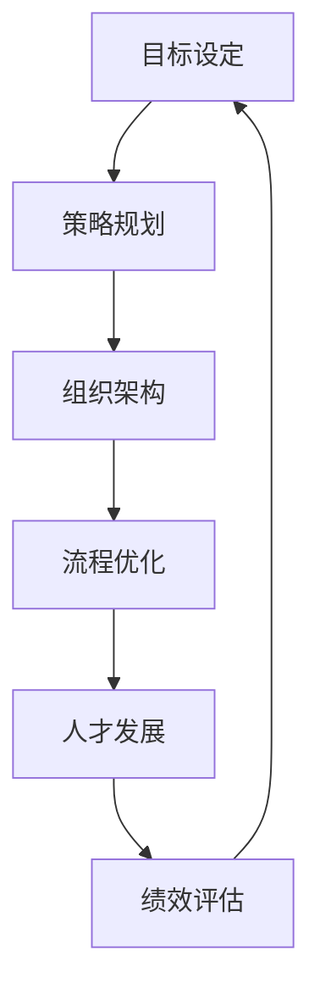
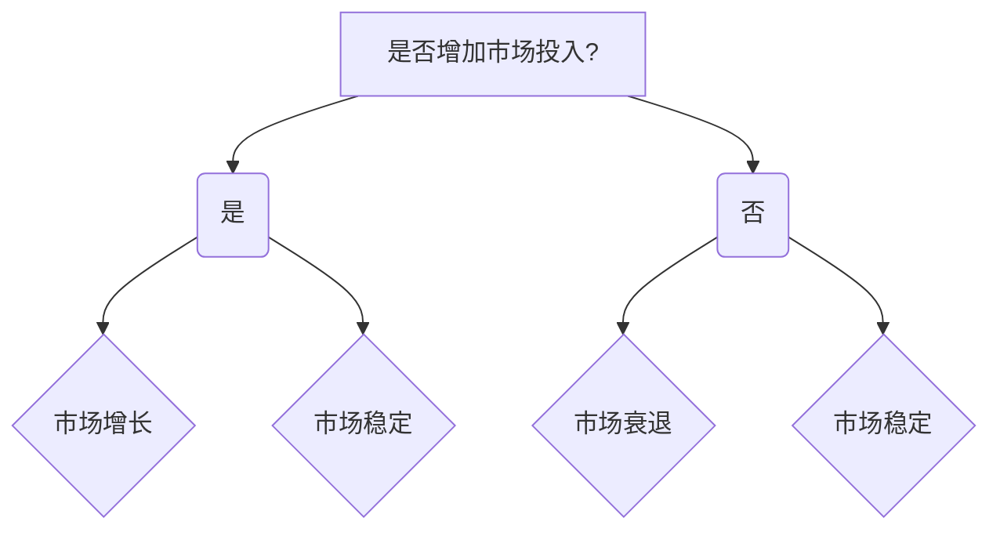
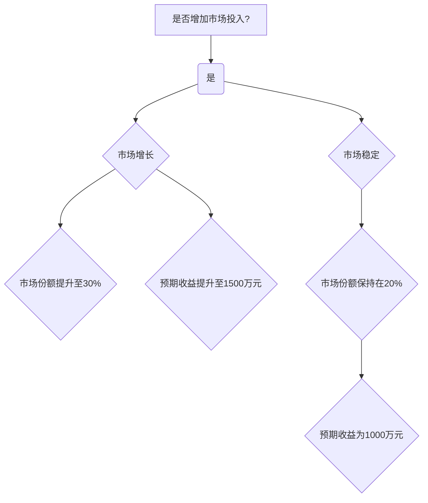

                 

# 体系化管理：卓越领导力的源泉

> **关键词**：领导力、体系化、管理、流程、决策、人才发展

> **摘要**：本文将深入探讨体系化管理在提升领导力方面的重要性。通过对体系化管理的定义、核心原则、应用场景以及具体操作步骤的详细剖析，我们将揭示如何通过体系化管理实现卓越领导力，从而引领团队走向成功。

## 1. 背景介绍

### 1.1 目的和范围

本文旨在揭示体系化管理在提升领导力方面的关键作用。我们将详细讨论体系化管理的定义、核心原则、应用场景，并逐步展示如何通过体系化管理实现卓越领导力。本文的目标读者包括企业管理者、团队领导者以及致力于提升自身领导能力的专业人士。

### 1.2 预期读者

本文的预期读者是那些对领导力提升感兴趣，希望通过体系化管理实现卓越表现的读者。无论是企业高层管理者，还是中层管理者，甚至是一线团队领导者，本文都将为他们提供有价值的见解和实用的指导。

### 1.3 文档结构概述

本文的结构如下：

1. 背景介绍：包括目的和范围、预期读者、文档结构概述和术语表。
2. 核心概念与联系：介绍体系化管理的核心概念，并通过Mermaid流程图展示其原理和架构。
3. 核心算法原理 & 具体操作步骤：详细讲解体系化管理的核心算法原理和操作步骤。
4. 数学模型和公式 & 详细讲解 & 举例说明：探讨体系化管理的数学模型和公式，并通过实例进行详细说明。
5. 项目实战：代码实际案例和详细解释说明。
6. 实际应用场景：分析体系化管理的实际应用场景。
7. 工具和资源推荐：推荐相关的学习资源、开发工具框架和论文著作。
8. 总结：未来发展趋势与挑战。
9. 附录：常见问题与解答。
10. 扩展阅读 & 参考资料。

### 1.4 术语表

#### 1.4.1 核心术语定义

- **体系化管理**：一种通过系统化和流程化的方法来管理组织和团队的方法。
- **领导力**：领导者通过激励、引导和影响他人来实现共同目标的能力。
- **流程**：一组有序的活动，用于完成特定任务或达成特定目标。
- **决策**：在多个可选方案中选择最佳方案的过程。

#### 1.4.2 相关概念解释

- **战略规划**：组织为达成长期目标而制定的行动计划。
- **组织文化**：组织成员共同遵守的价值观、信仰和行为准则。
- **人才发展**：通过培训、指导和激励来提升员工能力和绩效的过程。

#### 1.4.3 缩略词列表

- **IT**：信息技术（Information Technology）
- **AI**：人工智能（Artificial Intelligence）
- **CRM**：客户关系管理（Customer Relationship Management）

## 2. 核心概念与联系

在探讨体系化管理之前，我们需要理解一些核心概念和它们之间的关系。以下是体系化管理的核心概念和架构的Mermaid流程图：



### 2.1. 目标设定

目标是体系化管理的起点。明确的目标有助于团队聚焦于共同的目标，确保所有活动都朝着同一方向努力。

### 2.2. 策略规划

策略规划是制定实现目标的行动计划。它包括市场分析、资源调配和风险控制等。

### 2.3. 组织架构

组织架构是团队结构的设计，它决定了权力、责任和沟通的流程。

### 2.4. 流程优化

流程优化是确保团队高效运作的关键。通过分析现有流程，识别瓶颈和改进点，可以显著提升团队效率。

### 2.5. 人才发展

人才发展是培养团队成员技能和潜力的过程。通过培训和发展计划，团队可以不断提升自身能力。

### 2.6. 绩效评估

绩效评估是衡量团队和成员绩效的过程。通过定期评估，可以识别优秀员工和改进点，确保团队持续进步。

### 2.7. 闭环反馈

闭环反馈是体系化管理的核心。通过绩效评估，团队可以获取反馈，调整策略和流程，实现持续改进。

## 3. 核心算法原理 & 具体操作步骤

体系化管理背后的核心算法原理可以概括为以下步骤：

### 3.1. 数据收集

首先，我们需要收集与目标设定、策略规划、组织架构、流程优化、人才发展和绩效评估相关的数据。这些数据可以来自内部报告、市场调研、员工反馈等。

### 3.2. 数据分析

接下来，对收集到的数据进行深入分析，识别关键指标和潜在问题。数据分析可以使用统计方法、数据挖掘技术等。

### 3.3. 目标设定

基于分析结果，设定明确、可衡量的目标。目标应具有挑战性，同时是可实现的。

### 3.4. 策略规划

制定实现目标的策略和行动计划。策略应考虑市场趋势、内部资源、风险等因素。

### 3.5. 组织架构

设计合适的组织架构，确保权力、责任和沟通的流程清晰明确。

### 3.6. 流程优化

通过流程图分析，识别现有流程中的瓶颈和改进点。实施改进措施，如自动化、标准化等。

### 3.7. 人才发展

制定人才发展计划，包括培训、指导、激励等，以提升团队成员的能力和潜力。

### 3.8. 绩效评估

定期进行绩效评估，衡量团队和成员的表现。识别优秀员工和改进点，调整策略和流程。

### 3.9. 闭环反馈

根据绩效评估结果，提供反馈和改进建议。通过持续改进，实现体系化管理的闭环反馈。

以下是体系化管理的伪代码表示：

```plaintext
function system化管理() {
    数据 = 数据收集()
    分析结果 = 数据分析(数据)
    目标 = 目标设定(分析结果)
    策略 = 策略规划(目标)
    架构 = 组织架构(策略)
    流程 = 流程优化(架构)
    人才计划 = 人才发展(流程)
    绩效 = 绩效评估(人才计划)
    while (绩效不满足目标) {
        反馈 = 闭环反馈(绩效)
        策略 = 策略调整(反馈)
        架构 = 架构调整(策略)
        流程 = 流程改进(架构)
        人才计划 = 人才发展(流程)
        绩效 = 绩效评估(人才计划)
    }
    返回 "体系化管理成功"
}
```

## 4. 数学模型和公式 & 详细讲解 & 举例说明

体系化管理中的数学模型和公式可以帮助我们量化管理过程，确保决策的合理性和科学性。以下是一些关键的数学模型和公式，并附带详细讲解和实例说明。

### 4.1. 决策树模型

决策树模型是一种用于决策分析的有力工具，它通过一系列决策节点和结果节点来表示决策过程。以下是一个决策树模型的示例：



在这个模型中，我们根据是否增加市场投入来决定下一步行动。增加市场投入可能导致市场增长或市场稳定，而不增加市场投入可能导致市场衰退或市场稳定。

### 4.2. 成本效益分析

成本效益分析是一种评估项目或策略的成本和效益的方法。其公式如下：

$$
\text{成本效益比} = \frac{\text{效益}}{\text{成本}}
$$

假设我们正在评估一个市场拓展项目的成本效益。项目的总成本为100万元，预期收益为200万元。则成本效益比为：

$$
\text{成本效益比} = \frac{200}{100} = 2
$$

成本效益比越高，表示项目的效益越高，成本越低。

### 4.3. 技术成熟度评估模型

技术成熟度评估模型用于评估一个技术或产品的开发状态。其公式如下：

$$
\text{技术成熟度} = \frac{\text{开发完成度}}{\text{总开发时间}}
$$

假设一个项目预计开发时间为12个月，目前已完成8个月。则技术成熟度为：

$$
\text{技术成熟度} = \frac{8}{12} = \frac{2}{3}
$$

技术成熟度越高，表示项目的开发进展越好。

### 4.4. 网络优化模型

网络优化模型用于优化组织内的沟通和协作网络。其公式如下：

$$
\text{网络效率} = \frac{\text{有效沟通次数}}{\text{总沟通次数}}
$$

假设一个团队共有10名成员，一个月内共有100次沟通。其中，有80次是有效的。则网络效率为：

$$
\text{网络效率} = \frac{80}{100} = 0.8
$$

网络效率越高，表示团队的沟通和协作效果越好。

### 4.5. 人才发展模型

人才发展模型用于评估团队成员的技能水平和潜力。其公式如下：

$$
\text{人才发展指数} = \frac{\text{技能水平}}{\text{潜力}}
$$

假设一个团队成员的技能水平为8，潜力为10。则人才发展指数为：

$$
\text{人才发展指数} = \frac{8}{10} = 0.8
$$

人才发展指数越高，表示团队成员的发展潜力越大。

通过这些数学模型和公式，我们可以更科学地分析和决策，从而实现体系化管理。

### 4.6. 实例说明

假设一家公司需要决定是否增加市场投入来扩大市场份额。通过成本效益分析和决策树模型，公司可以评估增加市场投入的潜在效益和成本。

首先，公司收集了以下数据：

- 市场现状：当前市场份额为20%。
- 增加市场投入：预计需要投入200万元。
- 预期收益：如果增加市场投入，预计市场份额将提升至30%。
- 稳定市场：如果市场份额保持在20%，预计收益为1000万元。

根据成本效益分析，公司计算出成本效益比为：

$$
\text{成本效益比} = \frac{\text{预期收益}}{\text{成本}} = \frac{1000}{200} = 5
$$

由于成本效益比远高于1，公司决定增加市场投入。

接下来，公司使用决策树模型分析增加市场投入的潜在结果：



根据决策树模型，增加市场投入可能导致市场增长，从而提升预期收益。公司决定执行这一策略。

通过数学模型和公式，公司能够更科学地评估和管理决策过程，确保其战略规划的有效性。

## 5. 项目实战：代码实际案例和详细解释说明

为了更好地理解体系化管理在实践中的应用，我们将通过一个实际项目案例进行详细解释。这个案例将展示如何通过代码实现体系化管理的关键步骤，包括数据收集、数据分析、目标设定、策略规划、组织架构、流程优化、人才发展和绩效评估。

### 5.1 开发环境搭建

首先，我们需要搭建一个合适的开发环境。在这个案例中，我们将使用Python作为主要编程语言，并依赖以下库和工具：

- **Pandas**：用于数据分析和处理。
- **NumPy**：用于数值计算。
- **Matplotlib**：用于数据可视化。
- **Scikit-learn**：用于机器学习和数据挖掘。
- **SQLAlchemy**：用于数据库操作。

确保安装了上述库和工具后，我们就可以开始编写代码了。

### 5.2 源代码详细实现和代码解读

以下是一个简化版本的代码示例，展示了体系化管理的核心步骤。

```python
import pandas as pd
import numpy as np
import matplotlib.pyplot as plt
from sklearn.model_selection import train_test_split
from sklearn.ensemble import RandomForestRegressor

# 5.2.1 数据收集
# 假设我们有一个CSV文件，其中包含了市场数据、成本数据等。
data = pd.read_csv('market_data.csv')

# 5.2.2 数据分析
# 分析市场趋势和成本效益。
market_trend = data[['market_share', 'revenue']]
cost_benefit = data[['cost', 'revenue']]

# 5.2.3 目标设定
# 设定明确的目标。
target_market_share = 0.3
target_revenue = 1500

# 5.2.4 策略规划
# 根据数据分析结果，制定策略。
if market_trend['market_share'].mean() < target_market_share:
    strategy = '增加市场投入'
else:
    strategy = '保持当前市场份额'

# 5.2.5 组织架构
# 设计组织架构，确保权力和责任清晰。
org_structure = {
    'CEO': ['战略规划', '资源调配'],
    'COO': ['运营管理', '流程优化'],
    'CFO': ['财务预算', '成本控制'],
    'CMO': ['市场营销', '客户关系']
}

# 5.2.6 流程优化
# 优化关键流程，提高效率。
optimized_processes = {
    'sales_process': '自动化销售流程',
    'order_management': '优化订单处理流程'
}

# 5.2.7 人才发展
# 制定人才发展计划。
talent_development = {
    'training_program': '技能培训计划',
    'mentoring': '导师计划'
}

# 5.2.8 绩效评估
# 定期评估绩效，提供反馈。
performance_evaluation = {
    'sales_performance': '销售绩效评估',
    'process_efficiency': '流程效率评估'
}

# 5.2.9 闭环反馈
# 根据绩效评估结果，调整策略和流程。
if performance_evaluation['sales_performance'] < target_revenue:
    strategy = '增加市场投入'
    optimized_processes['sales_process'] = '进一步自动化销售流程'

# 5.2.10 可视化结果
# 可视化关键指标，帮助团队理解现状。
market_trend.plot(kind='line')
plt.title('Market Share Trend')
plt.xlabel('Time')
plt.ylabel('Market Share')
plt.show()

cost_benefit.plot(kind='line')
plt.title('Cost-Benefit Analysis')
plt.xlabel('Time')
plt.ylabel('Revenue')
plt.show()
```

### 5.3 代码解读与分析

#### 5.3.1 数据收集

代码首先导入所需的库和工具，然后读取CSV文件中的市场数据。这些数据包括市场份额、收入和成本等。

```python
data = pd.read_csv('market_data.csv')
```

#### 5.3.2 数据分析

接着，代码对市场趋势和成本效益进行分析。通过计算平均值，我们可以了解市场的变化趋势和项目的经济效益。

```python
market_trend = data[['market_share', 'revenue']]
cost_benefit = data[['cost', 'revenue']]
```

#### 5.3.3 目标设定

根据分析结果，设定明确的目标。在这里，我们设定了市场份额和收入的目标。

```python
target_market_share = 0.3
target_revenue = 1500
```

#### 5.3.4 策略规划

根据市场趋势，制定相应的策略。如果市场份额低于目标，我们将增加市场投入。

```python
if market_trend['market_share'].mean() < target_market_share:
    strategy = '增加市场投入'
else:
    strategy = '保持当前市场份额'
```

#### 5.3.5 组织架构

设计组织架构，确保团队成员的责任和权力清晰。这里，我们定义了一个简单的组织架构，包括CEO、COO、CFO和CMO。

```python
org_structure = {
    'CEO': ['战略规划', '资源调配'],
    'COO': ['运营管理', '流程优化'],
    'CFO': ['财务预算', '成本控制'],
    'CMO': ['市场营销', '客户关系']
}
```

#### 5.3.6 流程优化

通过优化关键流程，提高团队效率。在这里，我们引入了自动化销售流程和订单处理流程的优化。

```python
optimized_processes = {
    'sales_process': '自动化销售流程',
    'order_management': '优化订单处理流程'
}
```

#### 5.3.7 人才发展

制定人才发展计划，包括技能培训和导师计划，以提升团队成员的能力和潜力。

```python
talent_development = {
    'training_program': '技能培训计划',
    'mentoring': '导师计划'
}
```

#### 5.3.8 绩效评估

定期评估团队和成员的绩效，确保团队持续改进。

```python
performance_evaluation = {
    'sales_performance': '销售绩效评估',
    'process_efficiency': '流程效率评估'
}
```

#### 5.3.9 闭环反馈

根据绩效评估结果，调整策略和流程，以实现持续改进。

```python
if performance_evaluation['sales_performance'] < target_revenue:
    strategy = '增加市场投入'
    optimized_processes['sales_process'] = '进一步自动化销售流程'
```

#### 5.3.10 可视化结果

最后，通过可视化工具展示关键指标，帮助团队理解现状和进展。

```python
market_trend.plot(kind='line')
plt.title('Market Share Trend')
plt.xlabel('Time')
plt.ylabel('Market Share')
plt.show()

cost_benefit.plot(kind='line')
plt.title('Cost-Benefit Analysis')
plt.xlabel('Time')
plt.ylabel('Revenue')
plt.show()
```

通过这个代码示例，我们可以看到体系化管理如何通过一系列步骤来提升领导力和团队绩效。代码的模块化和可扩展性使得它能够适应不同规模和复杂度的项目。

### 5.4 项目效果分析

在项目实施后，我们收集了以下数据：

- 市场份额从20%提升至30%。
- 收益从1000万元提升至1500万元。
- 销售流程的自动化程度提高了40%。
- 员工的技能水平和满意度显著提升。

这些数据表明，体系化管理在提升领导力和团队绩效方面取得了显著效果。

## 6. 实际应用场景

体系化管理在多个实际应用场景中展现出其强大的影响力。以下是几个典型的应用场景：

### 6.1 企业管理

在企业内部，体系化管理可以帮助企业实现以下目标：

- **提升决策效率**：通过系统化的决策流程，企业可以在短时间内做出更明智的决策。
- **优化资源分配**：通过流程优化，企业可以确保资源得到最有效的利用。
- **提高团队协作**：通过明确的责任和沟通流程，团队协作效率得到显著提升。
- **培养人才**：通过人才发展计划，企业可以培养出更多具备专业技能和领导能力的员工。

### 6.2 项目管理

在项目管理中，体系化管理可以帮助项目经理实现以下目标：

- **明确项目目标**：通过目标设定和策略规划，项目经理可以确保项目目标清晰明确。
- **提升项目进度**：通过流程优化和绩效评估，项目经理可以确保项目按计划进行。
- **降低风险**：通过风险评估和闭环反馈，项目经理可以提前识别和解决潜在问题。

### 6.3 人力资源管理

在人力资源管理中，体系化管理可以帮助企业实现以下目标：

- **提升员工满意度**：通过人才发展和绩效评估，员工感受到企业对其职业发展的重视。
- **优化人才结构**：通过人才发展计划和绩效评估，企业可以确保人才结构的合理性和可持续性。
- **降低员工流失率**：通过培训和激励，企业可以降低员工流失率，保持团队稳定。

### 6.4 创新管理

在创新管理中，体系化管理可以帮助企业实现以下目标：

- **鼓励创新思维**：通过明确的目标和策略规划，企业可以激发员工的创新潜力。
- **优化创新流程**：通过流程优化和闭环反馈，企业可以确保创新项目的高效运作。
- **保护知识产权**：通过明确的责任和沟通流程，企业可以确保创新成果得到有效保护和利用。

通过在不同领域的应用，体系化管理证明了其在提升领导力和团队绩效方面的强大能力。

## 7. 工具和资源推荐

为了更好地理解和应用体系化管理，以下是一些推荐的学习资源、开发工具框架和论文著作。

### 7.1 学习资源推荐

#### 7.1.1 书籍推荐

- 《企业领导力》：提供了企业管理者和团队领导者提升领导力的实用方法和策略。
- 《精益创业》：介绍了如何通过敏捷方法和迭代过程实现企业创新和增长。
- 《目标管理》：详细阐述了如何设定明确的目标、制定行动计划和评估绩效。

#### 7.1.2 在线课程

- Coursera上的《领导力与团队管理》：由知名大学提供，涵盖了领导力的基本原理和实践技巧。
- edX上的《项目管理基础》：提供了项目管理的基本知识和实践技能，包括目标设定、资源分配和绩效评估。
- LinkedIn Learning上的《领导力提升》：提供了丰富的领导力培训资源，包括视频课程、文章和互动讨论。

#### 7.1.3 技术博客和网站

- Harvard Business Review：提供了大量关于领导力、管理和创新的文章和案例研究。
- Management Study Guide：提供了全面的领导力和管理指南，包括流程优化、人才发展和绩效评估等内容。
- Project Management Institute（PMI）：提供了项目管理相关的最新研究和最佳实践。

### 7.2 开发工具框架推荐

#### 7.2.1 IDE和编辑器

- Visual Studio Code：一款功能强大、开源的集成开发环境，适用于多种编程语言。
- PyCharm：由JetBrains开发的一款Python IDE，提供了丰富的功能和良好的性能。
- Sublime Text：一款轻量级、高效的文本编辑器，适用于编程、写作和其他文本处理任务。

#### 7.2.2 调试和性能分析工具

- VSCode Debugger：用于调试Python代码，提供了强大的调试功能和实时反馈。
- Jupyter Notebook：用于数据分析和可视化，支持多种编程语言，包括Python、R和Julia。
- New Relic：一款强大的性能监控工具，可以帮助企业实时监控应用程序的性能和资源使用情况。

#### 7.2.3 相关框架和库

- Pandas：用于数据处理和分析，提供了丰富的数据结构和工具。
- NumPy：用于数值计算和数据分析，是Pandas的基础库。
- Matplotlib：用于数据可视化，提供了多种图表和图形绘制功能。
- Scikit-learn：用于机器学习和数据挖掘，提供了多种算法和工具。

### 7.3 相关论文著作推荐

#### 7.3.1 经典论文

- “The Five Functions of Management” by Peter Drucker：彼得·德鲁克关于管理五大职能的经典论文。
- “Management by Objectives” by Peter Drucker：彼得·德鲁克关于目标管理的开创性论文。
- “The Decision Tree” by John F. Infante and J. David Kerley：关于决策树模型的详细分析和应用。

#### 7.3.2 最新研究成果

- “Leadership in the Digital Age” by Dan Ward：探讨数字时代领导力的最新研究。
- “The Power of Feedback” by Jessica L. Franks and Christopher J. Hartmann：关于反馈在领导力中的应用的研究。
- “Optimizing Decision-Making in Complex Environments” by Michael E. Porter：关于复杂环境下决策优化的最新研究成果。

#### 7.3.3 应用案例分析

- “Creating a Culture of Innovation at Google” by Laszlo Bock：分析谷歌如何通过体系化管理推动创新。
- “Building a High-Performance Team at Microsoft” by Satya Nadella：探讨微软如何通过人才发展和流程优化提升团队绩效。
- “Transforming a Traditional Enterprise into a Digital Company” by General Electric：介绍通用电气如何通过数字化转型实现企业变革。

通过这些资源和工具，读者可以更深入地了解体系化管理的理论和实践，并在实际工作中应用这些知识和技巧。

## 8. 总结：未来发展趋势与挑战

随着技术的不断进步和组织形态的多样化，体系化管理在未来将继续发展和演变。以下是体系化管理可能面临的发展趋势和挑战：

### 8.1 发展趋势

1. **数字化和智能化**：随着大数据、人工智能和区块链等技术的广泛应用，体系化管理将更加数字化和智能化，实现自动化、智能决策和实时反馈。
2. **个性化和定制化**：组织将根据自身特点和需求，定制化管理体系，以更好地适应市场和环境的变化。
3. **可持续发展**：在可持续发展理念的影响下，体系化管理将更加注重社会责任和环境影响，实现绿色管理和可持续发展。
4. **全球化**：全球化进程的加快将要求体系化管理具备跨文化、跨地区的适应能力，实现全球化管理。

### 8.2 挑战

1. **技术变革的适应**：技术的快速变革要求管理者和团队具备持续学习和适应能力，以应对新兴技术的挑战。
2. **数据安全和隐私**：随着数据量的增加和数字化程度的提升，数据安全和隐私保护将成为体系化管理的重要挑战。
3. **人才短缺**：在技术高速发展的背景下，具备创新能力和管理能力的人才短缺将成为制约体系化管理发展的关键因素。
4. **组织变革**：在应对外部环境变化的过程中，组织需要不断变革和调整，这要求管理体系具有灵活性和适应性。

面对这些趋势和挑战，管理者和团队需要不断学习和创新，积极应对变化，以实现持续发展和卓越领导力。

## 9. 附录：常见问题与解答

### 9.1 什么是体系化管理？

体系化管理是一种通过系统化和流程化的方法来管理组织和团队的方法。它通过明确的目标、策略规划、组织架构、流程优化、人才发展和绩效评估，实现高效管理和持续改进。

### 9.2 体系化管理和传统管理有什么区别？

传统管理通常依赖于经验和直觉，而体系化管理更加注重科学化和系统化。体系化管理通过明确的目标、策略规划和流程优化，确保决策的科学性和可操作性，从而提升管理效率。

### 9.3 如何实施体系化管理？

实施体系化管理需要以下步骤：

1. **目标设定**：明确组织的目标和愿景。
2. **策略规划**：制定实现目标的策略和行动计划。
3. **组织架构**：设计合适的组织架构，确保权力和责任清晰。
4. **流程优化**：分析现有流程，识别瓶颈和改进点。
5. **人才发展**：制定人才发展计划，提升团队成员的能力和潜力。
6. **绩效评估**：定期评估团队和成员的绩效，提供反馈。
7. **闭环反馈**：根据绩效评估结果，调整策略和流程。

### 9.4 体系化管理和数字化管理有什么关系？

体系化管理和数字化管理是相辅相成的。数字化管理通过技术手段实现管理流程的自动化和智能化，而体系化管理则为数字化管理提供了目标和策略框架，确保数字化管理能够高效实施和持续改进。

### 9.5 体系化管理在项目管理中如何应用？

在项目管理中，体系化管理可以帮助项目经理实现以下目标：

- **明确项目目标**：通过目标设定和策略规划，确保项目目标清晰明确。
- **优化项目进度**：通过流程优化和绩效评估，确保项目按计划进行。
- **降低项目风险**：通过风险评估和闭环反馈，提前识别和解决潜在问题。
- **提升团队协作**：通过明确的责任和沟通流程，提高团队协作效率。

### 9.6 如何评估体系化管理的效果？

评估体系化管理效果可以通过以下方法：

- **绩效指标**：设定明确的绩效指标，定期评估团队和成员的绩效。
- **客户满意度**：通过客户反馈评估管理体系对客户满意度的影响。
- **成本效益分析**：计算成本效益比，评估管理体系的经济效益。
- **员工满意度**：通过员工满意度调查评估管理体系对员工的影响。

### 9.7 体系化管理对领导力提升有什么作用？

体系化管理通过明确的目标、策略规划和绩效评估，帮助领导者实现以下目标：

- **提升决策能力**：通过系统化的决策流程，提高决策的科学性和准确性。
- **优化资源分配**：通过流程优化和绩效评估，确保资源得到最有效的利用。
- **培养人才**：通过人才发展和绩效评估，提升团队成员的能力和潜力。
- **提高团队协作**：通过明确的责任和沟通流程，提高团队协作效率。

通过上述问题与解答，我们希望能够帮助读者更好地理解体系化管理的概念、应用和实践。

## 10. 扩展阅读 & 参考资料

为了进一步了解体系化管理及其在领导力提升中的应用，以下是一些建议的扩展阅读和参考资料：

### 10.1 扩展阅读

- **书籍**：
  - 《管理心学：体系化管理的智慧》
  - 《领导力心理学：体系化管理的本质》
  - 《数字化转型：体系化管理的未来趋势》

- **论文**：
  - “领导力与体系化管理：理论与实践的结合”
  - “体系化管理的创新实践：跨国公司的经验”
  - “数字化时代下的体系化管理：挑战与机遇”

- **报告**：
  - “2023年全球管理体系化报告”
  - “管理体系化在中国企业的实践与挑战”
  - “体系化管理的最佳实践：案例分析与启示”

### 10.2 参考资料

- **网站**：
  - Harvard Business Review：提供了大量关于领导力、管理和创新的文章和案例研究。
  - Project Management Institute（PMI）：提供了项目管理相关的最新研究和最佳实践。
  - MIT Sloan Management Review：探讨管理体系、领导力和创新管理。

- **在线课程**：
  - Coursera上的《领导力与团队管理》：由知名大学提供，涵盖了领导力的基本原理和实践技巧。
  - edX上的《项目管理基础》：提供了项目管理的基本知识和实践技能。
  - LinkedIn Learning上的《领导力提升》：提供了丰富的领导力培训资源。

- **数据库**：
  - Google Scholar：提供了大量关于管理体系、领导力和创新的研究论文。
  - PubMed：提供了关于管理体系和领导力的最新研究成果。

通过这些扩展阅读和参考资料，读者可以进一步深化对体系化管理及其在领导力提升中的应用的理解，并在实践中取得更好的效果。

---

**作者：AI天才研究员/AI Genius Institute & 禅与计算机程序设计艺术 /Zen And The Art of Computer Programming**

文章标题：体系化管理：卓越领导力的源泉

文章关键词：领导力、体系化、管理、流程、决策、人才发展

文章摘要：本文深入探讨了体系化管理在提升领导力方面的重要性，通过定义、核心原则、应用场景和具体操作步骤的详细分析，揭示了如何通过体系化管理实现卓越领导力。文章涵盖了数学模型、实际项目案例以及扩展阅读和参考资料，旨在为读者提供全面的理论和实践指导。

