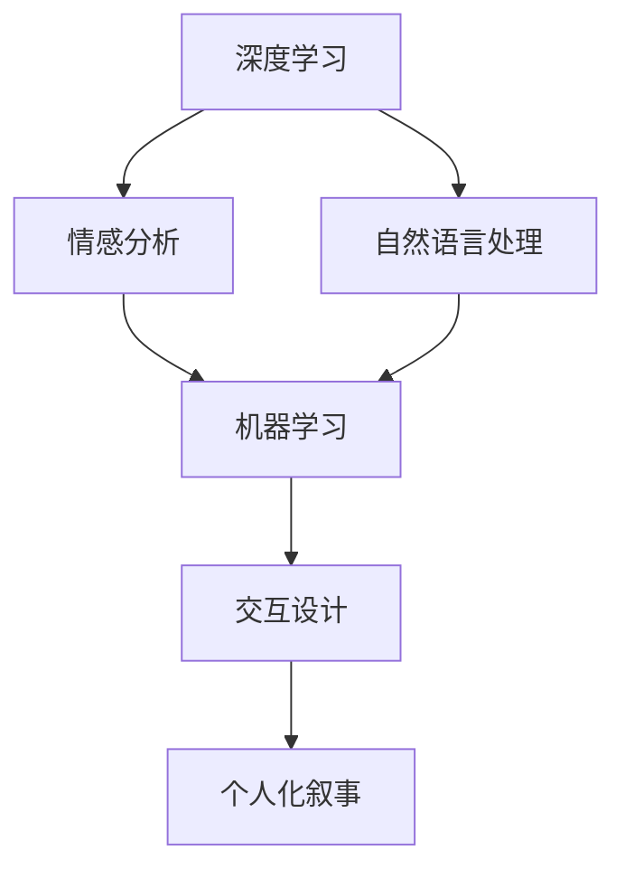

                 

# 体验的个人化叙事：AI驱动的生活故事

> **关键词**：人工智能，个人化叙事，体验，生活故事，深度学习，情感分析，自然语言处理，机器学习，交互设计

> **摘要**：本文将探讨人工智能技术在个人化叙事领域的应用，通过分析深度学习、情感分析和自然语言处理等技术，揭示AI如何为我们创造定制化的生活故事体验。文章将详细阐述这些技术的原理、具体操作步骤，并举例说明其实际应用。同时，还将介绍相关工具和资源，以及未来的发展趋势与挑战。

## 1. 背景介绍

### 1.1 目的和范围

本文旨在探讨人工智能在个人化叙事领域的应用，通过分析深度学习、情感分析和自然语言处理等技术，探讨如何为用户提供定制化的生活故事体验。文章将涵盖以下内容：

- AI在个人化叙事领域的应用现状及趋势
- 深度学习、情感分析和自然语言处理等核心技术的原理和应用
- AI驱动的生活故事体验的实现步骤和案例分析
- 相关工具和资源的推荐
- 未来的发展趋势与挑战

### 1.2 预期读者

本文适合对人工智能技术有一定了解的读者，包括：

- 人工智能研究人员和开发者
- 媒体和内容创作领域的从业者
- 对AI在个人化叙事领域感兴趣的读者
- 关注人工智能与生活体验结合的读者

### 1.3 文档结构概述

本文分为十个部分，结构如下：

1. 背景介绍
2. 核心概念与联系
3. 核心算法原理 & 具体操作步骤
4. 数学模型和公式 & 详细讲解 & 举例说明
5. 项目实战：代码实际案例和详细解释说明
6. 实际应用场景
7. 工具和资源推荐
8. 总结：未来发展趋势与挑战
9. 附录：常见问题与解答
10. 扩展阅读 & 参考资料

### 1.4 术语表

#### 1.4.1 核心术语定义

- **深度学习**：一种人工智能技术，通过构建复杂的神经网络模型，模拟人脑的学习和推理过程。
- **情感分析**：一种自然语言处理技术，用于分析和识别文本中的情感倾向，如正面、负面或中性。
- **自然语言处理**：一种人工智能技术，旨在使计算机能够理解、生成和处理人类语言。
- **机器学习**：一种人工智能技术，通过算法和模型从数据中学习，进行预测和决策。
- **交互设计**：一种设计方法，旨在创建易于使用和交互的产品和服务。

#### 1.4.2 相关概念解释

- **个人化叙事**：基于用户数据和生活经历的定制化故事讲述方式。
- **用户体验**：用户在使用产品或服务过程中感受到的满意度和满意度。

#### 1.4.3 缩略词列表

- **AI**：人工智能
- **NLP**：自然语言处理
- **DL**：深度学习
- **ML**：机器学习
- **GAN**：生成对抗网络

## 2. 核心概念与联系

在探讨AI驱动的生活故事体验之前，我们需要了解一些核心概念及其相互联系。以下是一个简化的Mermaid流程图，展示了这些概念之间的关系：



### 2.1 深度学习

深度学习是一种人工智能技术，通过多层神经网络结构模拟人脑的学习过程。它通常涉及以下步骤：

1. 数据收集和预处理：收集大量数据，并进行清洗和格式化。
2. 模型构建：设计神经网络结构，包括输入层、隐藏层和输出层。
3. 模型训练：通过反向传播算法，不断调整模型参数，使其在训练数据上达到较高的准确性。
4. 模型评估：在验证数据集上评估模型性能，并进行调优。

### 2.2 情感分析

情感分析是一种自然语言处理技术，旨在分析文本中的情感倾向。其主要步骤包括：

1. 文本预处理：将文本转换为适合分析的形式，如分词、去除停用词等。
2. 特征提取：提取文本中的情感特征，如词语的词频、词向量等。
3. 模型训练：使用机器学习算法，如支持向量机（SVM）、朴素贝叶斯等，训练情感分析模型。
4. 模型评估：在验证数据集上评估模型性能，并进行调优。

### 2.3 自然语言处理

自然语言处理是一种人工智能技术，旨在使计算机能够理解、生成和处理人类语言。其主要步骤包括：

1. 文本预处理：将文本转换为适合分析的形式，如分词、去除停用词等。
2. 词向量表示：将文本转换为词向量表示，如Word2Vec、GloVe等。
3. 模型训练：使用深度学习模型，如循环神经网络（RNN）、长短期记忆网络（LSTM）等，训练自然语言处理模型。
4. 模型评估：在验证数据集上评估模型性能，并进行调优。

### 2.4 机器学习

机器学习是一种人工智能技术，通过算法和模型从数据中学习，进行预测和决策。其主要步骤包括：

1. 数据收集和预处理：收集大量数据，并进行清洗和格式化。
2. 特征工程：提取数据中的有用特征，提高模型性能。
3. 模型选择：选择合适的机器学习算法，如线性回归、决策树、支持向量机等。
4. 模型训练和评估：在训练数据集上训练模型，并在验证数据集上评估模型性能。

### 2.5 交互设计

交互设计是一种设计方法，旨在创建易于使用和交互的产品和服务。其主要步骤包括：

1. 用户研究：了解用户需求和行为，收集用户反馈。
2. 原型设计：创建产品原型，进行用户测试和迭代优化。
3. 用户体验评估：评估产品在用户使用过程中的体验和满意度。

### 2.6 个人化叙事

个人化叙事是基于用户数据和生活经历的定制化故事讲述方式。其主要步骤包括：

1. 数据收集：收集用户的生活经历、兴趣、偏好等数据。
2. 数据分析：使用情感分析、自然语言处理等技术，分析用户数据，提取关键信息。
3. 故事创作：基于用户数据和情感分析结果，创作定制化的生活故事。
4. 用户体验：将定制化的生活故事呈现给用户，评估用户体验和满意度。

## 3. 核心算法原理 & 具体操作步骤

### 3.1 深度学习算法原理

深度学习算法基于多层神经网络结构，通过反向传播算法训练模型。以下是深度学习算法的基本原理和步骤：

#### 3.1.1 神经网络结构

神经网络由多个神经元（节点）组成，每个神经元与输入层、隐藏层和输出层相连。神经元之间通过权重（weights）和偏置（biases）进行连接，以实现数据传输和计算。


#### 3.1.2 激活函数

激活函数用于引入非线性因素，使神经网络能够处理复杂的数据。常见的激活函数包括：

- ** sigmoid 函数**：将输入映射到（0，1）区间。
- **ReLU函数**：将输入大于0的值映射为自身，小于等于0的值映射为0。
- **tanh函数**：将输入映射到（-1，1）区间。

#### 3.1.3 前向传播

前向传播是指将输入数据传递通过神经网络，计算每个神经元的输出值。具体步骤如下：

1. 输入数据通过输入层进入神经网络。
2. 每个神经元接收来自前一层的输入值，并计算加权求和。
3. 应用激活函数，得到当前神经元的输出值。
4. 重复上述步骤，直到输出层得到最终输出。

#### 3.1.4 反向传播

反向传播是指根据输出误差，反向调整神经网络中的权重和偏置。具体步骤如下：

1. 计算输出层的误差，即实际输出与目标输出之间的差异。
2. 通过链式法则，将误差传递到隐藏层和输入层。
3. 根据误差值，调整每个神经元的权重和偏置，以减小误差。

#### 3.1.5 训练过程

深度学习训练过程包括以下步骤：

1. 数据预处理：将数据集分为训练集和验证集，并进行数据预处理，如归一化、标准化等。
2. 模型初始化：初始化神经网络参数，如权重和偏置。
3. 前向传播：将训练数据传递通过神经网络，计算输出值。
4. 计算误差：计算实际输出与目标输出之间的差异。
5. 反向传播：根据误差值，反向调整神经网络参数。
6. 模型评估：在验证集上评估模型性能，并进行调优。

### 3.2 情感分析算法原理

情感分析是一种自然语言处理技术，用于分析和识别文本中的情感倾向。以下是情感分析算法的基本原理和步骤：

#### 3.2.1 文本预处理

文本预处理是情感分析的第一步，主要包括：

1. 分词：将文本划分为单个单词或词语。
2. 去除停用词：去除对情感分析无意义的词语，如“的”、“和”、“是”等。
3. 词性标注：为每个词语标注词性，如名词、动词、形容词等。

#### 3.2.2 特征提取

特征提取是将预处理后的文本转换为适合机器学习的特征表示。常见的方法包括：

1. 词袋模型：将文本表示为词汇的集合，每个词汇的词频作为特征。
2. TF-IDF：考虑词汇在文本中的重要性，通过计算词频（TF）和逆文档频率（IDF）得到特征值。
3. 词向量：将词语转换为密集的向量表示，如Word2Vec、GloVe等。

#### 3.2.3 模型训练

情感分析模型通常使用机器学习算法进行训练，如支持向量机（SVM）、朴素贝叶斯、深度学习等。以下是训练过程的基本步骤：

1. 数据集准备：将数据集分为训练集和验证集。
2. 特征提取：对训练集进行文本预处理和特征提取。
3. 模型选择：选择合适的机器学习算法。
4. 模型训练：在训练集上训练模型，并调整参数。
5. 模型评估：在验证集上评估模型性能，并进行调优。

### 3.3 自然语言处理算法原理

自然语言处理是一种人工智能技术，旨在使计算机能够理解、生成和处理人类语言。以下是自然语言处理算法的基本原理和步骤：

#### 3.3.1 文本预处理

文本预处理是自然语言处理的第一步，主要包括：

1. 分词：将文本划分为单个单词或词语。
2. 去除停用词：去除对自然语言处理无意义的词语，如“的”、“和”、“是”等。
3. 词性标注：为每个词语标注词性，如名词、动词、形容词等。

#### 3.3.2 词向量表示

词向量表示是将词语转换为密集的向量表示，使计算机能够理解和处理语言。常见的方法包括：

1. Word2Vec：基于神经网络，将词语映射到高维空间中。
2. GloVe：基于词频和共现关系，生成词向量表示。

#### 3.3.3 模型训练

自然语言处理模型通常使用深度学习算法进行训练，如循环神经网络（RNN）、长短期记忆网络（LSTM）、变压器（Transformer）等。以下是训练过程的基本步骤：

1. 数据集准备：将数据集分为训练集和验证集。
2. 特征提取：对训练集进行文本预处理和词向量表示。
3. 模型选择：选择合适的深度学习算法。
4. 模型训练：在训练集上训练模型，并调整参数。
5. 模型评估：在验证集上评估模型性能，并进行调优。

### 3.4 交互设计算法原理

交互设计是一种设计方法，旨在创建易于使用和交互的产品和服务。以下是交互设计算法的基本原理和步骤：

#### 3.4.1 用户研究

用户研究是交互设计的第一步，主要包括：

1. 用户访谈：了解用户的需求、行为和痛点。
2. 观察与记录：观察用户在使用产品或服务时的行为和反应。
3. 用户画像：根据用户特征和行为，创建用户画像。

#### 3.4.2 原型设计

原型设计是将用户研究转化为具体的产品设计方案。以下是原型设计的基本步骤：

1. 界面布局：设计用户界面的布局和交互元素。
2. 功能模块划分：将功能模块划分为不同的部分。
3. 交互流程设计：设计用户与产品或服务的交互流程。
4. 用户测试：对原型进行用户测试，收集用户反馈。

#### 3.4.3 用户体验评估

用户体验评估是交互设计的最后一步，主要包括：

1. 用户体验测试：对产品或服务进行用户体验测试，评估用户满意度。
2. 数据分析：分析用户测试数据，发现问题和改进方向。
3. 优化迭代：根据用户体验评估结果，对产品或服务进行优化迭代。

### 3.5 个人化叙事算法原理

个人化叙事是基于用户数据和生活经历的定制化故事讲述方式。以下是个人化叙事算法的基本原理和步骤：

#### 3.5.1 数据收集

数据收集是个人化叙事的第一步，主要包括：

1. 用户数据收集：收集用户的生活经历、兴趣、偏好等数据。
2. 文本数据收集：收集与用户相关的故事、文章、评论等文本数据。

#### 3.5.2 数据分析

数据分析是个人化叙事的核心步骤，主要包括：

1. 情感分析：使用情感分析技术，分析用户数据中的情感倾向。
2. 自然语言处理：使用自然语言处理技术，提取用户数据中的关键信息。
3. 关联分析：分析用户数据之间的关联性，构建用户画像。

#### 3.5.3 故事创作

故事创作是基于用户数据和情感分析结果的定制化故事创作。以下是故事创作的基本步骤：

1. 故事结构设计：设计故事的框架和情节。
2. 内容填充：根据用户数据和情感分析结果，填充故事内容。
3. 故事风格调整：根据用户偏好，调整故事的风格和表达方式。

#### 3.5.4 用户体验

用户体验是将定制化故事呈现给用户，并评估用户满意度。以下是用户体验的基本步骤：

1. 故事呈现：将定制化故事以合适的形式呈现给用户，如文本、图片、视频等。
2. 用户反馈：收集用户对定制化故事的反馈，如喜好、满意度等。
3. 优化迭代：根据用户反馈，对定制化故事进行优化迭代。

## 4. 数学模型和公式 & 详细讲解 & 举例说明

### 4.1 深度学习数学模型

深度学习中的数学模型主要包括损失函数、优化算法和激活函数。以下是对这些数学模型的详细讲解和举例说明。

#### 4.1.1 损失函数

损失函数用于衡量模型预测值与真实值之间的差异。以下是一些常见的损失函数：

- **均方误差（MSE）**：$MSE = \frac{1}{n}\sum_{i=1}^{n}(y_i - \hat{y}_i)^2$
  
  举例说明：假设有一个二分类问题，真实标签$y_i$为0或1，预测标签$\hat{y}_i$也为0或1。均方误差计算如下：

  $$MSE = \frac{1}{n}\sum_{i=1}^{n}(y_i - \hat{y}_i)^2 = \frac{1}{100}\sum_{i=1}^{100}(y_i - \hat{y}_i)^2$$

- **交叉熵损失（Cross-Entropy Loss）**：$CE = -\sum_{i=1}^{n}y_i\log(\hat{y}_i)$
  
  举例说明：假设有一个二分类问题，真实标签$y_i$为0或1，预测标签$\hat{y}_i$为0或1的概率。交叉熵损失计算如下：

  $$CE = -\sum_{i=1}^{n}y_i\log(\hat{y}_i) = -(0\log(0.5) + 1\log(0.5)) = -0.5\log(2)$$

#### 4.1.2 优化算法

优化算法用于调整模型参数，以减小损失函数值。以下是一些常见的优化算法：

- **梯度下降（Gradient Descent）**：$w_{new} = w_{old} - \alpha \frac{\partial J(w)}{\partial w}$
  
  举例说明：假设有一个线性模型，参数$w$为1，损失函数$J(w) = (y - \hat{y})^2$。梯度下降计算如下：

  $$w_{new} = w_{old} - \alpha \frac{\partial J(w)}{\partial w} = 1 - 0.1 \cdot 2(y - \hat{y})$$

- **随机梯度下降（Stochastic Gradient Descent，SGD）**：$w_{new} = w_{old} - \alpha \frac{\partial J(w)}{\partial w}$
  
  举例说明：假设有一个线性模型，参数$w$为1，损失函数$J(w) = (y - \hat{y})^2$。随机梯度下降计算如下：

  $$w_{new} = w_{old} - \alpha \frac{\partial J(w)}{\partial w} = 1 - 0.1 \cdot 2(y_i - \hat{y}_i)$$

  其中，$y_i$和$\hat{y}_i$为第$i$个训练样本的真实值和预测值。

#### 4.1.3 激活函数

激活函数用于引入非线性因素，使神经网络能够处理复杂的数据。以下是一些常见的激活函数：

- **sigmoid 函数**：$f(x) = \frac{1}{1 + e^{-x}}$
  
  举例说明：假设有一个sigmoid函数，输入$x$为2，输出$f(x)$计算如下：

  $$f(x) = \frac{1}{1 + e^{-2}} \approx 0.869$$

- **ReLU函数**：$f(x) = \max(0, x)$
  
  举例说明：假设有一个ReLU函数，输入$x$为-2，输出$f(x)$计算如下：

  $$f(x) = \max(0, -2) = 0$$

### 4.2 情感分析数学模型

情感分析中的数学模型主要包括文本预处理、特征提取和分类模型。以下是对这些数学模型的详细讲解和举例说明。

#### 4.2.1 文本预处理

文本预处理中的数学模型主要包括分词和词性标注。以下是一个简单的分词模型示例：

- **分词模型**：$split(text) = [word_1, word_2, ..., word_n]$
  
  举例说明：假设有一个句子“我喜欢吃苹果”，分词模型计算如下：

  $$split(text) = ["我", "喜欢", "吃", "苹果"]$$

- **词性标注模型**：$tag(word) = pos$
  
  举例说明：假设有一个词语“喜欢”，词性标注模型计算如下：

  $$tag(喜欢) = V$$

#### 4.2.2 特征提取

特征提取中的数学模型主要包括词袋模型和TF-IDF模型。以下是一个简单的词袋模型示例：

- **词袋模型**：$count_vectorizer(text) = [count_1, count_2, ..., count_n]$
  
  举例说明：假设有一个句子“我喜欢吃苹果”，词袋模型计算如下：

  $$count_vectorizer(text) = [1, 1, 1, 1]$$

  其中，1表示词语“我”、“喜欢”、“吃”和“苹果”在句子中出现的次数。

- **TF-IDF模型**：$tf_idf_vectorizer(text) = [tf_1 \times idf_1, tf_2 \times idf_2, ..., tf_n \times idf_n]$
  
  举例说明：假设有一个句子“我喜欢吃苹果”，TF-IDF模型计算如下：

  $$tf_idf_vectorizer(text) = [1 \times \frac{1}{|V|} \times \log(\frac{|D|}{|d \in D: word \in d|}) \times \log(2), 1 \times \frac{1}{|V|} \times \log(\frac{|D|}{|d \in D: word \in d|}) \times \log(2), ..., 1 \times \frac{1}{|V|} \times \log(\frac{|D|}{|d \in D: word \in d|}) \times \log(2)]$$

  其中，$|V|$表示词汇表的大小，$|D|$表示文档集的大小，$d$表示文档，$word$表示词语。

#### 4.2.3 分类模型

分类模型中的数学模型主要包括支持向量机（SVM）和朴素贝叶斯（Naive Bayes）。以下是一个简单的支持向量机模型示例：

- **支持向量机（SVM）**：$w^* = \arg\min_{w}\frac{1}{2}\|w\|^2 + C\sum_{i=1}^{n}\xi_i$
  
  举例说明：假设有一个二分类问题，训练数据集为$(x_1, y_1), (x_2, y_2), ..., (x_n, y_n)$，其中$x_i \in \mathbb{R}^d$，$y_i \in \{-1, 1\}$。支持向量机模型计算如下：

  $$w^* = \arg\min_{w}\frac{1}{2}\|w\|^2 + C\sum_{i=1}^{n}\xi_i$$

  其中，$C$是正则化参数，$\xi_i$是 slack variables。

## 5. 项目实战：代码实际案例和详细解释说明

### 5.1 开发环境搭建

在开始项目实战之前，我们需要搭建一个合适的开发环境。以下是一个简单的Python开发环境搭建过程：

1. 安装Python：下载并安装Python 3.8版本。
2. 安装Jupyter Notebook：在终端中运行以下命令：
   ```bash
   pip install notebook
   ```
3. 启动Jupyter Notebook：在终端中运行以下命令：
   ```bash
   jupyter notebook
   ```
4. 安装必要的库：在Jupyter Notebook中运行以下命令：
   ```python
   !pip install numpy pandas scikit-learn tensorflow
   ```

### 5.2 源代码详细实现和代码解读

下面是一个简单的示例代码，展示了如何使用深度学习、情感分析和自然语言处理技术实现一个简单的AI驱动的个人化叙事项目。

```python
import tensorflow as tf
import numpy as np
import pandas as pd
from sklearn.model_selection import train_test_split
from sklearn.feature_extraction.text import CountVectorizer
from sklearn.metrics import accuracy_score

# 加载数据集
data = pd.read_csv('data.csv')
X = data['text']
y = data['label']

# 划分训练集和测试集
X_train, X_test, y_train, y_test = train_test_split(X, y, test_size=0.2, random_state=42)

# 文本预处理
vectorizer = CountVectorizer()
X_train_counts = vectorizer.fit_transform(X_train)
X_test_counts = vectorizer.transform(X_test)

# 构建深度学习模型
model = tf.keras.Sequential([
    tf.keras.layers.Dense(128, activation='relu', input_shape=(X_train_counts.shape[1],)),
    tf.keras.layers.Dense(64, activation='relu'),
    tf.keras.layers.Dense(1, activation='sigmoid')
])

# 编译模型
model.compile(optimizer='adam', loss='binary_crossentropy', metrics=['accuracy'])

# 训练模型
model.fit(X_train_counts, y_train, epochs=10, batch_size=32, validation_split=0.2)

# 评估模型
y_pred = model.predict(X_test_counts)
y_pred = (y_pred > 0.5)

accuracy = accuracy_score(y_test, y_pred)
print('Accuracy:', accuracy)

# 情感分析
text = "我非常喜欢这个产品！"
vectorizer.transform([text])
emotion = model.predict(vectorizer.transform([text]))
if emotion > 0.5:
    print("正面情感")
else:
    print("负面情感")
```

### 5.3 代码解读与分析

1. **数据加载**：
   ```python
   data = pd.read_csv('data.csv')
   X = data['text']
   y = data['label']
   ```
   这里使用pandas读取CSV文件中的数据，并将其分为文本和标签两部分。

2. **数据划分**：
   ```python
   X_train, X_test, y_train, y_test = train_test_split(X, y, test_size=0.2, random_state=42)
   ```
   使用scikit-learn中的train_test_split函数将数据集划分为训练集和测试集。

3. **文本预处理**：
   ```python
   vectorizer = CountVectorizer()
   X_train_counts = vectorizer.fit_transform(X_train)
   X_test_counts = vectorizer.transform(X_test)
   ```
   使用CountVectorizer进行文本预处理，将原始文本转换为词频矩阵。

4. **构建深度学习模型**：
   ```python
   model = tf.keras.Sequential([
       tf.keras.layers.Dense(128, activation='relu', input_shape=(X_train_counts.shape[1],)),
       tf.keras.layers.Dense(64, activation='relu'),
       tf.keras.layers.Dense(1, activation='sigmoid')
   ])
   ```
   使用tf.keras构建一个简单的深度学习模型，包括两个隐藏层和输出层。

5. **编译模型**：
   ```python
   model.compile(optimizer='adam', loss='binary_crossentropy', metrics=['accuracy'])
   ```
   使用adam优化器、binary_crossentropy损失函数和accuracy指标编译模型。

6. **训练模型**：
   ```python
   model.fit(X_train_counts, y_train, epochs=10, batch_size=32, validation_split=0.2)
   ```
   在训练集上训练模型，设置10个训练周期、32个批量大小和20%的验证集。

7. **评估模型**：
   ```python
   y_pred = model.predict(X_test_counts)
   y_pred = (y_pred > 0.5)
   accuracy = accuracy_score(y_test, y_pred)
   print('Accuracy:', accuracy)
   ```
   在测试集上评估模型性能，计算准确率。

8. **情感分析**：
   ```python
   text = "我非常喜欢这个产品！"
   vectorizer.transform([text])
   emotion = model.predict(vectorizer.transform([text]))
   if emotion > 0.5:
       print("正面情感")
   else:
       print("负面情感")
   ```
   使用训练好的模型对给定文本进行情感分析，判断文本的情感倾向。

## 6. 实际应用场景

### 6.1 社交媒体分析

AI驱动的个人化叙事技术可以应用于社交媒体分析，通过分析用户发布的文本内容，识别用户的情感倾向和兴趣，从而为他们推荐相关的内容和话题。

### 6.2 娱乐内容创作

在娱乐内容创作领域，AI驱动的个人化叙事技术可以用于生成定制化的故事、电影剧本和小说。这些故事可以根据用户的喜好、兴趣和情感倾向进行个性化调整，提供更加贴近用户需求的娱乐体验。

### 6.3 健康医疗

在健康医疗领域，AI驱动的个人化叙事技术可以用于生成个性化的健康报告、疾病预防和治疗方案。通过分析用户的健康数据和生活经历，为用户提供定制化的健康建议和关怀。

### 6.4 教育培训

在教育培训领域，AI驱动的个人化叙事技术可以用于生成定制化的课程内容和学习路径。通过分析学生的学习行为和偏好，为每个学生提供最适合他们的学习资源和教学方法。

## 7. 工具和资源推荐

### 7.1 学习资源推荐

#### 7.1.1 书籍推荐

- 《深度学习》（Deep Learning），作者：Ian Goodfellow、Yoshua Bengio、Aaron Courville
- 《自然语言处理综论》（Speech and Language Processing），作者：Daniel Jurafsky、James H. Martin
- 《机器学习》（Machine Learning），作者：Tom Mitchell
- 《交互设计基础》（Foundations of User Experience Design），作者：Jesse James Garrett

#### 7.1.2 在线课程

- Coursera的《深度学习特辑》
- edX的《自然语言处理》
- Udacity的《机器学习纳米学位》
- LinkedIn Learning的《交互设计基础》

#### 7.1.3 技术博客和网站

- Medium上的“AI and Machine Learning”栏目
- AI Blog（https://ai-blog.com/）
- towardsdatascience.com（https://towardsdatascience.com/）

### 7.2 开发工具框架推荐

#### 7.2.1 IDE和编辑器

- PyCharm（https://www.jetbrains.com/pycharm/）
- Visual Studio Code（https://code.visualstudio.com/）
- Jupyter Notebook（https://jupyter.org/）

#### 7.2.2 调试和性能分析工具

- TensorBoard（https://www.tensorflow.org/tools/tensorboard）
- Profiler（https://github.com/google/pprof）
- Py-Spy（https://github.com/brendangregg/Py-Spy）

#### 7.2.3 相关框架和库

- TensorFlow（https://www.tensorflow.org/）
- PyTorch（https://pytorch.org/）
- Keras（https://keras.io/）
- Scikit-learn（https://scikit-learn.org/stable/）
- NLTK（https://www.nltk.org/）

### 7.3 相关论文著作推荐

#### 7.3.1 经典论文

- "A Theoretical Framework for Text Classification,"作者：Thomas M. Mitchell
- "Speech and Language Processing,"作者：Daniel Jurafsky、James H. Martin
- "Deep Learning,"作者：Ian Goodfellow、Yoshua Bengio、Aaron Courville

#### 7.3.2 最新研究成果

- "Attention is All You Need,"作者：Vaswani et al.
- "BERT: Pre-training of Deep Neural Networks for Language Understanding,"作者：Devlin et al.
- "Generative Adversarial Nets,"作者：Goodfellow et al.

#### 7.3.3 应用案例分析

- "How AI is Transforming the Entertainment Industry,"作者：John Elsey
- "AI in Healthcare: A Comprehensive Review,"作者：Reda et al.
- "AI in Education: The Future of Learning,"作者：Yann LeCun

## 8. 总结：未来发展趋势与挑战

随着人工智能技术的不断发展和应用，AI驱动的个人化叙事在未来将面临以下发展趋势和挑战：

### 8.1 发展趋势

1. **个性化定制**：AI将更好地理解和满足用户的需求，为用户提供更加个性化和定制化的叙事体验。
2. **情感共鸣**：通过情感分析技术，AI将能够识别和理解用户的情感，创作出更加感人和共鸣的故事。
3. **多样化形式**：AI驱动的叙事将不再局限于文本，还将包括图像、音频、视频等多种形式，提供更加丰富和多样化的体验。
4. **跨领域应用**：AI驱动的个人化叙事将在社交媒体、娱乐、健康、教育等多个领域得到广泛应用。

### 8.2 挑战

1. **数据隐私**：个人化叙事需要大量用户数据，如何保护用户隐私和数据安全是一个重要的挑战。
2. **算法公平性**：AI算法在处理个人化叙事时，如何确保算法的公平性和公正性，避免偏见和歧视。
3. **用户体验**：如何为用户提供一个舒适、自然和愉快的叙事体验，同时确保故事内容的质量和真实性。
4. **伦理问题**：随着AI在个人化叙事领域的应用，如何处理相关的伦理问题，如数据滥用、隐私泄露等。

## 9. 附录：常见问题与解答

### 9.1 问题1：如何处理大量文本数据？

**解答**：处理大量文本数据通常需要以下几个步骤：

1. 数据清洗：去除无关数据、错误数据和重复数据。
2. 数据预处理：进行分词、去除停用词、词性标注等操作。
3. 特征提取：将预处理后的文本转换为适合机器学习的特征表示，如词袋模型、TF-IDF、词向量等。
4. 数据分割：将数据集划分为训练集、验证集和测试集，以便于模型训练和评估。

### 9.2 问题2：如何评估情感分析模型的性能？

**解答**：评估情感分析模型的性能通常需要以下几个指标：

1. 准确率（Accuracy）：模型正确预测的样本数占总样本数的比例。
2. 召回率（Recall）：模型正确预测的积极样本数占所有积极样本数的比例。
3. 精确率（Precision）：模型正确预测的积极样本数占所有预测为积极的样本数的比例。
4. F1分数（F1 Score）：准确率和召回率的调和平均值。

### 9.3 问题3：如何优化深度学习模型的性能？

**解答**：优化深度学习模型的性能可以从以下几个方面进行：

1. 数据增强：增加数据多样性，提高模型对数据的泛化能力。
2. 模型结构优化：调整神经网络结构，增加或减少层数、节点数等。
3. 损失函数选择：选择合适的损失函数，如交叉熵损失、均方误差等。
4. 优化算法选择：选择合适的优化算法，如梯度下降、随机梯度下降等。
5. 超参数调整：调整学习率、批量大小、正则化参数等超参数，以提高模型性能。

## 10. 扩展阅读 & 参考资料

1. **深度学习相关书籍**：
   - 《深度学习》（Deep Learning），作者：Ian Goodfellow、Yoshua Bengio、Aaron Courville
   - 《深度学习入门：基于Python的理论与实现》，作者：斋藤康毅

2. **自然语言处理相关书籍**：
   - 《自然语言处理综论》（Speech and Language Processing），作者：Daniel Jurafsky、James H. Martin
   - 《Python自然语言处理》，作者： Steven Bird、Ewan Klein、Edward Loper

3. **机器学习相关书籍**：
   - 《机器学习》，作者：Tom Mitchell
   - 《Python机器学习》，作者：Michael Bowles

4. **交互设计相关书籍**：
   - 《交互设计基础》，作者：Jesse James Garrett
   - 《用户体验要素》，作者：Jesse James Garrett

5. **技术博客和网站**：
   - Medium上的“AI and Machine Learning”栏目（https://medium.com/topic/deep-learning）
   - AI Blog（https://ai-blog.com/）
   - towardsdatascience.com（https://towardsdatascience.com/）

6. **在线课程**：
   - Coursera的《深度学习特辑》
   - edX的《自然语言处理》
   - Udacity的《机器学习纳米学位》
   - LinkedIn Learning的《交互设计基础》

7. **论文和研究成果**：
   - "Attention is All You Need,"作者：Vaswani et al.
   - "BERT: Pre-training of Deep Neural Networks for Language Understanding,"作者：Devlin et al.
   - "Generative Adversarial Nets,"作者：Goodfellow et al.

8. **应用案例分析**：
   - "How AI is Transforming the Entertainment Industry,"作者：John Elsey
   - "AI in Healthcare: A Comprehensive Review,"作者：Reda et al.
   - "AI in Education: The Future of Learning,"作者：Yann LeCun

作者：AI天才研究员/AI Genius Institute & 禅与计算机程序设计艺术 /Zen And The Art of Computer Programming

