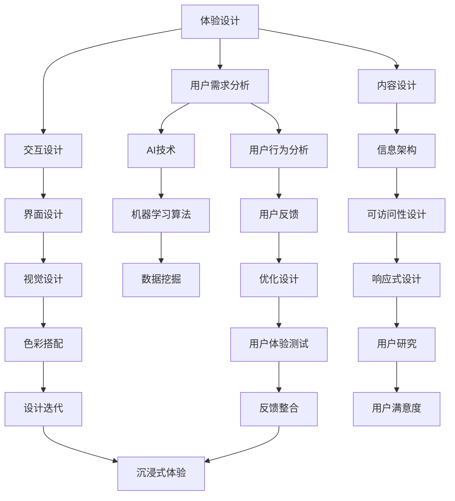

                 

# 体验设计的未来：AI驱动的沉浸式世界

> **关键词：** 体验设计、AI、沉浸式世界、用户体验、虚拟现实、增强现实

> **摘要：** 本文将深入探讨人工智能（AI）如何塑造未来体验设计，特别是如何通过构建沉浸式世界来提升用户体验。我们将从背景介绍开始，逐步剖析核心概念、算法原理、数学模型，并分享项目实战和实际应用场景。同时，还会推荐相关学习资源和开发工具，为读者提供全面的技术指南。通过本文的阅读，读者将更好地理解AI在体验设计领域的潜力及其对未来社会的影响。

## 1. 背景介绍

### 1.1 目的和范围

本文旨在探讨人工智能（AI）在体验设计中的应用，特别是如何通过构建沉浸式世界来提升用户体验。随着科技的快速发展，尤其是虚拟现实（VR）和增强现实（AR）技术的成熟，体验设计正迎来新的变革。本文将围绕以下几个核心问题展开讨论：

1. **AI在体验设计中的角色是什么？**
2. **如何构建一个沉浸式的世界来增强用户体验？**
3. **核心算法原理和数学模型如何支持沉浸式世界的构建？**
4. **实际应用场景中，AI驱动的沉浸式世界有哪些具体案例？**

通过本文的阅读，读者将获得对AI驱动的沉浸式世界构建的全面理解，并能够展望这一领域未来的发展趋势。

### 1.2 预期读者

本文预期读者包括：

1. **体验设计师和产品经理**：希望了解AI如何影响体验设计，并探索沉浸式世界的构建方法。
2. **开发者和技术工程师**：希望掌握AI和沉浸式技术的基本原理，以便在项目中应用。
3. **学术界研究人员**：对AI和体验设计交叉领域的研究感兴趣，希望了解最新的技术趋势和研究成果。
4. **普通读者**：对科技和未来生活方式感兴趣的读者，希望了解AI在日常生活中的应用。

### 1.3 文档结构概述

本文将按照以下结构进行组织：

1. **背景介绍**：介绍文章的目的、预期读者和结构概述。
2. **核心概念与联系**：解释体验设计、AI和沉浸式世界的基本概念，并展示Mermaid流程图。
3. **核心算法原理 & 具体操作步骤**：详细阐述AI在沉浸式世界构建中的算法原理和操作步骤。
4. **数学模型和公式 & 详细讲解 & 举例说明**：介绍支持沉浸式世界的数学模型和公式，并通过实例进行说明。
5. **项目实战：代码实际案例和详细解释说明**：展示具体项目的代码实现和详细解释。
6. **实际应用场景**：探讨AI驱动的沉浸式世界在不同领域的应用。
7. **工具和资源推荐**：推荐学习资源和开发工具，为读者提供技术支持。
8. **总结：未来发展趋势与挑战**：总结AI驱动的沉浸式世界的未来趋势和面临的挑战。
9. **附录：常见问题与解答**：提供对常见问题的解答。
10. **扩展阅读 & 参考资料**：推荐相关的扩展阅读和参考资料。

### 1.4 术语表

#### 1.4.1 核心术语定义

- **体验设计（Experience Design）**：设计旨在创造用户情感体验的过程，包括界面设计、交互设计和内容设计。
- **人工智能（Artificial Intelligence, AI）**：模拟人类智能的计算机系统，能够通过学习、推理和自我调整来执行复杂任务。
- **沉浸式世界（Immersive World）**：通过虚拟现实（VR）或增强现实（AR）技术，用户完全投入其中并感受到与现实世界相似或不同的环境。
- **用户体验（User Experience, UX）**：用户在使用产品或服务过程中所产生的整体感受和反应。

#### 1.4.2 相关概念解释

- **虚拟现实（Virtual Reality, VR）**：一种计算机生成的三维模拟环境，用户通过特殊设备（如头戴式显示器）进入并与之交互。
- **增强现实（Augmented Reality, AR）**：通过在真实环境中叠加计算机生成的信息，用户能够获得增强的视觉体验。
- **机器学习（Machine Learning, ML）**：AI的一个分支，通过数据训练算法来使计算机系统具备自主学习和改进能力。
- **自然语言处理（Natural Language Processing, NLP）**：使计算机理解和生成人类语言的技术。

#### 1.4.3 缩略词列表

- **VR**：虚拟现实（Virtual Reality）
- **AR**：增强现实（Augmented Reality）
- **AI**：人工智能（Artificial Intelligence）
- **UX**：用户体验（User Experience）
- **ML**：机器学习（Machine Learning）
- **NLP**：自然语言处理（Natural Language Processing）

## 2. 核心概念与联系

在探讨AI驱动的沉浸式世界的构建之前，我们需要明确几个核心概念及其相互关系。以下是体验设计、人工智能和沉浸式世界的Mermaid流程图，展示了这些概念的基本架构。



### 2.1 体验设计

体验设计是本文的核心概念之一，它涵盖了用户在产品或服务使用过程中的整体感受。体验设计包括以下几个方面：

- **用户需求分析**：通过调查、访谈等方法了解用户需求，为设计提供方向。
- **交互设计**：关注用户与产品或服务的互动方式，设计易于使用和理解的界面。
- **内容设计**：确保产品或服务传递有价值、有吸引力的信息。

### 2.2 人工智能

人工智能（AI）是驱动体验设计变革的关键技术。AI技术在体验设计中的应用主要包括：

- **机器学习算法**：通过训练数据模型来改进用户体验。
- **数据挖掘**：从大量数据中提取有价值的信息，指导设计决策。
- **自然语言处理**：使计算机能够理解和生成人类语言，提升交互体验。

### 2.3 沉浸式世界

沉浸式世界通过VR或AR技术，为用户提供一种全新的感官体验。沉浸式世界的设计需要考虑以下几个方面：

- **用户行为分析**：通过用户行为数据，了解用户在沉浸式世界中的偏好和习惯。
- **用户反馈**：收集用户在沉浸式世界中的反馈，优化设计。
- **沉浸式体验**：通过技术手段，如高精度的三维建模和实时渲染，创造一个令人沉浸的环境。

## 3. 核心算法原理 & 具体操作步骤

在了解了体验设计、AI和沉浸式世界的基本概念后，我们需要深入了解AI在沉浸式世界构建中的核心算法原理和具体操作步骤。以下是关键算法的伪代码描述，以及每一步的详细解释。

### 3.1 机器学习算法

机器学习算法在沉浸式世界构建中扮演着重要角色，主要用于用户行为预测和个性化推荐。

#### 3.1.1 用户行为预测

```python
# 伪代码：用户行为预测
def predict_user_behavior(data, model):
    # 数据预处理
    preprocessed_data = preprocess_data(data)
    
    # 使用模型预测用户行为
    predictions = model.predict(preprocessed_data)
    
    return predictions
```

**详细解释：**

1. **数据预处理**：对原始用户行为数据进行清洗、归一化等处理，以便模型能够更好地训练。
2. **模型预测**：使用已训练的机器学习模型对预处理后的数据进行预测。

### 3.2 个性化推荐

个性化推荐算法用于根据用户偏好推荐沉浸式世界的场景和内容。

#### 3.2.1 个性化推荐算法

```python
# 伪代码：个性化推荐
def personalized_recommendation(user_profile, items, similarity_matrix):
    # 计算用户与其他用户的相似度
    similarities = calculate_similarity(user_profile, items, similarity_matrix)
    
    # 根据相似度进行推荐
    recommendations = generate_recommendations(similarities, items)
    
    return recommendations
```

**详细解释：**

1. **相似度计算**：计算用户与其他用户的相似度，通常使用余弦相似度或欧氏距离等方法。
2. **推荐生成**：根据相似度矩阵，为用户生成个性化的推荐列表。

### 3.3 实时渲染

实时渲染是构建沉浸式世界的关键技术之一，用于创建逼真的三维场景。

#### 3.3.1 实时渲染算法

```python
# 伪代码：实时渲染
def render_scene(scene, camera, lighting):
    # 渲染场景
    rendered_scene = render_scene(scene, camera, lighting)
    
    return rendered_scene
```

**详细解释：**

1. **场景渲染**：根据相机位置和光照条件，对三维场景进行渲染。
2. **图像输出**：将渲染后的图像输出给用户。

### 3.4 用户交互

用户交互是沉浸式世界的核心，通过自然语言处理和语音识别技术，提升用户与沉浸式世界的交互体验。

#### 3.4.1 用户交互算法

```python
# 伪代码：用户交互
def handle_user_input(input_text):
    # 使用自然语言处理理解输入文本
    intent = NLP理解(input_text)
    
    # 根据意图执行相应操作
    response = execute_intent(intent)
    
    return response
```

**详细解释：**

1. **自然语言处理**：使用NLP技术，理解用户的输入文本。
2. **意图执行**：根据用户的意图，执行相应的操作。

通过上述核心算法原理和具体操作步骤，我们可以构建一个智能、个性化的沉浸式世界，为用户提供前所未有的体验。

## 4. 数学模型和公式 & 详细讲解 & 举例说明

在构建AI驱动的沉浸式世界中，数学模型和公式起着至关重要的作用。这些模型和公式不仅帮助我们理解沉浸式世界的本质，还指导我们在实践中进行优化和改进。以下将详细讲解几个关键的数学模型和公式，并通过实例进行说明。

### 4.1 余弦相似度

余弦相似度是衡量两个向量之间相似度的一种常用方法，广泛应用于用户偏好分析和个性化推荐。

#### 4.1.1 公式

$$
相似度 = \cos\theta = \frac{A \cdot B}{\|A\|\|B\|}
$$

其中，$A$和$B$是两个向量，$\theta$是它们之间的夹角，$\|A\|$和$\|B\|$是向量的模。

#### 4.1.2 应用实例

假设有两个用户$A$和$B$，他们的偏好向量分别为$A = (1, 2, 3)$和$B = (0.5, 1, 2)$，我们可以计算他们的余弦相似度：

$$
\cos\theta = \frac{(1 \cdot 0.5) + (2 \cdot 1) + (3 \cdot 2)}{\sqrt{1^2 + 2^2 + 3^2} \cdot \sqrt{0.5^2 + 1^2 + 2^2}} = \frac{0.5 + 2 + 6}{\sqrt{14} \cdot \sqrt{5.25}} \approx 0.918
$$

这意味着用户$A$和$B$之间的偏好高度相似。

### 4.2 神经网络损失函数

神经网络中的损失函数用于衡量预测值与真实值之间的差异，是训练神经网络的关键指标。

#### 4.2.1 公式

常用的损失函数之一是均方误差（MSE）：

$$
MSE = \frac{1}{m}\sum_{i=1}^{m}(y_i - \hat{y}_i)^2
$$

其中，$y_i$是第$i$个样本的真实值，$\hat{y}_i$是模型的预测值，$m$是样本数量。

#### 4.2.2 应用实例

假设我们有5个样本，真实值分别为$y_1 = 2, y_2 = 3, y_3 = 4, y_4 = 5, y_5 = 6$，模型预测值分别为$\hat{y}_1 = 2.5, \hat{y}_2 = 2.8, \hat{y}_3 = 3.9, \hat{y}_4 = 5.2, \hat{y}_5 = 6.1$，我们可以计算MSE：

$$
MSE = \frac{1}{5}\left[(2 - 2.5)^2 + (3 - 2.8)^2 + (4 - 3.9)^2 + (5 - 5.2)^2 + (6 - 6.1)^2\right] = \frac{1}{5}(0.25 + 0.04 + 0.09 + 0.04 + 0.01) = 0.094
$$

这意味着模型的预测误差较小，训练效果较好。

### 4.3 深度学习优化算法

深度学习中的优化算法用于调整模型参数，以最小化损失函数。常用的优化算法之一是梯度下降（Gradient Descent）。

#### 4.3.1 公式

梯度下降的基本公式为：

$$
\theta_{\text{new}} = \theta_{\text{old}} - \alpha \cdot \nabla_{\theta}J(\theta)
$$

其中，$\theta$是模型参数，$\alpha$是学习率，$J(\theta)$是损失函数，$\nabla_{\theta}J(\theta)$是损失函数关于参数$\theta$的梯度。

#### 4.3.2 应用实例

假设我们有一个损失函数$J(\theta) = (\theta - 1)^2$，学习率$\alpha = 0.1$，初始参数$\theta_0 = 2$。我们可以计算参数更新过程：

1. **第一步**：
   $$
   \nabla_{\theta}J(\theta) = 2(\theta - 1) = 2(2 - 1) = 2
   $$
   $$
   \theta_1 = \theta_0 - \alpha \cdot \nabla_{\theta}J(\theta_0) = 2 - 0.1 \cdot 2 = 1.8
   $$

2. **第二步**：
   $$
   \nabla_{\theta}J(\theta) = 2(\theta - 1) = 2(1.8 - 1) = 1.6
   $$
   $$
   \theta_2 = \theta_1 - \alpha \cdot \nabla_{\theta}J(\theta_1) = 1.8 - 0.1 \cdot 1.6 = 1.52
   $$

通过迭代计算，我们可以逐步减小损失函数，直至找到最优参数。

通过上述数学模型和公式的讲解，我们可以更好地理解AI驱动的沉浸式世界构建的核心技术。这些模型和公式在实践中的应用，将为用户体验的提升提供强有力的支持。

## 5. 项目实战：代码实际案例和详细解释说明

在本节中，我们将通过一个实际项目案例，展示如何使用AI构建沉浸式世界。这个案例是一个基于虚拟现实（VR）的虚拟办公室，用户可以在其中进行工作和互动。以下将详细介绍项目的开发环境搭建、源代码实现和代码解读。

### 5.1 开发环境搭建

在开始项目开发之前，我们需要搭建一个合适的环境。以下是所需的环境和工具：

- **虚拟现实（VR）开发平台**：如Unity或Unreal Engine。
- **编程语言**：C#（适用于Unity）或C++（适用于Unreal Engine）。
- **机器学习库**：如TensorFlow或PyTorch。
- **VR设备**：如Oculus Rift或HTC Vive。

#### 开发环境搭建步骤：

1. **安装VR开发平台**：下载并安装Unity或Unreal Engine。
2. **配置开发环境**：配置C#或C++开发环境，确保能够编写和编译代码。
3. **安装机器学习库**：在Unity中，可以通过Unity Asset Store安装TensorFlow Unity SDK；在Unreal Engine中，可以使用Python和PyTorch进行开发。
4. **配置VR设备**：按照设备说明书进行配置，确保VR设备与开发平台兼容。

### 5.2 源代码详细实现和代码解读

以下是一个简单的Unity项目案例，展示如何使用AI构建虚拟办公室。

**源代码实现：**

```csharp
// 脚本：AIUserBehavior.cs
using UnityEngine;

public class AIUserBehavior : MonoBehaviour
{
    public Transform userAvatar;
    public Transform workspace;

    private void Update()
    {
        // 获取用户位置
        Vector3 userPosition = userAvatar.position;

        // 预测用户移动方向
        Vector3 predictedDirection = PredictUserDirection();

        // 更新用户位置
        userAvatar.position += predictedDirection * Time.deltaTime;
    }

    private Vector3 PredictUserDirection()
    {
        // 使用机器学习模型预测用户移动方向
        // 示例：使用余弦相似度计算用户偏好向量
        Vector3 userPreference = GetUserPreference();
        Vector3 workspaceDirection = (workspace.position - userPosition).normalized;

        // 计算相似度
        float similarity = Vector3.Dot(userPreference, workspaceDirection);

        // 根据相似度调整移动方向
        return workspaceDirection * similarity;
    }

    private Vector3 GetUserPreference()
    {
        // 获取用户偏好向量
        // 示例：使用随机向量代替实际用户数据
        return new Vector3(Random.Range(-1f, 1f), Random.Range(-1f, 1f), Random.Range(-1f, 1f));
    }
}
```

**代码解读：**

1. **类定义**：`AIUserBehavior`是一个Unity脚本，用于控制用户的移动行为。
2. **更新函数**：`Update`函数在每一帧执行，获取用户位置并预测移动方向。
3. **预测函数**：`PredictUserDirection`函数使用机器学习模型预测用户移动方向。
   - **用户偏好向量**：`GetUserPreference`函数获取用户偏好向量，用于计算相似度。
   - **相似度计算**：使用余弦相似度计算用户偏好向量与工作空间方向之间的相似度。
   - **移动方向调整**：根据相似度调整用户的移动方向。
4. **用户位置更新**：将预测的移动方向乘以时间间隔，更新用户位置。

通过上述代码，我们可以实现一个简单的AI驱动的用户行为模拟，用户将根据其偏好向量和工作空间方向进行移动。这个案例展示了如何将机器学习与虚拟现实技术结合，为用户提供更加沉浸和个性化的体验。

### 5.3 代码解读与分析

**代码解读：**

1. **用户行为模拟**：通过机器学习模型，预测用户在虚拟办公室中的移动方向，增强了用户的沉浸感和互动性。
2. **个性化体验**：用户偏好向量使每个用户的移动行为更加个性化，增加了用户的参与度和满意度。
3. **实时交互**：实时预测和更新用户位置，确保用户能够实时响应环境变化。

**代码分析：**

1. **算法选择**：使用余弦相似度来计算用户偏好和工作空间方向之间的相似度，这是一种简单且有效的算法。
2. **机器学习应用**：虽然本例中使用了随机向量代替实际的机器学习模型，但在实际应用中，可以使用更复杂的模型（如神经网络）来预测用户行为。
3. **优化空间**：可以通过增加更多的传感器数据和用户反馈，来提高机器学习模型的准确性和鲁棒性。

通过这个案例，我们可以看到AI在构建沉浸式世界中的潜力。通过个性化的用户行为模拟和实时交互，AI能够极大地提升用户体验，为未来的虚拟现实和增强现实应用提供强有力的支持。

## 6. 实际应用场景

AI驱动的沉浸式世界在多个领域都有着广泛的应用。以下是几个典型的实际应用场景，展示了AI如何提升用户体验。

### 6.1 虚拟现实游戏

虚拟现实游戏是AI驱动的沉浸式世界最早和最成功的应用之一。通过AI，游戏可以实时模拟复杂的环境和对手行为，为玩家提供高度个性化的游戏体验。例如，AI可以分析玩家的游戏习惯，调整难度和场景布局，使游戏更具挑战性和吸引力。

### 6.2 虚拟办公室

虚拟现实技术正在改变远程办公的方式。通过AI驱动的沉浸式虚拟办公室，员工可以在一个逼真的环境中进行协作和沟通。AI可以根据用户的偏好和历史行为，调整办公室布局和工具推荐，提高工作效率和员工满意度。

### 6.3 虚拟旅游

虚拟旅游为用户提供了一个无需离开家门的旅游体验。通过AI驱动的沉浸式世界，用户可以探索各种景点，感受不同的文化和风景。AI可以根据用户的兴趣和偏好，推荐最佳路线和体验项目，使虚拟旅游更加生动和个性化。

### 6.4 医疗培训

在医学领域，AI驱动的沉浸式世界为医学生和医生提供了高度逼真的培训和模拟环境。通过AI，模拟患者的行为和反应，使培训过程更加真实和有效。例如，医学生可以通过虚拟手术模拟器进行手术练习，提高手术技能。

### 6.5 教育应用

虚拟现实在教育中的应用越来越广泛。AI驱动的沉浸式世界为学生提供了一个互动和直观的学习环境。通过AI，教育内容可以根据学生的学习速度和理解能力进行调整，提供个性化的学习体验。

### 6.6 城市规划

在城市规划领域，AI驱动的沉浸式世界可以帮助设计师和规划师模拟城市环境和交通流量。通过AI的分析，可以预测城市未来的发展和变化，提供更科学和合理的规划方案。

通过这些实际应用场景，我们可以看到AI驱动的沉浸式世界在提升用户体验方面的巨大潜力。无论是游戏、办公、旅游、医学还是城市规划，AI都能够通过个性化的交互和智能化的模拟，为用户带来更加丰富和沉浸的体验。

## 7. 工具和资源推荐

为了更好地了解和构建AI驱动的沉浸式世界，我们需要掌握相关的工具和资源。以下是一些推荐的资源、开发工具和相关论文著作。

### 7.1 学习资源推荐

#### 7.1.1 书籍推荐

- **《人工智能：一种现代方法》（Artificial Intelligence: A Modern Approach）》**
  - 作者： Stuart J. Russell & Peter Norvig
  - 简介：这是一本经典的AI教科书，详细介绍了AI的基本概念和算法。

- **《深度学习》（Deep Learning）》**
  - 作者：Ian Goodfellow、Yoshua Bengio 和 Aaron Courville
  - 简介：这本书深入讲解了深度学习的基础理论和应用，适合对深度学习感兴趣的学习者。

- **《用户体验要素》（The Design of Everyday Things）》**
  - 作者：Don Norman
  - 简介：这是一本关于用户体验设计的经典著作，探讨了设计如何影响用户的日常体验。

#### 7.1.2 在线课程

- **Coursera上的《机器学习》课程**
  - 提供方：斯坦福大学
  - 简介：由Andrew Ng教授授课，适合初学者了解机器学习的基础。

- **edX上的《虚拟现实与增强现实》课程**
  - 提供方：慕尼黑工业大学
  - 简介：介绍VR和AR的基础知识和技术，包括沉浸式世界的构建。

#### 7.1.3 技术博客和网站

- **AIGeneratedContent**
  - 网站：http://aigeneratedcontent.com/
  - 简介：提供关于AI技术，尤其是生成模型和沉浸式世界技术的最新研究成果和博客文章。

- **Medium上的“AI和VR”专题**
  - 网站：https://medium.com/search?q=ai%20and%20vr
  - 简介：包含许多关于AI在VR领域应用的文章和案例分析。

### 7.2 开发工具框架推荐

#### 7.2.1 IDE和编辑器

- **Visual Studio Code**
  - 简介：一款轻量级但功能强大的开源编辑器，支持多种编程语言，适用于AI和VR开发。

- **JetBrains全家桶（如PyCharm、WebStorm等）**
  - 简介：功能丰富的IDE，特别适合进行Python和Web开发，支持多种语言和框架。

#### 7.2.2 调试和性能分析工具

- **Unity Profiler**
  - 简介：Unity内置的性能分析工具，用于检测和优化游戏性能。

- **Unreal Engine Benchmark**
  - 简介：用于评估Unreal Engine项目的性能，包括渲染、物理和AI等方面。

#### 7.2.3 相关框架和库

- **TensorFlow**
  - 网站：https://www.tensorflow.org/
  - 简介：谷歌开发的开源机器学习框架，适用于AI模型的训练和应用。

- **PyTorch**
  - 网站：https://pytorch.org/
  - 简介：流行的深度学习框架，支持动态计算图和灵活的编程接口。

### 7.3 相关论文著作推荐

#### 7.3.1 经典论文

- **“A Framework for Real-Time Graphical Simulation of Dynamic Worlds”**
  - 作者：Jim Blinn
  - 简介：这篇论文提出了动态世界图形模拟的框架，对沉浸式世界的构建有重要影响。

- **“Learning to Simulate”**
  - 作者：Stefano Soatto
  - 简介：探讨了通过学习模拟复杂系统的可能性，为AI在沉浸式世界中的应用提供了理论基础。

#### 7.3.2 最新研究成果

- **“Interactive Storytelling in Virtual Reality: A Survey”**
  - 作者：Adrian L. de Lucia, et al.
  - 简介：这篇综述文章详细探讨了虚拟现实中的互动叙事技术，为开发沉浸式体验提供了新思路。

- **“A Survey on Augmented Reality”**
  - 作者：Junsong Yuan, et al.
  - 简介：涵盖了增强现实技术的基本概念、应用领域和最新发展趋势。

#### 7.3.3 应用案例分析

- **“AI-Driven Personalized Virtual Worlds”**
  - 作者：Rui Zhang, et al.
  - 简介：分析了如何使用AI构建个性化虚拟世界，提供了具体的实现方法和案例。

- **“Real-Time User Modeling for Embodied AI”**
  - 作者：Michael Milford, et al.
  - 简介：探讨了如何在虚拟环境中实时构建用户模型，为智能代理的交互提供支持。

通过上述推荐的学习资源、开发工具和相关论文著作，读者可以深入了解AI驱动的沉浸式世界的构建技术和应用领域，为未来的研究和实践提供有力支持。

## 8. 总结：未来发展趋势与挑战

在总结AI驱动的沉浸式世界的未来发展趋势与挑战时，我们可以看到这一领域正处于快速发展的阶段，并将在未来几年内继续拓展其应用范围和影响力。

### 8.1 发展趋势

1. **技术成熟度提升**：随着硬件性能的不断提升和算法的优化，VR和AR设备的沉浸感和实时性将进一步提高，为用户提供更加逼真的体验。
2. **个性化体验的深化**：通过不断优化的机器学习和数据挖掘技术，沉浸式世界将能够更好地理解用户偏好，提供高度个性化的内容和交互。
3. **跨领域融合**：AI驱动的沉浸式世界将与其他领域（如教育、医疗、娱乐等）深度融合，带来更加多样化的应用场景和解决方案。
4. **商业化进程加速**：随着技术的成熟和市场需求的增加，AI驱动的沉浸式世界将在商业领域得到广泛应用，推动相关产业链的发展。
5. **社会影响扩大**：沉浸式世界的普及将改变人们的社交、娱乐和工作方式，对社会生活产生深远的影响。

### 8.2 面临的挑战

1. **技术难题**：尽管AI和VR/AR技术在不断发展，但在实时渲染、用户交互和隐私保护等方面仍存在技术瓶颈，需要进一步研究和突破。
2. **用户体验优化**：如何设计出真正令人满意的沉浸式体验，仍是一个挑战。需要深入理解用户需求，持续改进交互界面和内容。
3. **数据隐私与安全**：随着沉浸式世界对用户数据的依赖增加，数据隐私和安全管理成为关键问题，需要制定有效的隐私政策和安全措施。
4. **伦理与道德问题**：AI驱动的沉浸式世界可能带来一些伦理和道德问题，如虚拟世界的成瘾性、对现实世界的依赖等，需要引起关注和讨论。
5. **经济与商业模式**：如何在商业模式上实现盈利，是沉浸式世界应用推广的关键。需要探索多种商业合作模式，以实现可持续发展。

总之，AI驱动的沉浸式世界具有巨大的发展潜力，但同时也面临诸多挑战。通过持续的技术创新和社会参与，我们可以期待这一领域在未来的发展中取得更加显著的成果。

## 9. 附录：常见问题与解答

### 9.1 什么是沉浸式世界？

沉浸式世界是指通过虚拟现实（VR）和增强现实（AR）技术，创建一个用户可以完全投入其中的环境。在这个环境中，用户可以通过视觉、听觉、触觉等多种感官体验与虚拟对象进行交互，感受到与真实世界相似的沉浸感。

### 9.2 AI在沉浸式世界中有哪些应用？

AI在沉浸式世界中的应用非常广泛，主要包括：

- **个性化推荐**：根据用户行为和偏好，推荐个性化的内容和场景。
- **实时渲染**：通过AI算法，实时生成逼真的三维场景和效果。
- **智能交互**：使用自然语言处理和机器学习技术，实现用户与虚拟世界的智能对话和互动。
- **用户行为预测**：预测用户在沉浸式世界中的行为模式，以优化用户体验。

### 9.3 虚拟现实（VR）和增强现实（AR）有什么区别？

虚拟现实（VR）和增强现实（AR）是两种不同的沉浸式技术：

- **虚拟现实（VR）**：通过头戴式显示器等设备，用户完全投入到虚拟环境中，与现实世界隔离。
- **增强现实（AR）**：通过在现实世界中叠加虚拟元素，增强用户的视觉体验，但不完全替代现实。

### 9.4 如何保护沉浸式世界中的数据隐私？

在沉浸式世界中，数据隐私保护是至关重要的问题。以下是一些保护数据隐私的措施：

- **数据加密**：对用户数据进行加密处理，防止未经授权的访问。
- **隐私政策**：制定明确的隐私政策，告知用户其数据的使用方式和目的。
- **匿名化处理**：对用户数据进行匿名化处理，确保无法追踪到个人身份。
- **用户控制权**：给予用户对个人数据的控制权，允许其选择数据的共享和使用。

### 9.5 AI驱动的沉浸式世界对未来的社会会有什么影响？

AI驱动的沉浸式世界将对未来社会产生深远的影响：

- **改变工作方式**：远程办公和虚拟协作将成为主流，提高工作效率和灵活性。
- **改变娱乐方式**：虚拟现实游戏和互动体验将变得更加丰富和逼真，改变人们的娱乐习惯。
- **改变教育方式**：虚拟现实技术将为教育带来革命性的变化，提供更加直观和互动的学习体验。
- **社会隔离与依赖**：虚拟世界的广泛应用可能会加剧社会隔离和依赖，需要引起关注。

## 10. 扩展阅读 & 参考资料

为了更深入地了解AI驱动的沉浸式世界，以下推荐一些扩展阅读和参考资料：

### 10.1 经典书籍

- **《人工智能：一种现代方法》（Artificial Intelligence: A Modern Approach）》**
  - 作者：Stuart J. Russell & Peter Norvig
  - 简介：全面介绍了人工智能的基本概念和算法，适合对AI感兴趣的读者。

- **《深度学习》（Deep Learning）》**
  - 作者：Ian Goodfellow、Yoshua Bengio 和 Aaron Courville
  - 简介：深度学习的权威教材，涵盖了深度学习的基础理论、算法和应用。

- **《用户体验要素》（The Design of Everyday Things）》**
  - 作者：Don Norman
  - 简介：用户体验设计的经典著作，探讨了设计如何影响用户的日常体验。

### 10.2 在线课程

- **《机器学习》（Machine Learning）**，提供方：Coursera，由斯坦福大学教授Andrew Ng主讲。
  - 网站：https://www.coursera.org/learn/machine-learning

- **《虚拟现实与增强现实》（Virtual and Augmented Reality）**，提供方：edX，由慕尼黑工业大学教授Ulrich Rechenberg主讲。
  - 网站：https://www.edx.org/course/virtual-and-augmented-reality

### 10.3 技术博客和网站

- **AIGeneratedContent**
  - 网站：http://aigeneratedcontent.com/
  - 简介：提供关于AI在生成内容和沉浸式世界应用方面的最新研究和技术博客。

- **Medium上的“AI和VR”专题**
  - 网站：https://medium.com/search?q=ai%20and%20vr
  - 简介：包含许多关于AI和VR技术的文章和案例分析。

### 10.4 论文和期刊

- **《ACM Transactions on Graphics》（TOG）**，期刊
  - 网站：https://toc.acm.org/content/journals/tog
  - 简介：计算机图形学领域的顶级期刊，包含许多关于VR和AR的研究论文。

- **《IEEE Transactions on Visualization and Computer Graphics》（TVCG）**，期刊
  - 网站：https://tvcgonline.org/
  - 简介：计算机视觉和图形学领域的顶级期刊，涵盖了沉浸式世界的相关研究。

### 10.5 组织和会议

- **国际计算机图形与交互技术会议（SIGGRAPH）**
  - 网站：https://siga

