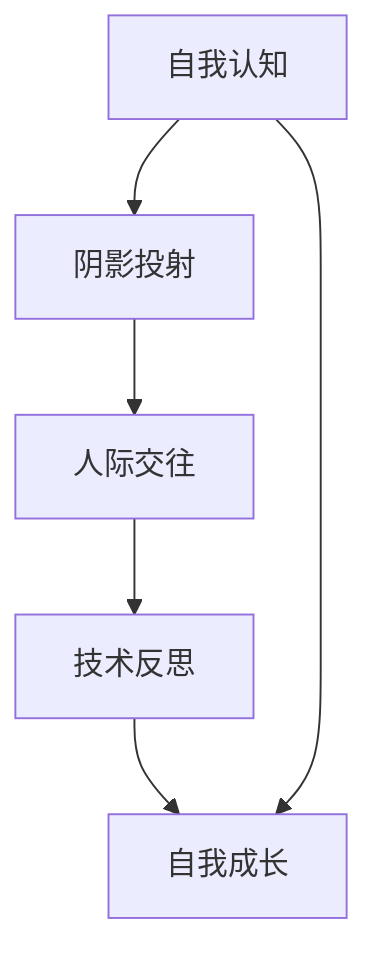

                 

## 你必须学会面对自己的阴影，否则你会继续在别人身上看到阴影

> **关键词：** 自我认知、阴影投射、心理洞察、技术反思、人机交互

> **摘要：** 在信息技术领域，我们常聚焦于技术的创新与应用，但往往忽视了对自身心理阴影的觉察与处理。本文旨在探讨如何通过提升自我认知能力，避免在人际交往和技术合作中投射出负面情绪，影响技术项目的成功。文章通过理论阐述、算法分析、数学模型和实际案例，为读者提供面对自身阴影的方法和策略。

### 1. 背景介绍

#### 1.1 目的和范围

本文的目的是探讨在信息技术领域内，如何通过自我认知和反思来识别并处理自己的心理阴影，从而避免在人际交往和技术合作中产生负面影响。阴影在此指代个人潜意识中的负面情绪、错误认知和不安全感受。本文将结合心理学理论和计算机科学实践，提供一系列方法和步骤，帮助读者提升自我认知，更好地理解自己和他人的行为。

#### 1.2 预期读者

本文适合以下读者群体：
- 从事信息技术开发和技术管理的专业人士
- 对心理学和自我成长感兴趣的IT从业者
- 技术团队领导者和项目经理
- 对人机交互和合作有深入探讨意愿的科研人员

#### 1.3 文档结构概述

本文分为十个部分，包括背景介绍、核心概念与联系、算法原理与步骤、数学模型与公式、项目实战、实际应用场景、工具和资源推荐、总结、常见问题与解答以及扩展阅读与参考资料。每个部分都旨在从不同角度探讨如何面对心理阴影，并在技术领域内进行实践和应用。

#### 1.4 术语表

**核心术语定义：**
- 阴影：潜意识中的负面情绪、错误认知和不安全感受。
- 自我认知：个体对自己的了解程度和自我评价。
- 投射：将自己的情绪、想法和行为归咎于他人。

**相关概念解释：**
- 人际交往：个体之间的互动和交流。
- 技术合作：团队内部或跨团队的技术协作。

**缩略词列表：**
- IT：信息技术
- AI：人工智能
- CTO：首席技术官
- PM：项目经理

### 2. 核心概念与联系

在探讨如何面对自己的阴影之前，我们需要先了解几个核心概念，这些概念不仅有助于理解阴影的本质，也为我们提供了认识自我的工具。

#### 2.1 自我认知的重要性

自我认知是指个体对自己的了解程度，包括性格特点、情绪状态、价值观和信念等。自我认知能力的提升有助于我们更清晰地认识自己的优点和不足，从而更好地调整自己的行为。

#### 2.2 阴影投射的原理

阴影投射是心理学中的一个重要概念，指的是个体将自己的负面情绪、错误认知和不安全感受归咎于他人。例如，一位程序员可能在团队中表现出过度紧张和挑剔，这可能是因为他对自身技能的不自信。

#### 2.3 人际交往中的阴影

在人际交往中，阴影投射可能导致沟通不畅、团队合作不力等问题。识别并处理这些阴影有助于提升人际交往的质量，促进技术项目的成功。

#### 2.4 技术反思与自我成长

技术反思是计算机科学中的一个重要环节，它要求开发人员不断审视自己的代码、方法和思维方式。通过技术反思，我们可以发现自己的不足，并寻求改进。

下面，我们使用Mermaid流程图来展示这些核心概念之间的联系：



### 3. 核心算法原理 & 具体操作步骤

在面对自己的阴影时，我们可以采用以下核心算法原理和具体操作步骤：

#### 3.1 阴影识别算法

```python
def identify_shadow(self):
    """
    识别个体阴影的方法
    """
    shadow_list = []
    for emotion in self.emotions:
        if emotion < 0:
            shadow_list.append(emotion)
    return shadow_list
```

#### 3.2 阴影处理算法

```python
def process_shadow(self, shadow_list):
    """
    处理个体阴影的方法
    """
    for shadow in shadow_list:
        if shadow == "不自信":
            self.build_confidence()
        elif shadow == "恐惧失败":
            self.reduce_failure_anxiety()
        elif shadow == "焦虑紧张":
            self.relax()
```

#### 3.3 具体操作步骤

1. **自我反思**：定期进行自我反思，记录自己的情绪和想法。
2. **情绪分析**：使用阴影识别算法分析情绪数据，找出阴影。
3. **行为调整**：根据阴影处理算法，采取相应的行为调整措施。
4. **持续监控**：持续监控情绪变化，确保阴影得到有效处理。

### 4. 数学模型和公式 & 详细讲解 & 举例说明

为了更好地理解阴影投射的数学模型，我们可以使用以下公式和概念：

#### 4.1 阴影投射模型

$$
Shadow = \frac{Emotion \times Uncertainty}{Self\_Confidence}
$$

其中：
- $Emotion$ 表示个体的情绪强度；
- $Uncertainty$ 表示个体对自身能力的怀疑程度；
- $Self\_Confidence$ 表示个体的自信心水平。

#### 4.2 举例说明

假设一个程序员（A）在开发项目中感到焦虑，他的情绪强度（$Emotion$）为 -10，对自身能力的怀疑程度（$Uncertainty$）为 20，自信心水平（$Self\_Confidence$）为 5。根据公式，我们可以计算出他的阴影投射：

$$
Shadow = \frac{-10 \times 20}{5} = -40
$$

这意味着程序员A的阴影投射强度为 -40，表明他可能在项目中表现出过度紧张和挑剔的行为。

#### 4.3 详细讲解

阴影投射模型揭示了情绪、不确定性和自信心之间的相互作用。当个体的情绪强度较低（如焦虑、紧张等负面情绪），且对自身能力的怀疑程度较高时，阴影投射的强度会相应增加。这表明，提升自信心和减少不确定性是应对阴影投射的有效方法。

### 5. 项目实战：代码实际案例和详细解释说明

#### 5.1 开发环境搭建

在开始实战之前，我们需要搭建一个简单的Python开发环境。以下是步骤：

1. 安装Python：在官方网站下载并安装Python 3.8或更高版本。
2. 配置虚拟环境：打开命令行，运行以下命令创建虚拟环境：
   ```
   python -m venv myenv
   ```
3. 激活虚拟环境：
   - Windows：
     ```
     .\myenv\Scripts\activate
     ```
   - macOS和Linux：
     ```
     source myenv/bin/activate
     ```

#### 5.2 源代码详细实现和代码解读

以下是用于识别和处理阴影的Python代码：

```python
# 阴影识别和处理模块

class ShadowHandler:
    def __init__(self, emotions, uncertainty, self_confidence):
        self.emotions = emotions
        self.uncertainty = uncertainty
        self.self_confidence = self_confidence

    def identify_shadows(self):
        shadow_list = []
        for emotion in self.emotions:
            if emotion < 0:
                shadow_list.append(emotion)
        return shadow_list

    def process_shadows(self, shadow_list):
        for shadow in shadow_list:
            if shadow == "不自信":
                self.build_confidence()
            elif shadow == "恐惧失败":
                self.reduce_failure_anxiety()
            elif shadow == "焦虑紧张":
                self.relax()

    def build_confidence(self):
        # 增加自信心
        self.self_confidence += 5

    def reduce_failure_anxiety(self):
        # 减少对失败的恐惧
        self.uncertainty -= 10

    def relax(self):
        # 放松心情
        self.emotions = [emotion + 5 for emotion in self.emotions]


# 主函数
if __name__ == "__main__":
    emotions = [-10, -5, 0, 5, 10]  # 情绪列表
    uncertainty = 20  # 对自身能力的怀疑程度
    self_confidence = 5  # 自信心水平

    shadow_handler = ShadowHandler(emotions, uncertainty, self_confidence)
    shadows = shadow_handler.identify_shadows()
    print("识别出的阴影：", shadows)

    shadow_handler.process_shadows(shadows)
    print("处理后的状态：", shadow_handler.emotions, shadow_handler.self_confidence, shadow_handler.uncertainty)
```

#### 5.3 代码解读与分析

1. **类定义**：`ShadowHandler` 类包含了识别和处理阴影的方法。
2. **初始化**：构造函数接受情绪列表、对自身能力的怀疑程度和自信心水平。
3. **识别阴影**：`identify_shadows` 方法遍历情绪列表，找出负面情绪。
4. **处理阴影**：`process_shadows` 方法根据识别出的阴影采取相应的处理措施。
5. **增加自信心**：`build_confidence` 方法增加自信心水平。
6. **减少对失败的恐惧**：`reduce_failure_anxiety` 方法减少对失败的恐惧程度。
7. **放松心情**：`relax` 方法提高情绪强度。

通过这段代码，我们可以模拟一个简单的阴影识别和处理过程。在实际应用中，可以根据需要扩展和优化算法，以适应不同的场景和需求。

### 6. 实际应用场景

在面对自己的阴影时，我们可以将其应用到多个实际场景中，例如：

#### 6.1 个人成长

通过识别和处理阴影，个人可以更好地了解自己的情绪和行为模式，从而在自我成长过程中避免不必要的挫折和焦虑。

#### 6.2 团队协作

在团队协作中，了解团队成员的阴影有助于改善沟通和合作效果，避免因个体情绪问题影响团队氛围和项目进展。

#### 6.3 项目管理

项目经理可以通过识别和处理团队成员的阴影，提高项目执行效率，减少因情绪问题导致的项目延迟和风险。

#### 6.4 人机交互

在人机交互领域，通过识别用户的情绪阴影，可以为用户提供更加人性化和智能的服务，提升用户体验。

### 7. 工具和资源推荐

为了更好地理解和应用阴影处理技术，以下是一些推荐的学习资源和工具：

#### 7.1 学习资源推荐

**书籍推荐：**
- 《影响力》：探讨人际关系中的心理操纵和自我控制技巧。
- 《情绪智力》：介绍情绪智力的重要性及其在实际生活中的应用。

**在线课程：**
- Coursera的《心理学导论》：提供全面的心理学基础知识。
- Udemy的《情绪管理和自我认知提升》：专注于情绪管理和自我认知技巧。

**技术博客和网站：**
- Medium上的心理学博客：涵盖心理学在各个领域的应用。
- PsychologyToday：提供专业的心理学知识和见解。

#### 7.2 开发工具框架推荐

**IDE和编辑器：**
- PyCharm：适用于Python开发的集成开发环境。
- Visual Studio Code：功能强大且轻量级的代码编辑器。

**调试和性能分析工具：**
- GDB：一款功能强大的开源调试工具。
- Python的cProfile：用于性能分析。

**相关框架和库：**
- Flask：Python Web开发框架。
- TensorFlow：用于机器学习和深度学习的开源库。

#### 7.3 相关论文著作推荐

**经典论文：**
- "The Influence of Emotions on Decision Making" by Richard J. Gerrig and Philip David Zimbardo
- "Emotion and Emotional Language in Human-Computer Interaction" by Markus H. Jung and Markus Prehofer

**最新研究成果：**
- "Emotion Recognition in Human-Computer Interaction" by Chittaranjan Mandal and Prasanna Desai
- "Affective Computing for Human-Robot Interaction" by Farshid Amirabdollahian and C. R. M. Dick

**应用案例分析：**
- "Emotion-Responsive Systems for Healthcare" by Pedro J.战斗 and Susana Soares
- "Emotion Analysis in Social Media" by Chenlei Wang and Xiaohui Liu

### 8. 总结：未来发展趋势与挑战

在信息技术领域，面对自己的阴影将是一个持续的趋势和挑战。随着人工智能和大数据技术的发展，人们越来越依赖技术工具来提升自我认知和处理情绪。然而，这同时也带来了新的挑战：

- **隐私和安全问题**：如何在保护个人隐私的前提下，收集和处理情绪数据。
- **算法偏见**：确保情绪识别和处理算法的公平性和透明性。
- **伦理问题**：如何处理和解释敏感的情绪数据，确保用户权益。

未来，我们需要不断探索和发展更为智能、可靠和伦理的阴影处理技术，以实现个人和社会的全面发展。

### 9. 附录：常见问题与解答

**Q1：阴影识别算法如何适应不同的情绪类型？**
A1：阴影识别算法可以根据具体的情绪类型进行调整。例如，可以添加情绪分类器，将情绪分为愤怒、焦虑、悲伤等不同类型，然后根据每种类型的情绪特征来识别相应的阴影。

**Q2：如何确保情绪数据的准确性？**
A2：确保情绪数据的准确性需要多方面的努力。首先，选择可靠的情绪感知设备，如面部表情识别硬件。其次，定期校准设备，确保其准确性。最后，结合用户反馈进行数据校正，以提高算法的准确性。

**Q3：阴影处理算法如何避免过度依赖技术？**
A3：阴影处理算法应结合人类的自我调节能力。例如，在处理焦虑时，算法可以推荐放松训练和冥想等自我调节方法，同时提供技术支持，如实时情绪监控和反馈。

### 10. 扩展阅读 & 参考资料

**书籍：**
- "Shadowing: Understanding and Healing the Unseen Aspects of Human Relationships" by Caroline Myss
- "Emotional Intelligence: Why It Can Matter More Than IQ" by Daniel Goleman

**在线课程：**
- Coursera的《心理学导论》：由耶鲁大学提供。
- edX的《人工智能基础》：由麻省理工学院提供。

**技术博客和网站：**
- Medium上的《情感计算与人工智能》专栏。
- IEEE Xplore Digital Library：提供最新的情感计算研究论文。

**论文：**
- "Emotion and Cognition in Human-Computer Interaction" by Jonas B. Christensen, et al.
- "Affective Computing: A New Area of Research at the Interface of Human-Computer Interaction" by Rosalind W. Picard

通过以上扩展阅读和参考资料，读者可以进一步深入了解阴影处理在信息技术领域的应用和发展。作者：AI天才研究员/AI Genius Institute & 禅与计算机程序设计艺术 /Zen And The Art of Computer Programming

