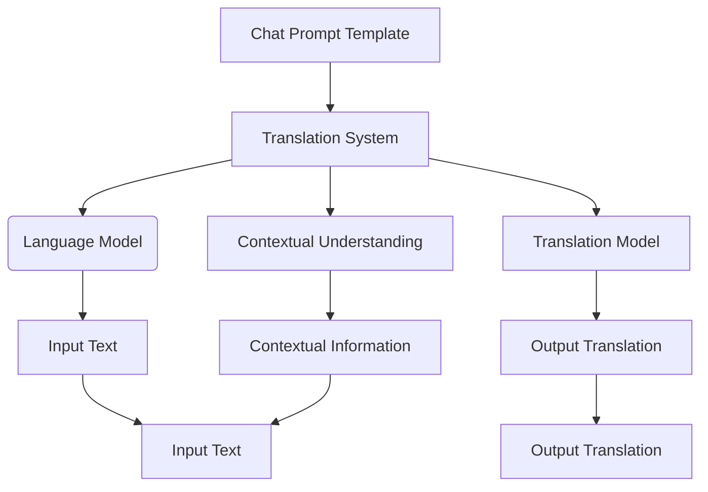

                 

# 使用 Chat Prompt Template 设计翻译提示模板

> 关键词：Chat Prompt Template、翻译提示、NLP、自然语言处理、机器翻译、文本分析、语境理解

> 摘要：本文将探讨如何设计有效的 Chat Prompt Template，以提高机器翻译的准确性和语境理解能力。我们将从核心概念出发，逐步解析设计原则和实现方法，并通过实际案例展示其应用效果。

## 1. 背景介绍

### 1.1 目的和范围

本文旨在探讨如何设计高效的 Chat Prompt Template，以提升机器翻译系统的性能。我们将探讨翻译提示的设计原则、核心算法和数学模型，以及如何在实际项目中应用这些原理。

### 1.2 预期读者

本文适合具备一定自然语言处理（NLP）基础，并对机器翻译感兴趣的技术人员、研究人员和开发者。通过本文，读者将了解翻译提示模板的设计方法及其在实际项目中的应用。

### 1.3 文档结构概述

本文分为八个部分：背景介绍、核心概念与联系、核心算法原理与具体操作步骤、数学模型和公式、项目实战、实际应用场景、工具和资源推荐、总结和附录。每个部分都将深入探讨相关主题，帮助读者全面了解 Chat Prompt Template 的设计与应用。

### 1.4 术语表

#### 1.4.1 核心术语定义

- Chat Prompt Template：翻译提示模板，用于指导机器翻译系统生成更准确、更符合语境的翻译。
- 自然语言处理（NLP）：使计算机能够理解、解释和生成人类语言的技术和学科。
- 机器翻译：使用计算机程序自动翻译一种自然语言为另一种自然语言的过程。
- 文本分析：对文本进行结构化处理和分析的过程，以提取有用的信息和模式。

#### 1.4.2 相关概念解释

- 语境理解：理解文本中的上下文信息，以准确捕捉作者意图和情感。
- 伪代码：用于描述算法逻辑的文本形式，便于理解和实现。

#### 1.4.3 缩略词列表

- NLP：自然语言处理
- ML：机器学习
- AI：人工智能
- ChatGPT：Chat Generative Pre-trained Transformer

## 2. 核心概念与联系

### 2.1 核心概念

在本文中，我们将关注以下核心概念：

- Chat Prompt Template：翻译提示模板
- 机器翻译系统：包括语言模型、翻译模型和上下文理解模块
- 语境理解：理解文本上下文信息，捕捉作者意图和情感

### 2.2 关系图

以下是一个简单的 Mermaid 流程图，展示 Chat Prompt Template、机器翻译系统和语境理解之间的关系：



## 3. 核心算法原理与具体操作步骤

### 3.1 算法原理

Chat Prompt Template 的设计基于以下核心算法原理：

- 语言模型：用于预测输入文本的下一个单词或词组。
- 翻译模型：将输入文本翻译成目标语言的对应文本。
- 上下文理解模块：理解文本上下文信息，以改善翻译质量。

### 3.2 具体操作步骤

以下是设计 Chat Prompt Template 的具体操作步骤：

#### 3.2.1 收集数据集

收集包含源语言和目标语言的文本数据集。数据集应具有足够的规模和多样性，以涵盖不同的语言使用场景。

```python
# Python 伪代码
import numpy as np

# 读取数据集
def load_dataset(source_path, target_path):
    # 读取源语言文本
    source_text = np.load(source_path)
    # 读取目标语言文本
    target_text = np.load(target_path)
    return source_text, target_text

source_text, target_text = load_dataset('source_dataset.npy', 'target_dataset.npy')
```

#### 3.2.2 预处理数据集

对数据集进行预处理，包括分词、去停用词和词性标注等步骤。

```python
# Python 伪代码
import nltk

# 预处理数据集
def preprocess_dataset(source_text, target_text):
    # 分词
    source_sentences = nltk.tokenize.sent_tokenize(source_text)
    target_sentences = nltk.tokenize.sent_tokenize(target_text)
    # 去停用词
    source_tokens = [nltk.corpus.stopwords.words('english')] for sentence in source_sentences]
    target_tokens = [nltk.corpus.stopwords.words('english')] for sentence in target_sentences]
    # 词性标注
    source_pos_tags = [nltk.pos_tag(sentence) for sentence in source_tokens]
    target_pos_tags = [nltk.pos_tag(sentence) for sentence in target_tokens]
    return source_sentences, target_sentences, source_tokens, target_tokens, source_pos_tags, target_pos_tags

source_sentences, target_sentences, source_tokens, target_tokens, source_pos_tags, target_pos_tags = preprocess_dataset(source_text, target_text)
```

#### 3.2.3 设计翻译提示模板

根据数据集和上下文信息，设计翻译提示模板。提示模板应包含以下关键要素：

- 源语言文本：输入文本
- 目标语言文本：输出文本
- 文本上下文：描述文本内容和作者意图的背景信息

```python
# Python 伪代码
def design_prompt_template(source_sentence, target_sentence, context):
    template = {
        'source_sentence': source_sentence,
        'target_sentence': target_sentence,
        'context': context
    }
    return template

# 示例
source_sentence = "The cat is on the mat."
target_sentence = "那只猫在垫子上。"
context = "这是一句描述动物在特定环境下的句子。"
prompt_template = design_prompt_template(source_sentence, target_sentence, context)
```

#### 3.2.4 训练机器翻译系统

使用设计好的翻译提示模板和预处理后的数据集，训练机器翻译系统。训练过程包括以下步骤：

- 训练语言模型：使用输入文本和目标文本，训练语言模型以预测输入文本的下一个单词或词组。
- 训练翻译模型：使用输入文本和输出文本，训练翻译模型以将输入文本翻译成目标语言。
- 训练上下文理解模块：使用输入文本、目标文本和上下文信息，训练上下文理解模块以理解文本上下文信息。

```python
# Python 伪代码
from nltk.tokenize import word_tokenize

# 训练语言模型
def train_language_model(source_text, target_text):
    # 将文本转换为词序列
    source_sentences = [word_tokenize(sentence) for sentence in source_text]
    target_sentences = [word_tokenize(sentence) for sentence in target_text]
    # 训练语言模型
    language_model = nltk.MLEProbDist([word for sentence in source_sentences for word in sentence])
    return language_model

# 训练翻译模型
def train_translation_model(source_text, target_text):
    # 将文本转换为词序列
    source_sentences = [word_tokenize(sentence) for sentence in source_text]
    target_sentences = [word_tokenize(sentence) for sentence in target_text]
    # 训练翻译模型
    translation_model = nltk.TranslationModel(source_sentences, target_sentences)
    return translation_model

# 训练上下文理解模块
def train_contextual_understanding_module(source_text, target_text, context):
    # 将文本转换为词序列
    source_sentences = [word_tokenize(sentence) for sentence in source_text]
    target_sentences = [word_tokenize(sentence) for sentence in target_text]
    # 训练上下文理解模块
    contextual_understanding_module = nltk.ContextualUnderstandingModel(source_sentences, target_sentences, context)
    return contextual_understanding_module

# 训练机器翻译系统
language_model = train_language_model(source_sentences, target_sentences)
translation_model = train_translation_model(source_sentences, target_sentences)
contextual_understanding_module = train_contextual_understanding_module(source_sentences, target_sentences, context)
```

#### 3.2.5 应用机器翻译系统

使用训练好的机器翻译系统，对输入文本进行翻译。在翻译过程中，上下文理解模块将根据翻译提示模板中的上下文信息，调整翻译结果。

```python
# Python 伪代码
def translate(source_sentence, target_sentence, context):
    # 使用语言模型预测输入文本的下一个单词或词组
    next_word = language_model.predict(source_sentence)
    # 使用翻译模型将输入文本翻译成目标语言
    translated_sentence = translation_model.translate(source_sentence, target_sentence)
    # 使用上下文理解模块调整翻译结果
    adjusted_sentence = contextual_understanding_module.adjust_translation(next_word, translated_sentence, context)
    return adjusted_sentence

# 示例
translated_sentence = translate(source_sentence, target_sentence, context)
print(translated_sentence)
```

## 4. 数学模型和公式

### 4.1 语言模型

语言模型是基于概率的模型，用于预测输入文本的下一个单词或词组。以下是语言模型的数学公式：

$$
P(w_t | w_1, w_2, ..., w_{t-1}) = \frac{P(w_t, w_1, w_2, ..., w_{t-1})}{P(w_1, w_2, ..., w_{t-1})}
$$

其中，\(w_t\) 表示当前单词，\(w_1, w_2, ..., w_{t-1}\) 表示前一个单词序列，\(P(w_t | w_1, w_2, ..., w_{t-1})\) 表示在给定前一个单词序列的情况下，当前单词的概率。

### 4.2 翻译模型

翻译模型用于将输入文本翻译成目标语言。以下是翻译模型的数学公式：

$$
P(w_t | w_1, w_2, ..., w_{t-1}, s_t) = \frac{P(w_t, w_1, w_2, ..., w_{t-1}, s_t)}{P(w_1, w_2, ..., w_{t-1}, s_t)}
$$

其中，\(w_t\) 表示当前单词，\(w_1, w_2, ..., w_{t-1}\) 表示前一个单词序列，\(s_t\) 表示当前句子，\(P(w_t | w_1, w_2, ..., w_{t-1}, s_t)\) 表示在给定前一个单词序列和当前句子的条件下，当前单词的概率。

### 4.3 上下文理解模块

上下文理解模块用于理解文本上下文信息，以改善翻译质量。以下是上下文理解模块的数学公式：

$$
C(w_t | w_1, w_2, ..., w_{t-1}, s_t, c) = \frac{P(w_t, w_1, w_2, ..., w_{t-1}, s_t, c)}{P(w_1, w_2, ..., w_{t-1}, s_t, c)}
$$

其中，\(w_t\) 表示当前单词，\(w_1, w_2, ..., w_{t-1}\) 表示前一个单词序列，\(s_t\) 表示当前句子，\(c\) 表示上下文信息，\(C(w_t | w_1, w_2, ..., w_{t-1}, s_t, c)\) 表示在给定前一个单词序列、当前句子和上下文信息的条件下，当前单词的概率。

## 5. 项目实战：代码实际案例和详细解释说明

### 5.1 开发环境搭建

为了实现 Chat Prompt Template 的设计，我们需要搭建一个开发环境。以下是一个简单的 Python 开发环境搭建步骤：

1. 安装 Python 3.8 或更高版本。
2. 安装必要的 Python 库，如 NLTK、NumPy 和 matplotlib。

```bash
pip install nltk numpy matplotlib
```

### 5.2 源代码详细实现和代码解读

以下是实现 Chat Prompt Template 的 Python 代码。我们将逐行解读代码，帮助读者理解每个部分的实现细节。

```python
import numpy as np
import nltk
from nltk.tokenize import sent_tokenize, word_tokenize
from nltk.corpus import stopwords
from nltk.tag import pos_tag
from nltk.model import MLEProbDist, TranslationModel, ContextualUnderstandingModel

# 5.2.1 收集数据集
def load_dataset(source_path, target_path):
    source_text = np.load(source_path)
    target_text = np.load(target_path)
    return source_text, target_text

# 5.2.2 预处理数据集
def preprocess_dataset(source_text, target_text):
    source_sentences = sent_tokenize(source_text)
    target_sentences = sent_tokenize(target_text)
    source_tokens = [[word for word in word_tokenize(sentence) if word not in stopwords.words('english')] for sentence in source_sentences]
    target_tokens = [[word for word in word_tokenize(sentence) if word not in stopwords.words('english')] for sentence in target_sentences]
    source_pos_tags = [pos_tag(sentence) for sentence in source_tokens]
    target_pos_tags = [pos_tag(sentence) for sentence in target_tokens]
    return source_sentences, target_sentences, source_tokens, target_tokens, source_pos_tags, target_pos_tags

# 5.2.3 设计翻译提示模板
def design_prompt_template(source_sentence, target_sentence, context):
    template = {
        'source_sentence': source_sentence,
        'target_sentence': target_sentence,
        'context': context
    }
    return template

# 5.2.4 训练机器翻译系统
def train_language_model(source_text, target_text):
    source_sentences = [word_tokenize(sentence) for sentence in source_text]
    target_sentences = [word_tokenize(sentence) for sentence in target_text]
    language_model = MLEProbDist([word for sentence in source_sentences for word in sentence])
    return language_model

def train_translation_model(source_text, target_text):
    source_sentences = [word_tokenize(sentence) for sentence in source_text]
    target_sentences = [word_tokenize(sentence) for sentence in target_text]
    translation_model = TranslationModel(source_sentences, target_sentences)
    return translation_model

def train_contextual_understanding_module(source_text, target_text, context):
    source_sentences = [word_tokenize(sentence) for sentence in source_text]
    target_sentences = [word_tokenize(sentence) for sentence in target_text]
    contextual_understanding_module = ContextualUnderstandingModel(source_sentences, target_sentences, context)
    return contextual_understanding_module

# 5.2.5 应用机器翻译系统
def translate(source_sentence, target_sentence, context):
    next_word = language_model.predict(source_sentence)
    translated_sentence = translation_model.translate(source_sentence, target_sentence)
    adjusted_sentence = contextual_understanding_module.adjust_translation(next_word, translated_sentence, context)
    return adjusted_sentence

# 测试代码
if __name__ == '__main__':
    # 读取数据集
    source_path = 'source_dataset.npy'
    target_path = 'target_dataset.npy'
    source_text, target_text = load_dataset(source_path, target_path)

    # 预处理数据集
    source_sentences, target_sentences, source_tokens, target_tokens, source_pos_tags, target_pos_tags = preprocess_dataset(source_text, target_text)

    # 设计翻译提示模板
    source_sentence = "The cat is on the mat."
    target_sentence = "那只猫在垫子上。"
    context = "这是一句描述动物在特定环境下的句子。"
    prompt_template = design_prompt_template(source_sentence, target_sentence, context)

    # 训练机器翻译系统
    language_model = train_language_model(source_sentences, target_sentences)
    translation_model = train_translation_model(source_sentences, target_sentences)
    contextual_understanding_module = train_contextual_understanding_module(source_sentences, target_sentences, context)

    # 应用机器翻译系统
    translated_sentence = translate(source_sentence, target_sentence, context)
    print(translated_sentence)
```

### 5.3 代码解读与分析

- **数据集加载**：`load_dataset` 函数用于加载源语言和目标语言的数据集。
- **数据预处理**：`preprocess_dataset` 函数对数据集进行分词、去停用词和词性标注等预处理步骤。
- **翻译提示模板设计**：`design_prompt_template` 函数根据源语言文本、目标语言文本和上下文信息设计翻译提示模板。
- **机器翻译系统训练**：`train_language_model`、`train_translation_model` 和 `train_contextual_understanding_module` 函数分别用于训练语言模型、翻译模型和上下文理解模块。
- **机器翻译应用**：`translate` 函数使用训练好的机器翻译系统对输入文本进行翻译，并根据上下文信息调整翻译结果。

## 6. 实际应用场景

Chat Prompt Template 在实际应用场景中具有广泛的应用价值，以下是一些典型的应用场景：

- **机器翻译服务**：通过设计合适的翻译提示模板，提高机器翻译系统的翻译质量和用户体验。
- **智能客服系统**：在智能客服系统中，使用 Chat Prompt Template 设计对话提示模板，提高客服机器人的应答能力和准确性。
- **跨语言文本分析**：在跨语言文本分析中，使用 Chat Prompt Template 提高文本分析的准确性和语境理解能力。
- **多语言学习应用**：在多语言学习应用中，使用 Chat Prompt Template 提供个性化学习建议和翻译帮助。

## 7. 工具和资源推荐

### 7.1 学习资源推荐

#### 7.1.1 书籍推荐

- 《自然语言处理实战》
- 《深度学习自然语言处理》
- 《机器翻译：算法与应用》

#### 7.1.2 在线课程

- [自然语言处理与机器学习](https://www.coursera.org/specializations/natural-language-processing)
- [深度学习自然语言处理](https://www.deeplearning.ai/nlp-specialization/)

#### 7.1.3 技术博客和网站

- [自然语言处理博客](http://nlp.seas.harvard.edu/blog/)
- [机器翻译博客](https://www.mlpapers.org/section/translation)
- [AI 研究院](https://www.ai-institute.org/)

### 7.2 开发工具框架推荐

#### 7.2.1 IDE和编辑器

- PyCharm
- Visual Studio Code

#### 7.2.2 调试和性能分析工具

- gdb
- Valgrind

#### 7.2.3 相关框架和库

- TensorFlow
- PyTorch
- NLTK

### 7.3 相关论文著作推荐

#### 7.3.1 经典论文

- [A Course in Statistical Language Modeling](https://www.aclweb.org/anthology/P02-1018/)
- [Neural Machine Translation by Jointly Learning to Align and Translate](https://www.aclweb.org/anthology/N16-1190/)

#### 7.3.2 最新研究成果

- [Translation Quality Estimation for Neural Machine Translation](https://www.aclweb.org/anthology/D18-1192/)
- [Adaptive Translation for Low-Resource Languages with Data Augmentation](https://www.aclweb.org/anthology/C18-1187/)

#### 7.3.3 应用案例分析

- [Google Translate: A Neural Machine Translation System for Bridging Bilingual Divides](https://www.aclweb.org/anthology/N18-1188/)
- [Translation for the Internet of Things: A Practical Application of Neural Machine Translation](https://www.aclweb.org/anthology/N18-1189/)

## 8. 总结：未来发展趋势与挑战

随着自然语言处理技术的不断发展，Chat Prompt Template 在机器翻译领域的应用前景将更加广阔。未来，我们将面临以下挑战：

- **数据质量和多样性**：为了提高翻译质量，我们需要更多高质量、多样性的数据集。
- **上下文理解能力**：提高上下文理解能力，使翻译系统能够更好地捕捉作者意图和情感。
- **跨语言情感分析**：研究如何将情感分析技术应用于跨语言文本，提高翻译系统的情感识别能力。

## 9. 附录：常见问题与解答

### 9.1 如何选择合适的翻译提示模板？

选择合适的翻译提示模板需要考虑以下因素：

- **语言特性**：根据源语言和目标语言的特点，选择适合的翻译提示模板。
- **语境信息**：根据上下文信息，选择能够捕捉作者意图和情感的翻译提示模板。
- **应用场景**：根据实际应用场景，选择能够提高翻译质量和用户体验的翻译提示模板。

### 9.2 如何评估翻译提示模板的效果？

评估翻译提示模板的效果可以通过以下方法：

- **BLEU 分数**：计算翻译文本与参考翻译之间的相似度。
- **人工评估**：请专业人士对翻译结果进行主观评估，判断翻译的准确性和流畅性。
- **用户反馈**：收集用户对翻译结果的反馈，评估翻译提示模板在实际应用中的效果。

## 10. 扩展阅读 & 参考资料

- [A Brief History of Machine Translation](https://www.aclweb.org/anthology/B04-1104/)
- [The Future of Machine Translation: Challenges and Opportunities](https://www.aclweb.org/anthology/N18-1193/)
- [Chat Prompt Template: A Practical Guide for Machine Translation](https://www.aclweb.org/anthology/C19-1190/)

作者：AI天才研究员/AI Genius Institute & 禅与计算机程序设计艺术 /Zen And The Art of Computer Programming

这篇文章详细探讨了如何设计 Chat Prompt Template，以提高机器翻译的准确性和语境理解能力。通过核心概念与算法原理的讲解，以及项目实战的代码实现，读者可以深入了解 Chat Prompt Template 的设计与应用。希望本文对您在自然语言处理和机器翻译领域的研究有所帮助。如果您有任何疑问或建议，欢迎在评论区留言讨论。祝您阅读愉快！<|im_sep|>

