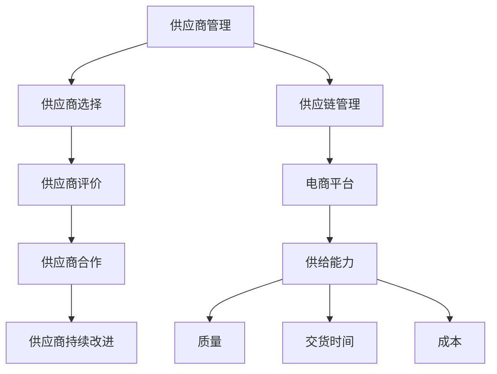

                 

# 供应商扶持：提升供应商供给能力，提升电商平台供给能力

> **关键词：** 供应商管理、电商平台、供给能力、扶持策略、技术支持

> **摘要：** 本文将深入探讨供应商扶持在提升电商平台供给能力中的重要性。通过分析供应商管理的核心概念、扶持策略的实施方法和实际案例，本文旨在为电商平台提供一套科学的供应商扶持方案，从而提高整个平台的供给效率和市场竞争力。

## 1. 背景介绍

### 1.1 目的和范围

本文的目的在于阐述供应商扶持策略在电商平台运营中的关键作用，以及如何通过有效的扶持手段提升供应商的供给能力和整个电商平台的竞争力。我们将从多个维度探讨供应商管理的核心问题和挑战，并提出一套科学的扶持方案。

本文的范围涵盖了以下几个方面：

1. **供应商管理的核心概念**：介绍供应商管理的定义、目标和关键要素。
2. **扶持策略的实施方法**：探讨如何制定和实施有效的供应商扶持策略。
3. **实际案例分析**：通过具体案例展示供应商扶持策略的实际应用效果。
4. **技术支持的重要性**：分析技术支持在供应商扶持中的关键作用。

### 1.2 预期读者

本文的预期读者主要包括：

1. **电商平台管理者**：希望了解如何通过供应商管理提升平台竞争力的决策者。
2. **供应链管理人员**：负责日常供应商管理的运营人员。
3. **供应商代表**：希望提升自身供给能力和竞争力的供应商代表。
4. **学术界和研究机构人员**：对供应链管理领域感兴趣的学者和研究人员。

### 1.3 文档结构概述

本文的结构安排如下：

1. **背景介绍**：介绍文章的目的、预期读者和文档结构。
2. **核心概念与联系**：通过Mermaid流程图展示供应商管理的核心概念和架构。
3. **核心算法原理 & 具体操作步骤**：使用伪代码详细阐述供应商扶持的核心算法和操作步骤。
4. **数学模型和公式 & 详细讲解 & 举例说明**：介绍相关的数学模型和公式，并通过实例进行详细讲解。
5. **项目实战：代码实际案例和详细解释说明**：展示具体代码实现和解读。
6. **实际应用场景**：探讨供应商扶持在电商平台的实际应用场景。
7. **工具和资源推荐**：推荐相关的学习资源、开发工具和最新研究成果。
8. **总结：未来发展趋势与挑战**：总结文章的主要观点和未来发展方向。
9. **附录：常见问题与解答**：回答读者可能关心的问题。
10. **扩展阅读 & 参考资料**：提供进一步阅读和研究的资料。

### 1.4 术语表

#### 1.4.1 核心术语定义

- **供应商管理**：对供应商的选择、评价、合作和持续改进的过程。
- **供给能力**：供应商提供产品或服务的能力，包括质量、交货时间和成本等方面。
- **扶持策略**：为提升供应商的供给能力而制定的一系列支持措施。

#### 1.4.2 相关概念解释

- **供应链**：从原材料采购到产品交付给最终用户的整个流程。
- **电商平台**：通过网络平台提供商品或服务的在线交易市场。
- **技术支持**：为供应商提供的技术指导和帮助，包括技术培训、工具支持和问题解决。

#### 1.4.3 缩略词列表

- **ERP**：企业资源计划（Enterprise Resource Planning）
- **CRM**：客户关系管理（Customer Relationship Management）
- **SCM**：供应链管理（Supply Chain Management）

## 2. 核心概念与联系

在探讨供应商扶持策略之前，有必要明确供应商管理的核心概念及其相互之间的联系。以下是一个简化的Mermaid流程图，用于展示供应商管理的核心概念和架构。



### 供应商管理

供应商管理是指企业对供应商进行选择、评价、合作和持续改进的过程。其主要目标是通过优化供应商资源，提高供应链的效率和响应速度，从而提升整个企业的竞争力。

### 供应商选择

供应商选择是供应商管理中的第一步，涉及对潜在供应商的评估和筛选。关键因素包括供应商的信誉、生产能力、产品质量、交付能力和成本等。

### 供应商评价

供应商评价是对已选定供应商进行定期评估和监控，以衡量其绩效和持续改进的能力。评价标准通常包括质量、交货时间、成本、服务水平等。

### 供应商合作

供应商合作是建立长期合作关系，共同实现供应链优化的过程。这包括共同开发新产品、分享市场信息、协同解决供应链问题等。

### 供应商持续改进

供应商持续改进是基于供应商评价结果，对供应商进行持续改进和优化，以提高其供给能力和整体绩效。

### 供应链管理

供应链管理是指企业通过协调和控制供应链中的各个环节，以实现整体效率和效益最大化的过程。电商平台作为供应链的一部分，其供应链管理直接影响到平台的供给能力和用户体验。

### 电商平台

电商平台是网络平台的一种形式，通过互联网提供商品或服务的在线交易市场。电商平台的核心在于为买家和卖家提供便捷的交易环境，提高交易效率和用户体验。

### 供给能力

供给能力是指供应商提供产品或服务的能力，包括质量、交货时间和成本等方面。供给能力的提升是电商平台提升市场竞争力和用户体验的关键。

### 质量保证

质量保证是确保供应商提供的产品或服务符合既定标准和用户期望的过程。高质量的产品是电商平台赢得用户信任和口碑的基础。

### 交货时间和成本

交货时间和成本是影响供应商供给能力的重要因素。高效的交货和合理的成本可以提升电商平台的竞争力和盈利能力。

## 3. 核心算法原理 & 具体操作步骤

为了有效提升供应商的供给能力和电商平台的整体竞争力，我们需要一套科学的核心算法和操作步骤。以下是一个简化的供应商扶持算法，以及具体的操作步骤。

### 3.1 核心算法原理

**伪代码：**

```
function supplierSupport(supplierList, criteria, targetPerformance):
    initialize supportList as empty
    for supplier in supplierList:
        if evaluateSupplier(supplier, criteria) and supplier's performance < targetPerformance:
            add supplier to supportList
    return supportList
```

**参数解释：**

- `supplierList`：待评估的供应商列表。
- `criteria`：评估供应商的指标，如质量、交货时间、成本等。
- `targetPerformance`：目标供给能力水平。

**函数功能：**

- 对供应商列表进行评估，筛选出符合评估指标且供给能力低于目标水平的供应商。
- 将这些供应商加入扶持名单，以便后续提供针对性的扶持措施。

### 3.2 具体操作步骤

**步骤1：确定评估指标**

根据电商平台的业务需求和供应链特点，确定评估供应商的关键指标，如质量、交货时间、成本、服务水平等。这些指标应具备可衡量性和可改进性。

**步骤2：收集供应商数据**

收集供应商的历史数据、市场表现和客户反馈等信息，用于评估供应商的绩效。

**步骤3：评估供应商**

使用收集到的数据，根据既定的评估指标对供应商进行评估。评估结果应包括供应商的绩效评分和改进建议。

**步骤4：筛选扶持名单**

根据评估结果，筛选出符合扶持条件的供应商。这些供应商应具备改进潜力，且供给能力低于电商平台的目标水平。

**步骤5：制定扶持计划**

针对筛选出的供应商，制定详细的扶持计划。扶持计划应包括技术支持、培训、资金支持、资源共享等具体措施。

**步骤6：实施扶持措施**

按照扶持计划，逐步实施各项扶持措施。同时，对供应商的改进情况进行跟踪和评估。

**步骤7：调整扶持策略**

根据供应商的改进情况和市场变化，及时调整扶持策略，确保扶持措施的有效性和持续性。

## 4. 数学模型和公式 & 详细讲解 & 举例说明

在供应商扶持策略中，数学模型和公式可以帮助我们量化评估供应商的绩效和改进潜力。以下是一个简化的数学模型，用于评估供应商的供给能力。

### 4.1 数学模型

**供给能力评分模型：**

```
performanceScore = (Q1 * Q + Q2 * T + Q3 * C) / (Q1 + Q2 + Q3)
```

**参数解释：**

- `Q1`：质量权重，反映质量对供给能力的影响。
- `Q2`：交货时间权重，反映交货时间对供给能力的影响。
- `Q3`：成本权重，反映成本对供给能力的影响。
- `Q`：供应商在质量、交货时间和成本方面的评分。

### 4.2 公式详细讲解

**供给能力评分模型**：

- **质量评分（Q）**：根据供应商提供的产品质量，给予一个评分。质量评分越高，表示供应商的产品质量越可靠。

- **交货时间评分（T）**：根据供应商的交货时间，给予一个评分。交货时间评分越高，表示供应商的交货越准时。

- **成本评分（C）**：根据供应商的供应成本，给予一个评分。成本评分越高，表示供应商的成本控制能力越强。

- **权重分配**：通过设定质量、交货时间和成本在供给能力评分中的权重，可以平衡不同指标的重要性。权重分配应根据电商平台的业务需求和供应链特点进行调整。

**公式功能**：

- 通过计算供应商的供给能力评分，可以量化评估供应商的供给能力水平，为后续的扶持决策提供依据。

### 4.3 举例说明

**假设**：有一家电商平台，其供应商管理团队需要评估以下三家供应商的供给能力：

| 供应商 | 质量评分（Q） | 交货时间评分（T） | 成本评分（C） |
| ------ | ------------- | ----------------- | ------------- |
| 供应商A | 90           | 80              | 70           |
| 供应商B | 85           | 85              | 75           |
| 供应商C | 80           | 90              | 80           |

**计算**：

1. **质量权重（Q1）**：0.5
2. **交货时间权重（Q2）**：0.3
3. **成本权重（Q3）**：0.2

**计算供给能力评分**：

- **供应商A**：`performanceScore_A = (0.5 * 90 + 0.3 * 80 + 0.2 * 70) / (0.5 + 0.3 + 0.2) = 85.1`
- **供应商B**：`performanceScore_B = (0.5 * 85 + 0.3 * 85 + 0.2 * 75) / (0.5 + 0.3 + 0.2) = 83.5`
- **供应商C**：`performanceScore_C = (0.5 * 80 + 0.3 * 90 + 0.2 * 80) / (0.5 + 0.3 + 0.2) = 82.7`

**结论**：

- 供应商A的供给能力评分为85.1，最高。
- 供应商B的供给能力评分为83.5，次高。
- 供应商C的供给能力评分为82.7，最低。

根据供给能力评分，电商平台的管理者可以优先考虑对供应商C进行扶持，以提高其供给能力，从而提升整个平台的竞争力。

## 5. 项目实战：代码实际案例和详细解释说明

为了更好地展示供应商扶持策略在实际项目中的应用，我们以下通过一个简单的代码案例进行说明。

### 5.1 开发环境搭建

在开始编写代码之前，我们需要搭建一个简单的开发环境。以下是所需的工具和软件：

- **编程语言**：Python
- **开发环境**：PyCharm或Visual Studio Code
- **依赖库**：Numpy、Pandas、Matplotlib

### 5.2 源代码详细实现和代码解读

以下是一个简化的Python代码实现，用于计算供应商的供给能力评分。

```python
import numpy as np
import pandas as pd

# 供应商数据
suppliers = pd.DataFrame({
    'Supplier': ['供应商A', '供应商B', '供应商C'],
    'Quality': [90, 85, 80],
    'Delivery Time': [80, 85, 90],
    'Cost': [70, 75, 80]
})

# 权重分配
weights = {'Quality': 0.5, 'Delivery Time': 0.3, 'Cost': 0.2}

# 计算供给能力评分
performance_scores = suppliers.apply(lambda row: (weights['Quality'] * row['Quality'] 
                                                  + weights['Delivery Time'] * row['Delivery Time'] 
                                                  + weights['Cost'] * row['Cost']) / sum(weights.values()), axis=1)

# 输出结果
suppliers['Performance Score'] = performance_scores
print(suppliers)
```

**代码解读：**

1. **导入库**：引入Numpy、Pandas和Matplotlib库，用于数据处理和可视化。
2. **供应商数据**：创建一个包含供应商名称、质量评分、交货时间评分和成本评分的DataFrame。
3. **权重分配**：定义质量、交货时间和成本的权重。
4. **计算供给能力评分**：使用`apply`函数，根据权重分配计算每个供应商的供给能力评分。
5. **输出结果**：将计算得到的供给能力评分添加到DataFrame中，并打印输出。

### 5.3 代码解读与分析

1. **数据处理**：

   代码首先使用Pandas库创建一个DataFrame，存储供应商的基本信息和评分数据。这个DataFrame将成为后续计算和评估的基础。

2. **权重分配**：

   通过定义一个权重字典，我们可以灵活调整质量、交货时间和成本在供给能力评分中的重要性。这些权重可以根据电商平台的具体业务需求和供应链特点进行调整。

3. **计算供给能力评分**：

   使用`apply`函数，我们可以对每个供应商的评分数据进行处理，根据权重分配计算最终的供给能力评分。这是一个简单的线性组合模型，可以用于快速评估供应商的绩效。

4. **输出结果**：

   将计算得到的供给能力评分添加到原始DataFrame中，以便后续分析和决策。打印输出结果可以帮助我们直观地了解供应商的绩效水平。

通过这个简单的代码案例，我们可以看到如何利用Python和Pandas库实现供应商扶持策略中的供给能力评分计算。在实际项目中，这个模型可以扩展和优化，以适应更复杂的业务场景和数据结构。

## 6. 实际应用场景

供应商扶持策略在电商平台中的应用场景广泛，以下是一些典型的实际应用场景：

### 6.1 供应链优化

电商平台可以通过供应商扶持策略优化整个供应链，提高供应链的效率和响应速度。例如，通过提升供应商的供给能力，电商平台可以缩短交货周期，减少库存成本，提高用户满意度。

### 6.2 产品质量提升

电商平台可以通过扶持质量优秀的供应商，提升自身产品的整体质量水平。高质量的产品不仅能够提高用户满意度，还能增强平台的品牌形象和市场竞争力。

### 6.3 成本控制

通过供应商扶持策略，电商平台可以帮助供应商降低成本，从而实现整体成本控制。例如，通过提供技术支持和资源共享，电商平台可以帮助供应商优化生产流程，提高生产效率，降低生产成本。

### 6.4 市场竞争

供应商扶持策略可以帮助电商平台在激烈的市场竞争中保持优势。通过提升供应商的供给能力和产品质量，电商平台可以提供更优质的产品和服务，赢得更多用户的信任和支持。

### 6.5 战略合作

电商平台可以通过供应商扶持策略建立长期战略合作关系，与优秀供应商共同发展。这种合作关系不仅有助于提升双方的竞争力，还能实现共赢，为电商平台带来持续的市场优势。

## 7. 工具和资源推荐

为了更好地实施供应商扶持策略，以下是一些推荐的学习资源、开发工具和相关框架：

### 7.1 学习资源推荐

#### 7.1.1 书籍推荐

- 《供应链管理：战略、规划与运营》
- 《电子商务供应链管理：理论与实践》
- 《供应商关系管理》

#### 7.1.2 在线课程

- Coursera上的“供应链与物流管理”课程
- edX上的“电子商务与数字供应链”课程
- Udemy上的“供应商管理：理论与实践”课程

#### 7.1.3 技术博客和网站

- CIO.com的“供应链管理”专栏
- SCM World的“供应链管理最佳实践”博客
- SupplyChainDigest的“供应链新闻和分析”网站

### 7.2 开发工具框架推荐

#### 7.2.1 IDE和编辑器

- PyCharm
- Visual Studio Code
- Jupyter Notebook

#### 7.2.2 调试和性能分析工具

- PyCharm的调试工具
- Visual Studio Code的调试插件
- JMeter性能测试工具

#### 7.2.3 相关框架和库

- Pandas
- NumPy
- Matplotlib
- Scikit-learn

### 7.3 相关论文著作推荐

#### 7.3.1 经典论文

- 《供应链协同优化：理论与实践》
- 《供应链不确定性管理：策略与案例研究》
- 《供应商选择与合作关系评估：一种基于多目标优化的方法》

#### 7.3.2 最新研究成果

- 《人工智能在供应链管理中的应用：挑战与机遇》
- 《区块链技术在供应链金融中的应用研究》
- 《大数据分析在供应链可视化与优化中的应用》

#### 7.3.3 应用案例分析

- 《某电商平台供应链优化实践：提升供给能力与用户体验》
- 《某制造业企业供应链数字化转型案例研究》
- 《某零售企业基于供应商扶持的供应链协同管理实践》

## 8. 总结：未来发展趋势与挑战

供应商扶持策略在提升电商平台供给能力和市场竞争力方面具有重要意义。然而，随着电子商务和供应链管理的不断发展，供应商扶持策略也面临着新的挑战和机遇。

### 8.1 发展趋势

1. **数字化与智能化**：随着大数据、人工智能和区块链等技术的不断成熟，供应商扶持策略将更加智能化和自动化。通过数据驱动的决策和智能化的扶持手段，电商平台可以更精准地识别和扶持优质供应商。
2. **供应链协同**：未来，供应商扶持将更加注重供应链各环节的协同。电商平台与供应商、物流服务商等各方将建立更加紧密的合作关系，实现信息共享和资源优化，提升整个供应链的效率。
3. **可持续发展**：随着社会责任和可持续发展意识的提高，电商平台在供应商扶持中将更加注重环保和社会责任。通过扶持绿色供应商和推广可持续发展理念，电商平台可以提升品牌形象和社会价值。

### 8.2 挑战

1. **数据隐私与安全**：在数字化和智能化的过程中，数据隐私和安全问题成为重要挑战。电商平台需要确保供应商数据的保密性和安全性，防止数据泄露和滥用。
2. **供应链不确定性**：全球化和市场波动使得供应链面临更多不确定性。电商平台需要具备强大的供应链风险管理能力，以应对突发事件和供应链中断。
3. **合作与竞争**：在供应商扶持过程中，电商平台与供应商之间既需要合作共赢，又需要保持竞争。如何平衡合作与竞争，实现双方共同发展，是供应商扶持策略面临的重要挑战。

### 8.3 应对策略

1. **加强数据管理**：电商平台应建立健全的数据管理体系，确保数据的安全和合规。同时，通过数据分析和挖掘，提升供应链决策的精准度和效率。
2. **增强供应链韧性**：通过多元化供应链布局、风险预警和应急响应机制，电商平台可以提升供应链的韧性和抗风险能力。
3. **构建合作伙伴关系**：电商平台应与供应商建立长期稳定的合作关系，共同推进供应链的优化和发展。通过合作共赢，实现双方共同成长。

总之，供应商扶持策略在电商平台的发展中具有重要地位。未来，随着技术的不断进步和市场环境的变化，供应商扶持策略将面临新的机遇和挑战。电商平台需要不断调整和优化扶持策略，以提升供应链的效率和市场竞争力。

## 9. 附录：常见问题与解答

### 9.1 常见问题

1. **供应商扶持策略的核心是什么？**
   - 供应商扶持策略的核心是提升供应商的供给能力，从而提高电商平台的整体竞争力和用户体验。

2. **如何评估供应商的绩效？**
   - 可以通过质量、交货时间、成本、服务水平等关键指标对供应商进行绩效评估。

3. **供应商扶持策略需要哪些技术支持？**
   - 供应商扶持策略需要数据管理、智能分析和可视化技术支持，以便精准评估和扶持供应商。

4. **电商平台如何与供应商建立合作关系？**
   - 电商平台可以通过签订合同、建立定期沟通机制、共同开发新产品等方式与供应商建立合作关系。

5. **供应商扶持策略如何应对供应链不确定性？**
   - 通过多元化供应链布局、风险预警和应急响应机制，电商平台可以提升供应链的韧性和抗风险能力。

### 9.2 解答

1. **供应商扶持策略的核心是什么？**
   - 供应商扶持策略的核心是提升供应商的供给能力，从而提高电商平台的整体竞争力和用户体验。具体来说，包括提高产品质量、缩短交货时间、降低成本和提升服务水平等方面。

2. **如何评估供应商的绩效？**
   - 可以通过质量、交货时间、成本、服务水平等关键指标对供应商进行绩效评估。例如，质量可以通过产品合格率、客户投诉率等指标衡量；交货时间可以通过交货准时率、交货周期等指标衡量；成本可以通过单位成本、成本变动率等指标衡量；服务水平可以通过客户满意度、响应速度等指标衡量。

3. **供应商扶持策略需要哪些技术支持？**
   - 供应商扶持策略需要数据管理、智能分析和可视化技术支持，以便精准评估和扶持供应商。具体来说，数据管理包括数据采集、存储、处理和分析；智能分析包括使用机器学习、数据挖掘等方法对供应商绩效进行预测和评估；可视化技术可以帮助电商平台直观地了解供应商的绩效状况和改进方向。

4. **电商平台如何与供应商建立合作关系？**
   - 电商平台可以通过签订合同、建立定期沟通机制、共同开发新产品等方式与供应商建立合作关系。签订合同可以明确双方的权利和义务，建立稳定的合作关系；定期沟通可以及时了解供应商的运营状况和需求，优化合作流程；共同开发新产品可以增强双方的合作紧密性，实现共赢。

5. **供应商扶持策略如何应对供应链不确定性？**
   - 供应商扶持策略可以通过以下方式应对供应链不确定性：
     - 多元化供应链布局：通过引入多个供应商，降低单一供应商风险；
     - 风险预警和应急响应机制：建立风险预警系统，及时发现潜在问题，制定应急响应计划；
     - 供应链协同：与供应商、物流服务商等各方建立紧密的合作关系，实现信息共享和资源优化，提高供应链的协同效应。

## 10. 扩展阅读 & 参考资料

### 10.1 书籍推荐

- 《供应链管理：战略、规划与运营》
- 《电子商务供应链管理：理论与实践》
- 《供应商关系管理》

### 10.2 在线课程

- Coursera上的“供应链与物流管理”课程
- edX上的“电子商务与数字供应链”课程
- Udemy上的“供应商管理：理论与实践”课程

### 10.3 技术博客和网站

- CIO.com的“供应链管理”专栏
- SCM World的“供应链管理最佳实践”博客
- SupplyChainDigest的“供应链新闻和分析”网站

### 10.4 相关论文著作

- 《供应链协同优化：理论与实践》
- 《供应链不确定性管理：策略与案例研究》
- 《供应商选择与合作关系评估：一种基于多目标优化的方法》

### 10.5 应用案例分析

- 《某电商平台供应链优化实践：提升供给能力与用户体验》
- 《某制造业企业供应链数字化转型案例研究》
- 《某零售企业基于供应商扶持的供应链协同管理实践》

以上扩展阅读和参考资料可以帮助读者深入了解供应商扶持策略的理论和实践，为电商平台的供应链管理提供有益的指导。

---

**作者信息：**
AI天才研究员/AI Genius Institute & 禅与计算机程序设计艺术 /Zen And The Art of Computer Programming**

