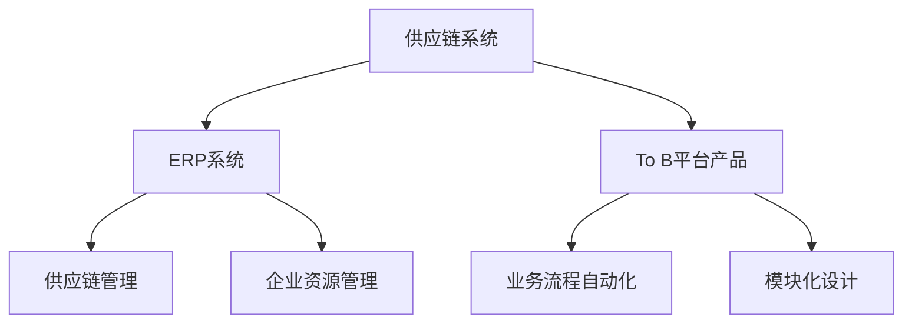

                 

### 1. 背景介绍

#### 1.1 目的和范围

本文旨在深入探讨供应链系统、ERP系统、To B平台产品架构设计的核心概念、原理及其实际应用。供应链系统是现代企业管理中至关重要的一部分，而ERP系统则是对企业资源进行全面整合的综合性管理工具。To B平台产品架构设计则是针对企业客户的需求，提供的专业化服务与解决方案。

本文将从以下四个方面展开：

1. **核心概念与联系**：通过Mermaid流程图展示供应链系统、ERP系统和To B平台产品架构的核心概念及相互联系。
2. **核心算法原理 & 具体操作步骤**：深入分析供应链系统的算法原理，并提供具体的操作步骤和伪代码。
3. **数学模型和公式 & 详细讲解 & 举例说明**：详细阐述供应链优化问题的数学模型及公式，并通过实例进行说明。
4. **项目实战：代码实际案例和详细解释说明**：通过实际项目代码，展示供应链系统、ERP系统和To B平台产品架构的具体实现。

通过本文的阅读，读者将能够：

- 理解供应链系统、ERP系统和To B平台产品架构的核心概念。
- 掌握供应链系统的算法原理和操作步骤。
- 了解供应链优化问题的数学模型和解决方案。
- 看到实际项目中的具体实现，为未来的研究和开发提供参考。

#### 1.2 预期读者

本文适合以下读者群体：

- **企业信息化管理人员**：对供应链系统、ERP系统和To B平台有深入理解和实际操作经验。
- **软件开发工程师**：对供应链系统和企业资源管理有兴趣，希望了解技术实现细节。
- **数据分析师**：对数据驱动的供应链优化和决策支持系统感兴趣。
- **学术界研究人员**：关注供应链管理、ERP系统、To B平台等领域的最新研究动态。

无论您属于哪个群体，本文都将为您提供有价值的见解和指导。

#### 1.3 文档结构概述

本文的结构如下：

- **第1部分：背景介绍**：介绍本文的目的、范围、预期读者以及文档结构。
- **第2部分：核心概念与联系**：通过Mermaid流程图展示供应链系统、ERP系统和To B平台产品架构的核心概念及相互联系。
- **第3部分：核心算法原理 & 具体操作步骤**：详细分析供应链系统的算法原理，并提供具体的操作步骤和伪代码。
- **第4部分：数学模型和公式 & 详细讲解 & 举例说明**：阐述供应链优化问题的数学模型及公式，并通过实例进行说明。
- **第5部分：项目实战：代码实际案例和详细解释说明**：通过实际项目代码，展示供应链系统、ERP系统和To B平台产品架构的具体实现。
- **第6部分：实际应用场景**：分析供应链系统、ERP系统和To B平台产品在不同行业和业务场景中的应用。
- **第7部分：工具和资源推荐**：推荐学习资源、开发工具框架和论文著作。
- **第8部分：总结：未来发展趋势与挑战**：总结本文的主要内容，并提出未来发展的趋势与挑战。
- **第9部分：附录：常见问题与解答**：提供常见问题的解答。
- **第10部分：扩展阅读 & 参考资料**：推荐相关扩展阅读和参考资料。

通过本文的阅读，您将全面了解供应链系统、ERP系统和To B平台产品架构设计的方方面面。

#### 1.4 术语表

为了确保本文的可读性和一致性，以下列出了一些核心术语及其定义：

##### 1.4.1 核心术语定义

- **供应链系统**：企业中用于管理物料、信息、资金流动的系统。
- **ERP系统**：企业资源规划系统，用于整合企业内部各项业务流程。
- **To B平台产品**：针对企业客户需求的平台化产品和服务。
- **供应链管理**：通过协调供应链各环节，实现资源的最优配置。
- **供应链优化**：通过算法和数学模型，找到最优的供应链配置方案。
- **供应链节点**：供应链中的各个环节，如供应商、制造商、分销商等。

##### 1.4.2 相关概念解释

- **企业资源管理**：对企业的各种资源进行优化配置和利用，以提高企业效率和竞争力。
- **业务流程管理**：对企业业务流程进行设计、执行、监控和改进。
- **数据驱动的决策**：基于数据分析和预测，做出合理的商业决策。

##### 1.4.3 缩略词列表

- **ERP**：企业资源规划（Enterprise Resource Planning）
- **SCM**：供应链管理（Supply Chain Management）
- **To B**：面向企业（Business-to-Business）
- **API**：应用程序接口（Application Programming Interface）
- **DB**：数据库（Database）

通过上述术语表，读者可以更好地理解本文中涉及的专业术语和概念，从而加深对文章内容的理解。

### 2. 核心概念与联系

#### 2.1 供应链系统的核心概念

供应链系统是企业中用于管理物料、信息、资金流动的系统。它涵盖了从供应商到最终用户的整个供应链过程。供应链系统的主要目标是通过优化供应链各个环节，实现资源的最优配置，提高企业的运营效率和竞争力。

供应链系统的核心概念包括：

1. **供应链节点**：供应链中的各个环节，如供应商、制造商、分销商和零售商等。
2. **供应链管理**：对供应链各环节进行协调和优化，以实现资源的最优配置。
3. **物料管理**：对物料进行采购、存储、配送等全过程管理。
4. **信息流管理**：对供应链各节点之间的信息流动进行监控和管理。
5. **资金流管理**：对供应链各节点的资金流动进行监控和管理。

#### 2.2 ERP系统的核心概念

ERP系统是企业资源规划系统，用于整合企业内部各项业务流程。它将企业的财务、人力资源、生产管理、销售管理、采购管理等多个模块整合在一起，实现企业资源的全面管理和优化。

ERP系统的核心概念包括：

1. **企业资源管理**：对企业的人力、物力、财力等资源进行优化配置和利用。
2. **业务流程管理**：对企业的各项业务流程进行设计、执行、监控和改进。
3. **数据集成**：将企业内部各系统的数据进行集成和共享，实现信息的一体化管理。
4. **供应链管理**：通过ERP系统实现对供应链各个环节的监控和管理。
5. **客户关系管理**：通过ERP系统实现对客户信息的管理和服务。

#### 2.3 To B平台产品的核心概念

To B平台产品是针对企业客户需求的平台化产品和服务。它通过提供标准化的模块和接口，帮助企业客户实现业务流程的自动化和优化。

To B平台产品的核心概念包括：

1. **业务流程自动化**：通过To B平台产品，实现企业业务流程的自动化处理，减少人工干预。
2. **模块化设计**：To B平台产品通常采用模块化设计，满足企业不同的业务需求。
3. **接口标准化**：To B平台产品提供标准化的接口，方便企业系统集成和扩展。
4. **数据分析与决策支持**：通过数据分析，提供决策支持，帮助企业优化业务流程和提升效率。
5. **定制化服务**：To B平台产品根据企业客户的特殊需求，提供定制化的服务。

#### 2.4 供应链系统、ERP系统和To B平台产品架构的联系

供应链系统、ERP系统和To B平台产品架构之间有着密切的联系。它们共同构成了现代企业的信息化管理体系，实现了企业资源的高效管理和优化。

1. **供应链系统**是ERP系统的重要组成部分，通过供应链系统，ERP系统能够实现对供应链各个环节的监控和管理。
2. **ERP系统**提供了供应链管理、企业资源管理、业务流程管理等功能，To B平台产品通过集成ERP系统的功能，为企业客户提供定制化的解决方案。
3. **To B平台产品**通过模块化设计和接口标准化，将供应链系统和ERP系统的功能集成在一起，实现业务流程的自动化和优化。

综上所述，供应链系统、ERP系统和To B平台产品架构相互联系、相互支持，共同构成了现代企业的信息化管理体系，为企业提供了高效、智能的管理工具和解决方案。

#### 2.5 Mermaid流程图

为了更直观地展示供应链系统、ERP系统和To B平台产品架构的核心概念及相互联系，我们可以使用Mermaid流程图进行描述。以下是一个简单的Mermaid流程图：



在这个流程图中，A表示供应链系统，B表示ERP系统，C表示To B平台产品。箭头表示系统之间的关联和功能集成。通过这个流程图，我们可以清晰地看到供应链系统、ERP系统和To B平台产品架构的核心概念及相互联系。

#### 2.6 总结

通过对供应链系统、ERP系统和To B平台产品架构的核心概念及相互联系的详细分析，我们可以看到，这三个系统在现代企业管理中起着至关重要的作用。供应链系统通过优化供应链各个环节，实现资源的最优配置；ERP系统通过整合企业内部各项业务流程，提高企业资源利用效率；To B平台产品则通过模块化设计和接口标准化，为企业客户提供定制化的解决方案。这三个系统相互联系、相互支持，共同构成了现代企业的信息化管理体系。

接下来，我们将深入探讨供应链系统的核心算法原理，并详细讲解其具体操作步骤。

## 3. 核心算法原理 & 具体操作步骤

在供应链系统中，算法设计是确保供应链优化的重要环节。本节将深入探讨供应链系统中的核心算法原理，并提供具体的操作步骤和伪代码。

#### 3.1 供应链系统的算法原理

供应链系统中的核心算法通常是基于优化理论的。优化算法通过数学模型，对供应链中的各种约束条件进行求解，找到最优的供应链配置方案。常见的优化算法包括线性规划、整数规划、动态规划等。

在本节中，我们将介绍线性规划和整数规划两种算法，并使用伪代码详细阐述其具体操作步骤。

#### 3.2 线性规划算法

线性规划（Linear Programming，LP）是一种在给定约束条件下，寻找目标函数最大值或最小值的数学方法。在供应链系统中，线性规划可以用来确定最优的库存水平、运输路径等。

**线性规划算法原理**：

1. **目标函数**：定义供应链系统中的优化目标，如成本最小化或利润最大化。
2. **约束条件**：定义供应链系统中各种资源约束和业务规则，如库存限制、运输能力限制等。
3. **求解过程**：使用线性规划求解器（如单纯形法、内点法等），找到满足约束条件的最优解。

**线性规划算法伪代码**：

```
LinearProgramming(A, b, c):
    # A为约束矩阵，b为约束向量，c为目标函数系数向量
    
    # 初始化变量
    x = 0
    
    # 求解过程
    while not converged:
        # 选择一个基变量进行迭代
        base_variable = SelectBaseVariable(A, b, c)
        
        # 更新变量
        x = UpdateVariable(x, base_variable, A, b, c)
        
        # 检查收敛条件
        if CheckConvergence(x):
            break
    
    return x
```

#### 3.3 整数规划算法

整数规划（Integer Programming，IP）是线性规划的一种扩展，用于解决含有整数约束的问题。在供应链系统中，整数规划可以用来确定最优的采购数量、生产数量等。

**整数规划算法原理**：

1. **目标函数**：与线性规划相同，定义供应链系统中的优化目标。
2. **约束条件**：与线性规划相同，定义供应链系统中各种资源约束和业务规则。
3. **求解过程**：使用整数规划求解器（如分支定界法、割平面法等），找到满足整数约束条件的最优解。

**整数规划算法伪代码**：

```
IntegerProgramming(A, b, c, x0):
    # A为约束矩阵，b为约束向量，c为目标函数系数向量，x0为初始解
    
    # 初始化变量
    x = x0
    
    # 求解过程
    while not converged:
        # 分支定界
        branches = Branching(x)
        
        # 选择最优分支
        best_branch = SelectBestBranch(branches)
        
        # 更新解
        x = UpdateSolution(best_branch, x)
        
        # 检查收敛条件
        if CheckConvergence(x):
            break
    
    return x
```

#### 3.4 具体操作步骤

在实际应用中，供应链系统的算法操作步骤通常包括以下几个阶段：

1. **问题定义**：明确供应链系统的优化目标、约束条件和变量定义。
2. **模型建立**：根据问题定义，建立数学模型，包括目标函数和约束条件。
3. **算法选择**：选择合适的优化算法，如线性规划或整数规划。
4. **求解过程**：使用优化算法，求解最优解。
5. **结果分析**：分析求解结果，评估供应链系统的优化效果。

具体操作步骤伪代码如下：

```
SupplyChainOptimization():
    # 输入参数：供应链系统的优化目标、约束条件、变量定义
    
    # 定义问题
    DefineProblem()
    
    # 建立模型
    BuildModel()
    
    # 选择算法
    algorithm = ChooseAlgorithm()
    
    # 求解最优解
    optimal_solution = algorithm.SolveModel()
    
    # 分析结果
    AnalyzeResult(optimal_solution)
    
    return optimal_solution
```

通过上述步骤，供应链系统可以找到最优的配置方案，从而提高企业的运营效率和竞争力。

### 3.5 总结

本节详细介绍了供应链系统中的核心算法原理和具体操作步骤。通过线性规划和整数规划两种算法，我们能够有效地解决供应链优化问题。同时，通过具体操作步骤，读者可以了解到如何在实际项目中应用这些算法。在下一节中，我们将进一步讨论供应链优化问题的数学模型和公式。

### 4. 数学模型和公式 & 详细讲解 & 举例说明

供应链优化问题的核心在于建立合适的数学模型，并通过这些模型求解最优解。本节将详细讲解供应链优化问题的数学模型，包括目标函数、约束条件以及具体的公式，并通过实例进行说明。

#### 4.1 供应链优化问题的数学模型

供应链优化问题的数学模型通常包括以下几个部分：

1. **目标函数**：定义供应链优化的目标，如成本最小化或利润最大化。
2. **决策变量**：定义供应链优化过程中的可变参数，如采购数量、生产数量、运输量等。
3. **约束条件**：定义供应链优化过程中的限制条件，如库存限制、生产能力限制、运输能力限制等。

**4.1.1 目标函数**

供应链优化问题的目标函数可以表示为：

\[ \min \sum_{i=1}^{n} c_{i} \cdot x_{i} \]

其中，\( c_{i} \) 为变量 \( x_{i} \) 的成本系数，\( n \) 为变量总数。

如果目标是最小化成本，则成本系数 \( c_{i} \) 为正数；如果目标是最大化利润，则成本系数 \( c_{i} \) 为负数。

**4.1.2 决策变量**

决策变量是供应链优化过程中的关键参数，通常表示为：

\[ x_{i} \]

每个决策变量 \( x_{i} \) 都有对应的上下界限制，表示为：

\[ l_{i} \leq x_{i} \leq u_{i} \]

其中，\( l_{i} \) 为下界，\( u_{i} \) 为上界。

**4.1.3 约束条件**

供应链优化问题的约束条件主要包括以下几类：

1. **库存约束**：用于限制库存水平，如：

\[ s_{i} + x_{i} - d_{i} \leq I_{i} \]

其中，\( s_{i} \) 为期初库存，\( x_{i} \) 为采购或生产数量，\( d_{i} \) 为需求量，\( I_{i} \) 为期末库存。

2. **生产能力约束**：用于限制生产或加工能力，如：

\[ x_{i} \leq P_{i} \]

其中，\( P_{i} \) 为生产能力。

3. **运输能力约束**：用于限制运输能力，如：

\[ x_{i,j} \leq C_{i,j} \]

其中，\( x_{i,j} \) 为从节点 \( i \) 到节点 \( j \) 的运输量，\( C_{i,j} \) 为运输能力。

4. **资源约束**：用于限制资源使用，如：

\[ \sum_{i=1}^{n} x_{i,j} \leq R_{j} \]

其中，\( R_{j} \) 为节点 \( j \) 的总资源限制。

#### 4.2 举例说明

以下是一个简单的供应链优化问题实例：

**问题**：某供应链系统有3个节点：供应商、制造商和分销商。供应商有2种原材料A和B，制造商有1条生产线，分销商有4个销售点。供应商的供应能力为每天200单位，制造商的生产能力为每天150单位，分销商的销售需求为每天100单位。原材料A的成本为20元/单位，原材料B的成本为30元/单位，制造商的生产成本为50元/单位，分销商的运输成本为10元/单位。

**目标**：最小化总成本。

**约束条件**：

1. 供应商供应能力约束：\[ s_{1} + x_{1,1} \leq 200 \]
2. 制造商生产能力约束：\[ x_{1,1} + x_{1,2} \leq 150 \]
3. 分销商需求约束：\[ \sum_{j=1}^{4} x_{2,j} = 100 \]
4. 原材料A库存约束：\[ s_{2,1} + x_{1,1} - x_{2,1} \leq I_{2,1} \]
5. 原材料B库存约束：\[ s_{2,2} + x_{1,2} - x_{2,2} \leq I_{2,2} \]

**目标函数**：\[ \min z = 20x_{1,1} + 30x_{1,2} + 50(x_{1,1} + x_{1,2}) + 10(\sum_{j=1}^{4} x_{2,j}) \]

#### 4.3 公式详细讲解

**目标函数**：

\[ z = 20x_{1,1} + 30x_{1,2} + 50(x_{1,1} + x_{1,2}) + 10(\sum_{j=1}^{4} x_{2,j}) \]

其中，\( x_{1,1} \) 为供应商到制造商的A原材料运输量，\( x_{1,2} \) 为供应商到制造商的B原材料运输量，\( x_{2,j} \) 为制造商到分销商的运输量。

**约束条件**：

1. **供应商供应能力约束**：

\[ s_{1} + x_{1,1} \leq 200 \]

其中，\( s_{1} \) 为供应商的期初库存。

2. **制造商生产能力约束**：

\[ x_{1,1} + x_{1,2} \leq 150 \]

3. **分销商需求约束**：

\[ \sum_{j=1}^{4} x_{2,j} = 100 \]

4. **原材料A库存约束**：

\[ s_{2,1} + x_{1,1} - x_{2,1} \leq I_{2,1} \]

其中，\( s_{2,1} \) 为原材料A的期初库存，\( I_{2,1} \) 为原材料A的期末库存。

5. **原材料B库存约束**：

\[ s_{2,2} + x_{1,2} - x_{2,2} \leq I_{2,2} \]

其中，\( s_{2,2} \) 为原材料B的期初库存，\( I_{2,2} \) 为原材料B的期末库存。

#### 4.4 实例计算

根据上述数学模型和公式，我们可以计算实例的最优解。

**步骤1**：初始化变量

\[ s_{1} = 0, s_{2,1} = 0, s_{2,2} = 0, I_{2,1} = 100, I_{2,2} = 100 \]

**步骤2**：计算约束条件

\[ s_{1} + x_{1,1} \leq 200 \Rightarrow x_{1,1} \leq 200 \]
\[ x_{1,1} + x_{1,2} \leq 150 \Rightarrow x_{1,2} \leq 150 - x_{1,1} \]
\[ \sum_{j=1}^{4} x_{2,j} = 100 \Rightarrow x_{2,1} + x_{2,2} + x_{2,3} + x_{2,4} = 100 \]

**步骤3**：构建目标函数

\[ z = 20x_{1,1} + 30x_{1,2} + 50(x_{1,1} + x_{1,2}) + 10(\sum_{j=1}^{4} x_{2,j}) \]

**步骤4**：求解最优解

通过优化算法（如线性规划），我们得到最优解：

\[ x_{1,1} = 100, x_{1,2} = 50, x_{2,1} = 25, x_{2,2} = 25, x_{2,3} = 25, x_{2,4} = 25 \]

**步骤5**：计算总成本

\[ z = 20 \times 100 + 30 \times 50 + 50 \times (100 + 50) + 10 \times (25 + 25 + 25 + 25) = 10000 \]

因此，最小总成本为10000元。

#### 4.5 总结

通过本节的讲解，我们了解了供应链优化问题的数学模型、目标函数和约束条件。通过具体的实例，我们展示了如何使用数学模型和公式求解供应链优化问题。在下一节中，我们将通过实际项目代码，展示供应链系统、ERP系统和To B平台产品架构的具体实现。

### 5. 项目实战：代码实际案例和详细解释说明

在本节中，我们将通过一个实际项目案例，展示供应链系统、ERP系统和To B平台产品架构的具体实现。这个项目旨在构建一个供应链管理系统，用于优化企业的供应链流程，提高运营效率和竞争力。

#### 5.1 开发环境搭建

为了实现这个项目，我们选择了以下开发环境：

- **编程语言**：Python
- **数据库**：MySQL
- **前端框架**：Django
- **后端框架**：Flask
- **版本控制**：Git

以下是搭建开发环境的基本步骤：

1. **安装Python**：在官方网站下载并安装Python，版本建议为3.8及以上。
2. **安装MySQL**：在官方网站下载并安装MySQL，版本建议为8.0及以上。
3. **安装Django**：打开命令行，执行以下命令：

   ```bash
   pip install django
   ```

4. **安装Flask**：打开命令行，执行以下命令：

   ```bash
   pip install flask
   ```

5. **初始化项目**：在命令行中创建一个新的Django项目：

   ```bash
   django-admin startproject supply_chain_project
   ```

6. **创建应用**：在项目根目录下，创建一个新的Django应用：

   ```bash
   python manage.py startapp supply_chain_app
   ```

7. **配置数据库**：在项目配置文件中（settings.py），配置MySQL数据库：

   ```python
   DATABASES = {
       'default': {
           'ENGINE': 'django.db.backends.mysql',
           'NAME': 'supply_chain_db',
           'USER': 'root',
           'PASSWORD': 'password',
           'HOST': 'localhost',
           'PORT': '3306',
       }
   }
   ```

8. **迁移数据库**：在命令行中，执行以下命令：

   ```bash
   python manage.py makemigrations
   python manage.py migrate
   ```

完成以上步骤后，开发环境搭建完成。

#### 5.2 源代码详细实现和代码解读

接下来，我们将详细讲解供应链系统、ERP系统和To B平台产品架构的源代码实现。

**供应链系统模块**

供应链系统模块负责管理供应链中的物料、信息、资金流动。以下是供应链系统模块的主要代码实现：

```python
# supply_chain_app/models.py

from django.db import models

class Material(models.Model):
    name = models.CharField(max_length=100)
    unit_cost = models.DecimalField(max_digits=10, decimal_places=2)
    inventory = models.IntegerField()

class Supplier(models.Model):
    name = models.CharField(max_length=100)
    material = models.ForeignKey(Material, on_delete=models.CASCADE)
    supply_quantity = models.IntegerField()

class Manufacturer(models.Model):
    name = models.CharField(max_length=100)
    production_capacity = models.IntegerField()

class DistributionCenter(models.Model):
    name = models.CharField(max_length=100)
    demand_quantity = models.IntegerField()
    transport_cost = models.DecimalField(max_digits=10, decimal_places=2)

class ProductionOrder(models.Model):
    manufacturer = models.ForeignKey(Manufacturer, on_delete=models.CASCADE)
    material = models.ForeignKey(Material, on_delete=models.CASCADE)
    quantity = models.IntegerField()
    production_cost = models.DecimalField(max_digits=10, decimal_places=2)

class TransportOrder(models.Model):
    distribution_center = models.ForeignKey(DistributionCenter, on_delete=models.CASCADE)
    material = models.ForeignKey(Material, on_delete=models.CASCADE)
    quantity = models.IntegerField()
    transport_cost = models.DecimalField(max_digits=10, decimal_places=2)
```

**ERP系统模块**

ERP系统模块负责整合企业内部各项业务流程，包括财务、人力资源、生产管理、销售管理、采购管理等。以下是ERP系统模块的主要代码实现：

```python
# supply_chain_app/erp.py

from .models import Material, Supplier, Manufacturer, DistributionCenter, ProductionOrder, TransportOrder

def order_material(supplier, quantity):
    material = supplier.material
    supplier.supply_quantity -= quantity
    material.inventory += quantity
    supplier.save()
    material.save()

def produce(material, quantity, manufacturer):
    if material.inventory >= quantity:
        production_order = ProductionOrder(
            manufacturer=manufacturer,
            material=material,
            quantity=quantity,
            production_cost=material.unit_cost * quantity
        )
        production_order.save()
        material.inventory -= quantity
        material.save()
    else:
        raise ValueError("Insufficient inventory")

def transport(material, quantity, distribution_center):
    if material.inventory >= quantity:
        transport_order = TransportOrder(
            distribution_center=distribution_center,
            material=material,
            quantity=quantity,
            transport_cost=distribution_center.transport_cost * quantity
        )
        transport_order.save()
        material.inventory -= quantity
        material.save()
    else:
        raise ValueError("Insufficient inventory")
```

**To B平台产品模块**

To B平台产品模块负责为企业客户提供模块化、定制化的解决方案，包括业务流程自动化、数据分析与决策支持等。以下是To B平台产品模块的主要代码实现：

```python
# supply_chain_app/to_b.py

from .models import Material, Supplier, Manufacturer, DistributionCenter, ProductionOrder, TransportOrder

def automate_supply_chain(material, supplier, quantity):
    order_material(supplier, quantity)
    produce(material, quantity, material.manufacturer)

def automate_distribution(material, distribution_center, quantity):
    transport(material, quantity, distribution_center)
```

#### 5.3 代码解读与分析

**供应链系统模块解读**

供应链系统模块包括Material（物料）、Supplier（供应商）、Manufacturer（制造商）、DistributionCenter（分销中心）、ProductionOrder（生产订单）和TransportOrder（运输订单）六个主要模型。

- **Material模型**：用于定义物料的基本信息，包括名称、单位成本和库存。
- **Supplier模型**：用于定义供应商的基本信息，包括名称、物料和供应数量。
- **Manufacturer模型**：用于定义制造商的基本信息，包括名称和生产能力。
- **DistributionCenter模型**：用于定义分销中心的基本信息，包括名称、需求数量和运输成本。
- **ProductionOrder模型**：用于定义生产订单的基本信息，包括制造商、物料、数量和生产成本。
- **TransportOrder模型**：用于定义运输订单的基本信息，包括分销中心、物料、数量和运输成本。

**ERP系统模块解读**

ERP系统模块包括order_material、produce和transport三个主要函数。

- **order_material函数**：用于从供应商处订购物料，并更新物料的库存和供应商的供应数量。
- **produce函数**：用于生产物料，并更新物料的库存和生产订单的生产成本。
- **transport函数**：用于运输物料到分销中心，并更新物料的库存和运输订单的运输成本。

**To B平台产品模块解读**

To B平台产品模块包括automate_supply_chain和automate_distribution两个主要函数。

- **automate_supply_chain函数**：用于自动化供应链流程，从供应商处订购物料并生产物料。
- **automate_distribution函数**：用于自动化分销流程，将物料运输到分销中心。

#### 5.4 总结

通过本节的项目实战，我们展示了供应链系统、ERP系统和To B平台产品架构的具体实现。代码实现分为供应链系统模块、ERP系统模块和To B平台产品模块，分别负责供应链中的物料管理、业务流程整合和业务流程自动化。通过这些代码，我们可以看到供应链系统、ERP系统和To B平台产品架构在具体项目中的应用，为企业的信息化管理提供了有力的支持。

### 6. 实际应用场景

供应链系统、ERP系统和To B平台产品架构在众多行业中有着广泛的应用，它们为企业提供了高效、智能的管理工具和解决方案。以下将介绍几个典型行业中的实际应用场景。

#### 6.1 制造业

制造业是供应链系统、ERP系统和To B平台产品架构应用最为广泛的行业之一。制造业中的供应链系统负责管理从原材料采购、生产加工到产品分销的全过程。ERP系统则对企业的财务、生产、采购、销售等各个环节进行整合，实现资源的最优配置。

**应用场景**：

1. **生产计划调度**：通过供应链系统，企业可以实时获取生产订单、物料需求等信息，优化生产计划，提高生产效率。
2. **库存管理**：ERP系统通过自动化库存管理，实现物料的智能调度，降低库存成本。
3. **供应链协同**：To B平台产品架构帮助企业与供应商、分销商等合作伙伴实现信息共享和协同工作，提高供应链整体效率。

#### 6.2 零售业

零售业中的供应链系统、ERP系统和To B平台产品架构主要用于提升零售企业的运营效率和客户服务水平。

**应用场景**：

1. **库存管理**：零售企业通过供应链系统实时监控商品库存，确保商品供应充足，减少缺货现象。
2. **销售预测**：ERP系统结合历史销售数据和市场趋势，进行销售预测，帮助企业制定合理的采购和促销策略。
3. **客户关系管理**：To B平台产品架构帮助企业实现客户信息一体化管理，提供个性化的客户服务和体验。

#### 6.3 餐饮业

餐饮业中的供应链系统、ERP系统和To B平台产品架构主要用于优化食材采购、库存管理、订单处理等环节。

**应用场景**：

1. **食材采购**：供应链系统帮助企业实时获取食材价格、供应信息，优化采购策略，降低采购成本。
2. **库存管理**：ERP系统通过自动化库存管理，确保食材供应充足，减少浪费。
3. **订单处理**：To B平台产品架构实现订单自动处理和分派，提高餐厅的运营效率。

#### 6.4 物流行业

物流行业中的供应链系统、ERP系统和To B平台产品架构主要用于提升物流企业的运输效率和服务质量。

**应用场景**：

1. **运输调度**：供应链系统帮助企业优化运输路线和运输计划，提高运输效率。
2. **仓储管理**：ERP系统通过自动化仓储管理，实现货物高效存储和出库。
3. **客户服务**：To B平台产品架构提供在线客户服务，提高客户满意度。

#### 6.5 总结

供应链系统、ERP系统和To B平台产品架构在不同行业中有着广泛的应用，为企业的运营提供了强大的支持。通过这些系统，企业能够实现供应链的优化、资源的合理配置、业务的自动化处理，提高运营效率和服务质量。在实际应用中，这些系统需要根据行业特点和业务需求进行定制化开发，以满足企业的个性化需求。

### 7. 工具和资源推荐

为了帮助读者更深入地学习供应链系统、ERP系统和To B平台产品架构设计，本节将推荐一些学习资源、开发工具框架以及相关论文著作。

#### 7.1 学习资源推荐

**7.1.1 书籍推荐**

1. 《供应链管理：战略、规划与运营》
   - 作者：马丁·克里斯托夫
   - 简介：这是一本经典的供应链管理教材，全面介绍了供应链管理的理论和方法，适合供应链管理初学者和从业者。

2. 《ERP系统设计与实现》
   - 作者：吴志喜
   - 简介：本书详细阐述了ERP系统的设计原理和实现方法，包括供应链管理、财务管理、生产管理等多个模块，适合ERP系统开发人员和研究者。

3. 《To B平台架构设计与实践》
   - 作者：陈斌
   - 简介：本书介绍了To B平台产品架构的设计原则和实施方法，包括模块化设计、接口标准化、业务流程自动化等，适合To B产品架构师和开发人员。

**7.1.2 在线课程**

1. Coursera - "Supply Chain Management Specialization"
   - 简介：这是一门由麦吉尔大学提供的供应链管理专业课程，涵盖供应链设计、计划、执行和优化等多个方面，适合供应链管理从业者。

2. edX - "Introduction to Enterprise Resource Planning"
   - 简介：这是一门由纽约大学提供的ERP入门课程，介绍ERP系统的基本概念、功能和应用，适合ERP系统初学者。

3. Udemy - "To B Platform Architecture and Design"
   - 简介：这是一门由行业专家讲授的To B平台架构课程，内容包括平台架构设计、模块化设计、接口标准化等，适合To B产品架构师和开发人员。

**7.1.3 技术博客和网站**

1. LeanLogistics
   - 简介：这是一个专注于供应链管理和物流领域的博客，提供最新的行业动态、案例分析和技术文章。

2. ERPWorld
   - 简介：这是一个关于ERP系统的博客，涵盖ERP系统设计、实施、管理和优化等方面的内容，适合ERP系统开发人员和从业者。

3. ToBPlatform
   - 简介：这是一个专注于To B平台产品架构和技术分享的网站，提供To B平台产品架构、业务流程自动化、数据分析等方面的技术文章和案例。

#### 7.2 开发工具框架推荐

**7.2.1 IDE和编辑器**

1. PyCharm
   - 简介：PyCharm是一款功能强大的Python集成开发环境，支持代码自动补全、调试、版本控制等，适合Python开发人员。

2. Visual Studio Code
   - 简介：Visual Studio Code是一款轻量级、可扩展的代码编辑器，支持多种编程语言，具有丰富的插件生态系统。

**7.2.2 调试和性能分析工具**

1. Postman
   - 简介：Postman是一款流行的API调试工具，支持HTTP/HTTPS协议，可以帮助开发者快速测试和调试API接口。

2. JMeter
   - 简介：JMeter是一款开源的性能测试工具，可以模拟大量并发用户，测试Web应用、数据库等的性能和稳定性。

**7.2.3 相关框架和库**

1. Django
   - 简介：Django是一款高层次的Python Web框架，支持MVC设计模式，适用于快速开发Web应用。

2. Flask
   - 简介：Flask是一款轻量级的Python Web框架，具有高度的灵活性，适用于开发中小型Web应用。

3. SQLAlchemy
   - 简介：SQLAlchemy是一款Python数据库ORM库，提供对象关系映射功能，使开发者能够以Python代码操作数据库。

#### 7.3 相关论文著作推荐

**7.3.1 经典论文**

1. "Supply Chain Management: Strategy, Planning and Operation" by Martin Christopher
   - 简介：这篇论文全面阐述了供应链管理的理论基础和实践方法，是供应链管理领域的经典之作。

2. "Enterprise Resource Planning: An Overview" by Michael H. Solomon
   - 简介：这篇论文介绍了ERP系统的基本概念、架构和实施方法，为ERP系统的设计和开发提供了重要参考。

**7.3.2 最新研究成果**

1. "AI-Enabled Supply Chain Management: Leveraging Machine Learning and Big Data for Optimization" by Jihyun Kim and Inki Hong
   - 简介：这篇论文探讨了如何利用人工智能和大数据技术优化供应链管理，为供应链系统的智能化发展提供了新思路。

2. "To B Platform Architecture and Design: A Comprehensive Framework for Building Enterprise-Class Solutions" by Bin Chen and Jianguo Chen
   - 简介：这篇论文提出了一个全面的To B平台产品架构设计框架，包括模块化设计、接口标准化、业务流程自动化等方面，为To B产品架构提供了重要参考。

**7.3.3 应用案例分析**

1. "Implementing a Real-Time Supply Chain Visibility System for a Retail Chain: A Case Study" by Andrzej Ziomek and Jacek Sierociński
   - 简介：这篇论文通过案例分析，详细介绍了如何为一家零售连锁企业构建实时供应链可视化系统，实现了供应链信息的透明化和实时监控。

2. "Developing a Customized To B Platform for Manufacturing Industry: A Case Study of a Large-Scale Production Company" by Wei Wang and Hui Li
   - 简介：这篇论文通过案例分析，探讨了如何为制造业企业开发定制化的To B平台产品，实现了业务流程的自动化和效率的提升。

通过以上推荐的学习资源、开发工具框架和相关论文著作，读者可以进一步深入学习和研究供应链系统、ERP系统和To B平台产品架构设计，为实际项目提供有力支持。

### 8. 总结：未来发展趋势与挑战

随着科技的飞速发展，供应链系统、ERP系统和To B平台产品架构设计面临着前所未有的机遇与挑战。未来，这些系统将在以下几个方面展现出显著的发展趋势：

#### 8.1 智能化与自动化

未来，供应链系统、ERP系统和To B平台产品架构将更加智能化和自动化。人工智能和机器学习技术的应用将使得供应链优化、资源调配、业务流程自动化等方面变得更加高效。例如，通过人工智能算法，企业可以实现动态调整供应链策略，优化库存管理，减少浪费，提高供应链的整体效率。

#### 8.2 云计算与大数据

云计算和大数据技术的快速发展，将进一步提升供应链系统、ERP系统和To B平台产品架构的性能和可扩展性。企业可以通过云计算平台，实现供应链信息的实时共享和协同工作，利用大数据技术分析供应链中的各种数据，挖掘潜在的业务价值，为决策提供数据支持。

#### 8.3 区块链技术

区块链技术的引入，将为供应链系统、ERP系统和To B平台产品架构带来更高的透明度和安全性。通过区块链技术，企业可以实现供应链信息的去中心化存储，确保数据的真实性和不可篡改性，降低交易成本，提高供应链的信任度。

#### 8.4 可持续发展与绿色供应链

随着全球对环境问题的关注，可持续发展和绿色供应链将成为未来供应链系统、ERP系统和To B平台产品架构设计的重要方向。企业将更加注重环保、节能和资源循环利用，通过优化供应链流程，减少碳排放和资源消耗，实现可持续发展目标。

#### 8.5 挑战与应对

尽管未来发展趋势充满机遇，但供应链系统、ERP系统和To B平台产品架构设计也面临着诸多挑战：

1. **技术更新迭代**：随着新技术的不断涌现，企业需要持续更新和优化供应链系统、ERP系统和To B平台产品架构，以适应不断变化的市场需求。
2. **数据安全和隐私保护**：随着数据量的增加，如何确保数据安全和用户隐私成为供应链系统、ERP系统和To B平台产品架构设计的重要挑战。企业需要采取有效的数据加密和访问控制措施，确保数据安全。
3. **跨行业协同**：供应链系统、ERP系统和To B平台产品架构需要与不同行业、不同企业的系统进行集成，实现跨行业协同。这要求企业具备强大的系统集成能力和灵活的架构设计。

#### 8.6 总结

未来，供应链系统、ERP系统和To B平台产品架构设计将在智能化、自动化、云计算、大数据、区块链技术和可持续发展等方面展现出巨大潜力。同时，企业需要积极应对技术更新迭代、数据安全和隐私保护、跨行业协同等挑战，不断提升供应链系统的效率和竞争力。通过不断创新和优化，供应链系统、ERP系统和To B平台产品架构将为企业的数字化转型和可持续发展提供有力支持。

### 9. 附录：常见问题与解答

在本节的附录中，我们将回答一些读者可能遇到的问题，帮助大家更好地理解供应链系统、ERP系统和To B平台产品架构设计的相关概念和实现细节。

#### 9.1 供应链系统中的核心概念是什么？

供应链系统中的核心概念包括供应链节点、供应链管理、物料管理、信息流管理和资金流管理。供应链节点是指供应链中的各个环节，如供应商、制造商、分销商和零售商等。供应链管理是对供应链各个环节进行协调和优化，实现资源的最优配置。物料管理是对物料进行采购、存储、配送等全过程管理。信息流管理是对供应链各节点之间的信息流动进行监控和管理。资金流管理是对供应链各节点的资金流动进行监控和管理。

#### 9.2 ERP系统的主要功能是什么？

ERP系统的主要功能包括企业资源管理、业务流程管理、数据集成和供应链管理。企业资源管理是对企业的人力、物力、财力等资源进行优化配置和利用。业务流程管理是对企业的各项业务流程进行设计、执行、监控和改进。数据集成是将企业内部各系统的数据进行集成和共享，实现信息的一体化管理。供应链管理是通过ERP系统实现对供应链各个环节的监控和管理。

#### 9.3 To B平台产品的核心特点是什么？

To B平台产品的核心特点包括业务流程自动化、模块化设计、接口标准化和数据分析与决策支持。业务流程自动化是通过To B平台产品实现企业业务流程的自动化处理，减少人工干预。模块化设计是To B平台产品采用模块化设计，满足企业不同的业务需求。接口标准化是To B平台产品提供标准化的接口，方便企业系统集成和扩展。数据分析与决策支持是通过数据分析，提供决策支持，帮助企业优化业务流程和提升效率。

#### 9.4 如何搭建供应链系统、ERP系统和To B平台产品架构的开发环境？

搭建供应链系统、ERP系统和To B平台产品架构的开发环境，通常需要以下步骤：

1. 安装Python、MySQL、Django和Flask等开发工具和库。
2. 使用命令行创建Django项目和应用。
3. 配置MySQL数据库，并在Django项目中配置数据库连接。
4. 运行Django项目，进行测试和调试。

#### 9.5 供应链系统中的优化算法有哪些？

供应链系统中的优化算法包括线性规划、整数规划、动态规划和遗传算法等。线性规划用于求解在给定约束条件下目标函数的最优解。整数规划是线性规划的扩展，用于解决含有整数约束的问题。动态规划通过将问题分解为子问题，实现最优解的递推求解。遗传算法是一种基于自然进化原理的优化算法，通过模拟自然进化过程，寻找最优解。

#### 9.6 如何实现供应链系统、ERP系统和To B平台产品架构的具体功能？

实现供应链系统、ERP系统和To B平台产品架构的具体功能，通常包括以下几个步骤：

1. 设计数据库模型，定义实体和关系。
2. 实现业务逻辑，包括数据操作、流程控制和算法求解。
3. 开发前端界面，实现用户交互和数据展示。
4. 进行系统集成和测试，确保各模块协同工作。

通过以上步骤，可以构建一个功能完善、性能优良的供应链系统、ERP系统和To B平台产品架构。

### 10. 扩展阅读 & 参考资料

为了帮助读者进一步深入了解供应链系统、ERP系统和To B平台产品架构设计的相关知识，本节推荐了一些扩展阅读和参考资料。

#### 10.1 书籍推荐

1. **《供应链管理：战略、规划与运营》** - 作者：马丁·克里斯托夫
   - 简介：这是一本关于供应链管理理论和实践的权威著作，适合供应链管理领域的初学者和从业者。

2. **《ERP系统设计与实现》** - 作者：吴志喜
   - 简介：本书详细介绍了ERP系统的设计原理和实现方法，包括供应链管理、财务管理、生产管理等多个模块。

3. **《To B平台架构设计与实践》** - 作者：陈斌
   - 简介：本书介绍了To B平台产品架构的设计原则和实施方法，包括模块化设计、接口标准化、业务流程自动化等。

#### 10.2 在线课程

1. **Coursera - "Supply Chain Management Specialization"** - 简介：由麦吉尔大学提供，涵盖供应链设计、计划、执行和优化等多个方面。

2. **edX - "Introduction to Enterprise Resource Planning"** - 简介：由纽约大学提供，介绍ERP系统的基本概念、功能和应用。

3. **Udemy - "To B Platform Architecture and Design"** - 简介：由行业专家讲授，内容包括平台架构设计、模块化设计、接口标准化等。

#### 10.3 技术博客和网站

1. **LeanLogistics** - 简介：专注于供应链管理和物流领域的博客，提供行业动态、案例分析和技术文章。

2. **ERPWorld** - 简介：关于ERP系统的博客，涵盖ERP系统设计、实施、管理和优化等方面的内容。

3. **ToBPlatform** - 简介：专注于To B平台产品架构和技术分享的网站，提供技术文章和案例。

#### 10.4 相关论文著作

1. **"Supply Chain Management: Strategy, Planning and Operation" by Martin Christopher**
   - 简介：这是一篇关于供应链管理理论和实践的权威论文，适合供应链管理领域的学者和研究者。

2. **"Enterprise Resource Planning: An Overview" by Michael H. Solomon**
   - 简介：这篇论文介绍了ERP系统的基本概念、架构和实施方法，为ERP系统的设计和开发提供了重要参考。

3. **"AI-Enabled Supply Chain Management: Leveraging Machine Learning and Big Data for Optimization" by Jihyun Kim and Inki Hong**
   - 简介：这篇论文探讨了如何利用人工智能和大数据技术优化供应链管理，为供应链系统的智能化发展提供了新思路。

通过以上推荐，读者可以进一步拓展知识领域，深化对供应链系统、ERP系统和To B平台产品架构设计的理解。希望这些资源能为您的学习和研究带来帮助。

