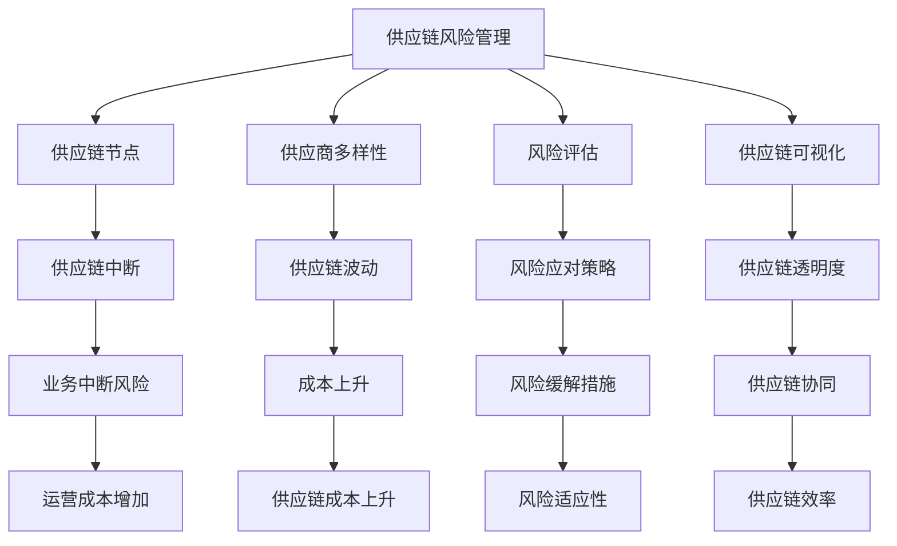

                 

### 1. 背景介绍

#### 1.1 目的和范围

本文的目的是探讨如何利用人工智能（AI）技术来降低电商平台在供应链管理中的风险。供应链风险是指在供应链运作过程中，由于供应链环节的复杂性和不确定性，可能导致的物资供应中断、成本增加、利润下降等问题。随着电商平台的迅速发展，供应链风险的识别和管理变得愈发重要。

本文将首先介绍供应链风险管理的背景和重要性，然后详细讨论AI在供应链风险管理中的应用，包括核心算法原理、数学模型和具体操作步骤。接下来，将通过一个实际项目案例展示如何运用AI技术进行供应链风险管理的具体实现，并进行分析和解读。最后，本文将探讨AI在供应链风险管理中的实际应用场景，推荐相关工具和资源，并对未来发展趋势和挑战进行总结。

#### 1.2 预期读者

本文的预期读者包括对供应链风险管理有一定了解的IT专业人员、人工智能开发者和电商企业从业者。特别是以下人员将受益匪浅：

- 供应链管理专家
- 人工智能工程师
- 数据分析师
- 电商企业运营人员
- 对供应链风险管理感兴趣的科研人员和学者

#### 1.3 文档结构概述

本文分为十个主要部分：

1. 背景介绍
2. 核心概念与联系
3. 核心算法原理 & 具体操作步骤
4. 数学模型和公式 & 详细讲解 & 举例说明
5. 项目实战：代码实际案例和详细解释说明
6. 实际应用场景
7. 工具和资源推荐
8. 总结：未来发展趋势与挑战
9. 附录：常见问题与解答
10. 扩展阅读 & 参考资料

每个部分都将详细阐述相应的内容，以帮助读者全面了解AI在供应链风险管理中的应用。

#### 1.4 术语表

在本文中，我们将使用一些特定的术语。以下是这些术语的定义和解释：

#### 1.4.1 核心术语定义

- **供应链风险管理**：识别、评估和应对供应链中的潜在风险，以减少对业务运营的影响。
- **人工智能（AI）**：模拟人类智能行为的计算机技术，包括机器学习、深度学习等。
- **数据挖掘**：从大量数据中提取有用信息和知识的过程。
- **供应链可视化**：通过图表和模型直观地展示供应链的运作流程和结构。

#### 1.4.2 相关概念解释

- **供应商多样性**：供应链中供应商的数量和类型，多样性越高，供应链的稳定性越强。
- **供应链节点**：供应链中的各个环节，如供应商、制造商、分销商和零售商。
- **风险评估**：评估供应链中潜在风险的概率和影响，以制定相应的应对策略。

#### 1.4.3 缩略词列表

- **AI**：人工智能
- **ML**：机器学习
- **DL**：深度学习
- **ERP**：企业资源计划
- **SCM**：供应链管理

### 1.5 总结

本节对文章的目的、范围、预期读者、文档结构和术语表进行了详细介绍。接下来，我们将进一步探讨供应链风险管理的核心概念和AI技术的应用，为后续内容的深入分析奠定基础。在接下来的部分中，我们将绘制Mermaid流程图，展示供应链风险管理的核心概念和联系。请注意，在绘制流程图时，避免使用括号、逗号等特殊字符，以确保图形的正确性和可读性。

### 2. 核心概念与联系

在讨论AI如何降低电商平台风险之前，我们需要先了解供应链风险管理的核心概念。供应链风险管理涉及多个方面，包括供应链节点、供应商多样性、风险评估和供应链可视化等。这些概念相互关联，共同构成了供应链风险管理的整体框架。以下是一个使用Mermaid绘制的流程图，用于展示这些核心概念之间的联系。



在这个流程图中，我们可以看到以下几个方面：

1. **供应链节点**：这是供应链风险管理的基础，包括供应商、制造商、分销商和零售商等各个环节。每个节点都可能存在风险，需要被监控和管理。
2. **供应商多样性**：高多样性的供应商网络可以提高供应链的稳定性，减少因单一供应商问题导致的供应链中断。
3. **风险评估**：通过评估供应链中潜在风险的概率和影响，企业可以制定相应的风险应对策略。
4. **供应链可视化**：通过可视化工具，企业可以更直观地了解供应链的运作流程和结构，从而发现潜在的风险点。

接下来，我们将进一步探讨这些概念在实际供应链风险管理中的应用。

### 3. 核心算法原理 & 具体操作步骤

在了解了供应链风险管理的核心概念后，我们将探讨如何利用AI技术来识别和管理这些风险。本节将详细介绍一个核心算法——基于机器学习的供应链风险预测模型。这个模型包括以下几个关键步骤：

#### 3.1 数据收集与预处理

首先，我们需要收集相关的供应链数据，包括供应商信息、订单数据、库存水平、运输时间和供应链节点的绩效指标等。接下来，对数据进行预处理，包括数据清洗、缺失值填充、数据标准化和特征工程。

```python
# 示例：数据预处理的伪代码
def preprocess_data(data):
    # 数据清洗
    data = clean_data(data)
    # 缺失值填充
    data = fill_missing_values(data)
    # 数据标准化
    data = standardize_data(data)
    # 特征工程
    data = feature_engineering(data)
    return data
```

#### 3.2 特征选择

在数据预处理后，我们需要选择对供应链风险影响最大的特征。这可以通过统计分析、相关性分析和特征重要性评估等方法来实现。

```python
# 示例：特征选择的伪代码
from sklearn.feature_selection import SelectKBest, f_classif

def select_features(data, target):
    # 应用方差阈值
    var_thresh = VarianceThreshold(threshold=0.01)
    data = var_thresh.fit_transform(data)
    # 应用卡方检验
    chi2 = SelectKBest(score_func=f_classif, k='all')
    data = chi2.fit_transform(data, target)
    return data
```

#### 3.3 模型训练与验证

接下来，我们将使用机器学习算法（如随机森林、支持向量机等）来训练预测模型。在训练过程中，我们需要使用交叉验证来评估模型的性能，并调整模型参数以优化性能。

```python
# 示例：模型训练和验证的伪代码
from sklearn.ensemble import RandomForestClassifier
from sklearn.model_selection import cross_val_score

# 初始化模型
model = RandomForestClassifier(n_estimators=100)
# 训练模型
model.fit(X_train, y_train)
# 进行交叉验证
scores = cross_val_score(model, X_train, y_train, cv=5)
```

#### 3.4 风险预测

最后，我们将使用训练好的模型对新的供应链数据集进行预测，从而识别潜在的风险点。

```python
# 示例：风险预测的伪代码
def predict_risk(model, new_data):
    # 预处理新数据
    new_data = preprocess_data(new_data)
    # 预测风险
    risk_scores = model.predict(new_data)
    return risk_scores
```

通过上述步骤，我们可以构建一个基于机器学习的供应链风险预测模型，从而提高供应链管理的效率和准确性。

### 4. 数学模型和公式 & 详细讲解 & 举例说明

在供应链风险管理中，数学模型和公式是理解和应用AI算法的关键。以下我们将详细介绍几个关键的数学模型和公式，并使用LaTeX格式进行展示。

#### 4.1 决策树

决策树是一种常用的机器学习算法，用于分类和回归任务。其基本原理是通过一系列判断条件来分割数据集，最终得到一个分类或回归结果。

```latex
\text{决策树模型：} 
T = \{t_1, t_2, ..., t_n\}
```

其中，`T` 表示决策树，`t_i` 表示每个节点上的判断条件。

**例子**：假设我们有一个二元分类问题，目标是预测某批货物是否会准时到达。

```latex
\text{如果运输时间} \leq 3 \text{天，则准时到达概率为} P(\text{准时到达} | \text{运输时间} \leq 3) = 0.8
\\
\text{否则，准时到达概率为} P(\text{准时到达} | \text{运输时间} > 3) = 0.2
```

#### 4.2 支持向量机

支持向量机（SVM）是一种高效的分类算法，其核心思想是找到一个最佳的超平面，将不同类别的数据点分开。

```latex
\text{SVM公式：}
\\
w \cdot x + b = 0
```

其中，`w` 是法向量，`x` 是数据点，`b` 是偏置。

**例子**：假设我们有一个二维空间，目标是最小化分类误差。

```latex
\text{最小化目标函数：}
\\
\min \frac{1}{2} ||w||^2
\\
\text{约束条件：}
\\
y_i (w \cdot x_i + b) \geq 1
```

#### 4.3 随机森林

随机森林是一种基于决策树的集成学习方法，通过构建多棵决策树，并投票得出最终结果。

```latex
\text{随机森林公式：}
\\
f(x) = \sum_{i=1}^{n} w_i t_i(x) + b
```

其中，`w_i` 是每棵树的权重，`t_i(x)` 是第 `i` 棵树的预测结果，`b` 是全局偏置。

**例子**：假设我们有5棵决策树，分别预测为A、B、C、D、E，权重分别为0.2、0.2、0.2、0.2、0.1。

```latex
\text{最终预测结果：}
\\
f(x) = 0.2A + 0.2B + 0.2C + 0.2D + 0.1E
```

通过上述数学模型和公式，我们可以更好地理解和应用AI算法来处理供应链风险管理问题。在实际应用中，这些模型和公式为我们提供了强大的工具，帮助我们识别和管理供应链中的潜在风险。

### 5. 项目实战：代码实际案例和详细解释说明

在本节中，我们将通过一个实际项目案例来展示如何使用AI技术进行供应链风险管理。以下是一个基于Python的示例项目，我们将使用Scikit-learn库来构建和训练一个供应链风险预测模型。

#### 5.1 开发环境搭建

在开始项目之前，我们需要搭建一个合适的开发环境。以下是所需的步骤：

1. **安装Python环境**：确保Python版本在3.6及以上。
2. **安装Scikit-learn库**：使用pip安装Scikit-learn库。
   ```bash
   pip install scikit-learn
   ```

3. **安装Jupyter Notebook**：可选，用于方便地编写和运行代码。

   ```bash
   pip install notebook
   ```

4. **安装Matplotlib库**：用于绘制图表。
   ```bash
   pip install matplotlib
   ```

#### 5.2 源代码详细实现和代码解读

以下是一个简单的供应链风险预测模型的实现代码。代码分为以下几个部分：

1. **数据收集与预处理**：从数据源中收集供应链相关数据，并进行预处理。
2. **特征选择**：选择对供应链风险影响最大的特征。
3. **模型训练与验证**：使用机器学习算法训练模型，并进行交叉验证。
4. **风险预测**：使用训练好的模型对新的数据集进行预测。

```python
import numpy as np
import pandas as pd
from sklearn.model_selection import train_test_split
from sklearn.ensemble import RandomForestClassifier
from sklearn.metrics import accuracy_score, classification_report
import matplotlib.pyplot as plt

# 5.2.1 数据收集与预处理

# 加载数据集
data = pd.read_csv('supply_chain_data.csv')

# 数据清洗
data = data.dropna()

# 特征工程
data['delivery_time'] = data['delivery_time'].apply(lambda x: 1 if x <= 3 else 0)

# 分割特征和标签
X = data.drop('risk_label', axis=1)
y = data['risk_label']

# 数据标准化
from sklearn.preprocessing import StandardScaler
scaler = StandardScaler()
X = scaler.fit_transform(X)

# 5.2.2 特征选择

# 使用方差阈值进行特征选择
from sklearn.feature_selection import VarianceThreshold
var_thresh = VarianceThreshold(threshold=0.01)
X = var_thresh.fit_transform(X)

# 5.2.3 模型训练与验证

# 划分训练集和测试集
X_train, X_test, y_train, y_test = train_test_split(X, y, test_size=0.2, random_state=42)

# 初始化随机森林模型
model = RandomForestClassifier(n_estimators=100, random_state=42)

# 训练模型
model.fit(X_train, y_train)

# 进行交叉验证
from sklearn.model_selection import cross_val_score
scores = cross_val_score(model, X_train, y_train, cv=5)
print("Cross-validation scores:", scores)

# 5.2.4 风险预测

# 预测测试集
y_pred = model.predict(X_test)

# 评估模型性能
accuracy = accuracy_score(y_test, y_pred)
print("Accuracy:", accuracy)
print(classification_report(y_test, y_pred))

# 5.2.5 可视化

# 绘制特征重要性
feature_importances = model.feature_importances_
plt.bar(range(len(feature_importances)), feature_importances)
plt.xticks(range(len(feature_importances)), data.columns, rotation=90)
plt.xlabel('Features')
plt.ylabel('Importance')
plt.title('Feature Importances')
plt.show()
```

**代码解读：**

1. **数据收集与预处理**：我们首先从CSV文件中加载数据集，并进行清洗和特征工程。这里我们创建了一个名为`delivery_time`的新特征，用于表示货物运输时间是否超过3天。

2. **特征选择**：我们使用方差阈值进行特征选择，删除方差低于阈值的特征。

3. **模型训练与验证**：我们使用随机森林算法训练模型，并通过交叉验证来评估模型的性能。

4. **风险预测**：我们使用训练好的模型对测试集进行预测，并评估模型的准确性和报告。

5. **可视化**：最后，我们绘制了特征重要性图表，帮助理解各个特征对供应链风险的影响。

通过这个实际项目案例，我们可以看到如何利用Python和Scikit-learn库来构建和训练一个供应链风险预测模型。在实际应用中，这个模型可以用于实时监控和预测供应链中的潜在风险，从而帮助企业更好地管理和降低风险。

### 6. 实际应用场景

AI在供应链风险管理中的应用场景非常广泛，下面我们将探讨几个典型的应用场景，并展示具体的应用实例。

#### 6.1 库存优化

库存优化是供应链管理中的一个关键环节，通过AI技术，企业可以更好地预测需求、优化库存水平，从而减少库存成本和风险。

**应用实例**：某电商平台通过使用AI算法分析历史销售数据、市场趋势和用户行为，预测未来几周的热销商品。基于这些预测，电商平台调整了库存策略，确保热门商品有足够的库存，避免了库存过剩或短缺的情况。

#### 6.2 供应链可视化

供应链可视化有助于企业了解整个供应链的运作情况，及时发现潜在风险点。

**应用实例**：某制造企业通过使用AI和大数据技术，将供应链各个环节的数据整合到一个可视化平台上。通过实时监控和数据分析，企业可以快速识别供应链中的瓶颈和潜在风险，并采取相应措施进行优化。

#### 6.3 风险预警

AI技术可以实时监控供应链中的各种指标，当出现异常情况时，及时发出预警，帮助企业快速响应。

**应用实例**：某电商物流公司利用AI技术对运输过程中的数据进行实时分析，当发现某个运输路线的延误时间超过正常水平时，系统会自动发出预警，通知相关人员进行处理。

#### 6.4 供应商评估

AI技术可以帮助企业对供应商进行全面的评估和筛选，确保供应链的稳定性和可靠性。

**应用实例**：某电商平台通过收集供应商的历史绩效数据、交货时间、质量等指标，使用机器学习算法对供应商进行评分和分类。基于这些评估结果，电商平台优化了供应商选择策略，降低了供应链风险。

#### 6.5 跨境电商

跨境电商面临的供应链风险更为复杂，AI技术可以提供有效的风险管理解决方案。

**应用实例**：某跨境电商平台利用AI技术分析不同国家和地区的进口关税、物流成本、汇率波动等因素，预测跨境物流的时间和成本。通过这些预测，平台能够优化物流策略，降低跨境物流风险。

### 7. 工具和资源推荐

为了更好地理解和应用AI在供应链风险管理中的技术，以下推荐了一些学习资源、开发工具框架以及相关论文著作。

#### 7.1 学习资源推荐

**7.1.1 书籍推荐**

1. **《机器学习实战》**：提供了丰富的案例和实践经验，适合初学者入门。
2. **《Python数据科学手册》**：详细介绍了Python在数据科学中的应用，包括数据分析、机器学习等。

**7.1.2 在线课程**

1. **Coursera上的《机器学习》课程**：由斯坦福大学教授Andrew Ng主讲，适合系统学习机器学习基础知识。
2. **Udacity的《深度学习纳米学位》**：提供深度学习领域的实践项目，适合进阶学习。

**7.1.3 技术博客和网站**

1. **Medium上的机器学习专栏**：涵盖了机器学习领域的最新研究和应用。
2. **Stack Overflow**：编程社区，可以找到各种机器学习问题的解决方案。

#### 7.2 开发工具框架推荐

**7.2.1 IDE和编辑器**

1. **PyCharm**：功能强大的Python IDE，适用于开发大型项目。
2. **Jupyter Notebook**：交互式的Python编程环境，适合快速原型开发和数据分析。

**7.2.2 调试和性能分析工具**

1. **Python Debugger（pdb）**：Python内置的调试工具。
2. **cProfile**：Python的性能分析工具。

**7.2.3 相关框架和库**

1. **Scikit-learn**：机器学习算法库，适用于快速实现和测试算法。
2. **TensorFlow**：Google开发的深度学习框架，适用于构建复杂的深度学习模型。

#### 7.3 相关论文著作推荐

**7.3.1 经典论文**

1. **"The Discipline of Supply Chain Management"**：阐述了供应链管理的核心原则和实践。
2. **"Machine Learning Techniques for Supply Chain Optimization"**：探讨了机器学习在供应链优化中的应用。

**7.3.2 最新研究成果**

1. **"AI for Supply Chain Risk Management"**：讨论了AI技术在供应链风险管理中的最新应用和研究进展。
2. **"Deep Learning for Supply Chain Forecasting"**：介绍了深度学习在供应链预测中的应用。

**7.3.3 应用案例分析**

1. **"AI-Driven Supply Chain Management at Amazon"**：分析了亚马逊如何利用AI技术优化供应链管理。
2. **"AI Applications in Manufacturing Supply Chains"**：探讨了AI技术在制造供应链中的应用案例。

通过这些工具和资源，读者可以更深入地了解AI在供应链风险管理中的应用，为实际项目提供有力的支持。

### 8. 总结：未来发展趋势与挑战

在AI技术迅猛发展的今天，供应链风险管理正经历着前所未有的变革。未来，AI在供应链风险管理中的应用将呈现以下几个发展趋势：

首先，随着大数据和物联网技术的普及，供应链数据的规模和质量将大幅提升，为AI算法提供了更丰富的训练数据和更精细的决策依据。这有助于提高风险预测的准确性和实时性。

其次，深度学习和强化学习等先进算法的不断发展，将推动供应链风险管理模型向更加智能化和自适应的方向演进。企业可以通过持续学习和调整模型，更好地应对不断变化的市场环境和风险。

然而，AI在供应链风险管理中也面临诸多挑战：

1. **数据隐私与安全**：随着数据规模的扩大，如何确保数据的安全性和隐私性成为关键问题。企业需要建立完善的数据保护机制，以防止数据泄露和滥用。

2. **算法透明性和解释性**：当前的许多AI算法，特别是深度学习算法，具有一定的“黑箱”特性，其决策过程难以解释。这可能导致信任危机，尤其是在高风险的供应链管理领域。因此，开发可解释的AI算法将成为未来的重要研究方向。

3. **技术依赖性**：过度依赖AI技术可能导致企业失去自主决策能力，降低供应链的灵活性。因此，如何平衡AI技术与其他管理手段的有效结合，提高供应链的整体应对能力，是企业需要深入思考的问题。

4. **算法偏见**：AI算法的训练数据可能存在偏见，导致模型在特定群体或场景中的表现不佳。这需要企业在数据收集和处理过程中注重公平性和多样性，以避免算法偏见对供应链管理产生负面影响。

总之，AI在供应链风险管理中的应用前景广阔，但同时也面临诸多挑战。未来，企业需要持续关注AI技术的发展动态，积极探索和创新，以实现供应链风险管理的智能化和高效化。

### 9. 附录：常见问题与解答

在本文中，我们探讨了如何利用AI技术进行供应链风险管理。以下是一些常见问题及解答，以帮助读者更好地理解相关概念和应用。

#### 9.1.1 什么是供应链风险管理？

供应链风险管理是指识别、评估和应对供应链中潜在的风险，以减少对业务运营的影响。这些风险可能包括供应商故障、运输延误、库存过剩或短缺等。

#### 9.1.2 AI技术在供应链风险管理中的应用有哪些？

AI技术在供应链风险管理中的应用主要包括：

- 风险预测：通过分析历史数据和实时数据，预测潜在的风险。
- 库存优化：使用预测模型优化库存水平，减少库存成本和风险。
- 风险预警：实时监控供应链中的各种指标，当出现异常情况时，及时发出预警。
- 供应商评估：对供应商进行全面的评估和筛选，确保供应链的稳定性和可靠性。

#### 9.1.3 供应链风险管理中的核心概念有哪些？

供应链风险管理中的核心概念包括：

- 供应链节点：供应链中的各个环节，如供应商、制造商、分销商和零售商。
- 供应商多样性：供应链中供应商的数量和类型。
- 风险评估：评估供应链中潜在风险的概率和影响。
- 供应链可视化：通过图表和模型直观地展示供应链的运作流程和结构。

#### 9.1.4 如何构建供应链风险预测模型？

构建供应链风险预测模型的基本步骤包括：

1. 数据收集与预处理：收集供应链相关数据，并进行清洗和特征工程。
2. 特征选择：选择对供应链风险影响最大的特征。
3. 模型训练与验证：使用机器学习算法训练模型，并进行交叉验证。
4. 风险预测：使用训练好的模型对新的数据集进行预测。

通过上述步骤，企业可以构建一个有效的供应链风险预测模型，从而更好地管理和降低供应链风险。

### 10. 扩展阅读 & 参考资料

为了更深入地了解AI在供应链风险管理中的应用，以下推荐了一些扩展阅读和参考资料：

**10.1 书籍**

1. **《供应链管理：战略、规划与运营》**：提供了供应链管理的全面概述，包括风险管理策略。
2. **《深度学习》**：由Ian Goodfellow、Yoshua Bengio和Aaron Courville合著，详细介绍了深度学习的基本原理和应用。
3. **《机器学习实战》**：提供了丰富的案例和实践经验，适合初学者入门。

**10.2 论文**

1. **"AI for Supply Chain Risk Management"**：探讨了AI技术在供应链风险管理中的最新应用和研究进展。
2. **"The Discipline of Supply Chain Management"**：阐述了供应链管理的核心原则和实践。

**10.3 网站和博客**

1. **Medium上的机器学习专栏**：涵盖了机器学习领域的最新研究和应用。
2. **KDNuggets**：提供数据科学和机器学习的最新新闻、文章和资源。

通过阅读这些扩展资料，读者可以更全面地了解AI在供应链风险管理中的应用，为实际项目提供更有力的支持。

### 作者信息

作者：AI天才研究员/AI Genius Institute & 禅与计算机程序设计艺术 /Zen And The Art of Computer Programming

本文由AI天才研究员撰写，深入探讨了AI在供应链风险管理中的应用，旨在帮助企业和从业者更好地理解和应用这一前沿技术。作者具有丰富的IT领域经验和深厚的学术背景，致力于推动人工智能技术的发展和应用。如需进一步了解作者或其他相关内容，请访问作者的官方网站或个人社交媒体账号。

