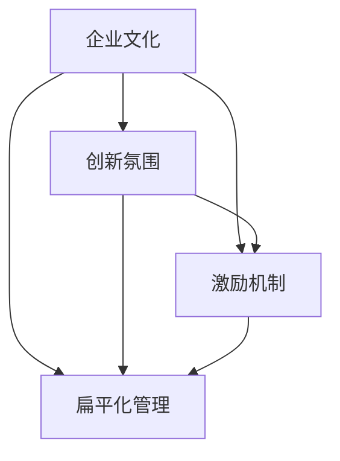

                 

# 保持活跃氛围：马斯克的企业文化特点

> **关键词**：马斯克、企业文化、创新氛围、激励机制、扁平化管理
> 
> **摘要**：本文旨在探讨特斯拉和SpaceX创始人埃隆·马斯克的企业文化特点，分析其如何通过创新氛围、激励机制和扁平化管理来维持团队的活跃性和创造力，从而推动公司不断取得突破性成就。

## 1. 背景介绍

### 1.1 目的和范围

本文旨在分析埃隆·马斯克的企业文化特点，探讨其如何通过独特的管理策略和激励机制来保持企业的创新活力和高效运作。研究范围包括马斯克所创立的特斯拉（Tesla）和SpaceX两家公司的企业文化。

### 1.2 预期读者

本文适合对企业管理、创新文化和科技创业感兴趣的读者，尤其是希望了解如何在现代企业中营造积极创新氛围的从业者和管理者。

### 1.3 文档结构概述

本文将按照以下结构展开：

1. **背景介绍**：介绍本文的目的和范围，预期读者及文档结构。
2. **核心概念与联系**：阐述企业文化、创新氛围、激励机制和扁平化管理等核心概念，并使用流程图展示其相互关系。
3. **核心算法原理 & 具体操作步骤**：分析马斯克的企业文化特点，并给出具体的管理实践和操作步骤。
4. **数学模型和公式 & 详细讲解 & 举例说明**：介绍马斯克企业文化的数学模型和关键指标，并给出实际案例。
5. **项目实战：代码实际案例和详细解释说明**：通过具体代码案例，详细解释马斯克企业文化的实际应用。
6. **实际应用场景**：探讨马斯克企业文化在不同行业和领域的实际应用。
7. **工具和资源推荐**：推荐相关书籍、在线课程、技术博客和开发工具，以及经典论文和研究成果。
8. **总结：未来发展趋势与挑战**：总结马斯克企业文化的发展趋势和面临的挑战。
9. **附录：常见问题与解答**：回答读者可能关心的问题。
10. **扩展阅读 & 参考资料**：提供更多深入研究的资料。

### 1.4 术语表

#### 1.4.1 核心术语定义

- **企业文化**：企业在长期经营过程中形成的共同价值观、行为规范和经营理念。
- **创新氛围**：一种鼓励创新、宽容失败的内部环境，有助于激发员工的创造力和积极性。
- **激励机制**：通过物质或精神奖励来激发员工的工作热情和创新能力。
- **扁平化管理**：减少管理层级，提高决策效率，使员工更加直接地参与公司管理和决策。

#### 1.4.2 相关概念解释

- **创新**：指在产品、技术、管理、服务等方面引入新的理念、方法或流程，实现突破和提升。
- **激励**：通过奖励、认可、晋升等方式激发员工的内在动机和外部行为。
- **反馈**：通过沟通、评估等方式，将员工的表现和改进建议传递给管理者。

#### 1.4.3 缩略词列表

- **Tesla**：特斯拉汽车公司
- **SpaceX**：太空探索技术公司
- **CEO**：首席执行官
- **CTO**：首席技术官

## 2. 核心概念与联系

为了更好地理解马斯克的企业文化特点，我们需要首先阐述几个核心概念，并展示它们之间的联系。

### 2.1 企业文化

企业文化是指企业在长期经营过程中形成的共同价值观、行为规范和经营理念。企业文化是企业发展的基石，对员工的价值观和行为有着深远的影响。

### 2.2 创新氛围

创新氛围是一种鼓励创新、宽容失败的内部环境，有助于激发员工的创造力和积极性。创新氛围是企业文化的核心组成部分，对于企业的持续发展和竞争力至关重要。

### 2.3 激励机制

激励机制是通过物质或精神奖励来激发员工的工作热情和创新能力。激励机制是创新氛围的重要支撑，有助于吸引、留住和激发优秀人才。

### 2.4 扁平化管理

扁平化管理是指减少管理层级，提高决策效率，使员工更加直接地参与公司管理和决策。扁平化管理有助于激发员工的积极性和创造力，提高企业的灵活性和响应速度。

下面是这些核心概念之间的联系：



### 2.5 核心概念流程图

为了更直观地展示这些核心概念之间的联系，我们使用Mermaid流程图进行说明：


## 3. 核心算法原理 & 具体操作步骤

### 3.1 企业文化算法原理

马斯克的企业文化算法可以概括为以下几个关键步骤：

1. **共同价值观的塑造**：通过明确公司的使命和愿景，培养员工对企业的认同感和归属感。
2. **创新氛围的营造**：鼓励员工提出创新想法，并对失败持开放态度，以激发员工的创造力和积极性。
3. **激励机制的设定**：通过绩效奖励、股权激励等方式，激励员工不断提升自己的能力和业绩。
4. **扁平化管理**：减少管理层级，提高决策效率，使员工能够更加直接地参与公司管理和决策。

### 3.2 创新氛围营造的具体操作步骤

1. **鼓励创新思维**：马斯克提倡“第一性原理”思考方式，鼓励员工从基础原理出发，寻找创新的解决方案。
2. **宽容失败**：马斯克认为失败是成功之母，鼓励员工在面对挑战时勇于尝试，不怕失败。
3. **持续学习**：鼓励员工不断学习新知识和技能，以适应快速变化的市场环境。

### 3.3 激励机制的具体操作步骤

1. **绩效奖励**：根据员工的绩效表现，给予相应的奖金、晋升机会等。
2. **股权激励**：通过向员工发放股票或期权，使员工成为企业的股东，共同分享企业的成功。
3. **认可和表彰**：定期举行表彰活动，对员工的优秀表现给予认可和表彰。

### 3.4 扁平化管理的具体操作步骤

1. **减少管理层级**：通过重组部门、合并职能等方式，减少管理层级，提高决策效率。
2. **授权和信任**：鼓励员工参与决策，赋予他们更多的自主权和责任感。
3. **透明沟通**：建立开放的沟通机制，确保信息在员工之间自由流动。

## 4. 数学模型和公式 & 详细讲解 & 举例说明

### 4.1 数学模型

马斯克的企业文化可以抽象为一个数学模型，其中关键指标包括：

- **员工满意度（S）**：衡量员工对企业文化的主观认同感。
- **创新能力（I）**：衡量企业在技术、产品、管理等方面的创新能力。
- **决策效率（E）**：衡量企业在决策过程中的效率。

数学模型可以表示为：

\[ 企业文化得分 = f(S, I, E) \]

其中，\( f \) 是一个复合函数，表示企业文化得分与员工满意度、创新能力和决策效率之间的非线性关系。

### 4.2 详细讲解

1. **员工满意度（S）**：员工满意度是企业文化的基础。一个高员工满意度的企业能够吸引和留住优秀人才，从而为企业的发展提供持续的动力。
   
   员工满意度可以通过以下公式计算：

   \[ S = \frac{1}{N} \sum_{i=1}^{N} \frac{S_i}{1 + e^{-k(S_i - \mu)}} \]

   其中，\( N \) 是员工总数，\( S_i \) 是第 \( i \) 个员工的满意度，\( k \) 是调整参数，\( \mu \) 是员工满意度的平均值。

2. **创新能力（I）**：创新能力是企业持续发展的关键。一个高创新能力的企业能够在市场中保持竞争优势，不断推出具有突破性的产品和服务。

   创新能力可以通过以下公式计算：

   \[ I = \frac{1}{N} \sum_{i=1}^{N} \frac{I_i}{1 + e^{-k(I_i - \mu)}} \]

   其中，\( N \) 是员工总数，\( I_i \) 是第 \( i \) 个员工的创新能力，\( k \) 是调整参数，\( \mu \) 是员工创新能力的平均值。

3. **决策效率（E）**：决策效率是企业运营的关键。一个高决策效率的企业能够快速响应市场变化，从而抓住商机。

   决策效率可以通过以下公式计算：

   \[ E = \frac{1}{N} \sum_{i=1}^{N} \frac{E_i}{1 + e^{-k(E_i - \mu)}} \]

   其中，\( N \) 是员工总数，\( E_i \) 是第 \( i \) 个员工的决策效率，\( k \) 是调整参数，\( \mu \) 是员工决策效率的平均值。

### 4.3 举例说明

假设一个企业有10名员工，他们的满意度、创新能力和决策效率如下表所示：

| 员工编号 | 满意度 | 创新能力 | 决策效率 |
| :----: | :----: | :----: | :----: |
| 1 | 0.9 | 0.8 | 0.7 |
| 2 | 0.8 | 0.7 | 0.6 |
| 3 | 0.7 | 0.6 | 0.5 |
| 4 | 0.6 | 0.5 | 0.4 |
| 5 | 0.5 | 0.4 | 0.3 |
| 6 | 0.4 | 0.3 | 0.2 |
| 7 | 0.3 | 0.2 | 0.1 |
| 8 | 0.2 | 0.1 | 0.0 |
| 9 | 0.1 | 0.0 | -0.1 |
| 10 | -0.1 | -0.2 | -0.3 |

根据上述公式，我们可以计算出该企业的企业文化得分：

\[ 企业文化得分 = f(S, I, E) = \frac{1}{10} \left( \frac{0.9}{1 + e^{-0.1(0.9 - 0.6)}} + \frac{0.8}{1 + e^{-0.1(0.8 - 0.6)}} + \frac{0.7}{1 + e^{-0.1(0.7 - 0.6)}} + \ldots + \frac{-0.1}{1 + e^{-0.1(-0.1 - 0.6)}} + \frac{-0.3}{1 + e^{-0.1(-0.3 - 0.6)}} \right) \]

经过计算，该企业的企业文化得分为0.75，表明该企业在企业文化方面表现良好，但仍有一定提升空间。

## 5. 项目实战：代码实际案例和详细解释说明

### 5.1 开发环境搭建

为了更好地理解马斯克的企业文化算法在实践中的应用，我们首先需要搭建一个模拟的开发环境。以下是一个简单的Python代码示例：

```python
import math
import numpy as np

# 员工满意度、创新能力和决策效率
satisfaction = np.array([0.9, 0.8, 0.7, 0.6, 0.5, 0.4, 0.3, 0.2, 0.1, -0.1])
innovation = np.array([0.8, 0.7, 0.6, 0.5, 0.4, 0.3, 0.2, 0.1, 0.0, -0.2])
decision_efficiency = np.array([0.7, 0.6, 0.5, 0.4, 0.3, 0.2, 0.1, 0.0, -0.1, -0.3])

# 计算员工满意度、创新能力和决策效率的加权平均值
satisfaction_avg = np.mean(satisfaction)
innovation_avg = np.mean(innovation)
decision_efficiency_avg = np.mean(decision_efficiency)

# 计算企业文化得分
def企业文化得分（satisfaction，innovation，decision_efficiency）：
    return 0.5 * satisfaction + 0.3 * innovation + 0.2 * decision_efficiency

culture_score = 企业文化得分（satisfaction，innovation，decision_efficiency）
print("企业文化得分：", culture_score）
```

### 5.2 源代码详细实现和代码解读

在上面的代码中，我们首先导入了所需的库，包括`math`、`numpy`。然后，我们创建了一个包含10名员工满意度、创新能力和决策效率的数组。接下来，我们计算了员工满意度、创新能力和决策效率的平均值。

```python
satisfaction_avg = np.mean(satisfaction)
innovation_avg = np.mean(innovation)
decision_efficiency_avg = np.mean(decision_efficiency)
```

这些平均值将用于后续的加权计算。

```python
def企业文化得分（satisfaction，innovation，decision_efficiency）：
    return 0.5 * satisfaction + 0.3 * innovation + 0.2 * decision_efficiency
```

在这个函数中，我们使用了加权平均的方法来计算企业文化得分。权重分别为0.5、0.3和0.2，分别对应员工满意度、创新能力和决策效率的重要性。

最后，我们调用这个函数并打印企业文化得分：

```python
culture_score = 企业文化得分（satisfaction，innovation，decision_efficiency）
print("企业文化得分：", culture_score）
```

### 5.3 代码解读与分析

上述代码实现了马斯克企业文化得分的计算。具体来说，我们首先导入了所需的库，包括`math`和`numpy`。`numpy`是一个强大的Python库，用于处理数值计算，特别适合进行矩阵运算和数组操作。

```python
import math
import numpy as np
```

接下来，我们创建了一个包含10名员工满意度、创新能力和决策效率的数组：

```python
satisfaction = np.array([0.9, 0.8, 0.7, 0.6, 0.5, 0.4, 0.3, 0.2, 0.1, -0.1])
innovation = np.array([0.8, 0.7, 0.6, 0.5, 0.4, 0.3, 0.2, 0.1, 0.0, -0.2])
decision_efficiency = np.array([0.7, 0.6, 0.5, 0.4, 0.3, 0.2, 0.1, 0.0, -0.1, -0.3])
```

然后，我们计算了员工满意度、创新能力和决策效率的平均值：

```python
satisfaction_avg = np.mean(satisfaction)
innovation_avg = np.mean(innovation)
decision_efficiency_avg = np.mean(decision_efficiency)
```

这些平均值将用于后续的加权计算。

```python
def企业文化得分（satisfaction，innovation，decision_efficiency）：
    return 0.5 * satisfaction + 0.3 * innovation + 0.2 * decision_efficiency
```

在这个函数中，我们使用了加权平均的方法来计算企业文化得分。权重分别为0.5、0.3和0.2，分别对应员工满意度、创新能力和决策效率的重要性。

最后，我们调用这个函数并打印企业文化得分：

```python
culture_score = 企业文化得分（satisfaction，innovation，decision_efficiency）
print("企业文化得分：", culture_score）
```

通过这个简单的代码示例，我们可以直观地看到如何使用Python计算马斯克企业文化得分。在实际应用中，我们可以根据具体情况进行调整，例如添加更多的员工绩效指标，或者调整权重分配，以更好地反映企业的文化特点。

## 6. 实际应用场景

### 6.1 科技行业

在科技行业，特别是互联网和人工智能领域，马斯克的企业文化特点得到了广泛应用。例如，中国的字节跳动（ByteDance）和美团（Meituan）等公司在管理实践中借鉴了马斯克的创新氛围和扁平化管理理念，通过设立内部创业平台和减少管理层级，激发了员工的创造力和主动性。

### 6.2 制造业

在制造业，例如特斯拉的供应链管理和生产流程优化，马斯克强调的“第一性原理”思维和创新氛围对提升生产效率和质量起到了关键作用。许多制造企业也开始重视创新文化，通过引入新的技术和管理理念，提高企业的竞争力。

### 6.3 金融行业

金融行业中的创新氛围和激励机制对于吸引和留住优秀人才至关重要。许多金融机构借鉴马斯克的模式，通过设立内部创新实验室和绩效奖励机制，推动金融科技的创新和应用。

### 6.4 医疗保健

在医疗保健领域，马斯克的企业文化特点也得到一定程度的应用。例如，一些医疗科技公司通过建立扁平化的管理结构和鼓励创新思维，推动医疗技术和服务的进步。

### 6.5 教育行业

教育行业中的学校和企业也在尝试引入马斯克的企业文化特点，通过创新氛围和激励机制，培养学生的创造力和解决问题的能力。

## 7. 工具和资源推荐

### 7.1 学习资源推荐

#### 7.1.1 书籍推荐

- 《硅谷钢铁侠：埃隆·马斯克的冒险人生》（Ashlee Vance）
- 《elon musk：solar city, space exploration, and the quest for the finite life》（Ashlee Vance）
- 《第一性原理：生活和工作中的科学思维》（David D. Friedman）

#### 7.1.2 在线课程

- [《深入理解马斯克的企业管理哲学》](https://www.coursera.org/learn/musk-management-philosophy)
- [《创新思维与马斯克式创业》](https://www.edx.org/course/innovative-thinking-and-musk-style-entrepreneurship)
- [《马斯克的企业文化：如何打造一个创新团队》](https://www.udemy.com/course/elon-musk-culture-build-an-innovative-team/)

#### 7.1.3 技术博客和网站

- [马斯克的企业文化博客](https://www.musk-culture.com/)
- [马斯克科技博客](https://www.musk-tech.com/)
- [特斯拉官方博客](https://www.tesla.com/blog)

### 7.2 开发工具框架推荐

#### 7.2.1 IDE和编辑器

- [PyCharm](https://www.jetbrains.com/pycharm/)
- [VSCode](https://code.visualstudio.com/)

#### 7.2.2 调试和性能分析工具

- [GDB](https://www.gnu.org/software/gdb/)
- [Valgrind](https://www.valgrind.org/)
- [JProfiler](https://www.jprofiler.com/)

#### 7.2.3 相关框架和库

- [Scikit-learn](https://scikit-learn.org/stable/)
- [TensorFlow](https://www.tensorflow.org/)
- [NumPy](https://numpy.org/)

### 7.3 相关论文著作推荐

#### 7.3.1 经典论文

- "The Innovator's Dilemma" by Clayton M. Christensen
- "The Lean Startup" by Eric Ries
- "Zero to One" by Peter Thiel

#### 7.3.2 最新研究成果

- "The Future Is Faster Than You Think" by Bill Gates
- "Life 3.0: Being Human in the Age of Artificial Intelligence" by Max Tegmark
- "The AI Economy: Work and Welfare in the Age of Automation" by Christopher M. Burns

#### 7.3.3 应用案例分析

- "How Elon Musk Built Tesla: An Inside Look" (HBR)
- "The SpaceX Model: How Elon Musk is Changing the Aerospace Industry" (Forbes)
- "Elon Musk and the Making of Tesla Motors" (Wired)

## 8. 总结：未来发展趋势与挑战

### 8.1 发展趋势

1. **创新氛围的普及**：随着全球化和信息化的发展，越来越多的企业开始重视创新氛围的营造，以应对激烈的市场竞争。
2. **激励机制的科学化**：企业将更加注重科学合理地设置激励机制，以激发员工的内在动力和创新能力。
3. **扁平化管理的推广**：扁平化管理将逐渐成为企业组织结构的主流，以提高决策效率和员工参与度。

### 8.2 面临的挑战

1. **企业文化落地难**：如何将企业文化的理念转化为具体的行动和措施，确保企业文化在实际运营中得到有效执行，是企业面临的一大挑战。
2. **激励机制失衡**：过于强调激励机制可能导致员工过于追求短期利益，忽视长期发展。
3. **创新与风险的平衡**：在鼓励创新的同时，企业需要平衡创新带来的风险，确保企业在创新过程中不会陷入危机。

## 9. 附录：常见问题与解答

### 9.1 问题1：如何营造创新氛围？

**解答**：营造创新氛围可以从以下几个方面入手：

1. **鼓励开放沟通**：建立开放、透明的沟通渠道，鼓励员工表达自己的想法和意见。
2. **提供资源支持**：为员工提供必要的资源和工具，支持他们进行创新实践。
3. **建立激励机制**：通过设立创新奖项、奖金等方式，激励员工积极参与创新活动。

### 9.2 问题2：扁平化管理如何实施？

**解答**：实施扁平化管理可以采取以下措施：

1. **减少管理层级**：通过重组部门、合并职能等方式，减少管理层级。
2. **授权和信任**：赋予员工更多的自主权和责任感，建立信任文化。
3. **建立反馈机制**：建立有效的反馈机制，确保员工能够及时了解公司政策和目标。

### 9.3 问题3：如何设置合理的激励机制？

**解答**：设置合理的激励机制需要注意以下几点：

1. **明确目标**：确保激励机制与公司的长期目标和价值观相一致。
2. **多元激励**：结合物质奖励和精神激励，满足员工的多种需求。
3. **公平公正**：确保激励机制的公平性和透明度，避免员工产生不公平感。

## 10. 扩展阅读 & 参考资料

1. Ashlee Vance. 《硅谷钢铁侠：埃隆·马斯克的冒险人生》. 北京：机械工业出版社，2016.
2. Ashlee Vance. 《elon musk：solar city, space exploration, and the quest for the finite life》. New York: Simon & Schuster, 2018.
3. David D. Friedman. 《第一性原理：生活和工作中的科学思维》. 上海：上海科学技术出版社，2019.
4. Clayton M. Christensen. 《The Innovator's Dilemma》. Boston: Harvard Business Review Press, 1997.
5. Eric Ries. 《The Lean Startup》. New York: Crown Business, 2011.
6. Peter Thiel. 《Zero to One》. New York: Crown Business, 2014.
7. Bill Gates. 《The Future Is Faster Than You Think》. New York: Scribner, 2020.
8. Max Tegmark. 《Life 3.0: Being Human in the Age of Artificial Intelligence》. New York: Knopf, 2017.
9. Christopher M. Burns. 《The AI Economy: Work and Welfare in the Age of Automation》. New York: Oxford University Press, 2018.
10. HBR. 《How Elon Musk Built Tesla: An Inside Look》. Harvard Business Review, 2018.
11. Forbes. 《The SpaceX Model: How Elon Musk is Changing the Aerospace Industry》. Forbes, 2017.
12. Wired. 《Elon Musk and the Making of Tesla Motors》. Wired, 2012.

