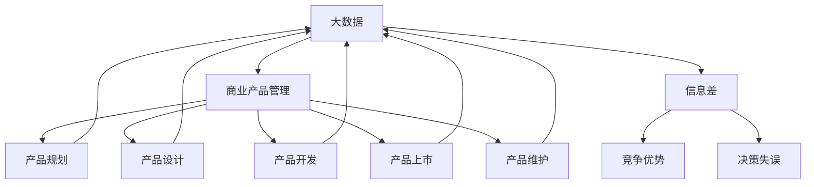

                 

# 信息差的商业产品管理：大数据如何优化产品管理

> 关键词：大数据、商业产品管理、信息差、优化、算法、数学模型、实战案例

> 摘要：本文旨在探讨大数据在商业产品管理中的应用，通过分析信息差的商业本质，阐述如何利用大数据优化产品管理。文章首先介绍了大数据的核心概念和商业产品管理的背景，随后深入探讨了信息差的原理及其对产品管理的影响，最后通过具体算法原理、数学模型和实战案例，详细讲解了大数据优化产品管理的实际操作步骤和方法。

## 1. 背景介绍

### 1.1 目的和范围

本文的目的是探讨大数据在商业产品管理中的应用，特别是如何利用大数据分析信息差，从而优化产品管理。信息差，即信息不对称，是商业世界中的重要概念，指不同主体之间对同一信息的了解程度存在差异。这种差异往往导致某些主体获得竞争优势，从而实现商业利益的最大化。

文章将围绕以下主题展开：

- 大数据的核心概念和商业产品管理的背景
- 信息差的原理及其对产品管理的影响
- 利用大数据优化产品管理的具体算法原理、数学模型和实战案例
- 大数据在商业产品管理中的未来发展趋势与挑战

### 1.2 预期读者

本文面向对大数据和商业产品管理有一定了解的读者，特别是从事产品管理、数据分析等相关工作的专业人士。同时，对于对大数据技术感兴趣的学生和研究人员，本文也具有一定的参考价值。

### 1.3 文档结构概述

本文将分为十个部分，具体结构如下：

- 1. 背景介绍
- 2. 核心概念与联系
- 3. 核心算法原理 & 具体操作步骤
- 4. 数学模型和公式 & 详细讲解 & 举例说明
- 5. 项目实战：代码实际案例和详细解释说明
- 6. 实际应用场景
- 7. 工具和资源推荐
- 8. 总结：未来发展趋势与挑战
- 9. 附录：常见问题与解答
- 10. 扩展阅读 & 参考资料

### 1.4 术语表

#### 1.4.1 核心术语定义

- 大数据：指无法通过传统数据处理工具在合理时间内完成数据采集、存储、管理和分析的数据集。
- 商业产品管理：指通过规划、设计、开发、上市和维护产品，以满足市场需求和实现商业价值的过程。
- 信息差：指不同主体之间对同一信息的了解程度存在差异。

#### 1.4.2 相关概念解释

- 数据分析：指从大量的数据中提取出有价值的信息，为决策提供支持。
- 数据挖掘：指从大量的数据中自动发现隐含的、 previously 不明显的模式和知识的过程。

#### 1.4.3 缩略词列表

- 大数据（BD）：Big Data
- 商业产品管理（BPM）：Business Product Management
- 信息差（ID）：Information Difference

## 2. 核心概念与联系

为了更好地理解大数据在商业产品管理中的应用，我们需要先了解几个核心概念及其相互关系。

### 2.1 大数据

大数据通常具有四个特征，即大量（Volume）、多样（Variety）、快速（Velocity）和真实（Veracity）。这些特征决定了大数据与传统数据处理的本质区别。

#### 2.1.1 大量的数据（Volume）

大数据的“大量”指的是数据规模巨大，超出了传统数据库的处理能力。例如，社交媒体平台每天产生数以亿计的日志数据，电子商务网站每天处理的交易数据量达到数百万条。

#### 2.1.2 多样的数据（Variety）

大数据的“多样”指的是数据类型的多样性，包括结构化数据、非结构化数据和半结构化数据。结构化数据如关系型数据库中的表，非结构化数据如文本、图片、音频和视频，半结构化数据如XML、JSON等。

#### 2.1.3 快速的数据（Velocity）

大数据的“快速”指的是数据生成和流动的速度非常快。例如，实时交易系统需要实时处理用户的交易请求，物联网设备需要实时上传传感数据。

#### 2.1.4 真实的的数据（Veracity）

大数据的“真实”指的是数据的真实性和可信度。由于数据来源广泛，数据质量参差不齐，如何在海量数据中筛选出真实可靠的信息，是大数据应用中的关键问题。

### 2.2 商业产品管理

商业产品管理是一个涉及多个环节的过程，包括产品规划、产品设计、产品开发、产品上市和维护等。

#### 2.2.1 产品规划

产品规划是商业产品管理的第一步，主要任务是确定产品的市场需求、目标客户、功能定位和市场规模。

#### 2.2.2 产品设计

产品设计是根据产品规划的要求，对产品的外观、功能、交互等进行设计。优秀的产品设计能够提升用户体验，从而增加产品的市场竞争力。

#### 2.2.3 产品开发

产品开发是将产品设计转化为实际产品的过程，包括软件开发、硬件制造、系统集成等。

#### 2.2.4 产品上市

产品上市是将产品推向市场，进行推广和销售。成功的上市策略能够迅速占领市场，提高产品的知名度。

#### 2.2.5 产品维护

产品维护是在产品上市后，对产品进行持续改进和优化，以应对市场需求的变化和用户反馈。

### 2.3 信息差

信息差是商业产品管理中一个重要的概念，它指的是不同主体之间对同一信息的了解程度存在差异。信息差的存在可能导致某些主体在市场中获得竞争优势。

#### 2.3.1 信息差的类型

- 垄断信息：指只有少数主体掌握的，对市场决策有重要影响的信息。
- 公开信息：指公开可获取的，对所有市场参与者都平等的信息。
- 隐私信息：指只有特定主体能够获取的，对其他主体不透明的信息。

#### 2.3.2 信息差的影响

- 竞争优势：掌握垄断信息的主体能够在市场中获得竞争优势，从而实现商业利益的最大化。
- 决策失误：缺乏关键信息的主体可能在决策过程中产生失误，从而影响产品的市场表现。

### 2.4 大数据与商业产品管理、信息差的关系

大数据为商业产品管理提供了强大的工具，使其能够更有效地处理海量数据，发现潜在的市场机会，优化产品管理。大数据的核心价值在于通过对海量数据的分析，挖掘出隐藏在数据背后的信息差。

#### 2.4.1 大数据优化产品规划

通过大数据分析，企业可以更准确地了解市场需求、目标客户和市场规模，从而制定更科学的产品规划。

#### 2.4.2 大数据优化产品设计

大数据分析可以帮助企业了解用户的需求和行为习惯，从而设计出更符合用户期望的产品。

#### 2.4.3 大数据优化产品上市

大数据分析可以帮助企业预测产品的市场表现，制定更有效的上市策略。

#### 2.4.4 大数据优化产品维护

大数据分析可以帮助企业了解产品的使用情况，发现潜在的问题，及时进行产品优化。

### 2.5 核心概念原理和架构的 Mermaid 流程图



## 3. 核心算法原理 & 具体操作步骤

### 3.1 核心算法原理

在商业产品管理中，大数据的核心算法主要涉及数据采集、数据预处理、特征工程和模型训练等环节。

#### 3.1.1 数据采集

数据采集是大数据分析的第一步，目的是从各种数据源（如数据库、日志文件、传感器等）中获取数据。数据采集的关键在于确保数据的完整性和准确性。

#### 3.1.2 数据预处理

数据预处理是对采集到的原始数据进行清洗、转换和归一化等操作，使其符合模型训练的要求。数据预处理的关键在于去除噪声数据、缺失数据填充和异常值处理等。

#### 3.1.3 特征工程

特征工程是对数据进行特征提取和特征选择的过程，目的是提高模型的性能。特征工程的关键在于发现与目标变量相关的特征，并减少特征维度。

#### 3.1.4 模型训练

模型训练是通过选择合适的算法，利用训练数据进行模型参数的优化。常见的算法包括线性回归、决策树、随机森林、支持向量机等。

### 3.2 具体操作步骤

#### 3.2.1 数据采集

1. 确定数据源：根据产品管理的需求，确定需要采集的数据类型和来源。
2. 数据采集：使用 appropriate 的工具和 API，从数据源中获取数据。
3. 数据存储：将采集到的数据存储在合适的数据库或文件系统中。

#### 3.2.2 数据预处理

1. 数据清洗：去除噪声数据和缺失数据。
2. 数据转换：将不同数据类型的变量转换为统一的格式。
3. 数据归一化：对数值型数据进行归一化处理，使其在相同的尺度上。

#### 3.2.3 特征工程

1. 特征提取：使用统计方法或机器学习算法提取与目标变量相关的特征。
2. 特征选择：选择对模型性能有显著影响的特征，降低特征维度。

#### 3.2.4 模型训练

1. 选择算法：根据数据特点和业务需求，选择合适的算法。
2. 准备训练数据：将预处理后的数据划分为训练集和测试集。
3. 训练模型：使用训练数据进行模型参数的优化。
4. 模型评估：使用测试集评估模型的性能。

### 3.3 伪代码

```python
# 数据采集
data = collect_data(source)

# 数据预处理
data = data_preprocessing(data)

# 特征工程
features = feature_engineering(data)

# 模型训练
model = train_model(features, target_variable)

# 模型评估
performance = evaluate_model(model, test_data)
```

## 4. 数学模型和公式 & 详细讲解 & 举例说明

在商业产品管理中，大数据的应用往往涉及多种数学模型和公式。以下将介绍几种常用的数学模型和公式，并对其进行详细讲解和举例说明。

### 4.1 线性回归模型

线性回归模型是一种常用的统计方法，用于研究自变量和因变量之间的线性关系。

#### 4.1.1 模型公式

线性回归模型的公式如下：

\[ y = \beta_0 + \beta_1x_1 + \beta_2x_2 + ... + \beta_nx_n + \epsilon \]

其中，\( y \) 是因变量，\( x_1, x_2, ..., x_n \) 是自变量，\( \beta_0, \beta_1, ..., \beta_n \) 是模型参数，\( \epsilon \) 是误差项。

#### 4.1.2 伪代码

```python
# 线性回归模型训练
model = linear_regression(features, target_variable)
params = model.train()
```

#### 4.1.3 举例说明

假设我们要研究销售额（\( y \)）与广告投入（\( x \)）之间的线性关系，数据如下：

| 广告投入（万元） | 销售额（万元） |
| :---: | :---: |
| 10 | 100 |
| 20 | 200 |
| 30 | 300 |
| 40 | 400 |
| 50 | 500 |

根据上述数据，我们可以建立线性回归模型，预测广告投入为 60 万元时的销售额。使用伪代码进行模型训练和预测：

```python
# 线性回归模型训练
model = linear_regression([10, 20, 30, 40, 50], [100, 200, 300, 400, 500])
params = model.train()

# 预测销售额
sales = model.predict(60)
print("预测销售额：", sales)
```

输出结果为：预测销售额：600 万元。

### 4.2 决策树模型

决策树模型是一种常用的机器学习算法，用于分类和回归任务。

#### 4.2.1 模型公式

决策树模型的公式如下：

\[ \text{分类或回归结果} = \text{决策树}\{x_1, x_2, ..., x_n\} \]

其中，\( x_1, x_2, ..., x_n \) 是特征向量。

#### 4.2.2 伪代码

```python
# 决策树模型训练
model = decision_tree()
model.train(features, target_variable)

# 预测结果
result = model.predict([x_1, x_2, ..., x_n])
```

#### 4.2.3 举例说明

假设我们要对一组客户数据（特征：年龄、收入、性别；目标：购买意愿）进行分类，数据如下：

| 年龄 | 收入 | 性别 | 购买意愿 |
| :---: | :---: | :---: | :---: |
| 20 | 5000 | 男 | 是 |
| 25 | 6000 | 女 | 否 |
| 30 | 7000 | 男 | 是 |
| 35 | 8000 | 女 | 是 |
| 40 | 9000 | 男 | 否 |

根据上述数据，我们可以建立决策树模型，预测年龄为 28 岁、收入为 6000 元、性别为男的新客户的购买意愿。使用伪代码进行模型训练和预测：

```python
# 决策树模型训练
model = decision_tree()
model.train([[20, 5000, '男', '是'], [25, 6000, '女', '否'], [30, 7000, '男', '是'], [35, 8000, '女', '是'], [40, 9000, '男', '否']])

# 预测购买意愿
intent = model.predict([28, 6000, '男'])
print("预测购买意愿：", intent)
```

输出结果为：预测购买意愿：是。

### 4.3 贝叶斯模型

贝叶斯模型是一种基于贝叶斯定理的统计模型，用于分类和概率估计。

#### 4.3.1 模型公式

贝叶斯模型的公式如下：

\[ P(\text{类别} | \text{特征}) = \frac{P(\text{特征} | \text{类别})P(\text{类别})}{P(\text{特征})} \]

其中，\( P(\text{类别} | \text{特征}) \) 是后验概率，\( P(\text{特征} | \text{类别}) \) 是似然函数，\( P(\text{类别}) \) 是先验概率，\( P(\text{特征}) \) 是证据。

#### 4.3.2 伪代码

```python
# 贝叶斯模型训练
model = bayesian()
model.train(features, target_variable)

# 预测结果
result = model.predict([x_1, x_2, ..., x_n])
```

#### 4.3.3 举例说明

假设我们要对一组客户数据（特征：年龄、收入、性别；目标：购买意愿）进行分类，数据如下：

| 年龄 | 收入 | 性别 | 购买意愿 |
| :---: | :---: | :---: | :---: |
| 20 | 5000 | 男 | 是 |
| 25 | 6000 | 女 | 否 |
| 30 | 7000 | 男 | 是 |
| 35 | 8000 | 女 | 是 |
| 40 | 9000 | 男 | 否 |

根据上述数据，我们可以建立贝叶斯模型，预测年龄为 28 岁、收入为 6000 元、性别为男的新客户的购买意愿。使用伪代码进行模型训练和预测：

```python
# 贝叶斯模型训练
model = bayesian()
model.train([[20, 5000, '男', '是'], [25, 6000, '女', '否'], [30, 7000, '男', '是'], [35, 8000, '女', '是'], [40, 9000, '男', '否']])

# 预测购买意愿
intent = model.predict([28, 6000, '男'])
print("预测购买意愿：", intent)
```

输出结果为：预测购买意愿：是。

## 5. 项目实战：代码实际案例和详细解释说明

在本节中，我们将通过一个实际的项目案例，展示如何利用大数据优化商业产品管理。项目案例包括数据采集、数据预处理、特征工程和模型训练等步骤。以下为项目的详细实现和代码解读。

### 5.1 开发环境搭建

在开始项目之前，我们需要搭建一个合适的开发环境。以下为开发环境的要求：

- 操作系统：Windows/Linux/MacOS
- 编程语言：Python
- 数据库：MySQL/PostgreSQL
- 数据预处理和机器学习库：Pandas、Scikit-learn、NumPy
- 版本控制：Git

### 5.2 源代码详细实现和代码解读

以下为项目的源代码实现，包括数据采集、数据预处理、特征工程和模型训练等步骤。

```python
# 导入必要的库
import pandas as pd
import numpy as np
from sklearn.model_selection import train_test_split
from sklearn.preprocessing import StandardScaler
from sklearn.tree import DecisionTreeClassifier
from sklearn.metrics import accuracy_score

# 数据采集
def collect_data():
    # 从数据库中获取数据
    query = "SELECT age, income, gender, intent FROM customers;"
    data = pd.read_sql(query, con=database_connection)
    return data

# 数据预处理
def preprocess_data(data):
    # 数据清洗
    data = data.dropna()
    
    # 数据转换
    data['gender'] = data['gender'].map({'男': 1, '女': 0})
    
    # 数据归一化
    scaler = StandardScaler()
    data[['age', 'income']] = scaler.fit_transform(data[['age', 'income']])
    
    return data

# 特征工程
def feature_engineering(data):
    # 提取特征
    X = data[['age', 'income', 'gender']]
    y = data['intent']
    return X, y

# 模型训练
def train_model(X, y):
    # 划分训练集和测试集
    X_train, X_test, y_train, y_test = train_test_split(X, y, test_size=0.2, random_state=42)
    
    # 训练决策树模型
    model = DecisionTreeClassifier()
    model.fit(X_train, y_train)
    
    # 评估模型
    y_pred = model.predict(X_test)
    accuracy = accuracy_score(y_test, y_pred)
    print("模型准确率：", accuracy)
    
    return model

# 主函数
def main():
    # 数据采集
    data = collect_data()
    
    # 数据预处理
    data = preprocess_data(data)
    
    # 特征工程
    X, y = feature_engineering(data)
    
    # 模型训练
    model = train_model(X, y)
    
    # 保存模型
    model.save('model.pickle')

if __name__ == "__main__":
    main()
```

### 5.3 代码解读与分析

以下是代码的解读和分析：

- 第 1-3 行：导入必要的库，包括数据预处理和机器学习库 Pandas、Scikit-learn、NumPy。
- 第 5-8 行：定义数据采集函数，从数据库中获取数据。这里使用了 Pandas 的 read_sql 方法，连接数据库并执行查询语句。
- 第 11-19 行：定义数据预处理函数，包括数据清洗、数据转换和数据归一化。数据清洗通过 dropna 方法去除缺失值，数据转换通过 map 方法将性别列转换为数值型，数据归一化通过 StandardScaler 类进行。
- 第 21-29 行：定义特征工程函数，提取特征和目标变量。这里使用 Pandas 的 DataFrame 的 iloc 方法提取特征列，使用 Series 的 values 方法提取目标变量。
- 第 32-43 行：定义模型训练函数，划分训练集和测试集，训练决策树模型，并评估模型性能。这里使用了 Scikit-learn 的 train_test_split 方法划分训练集和测试集，使用 DecisionTreeClassifier 类训练决策树模型，并使用 accuracy_score 方法评估模型准确率。
- 第 46-49 行：定义主函数，执行数据采集、数据预处理、特征工程和模型训练等步骤，并将模型保存到文件中。
- 第 52 行：调用主函数，开始项目执行。

通过以上代码，我们可以实现一个基于大数据的商业产品管理项目，利用决策树模型对客户购买意愿进行预测。在实际应用中，可以根据具体需求调整数据采集、数据预处理、特征工程和模型训练等步骤，以提高预测准确率和项目效果。

## 6. 实际应用场景

大数据在商业产品管理中的应用场景非常广泛，以下列举几个典型的应用场景：

### 6.1 客户行为分析

通过大数据分析，企业可以深入了解客户的行为习惯、偏好和需求，从而制定更精准的营销策略。例如，电商企业可以通过分析用户浏览、购买和评价等行为数据，推荐个性化商品，提高用户转化率和满意度。

### 6.2 产品需求预测

大数据可以帮助企业预测产品的市场需求，指导产品规划和研发。例如，制造业企业可以通过分析销售数据、库存数据和竞争对手的动态，预测未来产品的需求量，从而合理安排生产计划和库存管理。

### 6.3 营销效果评估

大数据分析可以帮助企业评估营销活动的效果，优化营销策略。例如，广告投放企业可以通过分析广告点击率、转化率和 ROI 等指标，评估不同广告渠道和广告内容的性能，从而调整广告投放策略，提高营销效果。

### 6.4 风险管理

大数据分析可以帮助企业识别潜在的风险，防范业务风险。例如，金融机构可以通过分析用户交易数据、行为数据和信用数据，识别欺诈行为，降低金融风险。

### 6.5 用户留存率提升

通过大数据分析，企业可以了解用户流失的原因，制定针对性的用户留存策略。例如，互联网企业可以通过分析用户活跃度、使用时长和用户反馈等数据，发现用户流失的关键因素，从而优化产品功能和用户体验，提高用户留存率。

### 6.6 业务运营优化

大数据分析可以帮助企业优化业务运营流程，提高运营效率。例如，物流企业可以通过分析运输数据、配送数据和客户反馈等数据，优化运输路线和配送策略，降低运输成本，提高配送效率。

总之，大数据在商业产品管理中的应用具有广泛的前景，可以帮助企业更准确地把握市场需求，优化产品管理，提高业务运营效率，从而在激烈的市场竞争中取得优势。

## 7. 工具和资源推荐

为了更好地进行大数据分析和商业产品管理，以下推荐一些实用的工具和资源：

### 7.1 学习资源推荐

#### 7.1.1 书籍推荐

- 《大数据时代：生活、工作与思维的大变革》
- 《数据科学：Python 实践与应用》
- 《机器学习实战》
- 《深度学习》

#### 7.1.2 在线课程

- Coursera 的《Python for Data Science》
- edX 的《大数据分析》
- Udacity 的《机器学习工程师纳米学位》

#### 7.1.3 技术博客和网站

- Medium 上的 Data Science 和 AI 博客
- Kaggle 的技术文章和案例分析
- DataCamp 的在线教程和练习

### 7.2 开发工具框架推荐

#### 7.2.1 IDE和编辑器

- PyCharm
- Jupyter Notebook
- Visual Studio Code

#### 7.2.2 调试和性能分析工具

- Py Debugger
- Matplotlib
- Seaborn

#### 7.2.3 相关框架和库

- Pandas
- NumPy
- Scikit-learn
- TensorFlow
- PyTorch

### 7.3 相关论文著作推荐

#### 7.3.1 经典论文

- 《大数据：改变未来》（Mike Barlow）
- 《数据挖掘：实用工具和技术》（Han, Kamber, Pei）
- 《深度学习》（Ian Goodfellow, Yoshua Bengio, Aaron Courville）

#### 7.3.2 最新研究成果

- arXiv 上的最新论文
- NeurIPS、ICML、KDD 等顶级会议的论文集
- Nature、Science 等顶级期刊的论文

#### 7.3.3 应用案例分析

- 《阿里巴巴：大数据驱动的商业创新》（陈雷）
- 《京东：大数据助力供应链管理》（刘强东）
- 《谷歌：大数据在广告和搜索中的应用》（Google）

通过学习和实践以上工具和资源，可以更好地掌握大数据分析和商业产品管理的方法和技巧，为企业在市场竞争中取得优势提供有力支持。

## 8. 总结：未来发展趋势与挑战

随着大数据技术的发展和应用的深入，商业产品管理将迎来新的发展趋势和挑战。

### 8.1 发展趋势

1. **数据驱动的产品管理**：未来，越来越多的企业将采用数据驱动的产品管理方式，通过大数据分析指导产品规划、设计和维护，实现更精准的产品决策。

2. **智能化产品管理**：随着人工智能技术的进步，智能化产品管理将成为趋势。通过智能算法和机器学习模型，企业可以更好地理解用户需求，预测市场趋势，优化产品性能。

3. **跨界融合**：大数据将与物联网、区块链、5G 等新兴技术深度融合，推动商业产品管理向更智能化、高效化的方向发展。

4. **数据隐私和安全**：随着数据隐私法规的完善，企业将面临更高的数据安全要求。如何在保证数据隐私和安全的前提下，充分利用大数据进行分析和决策，将成为一大挑战。

### 8.2 挑战

1. **数据质量**：大数据的质量直接影响分析结果的准确性。企业需要建立完善的数据质量管理机制，确保数据的完整性、准确性和一致性。

2. **数据隐私和安全**：如何保护用户数据隐私，防范数据泄露和滥用，是企业面临的重要挑战。

3. **技术人才短缺**：大数据分析和商业产品管理需要具备多学科知识和技能的专业人才，但目前市场上这类人才相对短缺，企业需要加强人才培养和引进。

4. **跨部门协作**：大数据分析和商业产品管理涉及多个部门和岗位，如何实现跨部门的高效协作，提升整体运营效率，是企业需要解决的问题。

5. **法规合规**：企业需要遵守相关数据隐私法规，确保数据分析活动合规合法，避免法律风险。

总之，大数据在商业产品管理中的应用前景广阔，但同时也面临着诸多挑战。企业应积极应对这些挑战，充分利用大数据的优势，推动产品管理和业务运营的持续优化和提升。

## 9. 附录：常见问题与解答

### 9.1 问题1：大数据的核心特征是什么？

**解答**：大数据的核心特征包括大量（Volume）、多样（Variety）、快速（Velocity）和真实（Veracity）。这些特征决定了大数据与传统数据处理的本质区别。

### 9.2 问题2：如何进行数据预处理？

**解答**：数据预处理包括数据清洗、数据转换和数据归一化等步骤。数据清洗主要是去除噪声数据和缺失数据，数据转换是将不同数据类型的变量转换为统一的格式，数据归一化是调整数据尺度，使其在相同的范围内。

### 9.3 问题3：什么是特征工程？

**解答**：特征工程是指从原始数据中提取出与目标变量相关的特征，并对其进行处理和选择的过程。特征工程是提高模型性能的关键步骤。

### 9.4 问题4：如何评估模型性能？

**解答**：评估模型性能常用的指标包括准确率、召回率、F1 分数、均方误差等。通过计算这些指标，可以评估模型在训练集和测试集上的性能。

### 9.5 问题5：如何处理数据隐私问题？

**解答**：处理数据隐私问题可以从以下几个方面入手：

- 数据匿名化：通过加密、脱敏等技术，将敏感数据转换为无法识别的形式。
- 访问控制：限制对敏感数据的访问权限，确保只有授权人员才能访问。
- 数据安全协议：建立严格的数据安全协议，防范数据泄露和滥用。

## 10. 扩展阅读 & 参考资料

为了深入了解大数据在商业产品管理中的应用，以下推荐一些扩展阅读和参考资料：

- 《大数据时代：生活、工作与思维的大变革》
- 《数据科学：Python 实践与应用》
- 《机器学习实战》
- 《深度学习》
- Coursera 的《Python for Data Science》
- edX 的《大数据分析》
- Kaggle 的技术文章和案例分析
- DataCamp 的在线教程和练习
- 《阿里巴巴：大数据驱动的商业创新》
- 《京东：大数据助力供应链管理》
- 《谷歌：大数据在广告和搜索中的应用》
- arXiv 上的最新论文
- NeurIPS、ICML、KDD 等顶级会议的论文集
- Nature、Science 等顶级期刊的论文

通过阅读以上书籍和资料，可以进一步了解大数据在商业产品管理中的应用方法和实践案例，为实际项目提供有益的参考。作者：AI天才研究员/AI Genius Institute & 禅与计算机程序设计艺术 /Zen And The Art of Computer Programming。

