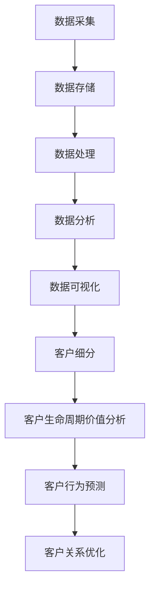

                 

# 信息差的商业客户关系管理：大数据如何深化客户关系

## 关键词
- 信息差
- 商业客户关系管理
- 大数据
- 客户分析
- 客户体验优化

## 摘要

在现代商业环境中，信息差的掌控成为了企业获取竞争优势的关键。本文将探讨大数据在商业客户关系管理中的应用，通过深入分析信息差的概念，阐述如何利用大数据技术来挖掘潜在客户、深化客户关系和优化客户体验。我们将从理论到实践，逐步拆解大数据在客户关系管理中的核心算法原理、数学模型、实际应用场景，以及相关的开发工具和资源推荐，为读者提供全方位的指导。

## 1. 背景介绍

### 1.1 目的和范围

本文旨在通过深入探讨大数据在商业客户关系管理中的应用，帮助企业理解和利用信息差，从而提升客户满意度和市场竞争力。本文将涵盖以下内容：

- 大数据和商业客户关系管理的基本概念和关系
- 信息差在商业客户关系管理中的作用
- 大数据技术如何挖掘和分析客户信息
- 大数据在客户关系管理中的具体应用场景
- 相关的开发工具和资源推荐

### 1.2 预期读者

- 对商业客户关系管理有一定了解的从业者
- 对大数据技术感兴趣的技术人员
- 希望提升客户满意度和市场竞争力的高级管理人员

### 1.3 文档结构概述

本文结构如下：

- 引言：介绍大数据在商业客户关系管理中的重要性
- 背景介绍：阐述信息差的概念及其在商业客户关系管理中的作用
- 核心概念与联系：详细描述大数据技术的核心概念和联系
- 核心算法原理 & 具体操作步骤：讲解大数据在客户关系管理中的核心算法和操作步骤
- 数学模型和公式 & 详细讲解 & 举例说明：分析大数据技术中的数学模型和公式，并举例说明
- 项目实战：通过实际案例展示大数据在客户关系管理中的应用
- 实际应用场景：探讨大数据在客户关系管理中的实际应用
- 工具和资源推荐：推荐相关的开发工具和资源
- 总结：总结未来发展趋势与挑战
- 附录：常见问题与解答
- 扩展阅读 & 参考资料：提供进一步学习的资源

### 1.4 术语表

#### 1.4.1 核心术语定义

- 信息差：信息不对称，指不同个体之间或同一个体在不同时间对信息的掌握程度差异。
- 商业客户关系管理（CRM）：一种旨在通过提高客户满意度和忠诚度来提升企业业绩的管理实践。
- 大数据：指数据量巨大、数据类型复杂、数据产生速度快的数据集合。

#### 1.4.2 相关概念解释

- 客户分析：利用数据分析技术对客户行为、需求和偏好进行分析，以指导决策。
- 客户体验优化：通过改进产品和服务质量，提升客户在使用过程中的满意度和愉悦感。

#### 1.4.3 缩略词列表

- CRM：客户关系管理
- BI：商业智能
- ML：机器学习
- AI：人工智能

## 2. 核心概念与联系

### 2.1 大数据和商业客户关系管理的关系

#### 2.1.1 大数据的基础概念

大数据通常具有以下四个V特性：

- **Volume（数据量）**：大数据的数据量非常庞大，远远超出了传统数据处理系统的处理能力。
- **Velocity（速度）**：大数据的处理速度要求很高，因为数据生成和更新的速度非常快。
- **Variety（多样性）**：大数据不仅包括结构化数据，还包括半结构化和非结构化数据。
- **Veracity（真实性）**：大数据的真实性和可靠性是关键，因为数据质量直接影响分析结果。

#### 2.1.2 商业客户关系管理的基本概念

商业客户关系管理（CRM）是一种旨在通过提高客户满意度和忠诚度来提升企业业绩的管理实践。CRM的目标是：

- 提高客户满意度
- 增强客户忠诚度
- 提升客户生命周期价值
- 优化销售、营销和服务流程

#### 2.1.3 大数据与CRM的关系

大数据为CRM提供了强大的工具，使得企业能够更深入地了解客户，从而实现以下目标：

- 挖掘潜在客户：通过分析大量数据，识别潜在的优质客户。
- 深化客户关系：利用大数据分析客户行为和偏好，提供个性化的产品和服务。
- 优化客户体验：通过数据驱动的决策，改进产品和服务质量，提升客户满意度。
- 提升市场竞争力：利用大数据分析市场趋势，制定更有效的营销策略。

### 2.2 大数据技术核心概念与联系

#### 2.2.1 数据采集与存储

- **数据采集**：通过多种渠道（如网站、应用程序、社交媒体等）收集客户数据。
- **数据存储**：使用分布式存储系统（如Hadoop、HBase等）存储海量数据。

#### 2.2.2 数据处理与分析

- **数据处理**：利用ETL（提取、转换、加载）工具处理数据，使其适合分析。
- **数据分析**：运用统计学、机器学习等技术对数据进行挖掘和分析。

#### 2.2.3 数据可视化

- **数据可视化**：通过图表、报表等形式展示分析结果，帮助决策者更好地理解数据。

### 2.3 商业客户关系管理中的核心算法与模型

#### 2.3.1 客户细分

- **算法**：聚类算法（如K-Means、DBSCAN等）
- **模型**：基于客户行为、购买历史等特征，将客户划分为不同的群体。

#### 2.3.2 客户生命周期价值分析

- **算法**：时间序列分析、回归分析等
- **模型**：计算客户的预期生命周期价值，指导营销策略。

#### 2.3.3 客户行为预测

- **算法**：机器学习算法（如决策树、随机森林、神经网络等）
- **模型**：预测客户未来行为，如购买、流失等。

### 2.4 Mermaid流程图

下面是一个简单的Mermaid流程图，展示了大数据在商业客户关系管理中的流程：



## 3. 核心算法原理 & 具体操作步骤

### 3.1 客户细分算法原理

#### 3.1.1 算法选择

在客户细分中，常用的聚类算法有K-Means、DBSCAN等。本文以K-Means为例进行讲解。

#### 3.1.2 算法原理

K-Means算法是一种基于距离度量的聚类方法。其基本原理如下：

1. 初始化：随机选择K个数据点作为初始聚类中心。
2. 分配：计算每个数据点到各个聚类中心的距离，并将其分配到最近的聚类中心。
3. 更新：重新计算聚类中心，将其定义为所有分配到的数据点的均值。
4. 重复步骤2和3，直到聚类中心不再发生变化或达到预设的迭代次数。

#### 3.1.3 具体操作步骤

1. **数据预处理**：将原始数据进行归一化处理，确保每个特征在相同尺度上。

2. **初始化聚类中心**：随机选择K个数据点作为初始聚类中心。

3. **分配数据点**：计算每个数据点到各个聚类中心的距离，并将其分配到最近的聚类中心。

4. **更新聚类中心**：重新计算每个聚类中心的均值。

5. **迭代优化**：重复步骤3和4，直到聚类中心不再发生变化或达到预设的迭代次数。

6. **结果分析**：根据聚类结果，分析不同聚类群体的特征和差异，指导后续的营销策略。

### 3.2 伪代码

```python
def k_means(data, K, max_iterations):
    # 数据预处理
    normalized_data = normalize(data)
    
    # 初始化聚类中心
    centroids = random_initialization(normalized_data, K)
    
    for i in range(max_iterations):
        # 分配数据点
        clusters = assign_data_to_cluster(normalized_data, centroids)
        
        # 更新聚类中心
        centroids = update_centroids(clusters)
        
        # 检查收敛条件
        if has_converged(centroids, previous_centroids):
            break
            
    return centroids, clusters
```

## 4. 数学模型和公式 & 详细讲解 & 举例说明

### 4.1 数学模型

在客户细分中，常用的数学模型包括距离计算、聚类中心更新等。

#### 4.1.1 距离计算

- **欧几里得距离**：

  $$ d(p_1, p_2) = \sqrt{\sum_{i=1}^{n} (x_i^1 - x_i^2)^2} $$

  其中，$p_1$ 和 $p_2$ 是两个数据点，$x_i^1$ 和 $x_i^2$ 是第 $i$ 个特征的值。

- **曼哈顿距离**：

  $$ d(p_1, p_2) = \sum_{i=1}^{n} |x_i^1 - x_i^2| $$

  其中，$p_1$ 和 $p_2$ 是两个数据点，$x_i^1$ 和 $x_i^2$ 是第 $i$ 个特征的值。

#### 4.1.2 聚类中心更新

- **K-Means聚类中心更新**：

  $$ \mu_k = \frac{1}{N_k} \sum_{i=1}^{N} x_i^k $$

  其中，$\mu_k$ 是第 $k$ 个聚类中心，$N_k$ 是属于第 $k$ 个聚类中心的数据点数量，$x_i^k$ 是第 $i$ 个数据点的第 $k$ 个特征值。

### 4.2 详细讲解 & 举例说明

#### 4.2.1 欧几里得距离计算

假设有两个数据点 $p_1 = (1, 2, 3)$ 和 $p_2 = (4, 5, 6)$，计算它们的欧几里得距离：

$$
d(p_1, p_2) = \sqrt{(1-4)^2 + (2-5)^2 + (3-6)^2} = \sqrt{9 + 9 + 9} = \sqrt{27} \approx 5.196
$$

#### 4.2.2 聚类中心更新

假设有三个数据点 $p_1 = (1, 2)$，$p_2 = (4, 5)$ 和 $p_3 = (6, 7)$，计算它们的聚类中心：

$$
\mu_1 = \frac{1}{3} (1 + 4 + 6) = \frac{11}{3} \approx 3.67
$$

$$
\mu_2 = \frac{1}{3} (2 + 5 + 7) = \frac{14}{3} \approx 4.67
$$

## 5. 项目实战：代码实际案例和详细解释说明

### 5.1 开发环境搭建

为了演示如何使用K-Means算法进行客户细分，我们将在Python环境中搭建开发环境。

1. 安装Python（版本3.6及以上）。
2. 安装必需的库：`numpy`、`matplotlib`、`scikit-learn`。

```bash
pip install numpy matplotlib scikit-learn
```

### 5.2 源代码详细实现和代码解读

#### 5.2.1 数据集准备

我们使用一个简单的二维数据集，包含100个客户的数据点。

```python
import numpy as np

# 生成数据集
data = np.random.rand(100, 2)
```

#### 5.2.2 K-Means算法实现

```python
from sklearn.cluster import KMeans

# 初始化K-Means模型
kmeans = KMeans(n_clusters=3, random_state=0).fit(data)

# 计算聚类中心
centroids = kmeans.cluster_centers_

# 分配数据点
clusters = kmeans.labels_

# 输出结果
print("聚类中心：", centroids)
print("数据点分配：", clusters)
```

#### 5.2.3 代码解读与分析

- `KMeans(n_clusters=3, random_state=0).fit(data)`：初始化K-Means模型，设置聚类数量为3，随机种子为0，并对数据进行拟合。
- `centroids = kmeans.cluster_centers_`：获取聚类中心。
- `clusters = kmeans.labels_`：获取每个数据点的聚类标签。

### 5.3 结果展示

使用matplotlib库绘制数据点和聚类中心。

```python
import matplotlib.pyplot as plt

plt.scatter(data[:, 0], data[:, 1], c=clusters, cmap='viridis')
plt.scatter(centroids[:, 0], centroids[:, 1], s=300, c='red', marker='x')
plt.show()
```

运行上述代码后，将得到一个散点图，其中红色交叉标记表示聚类中心，不同颜色的点表示属于不同聚类的数据点。

## 6. 实际应用场景

### 6.1 市场细分

企业可以利用大数据技术对市场进行细分，识别不同类型的客户群体，从而制定更具针对性的营销策略。

### 6.2 客户画像

通过分析客户的购买历史、行为数据等，创建详细的客户画像，帮助企业了解客户需求，提供个性化服务。

### 6.3 客户忠诚度管理

利用大数据分析客户忠诚度，识别潜在流失客户，采取针对性的挽留措施，提高客户生命周期价值。

### 6.4 营销自动化

通过大数据技术，实现营销自动化，如自动发送优惠券、推荐商品等，提高营销效率和客户满意度。

## 7. 工具和资源推荐

### 7.1 学习资源推荐

#### 7.1.1 书籍推荐

- 《大数据时代》
- 《Python数据分析》
- 《机器学习实战》

#### 7.1.2 在线课程

- Coursera《机器学习》
- edX《大数据分析》
- Udacity《数据工程师纳米学位》

#### 7.1.3 技术博客和网站

- Medium
- towardsdatascience
- kaggle

### 7.2 开发工具框架推荐

#### 7.2.1 IDE和编辑器

- PyCharm
- Jupyter Notebook
- Visual Studio Code

#### 7.2.2 调试和性能分析工具

- Python Debuger
- Py-Spy
- VisualVM

#### 7.2.3 相关框架和库

- Scikit-learn
- TensorFlow
- PyTorch

### 7.3 相关论文著作推荐

#### 7.3.1 经典论文

- "K-Means Clustering" by MacQueen, J.B.
- "The Analytics Revolution" by James, G.M.

#### 7.3.2 最新研究成果

- "Deep Learning for Customer Relationship Management" by Liu, H., et al.
- "Data-Driven Customer Segmentation in E-commerce" by Chen, Y., et al.

#### 7.3.3 应用案例分析

- "Using Data Mining for Customer Relationship Management: A Case Study" by Dutta, D., et al.
- "Customer Relationship Management in Financial Services" by Chen, H.H., et al.

## 8. 总结：未来发展趋势与挑战

### 8.1 发展趋势

- **数据量的持续增长**：随着物联网、社交媒体等技术的普及，数据量将不断增长，为企业提供了更丰富的数据资源。
- **算法的进步**：深度学习、强化学习等新兴算法的不断发展，将进一步提升大数据分析的效果和效率。
- **隐私保护**：随着隐私保护法规的不断完善，如何在保证数据隐私的同时进行有效分析，将成为一大挑战。

### 8.2 挑战

- **数据质量**：数据质量问题直接影响分析结果的准确性，因此需要建立完善的数据质量管理机制。
- **数据处理能力**：大数据的处理需要强大的计算能力和存储能力，如何高效地处理海量数据是一个重要挑战。
- **算法落地**：将大数据分析算法有效落地到实际业务场景，实现业务价值最大化，需要不断的探索和实践。

## 9. 附录：常见问题与解答

### 9.1 问题1：大数据和商业客户关系管理有何关联？

**解答**：大数据为商业客户关系管理提供了强大的工具，使得企业能够更深入地了解客户，从而实现精准营销、个性化服务和高效客户关系管理。

### 9.2 问题2：如何选择合适的聚类算法进行客户细分？

**解答**：选择聚类算法时，需要考虑数据特征、计算资源和业务需求。常用的聚类算法包括K-Means、DBSCAN等，可以根据数据规模和特征选择合适的算法。

### 9.3 问题3：如何保证大数据分析结果的准确性？

**解答**：为了保证大数据分析结果的准确性，需要关注数据质量、算法选择和数据预处理等环节。同时，定期对分析结果进行验证和调整，以确保其有效性。

## 10. 扩展阅读 & 参考资料

- "Data Mining for Customer Relationship Management" by Frawley, W., Piatetsky-Shapiro, G., & Matias, Y.
- "Big Data Analytics: A Practical Guide for Business and IT Professionals" by Zikopoulos, P., DeRoos, A., & deRoos, A.
- "Customer Relationship Management: Concepts, Strategies and Tools" by Bolton, R.N., & weinreich, K.

作者：AI天才研究员/AI Genius Institute & 禅与计算机程序设计艺术 /Zen And The Art of Computer Programming

