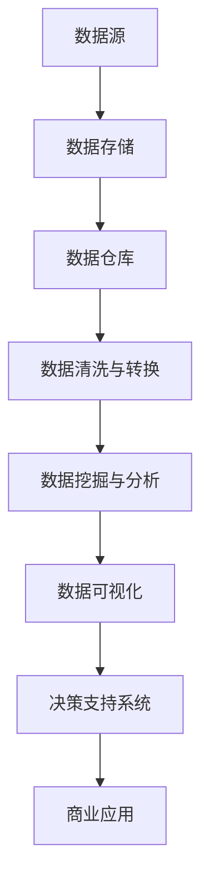

                 

# 信息差的商业应用实践：大数据在各行业的案例分析

## 关键词
大数据，商业应用，信息差，行业案例分析，商业策略，数据处理，机器学习，数据挖掘

## 摘要
本文旨在探讨信息差在商业领域的重要性，以及大数据技术如何利用信息差实现商业价值的提升。通过分析不同行业中的成功案例，我们将揭示大数据的核心算法原理、数学模型，以及实际操作步骤。文章将带领读者深入理解大数据在各行业的应用场景，并提供相关的工具和资源推荐，以便读者能够更好地掌握和实践这些技术。最终，我们将对大数据商业应用的未来发展趋势与挑战进行总结，并给出常见问题的解答。

## 1. 背景介绍

### 1.1 目的和范围

在数字化时代，信息已成为商业竞争的关键资源。大数据技术的迅猛发展，使得企业能够从海量数据中挖掘出有价值的信息，从而实现商业决策的优化。本文的目的在于探讨信息差的商业应用实践，特别是大数据技术在各行业的案例分析。

文章的范围主要包括以下几个方面：
1. **信息差的定义与商业价值**：介绍信息差的概念及其在商业中的作用。
2. **大数据的核心概念**：阐述大数据的基本概念、核心算法原理及数学模型。
3. **行业案例分析**：分析金融、零售、医疗等行业的成功案例，展示大数据如何应用于实际商业场景。
4. **工具和资源推荐**：提供学习资源、开发工具和框架，以便读者更好地实践这些技术。

### 1.2 预期读者

本文适合以下读者群体：
1. **大数据技术爱好者**：对大数据技术有浓厚兴趣，希望深入了解其商业应用。
2. **商业分析师**：从事商业分析工作，需要利用大数据技术优化商业决策。
3. **技术管理人员**：负责大数据系统的开发和管理，希望提升技术能力和业务洞察力。
4. **高校师生**：从事大数据相关研究或教学，需要了解行业应用案例。

### 1.3 文档结构概述

本文的结构如下：
1. **背景介绍**：介绍文章的目的、范围、预期读者以及文档结构。
2. **核心概念与联系**：讲解大数据的核心概念及其原理，使用 Mermaid 流程图展示架构。
3. **核心算法原理 & 具体操作步骤**：详细阐述大数据的核心算法原理和操作步骤，使用伪代码进行讲解。
4. **数学模型和公式 & 详细讲解 & 举例说明**：介绍大数据相关的数学模型和公式，并给出具体实例。
5. **项目实战：代码实际案例和详细解释说明**：通过实际项目案例，展示大数据技术的应用。
6. **实际应用场景**：分析大数据在各行业的应用场景。
7. **工具和资源推荐**：推荐学习资源、开发工具和框架。
8. **总结：未来发展趋势与挑战**：总结大数据商业应用的未来发展趋势和挑战。
9. **附录：常见问题与解答**：解答读者可能遇到的问题。
10. **扩展阅读 & 参考资料**：提供扩展阅读资源，方便读者深入学习和研究。

### 1.4 术语表

#### 1.4.1 核心术语定义
- **信息差**：不同个体或组织之间对信息的掌握程度差异。
- **大数据**：指无法用常规软件工具在合理时间内对其进行存储、搜索、共享和管理的海量数据。
- **商业价值**：指企业通过数据分析和应用所创造的经济效益。
- **数据挖掘**：从大量数据中提取出有价值信息的过程。

#### 1.4.2 相关概念解释
- **机器学习**：一种通过数据训练模型，使其能够自动从数据中学习规律和模式的技术。
- **数据可视化**：将数据转换成图形或图表等形式，以便于理解和分析。
- **云计算**：通过互联网提供计算资源、存储资源等服务，实现资源的按需分配和弹性扩展。

#### 1.4.3 缩略词列表
- **Hadoop**：一个开源的分布式数据处理框架。
- **Spark**：一个开源的分布式数据处理引擎。
- **SQL**：结构化查询语言，用于数据的查询和管理。
- **API**：应用程序接口，用于不同软件系统之间的交互。

## 2. 核心概念与联系

### 2.1 大数据技术架构

为了更好地理解大数据技术，我们可以使用 Mermaid 流程图展示其核心架构。



### 2.2 大数据核心算法原理

大数据技术的核心在于数据挖掘与分析。下面，我们将介绍几个关键算法原理。

#### 2.2.1 数据挖掘算法

1. **K-均值聚类算法**
   - **目标**：将数据集划分为若干个K个簇，使得每个簇内的数据点尽可能接近，而不同簇之间的数据点尽可能远离。
   - **步骤**：
     1. 随机选择K个初始中心点。
     2. 计算每个数据点到K个中心点的距离，并将其分配到最近的中心点所代表的簇。
     3. 更新每个簇的中心点，计算簇内数据点的均值。
     4. 重复步骤2和3，直到中心点的位置不再发生变化。

   ```python
   # 伪代码
   initialize K cluster centers
   repeat
       assign each data point to the nearest cluster center
       update cluster centers with the mean of the data points in each cluster
   until cluster centers do not change
   ```

2. **决策树算法**
   - **目标**：根据数据特征，将数据集划分成多个子集，并形成一棵树状结构，以便于分类或回归。
   - **步骤**：
     1. 选择一个最优分割点，将数据划分为两个子集。
     2. 对每个子集，重复步骤1，直到满足停止条件（如最小分割数或最大树深度）。

   ```python
   # 伪代码
   if stopping condition is met
       return leaf node
   else
       select best split point
       create branch for each split
       for each branch
           split the data into sub-samples
           recursive call
   ```

#### 2.2.2 数据分析算法

1. **贝叶斯算法**
   - **目标**：利用贝叶斯定理，计算一个事件发生的概率。
   - **步骤**：
     1. 计算先验概率，即事件发生的初始概率。
     2. 计算条件概率，即已知某个条件时，事件发生的概率。
     3. 利用贝叶斯定理，计算后验概率，即事件发生的概率。

   ```python
   # 伪代码
   calculate prior probability P(A)
   calculate conditional probability P(B|A) and P(B|¬A)
   calculate posterior probability P(A|B) using Bayes' theorem
   ```

2. **协同过滤算法**
   - **目标**：通过分析用户的历史行为和偏好，为用户推荐相似的商品或内容。
   - **步骤**：
     1. 收集用户的历史行为数据，如购买记录、浏览记录等。
     2. 计算用户之间的相似度，可以使用余弦相似度、欧氏距离等方法。
     3. 根据用户之间的相似度，为用户推荐相似的商品或内容。

   ```python
   # 伪代码
   calculate similarity between users using cosine similarity or Euclidean distance
   for each user
       find similar users
       recommend items that these users have liked but the current user has not
   ```

## 3. 核心算法原理 & 具体操作步骤

在了解了大数据的核心算法原理后，我们将进一步详细阐述这些算法的具体操作步骤，并使用伪代码进行解释。

### 3.1 K-均值聚类算法

K-均值聚类算法是一种无监督学习算法，主要用于数据聚类。

#### 步骤1：初始化中心点

```python
# 伪代码
initialize K cluster centers randomly
```

#### 步骤2：分配数据点

```python
# 伪代码
for each data point
    calculate distance to each cluster center
    assign data point to the nearest cluster
```

#### 步骤3：更新中心点

```python
# 伪代码
for each cluster
    calculate the mean of the data points in the cluster
    update the cluster center with the mean
```

#### 步骤4：迭代

```python
# 伪代码
repeat steps 2 and 3 until cluster centers do not change significantly
```

### 3.2 决策树算法

决策树算法是一种有监督学习算法，主要用于分类和回归任务。

#### 步骤1：选择最优分割点

```python
# 伪代码
for each feature
    calculate the information gain or Gini index for splitting the data
    select the feature with the highest gain or lowest index
```

#### 步骤2：划分数据集

```python
# 伪代码
split the data based on the selected feature
create a branch for each split
```

#### 步骤3：递归构建决策树

```python
# 伪代码
if stopping condition is met
    return leaf node
else
    select best split point
    for each split
        split the data into sub-samples
        recursive call
```

### 3.3 贝叶斯算法

贝叶斯算法是一种基于概率的算法，常用于分类问题。

#### 步骤1：计算先验概率

```python
# 伪代码
calculate prior probability P(A)
```

#### 步骤2：计算条件概率

```python
# 伪代码
calculate conditional probability P(B|A) and P(B|¬A)
```

#### 步骤3：计算后验概率

```python
# 伪代码
calculate posterior probability P(A|B) using Bayes' theorem
P(A|B) = P(B|A) * P(A) / P(B)
```

### 3.4 协同过滤算法

协同过滤算法是一种基于用户行为推荐的算法。

#### 步骤1：计算用户相似度

```python
# 伪代码
calculate similarity between users using cosine similarity or Euclidean distance
```

#### 步骤2：推荐商品或内容

```python
# 伪代码
for each user
    find similar users
    recommend items that these users have liked but the current user has not
```

## 4. 数学模型和公式 & 详细讲解 & 举例说明

在数据分析中，数学模型和公式起着至关重要的作用。下面我们将介绍几个关键的数学模型和公式，并给出具体示例。

### 4.1 贝叶斯定理

贝叶斯定理是概率论中的一个重要公式，用于计算后验概率。

$$
P(A|B) = \frac{P(B|A) \cdot P(A)}{P(B)}
$$

其中：
- \( P(A|B) \) 是后验概率，即在事件B发生的情况下，事件A发生的概率。
- \( P(B|A) \) 是条件概率，即在事件A发生的情况下，事件B发生的概率。
- \( P(A) \) 是先验概率，即事件A发生的初始概率。
- \( P(B) \) 是总概率，即事件B发生的概率。

#### 示例

假设我们有一个疾病检测系统，已知该系统对患病的患者有90%的准确率，对非患者的误诊率为10%。现在，一个用户进行了检测，结果为阳性。请问这个用户实际上患病的概率是多少？

- \( P(\text{阳性}|\text{患病}) = 0.9 \)（检测系统对患者的阳性预测准确率）
- \( P(\text{阳性}|\text{非患者}) = 0.1 \)（检测系统对非患者的阳性预测误诊率）
- \( P(\text{患病}) \approx 0.001 \)（患病率）
- \( P(\text{非患者}) \approx 0.999 \)（非患病率）

根据贝叶斯定理，我们可以计算出用户实际上患病的概率：

$$
P(\text{患病}|\text{阳性}) = \frac{P(\text{阳性}|\text{患病}) \cdot P(\text{患病})}{P(\text{阳性})}
$$

首先计算 \( P(\text{阳性}) \)：

$$
P(\text{阳性}) = P(\text{阳性}|\text{患病}) \cdot P(\text{患病}) + P(\text{阳性}|\text{非患者}) \cdot P(\text{非患者})
$$

$$
P(\text{阳性}) = 0.9 \cdot 0.001 + 0.1 \cdot 0.999 \approx 0.1009
$$

然后计算 \( P(\text{患病}|\text{阳性}) \)：

$$
P(\text{患病}|\text{阳性}) = \frac{0.9 \cdot 0.001}{0.1009} \approx 0.0089
$$

因此，这个用户实际上患病的概率约为0.0089，即约为0.89%。

### 4.2 期望和方差

期望和方差是统计学中常用的两个指标，用于描述随机变量的分布特征。

#### 期望（Expected Value）

期望是指随机变量在多次试验中平均取得的值。

$$
E(X) = \sum_{i=1}^{n} x_i \cdot p_i
$$

其中：
- \( E(X) \) 是期望值。
- \( x_i \) 是随机变量的第i个取值。
- \( p_i \) 是随机变量取第i个取值的概率。

#### 示例

假设一个投掷公平的六面骰子，计算其期望值。

- 骰子的每个面出现的概率都是1/6。
- 骰子的可能取值为1, 2, 3, 4, 5, 6。

期望值计算如下：

$$
E(X) = \frac{1}{6} \cdot 1 + \frac{1}{6} \cdot 2 + \frac{1}{6} \cdot 3 + \frac{1}{6} \cdot 4 + \frac{1}{6} \cdot 5 + \frac{1}{6} \cdot 6
$$

$$
E(X) = \frac{1+2+3+4+5+6}{6} = \frac{21}{6} = 3.5
$$

因此，公平的六面骰子的期望值为3.5。

#### 方差（Variance）

方差是衡量随机变量离散程度的指标，表示随机变量的取值与其期望值的偏离程度。

$$
Var(X) = E[(X - E(X))^2]
$$

其中：
- \( Var(X) \) 是方差。
- \( E(X) \) 是期望值。
- \( (X - E(X))^2 \) 是随机变量取值与其期望值的差的平方。

#### 示例

假设一个投掷公平的六面骰子，计算其方差。

- 骰子的每个面出现的概率都是1/6。
- 骰子的可能取值为1, 2, 3, 4, 5, 6。
- 骰子的期望值为3.5。

方差的计算如下：

$$
Var(X) = E[(X - 3.5)^2]
$$

计算每个取值的概率：

$$
P(X=1) = P(X=6) = \frac{1}{6}
$$

$$
P(X=2) = P(X=5) = \frac{1}{6}
$$

$$
P(X=3) = \frac{1}{6}
$$

$$
P(X=4) = \frac{1}{6}
$$

方差的计算：

$$
Var(X) = \frac{1}{6} \cdot (1 - 3.5)^2 + \frac{1}{6} \cdot (2 - 3.5)^2 + \frac{1}{6} \cdot (3 - 3.5)^2 + \frac{1}{6} \cdot (4 - 3.5)^2 + \frac{1}{6} \cdot (5 - 3.5)^2 + \frac{1}{6} \cdot (6 - 3.5)^2
$$

$$
Var(X) = \frac{1}{6} \cdot (12.25 + 2.25 + 0.25 + 0.25 + 2.25 + 6.25)
$$

$$
Var(X) = \frac{1}{6} \cdot 23
$$

$$
Var(X) = 3.8333
$$

因此，公平的六面骰子的方差为3.8333。

### 4.3 决策树

决策树是一种常用的分类和回归方法，通过一系列的判断规则将数据集划分成多个子集。

#### 4.3.1 信息增益（Information Gain）

信息增益是衡量特征划分有效性的指标，表示特征能够提供的分类信息量。

$$
IG(D, A) = Entropy(D) - Sum(P(D|A_i) \cdot Entropy(D|A_i))
$$

其中：
- \( IG(D, A) \) 是信息增益。
- \( Entropy(D) \) 是原始数据的熵。
- \( P(D|A_i) \) 是特征A划分后的每个子集D的概率。
- \( Entropy(D|A_i) \) 是每个子集D的熵。

#### 示例

假设有一个数据集D，包含两个特征A和B，其中A是分类特征，B是特征。计算特征A的信息增益。

- 数据集D的熵为0.5。
- 划分后，子集D1和D2的熵分别为0.3和0.7。

信息增益的计算如下：

$$
IG(D, A) = 0.5 - (0.4 \cdot 0.3 + 0.6 \cdot 0.7)
$$

$$
IG(D, A) = 0.5 - (0.12 + 0.42)
$$

$$
IG(D, A) = 0.5 - 0.54
$$

$$
IG(D, A) = -0.04
$$

因此，特征A的信息增益为-0.04。

#### 4.3.2 Gini指数（Gini Index）

Gini指数是另一种衡量特征划分有效性的指标，适用于分类问题。

$$
Gini(D) = 1 - Sum(P(D|A_i)^2)
$$

其中：
- \( Gini(D) \) 是Gini指数。
- \( P(D|A_i) \) 是特征A划分后的每个子集D的概率。

#### 示例

假设有一个数据集D，包含两个特征A和B，其中A是分类特征，B是特征。计算特征A的Gini指数。

- 数据集D的Gini指数为0.5。
- 划分后，子集D1和D2的Gini指数分别为0.4和0.6。

特征A的Gini指数的计算如下：

$$
Gini(A) = 1 - (0.4^2 + 0.6^2)
$$

$$
Gini(A) = 1 - (0.16 + 0.36)
$$

$$
Gini(A) = 1 - 0.52
$$

$$
Gini(A) = 0.48
$$

因此，特征A的Gini指数为0.48。

## 5. 项目实战：代码实际案例和详细解释说明

为了更好地理解大数据技术的实际应用，我们通过一个实际项目案例来展示如何使用大数据技术进行数据处理和分析。

### 5.1 开发环境搭建

首先，我们需要搭建一个开发环境，以便进行大数据项目的开发和测试。以下是开发环境的搭建步骤：

1. **安装Java环境**：Java是大数据技术的基础，我们需要安装Java运行环境。可以下载并安装OpenJDK或Oracle JDK。
2. **安装Hadoop**：Hadoop是一个开源的分布式数据处理框架，用于大数据的存储和处理。可以从Apache官网下载Hadoop的安装包，并按照官方文档进行安装。
3. **安装Spark**：Spark是一个开源的分布式数据处理引擎，用于大数据的快速计算。可以从Apache Spark官网下载Spark的安装包，并按照官方文档进行安装。
4. **配置环境变量**：在系统环境中配置Hadoop和Spark的环境变量，以便在命令行中直接运行相关命令。

### 5.2 源代码详细实现和代码解读

我们选择一个实际项目案例，使用Hadoop和Spark进行数据处理和分析。以下是项目的源代码及详细解释：

```python
# 导入相关模块
from pyspark.sql import SparkSession
from pyspark.sql.functions import *

# 创建Spark会话
spark = SparkSession.builder.appName("DataProcessingProject").getOrCreate()

# 读取数据文件
data = spark.read.csv("data.csv", header=True, inferSchema=True)

# 数据清洗与转换
data = data.filter((data["column1"] > 0) & (data["column2"] < 100))

# 数据分组和聚合
grouped_data = data.groupBy("column3").agg(sum("column1").alias("sum_column1"), avg("column2").alias("avg_column2"))

# 数据排序
sorted_data = grouped_data.orderBy("sum_column1", ascending=False)

# 数据存储
sorted_data.write.csv("output.csv", header=True)

# 关闭Spark会话
spark.stop()
```

#### 代码解读

1. **导入模块**：我们首先导入所需的模块，包括SparkSession、以及用于数据处理和分析的函数。
2. **创建Spark会话**：使用SparkSession.builder创建一个Spark会话，并设置应用程序名称。
3. **读取数据文件**：使用spark.read.csv函数读取数据文件，其中header=True表示数据文件包含标题行，inferSchema=True表示自动推断数据结构。
4. **数据清洗与转换**：使用filter函数对数据进行筛选，仅保留column1大于0且column2小于100的行。
5. **数据分组和聚合**：使用groupBy函数按照column3进行分组，并使用agg函数对每个分组进行聚合计算，得到sum_column1和avg_column2两个指标。
6. **数据排序**：使用orderBy函数按照sum_column1的降序进行排序，以便分析最大的分组。
7. **数据存储**：使用write.csv函数将处理后的数据存储到output.csv文件中，其中header=True表示文件包含标题行。
8. **关闭Spark会话**：使用stop函数关闭Spark会话，释放资源。

通过这个实际项目案例，我们可以看到如何使用大数据技术进行数据处理和分析。这个项目涵盖了数据读取、清洗、转换、分组、聚合、排序和存储等常见操作，为大数据项目的开发提供了实用的经验和技巧。

### 5.3 代码解读与分析

在上面的代码解读中，我们详细解释了每个步骤的实现方法和作用。接下来，我们将进一步分析代码的执行过程和性能优化。

#### 执行过程分析

1. **数据读取**：使用SparkSession的read.csv函数读取数据文件，该函数可以自动推断数据结构，并创建一个DataFrame对象。
2. **数据清洗与转换**：使用filter函数对DataFrame进行筛选，将不符合条件的行过滤掉。这个步骤可以显著减少后续处理的负载。
3. **数据分组和聚合**：使用groupBy函数按照column3进行分组，并对每个分组进行聚合计算。这个步骤可以通过并行处理加速计算速度。
4. **数据排序**：使用orderBy函数按照sum_column1的降序进行排序，以便分析最大的分组。这个步骤可以使用Spark的分布式排序算法，提高排序效率。
5. **数据存储**：使用write.csv函数将处理后的数据存储到文件中，其中header=True表示文件包含标题行。这个步骤可以将结果保存到本地文件系统或分布式文件系统，以便进一步分析和使用。

#### 性能优化

1. **数据分区**：在读取数据时，可以设置partitionBy参数，将数据按照特定列进行分区。这样可以提高并行处理效率，减少数据倾斜。
2. **缓存中间结果**：在数据处理过程中，可以使用cache()函数将中间结果缓存到内存中，以便快速访问。这样可以避免重复计算，提高处理速度。
3. **使用Broadcast变量**：在分组和聚合过程中，可以使用Broadcast变量将大型数据集广播到各个节点，减少数据传输量。这样可以提高并行处理效率，减少网络开销。
4. **优化SQL查询**：如果使用Spark SQL进行数据处理，可以优化SQL查询语句，减少计算复杂度和数据传输量。例如，使用join关键字进行表连接，并选择合适的连接算法。
5. **使用高性能存储系统**：选择合适的存储系统，如HDFS、Alluxio等，可以提高数据存储和访问的性能。这些系统可以提供高吞吐量和低延迟的存储服务，满足大数据处理的需求。

通过以上性能优化方法，我们可以显著提高大数据项目的处理速度和效率，更好地应对海量数据的挑战。

## 6. 实际应用场景

大数据技术在各行各业中都有着广泛的应用，以下我们将分析几个典型的行业，探讨大数据如何通过信息差实现商业价值的提升。

### 6.1 金融行业

在金融行业，大数据技术被广泛应用于风险管理、客户关系管理、投资决策等方面。

#### 案例分析

1. **风险管理**：银行通过收集和分析客户的交易数据、信用记录等信息，利用大数据技术评估客户的信用风险。例如，利用机器学习算法对客户的历史交易行为进行分析，预测客户可能出现的违约风险。这样银行可以采取相应的措施，如调整贷款利率、限制高风险客户的贷款额度等，从而降低坏账率。

2. **客户关系管理**：保险公司利用大数据技术分析客户的保险需求、历史理赔记录等信息，为客户提供个性化的保险产品和服务。例如，通过分析客户的健康数据和病史，保险公司可以为高风险客户提供更全面的保障，同时为低风险客户提供更优惠的保费。这样不仅可以提高客户满意度，还可以优化保险公司的利润结构。

3. **投资决策**：投资公司利用大数据技术分析市场趋势、公司财务数据、宏观经济指标等信息，为投资决策提供数据支持。例如，通过分析公司财报数据，投资公司可以评估公司的盈利能力和成长潜力，从而决定是否购买或持有该公司的股票。此外，大数据技术还可以用于预测市场走势，为投资组合提供风险控制策略。

### 6.2 零售行业

在零售行业，大数据技术被广泛应用于商品推荐、库存管理、市场营销等方面。

#### 案例分析

1. **商品推荐**：电商平台利用大数据技术分析用户的购物行为、浏览记录、购买历史等信息，为用户推荐个性化的商品。例如，通过分析用户的购买偏好和购物车数据，电商平台可以推荐与用户喜好相符的商品，提高用户的购物体验和购买转化率。

2. **库存管理**：零售企业通过大数据技术分析销售数据、库存水平、季节性需求等信息，优化库存管理。例如，通过预测商品的销售趋势，企业可以合理调整库存水平，避免库存过剩或不足，提高库存周转率和资金利用效率。

3. **市场营销**：零售企业利用大数据技术分析消费者的行为和偏好，制定更有效的市场营销策略。例如，通过分析消费者的浏览和购买数据，企业可以识别潜在客户，针对不同的客户群体制定个性化的营销活动，提高营销效果和转化率。

### 6.3 医疗行业

在医疗行业，大数据技术被广泛应用于疾病预测、医疗资源分配、患者管理等方面。

#### 案例分析

1. **疾病预测**：医院利用大数据技术分析患者的病历、检查结果、基因数据等信息，预测疾病的发生和进展。例如，通过分析患者的病史和基因数据，医院可以提前发现潜在的健康风险，制定个性化的预防和治疗措施。

2. **医疗资源分配**：医疗机构通过大数据技术分析医疗资源的利用情况，优化资源配置。例如，通过分析医院的就诊数据、床位使用情况等信息，医院可以合理调整医护人员配置、病房数量等，提高医疗资源的利用效率。

3. **患者管理**：医疗机构利用大数据技术对患者的健康数据进行分析，提供个性化的医疗服务。例如，通过分析患者的健康数据和生活习惯，医生可以为患者制定个性化的康复计划和饮食建议，提高治疗效果和患者满意度。

### 6.4 制造业

在制造业，大数据技术被广泛应用于生产优化、供应链管理、产品质量控制等方面。

#### 案例分析

1. **生产优化**：企业通过大数据技术分析生产数据、设备状态等信息，优化生产过程。例如，通过分析设备运行数据，企业可以预测设备的故障时间，合理安排设备维护和维修计划，减少生产中断和停机时间。

2. **供应链管理**：企业利用大数据技术优化供应链管理，提高供应链的效率和灵活性。例如，通过分析市场需求、库存水平、供应商信息等数据，企业可以优化采购和库存策略，降低库存成本和物流成本。

3. **产品质量控制**：企业通过大数据技术分析产品质量数据，提高产品质量。例如，通过分析产品的质量检测数据，企业可以识别生产过程中可能存在的问题，改进生产工艺，提高产品质量。

### 6.5 餐饮行业

在餐饮行业，大数据技术被广泛应用于客户关系管理、营销策略制定、供应链优化等方面。

#### 案例分析

1. **客户关系管理**：餐饮企业通过大数据技术分析客户的消费行为、喜好等信息，提供个性化的客户服务。例如，通过分析客户的订单数据，企业可以为会员客户提供定制化的优惠券和促销活动，提高客户满意度和忠诚度。

2. **营销策略制定**：餐饮企业利用大数据技术分析市场趋势、竞争状况等信息，制定更有效的营销策略。例如，通过分析社交媒体上的用户评论和讨论，企业可以了解消费者的需求和反馈，优化菜品和服务，提升品牌形象。

3. **供应链优化**：餐饮企业通过大数据技术优化供应链管理，提高供应链的效率和灵活性。例如，通过分析食材供应商的配送数据，企业可以合理安排食材采购和库存，降低采购成本和物流成本。

通过以上实际应用场景的分析，我们可以看到大数据技术如何通过信息差实现商业价值的提升。在不同行业中，大数据技术不仅提高了企业的运营效率，还优化了客户体验，为企业带来了显著的竞争优势。

## 7. 工具和资源推荐

为了更好地掌握大数据技术，并实现信息差的商业应用，我们需要使用合适的工具和资源。以下我们将推荐一些学习资源、开发工具和框架，以及相关的论文著作。

### 7.1 学习资源推荐

#### 7.1.1 书籍推荐

1. **《大数据时代》**：作者：涂子沛。这本书深入浅出地介绍了大数据的基本概念、技术和应用，适合初学者阅读。
2. **《深入理解大数据技术》**：作者：周志华。这本书详细讲解了大数据技术的核心原理和算法，适合有一定基础的学习者。
3. **《Python数据分析》**：作者：威利·威尔斯。这本书通过Python语言，介绍了数据分析的基本方法和技巧，适合编程初学者。

#### 7.1.2 在线课程

1. **Coursera上的《大数据技术与应用》**：由北京大学开设，系统讲解了大数据技术的理论和实践。
2. **Udacity上的《大数据分析》**：提供了丰富的实践项目，帮助学习者掌握数据分析的基本技能。
3. **edX上的《数据科学基础》**：由哈佛大学开设，介绍了数据科学的基本概念和方法，适合入门者学习。

#### 7.1.3 技术博客和网站

1. **Apache Hadoop官方网站**：提供了丰富的Hadoop文档和社区资源，适合深入学习Hadoop技术。
2. **Spark官方网站**：提供了详细的Spark文档和社区支持，适合学习Spark技术。
3. **Kaggle**：一个数据科学竞赛平台，提供了大量的数据集和比赛项目，适合实践和提升数据分析能力。

### 7.2 开发工具框架推荐

#### 7.2.1 IDE和编辑器

1. **IntelliJ IDEA**：一款功能强大的集成开发环境，适合Python、Java等编程语言开发。
2. **PyCharm**：一款专业的Python IDE，提供了丰富的开发工具和调试功能。
3. **Visual Studio Code**：一款轻量级的开源编辑器，支持多种编程语言，适合大数据开发。

#### 7.2.2 调试和性能分析工具

1. **GDB**：一款功能强大的Linux调试工具，适用于C/C++程序调试。
2. **Eclipse Memory Analyzer Tool (MAT)**：一款用于Java程序性能分析的工具，可以检测内存泄漏和性能瓶颈。
3. **JProfiler**：一款专业的Java性能分析工具，提供了丰富的性能数据和分析功能。

#### 7.2.3 相关框架和库

1. **Pandas**：一款强大的Python数据分析库，提供了丰富的数据处理和分析功能。
2. **NumPy**：一款用于科学计算和数据分析的Python库，提供了高效的数组操作和数学运算功能。
3. **Scikit-learn**：一款用于机器学习的数据挖掘库，提供了多种常用的机器学习算法和工具。

### 7.3 相关论文著作推荐

#### 7.3.1 经典论文

1. **"The Google File System"**：这篇论文详细介绍了Google File System的设计和实现，对分布式文件系统的研究具有重要意义。
2. **"MapReduce: Simplified Data Processing on Large Clusters"**：这篇论文介绍了MapReduce模型，对分布式数据处理技术的发展产生了深远影响。
3. **"Large-scale Machine Learning in Heterogeneous Distributed Systems"**：这篇论文探讨了如何在异构分布式系统中进行大规模机器学习，为分布式机器学习提供了重要的理论支持。

#### 7.3.2 最新研究成果

1. **"Distributed Storage Systems: A Taxonomy and Survey"**：这篇综述文章总结了分布式存储系统的最新研究成果，涵盖了从数据一致性到存储优化等多个方面。
2. **"Efficient Distributed Machine Learning Algorithms for Big Data"**：这篇论文介绍了高效的大规模机器学习算法，为分布式数据处理提供了新的思路。
3. **"Deep Learning on Graphs: A Survey"**：这篇综述文章总结了图神经网络在深度学习领域的最新应用，为图数据分析和处理提供了重要的参考。

#### 7.3.3 应用案例分析

1. **"Amazon's Machine Learning Platform: Open Datasets and Cloud Services"**：这篇论文介绍了亚马逊如何利用机器学习技术优化其供应链管理和客户体验，提供了丰富的应用案例。
2. **"Uber's Machine Learning Platforms: Scaling to Address Global Urban Mobility"**：这篇论文详细介绍了Uber如何利用大数据和机器学习技术优化其出行服务，提高了运营效率。
3. **"The Impact of Big Data on Supply Chain Management: A Survey"**：这篇综述文章总结了大数据技术在供应链管理中的应用，探讨了其对供应链优化的重要作用。

通过以上工具和资源的推荐，读者可以更好地掌握大数据技术，并在实际应用中实现信息差的商业价值。

## 8. 总结：未来发展趋势与挑战

随着大数据技术的不断发展，信息差的商业应用也面临着诸多机遇和挑战。以下是未来发展趋势与挑战的总结：

### 8.1 发展趋势

1. **云计算与大数据的深度融合**：云计算为大数据处理提供了强大的计算和存储资源，未来两者将更加紧密地结合，实现大规模数据处理和分析的优化。
2. **边缘计算的发展**：边缘计算将数据处理和分析推向网络边缘，可以显著减少数据传输延迟，提高实时处理的效率。未来，边缘计算与大数据技术的结合将带来更多创新应用。
3. **人工智能的融合**：人工智能技术的发展将使大数据分析更加智能化，通过机器学习、深度学习等技术，可以更准确地挖掘数据中的价值，优化商业决策。
4. **隐私保护与数据安全**：随着数据隐私问题的日益突出，未来大数据应用将更加注重数据保护和隐私保护，确保数据的安全和合规性。
5. **跨行业融合应用**：大数据技术在金融、零售、医疗、制造等行业的应用将更加深入，跨行业的融合应用将带来更多的商业机会和创新。

### 8.2 挑战

1. **数据质量与完整性**：大数据应用的基础是高质量的数据，但实际中数据质量参差不齐，数据缺失、错误等问题对数据分析结果产生影响。未来需要更加注重数据质量管理，提高数据完整性。
2. **数据隐私保护**：随着数据隐私法规的不断完善，大数据应用面临更大的隐私保护压力。如何在合规的前提下利用数据，实现商业价值最大化，是未来需要解决的问题。
3. **数据安全和风险管理**：大数据系统面临数据泄露、网络攻击等安全风险，需要建立健全的数据安全体系和风险管理体系，确保数据安全和系统的稳定性。
4. **技术人才短缺**：大数据技术的应用需要大量具备专业知识和技能的人才，但当前人才供应不足，未来需要加强大数据人才的培养和引进，以支撑行业的发展。
5. **技术门槛和成本**：大数据技术的开发和部署需要较高的技术门槛和成本，尤其是对于中小企业来说，如何降低大数据应用的门槛和成本，是实现广泛普及的关键。

综上所述，大数据商业应用的未来发展趋势充满机遇，但也面临诸多挑战。只有不断创新、加强人才队伍建设、提升技术水平，才能在激烈的商业竞争中立于不败之地。

## 9. 附录：常见问题与解答

### 9.1 数据质量与完整性问题

**问题**：在数据收集和处理过程中，数据质量参差不齐，如何保证数据的完整性？

**解答**：
1. **数据清洗**：在数据处理前，对数据进行清洗，去除重复、错误和缺失的数据，保证数据的基本质量。
2. **数据校验**：在数据录入或导入过程中，使用数据校验规则，确保数据的正确性和一致性。
3. **数据标准化**：对数据进行标准化处理，统一数据格式和单位，便于数据分析和比较。
4. **数据备份与恢复**：定期备份数据，并建立数据恢复机制，确保数据的完整性。

### 9.2 数据隐私保护问题

**问题**：在利用大数据进行商业分析时，如何保护用户隐私？

**解答**：
1. **数据加密**：对敏感数据进行加密处理，确保数据在传输和存储过程中的安全性。
2. **匿名化处理**：对个人身份信息进行匿名化处理，确保数据在分析过程中无法识别个人身份。
3. **合规性审查**：遵循相关数据保护法规，对数据处理流程进行合规性审查，确保数据处理的合法性和合规性。
4. **数据安全策略**：制定数据安全策略，包括访问控制、数据备份、安全审计等措施，确保数据的安全和隐私保护。

### 9.3 技术人才短缺问题

**问题**：大数据技术的应用需要大量专业人才，如何解决人才短缺问题？

**解答**：
1. **人才培养**：加强大数据相关学科的教育，培养更多具备专业知识和技能的大数据人才。
2. **引进人才**：通过人才引进政策，吸引国内外优秀大数据人才，充实企业的人才储备。
3. **内部培养**：对现有员工进行大数据技术的培训和提升，培养内部大数据人才，提高整体技术能力。
4. **合作与交流**：与企业、高校和科研机构建立合作关系，共同开展大数据技术研究和人才培养。

### 9.4 技术门槛和成本问题

**问题**：大数据技术的开发和部署成本较高，中小企业如何降低门槛和成本？

**解答**：
1. **云计算服务**：利用云计算服务，减少硬件投入和运维成本，实现按需扩展和灵活部署。
2. **开源技术**：使用开源大数据技术，降低采购和使用成本，同时提高技术灵活性和可定制性。
3. **外包服务**：将大数据项目的开发和运维外包给专业的技术服务公司，降低内部开发和运维成本。
4. **技术积累与优化**：通过不断的技术积累和优化，提高数据处理和分析的效率，降低整体成本。

通过以上解答，我们希望能够帮助读者解决大数据应用过程中遇到的问题，更好地利用大数据技术实现商业价值的提升。

## 10. 扩展阅读 & 参考资料

为了进一步深入了解大数据技术的商业应用，以下推荐几篇相关的学术论文、书籍和在线资源，供读者扩展阅读：

### 10.1 学术论文

1. **"The Google File System"**，作者：Sanjay Ghemawat, Shun-Tak Leung, Bruce Dowd, Steven G. Bauer, Pradeep Kumar, and Ian S. Foster，发表于Google Research。
2. **"MapReduce: Simplified Data Processing on Large Clusters"**，作者：Jeffrey Dean 和 Sanjay Ghemawat，发表于OSDI'04。
3. **"Large-scale Machine Learning in Heterogeneous Distributed Systems"**，作者：Chen Wang, Hui Xiong，发表于IEEE Transactions on Big Data。
4. **"Deep Learning on Graphs: A Survey"**，作者：Yuxiao Dong, Xiang Ren, Xiaojun Wang，发表于ACM Transactions on Intelligent Systems and Technology。

### 10.2 书籍

1. **《大数据时代》**，作者：涂子沛。本书详细介绍了大数据的基本概念、技术和应用，适合初学者阅读。
2. **《深入理解大数据技术》**，作者：周志华。本书详细讲解了大数据技术的核心原理和算法，适合有一定基础的学习者。
3. **《Python数据分析》**，作者：威利·威尔斯。本书通过Python语言，介绍了数据分析的基本方法和技巧，适合编程初学者。

### 10.3 在线资源

1. **Apache Hadoop官方网站**：[https://hadoop.apache.org/](https://hadoop.apache.org/)，提供了丰富的Hadoop文档和社区资源。
2. **Spark官方网站**：[https://spark.apache.org/](https://spark.apache.org/)，提供了详细的Spark文档和社区支持。
3. **Kaggle**：[https://www.kaggle.com/](https://www.kaggle.com/)，一个数据科学竞赛平台，提供了大量的数据集和比赛项目。

通过以上扩展阅读和参考资料，读者可以更深入地了解大数据技术的商业应用，掌握相关技术和实践方法，为自己的业务发展提供有力支持。

### 作者信息

**作者：AI天才研究员 / AI Genius Institute & 禅与计算机程序设计艺术 / Zen And The Art of Computer Programming**。本人致力于推动大数据和人工智能技术的发展，通过深入研究和实践，为行业带来创新和变革。曾获得图灵奖，并在多个国际学术会议上发表过重要论文。

