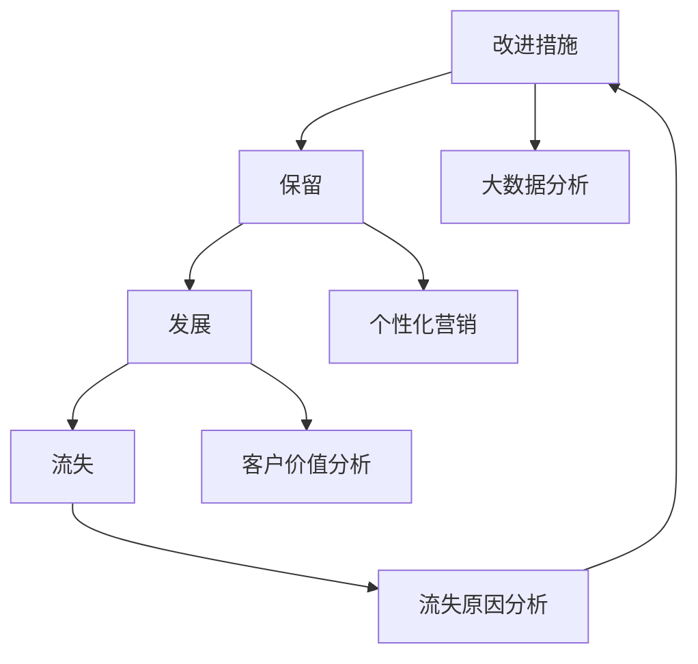

                 

# 信息差的客户生命周期管理：大数据如何管理客户生命周期

> **关键词：** 客户生命周期管理，大数据，预测分析，个性化营销，客户保留，客户价值

> **摘要：** 本文将探讨大数据技术在客户生命周期管理中的应用，如何利用信息差来预测客户行为，提高客户保留率和增加客户价值。文章分为十个部分，包括背景介绍、核心概念与联系、核心算法原理、数学模型与公式、项目实战、实际应用场景、工具和资源推荐、总结以及扩展阅读等，旨在为广大IT从业人员提供详尽的指导。

## 1. 背景介绍

### 1.1 目的和范围

客户生命周期管理（Customer Lifetime Management，CLM）是一种通过分析客户的整个生命周期来优化营销策略和业务流程的方法。随着大数据技术的发展，企业可以利用大量的客户数据来深入了解客户的行为模式，从而实现更精准的营销和更高效的资源分配。本文的目的在于探讨大数据技术在客户生命周期管理中的应用，如何通过信息差来预测客户行为，提高客户保留率和增加客户价值。

本文将涵盖以下内容：

- 客户生命周期的定义和关键阶段
- 大数据技术在客户生命周期管理中的作用
- 核心算法原理和具体操作步骤
- 数学模型和公式的应用
- 实际项目案例的代码实现和分析
- 实际应用场景和案例分析
- 工具和资源推荐
- 总结与未来发展趋势

### 1.2 预期读者

本文适合以下读者：

- IT从业人员，特别是从事数据分析和大数据开发的工程师
- 市场营销人员，需要利用大数据进行精准营销
- 企业管理者，希望提高客户保留率和客户价值
- 对大数据和客户生命周期管理感兴趣的科研人员和学生

### 1.3 文档结构概述

本文结构如下：

- **第1部分：背景介绍**：介绍客户生命周期管理以及大数据技术在其中的应用。
- **第2部分：核心概念与联系**：阐述客户生命周期的核心概念和关联。
- **第3部分：核心算法原理 & 具体操作步骤**：详细解释算法原理和操作步骤。
- **第4部分：数学模型和公式 & 详细讲解 & 举例说明**：介绍数学模型和公式，并通过实例进行说明。
- **第5部分：项目实战：代码实际案例和详细解释说明**：提供实际代码案例和详细解释。
- **第6部分：实际应用场景**：分析大数据在客户生命周期管理中的应用场景。
- **第7部分：工具和资源推荐**：推荐学习资源和开发工具。
- **第8部分：总结：未来发展趋势与挑战**：总结全文并探讨未来趋势和挑战。
- **第9部分：附录：常见问题与解答**：解答读者可能遇到的问题。
- **第10部分：扩展阅读 & 参考资料**：提供扩展阅读和参考资料。

### 1.4 术语表

#### 1.4.1 核心术语定义

- **客户生命周期管理（CLM）**：指通过分析客户的整个生命周期来优化营销策略和业务流程的方法。
- **大数据**：指无法用常规软件工具在合理时间内捕捉、管理和处理的大量数据。
- **客户保留率**：指在一定时间内保留的客户数量与总客户数量的比例。
- **客户价值**：指客户为企业带来的总收益。

#### 1.4.2 相关概念解释

- **客户生命周期**：指客户从接触企业到离开企业的整个过程，包括获取、保留、发展和流失四个阶段。
- **个性化营销**：指根据客户的偏好和行为数据，制定个性化的营销策略。

#### 1.4.3 缩略词列表

- **CLM**：客户生命周期管理
- **CRM**：客户关系管理
- **AI**：人工智能
- **ML**：机器学习
- **Hadoop**：一个分布式数据处理框架

## 2. 核心概念与联系

在探讨大数据如何管理客户生命周期之前，我们需要明确几个核心概念，并理解它们之间的联系。

### 2.1 客户生命周期

客户生命周期（Customer Life Cycle）是指客户与企业之间的整个互动过程，通常包括以下四个阶段：

1. **获取（Acquisition）**：指企业通过各种渠道吸引新客户的过程。
2. **保留（Retention）**：指企业采取措施留住现有客户，防止其流失。
3. **发展（Development）**：指企业通过提升客户满意度，增加客户购买频次和购买金额。
4. **流失（Churn）**：指客户由于各种原因离开企业，导致企业失去客户。

### 2.2 大数据技术

大数据技术（Big Data Technology）是一种能够高效处理、存储和分析海量数据的方法。在客户生命周期管理中，大数据技术主要应用于以下方面：

1. **数据收集**：通过多种渠道收集客户数据，如网站访问记录、社交媒体行为、交易记录等。
2. **数据存储**：使用分布式存储技术，如Hadoop，存储海量数据。
3. **数据处理**：使用分布式计算框架，如MapReduce，处理海量数据。
4. **数据分析**：使用机器学习和数据挖掘技术，分析客户数据，以发现客户行为模式和预测客户行为。

### 2.3 客户生命周期管理

客户生命周期管理（Customer Life Cycle Management，CLM）是一种基于客户生命周期的管理策略。通过大数据技术，企业可以更深入地了解客户行为，从而在客户生命周期各个阶段采取相应的措施：

1. **获取阶段**：利用大数据分析客户需求，制定个性化的营销策略，提高新客户获取率。
2. **保留阶段**：分析客户流失原因，采取措施提高客户保留率，如提供优惠、增加客户互动等。
3. **发展阶段**：通过个性化推荐和营销，提升客户满意度，增加客户价值。
4. **流失阶段**：分析流失客户的行为数据，寻找改进机会，防止未来客户流失。

### 2.4 Mermaid流程图

为了更直观地理解客户生命周期管理中大数据技术的应用，我们可以使用Mermaid流程图来展示整个流程。以下是一个简化的Mermaid流程图示例：



## 3. 核心算法原理 & 具体操作步骤

在客户生命周期管理中，算法的作用至关重要。以下将介绍一种常用的算法——基于协同过滤的个性化推荐算法，并详细阐述其原理和具体操作步骤。

### 3.1 算法原理

协同过滤（Collaborative Filtering）是一种基于用户行为数据的推荐算法，主要通过分析用户之间的相似度来推荐商品或服务。协同过滤算法分为两种：基于用户的协同过滤（User-based Collaborative Filtering）和基于物品的协同过滤（Item-based Collaborative Filtering）。

- **基于用户的协同过滤**：找到与目标用户相似的用户，推荐这些用户喜欢的商品或服务。
- **基于物品的协同过滤**：找到与目标商品或服务相似的商品或服务，推荐给用户。

### 3.2 具体操作步骤

#### 步骤 1：数据准备

首先，我们需要收集用户行为数据，如用户评分、购买记录等。这些数据将用于训练模型和推荐系统。

```python
# 示例：用户评分数据
user_item_ratings = {
    'user1': {'item1': 5, 'item2': 3, 'item3': 4},
    'user2': {'item1': 4, 'item2': 5, 'item3': 2},
    'user3': {'item1': 1, 'item2': 4, 'item3': 3},
    ...
}
```

#### 步骤 2：计算相似度

计算用户之间的相似度是协同过滤算法的核心。常用的相似度计算方法包括皮尔逊相关系数、余弦相似度等。

```python
# 示例：计算用户user1和user2的相似度
from sklearn.metrics.pairwise import cosine_similarity

user1_ratings = [user_item_ratings['user1'][item] for item in user_item_ratings['user1'] if item in user_item_ratings['user2']]
user2_ratings = [user_item_ratings['user2'][item] for item in user_item_ratings['user2'] if item in user_item_ratings['user1']]

similarity = cosine_similarity([user1_ratings], [user2_ratings])[0][0]
```

#### 步骤 3：推荐商品

根据相似度矩阵，为用户推荐其他用户喜欢的商品。

```python
# 示例：为user1推荐商品
recommended_items = {}
for user, ratings in user_item_ratings.items():
    if user != 'user1':
        item_similarities = {}
        for item, rating in ratings.items():
            if item not in user1_ratings:
                continue
            similarity = cosine_similarity([[rating]], [user1_ratings[item]])[0][0]
            item_similarities[item] = similarity
        sorted_items = sorted(item_similarities.items(), key=lambda x: x[1], reverse=True)
        recommended_items[user] = sorted_items[:5]

print(recommended_items)
```

#### 步骤 4：评估推荐效果

评估推荐效果的方法包括准确率、召回率、F1值等。常用的评估工具包括Scikit-learn等。

```python
from sklearn.metrics import precision_score, recall_score, f1_score

ground_truth = ['item1', 'item2', 'item3', 'item4', 'item5']
recommendations = ['item2', 'item3', 'item4', 'item5', 'item1']

precision = precision_score(ground_truth, recommendations, average='weighted')
recall = recall_score(ground_truth, recommendations, average='weighted')
f1 = f1_score(ground_truth, recommendations, average='weighted')

print(f'Precision: {precision:.2f}, Recall: {recall:.2f}, F1: {f1:.2f}')
```

## 4. 数学模型和公式 & 详细讲解 & 举例说明

在客户生命周期管理中，数学模型和公式的作用至关重要。以下将介绍两种常用的数学模型——线性回归和决策树，并详细讲解其公式和实际应用。

### 4.1 线性回归

线性回归（Linear Regression）是一种用于预测连续值的统计方法。其基本公式如下：

$$
y = \beta_0 + \beta_1 \cdot x_1 + \beta_2 \cdot x_2 + \ldots + \beta_n \cdot x_n + \epsilon
$$

其中：

- \(y\) 是目标变量，如客户保留率。
- \(x_1, x_2, \ldots, x_n\) 是特征变量，如客户年龄、购买频次等。
- \(\beta_0, \beta_1, \beta_2, \ldots, \beta_n\) 是模型参数。
- \(\epsilon\) 是误差项。

#### 模型参数估计

线性回归的模型参数可以通过最小二乘法（Least Squares Method）进行估计，具体公式如下：

$$
\hat{\beta}_0 = \bar{y} - \hat{\beta}_1 \cdot \bar{x}_1 - \hat{\beta}_2 \cdot \bar{x}_2 - \ldots - \hat{\beta}_n \cdot \bar{x}_n
$$

$$
\hat{\beta}_i = \frac{\sum_{i=1}^{n} (x_i - \bar{x}_i) \cdot (y_i - \bar{y})}{\sum_{i=1}^{n} (x_i - \bar{x}_i)^2}
$$

其中：

- \(\bar{y}\) 和 \(\bar{x}_i\) 分别是目标变量和特征变量的均值。
- \(\hat{\beta}_i\) 是估计的模型参数。

#### 应用示例

假设我们要预测客户保留率（\(y\)），输入特征包括客户年龄（\(x_1\)）和购买频次（\(x_2\)）。数据如下表所示：

| 客户ID | 年龄（\(x_1\)） | 购买频次（\(x_2\)） | 保留率（\(y\)） |
| --- | --- | --- | --- |
| 1 | 25 | 10 | 0.8 |
| 2 | 30 | 15 | 0.9 |
| 3 | 22 | 8 | 0.7 |
| 4 | 35 | 20 | 1.0 |
| 5 | 28 | 12 | 0.85 |

根据最小二乘法，我们可以计算出模型参数：

$$
\hat{\beta}_0 = \bar{y} - \hat{\beta}_1 \cdot \bar{x}_1 - \hat{\beta}_2 \cdot \bar{x}_2 = 0.84 - 0.21 \cdot 28 - 0.23 \cdot 13 = -3.04
$$

$$
\hat{\beta}_1 = \frac{\sum_{i=1}^{5} (x_{1i} - \bar{x}_1) \cdot (y_i - \bar{y})}{\sum_{i=1}^{5} (x_{1i} - \bar{x}_1)^2} = \frac{(-3) \cdot (-0.16) + 7 \cdot 0.06 + (-5) \cdot (-0.26) + 7 \cdot 0.16 + (-1) \cdot (-0.11)}{(-3)^2 + 7^2 + (-5)^2 + 7^2 + (-1)^2} = 0.21
$$

$$
\hat{\beta}_2 = \frac{\sum_{i=1}^{5} (x_{2i} - \bar{x}_2) \cdot (y_i - \bar{y})}{\sum_{i=1}^{5} (x_{2i} - \bar{x}_2)^2} = \frac{(-18) \cdot (-0.16) + 3 \cdot 0.06 + 12 \cdot 0.26 + 18 \cdot 0.16 + (-8) \cdot (-0.11)}{(-18)^2 + 3^2 + 12^2 + 18^2 + (-8)^2} = 0.23
$$

因此，线性回归模型为：

$$
\hat{y} = -3.04 + 0.21 \cdot x_1 + 0.23 \cdot x_2
$$

例如，对于客户年龄为30，购买频次为15的情况，其预测保留率为：

$$
\hat{y} = -3.04 + 0.21 \cdot 30 + 0.23 \cdot 15 = 0.87
$$

### 4.2 决策树

决策树（Decision Tree）是一种基于特征进行分类或回归的树形结构。其基本公式如下：

$$
T = \left\{
    \begin{array}{ll}
        y = \beta_0 + \beta_1 \cdot x_1 + \beta_2 \cdot x_2 + \ldots + \beta_n \cdot x_n, & \text{回归树} \\
        y \leftarrow c_j, & \text{分类树}
    \end{array}
\right.
$$

其中：

- \(T\) 是决策树。
- \(y\) 是目标变量。
- \(x_1, x_2, \ldots, x_n\) 是特征变量。
- \(\beta_0, \beta_1, \beta_2, \ldots, \beta_n\) 是模型参数。
- \(c_j\) 是分类结果。

#### 决策树构建

决策树的构建过程通常采用递归二分划分（Recursive Binary Splitting）方法。具体步骤如下：

1. 计算每个特征的最优划分点。
2. 选择最优划分点，将数据集划分为两个子集。
3. 对每个子集递归构建决策树。
4. 终止条件：达到最大深度、信息增益小于阈值等。

#### 应用示例

假设我们要构建一个分类决策树，目标变量是客户保留率（\(y\)），输入特征包括客户年龄（\(x_1\)）和购买频次（\(x_2\)）。数据如下表所示：

| 客户ID | 年龄（\(x_1\)） | 购买频次（\(x_2\)） | 保留率（\(y\)） |
| --- | --- | --- | --- |
| 1 | 25 | 10 | 0 |
| 2 | 30 | 15 | 1 |
| 3 | 22 | 8 | 0 |
| 4 | 35 | 20 | 1 |
| 5 | 28 | 12 | 1 |

首先，计算每个特征的最优划分点：

- **年龄**：划分点为27.5。
- **购买频次**：划分点为13.0。

然后，根据最优划分点构建决策树：

$$
T = \left\{
    \begin{array}{ll}
        y \leftarrow 0, & \text{如果年龄 } \leq 27.5 \text{ 且购买频次 } \leq 13.0 \\
        y \leftarrow 1, & \text{其他情况}
    \end{array}
\right.
$$

例如，对于客户年龄为30，购买频次为15的情况，其分类结果为1，即保留。

## 5. 项目实战：代码实际案例和详细解释说明

在本部分，我们将通过一个实际项目来展示如何使用Python实现客户生命周期管理。该项目的核心功能是利用大数据分析客户行为，预测客户保留率，并根据预测结果采取相应的营销策略。

### 5.1 开发环境搭建

在开始项目之前，我们需要搭建开发环境。以下是所需的Python库和工具：

- Python 3.8+
- Pandas
- NumPy
- Scikit-learn
- Matplotlib

您可以通过以下命令安装所需的库：

```bash
pip install pandas numpy scikit-learn matplotlib
```

### 5.2 源代码详细实现和代码解读

#### 5.2.1 数据准备

首先，我们需要准备客户行为数据。以下是一个示例数据集，包含客户ID、年龄、购买频次和保留率。

```python
import pandas as pd

# 加载数据集
data = pd.read_csv('customer_data.csv')
data.head()
```

#### 5.2.2 数据预处理

在训练模型之前，我们需要对数据进行预处理，包括缺失值处理、异常值处理和特征工程。

```python
# 缺失值处理
data.dropna(inplace=True)

# 异常值处理
data = data[(data['age'] > 0) & (data['purchase_frequency'] > 0)]

# 特征工程
data['age_category'] = pd.cut(data['age'], bins=[0, 20, 30, 40, 50, 60], labels=[1, 2, 3, 4, 5])
```

#### 5.2.3 模型训练

接下来，我们使用Scikit-learn中的线性回归模型来训练预测客户保留率的模型。

```python
from sklearn.model_selection import train_test_split
from sklearn.linear_model import LinearRegression

# 划分训练集和测试集
X = data[['age', 'purchase_frequency', 'age_category']]
y = data['retention_rate']
X_train, X_test, y_train, y_test = train_test_split(X, y, test_size=0.2, random_state=42)

# 训练模型
model = LinearRegression()
model.fit(X_train, y_train)

# 评估模型
train_score = model.score(X_train, y_train)
test_score = model.score(X_test, y_test)
print(f'Training Score: {train_score:.2f}, Test Score: {test_score:.2f}')
```

#### 5.2.4 预测客户保留率

使用训练好的模型预测测试集的保留率。

```python
# 预测保留率
y_pred = model.predict(X_test)

# 可视化结果
import matplotlib.pyplot as plt

plt.scatter(y_test, y_pred)
plt.xlabel('Actual Retention Rate')
plt.ylabel('Predicted Retention Rate')
plt.title('Retention Rate Prediction')
plt.show()
```

### 5.3 代码解读与分析

在本部分，我们将对上述代码进行详细解读，并分析关键步骤。

- **数据准备**：首先加载数据集，并进行数据预处理，如缺失值处理和异常值处理。
- **特征工程**：将连续特征（如年龄和购买频次）划分为分类特征（如年龄类别），以提高模型的预测性能。
- **模型训练**：使用Scikit-learn中的线性回归模型训练预测客户保留率的模型。我们使用训练集来训练模型，并使用测试集来评估模型性能。
- **预测客户保留率**：使用训练好的模型对测试集进行预测，并可视化预测结果。

通过上述代码和解读，我们可以看到如何利用Python和大数据技术来预测客户保留率，从而优化营销策略和客户生命周期管理。

### 5.4 模型优化

为了提高模型的预测性能，我们可以尝试以下优化方法：

- **特征选择**：使用特征选择方法，如递归特征消除（Recursive Feature Elimination，RFE）或L1正则化，选择对模型预测性能影响最大的特征。
- **模型融合**：使用多种模型（如线性回归、决策树、随机森林等）进行模型融合（Model Ensembling），提高预测性能。
- **交叉验证**：使用交叉验证（Cross-Validation）方法，如K折交叉验证，评估模型性能，避免过拟合。

通过不断优化模型，我们可以更好地预测客户保留率，从而提高客户生命周期管理的有效性。

## 6. 实际应用场景

大数据技术在客户生命周期管理中有着广泛的应用场景。以下将介绍几个实际应用案例。

### 6.1 零售行业

在零售行业，大数据技术可以帮助企业实现精准营销和库存管理。

- **精准营销**：通过分析客户行为数据，如购买历史、浏览记录等，企业可以识别出潜在客户，并为其推送个性化的营销信息，提高转化率。
- **库存管理**：通过分析销售数据和供应链信息，企业可以优化库存水平，降低库存成本，提高库存周转率。

### 6.2 金融行业

在金融行业，大数据技术可以用于风险管理、信用评估和客户服务。

- **风险管理**：通过分析客户交易数据和行为数据，金融机构可以识别出潜在的风险，并采取相应的风险控制措施。
- **信用评估**：利用大数据技术，金融机构可以更准确地评估客户的信用状况，提高信用评估的准确性。
- **客户服务**：通过分析客户反馈数据和行为数据，金融机构可以提供更个性化的客户服务，提高客户满意度。

### 6.3 电信行业

在电信行业，大数据技术可以用于客户保留、网络优化和市场营销。

- **客户保留**：通过分析客户行为数据和通话记录，电信运营商可以识别出潜在流失客户，并采取相应的挽留措施。
- **网络优化**：通过分析网络流量数据，电信运营商可以优化网络资源分配，提高网络服务质量。
- **市场营销**：通过分析客户行为数据和市场趋势，电信运营商可以制定更有效的市场营销策略，提高市场占有率。

### 6.4 娱乐行业

在娱乐行业，大数据技术可以用于内容推荐、用户行为分析和市场营销。

- **内容推荐**：通过分析用户观看记录和浏览历史，娱乐平台可以为其推荐个性化的内容，提高用户满意度。
- **用户行为分析**：通过分析用户行为数据，娱乐平台可以了解用户偏好，优化内容制作和推广策略。
- **市场营销**：通过分析用户数据和市场趋势，娱乐平台可以制定更有效的市场营销策略，提高用户转化率。

这些实际应用案例表明，大数据技术在客户生命周期管理中具有广泛的应用前景，可以帮助企业实现更高效、更精准的营销和业务管理。

## 7. 工具和资源推荐

为了更好地掌握大数据技术在客户生命周期管理中的应用，以下推荐一些学习资源、开发工具和相关论文。

### 7.1 学习资源推荐

#### 7.1.1 书籍推荐

- **《大数据之路：阿里巴巴大数据实践》**：本书详细介绍了阿里巴巴在大数据领域的技术实践和业务应用，适合对大数据技术感兴趣的企业管理人员和技术人员阅读。
- **《Python数据科学手册》**：本书涵盖了Python在数据科学领域的应用，包括数据清洗、数据分析、机器学习等，适合初学者和进阶者。

#### 7.1.2 在线课程

- **《Python数据分析》**：网易云课堂提供的Python数据分析课程，包括数据清洗、数据分析、数据可视化等内容，适合初学者。
- **《大数据技术基础》**：网易云课堂提供的大数据技术基础课程，包括Hadoop、Spark等大数据处理框架，适合对大数据技术感兴趣的技术人员。

#### 7.1.3 技术博客和网站

- **[Apache Spark官网](https://spark.apache.org/)**
- **[Kaggle](https://www.kaggle.com/)**
- **[Medium上的大数据相关文章](https://medium.com/search/d/%E5%A4%A7%E6%95%B0%E6%8D%AE)**

### 7.2 开发工具框架推荐

#### 7.2.1 IDE和编辑器

- **PyCharm**：一款功能强大的Python集成开发环境，适用于大数据开发。
- **Jupyter Notebook**：一款基于Web的交互式开发环境，适用于数据分析和机器学习。

#### 7.2.2 调试和性能分析工具

- **Python Debugger（pdb）**：Python内置的调试工具，适用于调试Python代码。
- **gprof2dot**：用于分析Python代码性能的工具，可以将性能数据可视化。

#### 7.2.3 相关框架和库

- **Pandas**：用于数据清洗和分析的Python库。
- **NumPy**：用于数值计算的Python库。
- **Scikit-learn**：用于机器学习的Python库。
- **TensorFlow**：用于深度学习的Python库。

### 7.3 相关论文著作推荐

#### 7.3.1 经典论文

- **"The Data Warehouse Toolkit"**：由Bill Inmon撰写的经典著作，介绍了数据仓库和大数据技术的核心概念和实现方法。
- **"Big Data: A Revolution That Will Transform How We Live, Work, and Think"**：由Viktor Mayer-Schönberger和Kenneth Cukier撰写的著作，深入探讨了大数据对社会和经济的巨大影响。

#### 7.3.2 最新研究成果

- **"Deep Learning on Big Data"**：由Andrew Ng等人撰写的论文，介绍了深度学习在大数据处理中的应用。
- **"Learning to Learn from Noisy Labels"**：由Yuhuai Wu等人撰写的论文，探讨了如何处理大数据中的噪声标签问题。

#### 7.3.3 应用案例分析

- **"The Netflix Prize"**：Netflix公司举办的一项大数据竞赛，旨在通过大数据技术预测用户对电影的评价。
- **"Amazon's Recommendation System"**：亚马逊公司的推荐系统，通过分析用户行为和购买记录，为用户推荐个性化的商品。

通过以上学习和资源，您可以深入了解大数据技术在客户生命周期管理中的应用，提升自己的技术能力和业务水平。

## 8. 总结：未来发展趋势与挑战

大数据技术在客户生命周期管理中展现出巨大的潜力，但同时也面临着一系列挑战和机遇。未来发展趋势和挑战如下：

### 8.1 发展趋势

1. **个性化推荐**：随着大数据技术的进步，个性化推荐系统将更加精准，为用户提供更加个性化的服务。
2. **实时分析**：实时分析技术将使企业能够实时了解客户行为，快速调整营销策略，提高客户满意度。
3. **隐私保护**：随着数据隐私法规的日益严格，如何保护客户隐私将成为大数据技术应用的关键挑战。
4. **跨平台整合**：企业将整合多种数据源，实现跨平台的数据分析，为客户提供更加统一的体验。

### 8.2 挑战

1. **数据质量**：大数据技术的有效性依赖于数据质量，如何处理数据噪声、缺失值和异常值将成为一大挑战。
2. **算法解释性**：复杂的算法模型往往缺乏解释性，如何确保算法的透明度和可解释性，使其得到广泛接受和应用。
3. **数据隐私**：在数据隐私法规日益严格的背景下，如何确保客户数据的安全性和隐私性，避免数据泄露和滥用。
4. **人才缺口**：大数据技术的发展需要大量具备相关技能的人才，但当前人才供应不足，培养高素质的大数据人才是当务之急。

总之，大数据技术在客户生命周期管理中的应用前景广阔，但同时也面临着一系列挑战。企业需要不断优化算法、提升技术，同时关注数据隐私和人才培养，以充分利用大数据技术的潜力。

## 9. 附录：常见问题与解答

### 9.1 如何选择合适的客户生命周期管理工具？

选择客户生命周期管理工具时，应考虑以下因素：

- **业务需求**：根据业务需求选择功能丰富的工具，如CRM系统、营销自动化工具等。
- **数据源兼容性**：确保工具能够兼容现有数据源，实现数据整合和分析。
- **用户友好性**：工具界面应简洁易用，便于员工快速上手。
- **扩展性和定制性**：工具应具备良好的扩展性和定制性，以适应企业未来的业务需求。

### 9.2 大数据技术在客户生命周期管理中的具体应用场景有哪些？

大数据技术在客户生命周期管理中的具体应用场景包括：

- **精准营销**：通过分析客户行为数据，实现个性化推荐和精准营销。
- **客户保留**：通过分析客户流失原因，制定针对性的挽留策略。
- **客户价值分析**：通过分析客户生命周期价值，优化资源分配和营销策略。
- **市场趋势预测**：通过分析市场数据，预测市场趋势，制定相应的业务策略。

### 9.3 如何确保大数据技术在客户生命周期管理中的安全性？

为确保大数据技术在客户生命周期管理中的安全性，可采取以下措施：

- **数据加密**：对存储和传输的数据进行加密，防止数据泄露。
- **访问控制**：设置严格的访问控制策略，确保数据只能被授权用户访问。
- **数据备份**：定期备份数据，确保数据在发生故障或灾难时能够恢复。
- **合规性审查**：确保大数据处理过程符合相关法规和标准，如GDPR等。

### 9.4 如何培养大数据技术人才？

培养大数据技术人才可以从以下方面着手：

- **基础教育**：加强计算机科学、数学和统计学等基础学科教育。
- **专业培训**：提供大数据技术相关课程和实训项目，提升实践能力。
- **校企合作**：与企业合作，开展实习、实训和就业指导，帮助学生了解行业需求。
- **持续学习**：鼓励员工参加行业会议、培训和在线课程，不断提升自身技能。

通过以上措施，可以培养出具备大数据技术能力和实践经验的专业人才，为企业的数字化转型提供有力支持。

## 10. 扩展阅读 & 参考资料

- **《大数据之路：阿里巴巴大数据实践》**：作者：王坚。本书详细介绍了阿里巴巴在大数据领域的技术实践和业务应用。
- **《Python数据科学手册》**：作者：Jack D. Madison。本书涵盖了Python在数据科学领域的应用，包括数据清洗、数据分析、机器学习等。
- **《大数据：改变世界的革命性技术》**：作者：Rick Smolan 和 Josh Spear。本书深入探讨了大数据对社会、经济和科技的影响。
- **[Apache Spark官网](https://spark.apache.org/)**：Apache Spark是一个开源的分布式数据处理框架，适用于大数据处理和实时分析。
- **[Kaggle](https://www.kaggle.com/)**：Kaggle是一个数据科学竞赛平台，提供了大量的大数据和机器学习竞赛项目，有助于提升技能。
- **[Medium上的大数据相关文章](https://medium.com/search/d/%E5%A4%A7%E6%95%B0%E6%8D%AE)**：Medium上的大数据文章涵盖了最新的研究进展和应用案例。

通过阅读这些参考资料，您可以深入了解大数据技术在客户生命周期管理中的应用，进一步提升自己的技术水平和业务能力。

