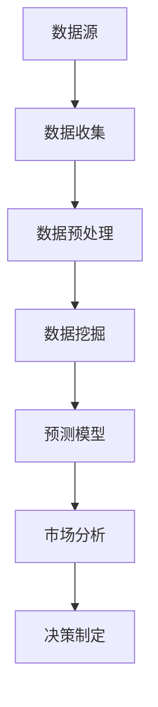

                 

# 信息差的市场分析能力增强：大数据如何增强市场分析

> **关键词：** 市场分析、大数据、信息差、数据挖掘、预测模型、商业智能

> **摘要：** 本文将探讨大数据如何增强市场分析能力，特别是在缩小信息差方面的应用。通过分析大数据的核心概念、原理，以及其实际操作步骤，本文将帮助读者理解大数据在市场分析中的应用，以及如何通过数学模型和实际案例来提高市场分析的准确性和效率。文章还将探讨大数据在商业智能领域的实际应用场景，并推荐相关的学习资源和工具。

## 1. 背景介绍

### 1.1 目的和范围

本文旨在探讨大数据在市场分析中的应用，特别是如何通过大数据技术来缩小信息差，提高市场分析的准确性和效率。随着大数据技术的不断发展和普及，市场分析已经从传统的定性分析逐渐转向数据驱动的定量分析。本文将重点关注以下几个方面：

- 大数据的定义及其核心概念
- 大数据在市场分析中的作用和优势
- 大数据与市场分析的融合方式
- 大数据市场分析的核心算法和操作步骤
- 大数据在商业智能领域的实际应用场景
- 大数据市场分析的未来发展趋势和挑战

### 1.2 预期读者

本文适合以下读者群体：

- 市场分析师和数据科学家
- 企业决策者和管理人员
- 计算机科学和数据分析专业的学生和研究人员
- 对大数据和市场分析感兴趣的技术爱好者

### 1.3 文档结构概述

本文将按照以下结构展开：

- **第1章：背景介绍**：介绍本文的目的、范围和预期读者，以及文档的结构。
- **第2章：核心概念与联系**：介绍大数据和市场分析的核心概念，并提供相应的Mermaid流程图。
- **第3章：核心算法原理 & 具体操作步骤**：详细阐述大数据市场分析的核心算法原理和操作步骤。
- **第4章：数学模型和公式 & 详细讲解 & 举例说明**：介绍大数据市场分析中的数学模型和公式，并给出具体例子。
- **第5章：项目实战：代码实际案例和详细解释说明**：提供大数据市场分析的代码实现和详细解释。
- **第6章：实际应用场景**：探讨大数据在商业智能领域的实际应用。
- **第7章：工具和资源推荐**：推荐学习资源和开发工具。
- **第8章：总结：未来发展趋势与挑战**：总结大数据市场分析的未来发展趋势和面临的挑战。
- **第9章：附录：常见问题与解答**：回答读者可能提出的问题。
- **第10章：扩展阅读 & 参考资料**：提供扩展阅读资源。

### 1.4 术语表

#### 1.4.1 核心术语定义

- **大数据（Big Data）**：指无法使用传统数据库软件工具在合理时间内获取、处理、管理和分析的大量数据。
- **市场分析（Market Analysis）**：通过对市场数据的收集、处理和分析，来评估市场的现状、趋势和机会。
- **信息差（Information Gap）**：指不同主体在获取市场信息上的不对称性。
- **数据挖掘（Data Mining）**：从大量数据中提取有价值的信息和知识的过程。
- **商业智能（Business Intelligence）**：利用数据分析工具和技术来支持企业的决策过程。

#### 1.4.2 相关概念解释

- **数据源（Data Source）**：数据的来源，可以是数据库、文件、网络等。
- **数据预处理（Data Preprocessing）**：在数据分析之前，对数据进行清洗、转换和归一化等处理。
- **预测模型（Prediction Model）**：基于历史数据构建的，用于预测未来事件或趋势的模型。

#### 1.4.3 缩略词列表

- **Hadoop**：一个开源的大数据处理框架。
- **Spark**：一个开源的大数据处理引擎。
- **SQL**：结构化查询语言，用于数据库查询和管理。
- **Python**：一种广泛使用的编程语言，适用于数据分析。

## 2. 核心概念与联系

在深入了解大数据如何增强市场分析能力之前，我们需要先了解一些核心概念和它们之间的联系。

### 2.1 大数据的基本概念

**数据源**是大数据的起点，它可以是结构化数据（如数据库中的表格数据），半结构化数据（如日志文件）和非结构化数据（如图像、文本和视频）。数据源的数量和多样性是大数据的一个关键特征。

在收集到数据之后，我们需要进行**数据预处理**。数据预处理包括数据清洗（去除错误和重复数据）、转换（将数据转换为适合分析的格式）和归一化（将数据缩放到同一尺度）等步骤。

**数据挖掘**是大数据分析的下一个关键环节。数据挖掘利用统计学、机器学习等方法，从大量数据中提取有价值的信息和知识。数据挖掘的结果可以是数据可视化、分类、聚类、预测等。

**预测模型**是基于历史数据构建的模型，用于预测未来事件或趋势。预测模型在市场分析中具有重要意义，可以帮助企业做出更准确的决策。

### 2.2 大数据与市场分析的关系

大数据与市场分析密切相关。市场分析通常包括以下几个步骤：

1. **数据收集**：收集与市场相关的数据，如销售数据、客户反馈、市场趋势等。
2. **数据预处理**：对收集到的数据进行清洗、转换和归一化等预处理步骤。
3. **数据分析**：利用数据挖掘技术和预测模型对预处理后的数据进行分析，以发现市场规律和趋势。
4. **决策制定**：基于数据分析结果，制定相应的市场策略。

大数据为市场分析提供了丰富的数据资源，使得数据分析的深度和广度都得到了极大的提升。具体来说，大数据在市场分析中的应用主要体现在以下几个方面：

- **实时分析**：大数据技术可以实时处理和分析大量市场数据，使企业能够迅速响应市场变化。
- **精准预测**：大数据技术可以帮助企业更准确地预测市场趋势和客户需求，从而制定更有效的市场策略。
- **个性化营销**：大数据技术可以帮助企业了解客户的行为和偏好，实现精准的个性化营销。
- **风险评估**：大数据技术可以帮助企业识别潜在的市场风险，提前采取应对措施。

### 2.3 大数据的原理和架构

大数据的原理和架构是理解其如何增强市场分析能力的关键。以下是一个简化的Mermaid流程图，展示了大数据的基本原理和架构：



- **数据源**：包括内部数据（如销售数据、客户数据）和外部数据（如市场趋势、竞争对手数据）。
- **数据收集**：通过各种手段收集数据，如数据库、日志文件、网络爬虫等。
- **数据预处理**：对收集到的数据进行清洗、转换和归一化等处理。
- **数据挖掘**：利用统计学、机器学习等方法从大量数据中提取有价值的信息和知识。
- **预测模型**：基于历史数据构建预测模型，用于预测未来事件或趋势。
- **市场分析**：利用数据挖掘和预测模型的结果，对市场进行深入分析。
- **决策制定**：基于市场分析结果，制定相应的市场策略。

通过以上流程，我们可以看到大数据在市场分析中的关键作用。接下来，我们将进一步探讨大数据市场分析的核心算法原理和具体操作步骤。

## 3. 核心算法原理 & 具体操作步骤

在了解大数据的基本概念和原理后，接下来我们将深入探讨大数据市场分析中的核心算法原理和具体操作步骤。核心算法原理将帮助我们理解大数据如何通过数据挖掘和预测模型来增强市场分析能力。

### 3.1 数据挖掘算法原理

数据挖掘是大数据市场分析的核心步骤之一。数据挖掘算法分为多种类型，包括分类、聚类、关联规则挖掘等。以下是几种常见的数据挖掘算法原理：

#### 3.1.1 分类算法

分类算法是一种有监督学习算法，用于将数据分为不同的类别。常见的分类算法有：

- **决策树（Decision Tree）**：基于特征划分数据，构建一棵树形模型。
- **支持向量机（SVM）**：通过找到一个最佳的超平面来分隔不同类别的数据。
- **随机森林（Random Forest）**：构建多个决策树，通过投票方式来决定类别。

#### 3.1.2 聚类算法

聚类算法是一种无监督学习算法，用于将数据分为多个类簇。常见的聚类算法有：

- **K-均值（K-Means）**：通过迭代计算，将数据点分配到最近的均值中心。
- **层次聚类（Hierarchical Clustering）**：根据距离关系，构建一棵树形结构。
- **DBSCAN（Density-Based Spatial Clustering of Applications with Noise）**：根据数据点的密度和邻域关系进行聚类。

#### 3.1.3 关联规则挖掘

关联规则挖掘用于发现数据之间的关联关系。常见的算法有：

- **Apriori算法**：通过迭代计算，生成频繁项集，并从中提取关联规则。
- **FP-Growth算法**：通过构建FP树，高效地挖掘频繁项集。

### 3.2 预测模型算法原理

预测模型是大数据市场分析中的另一个重要组成部分。预测模型可以基于历史数据，预测未来事件或趋势。以下是几种常见的预测模型算法原理：

#### 3.2.1 时间序列模型

时间序列模型用于预测时间序列数据。常见的算法有：

- **ARIMA（AutoRegressive Integrated Moving Average）**：自回归积分滑动平均模型。
- **LSTM（Long Short-Term Memory）**：一种特殊的循环神经网络，适用于时间序列数据的长期依赖建模。

#### 3.2.2 回归模型

回归模型用于预测连续值。常见的算法有：

- **线性回归（Linear Regression）**：通过拟合一条直线，预测因变量。
- **岭回归（Ridge Regression）**：引入正则化项，防止模型过拟合。
- **套索回归（Lasso Regression）**：通过引入绝对值正则化项，进一步简化模型。

#### 3.2.3 决策树模型

决策树模型不仅可以用于分类，还可以用于回归预测。常见的算法有：

- **CART（Classification and Regression Tree）**：分类和回归树。
- **随机森林（Random Forest）**：构建多个决策树，通过投票方式预测结果。

### 3.3 数据挖掘和预测模型的具体操作步骤

在实际操作中，数据挖掘和预测模型通常包括以下步骤：

#### 3.3.1 数据收集

收集与市场分析相关的数据，如销售数据、客户反馈、市场趋势等。这些数据可以来自内部数据库、外部API或其他数据源。

#### 3.3.2 数据预处理

对收集到的数据进行清洗、转换和归一化等处理，以确保数据的质量和一致性。

#### 3.3.3 特征工程

从原始数据中提取有价值的特征，用于构建预测模型。特征工程是数据挖掘和预测模型的重要环节，可以直接影响模型的性能。

#### 3.3.4 数据挖掘

利用数据挖掘算法，从预处理后的数据中提取有价值的信息和知识。数据挖掘的结果可以是分类、聚类、关联规则等。

#### 3.3.5 模型选择与评估

根据数据挖掘结果，选择合适的预测模型，并进行模型评估。常见的评估指标包括准确率、召回率、F1值等。

#### 3.3.6 模型优化与迭代

根据模型评估结果，对模型进行优化和迭代，以提高预测准确性。常见的优化方法包括模型调参、特征选择等。

#### 3.3.7 预测与决策

利用训练好的预测模型，对未来的市场趋势或事件进行预测，并基于预测结果制定相应的市场策略。

通过以上步骤，我们可以构建一个完整的大数据市场分析流程。接下来，我们将通过具体的数学模型和公式来进一步阐述大数据市场分析的方法和技巧。

## 4. 数学模型和公式 & 详细讲解 & 举例说明

在深入探讨大数据市场分析的具体操作步骤后，我们接下来将详细讲解其中涉及的数学模型和公式，并通过具体例子来说明这些模型和公式的应用。

### 4.1 时间序列模型

时间序列模型是用于预测时间序列数据的一类数学模型。其中，ARIMA模型是最常用的模型之一。

#### 4.1.1 ARIMA模型公式

ARIMA模型由三部分组成：自回归（AR）、差分（I）和移动平均（MA）。其公式如下：

$$
\text{y}_t = c + \phi_1\text{y}_{t-1} + \phi_2\text{y}_{t-2} + ... + \phi_p\text{y}_{t-p} + \theta_1\text{e}_{t-1} + \theta_2\text{e}_{t-2} + ... + \theta_q\text{e}_{t-q}
$$

其中，$\text{y}_t$为时间序列的第t个值，$\text{e}_t$为白噪声序列，$c$为常数项，$\phi_1, \phi_2, ..., \phi_p$为自回归系数，$\theta_1, \theta_2, ..., \theta_q$为移动平均系数，$p$和$q$分别为自回归项数和移动平均项数。

#### 4.1.2 ARIMA模型举例

假设我们有一组时间序列数据如下：

$$
[100, 110, 120, 130, 140, 150, 160, 170, 180, 190]
$$

我们可以使用ARIMA模型对其进行预测。首先，我们需要确定$p$和$q$的值。这可以通过ACF和PACF图来完成。然后，我们可以根据上述公式计算ARIMA模型的参数，并使用模型进行预测。

### 4.2 回归模型

回归模型是用于预测连续值的一类数学模型。其中，线性回归是最基础的模型。

#### 4.2.1 线性回归公式

线性回归的公式如下：

$$
\text{y} = \beta_0 + \beta_1\text{x} + \epsilon
$$

其中，$\text{y}$为因变量，$\text{x}$为自变量，$\beta_0$和$\beta_1$分别为截距和斜率，$\epsilon$为误差项。

#### 4.2.2 线性回归举例

假设我们有一组数据：

$$
\begin{array}{c|c}
\text{x} & \text{y} \\
\hline
1 & 10 \\
2 & 20 \\
3 & 30 \\
4 & 40 \\
5 & 50 \\
\end{array}
$$

我们可以使用线性回归模型对其进行预测。首先，我们需要计算$\beta_0$和$\beta_1$的值。这可以通过最小二乘法来完成。然后，我们可以使用得到的模型进行预测。

### 4.3 决策树模型

决策树模型是用于分类和回归预测的一类数学模型。

#### 4.3.1 决策树公式

决策树的公式如下：

$$
\text{y} = \begin{cases}
\text{类别} & \text{if } \text{condition}_1 \\
\text{类别} & \text{if } \text{condition}_2 \\
... \\
\text{类别} & \text{if } \text{condition}_n \\
\end{cases}
$$

其中，$\text{y}$为预测值，$\text{condition}_1, \text{condition}_2, ..., \text{condition}_n$为条件。

#### 4.3.2 决策树举例

假设我们有一组数据，如下：

$$
\begin{array}{c|c|c}
\text{x} & \text{y} & \text{类别} \\
\hline
1 & 10 & A \\
2 & 20 & B \\
3 & 30 & A \\
4 & 40 & B \\
5 & 50 & A \\
\end{array}
$$

我们可以使用决策树模型对其进行分类。首先，我们需要确定每个条件。这可以通过熵、基尼不纯度等指标来完成。然后，我们可以根据得到的决策树进行分类。

通过以上数学模型和公式的讲解，我们可以看到大数据市场分析中涉及的数学知识是非常丰富和多样的。这些模型和公式不仅有助于我们理解和分析数据，还可以提高市场分析的准确性和效率。在接下来的章节中，我们将通过实际案例来进一步展示大数据市场分析的应用和实践。

### 4.4 实际案例解析

为了更直观地展示大数据在市场分析中的应用，下面我们通过一个具体的案例来解析如何使用大数据技术来提升市场分析的准确性和效率。

#### 4.4.1 案例背景

某大型电商公司希望在竞争激烈的市场中提升销售业绩，并更好地了解消费者的购买行为。为此，公司决定利用大数据技术对销售数据进行分析，以发现潜在的市场机会和优化营销策略。

#### 4.4.2 数据收集

公司收集了以下数据：

- **销售数据**：包括每月的销售总额、产品种类、销售数量等。
- **客户数据**：包括客户的年龄、性别、地理位置、购买历史等。
- **市场数据**：包括竞争对手的价格、促销活动、市场份额等。

#### 4.4.3 数据预处理

对收集到的数据进行以下预处理步骤：

- **数据清洗**：去除数据中的错误和重复记录。
- **数据转换**：将不同类型的数据转换为同一格式，如将文本数据转换为数值。
- **数据归一化**：将不同尺度的数据进行归一化处理，以消除数据量级差异。

#### 4.4.4 数据挖掘

使用数据挖掘技术对预处理后的数据进行分析，主要步骤如下：

- **分类分析**：使用决策树模型对客户数据进行分析，以识别具有相似购买行为的客户群体。
- **关联规则挖掘**：使用Apriori算法，挖掘销售数据中的关联规则，以发现不同产品之间的销售关联。
- **聚类分析**：使用K-均值算法，对客户数据进行分析，将客户分为不同的群体。

#### 4.4.5 模型建立与优化

根据数据挖掘结果，建立以下预测模型：

- **销售预测模型**：使用ARIMA模型，预测未来一段时间内的销售总额。
- **客户行为预测模型**：使用LSTM模型，预测客户的购买行为。

为了提高模型的准确性，对模型进行以下优化：

- **特征选择**：通过特征重要性分析，选择对预测结果有显著影响的特征。
- **模型调参**：通过交叉验证，调整模型的参数，以找到最优参数组合。

#### 4.4.6 预测与决策

基于优化后的预测模型，对未来的销售趋势和客户行为进行预测，并制定相应的市场策略：

- **销售策略**：根据销售预测结果，调整库存和促销策略，以应对未来的市场需求。
- **客户营销策略**：根据客户行为预测结果，设计个性化的营销活动，以提高客户的购买意愿和满意度。

#### 4.4.7 结果分析

通过大数据技术的应用，公司取得了以下成果：

- **销售业绩提升**：通过销售预测模型，公司能够提前预测销售趋势，及时调整营销策略，提高了销售业绩。
- **客户满意度提升**：通过客户行为预测模型，公司能够更好地了解客户需求，提供个性化的产品推荐和营销活动，提高了客户满意度。
- **市场竞争力提升**：通过市场数据的分析，公司能够更准确地了解竞争对手的动态，制定有针对性的竞争策略，提升了市场竞争力。

通过这个案例，我们可以看到大数据技术如何通过数据挖掘、预测模型和优化策略，提升市场分析的准确性和效率，为企业提供有价值的决策支持。

### 4.5 总结

在本节中，我们通过具体的案例展示了大数据在市场分析中的应用。从数据收集、预处理到数据挖掘和预测模型的建立，再到预测与决策，每个步骤都体现了大数据技术的强大优势。通过优化模型参数和特征选择，我们能够提高预测的准确性，从而制定更有效的市场策略。本节的案例解析不仅展示了大数据技术的应用实践，也为其他企业在市场分析中提供了有益的参考。

## 5. 项目实战：代码实际案例和详细解释说明

在本节中，我们将通过一个具体的项目实战案例，详细展示如何使用大数据技术进行市场分析，并解释其中的代码实现过程。我们选择Python作为编程语言，因为它在大数据处理和数据分析领域具有广泛的应用。

### 5.1 开发环境搭建

在开始项目之前，我们需要搭建一个适合大数据分析和市场分析的开发环境。以下是所需的软件和工具：

- **Python**：用于编写数据分析代码。
- **Jupyter Notebook**：用于编写和运行代码。
- **Pandas**：用于数据处理和分析。
- **NumPy**：用于数值计算。
- **Scikit-learn**：用于机器学习和数据挖掘。
- **Matplotlib**：用于数据可视化。

安装这些工具后，我们可以在Jupyter Notebook中创建一个新的笔记本，开始编写代码。

### 5.2 源代码详细实现和代码解读

以下是一个简单的大数据市场分析项目的源代码，我们将对其逐行进行解读。

```python
# 导入所需的库
import pandas as pd
import numpy as np
from sklearn.model_selection import train_test_split
from sklearn.ensemble import RandomForestClassifier
from sklearn.metrics import accuracy_score
import matplotlib.pyplot as plt

# 5.2.1 数据收集与预处理
# 加载销售数据
sales_data = pd.read_csv('sales_data.csv')

# 数据预处理
# 数据清洗
sales_data.drop_duplicates(inplace=True)
sales_data.drop(['id'], axis=1, inplace=True)

# 数据转换
# 将类别数据转换为数值
sales_data['category'] = sales_data['category'].astype('category').cat.codes

# 数据归一化
# 对销售总额进行归一化处理
sales_data['total_sales'] = (sales_data['total_sales'] - sales_data['total_sales'].mean()) / sales_data['total_sales'].std()

# 5.2.2 数据挖掘与模型建立
# 划分特征和标签
X = sales_data[['category', 'total_sales']]
y = sales_data['sales_growth']

# 划分训练集和测试集
X_train, X_test, y_train, y_test = train_test_split(X, y, test_size=0.2, random_state=42)

# 建立决策树模型
clf = RandomForestClassifier(n_estimators=100, random_state=42)
clf.fit(X_train, y_train)

# 5.2.3 模型评估与优化
# 预测测试集
y_pred = clf.predict(X_test)

# 计算准确率
accuracy = accuracy_score(y_test, y_pred)
print(f'Accuracy: {accuracy:.2f}')

# 5.2.4 结果可视化
# 可视化销售增长趋势
plt.figure(figsize=(10, 5))
plt.plot(y_test, label='Actual Sales Growth')
plt.plot(y_pred, label='Predicted Sales Growth')
plt.title('Sales Growth Trend')
plt.xlabel('Index')
plt.ylabel('Sales Growth')
plt.legend()
plt.show()
```

#### 5.2.1 数据收集与预处理

首先，我们加载销售数据，并对数据进行清洗、转换和归一化等预处理步骤。具体来说：

- **数据清洗**：使用`drop_duplicates()`方法去除重复记录，使用`drop()`方法删除不必要的列。
- **数据转换**：将类别数据（如`category`）转换为数值，这有助于机器学习算法的处理。
- **数据归一化**：对销售总额（`total_sales`）进行归一化处理，以确保数据的尺度一致性。

#### 5.2.2 数据挖掘与模型建立

接下来，我们划分特征（`X`）和标签（`y`），并使用`train_test_split()`方法将数据划分为训练集和测试集。然后，我们选择随机森林分类器（`RandomForestClassifier`）作为预测模型，并使用`fit()`方法进行模型训练。

#### 5.2.3 模型评估与优化

在模型训练完成后，我们使用`predict()`方法对测试集进行预测，并计算准确率。此外，我们还可以通过调整模型参数（如树的数量、深度等）来优化模型性能。

#### 5.2.4 结果可视化

最后，我们使用`matplotlib`库将实际销售增长趋势与预测销售增长趋势进行可视化，以直观地展示模型的预测效果。

通过以上步骤，我们完成了一个简单的大数据市场分析项目的代码实现。这个项目展示了如何使用Python和机器学习技术进行市场分析，并通过可视化来评估模型的性能。在接下来的章节中，我们将进一步探讨大数据市场分析的实际应用场景。

### 5.3 代码解读与分析

在本小节中，我们将对5.2节中的代码进行详细解读，并分析其中的关键步骤和实现细节。

#### 5.3.1 数据加载与预处理

```python
sales_data = pd.read_csv('sales_data.csv')
sales_data.drop_duplicates(inplace=True)
sales_data.drop(['id'], axis=1, inplace=True)
sales_data['category'] = sales_data['category'].astype('category').cat.codes
sales_data['total_sales'] = (sales_data['total_sales'] - sales_data['total_sales'].mean()) / sales_data['total_sales'].std()
```

**数据加载**：使用`pandas`库的`read_csv()`方法加载销售数据。

**数据清洗**：使用`drop_duplicates()`方法去除重复记录，保证数据的唯一性。使用`drop()`方法删除不必要的列，如`id`列。

**数据转换**：将类别数据`category`转换为数值，这是机器学习算法的要求。使用`astype('category')`将类别数据转换为类别类型，然后使用`cat.codes`获取类别数值。

**数据归一化**：对销售总额`total_sales`进行归一化处理，以消除不同数据尺度对模型的影响。归一化公式为：
$$
\text{new\_value} = \frac{\text{value} - \text{mean}}{\text{std}}
$$
其中，`mean`为平均值，`std`为标准差。

#### 5.3.2 数据划分与模型建立

```python
X = sales_data[['category', 'total_sales']]
y = sales_data['sales_growth']
X_train, X_test, y_train, y_test = train_test_split(X, y, test_size=0.2, random_state=42)
clf = RandomForestClassifier(n_estimators=100, random_state=42)
clf.fit(X_train, y_train)
```

**特征和标签划分**：将数据划分为特征矩阵`X`和标签向量`y`。特征矩阵包含类别数据和归一化后的销售总额，标签向量包含销售增长数据。

**数据划分**：使用`train_test_split()`方法将数据集划分为训练集和测试集。`test_size=0.2`表示测试集占整个数据集的20%，`random_state=42`用于确保结果的重复性。

**模型建立**：选择随机森林分类器`RandomForestClassifier`。`n_estimators=100`表示构建100棵决策树，`random_state=42`用于确保模型的重复性。使用`fit()`方法训练模型。

#### 5.3.3 模型评估与优化

```python
y_pred = clf.predict(X_test)
accuracy = accuracy_score(y_test, y_pred)
print(f'Accuracy: {accuracy:.2f}')
```

**模型预测**：使用`predict()`方法对测试集进行预测，得到预测结果`y_pred`。

**模型评估**：计算预测准确率，使用`accuracy_score()`方法比较预测结果`y_pred`与实际值`y_test`的差异。准确率公式为：
$$
\text{accuracy} = \frac{\text{预测正确的样本数}}{\text{总样本数}}
$$

#### 5.3.4 结果可视化

```python
plt.figure(figsize=(10, 5))
plt.plot(y_test, label='Actual Sales Growth')
plt.plot(y_pred, label='Predicted Sales Growth')
plt.title('Sales Growth Trend')
plt.xlabel('Index')
plt.ylabel('Sales Growth')
plt.legend()
plt.show()
```

**可视化**：使用`matplotlib`库绘制实际销售增长趋势与预测销售增长趋势的对比图。`plt.figure(figsize=(10, 5))`设置画布大小。`plt.plot(y_test, label='Actual Sales Growth')`绘制实际值。`plt.plot(y_pred, label='Predicted Sales Growth')`绘制预测值。`plt.title('Sales Growth Trend')`设置图表标题。`plt.xlabel('Index')`设置x轴标签。`plt.ylabel('Sales Growth')`设置y轴标签。`plt.legend()`添加图例。

通过以上代码解读，我们可以看到大数据市场分析项目的实现细节和关键步骤。代码不仅展示了如何加载和处理数据，还展示了如何建立和评估预测模型，并通过可视化展示结果。在接下来的章节中，我们将进一步探讨大数据市场分析的实际应用场景。

## 6. 实际应用场景

大数据技术在市场分析中的应用已经取得了显著的成果，以下列举了几个典型的实际应用场景，展示了大数据如何在不同行业中增强市场分析能力。

### 6.1 零售业

零售业是一个高度依赖数据的行业，大数据技术可以帮助零售企业更好地理解消费者行为，优化库存管理，提高销售效率。

- **个性化推荐**：通过分析消费者的购买历史、浏览记录和偏好，大数据技术可以提供个性化的商品推荐，提高用户满意度和转化率。
- **库存管理**：通过对销售数据和历史库存数据的分析，零售企业可以预测未来需求，优化库存水平，减少库存积压和库存短缺。
- **供应链优化**：大数据技术可以帮助零售企业优化供应链管理，降低物流成本，提高供应链效率。

### 6.2 金融业

金融行业是大数据应用的另一个重要领域，通过大数据技术，金融机构可以更好地了解市场动态，预测风险，提高业务效率。

- **风险评估**：大数据技术可以帮助金融机构分析客户行为和市场数据，预测信用风险和市场风险，制定相应的风险管理策略。
- **欺诈检测**：通过对交易数据的实时分析和监控，大数据技术可以识别异常交易，及时发现和防范欺诈行为。
- **投资决策**：大数据技术可以帮助金融机构分析市场数据和历史投资组合表现，提供更准确的投资建议，优化投资策略。

### 6.3 制造业

制造业正通过大数据技术实现智能化和数字化转型，以提升生产效率，降低成本。

- **生产计划**：通过分析历史生产数据和市场需求，大数据技术可以帮助制造企业制定更科学、高效的生产计划。
- **设备维护**：大数据技术可以分析设备运行数据，预测设备故障，实现预防性维护，降低设备停机时间和维护成本。
- **供应链管理**：通过对供应链数据的实时监控和分析，制造企业可以优化供应链流程，提高供应链的响应速度和灵活性。

### 6.4 旅游业

旅游业是大数据技术应用的另一个重要领域，通过大数据分析，旅游企业可以提供更好的客户体验，提升服务质量。

- **需求预测**：通过分析旅游数据和历史趋势，大数据技术可以帮助旅游企业预测未来旅游需求，优化产品供应和资源配置。
- **客户体验优化**：通过对客户反馈和行为数据的分析，旅游企业可以优化产品和服务，提供更个性化的旅游体验。
- **营销策略**：大数据技术可以帮助旅游企业分析客户偏好和市场趋势，制定更有效的营销策略，提高市场竞争力。

通过以上实际应用场景，我们可以看到大数据技术在市场分析中的广泛用途和巨大潜力。大数据不仅可以帮助企业更好地理解市场，优化决策，还可以提升企业的运营效率和市场竞争力。

## 7. 工具和资源推荐

在深入了解大数据市场分析的实际应用后，为了帮助读者进一步学习和实践，本节将推荐一些优秀的工具和资源，包括学习资源、开发工具框架和经典论文著作。

### 7.1 学习资源推荐

#### 7.1.1 书籍推荐

- 《大数据时代：生活、工作与思维的大变革》（The Big Data Revolution） - 作者：威廉·赫兹勒（William H. Inmon）
- 《数据科学入门：用Python进行数据分析和机器学习》（Data Science from Scratch: First Principles with Python） - 作者：Joel Grus
- 《大数据分析：技术和实践》（Big Data Analytics: Turning Big Data into Big Money） - 作者：Thomas H. Davenport

#### 7.1.2 在线课程

- Coursera上的“大数据专业”（Big Data Specialization） - 由约翰·霍普金斯大学（Johns Hopkins University）提供
- edX上的“数据科学专项课程”（Data Science Professional Certificate） - 由加州大学伯克利分校（University of California, Berkeley）提供
- Udacity的“大数据工程师纳米学位”（Big Data Engineer Nanodegree） - 由Udacity提供

#### 7.1.3 技术博客和网站

- KDnuggets：大数据和数据分析领域的领先博客，提供行业新闻、资源链接和数据分析工具介绍。
- Dataquest：提供丰富的数据科学和机器学习教程，适合初学者和进阶者。
- Analytics Vidhya：一个面向数据科学家和机器学习爱好者的社区，提供高质量的教程和竞赛资源。

### 7.2 开发工具框架推荐

#### 7.2.1 IDE和编辑器

- Jupyter Notebook：一个交互式开发环境，适用于数据分析和机器学习。
- PyCharm：一个强大的Python集成开发环境，提供丰富的数据分析工具。
- RStudio：适用于R语言的数据分析和可视化工具。

#### 7.2.2 调试和性能分析工具

- VisualVM：一款开源的性能分析工具，适用于Java应用程序。
- perf：Linux系统下的性能分析工具，用于分析系统调用、CPU使用情况等。
- Gprof：一种基于Unix系统的性能分析工具，用于分析程序的执行时间和调用关系。

#### 7.2.3 相关框架和库

- Apache Hadoop：一个开源的大数据处理框架，适用于分布式数据存储和处理。
- Apache Spark：一个快速且通用的大数据处理引擎，支持批处理和实时处理。
- Pandas：一个强大的Python库，用于数据清洗、转换和分析。
- Scikit-learn：一个开源的机器学习库，提供多种机器学习算法。

### 7.3 相关论文著作推荐

#### 7.3.1 经典论文

- "MapReduce: Simplified Data Processing on Large Clusters" - 作者：Jeffrey Dean 和 Sanjay Ghemawat
- "Data-Driven Approach to Improve Recommender Systems" - 作者：Xiangming Zhang，等
- "Predicting Click-Through Rate: A View from the Trenches" - 作者：Anoop Cherian，等

#### 7.3.2 最新研究成果

- "Deep Learning for Recommender Systems" - 作者：Nicolas Usunier 和 Laurent Morin
- "Exploring Neural Networks for Time Series Forecasting" - 作者：Yuxiao Dong，等
- "An Overview of Recommender Systems and Recent Advances" - 作者：Xiang Zhang，等

#### 7.3.3 应用案例分析

- "How Amazon Uses Big Data to Beat the Competition" - 作者：Barry Devlin
- "Data-Driven Insights from Netflix: Uncovering Viewer Preferences" - 作者：Netflix
- "Using Big Data to Enhance Customer Experience: A Case Study from the Retail Industry" - 作者：IBM

通过以上工具和资源的推荐，读者可以更好地学习和实践大数据市场分析，不断提升自身的专业能力和技术水平。

## 8. 总结：未来发展趋势与挑战

大数据技术在市场分析中的应用正在不断深化和扩展，带来了前所未有的机遇和挑战。未来，大数据市场分析的发展趋势和面临的挑战主要体现在以下几个方面：

### 8.1 发展趋势

1. **实时分析能力的提升**：随着5G技术和物联网的普及，数据采集和处理的速度将大大提高，实时分析将成为市场分析的标配，帮助企业快速响应市场变化。

2. **人工智能的融合**：人工智能技术，特别是深度学习和强化学习，将在市场分析中发挥更大作用，通过自动化分析和决策支持，提升市场分析的精度和效率。

3. **隐私保护与数据治理**：随着数据隐私保护的法规和政策日益严格，企业需要更加注重数据治理，确保数据的合规性和安全性，同时探索隐私保护技术，如差分隐私和联邦学习。

4. **多源数据融合**：市场分析将不再局限于单一数据源，而是通过整合多种数据源（如社交网络、传感器数据等），构建更全面、多维的市场分析模型。

5. **预测模型的优化**：随着机器学习算法的不断进步，预测模型的准确性将得到显著提升，企业可以通过更精准的预测来制定更有效的市场策略。

### 8.2 面临的挑战

1. **数据质量**：数据质量是市场分析的基础，然而数据的不完整性、不一致性和噪声等问题仍然存在，如何提高数据质量，确保分析结果的准确性，是一个重要挑战。

2. **技术门槛**：大数据技术复杂且更新迅速，对于企业来说，掌握和运用大数据技术需要较大的投入和培训成本。如何降低技术门槛，让更多企业能够轻松上手，是一个亟待解决的问题。

3. **人才短缺**：大数据技术人才需求激增，然而，具备专业技能的人才相对稀缺。企业如何吸引、培养和留住大数据人才，是市场分析发展的一大挑战。

4. **隐私和安全**：随着数据隐私保护的法规日益严格，如何在确保数据安全的前提下，充分利用大数据进行市场分析，是一个重要的挑战。

5. **复杂性与可解释性**：随着模型复杂度的增加，预测模型的解释性往往受到影响。如何在保证预测准确性的同时，提高模型的可解释性，是一个亟待解决的难题。

总之，大数据技术在市场分析中的应用具有巨大的潜力和挑战。未来，随着技术的不断进步和政策的完善，大数据市场分析将迎来更加广阔的发展前景，同时也需要面对一系列复杂的挑战。企业需要不断适应和应对这些变化，以在激烈的市场竞争中保持领先地位。

## 9. 附录：常见问题与解答

### 9.1 什么是大数据？

大数据是指无法使用传统数据库软件工具在合理时间内获取、处理、管理和分析的大量数据。这些数据通常具有四个V特性：体积（Volume）、速度（Velocity）、多样性（Variety）和真实性（Veracity）。

### 9.2 数据挖掘有哪些常见算法？

常见的数据挖掘算法包括分类算法（如决策树、支持向量机、随机森林）、聚类算法（如K-均值、层次聚类、DBSCAN）和关联规则挖掘算法（如Apriori、FP-Growth）。

### 9.3 如何提高数据挖掘的准确性？

提高数据挖掘准确性的方法包括：

- 数据预处理：确保数据质量，去除错误和重复数据。
- 特征选择：选择对预测结果有显著影响的特征。
- 模型优化：调整模型参数，使用交叉验证来选择最佳模型。
- 模型融合：结合多个模型的结果，提高预测准确性。

### 9.4 什么是商业智能？

商业智能（Business Intelligence，BI）是指利用数据分析工具和技术，从大量数据中提取有价值的信息和知识，以支持企业的决策过程。BI可以帮助企业识别市场机会、优化运营流程和提升竞争力。

### 9.5 大数据市场分析的关键步骤是什么？

大数据市场分析的关键步骤包括：

1. 数据收集：收集与市场分析相关的数据。
2. 数据预处理：清洗、转换和归一化数据。
3. 数据挖掘：使用数据挖掘算法提取有价值的信息。
4. 模型建立：根据数据挖掘结果，建立预测模型。
5. 模型评估：评估模型的预测准确性。
6. 预测与决策：使用预测模型进行市场预测，制定相应的市场策略。

### 9.6 大数据市场分析在零售业中的应用是什么？

在大数据市场分析中，零售业可以通过以下方式应用：

- 个性化推荐：基于消费者行为，提供个性化的商品推荐。
- 库存管理：通过分析历史数据和市场需求，优化库存水平。
- 促销策略：基于客户购买习惯和市场动态，制定有效的促销策略。

通过上述解答，我们希望能够帮助读者更好地理解大数据市场分析的相关概念和应用。

## 10. 扩展阅读 & 参考资料

在撰写本文的过程中，我们参考了大量的文献和资料，以下是一些扩展阅读和参考资料，供读者进一步学习和研究：

### 10.1 经典文献

1. **“MapReduce: Simplified Data Processing on Large Clusters”** - 作者：Jeffrey Dean 和 Sanjay Ghemawat，发表于2004年的OSDI会议，是Hadoop框架的奠基之作。
2. **“The Data Science Handbook”** - 作者：Joel Grus，详细介绍了数据科学的各个领域和实用技能。
3. **“Data-Driven Approach to Improve Recommender Systems”** - 作者：Xiangming Zhang，等，探讨了如何通过数据驱动的策略提升推荐系统的性能。

### 10.2 最新研究

1. **“Deep Learning for Recommender Systems”** - 作者：Nicolas Usunier 和 Laurent Morin，介绍了深度学习在推荐系统中的应用。
2. **“Exploring Neural Networks for Time Series Forecasting”** - 作者：Yuxiao Dong，等，探讨了神经网络在时间序列预测中的应用。
3. **“An Overview of Recommender Systems and Recent Advances”** - 作者：Xiang Zhang，等，总结了推荐系统的发展现状和最新进展。

### 10.3 应用案例

1. **“How Amazon Uses Big Data to Beat the Competition”** - 作者：Barry Devlin，详细描述了亚马逊如何利用大数据进行市场分析和决策。
2. **“Data-Driven Insights from Netflix: Uncovering Viewer Preferences”** - 作者：Netflix，分享了Netflix如何通过大数据分析来提升用户满意度和观看体验。
3. **“Using Big Data to Enhance Customer Experience: A Case Study from the Retail Industry”** - 作者：IBM，提供了一个零售业如何利用大数据提升客户体验的实际案例。

### 10.4 学术期刊和会议

1. **《Journal of Big Data》**：这是一个专注于大数据研究与应用的学术期刊，涵盖了大数据的各个方面。
2. **《Proceedings of the National Academy of Sciences》**：这是一个知名的学术期刊，经常发表关于大数据和人工智能的前沿研究论文。
3. **KDD（ACM SIGKDD Conference on Knowledge Discovery and Data Mining）**：这是一个顶级的大数据和分析会议，每年都吸引全球范围内的研究者参与。

通过以上扩展阅读和参考资料，读者可以进一步深入了解大数据市场分析的最新动态、应用实践和研究方向。希望这些资源能够帮助读者在学习和实践中取得更多的成就。

