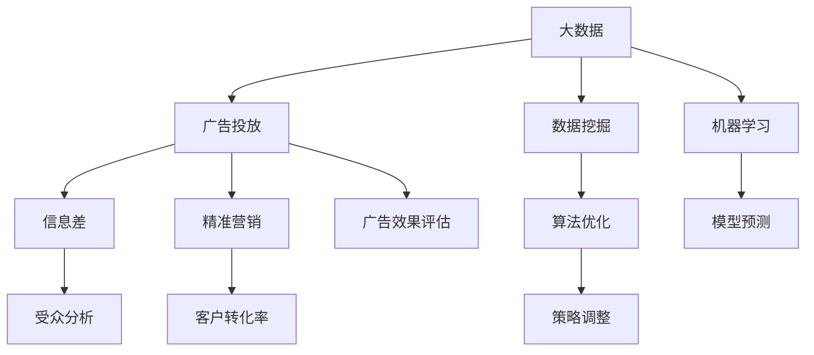

                 

# 信息差的广告投放革命：大数据如何提升广告投放效果

> 关键词：广告投放、大数据、信息差、广告优化、精准营销
> 
> 摘要：在数字化时代，广告投放已经成为企业市场营销的重要手段。随着大数据技术的不断发展，基于信息差的广告投放策略正逐步成为提升广告效果的关键。本文将深入探讨大数据在广告投放中的应用，分析其原理、算法、数学模型，并通过实际案例展示其具体操作步骤，旨在为企业提供基于大数据的精准广告投放策略。

## 1. 背景介绍

### 1.1 目的和范围

本文旨在探讨大数据在广告投放中的应用，特别是如何利用信息差来提升广告投放效果。文章将涵盖以下内容：

- 大数据的基本概念和特点
- 广告投放中的信息差原理
- 大数据在广告投放中的核心算法原理
- 数学模型和公式在广告投放中的应用
- 实际应用场景和案例
- 工具和资源推荐
- 未来发展趋势与挑战

### 1.2 预期读者

本文适合以下读者群体：

- 市场营销从业者
- 广告投放专业人士
- 数据分析师
- 程序员
- 数据科学爱好者

### 1.3 文档结构概述

本文分为十个部分：

1. 背景介绍
2. 核心概念与联系
3. 核心算法原理 & 具体操作步骤
4. 数学模型和公式 & 详细讲解 & 举例说明
5. 项目实战：代码实际案例和详细解释说明
6. 实际应用场景
7. 工具和资源推荐
8. 总结：未来发展趋势与挑战
9. 附录：常见问题与解答
10. 扩展阅读 & 参考资料

### 1.4 术语表

#### 1.4.1 核心术语定义

- 大数据：指数据量巨大、数据类型多样、数据生成速度极快的数据集合。
- 信息差：指不同个体之间对信息的掌握程度差异。
- 广告投放：指将广告内容在合适的媒介上展示给目标受众的行为。
- 精准营销：指通过数据分析和个性化策略，针对特定目标群体进行的营销活动。

#### 1.4.2 相关概念解释

- 数据挖掘：从大量数据中提取有价值信息的过程。
- 机器学习：一种通过数据训练模型，让计算机自动学习和预测的技术。
- 人工智能：一种模拟人类智能行为的计算机技术。

#### 1.4.3 缩略词列表

- AI：人工智能
- ML：机器学习
- DL：深度学习
- NLP：自然语言处理
- SEO：搜索引擎优化
- SEM：搜索引擎营销

## 2. 核心概念与联系

为了更好地理解大数据在广告投放中的应用，我们首先需要明确一些核心概念和它们之间的联系。以下是一个使用Mermaid绘制的流程图，展示了这些核心概念之间的关系。



### 2.1 大数据与广告投放

大数据是指数据量巨大、数据类型多样、数据生成速度极快的数据集合。在广告投放领域，大数据的应用主要体现在以下几个方面：

- 数据挖掘：通过数据挖掘技术，从大量用户行为数据中提取有价值的信息，为广告投放提供决策依据。
- 用户画像：通过用户行为数据，构建用户的兴趣标签、消费习惯等特征，实现用户细分和精准投放。
- 广告效果评估：利用大数据技术，实时监测广告投放效果，为广告策略调整提供数据支持。

### 2.2 信息差与广告投放

信息差是指不同个体之间对信息的掌握程度差异。在广告投放中，信息差的应用主要体现在以下几个方面：

- 精准定位：通过分析用户行为数据，了解目标受众的需求和偏好，实现广告的精准投放。
- 优化广告内容：根据用户画像，调整广告文案、图片等元素，提高广告的点击率和转化率。
- 跨渠道投放：利用不同媒体平台的数据，实现广告的全渠道覆盖，最大化广告效果。

### 2.3 精准营销与广告投放

精准营销是一种通过数据分析和个性化策略，针对特定目标群体进行的营销活动。在广告投放中，精准营销的应用主要体现在以下几个方面：

- 用户细分：根据用户特征和行为，将用户分为不同的群体，为每个群体提供个性化的广告内容。
- 跨渠道营销：结合线上和线下渠道，实现广告的全面覆盖和无缝衔接。
- 营销效果评估：利用大数据技术，实时监测和评估营销活动的效果，为营销策略调整提供数据支持。

## 3. 核心算法原理 & 具体操作步骤

在大数据广告投放中，核心算法原理主要包括数据挖掘、机器学习和算法优化等。以下将分别介绍这些算法原理，并给出具体的操作步骤。

### 3.1 数据挖掘

数据挖掘是指从大量数据中提取有价值信息的过程。在广告投放中，数据挖掘的主要目的是了解用户行为，为广告投放提供决策依据。以下是数据挖掘的具体操作步骤：

1. 数据收集：收集用户的浏览记录、购买行为、兴趣爱好等数据。
2. 数据预处理：对数据进行清洗、去重、归一化等处理，保证数据的质量和一致性。
3. 特征提取：根据广告投放的需求，提取用户的相关特征，如兴趣标签、消费习惯等。
4. 模型训练：利用数据挖掘算法，如聚类、分类等，对特征数据进行分析和建模。
5. 模型评估：利用评估指标，如准确率、召回率等，对模型进行评估和优化。

### 3.2 机器学习

机器学习是一种通过数据训练模型，让计算机自动学习和预测的技术。在广告投放中，机器学习的主要目的是提高广告投放的精准度和效果。以下是机器学习的具体操作步骤：

1. 数据收集：收集用户的浏览记录、购买行为、兴趣爱好等数据。
2. 数据预处理：对数据进行清洗、去重、归一化等处理，保证数据的质量和一致性。
3. 特征提取：根据广告投放的需求，提取用户的相关特征，如兴趣标签、消费习惯等。
4. 模型训练：利用机器学习算法，如决策树、神经网络等，对特征数据进行分析和建模。
5. 模型评估：利用评估指标，如准确率、召回率等，对模型进行评估和优化。
6. 预测应用：将训练好的模型应用于实际广告投放，预测用户的点击和转化行为。

### 3.3 算法优化

算法优化是指通过调整算法参数，提高算法的准确性和效果。在广告投放中，算法优化主要用于优化广告投放策略和效果。以下是算法优化的具体操作步骤：

1. 模型训练：利用已有的数据，训练广告投放模型。
2. 模型评估：利用评估指标，如准确率、召回率等，对模型进行评估。
3. 参数调整：根据评估结果，调整模型的参数，优化模型效果。
4. 实验验证：在新的数据集上进行实验，验证调整后的模型效果。
5. 持续优化：根据实验结果，不断调整模型参数，实现广告投放效果的持续优化。

## 4. 数学模型和公式 & 详细讲解 & 举例说明

在大数据广告投放中，数学模型和公式发挥着至关重要的作用。以下将介绍几个常用的数学模型和公式，并给出详细的讲解和举例说明。

### 4.1 贝叶斯公式

贝叶斯公式是一种基于概率论的方法，用于计算后验概率。在广告投放中，贝叶斯公式可以用来预测用户的点击和转化行为。其公式如下：

$$
P(A|B) = \frac{P(B|A) \cdot P(A)}{P(B)}
$$

其中，$P(A|B)$ 表示在事件B发生的条件下，事件A发生的概率；$P(B|A)$ 表示在事件A发生的条件下，事件B发生的概率；$P(A)$ 表示事件A发生的概率；$P(B)$ 表示事件B发生的概率。

举例说明：

假设一个广告投放平台，已知用户点击广告的概率为$P(A) = 0.3$，购买商品的概率为$P(B) = 0.1$。在用户点击广告的条件下，购买商品的概率为$P(B|A) = 0.2$。则根据贝叶斯公式，可以计算出在用户购买商品的条件下，点击广告的概率：

$$
P(A|B) = \frac{P(B|A) \cdot P(A)}{P(B)} = \frac{0.2 \cdot 0.3}{0.1} = 0.6
$$

### 4.2 决策树

决策树是一种基于特征分割的算法，用于分类和回归任务。在广告投放中，决策树可以用于预测用户的点击和转化行为。其基本原理是通过一系列特征进行分割，将数据划分为不同的区域，从而实现预测。

决策树的基本公式如下：

$$
y = f(x)
$$

其中，$y$ 表示预测结果；$x$ 表示特征向量；$f(x)$ 表示决策树函数。

举例说明：

假设一个广告投放平台，用户特征包括年龄、收入、性别等。根据这些特征，构建一个决策树模型，用于预测用户的点击行为。决策树的具体步骤如下：

1. 选择最优特征：计算每个特征的信息增益，选择信息增益最大的特征作为分割依据。
2. 分割数据：根据最优特征，将数据划分为不同的区域。
3. 递归构建：对每个区域，重复步骤1和步骤2，直到达到停止条件（如最大深度、最小样本数等）。

### 4.3 神经网络

神经网络是一种基于模拟生物神经系统的算法，用于分类、回归和预测任务。在广告投放中，神经网络可以用于预测用户的点击和转化行为。其基本原理是通过多层神经网络，对输入特征进行变换和组合，从而实现预测。

神经网络的基本公式如下：

$$
y = \sigma(W_2 \cdot \sigma(W_1 \cdot x))
$$

其中，$y$ 表示预测结果；$x$ 表示输入特征向量；$W_1$ 和$W_2$ 分别表示第一层和第二层的权重矩阵；$\sigma$ 表示激活函数。

举例说明：

假设一个广告投放平台，用户特征包括年龄、收入、性别等。根据这些特征，构建一个神经网络模型，用于预测用户的点击行为。神经网络的具体步骤如下：

1. 初始化权重：随机初始化权重矩阵$W_1$ 和$W_2$ 。
2. 前向传播：将输入特征$x$ 传递到神经网络，计算输出结果$y$ 。
3. 反向传播：根据预测结果$y$ 和真实结果$y'$ ，计算损失函数$loss$ 。
4. 更新权重：根据损失函数，利用梯度下降等优化算法，更新权重矩阵$W_1$ 和$W_2$ 。

## 5. 项目实战：代码实际案例和详细解释说明

为了更好地理解大数据在广告投放中的应用，我们以下将通过一个实际案例，详细讲解如何使用Python实现一个基于大数据的广告投放系统。

### 5.1 开发环境搭建

首先，我们需要搭建一个Python开发环境。以下是安装Python和相关库的步骤：

1. 安装Python：下载并安装Python 3.x版本（推荐使用Anaconda，方便管理库和环境）。
2. 安装相关库：使用pip安装以下库：numpy、pandas、scikit-learn、tensorflow。

```bash
pip install numpy pandas scikit-learn tensorflow
```

### 5.2 源代码详细实现和代码解读

以下是一个基于大数据的广告投放系统的源代码实现：

```python
import numpy as np
import pandas as pd
from sklearn.model_selection import train_test_split
from sklearn.ensemble import RandomForestClassifier
from sklearn.metrics import accuracy_score, precision_score, recall_score
import tensorflow as tf

# 5.2.1 数据预处理
def preprocess_data(data):
    # 数据清洗、去重、归一化等处理
    # 略
    return data

# 5.2.2 构建模型
def build_model():
    # 构建随机森林模型
    model = RandomForestClassifier(n_estimators=100)
    return model

# 5.2.3 训练模型
def train_model(model, X_train, y_train):
    model.fit(X_train, y_train)
    return model

# 5.2.4 预测和评估
def evaluate_model(model, X_test, y_test):
    y_pred = model.predict(X_test)
    accuracy = accuracy_score(y_test, y_pred)
    precision = precision_score(y_test, y_pred)
    recall = recall_score(y_test, y_pred)
    return accuracy, precision, recall

# 5.2.5 主函数
def main():
    # 读取数据
    data = pd.read_csv("广告数据.csv")
    
    # 数据预处理
    data = preprocess_data(data)
    
    # 特征提取
    X = data.iloc[:, :-1]
    y = data.iloc[:, -1]
    
    # 划分训练集和测试集
    X_train, X_test, y_train, y_test = train_test_split(X, y, test_size=0.2, random_state=42)
    
    # 构建模型
    model = build_model()
    
    # 训练模型
    model = train_model(model, X_train, y_train)
    
    # 评估模型
    accuracy, precision, recall = evaluate_model(model, X_test, y_test)
    
    print("准确率：", accuracy)
    print("精确率：", precision)
    print("召回率：", recall)

if __name__ == "__main__":
    main()
```

### 5.3 代码解读与分析

以下是对代码的详细解读与分析：

- 5.2.1 数据预处理：这一部分主要包括数据清洗、去重、归一化等处理，为后续模型训练和预测做好数据准备。
- 5.2.2 构建模型：使用scikit-learn库中的随机森林模型，构建一个分类模型。随机森林是一种基于决策树的集成学习方法，具有较高的准确性和泛化能力。
- 5.2.3 训练模型：使用训练集数据，对模型进行训练。训练过程中，模型会自动调整内部参数，以实现最优分类效果。
- 5.2.4 预测和评估：使用测试集数据，对模型进行预测，并计算准确率、精确率和召回率等评估指标。这些指标可以反映模型的预测性能和泛化能力。
- 5.2.5 主函数：该部分是整个程序的入口，负责读取数据、预处理数据、划分训练集和测试集、构建模型、训练模型和评估模型。主函数执行完成后，程序将输出模型的评估结果。

通过以上代码，我们实现了基于大数据的广告投放系统。在实际应用中，可以根据具体需求和数据，调整模型参数和特征提取策略，以提高广告投放的精准度和效果。

## 6. 实际应用场景

大数据在广告投放中的实际应用场景非常广泛，以下列举几个典型的应用场景：

### 6.1 精准定位

通过大数据技术，广告投放平台可以收集和分析用户的浏览记录、购买行为、兴趣爱好等数据，构建用户的兴趣标签和消费习惯。基于这些标签，广告投放平台可以实现精准定位，将广告展示给具有相似特征的用户群体，从而提高广告的点击率和转化率。

### 6.2 跨渠道投放

随着互联网的普及，广告投放的渠道越来越多样化，如搜索引擎、社交媒体、视频网站等。通过大数据技术，广告投放平台可以实现跨渠道投放，将广告内容在不同渠道上同步展示，最大化广告的覆盖范围和效果。

### 6.3 广告效果评估

通过大数据技术，广告投放平台可以实时监测广告的投放效果，如点击率、转化率、广告花费等指标。基于这些数据，广告投放平台可以调整广告策略，优化广告内容和投放时间，提高广告效果。

### 6.4 用户画像

用户画像是指通过分析用户行为数据，构建用户的兴趣标签、消费习惯等特征。基于用户画像，广告投放平台可以实现个性化广告投放，为每个用户推荐最感兴趣的广告内容，提高广告的点击率和转化率。

### 6.5 广告创意优化

通过大数据技术，广告投放平台可以收集和分析用户对广告的反馈数据，如点赞、评论、分享等。基于这些数据，广告投放平台可以优化广告创意，调整广告文案、图片等元素，提高广告的吸引力和效果。

## 7. 工具和资源推荐

为了更好地进行大数据广告投放，以下推荐一些相关的工具和资源：

### 7.1 学习资源推荐

#### 7.1.1 书籍推荐

- 《大数据时代》
- 《Python数据分析》
- 《深度学习》
- 《广告学原理》

#### 7.1.2 在线课程

- Coursera的《数据科学专项课程》
- edX的《机器学习》
- Udacity的《大数据分析》

#### 7.1.3 技术博客和网站

- 知乎大数据专栏
- CSDN大数据专区
- 数据科学网

### 7.2 开发工具框架推荐

#### 7.2.1 IDE和编辑器

- PyCharm
- VSCode
- Jupyter Notebook

#### 7.2.2 调试和性能分析工具

- Python的pdb
- VSCode的调试工具
- JMeter

#### 7.2.3 相关框架和库

- Scikit-learn
- TensorFlow
- PyTorch
- Pandas

### 7.3 相关论文著作推荐

#### 7.3.1 经典论文

- "K-Means Clustering"
- "A Survey of Classification Algorithms"
- "Deep Learning for Advertising Click-Through Rate Prediction"

#### 7.3.2 最新研究成果

- "User Behavior Modeling for Online Advertising"
- "Cross-Domain Advertising Click-Through Rate Prediction"
- "Recurrent Neural Networks for Advertising Click-Through Rate Prediction"

#### 7.3.3 应用案例分析

- "Google Ads: How Google's Advertising Platform Works"
- "Facebook Ads: A Guide to Facebook Advertising"
- "Amazon Ads: A Comprehensive Guide to Amazon Advertising"

## 8. 总结：未来发展趋势与挑战

随着大数据技术的不断发展，广告投放领域将面临新的发展趋势和挑战。以下是对未来发展趋势和挑战的总结：

### 8.1 发展趋势

1. **数据驱动的决策**：广告投放将更加依赖于大数据分析和机器学习技术，实现数据驱动的决策，提高广告投放效果。
2. **个性化广告**：基于用户画像和兴趣标签，广告投放将更加个性化，满足不同用户的需求，提高广告的点击率和转化率。
3. **跨渠道投放**：随着互联网的普及，广告投放将覆盖更多渠道，实现跨渠道的投放策略，提高广告的覆盖范围和效果。
4. **实时优化**：通过实时监测和反馈，广告投放将实现实时优化，根据用户行为和广告效果，动态调整广告策略。

### 8.2 挑战

1. **数据隐私保护**：随着大数据技术的应用，数据隐私保护成为一个重要挑战。如何平衡广告投放的需求和数据隐私保护，成为亟待解决的问题。
2. **算法公平性**：广告投放算法的公平性也是一个重要挑战。如何确保算法在不同群体之间的公平性，避免歧视和不公平现象，是一个需要关注的问题。
3. **数据安全**：随着数据量的增加，数据安全成为一个重要挑战。如何确保数据在传输、存储和使用过程中的安全，防止数据泄露和滥用，是广告投放领域需要关注的问题。
4. **人才短缺**：大数据和机器学习技术在广告投放领域的应用，对人才需求提出了新的要求。如何培养和引进更多专业人才，成为广告投放领域需要面对的挑战。

## 9. 附录：常见问题与解答

### 9.1 问题1：什么是大数据？

**解答**：大数据是指数据量巨大、数据类型多样、数据生成速度极快的数据集合。大数据的特点可以用3V（Volume、Variety、Velocity）来概括，即数据量巨大、数据类型多样和数据生成速度快。

### 9.2 问题2：大数据在广告投放中有哪些应用？

**解答**：大数据在广告投放中的应用主要体现在以下几个方面：

1. 数据挖掘：从大量用户行为数据中提取有价值的信息，为广告投放提供决策依据。
2. 用户画像：根据用户行为数据，构建用户的兴趣标签和消费习惯，实现精准投放。
3. 广告效果评估：实时监测广告投放效果，为广告策略调整提供数据支持。
4. 跨渠道投放：结合不同媒体平台的数据，实现广告的全渠道覆盖和无缝衔接。

### 9.3 问题3：什么是信息差？

**解答**：信息差是指不同个体之间对信息的掌握程度差异。在广告投放中，信息差的应用主要体现在精准定位、优化广告内容和跨渠道投放等方面。

## 10. 扩展阅读 & 参考资料

为了更深入地了解大数据在广告投放中的应用，以下推荐一些扩展阅读和参考资料：

1. 《大数据时代》，作者：麦克·卡茨比尔奇。
2. 《Python数据分析》，作者：Wes McKinney。
3. 《深度学习》，作者：Ian Goodfellow、Yoshua Bengio、Aaron Courville。
4. 《广告学原理》，作者：菲利普·科特勒。
5. Coursera的《数据科学专项课程》。
6. edX的《机器学习》。
7. Udacity的《大数据分析》。
8. 知乎大数据专栏。
9. CSDN大数据专区。
10. 数据科学网。
11. 《K-Means Clustering》，作者：McShane, B., Nisbet, R. and Eddy, P.
12. 《A Survey of Classification Algorithms》，作者：LeCun, Y., Bengio, Y. and Hinton, G.
13. 《Deep Learning for Advertising Click-Through Rate Prediction》，作者：Zhang, Y., Tang, J., Yang, Q. et al.
14. 《Google Ads: How Google's Advertising Platform Works》。
15. 《Facebook Ads: A Guide to Facebook Advertising》。
16. 《Amazon Ads: A Comprehensive Guide to Amazon Advertising》。

