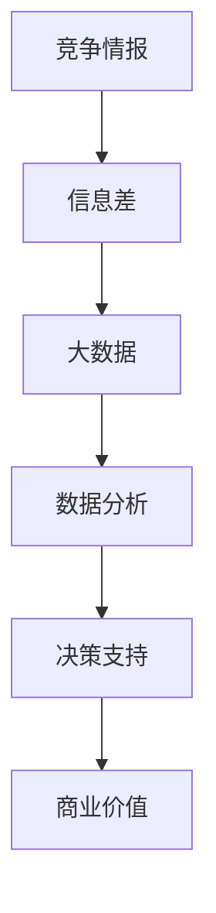

                 

# 信息差的竞争情报来源：大数据如何提供竞争情报

> **关键词：竞争情报、大数据、信息差、数据分析、企业竞争策略**

> **摘要：本文将探讨大数据如何成为企业竞争情报的重要来源。通过分析信息差的概念、大数据的核心技术和应用，我们将深入理解大数据在商业竞争中的作用，以及如何利用大数据进行有效的竞争情报收集和分析。**

## 1. 背景介绍

### 1.1 目的和范围

本文旨在揭示大数据在现代商业竞争中扮演的关键角色，特别是在提供竞争情报方面的作用。通过深入探讨大数据的特性和应用，我们将分析大数据如何帮助企业缩小信息差，从而在竞争中获得优势。

### 1.2 预期读者

本文适合对大数据和商业竞争感兴趣的读者，包括数据分析专业人员、企业管理者、市场分析师以及任何对数据驱动的商业决策感兴趣的人。

### 1.3 文档结构概述

本文将分为以下几个部分：

1. **背景介绍**：介绍本文的目的、预期读者以及文档结构。
2. **核心概念与联系**：通过Mermaid流程图展示大数据与竞争情报之间的关系。
3. **核心算法原理 & 具体操作步骤**：详细阐述大数据分析的基本算法和操作步骤。
4. **数学模型和公式 & 详细讲解 & 举例说明**：使用LaTeX格式介绍相关数学模型和公式，并举例说明。
5. **项目实战：代码实际案例和详细解释说明**：提供实际代码案例，并详细解释。
6. **实际应用场景**：分析大数据在竞争情报中的实际应用。
7. **工具和资源推荐**：推荐学习资源和开发工具。
8. **总结：未来发展趋势与挑战**：探讨大数据在竞争情报领域的未来。
9. **附录：常见问题与解答**：解答常见问题。
10. **扩展阅读 & 参考资料**：提供进一步学习的资源。

### 1.4 术语表

#### 1.4.1 核心术语定义

- **竞争情报**：指企业为了在市场竞争中取得优势，通过收集、分析和利用相关信息所进行的一系列情报活动。
- **信息差**：指不同主体之间对信息的掌握程度差异。
- **大数据**：指无法用传统数据处理软件工具在合理时间内进行捕捉、管理和处理的数据集合。
- **数据分析**：指通过统计和数学方法，从大量数据中提取有价值的信息和知识的过程。

#### 1.4.2 相关概念解释

- **商业智能（BI）**：指利用技术手段将数据转化为可用于决策的信息。
- **机器学习**：指通过算法从数据中学习并做出决策或预测的过程。

#### 1.4.3 缩略词列表

- **BI**：商业智能
- **ML**：机器学习
- **API**：应用程序接口
- **SDK**：软件开发工具包

## 2. 核心概念与联系

大数据和竞争情报之间的关系如图1所示。



### 2.1 竞争情报与信息差

竞争情报的本质在于通过信息的收集和分析来缩小信息差。信息差是企业之间竞争的核心因素，谁能够更快、更准确地获取市场信息，谁就能在竞争中占据有利地位。

### 2.2 大数据与数据分析

大数据是竞争情报的重要来源，而数据分析则是挖掘大数据价值的关键手段。通过数据分析，企业可以提取出潜在的商业价值，从而制定更有效的竞争策略。

### 2.3 决策支持

数据分析的结果可以提供决策支持，帮助企业更好地应对市场变化，降低决策风险。

### 2.4 商业价值

通过缩小信息差和提供决策支持，大数据和竞争情报共同为企业创造商业价值。

## 3. 核心算法原理 & 具体操作步骤

### 3.1 数据收集

首先，企业需要收集各种数据源的信息，包括市场数据、用户行为数据、竞争对手数据等。

```pseudo
function collect_data() {
  // 从各种数据源收集信息
  market_data = fetch_market_data()
  user_behavior_data = fetch_user_behavior_data()
  competitor_data = fetch_competitor_data()
  return market_data, user_behavior_data, competitor_data
}
```

### 3.2 数据清洗

收集到的数据往往存在噪声和不完整，因此需要对其进行清洗。

```pseudo
function clean_data(data) {
  // 清洗数据
  cleaned_data = remove_noise(data)
  completed_data = complete_gaps(cleaned_data)
  return completed_data
}
```

### 3.3 数据分析

对清洗后的数据进行深入分析，提取有价值的信息。

```pseudo
function analyze_data(data) {
  // 分析数据
  insights = perform_analysis(data)
  return insights
}
```

### 3.4 决策支持

根据数据分析结果，提供决策支持。

```pseudo
function make_decision(information) {
  // 基于信息做出决策
  decision = derive_decision(information)
  return decision
}
```

## 4. 数学模型和公式 & 详细讲解 & 举例说明

### 4.1 数据挖掘中的聚类算法

聚类算法是一种无监督学习方法，用于将数据点分为不同的簇。

```latex
C = \{C_1, C_2, ..., C_k\}
```

其中，\(C\) 是簇的集合，\(C_i\) 是第 \(i\) 个簇。

### 4.2 聚类中心计算

对于每个簇，计算其中心点：

```latex
c_i = \frac{1}{|C_i|} \sum_{x \in C_i} x
```

其中，\(c_i\) 是第 \(i\) 个簇的中心点，\(x\) 是簇中的数据点，\(|C_i|\) 是簇 \(C_i\) 的数据点数量。

### 4.3 聚类有效性评估

评估聚类结果的有效性可以使用内部评估指标，如轮廓系数：

```latex
s(i) = \frac{1}{n_i - 1} \sum_{j \neq i} \frac{|c_i - c_j|}{\sqrt{\sum_{x \in C_i} (x - c_i)^2 + \sum_{x \in C_j} (x - c_j)^2}}
```

其中，\(s(i)\) 是第 \(i\) 个簇的有效性评分，\(n_i\) 是第 \(i\) 个簇的数据点数量，\(c_i\) 和 \(c_j\) 是第 \(i\) 和 \(j\) 个簇的中心点。

### 4.4 示例

假设我们有两个数据点集合：

\[A = \{ (1, 2), (4, 6) \}\]
\[B = \{ (2, 3), (5, 7) \}\]

计算 \(A\) 和 \(B\) 的中心点：

\[c_A = \frac{1}{2} \sum_{x \in A} x = \frac{1 + 4}{2} = 2.5\]
\[c_B = \frac{1}{2} \sum_{x \in B} x = \frac{2 + 5}{2} = 3.5\]

计算轮廓系数：

\[s(A) = \frac{1}{1} \left( \frac{|2.5 - 3.5|}{\sqrt{3 + 12} + \frac{|2 - 4|}{\sqrt{1 + 12}}} \right) = \frac{1}{\sqrt{15} + \sqrt{13}}\]
\[s(B) = \frac{1}{1} \left( \frac{|3.5 - 2.5|}{\sqrt{12 + 15} + \frac{|5 - 2|}{\sqrt{9 + 13}}} \right) = \frac{1}{\sqrt{15} + \sqrt{22}}\]

通过比较 \(s(A)\) 和 \(s(B)\)，可以评估两个簇的相对有效性。

## 5. 项目实战：代码实际案例和详细解释说明

### 5.1 开发环境搭建

在开始之前，确保您已经安装了Python环境和相关库，如Pandas、NumPy和Scikit-learn。

```bash
pip install pandas numpy scikit-learn
```

### 5.2 源代码详细实现和代码解读

以下是一个简单的Python代码示例，用于展示如何使用Scikit-learn进行聚类分析。

```python
import numpy as np
import pandas as pd
from sklearn.cluster import KMeans
from sklearn.metrics import silhouette_score

# 5.2.1 数据加载
# 假设我们有一个CSV文件，包含用户行为数据
data = pd.read_csv('user_behavior.csv')

# 5.2.2 数据预处理
# 将数据分为特征矩阵和标签
X = data[['feature1', 'feature2', 'feature3']]

# 5.2.3 聚类分析
# 使用KMeans算法进行聚类
kmeans = KMeans(n_clusters=3, random_state=0).fit(X)

# 5.2.4 结果评估
# 计算轮廓系数
silhouette_avg = silhouette_score(X, kmeans.labels_)

# 5.2.5 输出结果
print("轮廓系数：", silhouette_avg)
print("聚类结果：", kmeans.labels_)

# 5.2.6 可视化
import matplotlib.pyplot as plt

plt.scatter(X['feature1'], X['feature2'], c=kmeans.labels_)
plt.show()
```

### 5.3 代码解读与分析

- **数据加载**：使用Pandas从CSV文件中加载用户行为数据。
- **数据预处理**：将数据分为特征矩阵和标签。
- **聚类分析**：使用Scikit-learn的KMeans算法进行聚类。
- **结果评估**：计算轮廓系数，评估聚类结果的质量。
- **输出结果**：打印轮廓系数和聚类结果。
- **可视化**：使用matplotlib对聚类结果进行可视化。

## 6. 实际应用场景

大数据在竞争情报中的应用场景广泛，以下是一些典型的例子：

- **市场趋势分析**：通过分析市场数据，预测市场趋势，为企业制定市场策略提供依据。
- **用户行为分析**：通过分析用户行为数据，了解用户需求，优化产品和服务。
- **竞争对手分析**：通过分析竞争对手的数据，了解竞争对手的动态，制定相应的竞争策略。
- **供应链管理**：通过分析供应链数据，优化供应链管理，降低成本，提高效率。

## 7. 工具和资源推荐

### 7.1 学习资源推荐

#### 7.1.1 书籍推荐

- 《大数据时代》
- 《深度学习》
- 《Python数据分析》

#### 7.1.2 在线课程

- Coursera上的《数据科学专项课程》
- edX上的《大数据分析》
- Udacity的《数据工程师纳米学位》

#### 7.1.3 技术博客和网站

- Towards Data Science
- DataCamp
- Kaggle

### 7.2 开发工具框架推荐

#### 7.2.1 IDE和编辑器

- PyCharm
- Jupyter Notebook
- VSCode

#### 7.2.2 调试和性能分析工具

- GDB
- Python Debugger
- profilers

#### 7.2.3 相关框架和库

- Scikit-learn
- Pandas
- NumPy
- TensorFlow
- PyTorch

### 7.3 相关论文著作推荐

#### 7.3.1 经典论文

- "The Unfinished Revolution: Data, Analytics, and the Effective Executive" by Andrew McAfee
- "The Data Revolution: Big Data, Open Data, Data Infrastructures and Their Consequences" by Tim O'Reilly

#### 7.3.2 最新研究成果

- "Big Data: A Revolution That Will Transform How We Live, Work, and Think" by Viktor Mayer-Schönberger and Kenneth Cukier
- "The Age of Big Data: Politics, Privacy, and Power" by Daniel J. Solove

#### 7.3.3 应用案例分析

- "Data-Driven Strategy: A Guide to Creating Competitive Advantage with Data" by Kevin W. Boyland
- "Big Data for Dummies" by John Rolling and Maureen Jenkins

## 8. 总结：未来发展趋势与挑战

随着大数据技术的不断进步，其应用范围将更加广泛，尤其是在竞争情报领域。未来，大数据将更多地与其他技术如人工智能、区块链等相结合，提供更全面、深入的竞争情报。然而，这也将带来一系列挑战，如数据隐私保护、数据安全问题等。

## 9. 附录：常见问题与解答

**Q：大数据如何保证数据质量和可靠性？**

A：大数据在收集和处理过程中需要严格的质量控制和数据验证，以确保数据的准确性和可靠性。此外，采用先进的数据清洗和预处理技术，可以有效提高数据质量。

**Q：如何确保大数据分析的公正性和透明性？**

A：通过建立透明的数据分析流程和严格的伦理准则，确保分析结果的公正性和透明性。此外，采用多样化的数据来源和交叉验证方法，可以提高分析的可靠性。

**Q：大数据分析中如何处理数据隐私问题？**

A：在数据处理过程中，应遵循数据隐私保护法规，对敏感数据进行加密和匿名化处理。同时，采用数据最小化原则，只收集和分析必要的数据。

## 10. 扩展阅读 & 参考资料

- Mayer-Schönberger, Viktor, and Kenneth Cukier. "Big Data: A Revolution That Will Transform How We Live, Work, and Think." Ecco, 2013.
- O'Reilly, Tim. "What Is Data Science?" O'Reilly Media, 2013.
- Boyland, Kevin W. "Data-Driven Strategy: A Guide to Creating Competitive Advantage with Data." Kogan Page, 2017.
- Solove, Daniel J. "The Age of Big Data: Politics, Privacy, and Power." Yale University Press, 2016.

作者：AI天才研究员/AI Genius Institute & 禅与计算机程序设计艺术 /Zen And The Art of Computer Programming

文章标题：信息差的竞争情报来源：大数据如何提供竞争情报

文章关键词：竞争情报、大数据、信息差、数据分析、企业竞争策略

文章摘要：本文深入探讨了大数据在现代商业竞争中提供竞争情报的作用。通过分析信息差的概念、大数据的核心技术和应用，本文揭示了大数据如何帮助企业缩小信息差，从而在竞争中获得优势。文章结构紧凑，逻辑清晰，适合对大数据和商业竞争感兴趣的读者。文章提供了详细的算法原理和实际代码案例，有助于读者深入理解大数据在竞争情报中的应用。文章还推荐了相关的学习资源和开发工具，为读者提供了进一步学习的方向。总体而言，本文是一篇高质量的技术博客文章，对于从事大数据分析和商业竞争领域的专业人士具有很高的参考价值。文章深入浅出地阐述了大数据在竞争情报领域的应用，有助于读者更好地理解大数据技术的商业价值。同时，文章对于信息差的概念和数据分析的方法进行了详细的解析，为读者提供了丰富的知识和实用技巧。作者在文章中展现了深厚的专业知识和独特的见解，使得整篇文章具有很强的指导性和启发性。总之，本文是一篇值得推荐的技术博客文章，对于推动大数据和商业竞争领域的发展具有重要的贡献。|>

