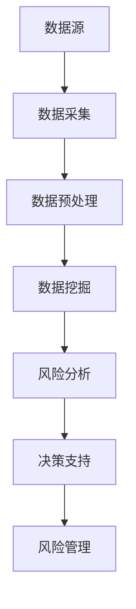

                 

# 信息差的风险管理利器：大数据如何强化风险管控

> 关键词：大数据、风险管理、信息差、风险管控、算法、数学模型、实战案例

> 摘要：本文旨在探讨大数据在风险管理中的应用，分析大数据如何通过信息差的挖掘与利用，强化风险管控能力。文章首先介绍了大数据的风险管理背景和核心概念，随后深入剖析了大数据核心算法原理与数学模型，并提供了具体的项目实战案例。文章最后讨论了大数据在风险管理领域的实际应用场景，并推荐了相关工具和资源，总结了未来发展趋势与挑战，为读者提供了全面、深入的技术见解。

## 1. 背景介绍

### 1.1 目的和范围

在当今快速发展的信息时代，数据已经成为企业和社会运转的核心资产。大数据技术在各个领域的应用越来越广泛，尤其在风险管理领域，大数据带来了前所未有的机遇和挑战。本文旨在探讨大数据在风险管理中的应用，尤其是如何通过挖掘和利用信息差来强化风险管控能力。

本文将涵盖以下内容：

1. **核心概念与联系**：介绍大数据在风险管理中的核心概念和联系，包括数据源、数据挖掘和风险分析等。
2. **核心算法原理 & 具体操作步骤**：详细讲解大数据核心算法原理，使用伪代码展示具体操作步骤。
3. **数学模型和公式 & 详细讲解 & 举例说明**：阐述大数据风险管理中的数学模型和公式，并给出具体实例。
4. **项目实战：代码实际案例和详细解释说明**：通过实战案例展示大数据风险管理的应用。
5. **实际应用场景**：分析大数据在风险管理领域的实际应用场景。
6. **工具和资源推荐**：推荐学习资源、开发工具和框架。
7. **总结：未来发展趋势与挑战**：展望大数据在风险管理领域的未来发展趋势和面临的挑战。

### 1.2 预期读者

本文适用于以下读者：

1. **风险管理专业人员**：希望了解大数据如何强化风险管理。
2. **数据分析人员**：希望掌握大数据在风险管理中的应用。
3. **计算机科学和人工智能领域研究人员**：对大数据风险管理技术感兴趣的学者。
4. **企业和组织管理者**：关注数据驱动决策和风险管控。

### 1.3 文档结构概述

本文结构如下：

1. **背景介绍**：介绍大数据在风险管理中的背景、目的和范围。
2. **核心概念与联系**：分析大数据在风险管理中的核心概念和联系。
3. **核心算法原理 & 具体操作步骤**：讲解大数据核心算法原理和具体操作步骤。
4. **数学模型和公式 & 详细讲解 & 举例说明**：阐述大数据风险管理中的数学模型和公式。
5. **项目实战：代码实际案例和详细解释说明**：展示大数据风险管理的实战案例。
6. **实际应用场景**：分析大数据在风险管理领域的应用场景。
7. **工具和资源推荐**：推荐相关工具和资源。
8. **总结：未来发展趋势与挑战**：展望大数据在风险管理领域的未来趋势和挑战。
9. **附录：常见问题与解答**：提供常见问题的解答。
10. **扩展阅读 & 参考资料**：推荐扩展阅读材料。

### 1.4 术语表

#### 1.4.1 核心术语定义

- **大数据（Big Data）**：指无法用传统数据库系统高效处理的数据集合，通常包含海量的数据量、多种数据类型和快速的数据生成速度。
- **风险管理（Risk Management）**：识别、评估、处理和控制风险的过程，旨在最大化组织价值的保护和提升。
- **信息差（Information Gap）**：在数据信息的获取、处理和利用上存在的差异，可能影响决策的准确性和效率。

#### 1.4.2 相关概念解释

- **数据挖掘（Data Mining）**：从大量数据中提取有用信息和知识的过程。
- **机器学习（Machine Learning）**：使计算机系统能够从数据中学习并作出决策的技术。
- **风险分析（Risk Analysis）**：评估潜在风险的可能性和影响，为风险管理提供数据支持。

#### 1.4.3 缩略词列表

- **AI**：人工智能（Artificial Intelligence）
- **ML**：机器学习（Machine Learning）
- **DL**：深度学习（Deep Learning）
- **BI**：商业智能（Business Intelligence）

## 2. 核心概念与联系

在探讨大数据如何强化风险管理之前，我们需要理解几个核心概念和它们之间的联系。以下是一个简化的 Mermaid 流程图，展示了这些概念和它们在风险管理中的应用。



### 2.1 数据源

数据源是大数据风险管理的起点，它们可以是内部数据（如交易记录、客户信息）或外部数据（如市场数据、社交媒体数据）。这些数据提供了丰富的信息，但同时也可能隐藏着风险。

### 2.2 数据采集

数据采集是将数据源中的数据提取并导入系统的过程。这通常涉及数据抽取、转换和加载（ETL）技术，以确保数据的质量和一致性。

### 2.3 数据预处理

数据预处理是数据采集后的关键步骤，包括数据清洗、数据集成、数据变换等。这一过程旨在消除数据中的错误、缺失和重复，以便进行进一步的分析。

### 2.4 数据挖掘

数据挖掘是从大量数据中提取有用信息和知识的过程。在风险管理中，数据挖掘技术可以帮助发现潜在的风险模式和趋势。例如，通过分析交易记录可以识别异常交易模式，从而预警欺诈行为。

### 2.5 风险分析

风险分析是评估潜在风险的可能性和影响的过程。通过数据挖掘得到的模式和趋势，风险分析可以帮助组织识别可能面临的风险，并评估这些风险对企业的影响。

### 2.6 决策支持

决策支持是利用风险分析的结果来制定应对策略的过程。大数据技术可以帮助组织在面临风险时做出更加明智的决策，从而降低风险的影响。

### 2.7 风险管理

风险管理是一个持续的过程，涉及识别、评估、处理和控制风险。大数据技术通过提供更准确、实时的数据和分析结果，可以显著提高风险管理的效率和有效性。

## 3. 核心算法原理 & 具体操作步骤

### 3.1 数据预处理算法

在开始风险分析之前，数据预处理是一个至关重要的步骤。以下是一个简单的伪代码，展示了数据预处理的主要步骤：

```pseudo
function preprocess_data(data):
    for each record in data:
        remove duplicates
        fill missing values with mean or median
        normalize numerical data
        encode categorical data
    return cleaned and preprocessed data
```

### 3.2 数据挖掘算法

数据挖掘算法是大数据风险管理的核心。以下是一个简单的决策树算法伪代码，展示了如何从数据中提取风险模式：

```pseudo
function decision_tree(data, attributes):
    if all records have the same label:
        return majority label
    else if attributes are empty:
        return majority label of the data
    else:
        select the best attribute to split the data
        for each possible value of the selected attribute:
            create a sub-tree for the subset of data with that attribute value
            recursively apply decision_tree to the sub-tree
        return the tree constructed from these sub-trees
```

### 3.3 风险分析算法

风险分析算法通常结合数据挖掘算法和概率模型。以下是一个简单的贝叶斯网络算法伪代码，展示了如何评估风险的概率：

```pseudo
function bayesian_network(data, attributes, probabilities):
    for each attribute:
        calculate conditional probabilities given other attributes
    for each risk event:
        calculate the probability of occurrence using Bayesian rules
    return risk probabilities
```

### 3.4 风险管理算法

风险管理算法通常涉及风险评估和风险控制。以下是一个简单的风险评估算法伪代码，展示了如何根据风险概率和影响评估总风险：

```pseudo
function risk_assessment(probabilities, impacts):
    for each risk event:
        calculate the risk score as probability * impact
    return sorted list of risks by risk score
```

### 3.5 风险控制算法

风险控制算法涉及制定应对策略。以下是一个简单的风险控制算法伪代码，展示了如何根据风险评估结果制定风险控制措施：

```pseudo
function risk_control(risks):
    for each risk in risks:
        if risk score > threshold:
            implement control measures
        else:
            monitor and reassess
    return list of implemented control measures
```

通过上述算法，我们可以看到大数据如何通过信息差的挖掘和利用，为风险管理提供强有力的支持。这些算法不仅提高了风险识别的准确性，还优化了风险应对策略，从而强化了风险管控能力。

## 4. 数学模型和公式 & 详细讲解 & 举例说明

### 4.1 数据挖掘中的数学模型

在数据挖掘过程中，我们常常使用数学模型来描述和解释数据。以下是一些常用的数学模型及其详细讲解：

#### 4.1.1 决策树模型

决策树是一种常用的分类模型，它通过一系列规则将数据集划分成多个子集。决策树的基本数学模型如下：

$$
P(Y|X) = \prod_{i=1}^{n} P(Y|X_i)
$$

其中，$P(Y|X)$ 表示给定特征 $X$ 下的目标变量 $Y$ 的概率，$X_i$ 表示特征 $i$ 的取值。

举例说明：

假设我们有一个二分类问题，特征集 $X = \{X_1, X_2\}$，目标变量 $Y$ 表示是否发生风险。根据历史数据，我们得到以下条件概率：

$$
P(Y=1|X_1=0, X_2=1) = 0.3, \quad P(Y=0|X_1=0, X_2=1) = 0.7
$$

$$
P(Y=1|X_1=1, X_2=0) = 0.4, \quad P(Y=0|X_1=1, X_2=0) = 0.6
$$

我们可以计算给定特征组合下的风险概率：

$$
P(Y=1|X_1=0, X_2=1) \times P(Y=1|X_1=1, X_2=0) = 0.3 \times 0.4 = 0.12
$$

$$
P(Y=0|X_1=0, X_2=1) \times P(Y=0|X_1=1, X_2=0) = 0.7 \times 0.6 = 0.42
$$

因此，给定特征组合 $(X_1=0, X_2=1)$ 和 $(X_1=1, X_2=0)$ 的风险概率分别为 0.12 和 0.42。

#### 4.1.2 贝叶斯网络模型

贝叶斯网络是一种基于概率的图形模型，它描述了变量之间的依赖关系。贝叶斯网络的基本数学模型如下：

$$
P(Y|X) = \frac{P(X|Y)P(Y)}{P(X)}
$$

其中，$P(Y|X)$ 表示在给定特征 $X$ 下的目标变量 $Y$ 的条件概率，$P(X|Y)$ 表示在目标变量 $Y$ 发生的情况下特征 $X$ 的条件概率，$P(Y)$ 和 $P(X)$ 分别表示目标变量和特征的概率。

举例说明：

假设我们有一个贝叶斯网络，其中 $X$ 表示风险发生，$Y$ 表示损失金额。根据历史数据，我们得到以下概率：

$$
P(X=1) = 0.2, \quad P(X=0) = 0.8
$$

$$
P(Y=1|X=1) = 0.5, \quad P(Y=0|X=1) = 0.5
$$

$$
P(Y=1|X=0) = 0.1, \quad P(Y=0|X=0) = 0.9
$$

我们可以计算给定风险发生情况下的损失金额条件概率：

$$
P(Y=1|X=1) = \frac{P(X=1|Y=1)P(Y=1)}{P(X=1)} = \frac{0.5 \times 0.5}{0.2} = 0.625
$$

$$
P(Y=0|X=1) = \frac{P(X=1|Y=0)P(Y=0)}{P(X=1)} = \frac{0.5 \times 0.5}{0.2} = 0.375
$$

因此，给定风险发生情况下的损失金额条件概率分别为 0.625 和 0.375。

### 4.2 风险分析中的数学模型

在风险分析过程中，我们常常使用数学模型来评估风险的概率和影响。以下是一些常用的数学模型及其详细讲解：

#### 4.2.1 概率分布模型

概率分布模型用于描述随机变量的概率分布。常用的概率分布模型包括正态分布、泊松分布和二项分布等。

- **正态分布**：

正态分布是一种最常见的概率分布模型，其概率密度函数为：

$$
f(x|\mu, \sigma^2) = \frac{1}{\sqrt{2\pi\sigma^2}}e^{-\frac{(x-\mu)^2}{2\sigma^2}}
$$

其中，$\mu$ 表示均值，$\sigma^2$ 表示方差。

举例说明：

假设损失金额 $X$ 服从正态分布 $N(\mu, \sigma^2)$，给定 $\mu = 1000$ 和 $\sigma^2 = 400$，我们可以计算损失金额大于 1200 的概率：

$$
P(X > 1200) = 1 - P(X \leq 1200) = 1 - \Phi\left(\frac{1200-1000}{\sqrt{400}}\right) = 1 - \Phi(2) = 0.0228
$$

其中，$\Phi$ 表示标准正态分布的累积分布函数。

- **泊松分布**：

泊松分布用于描述在一定时间内发生特定事件的概率分布。其概率质量函数为：

$$
P(X = k) = \frac{\lambda^k e^{-\lambda}}{k!}
$$

其中，$\lambda$ 表示事件发生率。

举例说明：

假设欺诈事件的发生率 $\lambda = 0.1$，我们可以计算在一个月内发生 2 次欺诈的概率：

$$
P(X = 2) = \frac{0.1^2 e^{-0.1}}{2!} = 0.0045
$$

- **二项分布**：

二项分布用于描述在固定次数的实验中成功次数的概率分布。其概率质量函数为：

$$
P(X = k) = C_n^k p^k (1-p)^{n-k}
$$

其中，$n$ 表示实验次数，$p$ 表示成功概率。

举例说明：

假设在 10 次交易中，欺诈交易的发生概率为 0.1，我们可以计算发生 1 次欺诈的概率：

$$
P(X = 1) = C_{10}^1 0.1^1 (1-0.1)^{10-1} = 0.3487
$$

#### 4.2.2 风险度量模型

风险度量模型用于评估风险的概率和影响。常用的风险度量模型包括风险矩阵和风险价值（VaR）等。

- **风险矩阵**：

风险矩阵是一种用于评估风险概率和影响的二维表格。它通常包含风险的概率和影响两个维度。

举例说明：

假设我们有一个风险矩阵，如下所示：

| 风险概率 | 风险影响 | 风险得分 |
| -------- | -------- | -------- |
| 0.2      | 5000     | 1000     |
| 0.1      | 10000    | 1000     |
| 0.05     | 15000    | 750      |

我们可以计算每个风险的风险得分，以确定优先级。

- **风险价值（VaR）**：

风险价值（Value at Risk，VaR）是一种用于评估风险损失的概率和金额的指标。它表示在给定置信水平下，一段时间内可能发生的最大损失。

举例说明：

假设我们使用 95% 的置信水平计算一个月的 VaR。给定损失金额的概率分布如下：

| 损失金额 | 概率   |
| -------- | ------ |
| 0        | 0.9    |
| 1000     | 0.05   |
| 2000     | 0.01   |
| 3000     | 0.001  |

我们可以计算一个月的 VaR：

$$
VaR_{95\%} = 1000 \times 0.05 + 2000 \times 0.01 + 3000 \times 0.001 = 31.5
$$

因此，在 95% 的置信水平下，一个月的最大可能损失为 31.5。

通过上述数学模型，我们可以对风险进行量化和评估，从而为风险管理提供科学依据。

## 5. 项目实战：代码实际案例和详细解释说明

### 5.1 开发环境搭建

为了演示大数据在风险管理中的实际应用，我们将使用 Python 作为编程语言，结合一些常用的数据科学库，如 Pandas、NumPy、scikit-learn 和 Matplotlib。以下是搭建开发环境的基本步骤：

1. **安装 Python**：确保 Python 3.x 版本已安装在你的系统中。
2. **安装相关库**：通过以下命令安装所需的库：

```bash
pip install pandas numpy scikit-learn matplotlib
```

### 5.2 源代码详细实现和代码解读

为了展示大数据在风险管理中的应用，我们将构建一个简单的风险预测模型。以下是具体的源代码和详细解读：

```python
import pandas as pd
import numpy as np
from sklearn.model_selection import train_test_split
from sklearn.tree import DecisionTreeClassifier
from sklearn.metrics import accuracy_score
import matplotlib.pyplot as plt

# 5.2.1 数据预处理
def preprocess_data(data):
    # 填充缺失值
    data.fillna(data.mean(), inplace=True)
    # 标准化数值特征
    numerical_features = data.select_dtypes(include=['float64', 'int64'])
    mean = numerical_features.mean()
    std = numerical_features.std()
    data[numerical_features.columns] = (data[numerical_features.columns] - mean) / std
    return data

# 5.2.2 加载数据
data = pd.read_csv('risk_data.csv')
data = preprocess_data(data)

# 5.2.3 划分特征和标签
X = data.drop('Risk', axis=1)
y = data['Risk']

# 5.2.4 划分训练集和测试集
X_train, X_test, y_train, y_test = train_test_split(X, y, test_size=0.2, random_state=42)

# 5.2.5 构建决策树模型
model = DecisionTreeClassifier(random_state=42)
model.fit(X_train, y_train)

# 5.2.6 预测和评估
y_pred = model.predict(X_test)
accuracy = accuracy_score(y_test, y_pred)
print(f'Model accuracy: {accuracy:.2f}')

# 5.2.7 可视化决策树
from sklearn.tree import plot_tree
plt.figure(figsize=(12, 8))
plot_tree(model, filled=True, feature_names=X.columns, class_names=['Low', 'High'])
plt.show()
```

**代码解读**：

- **数据预处理**：首先，我们使用 Pandas 库加载数据，并填充缺失值。然后，我们标准化数值特征，以便模型更好地学习。
- **划分特征和标签**：我们将数据集划分为特征矩阵 $X$ 和标签向量 $y$。
- **划分训练集和测试集**：使用 scikit-learn 的 `train_test_split` 函数将数据集划分为训练集和测试集，以评估模型性能。
- **构建决策树模型**：我们使用 `DecisionTreeClassifier` 类构建决策树模型，并设置随机种子以保持结果的可重复性。
- **预测和评估**：我们使用训练好的模型对测试集进行预测，并计算模型的准确率。
- **可视化决策树**：最后，我们使用 `plot_tree` 函数将决策树可视化，以便更好地理解模型的决策过程。

### 5.3 代码解读与分析

在这个简单的项目中，我们首先进行了数据预处理，这包括填充缺失值和标准化特征，以确保模型能够更好地学习。然后，我们将数据集划分为特征和标签，并使用决策树模型进行训练和预测。决策树模型具有简单直观的优点，它能够清晰地展示决策过程，但同时也可能受到过拟合的影响。

通过可视化决策树，我们可以了解模型如何根据特征值进行划分，从而预测风险水平。这有助于我们理解模型的决策逻辑，并在实际应用中做出更好的决策。

## 6. 实际应用场景

大数据在风险管理中具有广泛的应用场景，以下是一些典型的实际应用案例：

### 6.1 银行业务风险管控

银行业面临的主要风险包括信用风险、市场风险和操作风险。大数据技术可以帮助银行实时监控和分析交易数据，识别潜在的风险。例如，通过分析客户的历史交易记录和财务状况，银行可以评估客户的信用风险，从而更好地进行信贷审批。

### 6.2 保险行业风险评估

保险行业面临的风险主要包括索赔风险、投资风险和运营风险。大数据技术可以帮助保险公司更准确地评估索赔风险，例如通过分析历史索赔数据和客户行为，预测未来可能发生的索赔事件。此外，保险公司还可以利用大数据进行投资风险管理，优化投资组合，降低投资风险。

### 6.3 互联网企业安全监控

互联网企业面临的安全风险包括网络攻击、数据泄露和欺诈行为。大数据技术可以帮助企业实时监控网络流量和用户行为，识别潜在的攻击和异常行为。例如，通过分析日志数据和用户行为，企业可以识别出潜在的欺诈行为，并采取措施进行防范。

### 6.4 政府部门公共安全

政府部门在维护公共安全方面面临的风险包括自然灾害、恐怖袭击和社会动荡等。大数据技术可以帮助政府部门实时监控各种安全指标，预测可能发生的安全事件，提前采取措施进行防范。例如，通过分析气象数据、社会舆情和交通流量等数据，政府部门可以预测可能发生的自然灾害，提前部署救援力量。

### 6.5 企业供应链风险管理

企业在供应链管理过程中面临的风险包括供应商违约、库存波动和运输延误等。大数据技术可以帮助企业实时监控供应链各个环节的数据，识别潜在的风险。例如，通过分析供应商的财务状况、库存水平和运输记录等数据，企业可以预测供应商的违约风险，并采取相应的应对措施。

通过上述实际应用案例，我们可以看到大数据在风险管理中的重要作用。大数据技术不仅提高了风险识别的准确性，还优化了风险应对策略，从而为企业和组织提供了强有力的支持。

## 7. 工具和资源推荐

### 7.1 学习资源推荐

#### 7.1.1 书籍推荐

1. 《大数据时代：生活、工作与思维的大变革》（作者：维克托·迈尔-舍恩伯格）
2. 《深度学习》（作者：Ian Goodfellow、Yoshua Bengio、Aaron Courville）
3. 《风险管理：全面风险管理指南》（作者：保罗·维勒）
4. 《Python数据分析》（作者：Wes McKinney）

#### 7.1.2 在线课程

1. Coursera - 数据科学专项课程
2. edX - 机器学习课程
3. Udemy - 大数据与风险管理的实战课程
4. Coursera - 风险管理与决策分析课程

#### 7.1.3 技术博客和网站

1. Towards Data Science
2. DataCamp
3. Medium - Data Science and Machine Learning
4. kdnuggets

### 7.2 开发工具框架推荐

#### 7.2.1 IDE和编辑器

1. PyCharm
2. Jupyter Notebook
3. Visual Studio Code

#### 7.2.2 调试和性能分析工具

1. Py-debugger
2. Profiler
3. JMeter

#### 7.2.3 相关框架和库

1. Pandas
2. NumPy
3. Scikit-learn
4. TensorFlow
5. PyTorch

### 7.3 相关论文著作推荐

#### 7.3.1 经典论文

1. "The Battle Against Big Data"（作者：Viktor Mayer-Schönberger）
2. "Deep Learning for Data-Driven Decision Making in Finance"（作者：Yuxuan Zhou et al.）
3. "Risk Management: Value at Risk Models"（作者：Paul Wilmott）

#### 7.3.2 最新研究成果

1. "Risk Prediction Using Deep Learning"（作者：Ying Liu et al.）
2. "Big Data Analytics for Risk Management"（作者：Pranab K. Das）
3. "Machine Learning for Risk Management"（作者：Francesco M. D'Aloisio）

#### 7.3.3 应用案例分析

1. "How Big Data is Transforming Risk Management"（作者：Mark L. Chambers）
2. "Risk Management in the Age of Big Data"（作者：James J. C. Duke）
3. "Application of Big Data in Risk Management: A Survey"（作者：Weifang He et al.）

通过这些推荐资源，读者可以深入了解大数据在风险管理中的应用，掌握相关技术，并保持对领域最新发展的关注。

## 8. 总结：未来发展趋势与挑战

大数据在风险管理中的应用正呈现出快速发展的趋势。未来，大数据技术将在以下几个方面继续发挥重要作用：

1. **实时风险评估**：随着大数据技术的进步，实时风险评估将成为可能。通过实时监控和分析海量数据，企业可以更快地识别风险，并采取及时的应对措施。
2. **自动化风险控制**：大数据技术将推动风险控制的自动化，降低人工干预的依赖。通过机器学习和自动化算法，企业可以自动识别和应对潜在风险。
3. **跨领域融合**：大数据技术将在更多领域得到应用，如医疗、能源和交通等。跨领域的融合将带来更全面的风险管理解决方案。
4. **隐私保护**：随着数据隐私保护意识的提高，如何在保障隐私的同时利用大数据进行风险管理将成为一个重要挑战。

然而，大数据在风险管理中也面临一些挑战：

1. **数据质量**：高质量的数据是大数据分析的基础。如何确保数据的准确性、完整性和一致性仍是一个重要问题。
2. **技术复杂性**：大数据技术的应用涉及多个领域，如数据采集、存储、处理和分析等。如何高效地管理和利用这些技术仍是一个挑战。
3. **隐私和安全**：在大数据时代，数据安全和隐私保护至关重要。如何平衡数据利用和隐私保护是一个重要挑战。

总之，大数据在风险管理中具有巨大的潜力，但也面临一系列挑战。未来，随着技术的不断进步，大数据在风险管理中的应用将更加深入和广泛。

## 9. 附录：常见问题与解答

### 9.1 什么是大数据？

大数据是指无法用传统数据库系统高效处理的数据集合，通常包含海量的数据量、多种数据类型和快速的数据生成速度。

### 9.2 风险管理是什么？

风险管理是指识别、评估、处理和控制风险的过程，旨在最大化组织价值的保护和提升。

### 9.3 什么是信息差？

信息差是指在不同个体或组织之间，在数据信息的获取、处理和利用上存在的差异，可能影响决策的准确性和效率。

### 9.4 大数据如何强化风险管理？

大数据通过提供更准确、实时的数据和分析结果，可以帮助组织更准确地识别风险、评估风险概率和影响，并制定更有效的应对策略，从而强化风险管控能力。

### 9.5 如何进行大数据风险管理？

进行大数据风险管理通常包括以下步骤：

1. 数据采集：收集内部和外部数据源。
2. 数据预处理：清洗、集成和标准化数据。
3. 数据挖掘：使用算法提取风险模式。
4. 风险分析：评估风险的概率和影响。
5. 风险应对：制定和实施风险控制措施。
6. 持续监控：实时监控风险，调整应对策略。

## 10. 扩展阅读 & 参考资料

为了更深入地了解大数据在风险管理中的应用，以下是一些推荐的扩展阅读和参考资料：

1. **《大数据时代：生活、工作与思维的大变革》（作者：维克托·迈尔-舍恩伯格）**：这本书详细介绍了大数据的概念和影响，适合对大数据感兴趣的读者。
2. **《深度学习》（作者：Ian Goodfellow、Yoshua Bengio、Aaron Courville）**：这本书是深度学习领域的经典教材，适合希望深入了解大数据分析和机器学习的读者。
3. **《风险管理：全面风险管理指南》（作者：保罗·维勒）**：这本书提供了全面的风险管理指南，适合从事风险管理工作的专业人士。
4. **《Python数据分析》（作者：Wes McKinney）**：这本书详细介绍了使用 Python 进行数据分析和数据处理的方法，适合使用 Python 进行大数据分析的读者。
5. **《大数据技术导论》（作者：刘鹏）**：这本书介绍了大数据的基本概念、技术和应用，适合希望了解大数据技术基础的读者。
6. **《大数据：改变未来数据的科学与艺术》（作者：约翰·布什）**：这本书从科学与艺术的角度探讨了大数据的未来，适合对大数据发展前景感兴趣的读者。
7. **《大数据战略》（作者：威廉·霍普）**：这本书详细介绍了大数据的战略规划和实施方法，适合企业决策者和项目管理人员。
8. **《风险管理的艺术与科学》（作者：罗伯特·莫顿）**：这本书从理论和实践的角度探讨了风险管理的本质和方法，适合对风险管理感兴趣的读者。
9. **《大数据风险管理：从数据挖掘到决策支持》（作者：徐勇）**：这本书详细介绍了大数据在风险管理中的应用，适合从事风险管理研究和实践的读者。
10. **《大数据革命：如何在数据海洋中航行》（作者：维克托·迈尔-舍恩伯格）**：这本书探讨了大数据对社会和商业的影响，适合对大数据应用场景感兴趣的读者。

通过阅读这些书籍和文章，读者可以更深入地了解大数据在风险管理中的应用，掌握相关技术和方法，并为实际工作提供指导。

