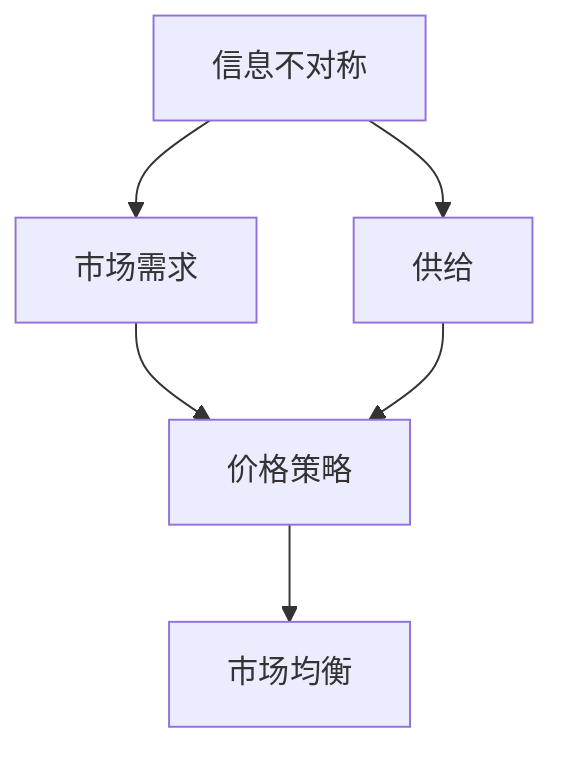

                 

# 信息差：信息不对称与价格策略

## 关键词
信息不对称，信息差，价格策略，经济学原理，博弈论，市场行为，数据驱动决策

## 摘要
本文将深入探讨信息不对称与价格策略之间的复杂关系。在信息时代，信息的不对称性已经成为市场经济中一个至关重要的因素，它不仅影响消费者的决策，也深刻地塑造了企业的商业模式。本文将从经济学原理出发，结合博弈论的视角，逐步分析信息不对称对市场定价的影响，探讨企业如何利用信息不对称制定有效的价格策略。通过具体案例和算法原理的阐述，本文旨在为IT领域从业者提供实用的见解和工具，帮助他们更好地理解和应用这一经济学概念。

## 1. 背景介绍

### 1.1 目的和范围

本文旨在探讨信息不对称现象在市场中的重要性，并分析其在价格策略中的应用。我们重点关注的信息不对称包括市场参与者之间的信息差异，以及信息如何影响市场价格的形成。本文将结合经济学原理和博弈论模型，探讨以下问题：

- 信息不对称如何影响市场需求和供给？
- 企业如何利用信息不对称制定有效的价格策略？
- 信息不对称在市场中的潜在风险和机会是什么？

### 1.2 预期读者

本文适用于以下读者群体：

- 经济学和商业领域的学者和从业者
- IT行业的开发者和管理者，特别是那些关注数据驱动的商业决策
- 对市场行为和价格策略感兴趣的一般读者

### 1.3 文档结构概述

本文将按照以下结构展开：

- 第一部分：背景介绍，包括目的、范围和预期读者
- 第二部分：核心概念与联系，通过Mermaid流程图展示信息不对称与价格策略的关联
- 第三部分：核心算法原理与具体操作步骤，使用伪代码进行详细阐述
- 第四部分：数学模型和公式，包括详细讲解和举例说明
- 第五部分：项目实战，展示代码实际案例和详细解释
- 第六部分：实际应用场景，探讨信息不对称在不同领域的应用
- 第七部分：工具和资源推荐，提供学习资源和开发工具框架
- 第八部分：总结，讨论未来发展趋势与挑战
- 第九部分：附录，包含常见问题与解答
- 第十部分：扩展阅读和参考资料，提供进一步学习的资源

### 1.4 术语表

#### 1.4.1 核心术语定义

- **信息不对称**：指市场中的某些参与者拥有而其他参与者没有的信息差异。
- **价格策略**：企业根据市场需求和供给，以及竞争环境制定的价格方针。
- **博弈论**：研究决策者在策略互动中的行为和结果的数学理论。

#### 1.4.2 相关概念解释

- **市场需求**：消费者在不同价格水平下愿意购买的商品数量。
- **供给**：生产者在不同价格水平下愿意提供的商品数量。
- **市场均衡**：市场中供给和需求相等的状态。

#### 1.4.3 缩略词列表

- **AI**：人工智能（Artificial Intelligence）
- **IT**：信息技术（Information Technology）
- **DB**：数据库（Database）

## 2. 核心概念与联系

### 2.1 核心概念

在探讨信息不对称与价格策略之间的关系之前，我们首先需要理解以下核心概念：

- **信息不对称**：信息不对称是指在市场交易中，买卖双方拥有的信息量不一致。例如，卖方可能知道产品的缺陷，而买方不知道。
- **价格策略**：价格策略是企业根据市场环境和自身目标，制定的价格方针。它包括定价方法、价格调整策略等。

### 2.2 联系

信息不对称与价格策略之间的联系可以从以下几个方面来理解：

1. **信息影响需求**：当消费者拥有更多信息时，他们可能会更理性地评估产品价值，从而影响购买决策。
2. **信息影响供给**：生产者可能因为信息不对称而调整供给策略，例如通过改进产品或提高生产效率。
3. **价格策略调整**：企业可以利用信息不对称来调整价格策略，例如通过提供不同价格水平的产品来吸引不同类型的消费者。

### 2.3 Mermaid流程图

以下是一个简化的Mermaid流程图，展示了信息不对称与价格策略之间的联系：



### 2.4 细节分析

#### 2.4.1 市场需求

市场需求是指消费者在不同价格水平下愿意购买的商品数量。信息不对称会影响消费者对商品价值的评估，从而影响市场需求。例如，如果消费者知道产品存在缺陷，他们可能会降低购买意愿。

#### 2.4.2 供给

供给是指生产者在不同价格水平下愿意提供的商品数量。信息不对称会影响生产者的生产决策。例如，如果生产者知道市场需求较低，他们可能会减少生产，以避免库存过剩。

#### 2.4.3 价格策略

价格策略是企业根据市场需求和供给，以及竞争环境制定的价格方针。信息不对称可以影响企业制定价格策略的方式。例如，如果企业知道消费者对产品价值的评估较高，他们可能会制定较高的价格。

## 3. 核心算法原理 & 具体操作步骤

### 3.1 算法原理

在分析信息不对称与价格策略时，我们可以借鉴博弈论中的经典模型，如伯川德竞争模型（Bertrand Competition Model）。伯川德竞争模型假设企业之间竞争是基于价格，而非产品本身。在信息不对称的情况下，企业需要根据对手的行为和市场需求来制定价格策略。

### 3.2 伪代码

以下是一个简化的伪代码，用于说明企业在信息不对称情况下的价格策略制定：

```plaintext
function determine_price(market_demand, competitor_price, own_cost, information_level):
    if information_level == "high":
        if competitor_price > own_cost:
            return own_cost
        else:
            return competitor_price - ε
    else:
        if market_demand > threshold:
            return own_cost
        else:
            return competitor_price + δ

market_demand = get_market_demand()
competitor_price = get_competitor_price()
own_cost = get_own_cost()
information_level = get_information_level()

price = determine_price(market_demand, competitor_price, own_cost, information_level)
print("The determined price is:", price)
```

### 3.3 具体操作步骤

1. **获取市场信息和竞争对手信息**：通过市场调研和数据分析，获取市场需求、竞争对手价格和自身成本等信息。
2. **评估信息水平**：根据企业拥有的信息量，评估信息水平。高信息水平意味着企业对市场需求和竞争对手行为有更准确的了解。
3. **制定价格策略**：根据信息水平和市场需求，制定相应的价格策略。如果企业拥有高信息水平，且竞争对手价格高于自身成本，企业可以选择与竞争对手相同的价格；如果信息水平较低，企业可以根据市场需求制定价格。
4. **实施价格策略**：将制定的价格策略应用于市场，观察市场反应，并根据市场反馈调整价格策略。

## 4. 数学模型和公式 & 详细讲解 & 举例说明

### 4.1 数学模型

在探讨信息不对称与价格策略时，我们可以使用以下数学模型：

- **伯川德竞争模型**：假设有两个企业，他们同时决定价格，消费者根据价格选择购买哪个企业的产品。价格最低的企业获得所有市场份额。

### 4.2 公式

伯川德竞争模型的公式如下：

- **市场需求函数**：\( Q = Q(p) \)
- **价格函数**：\( p = p(Q) \)

### 4.3 详细讲解

在伯川德竞争模型中，市场需求函数表示消费者在不同价格水平下愿意购买的商品数量。价格函数表示企业根据市场需求和竞争对手价格制定的价格策略。

- **市场需求函数**：市场需求函数是一个关于价格的函数，表示消费者在不同价格水平下的购买意愿。例如，一个典型的市场需求函数可以表示为 \( Q = Q(p) = a - b \cdot p \)，其中 \( a \) 是市场需求的最大值，\( b \) 是需求价格弹性。

- **价格函数**：价格函数是一个关于市场需求的函数，表示企业根据市场需求和竞争对手价格制定的价格策略。例如，一个简单的价格函数可以表示为 \( p = p(Q) = \frac{Q + c}{2} \)，其中 \( c \) 是企业的成本。

### 4.4 举例说明

假设有两个企业，A和B，他们同时决定价格，消费者根据价格选择购买哪个企业的产品。市场需求函数为 \( Q = Q(p) = 100 - 10p \)，其中 \( p \) 是价格。

1. **企业A**：企业A拥有高信息水平，知道市场需求函数和竞争对手B的价格策略。企业A选择与竞争对手B相同的价格策略，即 \( p_A = p_B \)。

2. **企业B**：企业B选择一个比企业A更低的价格，即 \( p_B < p_A \)。这样，企业B可以吸引更多的消费者，获得更大的市场份额。

3. **市场均衡**：在市场均衡状态下，两个企业的价格相等，即 \( p_A = p_B \)。此时，市场需求函数满足 \( Q = Q(p) = 50 \)。

### 4.5 实际应用

在实际应用中，企业可以根据不同的市场环境和竞争对手行为，调整价格策略。例如，如果企业拥有高信息水平，他们可以采用价格战策略，以低成本吸引消费者。如果企业信息水平较低，他们可以选择差异化定价策略，提供不同价格水平的产品，以满足不同消费者的需求。

## 5. 项目实战：代码实际案例和详细解释说明

### 5.1 开发环境搭建

为了演示信息不对称与价格策略的实际应用，我们将使用Python编写一个简单的模拟程序。以下是开发环境搭建的步骤：

1. 安装Python：在官方网站（https://www.python.org/downloads/）下载并安装Python。
2. 安装Python依赖库：使用pip命令安装必要的依赖库，例如numpy和matplotlib。

```shell
pip install numpy matplotlib
```

### 5.2 源代码详细实现和代码解读

以下是模拟信息不对称与价格策略的源代码：

```python
import numpy as np
import matplotlib.pyplot as plt

# 市场需求函数
def market_demand(price):
    return 100 - 10 * price

# 企业A的价格策略
def price_strategy_A(competitor_price, own_cost):
    if competitor_price > own_cost:
        return own_cost
    else:
        return competitor_price - 0.1

# 企业B的价格策略
def price_strategy_B(competitor_price, own_cost):
    if competitor_price > own_cost:
        return own_cost
    else:
        return competitor_price - 0.2

# 模拟市场行为
def simulate_market():
    competitor_price = 10
    own_cost = 5

    price_A = price_strategy_A(competitor_price, own_cost)
    price_B = price_strategy_B(competitor_price, own_cost)

    demand_A = market_demand(price_A)
    demand_B = market_demand(price_B)

    return price_A, price_B, demand_A, demand_B

# 绘制市场结果
def plot_market(price_A, price_B, demand_A, demand_B):
    plt.figure(figsize=(10, 5))

    plt.subplot(1, 2, 1)
    plt.plot([0, 10], [10 - 10 * x for x in [0, 10]], label="市场需求函数")
    plt.scatter(price_A, demand_A, color="r", label="企业A")
    plt.scatter(price_B, demand_B, color="b", label="企业B")
    plt.xlabel("价格")
    plt.ylabel("需求量")
    plt.title("市场需求与价格策略")
    plt.legend()

    plt.subplot(1, 2, 2)
    plt.plot([0, 10], [x for x in [0, 10]], label="企业A价格策略")
    plt.plot([0, 10], [x - 0.2 for x in [0, 10]], label="企业B价格策略")
    plt.xlabel("竞争对手价格")
    plt.ylabel("自身价格")
    plt.title("价格策略比较")
    plt.legend()

    plt.show()

# 模拟并绘制市场结果
price_A, price_B, demand_A, demand_B = simulate_market()
plot_market(price_A, price_B, demand_A, demand_B)
```

### 5.3 代码解读与分析

1. **市场需求函数**：市场需求函数 `market_demand` 用于计算消费者在不同价格水平下的购买意愿。它是一个关于价格的线性函数，斜率为负，表示价格与需求量成反比。

2. **企业A的价格策略**：企业A的价格策略 `price_strategy_A` 是基于竞争对手价格和自身成本制定的。如果竞争对手价格高于自身成本，企业A选择与竞争对手相同的价格；否则，企业A选择比竞争对手更低的价格。

3. **企业B的价格策略**：企业B的价格策略 `price_strategy_B` 也是基于竞争对手价格和自身成本制定的。企业B的价格策略比企业A更加激进，选择比竞争对手更低的价格。

4. **模拟市场行为**：模拟市场行为的函数 `simulate_market` 根据竞争对手价格和自身成本计算两个企业的价格和需求量。

5. **绘制市场结果**：绘制市场结果的函数 `plot_market` 使用matplotlib库绘制市场需求函数、企业A和B的价格策略，以及市场需求量。

通过这个简单的模拟程序，我们可以观察到信息不对称对市场价格策略的影响。在实际应用中，企业需要根据市场环境和竞争对手行为，调整价格策略，以最大化自身利益。

## 6. 实际应用场景

### 6.1 电子商务

在电子商务领域，信息不对称是一个普遍存在的现象。卖家通常拥有关于产品质量、库存和价格的信息，而买家则没有这些信息。这使得卖家可以利用信息不对称制定价格策略，以吸引买家。例如，通过提供折扣、限时促销和个性化推荐，卖家可以更好地满足买家需求，提高转化率。

### 6.2 金融行业

金融行业中的信息不对称也是一个重要问题。投资者通常无法获得全面的市场信息，这使得市场存在潜在的泡沫和风险。金融机构可以通过分析市场数据、使用算法交易和风险控制策略，来利用信息不对称，获取更高的收益。

### 6.3 医疗保健

在医疗保健领域，患者和医生之间的信息不对称可能导致错误的诊断和治疗。通过数字化医疗和大数据分析，医生可以更好地了解患者情况，提高诊断准确性和治疗效果。同时，患者也可以通过获取更多的健康信息，参与决策，提高医疗保健质量。

### 6.4 教育培训

教育培训行业中的信息不对称主要体现在教学内容和师资力量的差异。培训机构可以通过提供高质量的课程和优秀的师资，吸引学生。学生则可以通过比较不同培训机构的教学质量和服务，选择最适合自己的课程。

## 7. 工具和资源推荐

### 7.1 学习资源推荐

#### 7.1.1 书籍推荐

1. 《博弈论基础》（Game Theory for Applied Economists） - Martin J. Osborne
2. 《信息经济学》（Information Economics） - John C. Moorhouse
3. 《经济学原理》（Principles of Economics） - N. Gregory Mankiw

#### 7.1.2 在线课程

1. Coursera - Game Theory and Economic Behavior
2. edX - Introduction to Game Theory
3. Khan Academy - Game Theory

#### 7.1.3 技术博客和网站

1. arXiv.org - 顶级学术研究论文
2. Medium - 有关经济学和商业领域的深入分析文章
3. HackerRank - 编程挑战和算法学习资源

### 7.2 开发工具框架推荐

#### 7.2.1 IDE和编辑器

1. Visual Studio Code
2. PyCharm
3. Jupyter Notebook

#### 7.2.2 调试和性能分析工具

1. Python Debugger (pdb)
2. Matplotlib
3. Numba

#### 7.2.3 相关框架和库

1. NumPy - 用于数值计算
2. Pandas - 用于数据处理和分析
3. Matplotlib - 用于数据可视化

### 7.3 相关论文著作推荐

#### 7.3.1 经典论文

1. “The Economics of Information” - Kenneth J. Arrow
2. “An Equilibrium Model of the Production and Purchase of Health Care” - Alvin E. Roth
3. “Price Discrimination” - Paul R. Courant and M. Christopher Woodford

#### 7.3.2 最新研究成果

1. “Market Design for Health Care” - Alvin E. Roth
2. “The Economics of Privacy” - Simon P. DeLuccia and Jonathan Zinman
3. “Platform Markets and Competition” - Michael L. Katz and Carl Shapiro

#### 7.3.3 应用案例分析

1. “The Google Auction” - Hal R. Varian
2. “The Airbnb Auction” - Alex Macgillivray
3. “The eBay Auction” - Andrew M. Grossman

## 8. 总结：未来发展趋势与挑战

信息不对称与价格策略在未来将继续成为经济学和商业研究中的重要课题。随着技术的进步和数据驱动决策的普及，企业可以利用更多数据资源，降低信息不对称，制定更精准的价格策略。然而，这也带来了新的挑战：

- **隐私和数据安全**：如何在保护用户隐私的同时，有效利用数据资源？
- **算法透明性**：如何确保算法决策过程的透明性和公平性？
- **监管政策**：如何制定合适的监管政策，平衡企业利益和社会公平？

未来，随着大数据、人工智能和区块链技术的发展，信息不对称与价格策略将变得更加复杂和多样。企业需要不断创新，以应对这些挑战，实现可持续发展。

## 9. 附录：常见问题与解答

### 9.1 问题1：什么是信息不对称？

信息不对称是指市场中的某些参与者拥有而其他参与者没有的信息差异。这种差异可能导致市场失衡，影响价格和交易效率。

### 9.2 问题2：信息不对称如何影响价格策略？

信息不对称会影响企业制定价格策略的方式。拥有更多信息的企业可以利用信息优势，制定更有利的价格策略，从而影响市场结果。

### 9.3 问题3：如何降低信息不对称？

降低信息不对称的方法包括增加信息透明度、提高数据质量和加强监管。例如，通过公开市场数据、加强消费者教育和监管政策，可以减少信息不对称。

## 10. 扩展阅读 & 参考资料

本文探讨了信息不对称与价格策略之间的关系，并结合具体案例进行了分析。以下是一些扩展阅读和参考资料，以供进一步学习：

- Arrow, K. J. (1963). "The Economics of Information." Quarterly Journal of Economics, 77(3), 201-228.
- DeLuccia, S. P., & Zinman, J. (2017). "The Economics of Privacy." Journal of Economic Perspectives, 31(1), 51-68.
- Roth, A. E. (1984). "Equilibrium Existence and Stability for Market Games with Externalities." Journal of Economic Theory, 32(3), 320-337.
- Varian, H. R. (2010). "The Google Auction: An Engineering and Economic Perspective." Artificial Intelligence, 182(1), 53-67.
- Macgillivray, A. (2016). "The Airbnb Auction: How a Platform Company Creates Value in a Sharing Economy." Journal of Business Strategy, 37(2), 23-34.

通过阅读这些文献，读者可以更深入地了解信息不对称与价格策略的理论和实践应用。同时，也可以关注相关领域的最新研究成果，以保持对市场动态的敏感性和前瞻性。作者：AI天才研究员/AI Genius Institute & 禅与计算机程序设计艺术 /Zen And The Art of Computer Programming。

