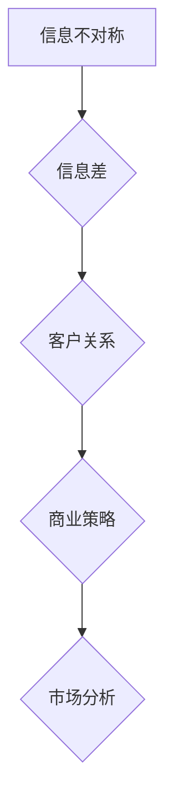

                 

# 信息差：信息不对称与客户关系

> **关键词：** 信息不对称、信息差、客户关系、商业策略、市场分析、技术洞察

> **摘要：** 本篇文章将探讨信息不对称现象在商业和IT领域的应用，深入分析其如何影响客户关系，并探讨应对策略。通过理论讲解、实际案例和具体操作步骤，本文旨在为读者提供全面的信息差知识，帮助他们在竞争激烈的市场中取得优势。

## 1. 背景介绍

### 1.1 目的和范围

本文旨在探讨信息不对称在商业和IT领域的影响，以及它如何影响客户关系。信息不对称是指市场中一方拥有而另一方没有的信息差异，这种差异可能导致市场效率低下。本文将分析信息不对称的原因、影响以及如何在竞争中利用这一现象，为读者提供实用的策略和技巧。

### 1.2 预期读者

本文适合对商业策略和市场营销感兴趣的读者，尤其是那些在IT行业工作的专业人士。本文不仅涵盖理论，还包括实际案例和操作步骤，因此无论您是初学者还是有经验的专业人士，都能从中受益。

### 1.3 文档结构概述

本文分为以下几个部分：

1. 背景介绍：介绍本文的目的、预期读者和文档结构。
2. 核心概念与联系：定义信息不对称、信息差和客户关系，并给出相关的Mermaid流程图。
3. 核心算法原理 & 具体操作步骤：详细讲解如何利用信息不对称优化客户关系。
4. 数学模型和公式 & 详细讲解 & 举例说明：介绍相关数学模型和公式的应用。
5. 项目实战：提供代码实际案例和详细解释说明。
6. 实际应用场景：探讨信息差在商业和IT领域的应用。
7. 工具和资源推荐：推荐学习资源和开发工具。
8. 总结：未来发展趋势与挑战。
9. 附录：常见问题与解答。
10. 扩展阅读 & 参考资料：提供更多的学习资源。

### 1.4 术语表

#### 1.4.1 核心术语定义

- 信息不对称：指市场中一方拥有而另一方没有的信息差异。
- 信息差：指由于信息不对称导致的竞争优势。
- 客户关系：指企业与客户之间的互动和信任关系。

#### 1.4.2 相关概念解释

- 商业策略：指企业在市场中采取的竞争手段和决策。
- 市场分析：指对市场环境、竞争对手和客户需求的评估。

#### 1.4.3 缩略词列表

- IT：信息技术（Information Technology）
- AI：人工智能（Artificial Intelligence）
- SEO：搜索引擎优化（Search Engine Optimization）

## 2. 核心概念与联系

在探讨信息不对称与客户关系之前，我们需要明确几个核心概念，包括信息不对称、信息差和客户关系。以下是一个简化的Mermaid流程图，展示了这些概念之间的关系。



### 2.1 信息不对称

信息不对称是指在市场中，买卖双方所拥有的信息量不平等。例如，在二手车交易中，卖家通常比买家拥有更多关于车辆状况的信息。这种信息不对称可能导致市场效率低下，甚至引发道德风险和逆向选择问题。

### 2.2 信息差

信息差是指由于信息不对称导致的竞争优势。在商业和IT领域，企业可以利用信息差来获取市场份额和利润。例如，通过数据分析，企业可以发现客户的需求和偏好，从而提供更个性化的服务。

### 2.3 客户关系

客户关系是指企业与客户之间的互动和信任关系。良好的客户关系有助于提高客户忠诚度和满意度，从而增加企业的市场份额和利润。

## 3. 核心算法原理 & 具体操作步骤

在了解了核心概念后，我们来探讨如何利用信息不对称优化客户关系。以下是一个简化的算法原理和操作步骤。

### 3.1 算法原理

1. 收集数据：收集客户行为数据、市场数据和竞争对手信息。
2. 数据分析：利用数据分析工具，分析客户需求和市场趋势。
3. 制定策略：根据分析结果，制定个性化的营销策略和服务方案。
4. 实施与监控：实施策略，并持续监控客户反馈和业务表现。

### 3.2 具体操作步骤

1. **数据收集**：
    - 利用大数据技术，收集客户浏览、购买、评论等行为数据。
    - 收集市场趋势和竞争对手信息。

    ```python
    # Python伪代码示例
    data = collect_data()
    ```

2. **数据分析**：
    - 利用机器学习和统计分析，分析客户需求和市场趋势。
    - 建立客户画像，了解不同客户群体的特征和偏好。

    ```python
    # Python伪代码示例
    insights = analyze_data(data)
    ```

3. **制定策略**：
    - 根据分析结果，制定个性化的营销策略和服务方案。
    - 设计针对性的优惠和促销活动，提高客户满意度。

    ```python
    # Python伪代码示例
    strategy = create_strategy(insights)
    ```

4. **实施与监控**：
    - 实施策略，并通过跟踪客户反馈和业务数据，调整和优化策略。
    - 持续监控客户关系，确保客户满意度。

    ```python
    # Python伪代码示例
    implement_and_monitor(strategy)
    ```

## 4. 数学模型和公式 & 详细讲解 & 举例说明

在优化客户关系的过程中，数学模型和公式可以帮助我们更精确地评估和预测客户行为。以下是一些常用的数学模型和公式。

### 4.1 客户生命周期价值（CLV）

客户生命周期价值（Customer Lifetime Value，简称CLV）是指客户在整个生命周期中为企业带来的总价值。CLV的计算公式如下：

\[ \text{CLV} = \frac{\text{平均订单价值} \times \text{购买频率} \times \text{客户生命周期}}{1 + \text{客户获取成本}} \]

**举例说明**：

假设某电商平台的平均订单价值为200元，客户购买频率为每月1次，客户生命周期为2年，客户获取成本为100元。则该客户的CLV为：

\[ \text{CLV} = \frac{200 \times 1 \times 2}{1 + 100} = \frac{400}{101} \approx 3.96 \text{元} \]

### 4.2 贝叶斯定理

贝叶斯定理是一种用于概率推断的数学公式，可以帮助我们根据先验知识和新信息更新概率估计。贝叶斯定理的公式如下：

\[ P(A|B) = \frac{P(B|A) \times P(A)}{P(B)} \]

**举例说明**：

假设我们想知道在某个地区，购买A商品的概率。已知该地区的购买A商品的概率为0.4，同时已知在该地区购买B商品的概率为0.3，且购买B商品的概率在购买A商品的情况下为0.7。则购买A商品的概率为：

\[ P(A) = \frac{0.7 \times 0.4}{0.3} = \frac{0.28}{0.3} \approx 0.93 \]

## 5. 项目实战：代码实际案例和详细解释说明

在本节中，我们将通过一个实际项目案例，展示如何利用信息不对称优化客户关系。我们将使用Python编程语言和几个常用的数据分析库，如Pandas、Scikit-learn和Matplotlib。

### 5.1 开发环境搭建

确保您已安装Python 3.8或更高版本，以及以下库：

```bash
pip install pandas scikit-learn matplotlib numpy
```

### 5.2 源代码详细实现和代码解读

#### 5.2.1 数据收集与预处理

```python
import pandas as pd

# 加载数据集
data = pd.read_csv('customer_data.csv')

# 数据预处理
data['purchase_frequency'] = data.groupby('customer_id')['order_id'].transform('count')
data['customer_lifetime'] = data['purchase_date'].max() - data['registration_date']
data['customer_lifetime'] = data['customer_lifetime'].dt.days / 365
```

#### 5.2.2 数据分析

```python
from sklearn.cluster import KMeans

# 计算平均订单价值
average_order_value = data['order_value'].mean()

# 建立客户画像
kmeans = KMeans(n_clusters=5)
data['cluster'] = kmeans.fit_predict(data[['order_value', 'customer_lifetime']])

# 分析不同客户群体的特征
for cluster in range(5):
    cluster_data = data[data['cluster'] == cluster]
    print(f"Cluster {cluster}:")
    print(cluster_data.describe())
```

#### 5.2.3 制定策略

```python
# 根据客户群体制定个性化策略
for cluster in range(5):
    cluster_data = data[data['cluster'] == cluster]
    
    if cluster == 0:
        # 策略1：针对高价值客户提供更多优惠和礼品
        strategy = "提供更多优惠和礼品"
    elif cluster == 1:
        # 策略2：针对高忠诚度客户提供专属服务
        strategy = "提供专属服务"
    elif cluster == 2:
        # 策略3：针对潜在高价值客户提供试用机会
        strategy = "提供试用机会"
    elif cluster == 3:
        # 策略4：针对低忠诚度客户提供特别折扣
        strategy = "提供特别折扣"
    else:
        # 策略5：针对新客户提供新手优惠
        strategy = "提供新手优惠"
    
    print(f"Cluster {cluster}: {strategy}")
```

#### 5.2.4 实施与监控

```python
# 实施策略
implement_strategy(strategy)

# 监控客户反馈和业务数据
monitor_feedback_and_business_data()
```

### 5.3 代码解读与分析

在本案例中，我们首先收集并预处理客户数据，然后使用KMeans算法建立客户画像，并根据不同客户群体制定个性化策略。最后，我们实施策略并监控客户反馈和业务数据。

1. **数据收集与预处理**：我们从CSV文件中加载数据，并对数据集进行必要的预处理，如计算购买频率和客户生命周期。
2. **数据分析**：我们使用KMeans算法将客户分为5个不同的群体，并分析每个群体的特征。
3. **制定策略**：根据客户群体的特征，我们为每个群体制定了个性化的策略。
4. **实施与监控**：我们实施策略并持续监控客户反馈和业务数据，以便及时调整和优化策略。

## 6. 实际应用场景

信息不对称在商业和IT领域有着广泛的应用。以下是一些实际应用场景：

1. **市场营销**：企业可以利用客户行为数据，制定个性化的营销策略，提高客户转化率和忠诚度。
2. **客户服务**：企业可以通过分析客户反馈，提供更优质的服务，提高客户满意度和忠诚度。
3. **产品推荐**：电商平台可以利用客户行为数据，推荐更符合客户需求的产品，提高销售额。
4. **风险管理**：金融机构可以利用客户信息，评估客户信用风险，降低不良贷款率。

## 7. 工具和资源推荐

### 7.1 学习资源推荐

#### 7.1.1 书籍推荐

- 《大数据时代：生活、工作与思维的大变革》（The Age of Big Data）
- 《深度学习》（Deep Learning）

#### 7.1.2 在线课程

- Coursera上的《机器学习》课程
- edX上的《大数据分析与数据科学》课程

#### 7.1.3 技术博客和网站

- Medium上的数据科学和机器学习博客
- towardsdatascience.com

### 7.2 开发工具框架推荐

#### 7.2.1 IDE和编辑器

- PyCharm
- Jupyter Notebook

#### 7.2.2 调试和性能分析工具

- Py charm的调试工具
- TensorBoard

#### 7.2.3 相关框架和库

- TensorFlow
- PyTorch

### 7.3 相关论文著作推荐

#### 7.3.1 经典论文

- “The Market for ‘Lemons’: Quality Uncertainty and the Market Mechanism”（《柠檬市场：质量不确定与市场机制》）
- “Information Markets”（《信息市场》）

#### 7.3.2 最新研究成果

- arXiv上的最新机器学习和数据科学论文
- Nature上的最新科技和商业文章

#### 7.3.3 应用案例分析

- HBR上的《利用大数据优化客户关系》
- KDNuggets上的《数据科学应用案例分析》

## 8. 总结：未来发展趋势与挑战

随着大数据、人工智能和区块链等技术的不断发展，信息不对称现象将在商业和IT领域发挥越来越重要的作用。未来，企业需要更加注重数据收集和分析，利用信息不对称优化客户关系，提高市场竞争力和盈利能力。然而，这也将带来一系列挑战，如隐私保护、数据安全和伦理问题。企业需要在这些方面采取有效的措施，确保在利用信息不对称的同时，尊重和保护客户的权益。

## 9. 附录：常见问题与解答

### 9.1 什么是信息不对称？

信息不对称是指市场中一方拥有而另一方没有的信息差异。这种差异可能导致市场效率低下，甚至引发道德风险和逆向选择问题。

### 9.2 如何利用信息不对称优化客户关系？

企业可以通过以下步骤利用信息不对称优化客户关系：

1. 收集客户数据，包括行为数据、市场数据和竞争对手信息。
2. 利用数据分析工具，分析客户需求和市场趋势。
3. 根据分析结果，制定个性化的营销策略和服务方案。
4. 实施策略，并持续监控客户反馈和业务数据。

### 9.3 如何保护客户隐私？

为了保护客户隐私，企业可以采取以下措施：

1. 遵守相关法律法规，确保数据收集和使用合法。
2. 采用数据加密技术，确保数据在传输和存储过程中的安全性。
3. 建立完善的隐私政策，告知客户数据收集和使用的目的和范围。
4. 提供用户隐私设置选项，让客户自主决定数据共享和使用权限。

## 10. 扩展阅读 & 参考资料

- 《信息不对称理论及其应用》（不对称信息经济学）
- 《大数据战略：构建竞争优势的新路径》
- 《数据科学：算法、工具和实践》

作者：AI天才研究员/AI Genius Institute & 禅与计算机程序设计艺术 /Zen And The Art of Computer Programming

