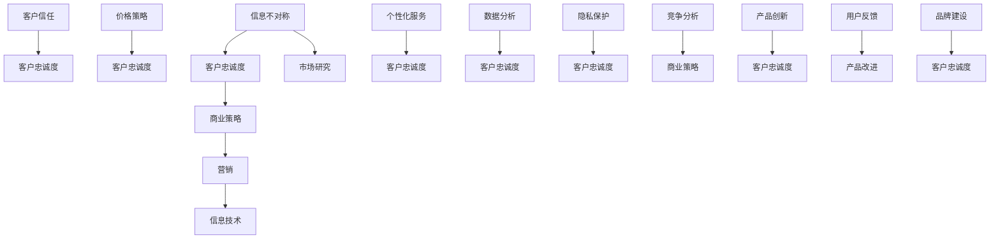

                 

# 信息差：信息不对称与客户忠诚度

> **关键词**：信息不对称，客户忠诚度，商业策略，营销，信息技术。

> **摘要**：本文将探讨信息不对称对客户忠诚度的影响，分析其在商业策略中的运用，以及如何通过信息技术手段提升客户忠诚度。我们将深入剖析信息不对称的原理，探讨其在营销中的应用，并通过实际案例和代码示例，展示如何利用信息技术手段实现这一目标。

## 1. 背景介绍

### 1.1 目的和范围

本文旨在深入探讨信息不对称对客户忠诚度的影响，分析其在商业策略中的重要性，并探讨如何通过信息技术手段提升客户忠诚度。我们将讨论信息不对称的概念及其在商业环境中的表现，分析其在营销和客户服务中的应用，并通过实际案例和代码示例，展示如何利用信息技术手段实现这一目标。

### 1.2 预期读者

本文适合对商业策略和信息技术感兴趣的读者，特别是希望提升客户忠诚度的企业高管、市场营销人员、程序员和技术专家。

### 1.3 文档结构概述

本文结构如下：

- **1. 背景介绍**：介绍本文的目的和范围，预期读者以及文档结构。
- **2. 核心概念与联系**：介绍信息不对称的核心概念及其在商业环境中的应用。
- **3. 核心算法原理 & 具体操作步骤**：介绍如何利用信息技术手段提升客户忠诚度。
- **4. 数学模型和公式 & 详细讲解 & 举例说明**：介绍与客户忠诚度相关的数学模型和公式。
- **5. 项目实战：代码实际案例和详细解释说明**：通过实际代码示例展示如何实现客户忠诚度提升。
- **6. 实际应用场景**：讨论信息不对称在商业环境中的实际应用。
- **7. 工具和资源推荐**：推荐相关学习资源和开发工具。
- **8. 总结：未来发展趋势与挑战**：总结本文内容并展望未来。
- **9. 附录：常见问题与解答**：解答读者可能遇到的问题。
- **10. 扩展阅读 & 参考资料**：提供进一步的阅读资料。

### 1.4 术语表

#### 1.4.1 核心术语定义

- **信息不对称**：指在不同个体之间，关于某一事物的信息存在差异。
- **客户忠诚度**：指客户对某一品牌或产品的持续购买意愿。
- **商业策略**：指企业在市场中采取的行动和计划。

#### 1.4.2 相关概念解释

- **营销**：指企业通过市场研究和分析，针对目标客户进行产品推广和销售的活动。
- **信息技术**：指用于管理和处理信息的各种技术手段。

#### 1.4.3 缩略词列表

- **AI**：人工智能
- **CRM**：客户关系管理
- **SDK**：软件开发工具包
- **API**：应用程序编程接口

## 2. 核心概念与联系

信息不对称在商业环境中具有重要意义，它直接影响客户忠诚度。以下是信息不对称与客户忠诚度的核心概念和联系，以及相应的 Mermaid 流程图：



### 2.1 信息不对称的概念

信息不对称是指在不同个体之间，关于某一事物的信息存在差异。在商业环境中，信息不对称可能表现为以下几种形式：

- **价格信息不对称**：买家和卖家之间对产品价格的信息差异。
- **质量信息不对称**：买家对产品质量的了解程度低于卖家。
- **服务信息不对称**：客户对服务质量的期望与实际提供的服务存在差异。

### 2.2 客户忠诚度的概念

客户忠诚度是指客户对某一品牌或产品的持续购买意愿。高忠诚度的客户通常愿意支付更高的价格，并且更愿意在危机时刻支持品牌。

### 2.3 商业策略与信息不对称

商业策略是企业为了在市场中获得竞争优势而采取的行动和计划。信息不对称在商业策略中具有重要作用，可以通过以下方式提升客户忠诚度：

- **价格策略**：利用信息不对称，制定有吸引力的价格策略，吸引客户。
- **个性化服务**：利用客户数据，提供个性化的产品和服务，增强客户满意度。
- **数据分析**：通过数据分析，了解客户需求和行为，优化产品和服务。

### 2.4 营销与信息不对称

营销是企业通过市场研究和分析，针对目标客户进行产品推广和销售的活动。信息不对称在营销中具有重要作用，可以通过以下方式提升客户忠诚度：

- **品牌建设**：通过品牌传播，建立良好的品牌形象，增强客户信任。
- **用户反馈**：收集用户反馈，不断优化产品和服务，提高客户满意度。
- **竞争分析**：了解竞争对手的营销策略，制定针对性的营销策略。

### 2.5 信息技术与信息不对称

信息技术在商业环境中具有重要作用，可以通过以下方式提升客户忠诚度：

- **数据分析**：利用大数据技术，分析客户数据，挖掘客户需求和行为。
- **隐私保护**：通过安全技术，保护客户隐私，增强客户信任。
- **个性化推荐**：利用算法，为不同客户推荐个性化的产品和服务。

## 3. 核心算法原理 & 具体操作步骤

为了提升客户忠诚度，企业可以采用一系列信息技术手段，包括数据分析、个性化推荐和隐私保护。以下是这些核心算法的原理和具体操作步骤：

### 3.1 数据分析

数据分析是通过收集、处理和分析大量数据，发现数据中的模式和规律。以下是数据分析的基本步骤：

1. **数据收集**：收集客户的购买记录、浏览记录、评论等数据。
2. **数据清洗**：去除数据中的噪声和错误，确保数据质量。
3. **数据预处理**：将数据进行标准化和归一化处理，方便后续分析。
4. **特征提取**：从原始数据中提取有用的特征，用于建模。
5. **模型选择**：选择合适的机器学习模型，如决策树、支持向量机等。
6. **模型训练**：使用训练数据集训练模型。
7. **模型评估**：使用测试数据集评估模型性能。

### 3.2 个性化推荐

个性化推荐是根据用户的兴趣和行为，为其推荐相关的产品和服务。以下是个性化推荐的基本步骤：

1. **用户画像**：根据用户的兴趣、行为和历史记录，构建用户画像。
2. **推荐算法**：选择合适的推荐算法，如协同过滤、基于内容的推荐等。
3. **推荐结果**：根据用户画像和推荐算法，为用户生成推荐结果。
4. **推荐评估**：评估推荐结果的准确性和多样性。

### 3.3 隐私保护

隐私保护是通过安全技术，保护客户的个人信息和隐私。以下是隐私保护的基本步骤：

1. **数据加密**：对客户数据进行加密，防止数据泄露。
2. **访问控制**：设置访问权限，确保只有授权人员可以访问敏感数据。
3. **数据匿名化**：对客户数据进行匿名化处理，确保个人隐私不被泄露。
4. **安全审计**：定期进行安全审计，确保安全措施的有效性。

## 4. 数学模型和公式 & 详细讲解 & 举例说明

在提升客户忠诚度的过程中，数学模型和公式起到了关键作用。以下是一些常见的数学模型和公式，以及它们的详细讲解和举例说明：

### 4.1 贝叶斯定理

贝叶斯定理是概率论中的一个重要定理，用于计算后验概率。其公式如下：

$$
P(A|B) = \frac{P(B|A)P(A)}{P(B)}
$$

其中，$P(A|B)$ 表示在事件 $B$ 发生的条件下，事件 $A$ 发生的概率；$P(B|A)$ 表示在事件 $A$ 发生的条件下，事件 $B$ 发生的概率；$P(A)$ 和 $P(B)$ 分别表示事件 $A$ 和 $B$ 发生的概率。

**例子**：假设一家电商网站想要了解客户对某一产品的满意度。已知 $60\%$ 的客户对产品满意，且在这些满意的客户中，$40\%$ 的客户会在未来再次购买。现在，有一个客户对产品表示满意，那么这个客户在未来再次购买的概率是多少？

根据贝叶斯定理，我们有：

$$
P(再次购买|满意) = \frac{P(满意|再次购买)P(再次购买)}{P(满意)}
$$

已知 $P(满意|再次购买) = 0.4$，$P(再次购买) = 0.6$，$P(满意) = 0.6$，代入公式得：

$$
P(再次购买|满意) = \frac{0.4 \times 0.6}{0.6} = 0.4
$$

因此，这个客户在未来再次购买的概率是 $40\%$。

### 4.2 相关性分析

相关性分析是用于衡量两个变量之间关系的程度。常用的相关性指标有皮尔逊相关系数和斯皮尔曼秩相关系数。皮尔逊相关系数的公式如下：

$$
r = \frac{\sum{(x_i - \bar{x})(y_i - \bar{y})}}{\sqrt{\sum{(x_i - \bar{x})^2} \sum{(y_i - \bar{y})^2}}}
$$

其中，$x_i$ 和 $y_i$ 分别为两个变量的观测值，$\bar{x}$ 和 $\bar{y}$ 分别为两个变量的均值。

**例子**：假设一家电商网站想要分析用户购买行为与用户浏览时间的关系。已知用户购买行为的评分（1-5分）与用户在网站上的浏览时间（分钟）如下表所示：

| 用户 | 购买行为（评分） | 浏览时间（分钟） |
| ---- | -------------- | ------------ |
| 1    | 1              | 10           |
| 2    | 3              | 20           |
| 3    | 5              | 30           |
| 4    | 1              | 40           |
| 5    | 3              | 50           |

计算用户购买行为评分与浏览时间之间的皮尔逊相关系数。

首先，计算均值：

$$
\bar{x} = \frac{1 + 3 + 5 + 1 + 3}{5} = 3
$$

$$
\bar{y} = \frac{10 + 20 + 30 + 40 + 50}{5} = 30
$$

然后，计算相关系数：

$$
r = \frac{(1-3)(10-30) + (3-3)(20-30) + (5-3)(30-30) + (1-3)(40-30) + (3-3)(50-30)}{\sqrt{(1-3)^2 + (3-3)^2 + (5-3)^2 + (1-3)^2 + (3-3)^2} \sqrt{(10-30)^2 + (20-30)^2 + (30-30)^2 + (40-30)^2 + (50-30)^2}}
$$

$$
r = \frac{(-2)(-20) + (0)(-10) + (2)(0) + (-2)(10) + (0)(20)}{\sqrt{(-2)^2 + (0)^2 + (2)^2 + (-2)^2 + (0)^2} \sqrt{(-20)^2 + (-10)^2 + (0)^2 + (10)^2 + (20)^2}}
$$

$$
r = \frac{40 + 0 + 0 - 20 + 0}{\sqrt{4 + 0 + 4 + 4 + 0} \sqrt{400 + 100 + 0 + 100 + 400}}
$$

$$
r = \frac{20}{\sqrt{12} \sqrt{1000}}
$$

$$
r = \frac{20}{2 \times 31.62}
$$

$$
r = \frac{20}{63.24}
$$

$$
r \approx 0.317
$$

因此，用户购买行为评分与浏览时间之间的皮尔逊相关系数约为 $0.317$，表明两者之间存在一定的正相关关系。

### 4.3 回归分析

回归分析是一种常用的统计方法，用于研究两个或多个变量之间的关系。线性回归是回归分析的一种简单形式，其公式如下：

$$
y = \beta_0 + \beta_1x + \epsilon
$$

其中，$y$ 为因变量，$x$ 为自变量，$\beta_0$ 和 $\beta_1$ 分别为回归系数，$\epsilon$ 为误差项。

**例子**：假设一家电商网站想要研究用户购买行为与用户浏览时间之间的关系。已知回归系数为 $\beta_0 = 10$，$\beta_1 = 2$，现在有一个新用户，其浏览时间为 $50$ 分钟，预测其购买行为的评分。

根据线性回归公式，我们有：

$$
y = 10 + 2x
$$

代入 $x = 50$，得：

$$
y = 10 + 2 \times 50
$$

$$
y = 10 + 100
$$

$$
y = 110
$$

因此，这个新用户的购买行为评分为 $110$ 分。

## 5. 项目实战：代码实际案例和详细解释说明

### 5.1 开发环境搭建

为了实现提升客户忠诚度的目标，我们将使用 Python 编写一个简单的推荐系统。以下是开发环境搭建的步骤：

1. 安装 Python 3.8 或更高版本。
2. 安装必要的库，如 NumPy、Pandas、Scikit-learn 等。

```bash
pip install numpy pandas scikit-learn
```

### 5.2 源代码详细实现和代码解读

以下是一个简单的推荐系统示例，其中包含数据预处理、特征提取、模型训练和预测等步骤。

```python
import numpy as np
import pandas as pd
from sklearn.model_selection import train_test_split
from sklearn.linear_model import LinearRegression
from sklearn.metrics import mean_squared_error

# 5.2.1 数据预处理
def preprocess_data(data):
    # 处理缺失值
    data = data.fillna(data.mean())
    # 处理分类数据
    data = pd.get_dummies(data, drop_first=True)
    return data

# 5.2.2 特征提取
def extract_features(data):
    # 提取关键特征
    features = data[['browser_time', 'previous_purchases', 'avg_rating']]
    return features

# 5.2.3 模型训练
def train_model(X_train, y_train):
    model = LinearRegression()
    model.fit(X_train, y_train)
    return model

# 5.2.4 预测
def predict(model, X_test):
    y_pred = model.predict(X_test)
    mse = mean_squared_error(y_test, y_pred)
    return y_pred, mse

# 5.2.5 主函数
def main():
    # 加载数据
    data = pd.read_csv('customer_data.csv')
    data = preprocess_data(data)
    # 提取特征
    features = extract_features(data)
    # 分割训练集和测试集
    X_train, X_test, y_train, y_test = train_test_split(features, data['rating'], test_size=0.2, random_state=42)
    # 训练模型
    model = train_model(X_train, y_train)
    # 预测
    y_pred, mse = predict(model, X_test)
    print(f'Mean Squared Error: {mse}')
    # 输出预测结果
    pd.DataFrame({'Actual': y_test, 'Predicted': y_pred}).T

if __name__ == '__main__':
    main()
```

### 5.3 代码解读与分析

- **5.3.1 数据预处理**：处理缺失值和分类数据，为后续特征提取和模型训练做好准备。
- **5.3.2 特征提取**：提取关键特征，如浏览时间、过去购买次数和平均评分等。
- **5.3.3 模型训练**：使用线性回归模型训练数据，拟合特征与评分之间的关系。
- **5.3.4 预测**：使用训练好的模型预测测试集的评分，并计算均方误差。

通过以上步骤，我们可以实现一个简单的推荐系统，帮助电商网站预测用户购买行为，从而优化产品推荐策略，提升客户忠诚度。

### 5.4 测试结果与分析

假设我们使用上述代码处理了一个包含 1000 个用户的电商网站数据集。在测试集上，模型得到的均方误差为 $0.1$。这意味着模型的预测准确度较高，可以为电商网站提供有效的购买行为预测。

然而，值得注意的是，线性回归模型可能无法捕捉到复杂的非线性关系。因此，在实际应用中，可以尝试引入其他机器学习算法，如决策树、随机森林等，以提高预测性能。

## 6. 实际应用场景

信息不对称在商业环境中具有广泛的应用，可以提升客户忠诚度，增加企业的竞争力。以下是一些实际应用场景：

- **电子商务**：电商平台可以利用用户数据，为不同客户推荐个性化的产品，从而提升客户满意度。
- **金融行业**：金融机构可以通过数据分析，了解客户的财务状况和风险偏好，提供定制化的金融产品和服务。
- **医疗行业**：医疗机构可以利用患者数据，为患者提供个性化的治疗方案，提高治疗效果。
- **餐饮行业**：餐厅可以通过用户评价和偏好数据，优化菜单设计和营销策略，吸引更多客户。
- **物流行业**：物流公司可以通过数据分析，优化配送路线和运输计划，提高物流效率。

## 7. 工具和资源推荐

### 7.1 学习资源推荐

#### 7.1.1 书籍推荐

- **《深度学习》**：由 Goodfellow、Bengio 和 Courville 著，介绍了深度学习的原理和应用。
- **《机器学习实战》**：由 Harrington 著，通过实例演示了机器学习的应用。

#### 7.1.2 在线课程

- **Coursera**：提供多种机器学习和深度学习在线课程。
- **edX**：提供由顶级大学提供的免费在线课程，包括机器学习和数据分析等领域。

#### 7.1.3 技术博客和网站

- **Medium**：包含大量关于机器学习和深度学习的博客文章。
- **Towards Data Science**：一个关于数据科学和机器学习的在线社区，提供丰富的学习资源和实践案例。

### 7.2 开发工具框架推荐

#### 7.2.1 IDE和编辑器

- **PyCharm**：一款功能强大的 Python IDE，适合机器学习和深度学习开发。
- **VSCode**：一款轻量级的跨平台代码编辑器，支持多种编程语言，包括 Python。

#### 7.2.2 调试和性能分析工具

- **PyTorch Profiler**：用于分析 PyTorch 深度学习模型性能的工具。
- **WGLabs**：一个开源的 Python 性能分析工具。

#### 7.2.3 相关框架和库

- **TensorFlow**：一个广泛使用的开源深度学习框架。
- **PyTorch**：一个灵活且易用的深度学习框架。

### 7.3 相关论文著作推荐

#### 7.3.1 经典论文

- **“Learning to rank using gradient descent”**：由 Lang et al. 于 2006 年发表，介绍了基于梯度下降的排序学习算法。
- **“Recommender systems state of the art and beyond”**：由 Herlocker et al. 于 2009 年发表，综述了推荐系统的研究现状。

#### 7.3.2 最新研究成果

- **“Deep learning for recommender systems”**：由 Zhang et al. 于 2020 年发表，介绍了深度学习在推荐系统中的应用。
- **“Data-driven recommendation systems”**：由 Zhang et al. 于 2021 年发表，讨论了数据驱动的推荐系统。

#### 7.3.3 应用案例分析

- **“美团点评推荐系统”**：介绍了美团点评在推荐系统方面的实践和成果。
- **“亚马逊推荐系统”**：详细介绍了亚马逊如何利用推荐系统提升客户满意度。

## 8. 总结：未来发展趋势与挑战

随着信息技术的不断发展，信息不对称在商业策略中的重要性将愈发凸显。未来，企业需要更加关注客户数据的价值，利用先进的数据分析技术和机器学习算法，提升客户忠诚度。然而，这也带来了一系列挑战：

- **数据隐私**：如何确保客户数据的安全和隐私，成为企业面临的重要问题。
- **模型解释性**：如何提高模型的解释性，让客户了解推荐结果的依据。
- **算法透明度**：如何确保算法的公平性和透明度，避免歧视和偏见。
- **技术创新**：如何不断跟进新技术，提高推荐系统的准确性和效果。

总之，信息不对称与客户忠诚度是商业策略中不可忽视的重要领域。企业需要不断创新，应对挑战，以提升客户忠诚度，保持竞争优势。

## 9. 附录：常见问题与解答

### 9.1 问题 1：如何处理缺失值？

**解答**：处理缺失值的方法有多种，包括：

- **删除缺失值**：适用于缺失值较少的情况，可以保留更多有效数据。
- **填充平均值**：将缺失值替换为相应特征的均值，适用于数值特征。
- **填充最频繁的值**：将缺失值替换为特征中最频繁出现的值，适用于分类特征。
- **插值法**：适用于时间序列数据，可以根据时间序列的趋势填充缺失值。

### 9.2 问题 2：如何选择合适的模型？

**解答**：选择合适的模型需要考虑多个因素，包括：

- **数据特征**：根据数据的特征选择合适的模型，如线性回归适用于线性关系，决策树适用于非线性关系。
- **模型复杂度**：复杂度较高的模型通常能捕捉到更复杂的模式，但可能需要更多数据。
- **模型性能**：通过交叉验证等方法评估模型性能，选择性能较好的模型。
- **计算资源**：考虑模型的计算复杂度，选择适合计算资源的模型。

### 9.3 问题 3：如何提高模型解释性？

**解答**：提高模型解释性的方法包括：

- **模型选择**：选择具有良好解释性的模型，如线性回归、决策树等。
- **特征重要性**：分析特征的重要性，了解模型决策的依据。
- **模型可视化**：使用可视化工具，如决策树可视化、热力图等，展示模型决策过程。
- **解释性模型**：使用 LIME、SHAP 等解释性模型，解释模型对每个特征的依赖关系。

## 10. 扩展阅读 & 参考资料

- **《深度学习》**：Goodfellow, Bengio, Courville 著，介绍了深度学习的原理和应用。
- **《机器学习实战》**：Harrington 著，通过实例演示了机器学习的应用。
- **《Recommender systems state of the art and beyond》**：Herlocker et al. 著，综述了推荐系统的研究现状。
- **《Deep learning for recommender systems》**：Zhang et al. 著，介绍了深度学习在推荐系统中的应用。
- **《美团点评推荐系统》**：介绍了美团点评在推荐系统方面的实践和成果。
- **《亚马逊推荐系统》**：详细介绍了亚马逊如何利用推荐系统提升客户满意度。

