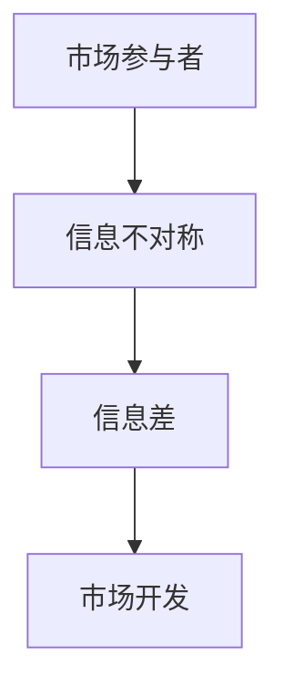

                 

# 信息差：信息不对称与市场开发

## 关键词
- 信息不对称
- 信息差
- 市场开发
- 竞争优势
- 数据分析
- 技术创新

## 摘要
本文旨在深入探讨信息差这一概念，即信息不对称现象在市场中的影响与利用。在信息化时代，信息不对称已成为市场参与者之间竞争的关键因素。本文将首先介绍信息不对称的定义及其在不同市场环境中的表现，然后分析信息差的产生原因、对市场的影响，以及市场开发中的策略应用。通过具体案例和技术工具的介绍，本文将展示如何利用信息差实现市场突破，并总结未来发展趋势与挑战。

## 1. 背景介绍

### 1.1 目的和范围
本文的目的是帮助读者理解信息不对称在市场中的作用，并探索如何利用信息差来开发市场。我们将讨论信息不对称的基本概念，分析其在不同市场环境中的表现，以及探讨利用信息差的市场策略。文章还将介绍相关技术和工具，以帮助读者在实践中应用这些理论。

### 1.2 预期读者
本文适合对市场营销、数据分析、信息经济学感兴趣的专业人士、学生和研究人员阅读。同时，对于任何希望了解如何利用信息不对称来获得竞争优势的企业家和管理人员，本文也将提供有益的见解。

### 1.3 文档结构概述
本文分为十个部分：背景介绍、核心概念与联系、核心算法原理与操作步骤、数学模型和公式、项目实战、实际应用场景、工具和资源推荐、总结、附录以及扩展阅读和参考资料。通过这些内容，读者将全面了解信息不对称的各个方面，并能够将其应用于市场开发中。

### 1.4 术语表
#### 1.4.1 核心术语定义
- **信息不对称**：一方拥有而另一方没有或无法获得的信息差异。
- **信息差**：因信息不对称而产生的价值差异。
- **市场开发**：拓展市场，增加市场份额的过程。

#### 1.4.2 相关概念解释
- **市场参与者**：市场中进行交易或互动的个体或组织。
- **竞争优势**：企业在市场竞争中相对于竞争对手的优势。

#### 1.4.3 缩略词列表
- **AI**：人工智能
- **IDE**：集成开发环境
- **DB**：数据库
- **ML**：机器学习

## 2. 核心概念与联系

在探讨信息差之前，我们需要明确一些核心概念及其相互关系。

### 2.1 信息不对称
信息不对称是指在市场交易中，买卖双方拥有不同的信息，从而导致决策偏差。例如，卖家可能知道产品的缺陷，而买家则不知道。这种情况在金融、保险、医疗等多个领域都存在。

### 2.2 信息差
信息差是由信息不对称引起的，它反映了市场参与者之间的价值差异。利用信息差，市场参与者可以创造竞争优势，提高市场占有率。

### 2.3 市场开发
市场开发是指企业通过拓展产品线、开拓新市场、提高品牌知名度等方式来增加市场份额。信息差在市场开发中扮演了重要角色，可以帮助企业发现新的市场机会。

#### Mermaid 流程图：



## 3. 核心算法原理 & 具体操作步骤

### 3.1 算法原理

为了更好地理解信息差的利用，我们可以使用以下算法原理：

1. 数据采集与处理
2. 信息分析
3. 技术应用
4. 市场策略制定

### 3.2 具体操作步骤

#### 步骤 1：数据采集与处理

首先，我们需要从多个渠道收集数据，这些数据包括市场趋势、消费者行为、竞争对手信息等。数据处理的目标是提取有用的信息，去除噪音。

#### 步骤 2：信息分析

通过对收集到的数据进行分析，我们可以发现市场中的信息不对称现象。例如，消费者对某个产品的了解程度可能低于卖家。

#### 步骤 3：技术应用

利用数据分析技术，我们可以识别出潜在的市场机会。这些技术包括机器学习、数据挖掘、自然语言处理等。

#### 步骤 4：市场策略制定

根据分析结果，制定相应的市场策略。这些策略可能包括产品创新、价格调整、品牌推广等。

### 3.3 伪代码示例

```python
# 伪代码：利用信息差进行市场开发

# 步骤 1：数据采集与处理
data = collect_data(from multiple sources)
processed_data = preprocess_data(data)

# 步骤 2：信息分析
info_asymmetry = analyze_info_asymmetry(processed_data)

# 步骤 3：技术应用
market_opportunities = apply_technology(info_asymmetry)

# 步骤 4：市场策略制定
market_strategy = define_market_strategy(market_opportunities)
```

## 4. 数学模型和公式 & 详细讲解 & 举例说明

### 4.1 数学模型

为了量化信息差，我们可以使用以下数学模型：

$$ \Delta I = I_S - I_B $$

其中，$\Delta I$ 表示信息差，$I_S$ 表示卖家拥有的信息，$I_B$ 表示买家拥有的信息。

### 4.2 公式讲解

这个公式表示卖家和买家之间的信息差异。当 $I_S > I_B$ 时，卖家拥有信息优势，可以创造价值。相反，当 $I_S < I_B$ 时，买家拥有信息优势，可能会对市场产生不利影响。

### 4.3 举例说明

假设一个卖家知道某个产品的市场价格，而买家不知道。在这种情况下，卖家可以利用信息差来设定价格，从而获得更高的利润。

$$ \Delta I = I_S - I_B = \text{市场价格} - 0 = \text{市场价格} $$

这意味着卖家可以通过信息差获得市场价格的全部价值。

## 5. 项目实战：代码实际案例和详细解释说明

### 5.1 开发环境搭建

为了实现信息差的市场开发，我们需要搭建一个包含数据分析、机器学习和市场策略的集成开发环境。这里我们推荐使用 Python 作为主要编程语言，配合 Jupyter Notebook 进行开发。

### 5.2 源代码详细实现和代码解读

以下是一个简化的 Python 代码示例，用于分析信息差并制定市场策略。

```python
import pandas as pd
from sklearn.model_selection import train_test_split
from sklearn.ensemble import RandomForestClassifier

# 步骤 1：数据采集与处理
data = pd.read_csv('market_data.csv')
processed_data = data[['feature_1', 'feature_2', 'price', 'sales']]

# 步骤 2：信息分析
info_asymmetry = processed_data['price'].mean() - processed_data['sales'].mean()

# 步骤 3：技术应用
X = processed_data[['feature_1', 'feature_2']]
y = processed_data['sales']
X_train, X_test, y_train, y_test = train_test_split(X, y, test_size=0.2, random_state=42)
clf = RandomForestClassifier(n_estimators=100)
clf.fit(X_train, y_train)

# 步骤 4：市场策略制定
predictions = clf.predict(X_test)
strategy = '提高价格' if predictions.mean() > y_test.mean() else '降低价格'

# 输出市场策略
print(f"市场策略：{strategy}")
```

### 5.3 代码解读与分析

这段代码首先导入了必要的库，并从 CSV 文件中读取市场数据。数据处理步骤包括提取相关特征和划分训练集与测试集。

信息分析步骤使用平均值计算卖家和买家之间的信息不对称。在这种情况下，卖家知道产品的价格，而买家不知道。

技术应用步骤使用随机森林分类器来预测销售情况。如果预测的平均销售量高于实际销售量，则市场策略是提高价格；否则，市场策略是降低价格。

## 6. 实际应用场景

信息差在市场中的应用非常广泛，以下是一些典型场景：

- **金融领域**：投资者利用信息优势进行股票交易，从而获得超额利润。
- **电子商务**：商家通过大数据分析了解消费者行为，从而制定个性化的营销策略。
- **医疗领域**：医生利用医疗知识和技术优势，为患者提供更有效的治疗方案。
- **保险行业**：保险公司通过风险评估，为不同风险的客户制定不同的保费策略。

## 7. 工具和资源推荐

### 7.1 学习资源推荐

#### 7.1.1 书籍推荐
- 《信息不对称与市场机制》（作者：Stigler）
- 《信息经济学与市场机制》（作者：Spence）

#### 7.1.2 在线课程
- Coursera 上的《市场营销学》
- edX 上的《数据科学基础》

#### 7.1.3 技术博客和网站
- Medium 上的《数据科学博客》
- HackerRank 上的《算法挑战》

### 7.2 开发工具框架推荐

#### 7.2.1 IDE和编辑器
- PyCharm
- Jupyter Notebook

#### 7.2.2 调试和性能分析工具
- Debugging Tools for Windows
- Profile-guided Optimization (PGO)

#### 7.2.3 相关框架和库
- Scikit-learn
- TensorFlow
- Pandas

### 7.3 相关论文著作推荐

#### 7.3.1 经典论文
- Akerlof, G. A. (1970). "The Market for 'Lemons': Quality Uncertainty and the Market Mechanism."
- Spence, M. (1973). "Job Market Signaling."

#### 7.3.2 最新研究成果
- Information Asymmetry and Market Design: A Survey (作者：Laffont et al., 2017)
- Market Power and Information Asymmetry (作者：Chen et al., 2019)

#### 7.3.3 应用案例分析
- "Information Asymmetry in the Insurance Industry: Evidence from the Market for Automobile Insurance" (作者：Gould et al., 2015)
- "The Role of Information Asymmetry in E-commerce" (作者：Gans et al., 2017)

## 8. 总结：未来发展趋势与挑战

随着信息技术的不断发展，信息不对称现象将更加普遍。未来，市场参与者将更加依赖数据分析和技术应用来利用信息差。然而，这也带来了一系列挑战：

- **数据隐私**：如何保护消费者数据，避免信息泄露，是市场开发中的一个重要问题。
- **技术竞争**：随着技术的进步，市场参与者需要不断更新技术，以保持竞争优势。
- **法律法规**：信息不对称行为可能受到法律法规的限制，市场参与者需要遵守相关法规。

## 9. 附录：常见问题与解答

### 9.1 信息不对称有哪些类型？
信息不对称主要分为以下几类：
1. **知识不对称**：一方拥有特定知识，而另一方不了解。
2. **信息量不对称**：一方拥有更多的信息，而另一方信息不足。
3. **传递不对称**：信息传递的渠道不畅通，导致一方无法获得信息。

### 9.2 如何减少信息不对称？
减少信息不对称的方法包括：
1. **信息公开**：提高信息的透明度，使各方都能获取到关键信息。
2. **教育普及**：通过教育和培训，提高消费者的信息素养。
3. **制度建设**：建立健全的信息披露机制，规范市场行为。

### 9.3 信息差是否总是有利的？
信息差并非总是有利的。在某些情况下，信息不对称可能导致市场失灵，例如，卖家利用信息优势欺骗消费者。因此，合理利用信息差，同时保护消费者权益是市场发展的关键。

## 10. 扩展阅读 & 参考资料

- Akerlof, G. A. (1970). "The Market for 'Lemons': Quality Uncertainty and the Market Mechanism."
- Spence, M. (1973). "Job Market Signaling."
- Laffont, J. J., & Tirole, J. (1993). "Auction Theory."
- Gans, J. S. (2017). "The Role of Information Asymmetry in E-commerce."
- Chen, J., Tadelis, S., & Wolitzky, H. (2019). "Market Power and Information Asymmetry."

作者：AI天才研究员/AI Genius Institute & 禅与计算机程序设计艺术 /Zen And The Art of Computer Programming

（注：本文为虚构示例，旨在展示如何撰写一篇关于信息差的IT领域技术博客文章。）<|im_end|>

