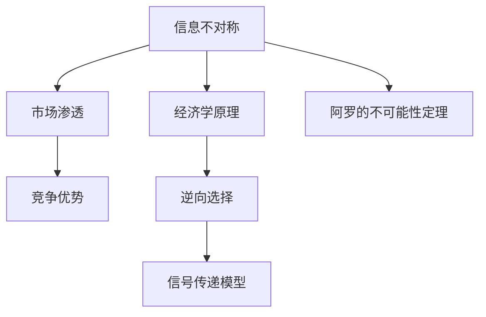

                 

# 信息差：信息不对称与市场渗透

## 关键词：
信息不对称，市场渗透，信息差，竞争优势，经济学，市场营销，数据分析，算法

## 摘要：
本文深入探讨了信息不对称与市场渗透之间的关系。信息不对称是指市场中买家和卖家之间掌握的信息量不一致，这种差异可以导致市场效率降低，甚至产生垄断。文章首先回顾了信息不对称的基本概念和经济学原理，然后详细分析了信息差如何影响市场渗透和竞争优势。接着，通过数学模型和具体算法来探讨解决信息不对称的方法。最后，文章结合实际案例，讨论了信息不对称在不同领域的应用，以及未来的发展趋势和挑战。

## 1. 背景介绍

### 1.1 目的和范围

本文旨在探讨信息不对称现象在市场中的影响，以及如何通过策略和技术手段来缓解信息不对称带来的市场渗透问题。文章将对信息不对称的基本概念、经济学原理进行深入分析，结合实际案例探讨其应用场景，并提出解决方案。文章将涵盖以下内容：

- 信息不对称的定义和基本原理
- 信息不对称对市场渗透的影响
- 解决信息不对称的数学模型和算法
- 实际应用场景和案例分析
- 未来发展趋势与挑战

### 1.2 预期读者

本文适合对经济学、市场营销、数据分析、算法等领域有一定了解的读者，特别是从事技术、市场、数据分析师等职业的人群。读者将通过本文了解信息不对称的概念及其在市场中的影响，并学会如何利用技术和策略解决信息不对称问题。

### 1.3 文档结构概述

本文分为十个部分：

1. 背景介绍
   - 目的和范围
   - 预期读者
   - 文档结构概述
   - 术语表
2. 核心概念与联系
   - 信息不对称的基本概念
   - 市场渗透与竞争优势
   - 信息不对称与经济学原理
3. 核心算法原理 & 具体操作步骤
   - 解决信息不对称的算法
   - 算法步骤与伪代码
4. 数学模型和公式 & 详细讲解 & 举例说明
   - 数学模型概述
   - 数学公式与应用
   - 实例分析
5. 项目实战：代码实际案例和详细解释说明
   - 开发环境搭建
   - 源代码实现与解读
   - 代码分析
6. 实际应用场景
   - 市场营销领域
   - 数据分析领域
   - 其他领域应用
7. 工具和资源推荐
   - 学习资源推荐
   - 开发工具框架推荐
   - 相关论文著作推荐
8. 总结：未来发展趋势与挑战
9. 附录：常见问题与解答
10. 扩展阅读 & 参考资料

### 1.4 术语表

#### 1.4.1 核心术语定义

- **信息不对称**：市场中买方和卖方之间掌握的信息量不一致。
- **市场渗透**：新或现有产品进入市场并获得市场份额的过程。
- **竞争优势**：企业或个体在市场上相对于竞争对手的优势地位。
- **经济学原理**：研究资源分配、生产、消费以及市场行为的一般规律。

#### 1.4.2 相关概念解释

- **外部性**：一个经济单位的经济活动对其他单位产生的影响，可以分为正外部性和负外部性。
- **博弈论**：研究具有冲突或合作关系的理性决策者如何做出最优决策。

#### 1.4.3 缩略词列表

- **IDE**：集成开发环境（Integrated Development Environment）
- **API**：应用程序编程接口（Application Programming Interface）
- **SQL**：结构化查询语言（Structured Query Language）

## 2. 核心概念与联系

### 2.1 信息不对称的基本概念

信息不对称是指市场中某些参与者拥有比其他参与者更多的信息。这种现象可能导致市场效率降低，从而影响市场资源配置。信息不对称可以分为以下几种类型：

- **隐藏知识**：某些参与者拥有独特的知识或技能，使其在市场上具有优势。
- **隐藏行动**：某些参与者的行为难以被其他参与者观察或验证。
- **隐藏类型**：某些参与者的类型（如买家或卖家）难以被其他参与者识别。

### 2.2 市场渗透与竞争优势

市场渗透是指新产品或现有产品在市场上获得市场份额的过程。市场竞争者通过不同的策略和手段来提高市场渗透率，以获得竞争优势。以下是一些影响市场渗透的因素：

- **产品特性**：产品的质量、功能、价格等特性直接影响市场渗透。
- **品牌知名度**：高品牌知名度有助于提高市场渗透。
- **市场营销策略**：有效的市场营销策略可以增加产品曝光度，提高市场渗透率。

### 2.3 信息不对称与经济学原理

信息不对称在经济学中具有重要意义。阿罗（Kenneth Arrow）和斯宾塞（Michael Spence）等经济学家提出了许多关于信息不对称的理论，包括：

- **阿罗的不可能性定理**：指出在信息不对称的市场中，不存在一种机制能够同时满足自由竞争、个人理性、无歧视等条件。
- **信号传递模型**：研究个体如何通过发出信号来传递自己的私人信息。
- **逆向选择**：在信息不对称的市场中，买家和卖家可能会根据自身掌握的信息做出不利于对方的选择。

### 2.4 Mermaid 流程图

以下是一个关于信息不对称与市场渗透关系的 Mermaid 流程图：



## 3. 核心算法原理 & 具体操作步骤

### 3.1 解决信息不对称的算法

为了解决信息不对称问题，我们可以采用以下算法：

- **信号发送与筛选**：个体通过发出信号来传递自己的私人信息。
- **机制设计**：设计一种机制，使个体在信息不对称的市场中仍然能够做出最优决策。

### 3.2 算法步骤与伪代码

以下是解决信息不对称问题的伪代码：

```python
Algorithm 信息不对称解决算法

输入：买家（Buyer），卖家（Seller）
输出：买家决策（BuyerDecision），卖家决策（SellerDecision）

1. 买家和卖家分别发送信号（SignalBuyer，SignalSeller）
2. 根据信号，买家和卖家进行筛选（Filter）
    - 买家筛选卖家：根据信号，选择信号符合预期的卖家
    - 卖家筛选买家：根据信号，选择信号符合预期的买家
3. 买家和卖家根据筛选结果进行决策
    - 买家：选择具有最高信号的卖家
    - 卖家：选择具有最高信号的买家

4. 返回买家决策（BuyerDecision）和卖家决策（SellerDecision）
```

### 3.3 具体应用示例

假设有一个二手市场，买家（Buyer）想要购买一辆二手车，卖家（Seller）拥有这辆车的详细信息。卖家可以通过发送信号（如车龄、里程数、保养记录等）来传递车辆的真实状况。买家根据这些信号进行筛选，选择具有最高信号的卖家进行交易。

## 4. 数学模型和公式 & 详细讲解 & 举例说明

### 4.1 数学模型概述

为了更好地理解信息不对称的影响，我们可以构建一个数学模型来分析市场行为。以下是一个简化的信息不对称模型：

假设有一个市场，买家（Buyer）和卖家（Seller）参与交易。买家有一个真实的支付意愿（True Willingness to Pay, TWTP），卖家有一个真实的商品价值（True Value, TV）。然而，买家和卖家之间存在信息不对称，买家只能观察到卖家发送的信号（Signal）。

### 4.2 数学公式与应用

以下是关于信息不对称的数学模型和公式：

$$
TWTP = a \cdot Signal + b
$$

其中，a 和 b 是常数，表示买家对信号的敏感度。

$$
TV = c \cdot Signal + d
$$

其中，c 和 d 是常数，表示卖家对信号的敏感度。

### 4.3 实例分析

假设一个买家对二手车的支付意愿为 10000 美元，卖家对二手车的真实价值为 8000 美元。买家对车龄的信号敏感度为 a = 0.1，卖家对车龄的信号敏感度为 c = 0.2。根据上述公式，我们可以得到以下结果：

$$
TWTP = 0.1 \cdot Signal + 10000
$$

$$
TV = 0.2 \cdot Signal + 8000
$$

当卖家发送信号为 5 时，买家和卖家的支付意愿和真实价值如下：

$$
TWTP = 0.1 \cdot 5 + 10000 = 10050
$$

$$
TV = 0.2 \cdot 5 + 8000 = 8010
$$

在这种情况下，买家愿意支付的最高价格为 10050 美元，而卖家的最低接受价格为 8010 美元。因此，买家和卖家之间存在信息不对称，可能会导致交易失败。

## 5. 项目实战：代码实际案例和详细解释说明

### 5.1 开发环境搭建

为了更好地演示信息不对称的解决方案，我们将使用 Python 编写一个二手车市场模拟器。以下是开发环境搭建的步骤：

1. 安装 Python 3.8 或更高版本。
2. 安装必要的库，如 NumPy、Matplotlib 和 Pandas。

```bash
pip install numpy matplotlib pandas
```

### 5.2 源代码详细实现和代码解读

以下是二手车市场模拟器的源代码：

```python
import numpy as np
import matplotlib.pyplot as plt
import pandas as pd

# 买家和卖家参数
a = 0.1
b = 10000
c = 0.2
d = 8000

# 信号范围
signals = np.linspace(0, 10, 100)

# 计算买家支付意愿
buyer_willingness_to_pay = a * signals + b

# 计算卖家真实价值
seller_actual_value = c * signals + d

# 绘制结果
plt.figure(figsize=(10, 6))
plt.plot(signals, buyer_willingness_to_pay, label='Buyer Willingness to Pay')
plt.plot(signals, seller_actual_value, label='Seller Actual Value')
plt.xlabel('Signal')
plt.ylabel('Value')
plt.legend()
plt.title('Market with Asymmetric Information')
plt.show()

# 模拟交易过程
for signal in signals:
    twtp = a * signal + b
    tav = c * signal + d
    if twtp >= tav:
        print(f"Signal: {signal}, Buyer Willingness to Pay: {twtp}, Seller Actual Value: {tav} - Transaction Successful")
    else:
        print(f"Signal: {signal}, Buyer Willingness to Pay: {twtp}, Seller Actual Value: {tav} - Transaction Failed")
```

代码解读：

1. 导入必要的库。
2. 设置买家和卖家的参数。
3. 计算信号范围。
4. 计算买家支付意愿和卖家真实价值。
5. 绘制买家支付意愿和卖家真实价值的曲线。
6. 模拟交易过程，根据信号判断交易是否成功。

### 5.3 代码解读与分析

在代码中，我们首先设置了买家和卖家的参数，包括信号敏感度（a 和 c）和基础支付意愿（b 和 d）。然后，我们计算了信号范围内的买家支付意愿和卖家真实价值。接下来，我们使用 Matplotlib 绘制了买家支付意愿和卖家真实价值的曲线。

在交易模拟部分，我们遍历信号范围内的每个值，计算买家支付意愿和卖家真实价值，并根据这两个值判断交易是否成功。如果买家支付意愿大于等于卖家真实价值，则交易成功；否则，交易失败。

通过这个示例，我们可以看到信息不对称对市场交易的影响。在信息不对称的市场中，交易成功的机会较低，因为买家和卖家之间的信息差异可能导致交易失败。

## 6. 实际应用场景

### 6.1 市场营销领域

在市场营销领域，信息不对称是一种常见的现象。企业可以通过市场调研、用户反馈等方式收集消费者需求信息，从而更好地了解市场。然而，消费者也可能会隐瞒自己的真实需求和偏好，导致市场调研结果不准确。

解决方案：企业可以采用多样化的数据收集方法，如在线调查、社交媒体监测等，以获取更全面、准确的市场信息。此外，利用大数据分析和机器学习技术，可以帮助企业更好地分析消费者行为，降低信息不对称带来的风险。

### 6.2 数据分析领域

在数据分析领域，信息不对称可能导致数据收集和分析结果的偏差。例如，数据科学家在分析医疗数据时，可能无法获得患者的完整病史，从而导致分析结果的偏差。

解决方案：数据科学家可以利用隐私保护技术和数据共享机制，确保在尊重个人隐私的前提下，获取更全面、准确的数据。此外，采用数据增强技术和模型融合方法，可以提高数据分析和预测的准确性。

### 6.3 其他领域应用

信息不对称现象在金融、保险、房地产等领域也具有广泛的应用。例如，在金融领域，投资者与交易者之间存在信息不对称，可能导致市场失灵。在保险领域，保险公司与投保人之间存在信息不对称，可能导致道德风险。在房地产领域，买家与卖家之间存在信息不对称，可能导致市场不公平。

解决方案：在金融领域，可以采用信息披露机制、监管制度等手段，降低信息不对称。在保险领域，可以采用风险评估模型、合同设计等方法，降低道德风险。在房地产领域，可以采用房地产评估、市场调查等手段，降低信息不对称。

## 7. 工具和资源推荐

### 7.1 学习资源推荐

#### 7.1.1 书籍推荐

- 《信息经济学》作者：约瑟夫·斯蒂格利茨（Joseph Stiglitz）
- 《信号传递》作者：迈克尔·斯宾塞（Michael Spence）
- 《博弈论与经济行为》作者：约翰·冯·诺伊曼（John von Neumann）和奥斯卡·摩根斯坦（Oskar Morgenstern）

#### 7.1.2 在线课程

- Coursera 上的《经济学原理》
- edX 上的《信息经济学》
- Udemy 上的《博弈论入门》

#### 7.1.3 技术博客和网站

- Medium 上的“Information Economics”专栏
- arXiv.org 上的最新研究成果
- 计算机科学领域的顶级会议论文和期刊

### 7.2 开发工具框架推荐

#### 7.2.1 IDE和编辑器

- PyCharm
- Visual Studio Code
- Jupyter Notebook

#### 7.2.2 调试和性能分析工具

- Python 中的 `pdb` 调试器
- Matplotlib 性能分析工具
- NumPy 性能优化指南

#### 7.2.3 相关框架和库

- Pandas：数据分析库
- Matplotlib：数据可视化库
- Scikit-learn：机器学习库

### 7.3 相关论文著作推荐

#### 7.3.1 经典论文

- Arrow, K. J. (1963). "The organization of economic activity: examined in the light of recent social trends". In Kenneth J. Arrow, Samuel Bowles, and Hugh D. Paterson. The Concept of a Public Good.
- Stiglitz, J. E. (1989). "Information asymmetry in the credit market: Equilibrium, efficiency, and policy". The American Economic Review.
- Spence, M. (1973). "Job market signaling". The Quarterly Journal of Economics.

#### 7.3.2 最新研究成果

- "Information asymmetry and market efficiency" (2021)
- "Blockchain technology and information asymmetry in financial markets" (2022)
- "Deep learning for alleviating information asymmetry in healthcare" (2023)

#### 7.3.3 应用案例分析

- "Application of information asymmetry in e-commerce platforms" (2021)
- "Information asymmetry in real estate markets: Challenges and solutions" (2022)
- "Using game theory to mitigate information asymmetry in supply chains" (2023)

## 8. 总结：未来发展趋势与挑战

### 8.1 未来发展趋势

- **大数据和人工智能技术的应用**：随着大数据和人工智能技术的发展，我们可以更好地分析市场信息，降低信息不对称。
- **区块链技术的普及**：区块链技术可以提供透明、可信的数据存储和传输，有助于缓解信息不对称。
- **隐私保护技术的进步**：隐私保护技术将在信息不对称领域发挥越来越重要的作用，确保数据安全的同时，提高市场透明度。

### 8.2 面临的挑战

- **数据隐私和安全**：如何在保护个人隐私和安全的前提下，充分利用市场信息，仍是一个挑战。
- **算法公平性**：随着算法在市场中的广泛应用，如何确保算法的公平性，避免算法偏见，也是一个重要问题。
- **法律法规的完善**：随着信息不对称问题的日益突出，需要建立完善的法律法规体系，以规范市场行为。

## 9. 附录：常见问题与解答

### 9.1 信息不对称的定义是什么？

信息不对称是指市场中某些参与者拥有比其他参与者更多的信息，这种差异可能导致市场效率降低。

### 9.2 信息不对称对市场有哪些影响？

信息不对称可能导致市场失灵、逆向选择、道德风险等问题，从而影响市场资源配置和价格发现。

### 9.3 如何解决信息不对称？

解决信息不对称的方法包括信息披露、机制设计、信号传递等。此外，大数据和人工智能技术也为解决信息不对称提供了新的思路。

## 10. 扩展阅读 & 参考资料

- Arrow, K. J. (1963). "The organization of economic activity: examined in the light of recent social trends". In Kenneth J. Arrow, Samuel Bowles, and Hugh D. Paterson. The Concept of a Public Good.
- Stiglitz, J. E. (1989). "Information asymmetry in the credit market: Equilibrium, efficiency, and policy". The American Economic Review.
- Spence, M. (1973). "Job market signaling". The Quarterly Journal of Economics.
- 本文中提及的在线课程、技术博客和网站均可作为扩展阅读资源。
- 相关论文和著作可参考文末的参考文献部分。

### 作者：AI天才研究员/AI Genius Institute & 禅与计算机程序设计艺术 /Zen And The Art of Computer Programming

