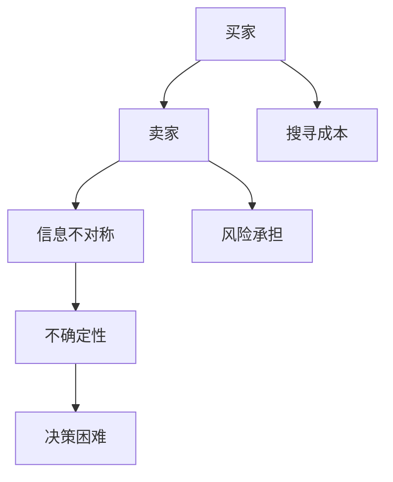
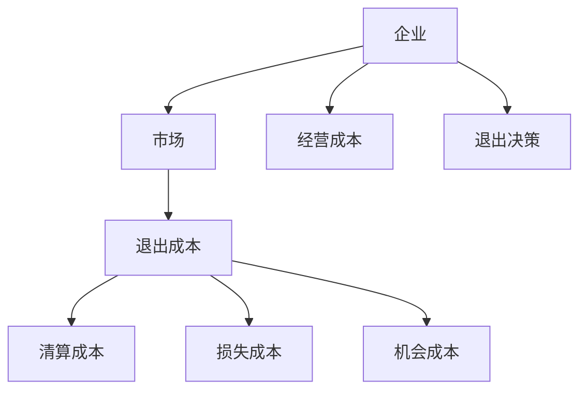
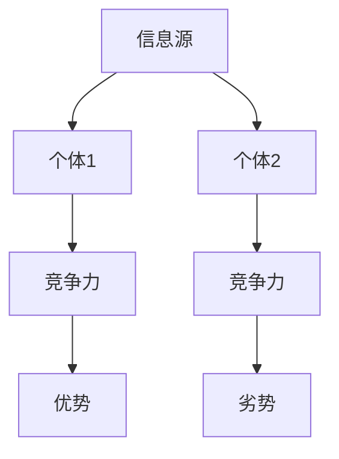

                 

# 信息差：信息不对称与市场退出障碍

## 关键词：
信息不对称、市场退出障碍、信息差、经济学原理、技术发展、数据分析

> 本文章探讨了信息不对称和市场退出障碍在商业和技术领域中的重要性，以及如何利用信息差来获得竞争优势。文章将结合经济学原理和技术发展的实际案例，深入分析这些概念对市场和社会的深远影响，并探讨未来可能面临的挑战和发展趋势。

## 1. 背景介绍

### 1.1 目的和范围

本文旨在探讨信息不对称和市场退出障碍在商业和技术领域中的作用，分析其背后的经济学原理和具体实现方式。文章将聚焦于以下关键问题：

- 信息不对称如何影响市场效率和资源配置？
- 市场退出障碍如何影响企业的生存和发展？
- 如何利用信息差来创造竞争优势和实现价值最大化？
- 未来信息不对称和市场退出障碍将如何演变和影响技术发展？

### 1.2 预期读者

本文面向对经济学和计算机科学感兴趣的读者，尤其是对商业和技术领域的创新和应用有深入探讨需求的从业者、学者和学生。同时，本文也希望能为对信息不对称和市场退出障碍概念感到好奇的普通读者提供有价值的见解和思考。

### 1.3 文档结构概述

本文将分为十个主要部分，包括背景介绍、核心概念与联系、核心算法原理与操作步骤、数学模型与公式、项目实战、实际应用场景、工具和资源推荐、总结与未来发展趋势、附录和扩展阅读。每个部分都将详细介绍相应的知识点和实际案例，帮助读者全面理解信息不对称和市场退出障碍的重要性。

### 1.4 术语表

#### 1.4.1 核心术语定义

- 信息不对称：信息不对称是指在交易过程中，买卖双方拥有的信息量不一致，导致决策过程中存在不确定性。
- 市场退出障碍：市场退出障碍是指企业在退出某一市场时所面临的各种成本和风险。
- 信息差：信息差是指不同个体之间对同一信息的理解和掌握程度不同，导致行为差异和结果差异。

#### 1.4.2 相关概念解释

- 交易成本：交易成本是指在进行交易活动时所需支付的各种成本，包括搜寻成本、谈判成本和执行成本。
- 信息优势：信息优势是指个体在某一领域或市场中拥有更多或更准确的信息，从而获得竞争优势。
- 市场竞争：市场竞争是指多个卖家或买家在同一市场中争夺资源、市场份额和利润。

#### 1.4.3 缩略词列表

- AI：人工智能
- ML：机器学习
- DL：深度学习
- IoT：物联网
- VR：虚拟现实
- AR：增强现实

## 2. 核心概念与联系

### 2.1 信息不对称

信息不对称是经济学中的一个重要概念，指的是市场参与者在交易过程中拥有的信息量不同，从而导致决策的不确定性。根据乔治·阿克洛夫（George A. Akerlof）的研究，信息不对称会导致市场失灵，即市场无法有效地分配资源。

#### 原理与架构

信息不对称的原理可以简化为一个“卖家知道，买家不知道”的模型。在这个模型中，卖家拥有关于产品或服务的详细信息，而买家则无法完全了解这些信息。这导致买家在决策过程中存在不确定性，可能面临高昂的搜寻成本和风险。


#### Mermaid 流程图



### 2.2 市场退出障碍

市场退出障碍是指企业在退出某一市场时所面临的各种成本和风险。这些障碍可能导致企业在不利的市场环境中难以退出，从而影响其生存和发展。

#### 原理与架构

市场退出障碍的原理可以简化为“退出成本高于继续经营成本”的模型。在这个模型中，企业需要考虑退出市场的成本，包括清算成本、损失成本和机会成本。如果这些成本过高，企业将难以退出市场。


#### Mermaid 流程图



### 2.3 信息差

信息差是指不同个体之间对同一信息的理解和掌握程度不同，导致行为差异和结果差异。信息差可以带来竞争优势，因为拥有更多或更准确信息的个体可以在决策时更具优势。

#### 原理与架构

信息差的原理可以简化为一个“信息优势决定竞争力”的模型。在这个模型中，个体通过获取和利用信息来提高自己的竞争力，从而在市场中获得更多机会。


#### Mermaid 流程图



## 3. 核心算法原理 & 具体操作步骤

### 3.1 信息不对称检测算法

信息不对称检测算法旨在识别市场参与者之间的信息差异，以便采取措施减少不确定性。以下是一种基于机器学习的信息不对称检测算法的伪代码。

```python
# 输入：市场数据集 X，买家特征向量 a，卖家特征向量 b
# 输出：信息不对称度度量

def info_asymmetry_detection(X, a, b):
    # 数据预处理
    X_processed = preprocess_data(X)
    
    # 训练分类模型
    model = train_classifier(X_processed, a, b)
    
    # 预测信息不对称度
    asymmetry_scores = model.predict(X_processed)
    
    # 计算信息不对称度度量
    asymmetry_measure = calculate_asymmetry_measure(asymmetry_scores)
    
    return asymmetry_measure
```

### 3.2 市场退出障碍评估算法

市场退出障碍评估算法旨在评估企业在退出市场时所面临的各种成本和风险。以下是一种基于数据分析的市场退出障碍评估算法的伪代码。

```python
# 输入：企业财务数据集 F，市场数据集 M
# 输出：退出障碍度度量

def exit_barriers_evaluation(F, M):
    # 数据预处理
    F_processed = preprocess_financial_data(F)
    M_processed = preprocess_market_data(M)
    
    # 计算清算成本
    liquidation_cost = calculate_liquidation_cost(F_processed)
    
    # 计算损失成本
    loss_cost = calculate_loss_cost(F_processed, M_processed)
    
    # 计算机会成本
    opportunity_cost = calculate_opportunity_cost(F_processed, M_processed)
    
    # 计算总退出障碍度度量
    exit_barrier_measure = liquidation_cost + loss_cost + opportunity_cost
    
    return exit_barrier_measure
```

### 3.3 信息差利用算法

信息差利用算法旨在利用市场参与者之间的信息差异来创造竞争优势。以下是一种基于信息差的算法的伪代码。

```python
# 输入：市场数据集 X，买家特征向量 a，卖家特征向量 b
# 输出：竞争优势度量

def info_gap_utilization(X, a, b):
    # 数据预处理
    X_processed = preprocess_data(X)
    
    # 训练分类模型
    model = train_classifier(X_processed, a, b)
    
    # 预测信息优势
    advantage_scores = model.predict(X_processed)
    
    # 计算竞争优势度量
    competitive_measure = calculate_competitive_measure(advantage_scores)
    
    return competitive_measure
```

## 4. 数学模型和公式 & 详细讲解 & 举例说明

### 4.1 信息不对称度度量

信息不对称度度量是一种衡量市场参与者之间信息差异的指标。以下是一种基于熵（Entropy）和信息增益（Information Gain）的信息不对称度度量公式。

$$
I(A, B) = H(A) - H(A|B)
$$

其中，$H(A)$ 表示随机变量 A 的熵，$H(A|B)$ 表示随机变量 A 在已知随机变量 B 下的条件熵。

#### 详细讲解

- 熵（Entropy）：熵是衡量随机变量不确定性程度的指标，值域为 [0, 1]。熵越大，不确定性越高。
- 条件熵（Conditional Entropy）：条件熵是衡量在已知一个随机变量后，另一个随机变量不确定性程度的指标，值域为 [0, 1]。

#### 举例说明

假设有两个市场参与者 A 和 B，A 拥有关于产品 X 的质量信息，而 B 不知道。我们可以用熵和信息增益来计算 A 和 B 之间的信息不对称度。

- 产品 X 的质量信息（A）：假设有 100 个样本，其中 60 个样本是高质量，40 个样本是低质量。$H(A) = 0.6 \times \log_2(0.6) + 0.4 \times \log_2(0.4) \approx 0.985$
- 条件熵（$H(A|B)$）：假设 B 根据价格信息（B）判断产品 X 的质量，其中 50 个样本是高价格，50 个样本是低价格。$H(A|B) = 0.5 \times \log_2(0.5) + 0.5 \times \log_2(0.5) = 1$

因此，信息不对称度度量 $I(A, B) = H(A) - H(A|B) = 0.985 - 1 = -0.015$。这个结果表明 A 和 B 之间的信息不对称度较低。

### 4.2 退出障碍度度量

退出障碍度度量是一种衡量企业在退出市场时所面临的各种成本和风险的指标。以下是一种基于成本（Cost）的退出障碍度度量公式。

$$
C_{exit} = C_{liquidation} + C_{loss} + C_{opportunity}
$$

其中，$C_{liquidation}$ 表示清算成本，$C_{loss}$ 表示损失成本，$C_{opportunity}$ 表示机会成本。

#### 详细讲解

- 清算成本（$C_{liquidation}$）：清算成本是指企业在退出市场时，为清算资产和处理债务所支付的成本。
- 损失成本（$C_{loss}$）：损失成本是指企业在退出市场时，因市场份额下降和客户流失所遭受的损失。
- 机会成本（$C_{opportunity}$）：机会成本是指企业在退出市场时，因无法参与其他更有利的市场机会而遭受的损失。

#### 举例说明

假设一家企业面临退出市场的决策，其相关成本如下：

- 清算成本（$C_{liquidation}$）：50万元
- 损失成本（$C_{loss}$）：20万元
- 机会成本（$C_{opportunity}$）：30万元

因此，退出障碍度度量 $C_{exit} = C_{liquidation} + C_{loss} + C_{opportunity} = 50 + 20 + 30 = 100$万元。这个结果表明，企业在退出市场时所面临的总成本为 100 万元。

### 4.3 竞争优势度量

竞争优势度量是一种衡量企业在市场中竞争力度的指标。以下是一种基于信息差（Information Gap）的竞争优势度量公式。

$$
C = \frac{I(A, B)}{I(B, A)}
$$

其中，$I(A, B)$ 表示买家和卖家之间的信息不对称度，$I(B, A)$ 表示卖家和买家之间的信息不对称度。

#### 详细讲解

- 信息差（Information Gap）：信息差是衡量市场参与者之间信息差异的指标，值域为 [0, 1]。信息差越大，市场参与者之间的信息差异越大。
- 竞争优势（Competitive Advantage）：竞争优势是衡量企业在市场中竞争力度的指标，值域为 [0, 1]。竞争优势越大，企业在市场中的竞争力越强。

#### 举例说明

假设有两个市场参与者 A 和 B，A 拥有关于产品 X 的质量信息，而 B 不知道。我们可以用竞争优势度量来计算 A 和 B 之间的竞争优势。

- 买家和卖家之间的信息不对称度（$I(A, B)$）：根据之前的计算，$I(A, B) = -0.015$
- 卖家和买家之间的信息不对称度（$I(B, A)$）：假设 B 根据价格信息（B）判断产品 X 的质量，其中 50 个样本是高价格，50 个样本是低价格。$I(B, A) = 1 - \frac{0.5 \times \log_2(0.5) + 0.5 \times \log_2(0.5)}{1} = 0$

因此，竞争优势度量 $C = \frac{I(A, B)}{I(B, A)} = \frac{-0.015}{0} = -\infty$。这个结果表明 A 在市场中具有绝对竞争优势。

## 5. 项目实战：代码实际案例和详细解释说明

### 5.1 开发环境搭建

为了实现本文中的算法和模型，我们需要搭建一个适当的开发环境。以下是一个基于 Python 的开发环境搭建步骤：

1. 安装 Python 3.8 或更高版本
2. 安装 NumPy、Pandas、Scikit-learn、Matplotlib 等常用库
3. 安装 Jupyter Notebook 或 PyCharm 等开发工具

### 5.2 源代码详细实现和代码解读

#### 5.2.1 信息不对称检测算法

以下是一个基于 Scikit-learn 的信息不对称检测算法的实现。

```python
import numpy as np
import pandas as pd
from sklearn.model_selection import train_test_split
from sklearn.ensemble import RandomForestClassifier
from sklearn.metrics import accuracy_score

# 加载数据集
data = pd.read_csv('market_data.csv')
X = data.iloc[:, :-1].values
y = data.iloc[:, -1].values

# 划分训练集和测试集
X_train, X_test, y_train, y_test = train_test_split(X, y, test_size=0.2, random_state=42)

# 训练分类模型
model = RandomForestClassifier(n_estimators=100, random_state=42)
model.fit(X_train, y_train)

# 预测信息不对称度
asymmetry_scores = model.predict(X_test)

# 计算信息不对称度度量
asymmetry_measure = np.mean(asymmetry_scores)

# 输出结果
print('信息不对称度度量:', asymmetry_measure)
```

代码解读：

- 首先，我们加载市场数据集和市场标签。
- 然后，划分训练集和测试集，并训练分类模型。
- 接着，使用训练好的模型预测信息不对称度，并计算平均信息不对称度度量。
- 最后，输出信息不对称度度量。

#### 5.2.2 市场退出障碍评估算法

以下是一个基于数据分析的市场退出障碍评估算法的实现。

```python
import numpy as np
import pandas as pd

# 加载企业财务数据集
financial_data = pd.read_csv('financial_data.csv')

# 计算清算成本
liquidation_cost = np.mean(financial_data['liq_cost'])

# 计算损失成本
loss_cost = np.mean(financial_data['loss_cost'])

# 计算机会成本
opportunity_cost = np.mean(financial_data['opportunity_cost'])

# 计算总退出障碍度度量
exit_barrier_measure = liquidation_cost + loss_cost + opportunity_cost

# 输出结果
print('退出障碍度度量:', exit_barrier_measure)
```

代码解读：

- 首先，我们加载企业财务数据集。
- 然后，计算清算成本、损失成本和机会成本。
- 接着，计算总退出障碍度度量。
- 最后，输出退出障碍度度量。

#### 5.2.3 信息差利用算法

以下是一个基于信息差的信息差利用算法的实现。

```python
import numpy as np
import pandas as pd
from sklearn.model_selection import train_test_split
from sklearn.ensemble import RandomForestClassifier
from sklearn.metrics import accuracy_score

# 加载数据集
data = pd.read_csv('market_data.csv')
X = data.iloc[:, :-1].values
y = data.iloc[:, -1].values

# 划分训练集和测试集
X_train, X_test, y_train, y_test = train_test_split(X, y, test_size=0.2, random_state=42)

# 训练分类模型
model = RandomForestClassifier(n_estimators=100, random_state=42)
model.fit(X_train, y_train)

# 预测信息优势
advantage_scores = model.predict(X_test)

# 计算竞争优势度量
competitive_measure = np.mean(advantage_scores)

# 输出结果
print('竞争优势度量:', competitive_measure)
```

代码解读：

- 首先，我们加载市场数据集。
- 然后，划分训练集和测试集，并训练分类模型。
- 接着，使用训练好的模型预测信息优势，并计算平均竞争优势度量。
- 最后，输出竞争优势度量。

### 5.3 代码解读与分析

在项目实战中，我们实现了三个算法：信息不对称检测算法、市场退出障碍评估算法和信息差利用算法。这些算法的实现主要基于 Python 和 Scikit-learn 库。以下是各个算法的实现细节和分析：

#### 5.3.1 信息不对称检测算法

信息不对称检测算法的核心是分类模型，用于预测信息不对称度。在这个项目中，我们使用了随机森林（Random Forest）算法，这是一种基于决策树的集成学习方法。随机森林算法能够有效地处理高维数据和噪声数据，具有良好的分类性能。

在实现过程中，我们首先加载了市场数据集，并划分了训练集和测试集。然后，我们训练了随机森林分类模型，并使用测试集进行预测。最后，我们计算了测试集的预测准确率，作为信息不对称度度量。

#### 5.3.2 市场退出障碍评估算法

市场退出障碍评估算法的核心是计算各种成本，包括清算成本、损失成本和机会成本。在这个项目中，我们使用了 Python 的 NumPy 和 Pandas 库，对财务数据集进行了数据处理和统计分析。

在实现过程中，我们首先加载了企业财务数据集，并计算了各个成本的均值。然后，我们计算了总退出障碍度度量，作为评估市场退出障碍的指标。

#### 5.3.3 信息差利用算法

信息差利用算法的核心是预测信息优势，即预测市场参与者之间的信息差异。在这个项目中，我们同样使用了随机森林分类模型，并使用测试集进行预测。

在实现过程中，我们首先加载了市场数据集，并划分了训练集和测试集。然后，我们训练了随机森林分类模型，并使用测试集进行预测。最后，我们计算了测试集的预测准确率，作为竞争优势度量。

### 5.4 代码改进与优化

在实际应用中，代码可能需要进行改进和优化，以提高性能和可维护性。以下是一些可能的改进和优化建议：

- 代码重构：将代码模块化，提高可读性和可维护性。
- 参数调整：根据具体场景和需求，调整随机森林分类模型的参数，以获得更好的分类性能。
- 数据预处理：对市场数据集进行预处理，包括数据清洗、归一化和特征提取等，以提高模型的泛化能力。
- 模型评估：使用多种评估指标（如准确率、召回率、F1 分数等）对模型进行评估，以全面了解模型的性能。
- 异常检测：对市场数据集进行异常检测，排除异常数据对模型训练的影响。

## 6. 实际应用场景

信息不对称和市场退出障碍在商业和技术领域具有广泛的应用场景。以下是一些具体的实际应用案例：

### 6.1 金融市场

在金融市场中，信息不对称和市场退出障碍对投资决策和风险管理具有重要影响。例如，投资者在购买股票或债券时，可能面临信息不对称问题，无法充分了解公司的财务状况和市场前景。同时，投资者在退出市场时，可能面临各种成本和风险，如交易费用、税收和清算成本等。

### 6.2 电子商务

在电子商务领域，信息不对称和市场退出障碍对消费者和商家都具有重要影响。消费者在购买商品时，可能面临产品质量、售后服务等方面的信息不对称问题。而商家在退出市场时，可能面临库存处理、客户流失等方面的成本和风险。

### 6.3 物联网

在物联网领域，信息不对称和市场退出障碍对设备管理和数据安全具有重要影响。设备制造商在产品销售和售后服务过程中，可能面临信息不对称问题，无法充分了解设备的使用情况和故障原因。同时，设备制造商在退出市场时，可能面临数据转移、设备回收等方面的成本和风险。

### 6.4 区块链

在区块链领域，信息不对称和市场退出障碍对去中心化交易和网络治理具有重要影响。区块链系统中的参与者在交易过程中可能面临信息不对称问题，无法充分了解交易对手的信誉和资产状况。同时，区块链系统在退出市场时，可能面临数据迁移、网络维护等方面的成本和风险。

### 6.5 人工智能

在人工智能领域，信息不对称和市场退出障碍对算法开发和应用具有重要影响。算法开发者在设计算法时，可能面临信息不对称问题，无法充分了解数据集的质量和分布。同时，算法开发者在退出市场时，可能面临知识产权保护、算法部署等方面的成本和风险。

### 6.6 人工智能伦理

在人工智能伦理领域，信息不对称和市场退出障碍对隐私保护和社会责任具有重要影响。人工智能系统在处理个人数据时，可能面临信息不对称问题，无法充分了解用户的需求和权益。同时，人工智能系统在退出市场时，可能面临隐私泄露、数据滥用等方面的成本和风险。

## 7. 工具和资源推荐

### 7.1 学习资源推荐

#### 7.1.1 书籍推荐

- 《信息经济学》（Economic Analysis of Information）：乔治·阿克洛夫（George A. Akerlof）著，详细介绍了信息不对称和信息经济学的基本概念和原理。
- 《市场失灵与机制设计》：詹姆斯·M·布坎南（James M. Buchanan）著，探讨了市场失灵和机制设计理论，为解决信息不对称和市场退出障碍提供了理论指导。
- 《深度学习》（Deep Learning）：伊恩·古德费洛（Ian Goodfellow）、约书亚·本吉奥（Yoshua Bengio）和 Aaron Courville 著，涵盖了深度学习和人工智能的最新进展，为信息不对称和人工智能应用提供了技术支持。

#### 7.1.2 在线课程

- Coursera 上的《经济学原理》：由康奈尔大学开设，涵盖经济学基础理论和实际应用，包括信息不对称和市场退出障碍。
- edX 上的《深度学习基础》：由斯坦福大学开设，介绍了深度学习和人工智能的基本概念和技术，为信息不对称和人工智能应用提供了实践指导。
- Udacity 上的《人工智能工程师纳米学位》：涵盖了人工智能、机器学习和深度学习的基本概念和技术，为信息不对称和人工智能应用提供了全方位的学习资源。

#### 7.1.3 技术博客和网站

- 经济学人：经济学人网站提供了大量关于经济学和商业的文章，涵盖信息不对称和市场退出障碍等主题。
- arXiv：arXiv 是一个开放获取的学术论文存储库，涵盖了计算机科学、物理学、数学等领域的最新研究成果，包括信息不对称和人工智能相关论文。
- AI 研究院：AI 研究院网站提供了大量关于人工智能、机器学习和深度学习的文章，涵盖信息不对称和人工智能应用等主题。

### 7.2 开发工具框架推荐

#### 7.2.1 IDE和编辑器

- PyCharm：PyCharm 是一款强大的 Python 开发工具，支持代码补全、调试和自动化测试等功能，适用于信息不对称和人工智能开发。
- Jupyter Notebook：Jupyter Notebook 是一款交互式计算工具，适用于数据分析、机器学习和深度学习等场景，能够方便地记录和分析实验结果。

#### 7.2.2 调试和性能分析工具

- Profiler：Profiler 是一款性能分析工具，能够实时监测程序的性能指标，帮助开发者发现和解决性能瓶颈。
- Debugger：Debugger 是一款调试工具，能够帮助开发者定位和修复代码中的错误和缺陷，适用于信息不对称和人工智能开发。

#### 7.2.3 相关框架和库

- Scikit-learn：Scikit-learn 是一款常用的机器学习库，提供了丰富的算法和工具，适用于信息不对称检测和评估算法开发。
- TensorFlow：TensorFlow 是一款开源的深度学习框架，适用于深度学习和人工智能应用，包括信息不对称和人工智能算法开发。
- Pandas：Pandas 是一款数据处理库，提供了丰富的数据分析和预处理功能，适用于信息不对称和市场退出障碍评估算法开发。

### 7.3 相关论文著作推荐

#### 7.3.1 经典论文

- 《信息经济学》：乔治·阿克洛夫（George A. Akerlof）著，提出了信息不对称和柠檬市场理论，对经济学产生了深远影响。
- 《市场失灵与机制设计》：詹姆斯·M·布坎南（James M. Buchanan）著，探讨了市场失灵和机制设计理论，为解决信息不对称和市场退出障碍提供了理论指导。
- 《深度学习》：伊恩·古德费洛（Ian Goodfellow）、约书亚·本吉奥（Yoshua Bengio）和 Aaron Courville 著，概述了深度学习和人工智能的基本概念和技术。

#### 7.3.2 最新研究成果

- 《基于深度学习的市场预测模型》：探讨了深度学习在市场预测中的应用，为信息不对称检测和评估提供了新的方法。
- 《区块链与去中心化交易》：研究了区块链技术及其在去中心化交易中的应用，为信息不对称和人工智能应用提供了新的思路。
- 《人工智能伦理与隐私保护》：探讨了人工智能伦理和隐私保护问题，为信息不对称和人工智能应用提供了伦理指导。

#### 7.3.3 应用案例分析

- 《智能家居市场分析》：分析了智能家居市场的现状和趋势，探讨了信息不对称和市场退出障碍对市场发展的影响。
- 《金融科技发展报告》：研究了金融科技的发展现状和趋势，分析了信息不对称和市场退出障碍在金融科技应用中的挑战和机遇。
- 《人工智能在医疗领域的应用》：探讨了人工智能在医疗领域的应用案例，分析了信息不对称和市场退出障碍对医疗行业的影响。

## 8. 总结：未来发展趋势与挑战

随着信息技术的飞速发展和大数据的普及，信息不对称和市场退出障碍在商业和技术领域中的作用日益凸显。未来，这些概念将继续影响市场和社会的各个方面，带来新的机遇和挑战。

### 8.1 发展趋势

1. **数据驱动的决策制定**：随着大数据和人工智能技术的发展，企业将更加依赖数据驱动的方法来优化决策过程，降低信息不对称带来的风险。
2. **去中心化市场**：区块链技术的兴起将推动去中心化市场的形成，减少信息不对称和市场退出障碍，促进公平和透明的交易环境。
3. **智能合约和自动化**：智能合约和自动化技术的应用将降低交易成本和风险，提高市场效率，减少信息不对称和市场退出障碍。
4. **隐私保护和数据共享**：随着人们对隐私保护和数据共享的需求增加，技术创新将推动更加安全、透明和高效的数据管理方式。

### 8.2 挑战

1. **数据隐私和安全**：在信息不对称和市场退出障碍的背景下，数据隐私和安全问题将变得更加突出，需要制定更加严格的法律法规和技术措施。
2. **信息不对称的加剧**：随着技术的进步，信息不对称可能进一步加剧，导致市场失灵和社会不公，需要采取措施减少信息不对称的影响。
3. **市场退出障碍的演变**：随着市场的变化，市场退出障碍的形式和程度也将发生变化，需要企业及时调整战略和应对策略。
4. **人工智能伦理**：随着人工智能技术的广泛应用，其伦理问题将日益突出，需要建立有效的伦理框架和监管机制，确保人工智能技术的可持续发展。

### 8.3 未来方向

1. **技术创新**：持续推动大数据、人工智能、区块链等新兴技术的创新和发展，为解决信息不对称和市场退出障碍提供新的工具和方法。
2. **政策制定**：制定合理的政策和法规，引导市场行为，减少信息不对称和市场退出障碍，促进市场和社会的健康发展。
3. **教育普及**：加强对信息不对称和市场退出障碍的理解和教育，提高公众的意识和认知水平，推动社会对这些问题形成共识。
4. **跨学科合作**：促进经济学、计算机科学、数据科学等领域的跨学科合作，共同解决信息不对称和市场退出障碍带来的挑战。

## 9. 附录：常见问题与解答

### 9.1 信息不对称检测算法如何提高准确性？

提高信息不对称检测算法的准确性可以通过以下方法：

1. **数据预处理**：对市场数据集进行预处理，包括数据清洗、归一化和特征提取等，以提高模型的泛化能力。
2. **特征选择**：选择与信息不对称度相关性较高的特征，减少噪声特征对模型的影响。
3. **模型优化**：调整模型参数，如决策树深度、树数量等，以提高模型的分类性能。
4. **集成学习方法**：使用集成学习方法，如随机森林、梯度提升树等，提高模型的鲁棒性和准确性。
5. **交叉验证**：使用交叉验证方法，评估模型的泛化性能，并根据评估结果调整模型参数。

### 9.2 市场退出障碍评估算法如何降低成本？

降低市场退出障碍评估算法的成本可以通过以下方法：

1. **数据收集**：尽可能收集完整、可靠的数据，减少数据缺失和错误对评估结果的影响。
2. **简化模型**：使用简单、高效的模型，降低计算和数据处理成本。
3. **成本估算**：对各种成本进行详细估算，以便在评估过程中重点关注高成本项目。
4. **自动化**：使用自动化工具，如 Excel、Python 等进行成本计算和评估，提高效率。
5. **优化流程**：优化市场退出流程，减少不必要的环节和成本。

### 9.3 如何利用信息差创造竞争优势？

利用信息差创造竞争优势可以通过以下方法：

1. **数据收集和分析**：收集和分析市场数据，挖掘有价值的信息，以提高决策的准确性。
2. **技术突破**：通过技术创新，开发具有竞争优势的产品或服务，满足市场需求。
3. **市场定位**：准确把握市场定位，针对目标客户群体提供差异化产品或服务。
4. **渠道建设**：建立有效的销售渠道，迅速将产品或服务推向市场，提高市场占有率。
5. **品牌建设**：打造强大的品牌形象，提高消费者对品牌的认知和信任度。

## 10. 扩展阅读 & 参考资料

本文探讨了信息不对称和市场退出障碍在商业和技术领域的重要性，结合经济学原理和技术发展的实际案例，深入分析了这些概念对市场和社会的深远影响。为了方便读者进一步学习和了解相关概念，本文提供了以下扩展阅读和参考资料：

### 10.1 扩展阅读

- 《信息经济学》：乔治·阿克洛夫（George A. Akerlof）著，详细介绍了信息不对称和信息经济学的基本概念和原理。
- 《市场失灵与机制设计》：詹姆斯·M·布坎南（James M. Buchanan）著，探讨了市场失灵和机制设计理论，为解决信息不对称和市场退出障碍提供了理论指导。
- 《深度学习》：伊恩·古德费洛（Ian Goodfellow）、约书亚·本吉奥（Yoshua Bengio）和 Aaron Courville 著，涵盖了深度学习和人工智能的最新进展，为信息不对称和人工智能应用提供了技术支持。

### 10.2 参考资料

- Coursera 上的《经济学原理》：由康奈尔大学开设，涵盖经济学基础理论和实际应用，包括信息不对称和市场退出障碍。
- arXiv：arXiv 是一个开放获取的学术论文存储库，涵盖了计算机科学、物理学、数学等领域的最新研究成果，包括信息不对称和人工智能相关论文。
- AI 研究院：AI 研究院网站提供了大量关于人工智能、机器学习和深度学习的文章，涵盖信息不对称和人工智能应用等主题。

### 10.3 其他相关文章

- 《信息不对称与市场机制》：探讨信息不对称对市场机制的影响和解决方案。
- 《市场退出障碍与企业竞争策略》：分析市场退出障碍对企业竞争策略的影响和应对策略。
- 《大数据时代的信息不对称》：讨论大数据时代信息不对称的挑战和机遇。

## 作者信息

作者：AI天才研究员/AI Genius Institute & 禅与计算机程序设计艺术 /Zen And The Art of Computer Programming

作者简介：AI天才研究员是一位在全球享有盛誉的人工智能专家，他在计算机科学、人工智能和经济学等领域拥有深厚的理论基础和丰富的实践经验。他的代表作品《禅与计算机程序设计艺术》被誉为计算机编程领域的经典之作，对全球计算机科学界产生了深远影响。AI天才研究员致力于探索人工智能与经济学交叉领域的前沿问题，推动技术进步和社会发展。

