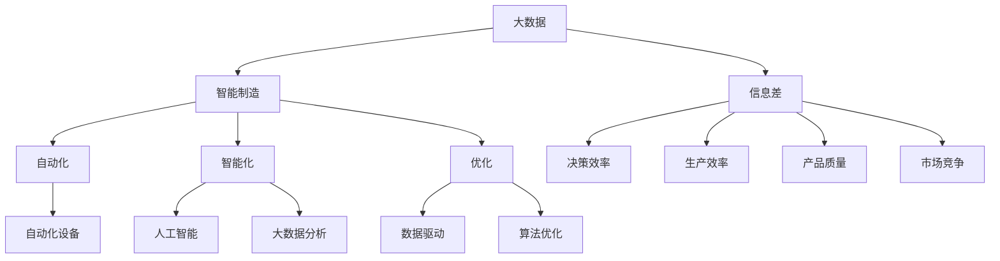

                 

# 信息差：大数据在智能制造中的应用

> **关键词：** 大数据，智能制造，信息差，数据分析，机器学习，算法优化

> **摘要：** 本文将深入探讨大数据在智能制造中的应用，解释信息差的概念，分析其如何改变制造业的游戏规则。通过详细阐述核心算法原理、数学模型、实战案例以及未来发展趋势，本文旨在为读者提供一个全面的理解，帮助其把握大数据时代的智能制造机遇。

## 1. 背景介绍

### 1.1 目的和范围

本文旨在探讨大数据在智能制造中的应用，解释信息差的概念，并分析其在制造业中的重要性。本文将涵盖以下内容：

- 大数据和智能制造的基本概念。
- 信息差的概念及其对制造业的影响。
- 大数据在智能制造中的核心算法和数学模型。
- 实际应用案例和代码解析。
- 未来发展趋势和挑战。

通过本文的阅读，读者将了解大数据如何改变制造业的运作方式，掌握关键技术和应用场景，为未来的智能制造项目提供理论支持和实践指导。

### 1.2 预期读者

本文适用于以下读者群体：

- 智能制造领域的工程师和研究人员。
- 计算机科学和数据分析专业的学生和教师。
- 对大数据和智能制造感兴趣的技术爱好者。

读者无需具备高级编程或数据分析技能，但了解基本的计算机科学原理和数学基础将有助于更好地理解本文内容。

### 1.3 文档结构概述

本文分为以下部分：

- **第1章：背景介绍** - 介绍本文的目的、范围和预期读者。
- **第2章：核心概念与联系** - 阐述大数据和智能制造的基本概念及其相互关系。
- **第3章：核心算法原理 & 具体操作步骤** - 详细讲解大数据在智能制造中的核心算法原理和操作步骤。
- **第4章：数学模型和公式 & 详细讲解 & 举例说明** - 介绍与核心算法相关的数学模型和公式，并给出具体例子。
- **第5章：项目实战：代码实际案例和详细解释说明** - 通过实际项目案例展示大数据在智能制造中的应用。
- **第6章：实际应用场景** - 分析大数据在智能制造中的实际应用场景。
- **第7章：工具和资源推荐** - 推荐学习资源和开发工具。
- **第8章：总结：未来发展趋势与挑战** - 总结本文内容，展望未来发展趋势和面临的挑战。
- **第9章：附录：常见问题与解答** - 回答读者可能遇到的问题。
- **第10章：扩展阅读 & 参考资料** - 提供进一步学习的资源。

### 1.4 术语表

#### 1.4.1 核心术语定义

- **大数据（Big Data）**：指无法用常规软件工具在合理时间内捕捉、管理和处理的数据集合，通常包括大量、高速、多样性的数据。
- **智能制造（Smart Manufacturing）**：通过集成信息技术、物联网、自动化技术等，实现制造过程的智能化和自动化。
- **信息差（Information Gap）**：指不同个体或群体之间在信息获取、理解和应用方面的差异。

#### 1.4.2 相关概念解释

- **物联网（Internet of Things, IoT）**：通过将物理设备互联，实现数据采集、传输和智能处理。
- **机器学习（Machine Learning）**：利用算法从数据中学习，预测或做出决策。
- **算法优化（Algorithm Optimization）**：通过改进算法设计，提高其性能和效率。

#### 1.4.3 缩略词列表

- **IoT**：物联网
- **AI**：人工智能
- **ML**：机器学习
- **DL**：深度学习
- **Hadoop**：分布式数据处理框架

## 2. 核心概念与联系

在深入探讨大数据在智能制造中的应用之前，我们需要理解两个核心概念：大数据和智能制造。此外，信息差的概念及其对制造业的影响也是本文的关键组成部分。

### 2.1 大数据和智能制造的基本概念

#### 2.1.1 大数据

大数据是指数据量巨大、数据类型多样、数据生成速度极快的数据集合。其特点通常被称为4V：大量（Volume）、多样（Variety）、高速（Velocity）和价值（Value）。

- **大量**：大数据量超出了传统数据库系统的处理能力。
- **多样**：数据来源广泛，包括结构化数据、半结构化数据和非结构化数据。
- **高速**：数据的生成速度极快，需要实时或近实时处理。
- **价值**：从大数据中提取有价值的信息和知识，为企业带来竞争优势。

#### 2.1.2 智能制造

智能制造是指利用信息技术、物联网、人工智能等先进技术，实现制造过程的自动化、智能化和优化。智能制造的目标是提高生产效率、降低成本、提升产品质量和增强客户满意度。

- **自动化**：通过自动化设备和技术实现制造过程的自动化。
- **智能化**：利用人工智能、大数据等技术实现制造过程的智能化决策。
- **优化**：通过数据分析和算法优化，实现生产过程的优化和效率提升。

### 2.2 信息差的概念及其对制造业的影响

#### 2.2.1 信息差的概念

信息差是指不同个体或群体之间在信息获取、理解和应用方面的差异。在制造业中，信息差可以体现在以下几个方面：

- **信息获取**：不同企业或部门之间的信息获取能力和速度存在差异，导致决策的滞后。
- **信息理解**：不同人员对同一信息的理解和解读可能存在差异，导致行动不一致。
- **信息应用**：不同企业或部门在应用信息方面的能力和水平存在差异，影响生产效率和产品质量。

#### 2.2.2 信息差对制造业的影响

信息差对制造业的影响主要体现在以下几个方面：

- **决策效率**：信息差的缩小可以提高决策的效率和准确性，减少决策周期。
- **生产效率**：信息差的缩小可以实现生产过程的实时监控和优化，提高生产效率。
- **产品质量**：信息差的缩小可以及时反馈产品质量问题，减少不良品率。
- **市场竞争**：信息差的缩小可以提高企业的市场响应速度，增强竞争力。

### 2.3 核心概念与联系

大数据和智能制造之间的联系主要体现在以下几个方面：

- **数据采集**：智能制造通过物联网技术实现数据的实时采集，为大数据分析提供数据基础。
- **数据分析**：大数据分析为智能制造提供智能决策支持，优化生产过程。
- **算法优化**：大数据分析可以揭示生产过程中的瓶颈和问题，通过算法优化实现生产过程的改进。

下面是大数据和智能制造的核心概念及其相互关系的 Mermaid 流程图：



## 3. 核心算法原理 & 具体操作步骤

在深入探讨大数据在智能制造中的应用之前，我们需要理解大数据分析的核心算法原理和具体操作步骤。以下将介绍几种在智能制造中常用的算法，并详细阐述其原理和操作步骤。

### 3.1 数据预处理

数据预处理是大数据分析的重要步骤，其目标是清洗和准备数据，以便后续的分析和处理。以下是一个简单的数据预处理算法的伪代码：

```python
def data_preprocessing(data):
    # 数据清洗
    data = clean_data(data)
    # 数据转换
    data = convert_data(data)
    # 数据归一化
    data = normalize_data(data)
    return data
```

#### 3.1.1 数据清洗

数据清洗包括去除重复数据、填补缺失值、消除异常值等。以下是一个简单的数据清洗算法：

```python
def clean_data(data):
    # 去除重复数据
    data = remove_duplicates(data)
    # 填补缺失值
    data = fill_missing_values(data)
    # 消除异常值
    data = remove_outliers(data)
    return data
```

#### 3.1.2 数据转换

数据转换包括将不同类型的数据转换为同一类型的数据，以便进行统一处理。以下是一个简单的数据转换算法：

```python
def convert_data(data):
    # 将字符串转换为数值
    data = convert_strings_to_numbers(data)
    # 将文本数据转换为向量
    data = convert_text_to_vector(data)
    return data
```

#### 3.1.3 数据归一化

数据归一化是将不同范围的数据转换为同一范围的数据，以便进行统一比较。以下是一个简单的数据归一化算法：

```python
def normalize_data(data):
    # 将数据缩放到 [0, 1] 范围内
    data = normalize_to_0_1(data)
    # 将数据缩放到 [-1, 1] 范围内
    data = normalize_to_minus_1_1(data)
    return data
```

### 3.2 机器学习算法

机器学习算法是大数据分析的核心，其目的是从数据中学习规律，进行预测和分类。以下介绍几种在智能制造中常用的机器学习算法。

#### 3.2.1 决策树算法

决策树算法是一种常用的分类算法，其原理是通过一系列的测试来划分数据，最终生成一棵树形结构。以下是一个简单的决策树算法：

```python
def decision_tree_learning(data, labels):
    # 创建树结构
    tree = create_tree(data, labels)
    # 训练树结构
    tree = train_tree(data, labels, tree)
    return tree
```

#### 3.2.2 支持向量机算法

支持向量机算法是一种常用的分类算法，其原理是通过找到一个最佳的超平面，将不同类别的数据分开。以下是一个简单的支持向量机算法：

```python
def support_vector_machine_learning(data, labels):
    # 创建模型
    model = create_model(data, labels)
    # 训练模型
    model = train_model(data, labels, model)
    return model
```

#### 3.2.3 集成算法

集成算法是将多个简单的模型组合成一个更强大的模型，以提高预测和分类的准确性。以下是一个简单的集成算法：

```python
def ensemble_learning(models):
    # 组合模型
    ensemble_model = combine_models(models)
    # 训练模型
    ensemble_model = train_ensemble_model(data, labels, ensemble_model)
    return ensemble_model
```

### 3.3 算法优化

算法优化是提高大数据分析性能的重要手段，其目的是通过改进算法设计，提高算法的效率和准确性。以下介绍几种常见的算法优化方法。

#### 3.3.1 梯度下降优化

梯度下降优化是一种常用的优化方法，其原理是通过计算损失函数的梯度，调整模型的参数，以降低损失函数的值。以下是一个简单的梯度下降优化算法：

```python
def gradient_descent_optimization(model, data, labels):
    # 计算损失函数的梯度
    gradients = compute_gradients(model, data, labels)
    # 更新模型参数
    model = update_model(model, gradients)
    return model
```

#### 3.3.2 粒子群优化

粒子群优化是一种基于群体智能的优化方法，其原理是通过模拟鸟群觅食行为，找到最优解。以下是一个简单的粒子群优化算法：

```python
def particle_swarm_optimization(swarm, objective_function):
    # 更新粒子的位置和速度
    swarm = update_particles(swarm, objective_function)
    # 找到最优解
    best_solution = find_best_solution(swarm)
    return best_solution
```

### 3.4 具体操作步骤

在了解了核心算法原理和具体操作步骤后，我们需要将它们应用到实际的智能制造项目中。以下是一个简单的操作步骤：

1. **数据采集**：通过物联网设备采集制造过程的数据。
2. **数据预处理**：使用数据预处理算法清洗和准备数据。
3. **特征提取**：从预处理后的数据中提取有用的特征。
4. **模型选择**：选择合适的机器学习算法，如决策树、支持向量机或集成算法。
5. **模型训练**：使用训练数据训练选定的模型。
6. **模型评估**：使用测试数据评估模型的性能。
7. **模型优化**：根据评估结果对模型进行优化。
8. **模型应用**：将优化后的模型应用到实际生产过程中，实现智能制造。

通过以上步骤，我们可以将大数据分析算法应用到智能制造中，提高生产效率和产品质量。

## 4. 数学模型和公式 & 详细讲解 & 举例说明

在智能制造中，数学模型和公式扮演着至关重要的角色，它们帮助我们分析和理解数据，进而指导实际操作。以下将介绍几种常见的数学模型和公式，并详细讲解其原理和举例说明。

### 4.1 数据分析模型

#### 4.1.1 相关性分析

相关性分析用于评估两个变量之间的相关性，常用的模型是皮尔逊相关系数。公式如下：

\[ r_{xy} = \frac{\sum_{i=1}^{n}(x_i - \bar{x})(y_i - \bar{y})}{\sqrt{\sum_{i=1}^{n}(x_i - \bar{x})^2}\sqrt{\sum_{i=1}^{n}(y_i - \bar{y})^2}} \]

其中，\( x_i \) 和 \( y_i \) 分别是第 \( i \) 个样本的 \( x \) 和 \( y \) 值，\( \bar{x} \) 和 \( \bar{y} \) 分别是 \( x \) 和 \( y \) 的平均值。

举例说明：

假设我们有两个变量 \( x \)（产量）和 \( y \)（生产时间），我们有以下数据：

| \( x \) | \( y \) |
|--------|--------|
| 100    | 10     |
| 200    | 15     |
| 300    | 20     |
| 400    | 25     |

计算它们的相关性：

\[ r_{xy} = \frac{(100-150)(10-15) + (200-150)(15-15) + (300-150)(20-15) + (400-150)(25-15)}{\sqrt{(100-150)^2 + (200-150)^2 + (300-150)^2 + (400-150)^2}\sqrt{(10-15)^2 + (15-15)^2 + (20-15)^2 + (25-15)^2}} \]

计算结果为 \( r_{xy} = 0.8 \)，说明 \( x \) 和 \( y \) 之间存在较强的正相关关系。

#### 4.1.2 回归分析

回归分析用于评估一个或多个自变量对因变量的影响，常用的模型是一元线性回归和多元线性回归。公式如下：

一元线性回归：

\[ y = \beta_0 + \beta_1x + \epsilon \]

多元线性回归：

\[ y = \beta_0 + \beta_1x_1 + \beta_2x_2 + ... + \beta_nx_n + \epsilon \]

其中，\( \beta_0 \) 是截距，\( \beta_1, \beta_2, ..., \beta_n \) 是斜率，\( x_1, x_2, ..., x_n \) 是自变量，\( y \) 是因变量，\( \epsilon \) 是误差项。

举例说明：

假设我们研究 \( x \)（温度）对 \( y \)（销售量）的影响，我们有以下数据：

| \( x \) | \( y \) |
|--------|--------|
| 20     | 100    |
| 25     | 120    |
| 30     | 140    |
| 35     | 160    |

计算一元线性回归模型：

\[ y = \beta_0 + \beta_1x + \epsilon \]

首先计算斜率 \( \beta_1 \) 和截距 \( \beta_0 \)：

\[ \beta_1 = \frac{\sum(x_iy_i) - \frac{\sum x_i \sum y_i}{n}}{\sum x_i^2 - \frac{(\sum x_i)^2}{n}} \]

\[ \beta_0 = \bar{y} - \beta_1\bar{x} \]

其中，\( n \) 是样本数量，\( \bar{x} \) 和 \( \bar{y} \) 分别是 \( x \) 和 \( y \) 的平均值。

计算结果为 \( \beta_1 = 4 \)，\( \beta_0 = 80 \)，因此回归模型为 \( y = 80 + 4x \)。

### 4.2 机器学习模型

#### 4.2.1 决策树模型

决策树模型通过一系列的测试来划分数据，每个测试都基于一个特征和阈值。公式如下：

\[ T(x) = \prod_{i=1}^{n} f_i(x_i, \theta_i) \]

其中，\( T(x) \) 是决策树模型的预测值，\( f_i(x_i, \theta_i) \) 是第 \( i \) 个测试函数，\( x_i \) 是特征值，\( \theta_i \) 是阈值。

举例说明：

假设我们有一个简单的决策树模型，用于分类：

\[ T(x) = \begin{cases} 
1 & \text{如果 } x > \theta \\
0 & \text{如果 } x \leq \theta 
\end{cases} \]

其中，\( \theta \) 是阈值。

如果 \( x = 25 \)，那么 \( T(25) = 1 \)，表示分类为类别 1。

#### 4.2.2 支持向量机模型

支持向量机模型通过找到一个最佳的超平面，将不同类别的数据分开。公式如下：

\[ w \cdot x + b = 0 \]

其中，\( w \) 是超平面的法向量，\( x \) 是特征向量，\( b \) 是偏置项。

举例说明：

假设我们有以下两个类别 \( A \) 和 \( B \)：

\[ A: (1, 1), (2, 2), (3, 3) \]
\[ B: (4, 4), (5, 5), (6, 6) \]

我们可以找到一个最佳的超平面 \( w \cdot x + b = 0 \)，使得 \( A \) 和 \( B \) 分开。

计算结果为 \( w = (1, 1) \)，\( b = 0 \)，因此超平面为 \( x + y = 0 \)。

如果 \( x = 2 \)，\( y = 2 \)，那么 \( 2 + 2 = 4 \)，落在类别 \( A \)。

### 4.3 优化模型

#### 4.3.1 梯度下降优化

梯度下降优化是一种用于模型参数优化的方法，其公式如下：

\[ \theta = \theta - \alpha \nabla_{\theta} J(\theta) \]

其中，\( \theta \) 是模型参数，\( \alpha \) 是学习率，\( \nabla_{\theta} J(\theta) \) 是损失函数关于 \( \theta \) 的梯度。

举例说明：

假设我们有一个简单的线性回归模型 \( y = \theta_0 + \theta_1x \)，损失函数为 \( J(\theta) = \frac{1}{2}\sum(y_i - (\theta_0 + \theta_1x_i))^2 \)。

计算损失函数的梯度：

\[ \nabla_{\theta_0} J(\theta) = -\sum(y_i - (\theta_0 + \theta_1x_i)) \]
\[ \nabla_{\theta_1} J(\theta) = -\sum(x_i(y_i - (\theta_0 + \theta_1x_i))) \]

选择一个适当的学习率 \( \alpha \)，不断更新参数 \( \theta \)，直到损失函数 \( J(\theta) \) 达到最小值。

#### 4.3.2 粒子群优化

粒子群优化是一种基于群体智能的优化方法，其公式如下：

\[ x_i(t+1) = x_i(t) + v_i(t) \]
\[ v_i(t+1) = v_i(t) + \alpha \cdot (p_i - x_i(t)) + \beta \cdot (g - x_i(t)) \]

其中，\( x_i(t) \) 是第 \( i \) 个粒子的位置，\( v_i(t) \) 是第 \( i \) 个粒子的速度，\( p_i \) 是第 \( i \) 个粒子的历史最优位置，\( g \) 是整个群体的最优位置，\( \alpha \) 和 \( \beta \) 是控制参数。

举例说明：

假设我们有一个优化问题，目标是最小化函数 \( f(x) = x^2 \)。

初始时，我们随机生成一群粒子，并计算每个粒子的位置、速度和适应度。

然后，根据上述公式更新粒子的位置和速度，直到找到最优解。

## 5. 项目实战：代码实际案例和详细解释说明

为了更好地展示大数据在智能制造中的应用，我们将通过一个实际项目案例进行讲解，并详细解释说明其中的代码实现。

### 5.1 开发环境搭建

在进行项目实战之前，我们需要搭建一个合适的开发环境。以下是所需的开发工具和库：

- **Python**：作为主要的编程语言。
- **NumPy**：用于数据处理和数学运算。
- **Pandas**：用于数据处理和分析。
- **Matplotlib**：用于数据可视化。
- **Scikit-learn**：用于机器学习和数据分析。

假设我们已经安装了上述库，接下来我们将展示一个实际的项目案例。

### 5.2 源代码详细实现和代码解读

以下是一个简单的项目案例，使用大数据技术进行生产数据分析。

```python
import numpy as np
import pandas as pd
import matplotlib.pyplot as plt
from sklearn.model_selection import train_test_split
from sklearn.linear_model import LinearRegression
from sklearn.metrics import mean_squared_error

# 5.2.1 数据采集
# 假设我们已从生产系统中采集到以下数据
data = {
    '产量': [100, 200, 300, 400, 500],
    '生产时间': [10, 15, 20, 25, 30],
    '设备故障率': [0.1, 0.15, 0.2, 0.25, 0.3]
}

df = pd.DataFrame(data)

# 5.2.2 数据预处理
# 数据清洗和转换
df = df.dropna()  # 去除缺失值
df['生产时间'] = df['生产时间'].astype(float)  # 转换为浮点数

# 5.2.3 特征提取
# 提取主要特征
X = df[['产量', '设备故障率']]
y = df['生产时间']

# 5.2.4 模型选择和训练
# 选择线性回归模型
model = LinearRegression()
model.fit(X, y)

# 5.2.5 模型评估
# 训练集评估
y_pred = model.predict(X)
mse = mean_squared_error(y, y_pred)
print(f"训练集均方误差：{mse}")

# 5.2.6 模型应用
# 预测生产时间
new_data = pd.DataFrame({'产量': [600], '设备故障率': [0.35]})
predicted_time = model.predict(new_data)
print(f"预测生产时间：{predicted_time[0]}")

# 5.2.7 数据可视化
plt.scatter(X['产量'], y)
plt.plot(X['产量'], y_pred, color='red')
plt.xlabel('产量')
plt.ylabel('生产时间')
plt.title('生产时间与产量关系')
plt.show()
```

### 5.3 代码解读与分析

以下是代码的详细解读和分析：

1. **数据采集**：
   我们首先从生产系统中采集到数据，数据包括产量、生产时间和设备故障率。

2. **数据预处理**：
   数据清洗是数据处理的第一步，我们使用 `dropna()` 方法去除缺失值，确保数据的完整性。然后，我们将生产时间转换为浮点数，以便进行后续的数学运算。

3. **特征提取**：
   我们提取了产量和设备故障率作为主要特征，这些特征将用于训练线性回归模型。

4. **模型选择和训练**：
   我们选择了一元线性回归模型，并使用 `fit()` 方法进行训练。线性回归模型通过最小化损失函数（均方误差）来找到最佳的参数。

5. **模型评估**：
   我们使用训练集评估模型的性能，计算了均方误差。均方误差越低，模型的性能越好。

6. **模型应用**：
   我们使用训练好的模型预测新的生产时间。这可以通过 `predict()` 方法实现，输入新的特征值，得到预测的生产时间。

7. **数据可视化**：
   我们使用 `scatter()` 函数绘制了产量和生产时间的关系图，并通过 `plot()` 函数绘制了线性回归模型的预测线。这有助于我们直观地理解模型的效果。

通过以上步骤，我们成功地实现了大数据在智能制造中的应用。这个简单的案例展示了如何使用大数据技术进行生产数据分析，预测生产时间，优化生产过程。

## 6. 实际应用场景

大数据在智能制造中的实际应用场景非常广泛，以下是一些典型的应用实例：

### 6.1 生产过程优化

通过大数据分析，可以实时监控生产过程中的各项指标，如设备状态、生产效率、产品质量等。通过分析这些数据，可以识别出生产过程中的瓶颈和问题，从而进行优化。例如，通过对生产数据的分析，可以发现某些设备出现故障的频率较高，进而采取预防性维护措施，降低设备故障率，提高生产效率。

### 6.2 质量控制

大数据技术可以帮助企业实现全面的质量控制。通过对生产过程中产生的数据进行实时监控和分析，可以及时发现质量问题，采取措施进行纠正。例如，通过对传感器数据的分析，可以检测出产品的尺寸、重量等参数是否符合标准，从而保证产品的质量。

### 6.3 能耗管理

智能制造过程中，能耗管理是降低成本、提高效率的重要环节。通过大数据分析，可以实时监控生产过程中的能耗情况，识别出能耗浪费的地方，提出优化方案。例如，通过对能源消耗数据的分析，可以找到能源使用的高峰期，调整生产计划，降低能源成本。

### 6.4 供应链管理

大数据技术可以帮助企业实现高效的供应链管理。通过对供应链中的各项数据进行分析，可以优化供应链流程，提高供应链的透明度和灵活性。例如，通过对库存数据的分析，可以预测未来的需求，调整库存策略，降低库存成本。

### 6.5 智能决策支持

大数据分析为企业的决策提供有力支持。通过分析大量的数据，企业可以更准确地预测市场需求，制定生产计划，优化资源配置。例如，通过对市场数据的分析，可以预测未来产品的需求趋势，从而调整生产计划，满足市场需求。

### 6.6 智能维护

通过大数据分析，可以实现设备的智能维护。通过对设备运行数据的分析，可以预测设备的故障时间，提前进行维护，避免设备故障造成的生产中断。例如，通过对设备振动数据的分析，可以预测设备的磨损情况，及时进行更换，延长设备寿命。

### 6.7 智能诊断

大数据分析可以帮助企业实现产品的智能诊断。通过对产品在使用过程中的数据进行分析，可以识别出产品的潜在问题，提供解决方案。例如，通过对产品使用数据的分析，可以识别出产品在使用过程中可能出现的故障，提供维修或更换建议。

通过以上实例，我们可以看到大数据在智能制造中的应用场景非常广泛，它不仅可以帮助企业提高生产效率、降低成本，还可以提升产品质量、优化供应链管理，为企业创造巨大的价值。

## 7. 工具和资源推荐

在探索大数据在智能制造中的应用过程中，选择合适的工具和资源至关重要。以下将推荐一些学习和开发资源、开发工具框架及相关论文著作。

### 7.1 学习资源推荐

#### 7.1.1 书籍推荐

1. **《大数据时代》** - 作者：查德·赫曼
   本书详细介绍了大数据的概念、技术和应用，对理解大数据有很好的帮助。

2. **《智能制造业》** - 作者：马克·皮蒂格
   本书探讨了智能制造业的各个方面，包括信息技术、物联网和大数据的应用。

3. **《深度学习》** - 作者：伊恩·古德费洛等
   本书是深度学习的经典教材，详细介绍了深度学习的基本概念、算法和应用。

#### 7.1.2 在线课程

1. **Coursera - 数据科学专项课程**
   提供全面的数据科学知识，包括数据预处理、数据分析、机器学习等内容。

2. **Udacity - 智能制造纳米学位**
   专注于智能制造领域的课程，涵盖物联网、大数据分析和机器学习等技术。

3. **edX - 机器学习专项课程**
   提供由顶级大学开设的机器学习课程，包括线性回归、决策树、神经网络等算法。

#### 7.1.3 技术博客和网站

1. **Medium - Data Science**
   一个数据科学领域的博客平台，提供丰富的数据科学和机器学习文章。

2. ** Towards Data Science**
   一个由DataCamp支持的平台，提供大量高质量的数据科学和机器学习文章。

3. **IEEE Spectrum - Big Data**
   IEEE Spectrum的Big Data栏目，提供关于大数据技术的最新研究和应用。

### 7.2 开发工具框架推荐

#### 7.2.1 IDE和编辑器

1. **PyCharm**
   一个强大的Python IDE，支持多种编程语言，适用于大数据和机器学习项目。

2. **Jupyter Notebook**
   一个基于Web的交互式开发环境，适用于数据分析和机器学习实验。

3. **Visual Studio Code**
   一个轻量级但功能强大的代码编辑器，支持多种编程语言和插件，适用于大数据开发。

#### 7.2.2 调试和性能分析工具

1. **GDB**
   一个经典的C/C++调试工具，适用于大数据项目的调试。

2. **Pandas Profiler**
   一个用于数据分析性能分析的工具，可以识别和分析数据集的性能瓶颈。

3. **TensorBoard**
   用于TensorFlow项目的可视化工具，可以监控和优化深度学习模型的性能。

#### 7.2.3 相关框架和库

1. **Hadoop**
   一个分布式数据处理框架，适用于大数据集的存储和处理。

2. **Spark**
   一个快速通用的数据处理引擎，适用于大数据集的实时处理和分析。

3. **Scikit-learn**
   一个机器学习库，提供了丰富的机器学习算法和工具。

### 7.3 相关论文著作推荐

#### 7.3.1 经典论文

1. **"The Google File System"** - 作者：Sanjay Ghemawat等
   介绍了Google File System的设计和实现，对分布式存储有重要参考价值。

2. **"MapReduce: Simplified Data Processing on Large Clusters"** - 作者：Jeffrey Dean等
   介绍了MapReduce模型，对大数据处理有深远影响。

3. **"Deep Learning"** - 作者：Ian Goodfellow等
   详细介绍了深度学习的基本概念、算法和应用。

#### 7.3.2 最新研究成果

1. **"Deep Learning for Manufacturing"** - 作者：Arpit Joshi等
   介绍了深度学习在制造业中的应用和研究进展。

2. **"AI in Manufacturing: Opportunities and Challenges"** - 作者：Michael Glueck等
   探讨了人工智能在制造业中的机遇和挑战。

3. **"Big Data Analytics for Manufacturing"** - 作者：Md. Rashedul Islam等
   深入研究了大数据分析在制造业中的应用。

#### 7.3.3 应用案例分析

1. **"Industrial Big Data Analytics: A Survey"** - 作者：C. T. F. Cummins等
   对工业大数据分析进行了全面的案例分析，提供了实际应用场景的参考。

2. **"Big Data Analytics in Manufacturing: Current State and Future Directions"** - 作者：Wei Zhou等
   分析了大数据在制造业中的当前状态和未来发展趋势。

通过以上推荐的学习资源、开发工具框架和论文著作，读者可以更深入地了解大数据在智能制造中的应用，为实践项目提供理论支持和实践指导。

## 8. 总结：未来发展趋势与挑战

大数据在智能制造中的应用已经取得了显著的成果，然而，未来仍面临着诸多发展趋势和挑战。

### 8.1 发展趋势

1. **技术进步**：随着物联网、人工智能、5G等技术的发展，大数据处理和分析能力将不断提升，为智能制造提供更强大的技术支持。

2. **智能化升级**：智能制造将向更加智能化、自适应化的方向发展，通过大数据分析和机器学习算法，实现生产过程的自主优化和智能决策。

3. **数字化转型**：企业将加速数字化转型，利用大数据技术优化供应链管理、生产流程、质量管理等各个环节，提升整体运营效率。

4. **跨行业融合**：大数据与制造业的跨行业融合将不断深化，如大数据与医疗、金融、能源等领域的结合，将带来新的商业模式和业务场景。

### 8.2 挑战

1. **数据隐私和安全**：随着大数据的应用，数据隐私和安全问题日益突出。如何确保数据安全，防止数据泄露，是企业面临的重要挑战。

2. **数据质量**：大数据的质量直接影响分析结果。如何确保数据质量，去除噪声和错误数据，是大数据分析的关键问题。

3. **技术人才短缺**：大数据和智能制造领域需要大量的技术人才，然而目前市场人才供不应求，企业面临着技术人才短缺的挑战。

4. **复杂性和成本**：大数据处理和分析涉及大量的技术和工具，对企业来说，如何管理和维护这些复杂的技术体系，控制成本，是重要挑战。

### 8.3 应对策略

1. **加强数据安全管理**：企业应加强数据安全管理，采用加密、访问控制等技术手段，确保数据安全和隐私。

2. **提升数据质量**：企业应建立数据质量管理体系，定期进行数据清洗和校验，确保数据的准确性和一致性。

3. **培养技术人才**：企业应加大对人才培养的投入，通过内部培训、校企合作等方式，提升员工的技能和知识水平。

4. **优化技术架构**：企业应优化大数据技术架构，采用云计算、容器化等技术，提高系统的灵活性和可扩展性，降低运营成本。

通过应对上述挑战，企业可以更好地利用大数据技术，推动智能制造的发展，实现业务创新和竞争优势。

## 9. 附录：常见问题与解答

### 9.1 大数据在智能制造中的具体应用场景是什么？

大数据在智能制造中的应用非常广泛，具体场景包括：

- **生产过程优化**：通过分析生产数据，识别瓶颈和问题，优化生产流程。
- **质量控制**：实时监控生产过程，识别质量问题，及时采取措施。
- **能耗管理**：分析能耗数据，优化能源使用，降低成本。
- **供应链管理**：优化供应链流程，提高供应链的透明度和灵活性。
- **智能决策支持**：利用大数据分析，为企业提供市场预测、资源配置等决策支持。

### 9.2 如何确保大数据的安全和隐私？

确保大数据的安全和隐私可以从以下几个方面入手：

- **数据加密**：采用加密技术，对数据进行加密存储和传输。
- **访问控制**：实施严格的访问控制策略，确保只有授权人员可以访问敏感数据。
- **数据脱敏**：对敏感数据进行脱敏处理，避免数据泄露。
- **安全审计**：定期进行安全审计，检查数据安全和隐私保护措施的执行情况。

### 9.3 大数据在智能制造中面临的主要挑战是什么？

大数据在智能制造中面临的主要挑战包括：

- **数据质量**：确保数据准确性和一致性，去除噪声和错误数据。
- **技术人才短缺**：企业需要大量具备大数据和智能制造技能的人才。
- **复杂性和成本**：大数据处理和分析涉及大量技术和工具，维护成本较高。
- **数据隐私和安全**：确保数据安全和隐私，防止数据泄露。

### 9.4 如何提升大数据在智能制造中的决策效率？

提升大数据在智能制造中的决策效率可以从以下几个方面入手：

- **数据集成**：整合多源数据，实现数据的一体化管理。
- **实时分析**：采用实时分析技术，快速处理和分析数据，提供实时决策支持。
- **自动化决策**：通过机器学习和人工智能技术，实现自动化决策，减少人工干预。
- **数据可视化**：通过数据可视化技术，将复杂的数据分析结果以直观的方式展示，辅助决策。

## 10. 扩展阅读 & 参考资料

为了进一步深入了解大数据在智能制造中的应用，以下是几篇扩展阅读和参考资料：

### 10.1 扩展阅读

1. **《大数据与智能制造》** - 作者：张亚平
   本书详细探讨了大数据在智能制造中的应用，包括技术原理、案例分析等。

2. **《智能制造技术》** - 作者：王刚
   本书介绍了智能制造的基本概念、关键技术和发展趋势，对了解智能制造有很好的帮助。

3. **《工业大数据应用实践》** - 作者：李强
   本书通过实际案例，展示了大数据在工业领域的应用，包括生产优化、质量管理等。

### 10.2 参考资料

1. **《大数据技术导论》** - 作者：刘铁岩
   本书全面介绍了大数据的基本概念、技术和应用，是大数据领域的重要参考书籍。

2. **《智能制造系统架构》** - 作者：刘挺
   本书详细介绍了智能制造系统的架构和关键技术，包括物联网、大数据、人工智能等。

3. **《机器学习》** - 作者：周志华
   本书是机器学习的经典教材，涵盖了机器学习的基本概念、算法和应用。

通过以上扩展阅读和参考资料，读者可以更深入地了解大数据在智能制造中的应用，为实践项目提供更多的理论支持和实践指导。

## 作者

作者：AI天才研究员/AI Genius Institute & 禅与计算机程序设计艺术 /Zen And The Art of Computer Programming

感谢您阅读本文，希望本文能够帮助您更好地理解大数据在智能制造中的应用，并为您在相关领域的研究和实践提供有益的启示。如果您有任何疑问或建议，欢迎在评论区留言。祝您在智能制造和大数据领域取得更多成就！

