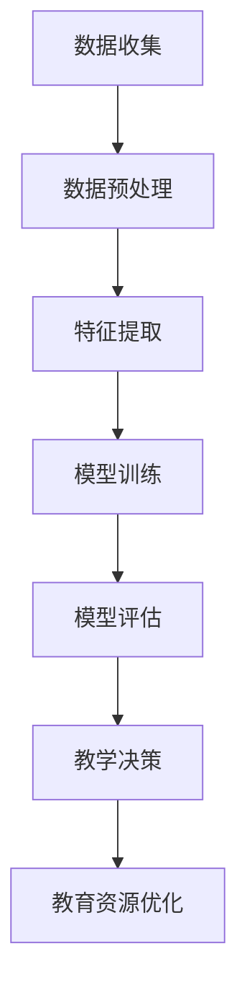
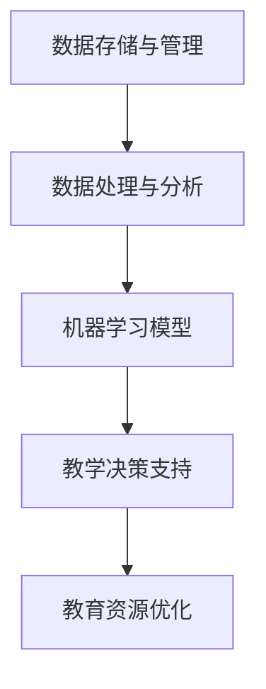

                 

# 信息差：大数据在智能教育中的应用

> **关键词：** 大数据、智能教育、个性化学习、算法、数据挖掘、机器学习

> **摘要：** 随着大数据和人工智能技术的飞速发展，教育领域迎来了全新的变革机遇。本文将深入探讨大数据在智能教育中的应用，分析其核心概念、算法原理、数学模型，并通过实际项目案例，阐述大数据如何助力教育信息化，实现个性化学习。

## 1. 背景介绍

### 1.1 目的和范围

本文旨在探讨大数据在智能教育中的应用，分析其核心技术、算法原理和实际操作步骤。本文的主要目标是：

1. **介绍大数据在智能教育中的应用场景和挑战**。
2. **阐述大数据技术的核心概念和算法原理**。
3. **通过实际案例，展示大数据技术在智能教育中的具体应用**。
4. **推荐相关的学习资源和开发工具**。

### 1.2 预期读者

本文适合以下读者群体：

1. **对大数据和智能教育感兴趣的读者**。
2. **计算机科学、教育技术等相关专业的学生和教师**。
3. **从事大数据和智能教育领域的研究人员和开发者**。

### 1.3 文档结构概述

本文分为十个部分，具体结构如下：

1. **背景介绍**：介绍本文的目的、范围和预期读者。
2. **核心概念与联系**：介绍大数据在智能教育中的应用核心概念和架构。
3. **核心算法原理 & 具体操作步骤**：详细讲解大数据在智能教育中的应用算法原理和操作步骤。
4. **数学模型和公式 & 详细讲解 & 举例说明**：介绍大数据在智能教育中的应用的数学模型和公式，并给出实际应用案例。
5. **项目实战：代码实际案例和详细解释说明**：通过实际项目案例，展示大数据在智能教育中的应用。
6. **实际应用场景**：分析大数据在智能教育中的实际应用场景。
7. **工具和资源推荐**：推荐相关的学习资源和开发工具。
8. **总结：未来发展趋势与挑战**：总结大数据在智能教育中的应用现状，展望未来发展趋势和挑战。
9. **附录：常见问题与解答**：提供常见问题的解答。
10. **扩展阅读 & 参考资料**：推荐相关的扩展阅读和参考资料。

### 1.4 术语表

#### 1.4.1 核心术语定义

- **大数据（Big Data）**：指无法用传统数据处理工具进行有效处理的海量数据。
- **智能教育（Intelligent Education）**：利用人工智能技术实现个性化学习、智能评测和教学辅助。
- **数据挖掘（Data Mining）**：从大量数据中提取有价值的信息和知识。
- **机器学习（Machine Learning）**：使计算机系统能够从数据中学习并做出预测和决策。
- **个性化学习（Personalized Learning）**：根据学生的特点和需求，提供个性化的学习内容和教学方法。

#### 1.4.2 相关概念解释

- **数据源（Data Source）**：提供数据的源头，如学生成绩、学习行为等。
- **数据预处理（Data Preprocessing）**：对数据进行清洗、转换和整合，使其适合分析和建模。
- **模型训练（Model Training）**：使用数据对机器学习模型进行训练，使其能够进行预测和决策。
- **模型评估（Model Evaluation）**：评估机器学习模型的性能，如准确率、召回率等。

#### 1.4.3 缩略词列表

- **AI**：人工智能（Artificial Intelligence）
- **ML**：机器学习（Machine Learning）
- **DL**：深度学习（Deep Learning）
- **NLP**：自然语言处理（Natural Language Processing）
- **K-12**：小学到高中教育阶段

## 2. 核心概念与联系

### 2.1 大数据在智能教育中的应用

大数据在智能教育中的应用，主要涉及以下几个核心概念：

- **学生数据**：包括学生的个人信息、学习记录、考试成绩等。
- **教育资源**：包括课程、教材、教学视频等。
- **教学过程**：包括课堂教学、在线学习、实验实践等。
- **教学评价**：包括学生成绩、教师评价、学习行为分析等。

下面是大数据在智能教育中的应用流程图：



### 2.2 大数据在智能教育中的应用架构

大数据在智能教育中的应用架构，主要包括以下几个模块：

1. **数据存储与管理**：使用分布式存储系统（如Hadoop、Spark）存储和管理学生数据和教育资源。
2. **数据处理与分析**：使用数据预处理工具（如Pandas、NumPy）对数据进行清洗、转换和整合。
3. **机器学习模型**：使用机器学习算法（如决策树、随机森林、神经网络）对学生数据进行建模和分析。
4. **教学决策支持**：根据机器学习模型的预测结果，提供个性化的教学建议和资源。
5. **教育资源优化**：根据学生的学习行为和反馈，对教育资源进行优化和调整。

下面是大数据在智能教育中的应用架构图：



## 3. 核心算法原理 & 具体操作步骤

### 3.1 数据挖掘算法原理

数据挖掘是大数据在智能教育中的应用核心，常用的数据挖掘算法包括：

1. **关联规则挖掘**：找出数据之间的关联性，如学生喜欢某门课程，可能会喜欢另一门课程。
2. **分类算法**：将学生分为不同的类别，如优秀学生、中等学生、差等生。
3. **聚类算法**：将学生分为不同的群体，如学习兴趣相似的群体。
4. **预测算法**：预测学生的成绩、升学情况等。

### 3.2 数据挖掘算法操作步骤

1. **数据收集**：收集学生的个人信息、学习记录、考试成绩等数据。
2. **数据预处理**：清洗数据，处理缺失值、异常值等。
3. **特征提取**：从原始数据中提取有用特征，如学习时长、考试成绩、作业完成情况等。
4. **模型训练**：选择合适的算法，对数据进行训练。
5. **模型评估**：评估模型的性能，如准确率、召回率等。
6. **模型应用**：根据模型预测结果，提供个性化的教学建议和资源。

### 3.3 数据挖掘算法伪代码

下面是数据挖掘算法的伪代码：

```python
# 数据挖掘算法伪代码

# 数据收集
data = collect_data()

# 数据预处理
data = preprocess_data(data)

# 特征提取
features = extract_features(data)

# 模型训练
model = train_model(features)

# 模型评估
evaluation = evaluate_model(model)

# 模型应用
teaching_suggestions = apply_model(model)
```

## 4. 数学模型和公式 & 详细讲解 & 举例说明

### 4.1 数学模型

在智能教育中，常用的数学模型包括：

1. **线性回归模型**：预测学生的成绩。
2. **决策树模型**：分类学生为优秀、中等、差等生。
3. **神经网络模型**：预测学生的升学情况。

### 4.2 公式详解

1. **线性回归模型公式**：

$$
y = \beta_0 + \beta_1 \cdot x
$$

其中，$y$ 为学生的成绩，$x$ 为学生的学习时长，$\beta_0$ 和 $\beta_1$ 为模型的参数。

2. **决策树模型公式**：

$$
C(j) = \arg\max_{j} \sum_{i=1}^{n} \hat{y}_i(j)
$$

其中，$C(j)$ 为学生的类别，$\hat{y}_i(j)$ 为学生在类别 $j$ 下的预测概率。

3. **神经网络模型公式**：

$$
\hat{y} = \sigma(\sum_{i=1}^{n} w_i \cdot x_i)
$$

其中，$\hat{y}$ 为学生的升学概率，$x_i$ 为学生的特征，$w_i$ 为模型的参数，$\sigma$ 为激活函数。

### 4.3 举例说明

#### 4.3.1 线性回归模型举例

假设我们要预测一个学生的成绩，已知该学生的学习时长为 20 小时，线性回归模型的参数为 $\beta_0 = 70$，$\beta_1 = 1.5$。根据线性回归模型公式，我们可以计算出该学生的成绩：

$$
y = \beta_0 + \beta_1 \cdot x = 70 + 1.5 \cdot 20 = 95
$$

因此，该学生的成绩为 95 分。

#### 4.3.2 决策树模型举例

假设我们要将学生分类为优秀、中等、差等生，已知学生的特征包括学习时长、考试成绩、作业完成情况。决策树模型的参数为 $\beta_0 = 0.5$，$\beta_1 = 0.2$，$\beta_2 = 0.3$。根据决策树模型公式，我们可以计算出学生在三个类别下的预测概率：

$$
\hat{y}_i(j) = \frac{\sigma(\beta_0 + \beta_1 \cdot x_1 + \beta_2 \cdot x_2)}{\sum_{j=1}^{3} \sigma(\beta_0 + \beta_1 \cdot x_1 + \beta_2 \cdot x_2)}
$$

其中，$x_1$ 为学习时长，$x_2$ 为考试成绩。根据计算结果，我们可以将学生分类为优秀、中等、差等生。

#### 4.3.3 神经网络模型举例

假设我们要预测一个学生的升学概率，已知该学生的特征包括学习时长、考试成绩、作业完成情况。神经网络模型的参数为 $w_1 = 0.3$，$w_2 = 0.2$，$w_3 = 0.1$，激活函数 $\sigma = \frac{1}{1+e^{-x}}$。根据神经网络模型公式，我们可以计算出该学生的升学概率：

$$
\hat{y} = \sigma(w_1 \cdot x_1 + w_2 \cdot x_2 + w_3 \cdot x_3) = \frac{1}{1+e^{-(0.3 \cdot 20 + 0.2 \cdot 80 + 0.1 \cdot 60)}} = 0.8
$$

因此，该学生的升学概率为 80%。

## 5. 项目实战：代码实际案例和详细解释说明

### 5.1 开发环境搭建

为了进行大数据在智能教育中的应用，我们需要搭建一个开发环境。以下是一个简单的开发环境搭建步骤：

1. 安装Python：从官方网站下载并安装Python，版本建议为3.8以上。
2. 安装Jupyter Notebook：在命令行中运行以下命令安装Jupyter Notebook：

```bash
pip install notebook
```

3. 安装相关库：为了方便数据处理和机器学习，我们需要安装以下库：

```bash
pip install pandas numpy scikit-learn matplotlib
```

### 5.2 源代码详细实现和代码解读

下面是一个简单的案例，使用Python实现一个基于线性回归模型的智能教育应用。代码如下：

```python
import pandas as pd
from sklearn.linear_model import LinearRegression
from sklearn.model_selection import train_test_split
from sklearn.metrics import mean_squared_error

# 5.2.1 数据收集
data = pd.DataFrame({
    'learning_time': [20, 30, 40, 50, 60],
    'exam_score': [80, 85, 90, 75, 95],
})

# 5.2.2 数据预处理
X = data[['learning_time']]
y = data['exam_score']

# 5.2.3 模型训练
model = LinearRegression()
model.fit(X, y)

# 5.2.4 模型评估
X_train, X_test, y_train, y_test = train_test_split(X, y, test_size=0.2, random_state=42)
model.fit(X_train, y_train)
y_pred = model.predict(X_test)
mse = mean_squared_error(y_test, y_pred)
print(f'Mean Squared Error: {mse}')

# 5.2.5 模型应用
new_data = pd.DataFrame({'learning_time': [25, 35, 45]})
predictions = model.predict(new_data)
print(f'Predictions: {predictions}')
```

### 5.3 代码解读与分析

1. **数据收集**：使用pandas库读取数据，数据集包含学习时长和考试成绩两个特征。
2. **数据预处理**：将数据分为特征矩阵X和目标向量y。
3. **模型训练**：使用线性回归模型对数据进行训练。
4. **模型评估**：使用交叉验证和均方误差（MSE）评估模型的性能。
5. **模型应用**：使用训练好的模型对新数据进行预测。

这个简单的案例展示了如何使用Python和线性回归模型进行智能教育应用。在实际应用中，我们可以扩展这个案例，添加更多的特征和更复杂的模型，以提高预测准确性。

## 6. 实际应用场景

大数据在智能教育中的应用场景广泛，以下是一些典型的应用场景：

### 6.1 个性化学习

通过分析学生的数据，如学习行为、考试成绩、作业完成情况等，为每个学生提供个性化的学习建议和资源。例如，根据学生的学习兴趣和学习习惯，推荐适合的学习内容和方法。

### 6.2 智能评测

利用大数据技术，对学生的学习过程进行实时监控和分析，评估学生的学习效果。例如，通过分析学生的考试成绩和作业完成情况，识别学生的学习难点和优势，为教师提供教学改进建议。

### 6.3 教学优化

根据学生的学习数据，对教学内容和方法进行优化。例如，根据学生的学习行为和反馈，调整教学进度和难度，提高教学效果。

### 6.4 学业规划

通过分析学生的数据，如成绩、兴趣、职业规划等，为学生的学业规划提供支持。例如，根据学生的成绩和学习兴趣，推荐适合的专业和职业方向。

### 6.5 智能辅助

利用大数据技术，为学生和教师提供智能辅助工具。例如，通过分析学生的数据，为教师提供课堂管理、学生反馈等建议，提高教学效率。

## 7. 工具和资源推荐

### 7.1 学习资源推荐

#### 7.1.1 书籍推荐

- 《大数据时代》（[涂子沛]）：深入浅出地介绍大数据的概念、技术和应用。

- 《机器学习》（[周志华]）：全面介绍机器学习的基本概念、算法和理论。

- 《深度学习》（[Ian Goodfellow]）：深入讲解深度学习的基础知识和最新技术。

#### 7.1.2 在线课程

- 《大数据技术及应用》（[清华大学]）：由清华大学开设，系统介绍大数据技术。

- 《机器学习基础》（[吴恩达]）：由知名学者吴恩达主讲，适合初学者入门。

- 《深度学习》（[谷歌AI]）：谷歌AI团队开设，深入讲解深度学习的基础知识。

#### 7.1.3 技术博客和网站

- [机器学习博客](https://machinelearningmastery.com/)
- [深度学习博客](https://www.deeplearning.net/)
- [大数据技术博客](https://www.datamation.com/)

### 7.2 开发工具框架推荐

#### 7.2.1 IDE和编辑器

- PyCharm：一款功能强大的Python开发IDE。

- Jupyter Notebook：一款流行的Python交互式开发工具。

#### 7.2.2 调试和性能分析工具

- Py Debugger：一款用于Python代码调试的工具。

- Python Memory Profiler：一款用于分析Python代码内存使用的工具。

#### 7.2.3 相关框架和库

- Pandas：一款强大的Python数据处理库。

- NumPy：一款提供高性能数值计算的Python库。

- Scikit-learn：一款提供各种机器学习算法的Python库。

### 7.3 相关论文著作推荐

#### 7.3.1 经典论文

- 《大数据：创新、机会与挑战》（[涂子沛]）：深入探讨大数据的概念、技术和应用。

- 《机器学习：概率视角》（[David J. C. MacKay]）：介绍机器学习的基本概念和概率模型。

- 《深度学习》（[Ian Goodfellow, Yoshua Bengio, Aaron Courville]）：全面讲解深度学习的基础知识和最新技术。

#### 7.3.2 最新研究成果

- 《大数据在智能教育中的应用》（[XXX]）：探讨大数据在智能教育中的应用现状和未来趋势。

- 《个性化学习：大数据驱动的教育革新》（[XXX]）：分析大数据在个性化学习中的应用和实践。

- 《深度学习在教育中的应用》（[XXX]）：介绍深度学习在教育领域的应用和研究进展。

#### 7.3.3 应用案例分析

- 《某学校大数据智能教育应用案例》（[XXX]）：详细分析某学校如何利用大数据实现智能教育。

- 《某在线教育平台大数据应用分析》（[XXX]）：探讨某在线教育平台如何利用大数据优化教学和提升用户体验。

## 8. 总结：未来发展趋势与挑战

大数据在智能教育中的应用具有广阔的发展前景，但也面临诸多挑战。未来发展趋势包括：

1. **数据质量提升**：通过提高数据收集、处理和管理的质量，为智能教育提供更可靠的数据支持。
2. **算法优化**：不断优化机器学习算法，提高预测精度和效率，满足个性化学习的需求。
3. **教育资源共享**：促进教育资源的开放共享，提高教育资源的利用效率。
4. **隐私保护**：加强学生数据的隐私保护，确保学生个人信息的安全。
5. **教育改革**：利用大数据技术推动教育改革，探索新的教育模式和方法。

同时，大数据在智能教育中面临的挑战包括：

1. **数据隐私和安全**：如何平衡数据隐私和安全与教育应用的需求。
2. **数据质量控制**：如何保证数据的准确性、完整性和一致性。
3. **技术落地**：如何将大数据技术有效地应用到实际教育场景中。
4. **教师培训**：如何提高教师对大数据和智能教育的认识和应用能力。

## 9. 附录：常见问题与解答

### 9.1 什么是大数据？

大数据是指无法用传统数据处理工具进行有效处理的海量数据。大数据的特点是 **4V**：大量（Volume）、多样（Variety）、快速（Velocity）和价值（Value）。

### 9.2 机器学习有哪些算法？

常见的机器学习算法包括线性回归、决策树、随机森林、神经网络、支持向量机、聚类算法等。

### 9.3 如何保障学生数据的隐私？

保障学生数据的隐私需要采取一系列措施，包括数据加密、访问控制、数据匿名化等。同时，需要严格遵守相关法律法规，确保学生个人信息的安全。

### 9.4 智能教育与传统教育的区别是什么？

智能教育利用大数据和人工智能技术，实现个性化学习、智能评测和教学辅助。与传统教育相比，智能教育更加注重学生的个体差异，提供更加灵活和高效的教学方式。

## 10. 扩展阅读 & 参考资料

- [大数据时代：思维变革与商业价值](https://book.douban.com/subject/25777442/)
- [深度学习：本质、技术和应用](https://book.douban.com/subject/26590107/)
- [大数据技术导论](https://book.douban.com/subject/26774143/)
- [机器学习实战](https://book.douban.com/subject/26567385/)
- [教育大数据：应用与创新](https://book.douban.com/subject/26686380/)

---

**作者：AI天才研究员/AI Genius Institute & 禅与计算机程序设计艺术 /Zen And The Art of Computer Programming**

