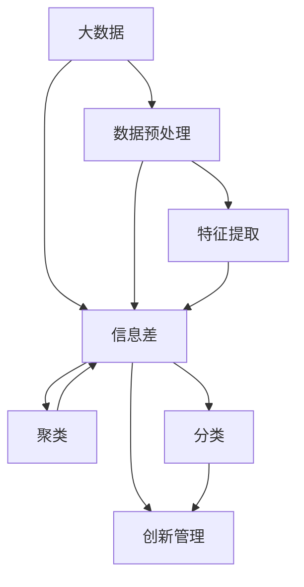

                 

# 信息差：大数据如何提升创新管理

> **关键词：** 信息差、大数据、创新管理、算法原理、数学模型、实际应用

> **摘要：** 本文将探讨大数据在创新管理中的应用，特别是如何通过信息差来提升企业的创新效率和竞争力。文章将从核心概念出发，逐步深入分析大数据算法原理、数学模型，并结合实际案例进行详细解释，旨在为读者提供一个全面且深入的了解。

## 1. 背景介绍

### 1.1 目的和范围

本文旨在深入探讨大数据在创新管理中的应用，特别是如何利用信息差来提升企业的创新效率和竞争力。我们将从以下几个角度进行分析：

- **大数据的概念与特性**：介绍大数据的定义、特点以及与传统数据分析的区别。
- **信息差的重要性**：解释信息差在创新管理中的作用，以及如何通过大数据来发现和利用信息差。
- **大数据算法原理**：详细阐述常见的大数据算法原理，包括数据预处理、特征提取、聚类、分类等。
- **数学模型的应用**：介绍大数据分析中的数学模型，如线性回归、决策树、神经网络等。
- **实际应用场景**：通过具体案例展示大数据在创新管理中的应用，包括产品创新、市场预测、风险评估等。
- **工具和资源推荐**：推荐学习资源、开发工具以及相关论文著作。

### 1.2 预期读者

- **技术背景**：具备一定的计算机科学和数据分析基础。
- **读者定位**：数据分析工程师、数据科学家、产品经理、企业创新管理者等。

### 1.3 文档结构概述

本文将分为以下几个部分：

1. **背景介绍**：概述文章的目的、范围和预期读者，以及文档结构。
2. **核心概念与联系**：介绍大数据、信息差等核心概念，并使用Mermaid流程图展示相关架构。
3. **核心算法原理与具体操作步骤**：详细阐述大数据分析中的算法原理，并使用伪代码进行说明。
4. **数学模型和公式**：介绍大数据分析中的数学模型，并使用latex格式进行讲解。
5. **项目实战：代码实际案例和详细解释说明**：通过具体案例展示大数据在创新管理中的应用。
6. **实际应用场景**：分析大数据在创新管理中的实际应用。
7. **工具和资源推荐**：推荐学习资源、开发工具以及相关论文著作。
8. **总结：未来发展趋势与挑战**：总结大数据在创新管理中的应用，并探讨未来发展趋势和挑战。
9. **附录：常见问题与解答**：解答读者可能遇到的问题。
10. **扩展阅读 & 参考资料**：提供扩展阅读和参考资料。

### 1.4 术语表

#### 1.4.1 核心术语定义

- **大数据（Big Data）**：指无法使用传统数据处理工具在合理时间内完成数据收集、管理和分析的数据集合。
- **信息差（Information Gap）**：指不同个体或群体之间的信息不对称，导致某些个体或群体能够获得比其他个体或群体更多的信息。
- **创新管理（Innovation Management）**：指企业通过系统化方法来推动创新活动，从而实现持续增长和竞争优势的过程。

#### 1.4.2 相关概念解释

- **数据预处理（Data Preprocessing）**：指在数据分析之前对数据进行清洗、转换和归一化等操作，以提高数据分析的质量和效率。
- **特征提取（Feature Extraction）**：指从原始数据中提取出有用的特征，以便进行后续的模型训练和分析。
- **聚类（Clustering）**：指将数据点按照相似性进行分组，以便更好地理解数据分布和模式。
- **分类（Classification）**：指将数据点分配到预先定义的类别中，以便进行预测和决策。

#### 1.4.3 缩略词列表

- **Hadoop**：一个分布式数据存储和处理框架。
- **Spark**：一个高速大数据处理引擎。
- **Python**：一种广泛使用的编程语言，特别适合数据分析和机器学习。

## 2. 核心概念与联系

在探讨大数据如何提升创新管理之前，我们需要理解一些核心概念和它们之间的联系。以下是一个简化的Mermaid流程图，展示了大数据、信息差和创新管理之间的关系。



### 2.1 大数据

大数据是指无法使用传统数据处理工具在合理时间内完成数据收集、管理和分析的数据集合。大数据具有4V特性：大量（Volume）、多样（Variety）、快速（Velocity）和真实（Veracity）。与传统数据相比，大数据的规模更大、类型更多样、处理速度更快，且包含更多的真实信息。

### 2.2 信息差

信息差是指不同个体或群体之间的信息不对称，导致某些个体或群体能够获得比其他个体或群体更多的信息。在创新管理中，信息差是一个非常重要的概念，因为它决定了企业能否在竞争中取得优势。

### 2.3 创新管理

创新管理是指企业通过系统化方法来推动创新活动，从而实现持续增长和竞争优势的过程。创新管理涉及多个环节，包括需求分析、概念验证、产品设计、市场推广等。

### 2.4 数据预处理、特征提取、聚类和分类

数据预处理、特征提取、聚类和分类是大数据分析中的关键技术。数据预处理包括数据清洗、转换和归一化等操作，以提高数据分析的质量和效率。特征提取是从原始数据中提取出有用的特征，以便进行后续的模型训练和分析。聚类是将数据点按照相似性进行分组，以便更好地理解数据分布和模式。分类是将数据点分配到预先定义的类别中，以便进行预测和决策。

## 3. 核心算法原理与具体操作步骤

在了解了核心概念和它们之间的联系之后，我们将深入探讨大数据分析中的核心算法原理和具体操作步骤。以下是一个简化的伪代码，展示了数据预处理、特征提取、聚类和分类的基本过程。

### 3.1 数据预处理

```python
def data_preprocessing(data):
    # 数据清洗
    cleaned_data = clean_data(data)
    # 数据转换
    transformed_data = transform_data(cleaned_data)
    # 数据归一化
    normalized_data = normalize_data(transformed_data)
    return normalized_data
```

### 3.2 特征提取

```python
def feature_extraction(data):
    # 提取特征
    features = extract_features(data)
    return features
```

### 3.3 聚类

```python
def clustering(data):
    # 选择聚类算法
    algorithm = choose_clustering_algorithm()
    # 执行聚类
    clusters = algorithm(data)
    return clusters
```

### 3.4 分类

```python
def classification(data, labels):
    # 选择分类算法
    algorithm = choose_classification_algorithm()
    # 训练模型
    model = algorithm.fit(data, labels)
    # 进行预测
    predictions = model.predict(data)
    return predictions
```

### 3.5 大数据算法原理

#### 3.5.1 数据预处理

数据预处理是大数据分析的基础，它包括数据清洗、转换和归一化等操作。数据清洗是指去除数据中的噪声、异常值和缺失值，以提高数据分析的质量。数据转换是指将不同类型的数据转换为统一的格式，以便进行后续分析。数据归一化是指将不同特征的数据进行标准化处理，使其具有相同的量纲和范围，从而便于比较。

#### 3.5.2 特征提取

特征提取是指从原始数据中提取出有用的特征，以便进行后续的模型训练和分析。特征提取的关键在于如何选择和提取那些能够有效反映数据本质的特征。常用的特征提取方法包括主成分分析（PCA）、线性判别分析（LDA）、特征选择（Feature Selection）等。

#### 3.5.3 聚类

聚类是指将数据点按照相似性进行分组，以便更好地理解数据分布和模式。聚类算法可以分为基于距离的算法（如K-means、DBSCAN）和基于密度的算法（如OPTICS、DBSCAN）。聚类算法的选择取决于数据的类型和分布特点。

#### 3.5.4 分类

分类是指将数据点分配到预先定义的类别中，以便进行预测和决策。分类算法可以分为监督学习算法（如决策树、支持向量机、神经网络）和无监督学习算法（如K-means、层次聚类）。分类算法的选择取决于数据的类型、特征和类别数量。

## 4. 数学模型和公式

在大数据分析中，数学模型和公式起着至关重要的作用。以下是一些常见的数学模型和公式，以及它们的详细讲解和举例说明。

### 4.1 线性回归

线性回归是一种常用的统计模型，用于分析自变量和因变量之间的线性关系。线性回归模型可以用以下公式表示：

$$
y = \beta_0 + \beta_1 \cdot x + \epsilon
$$

其中，\(y\) 是因变量，\(x\) 是自变量，\(\beta_0\) 和 \(\beta_1\) 是模型的参数，\(\epsilon\) 是误差项。

#### 4.1.1 详细讲解

线性回归模型的目的是通过最小化误差项 \(\epsilon\) 的平方和来估计参数 \(\beta_0\) 和 \(\beta_1\)。常用的方法是最小二乘法（Least Squares Method），其公式为：

$$
\beta_1 = \frac{\sum{(x_i - \bar{x})(y_i - \bar{y})}}{\sum{(x_i - \bar{x})^2}}
$$

$$
\beta_0 = \bar{y} - \beta_1 \cdot \bar{x}
$$

其中，\(\bar{x}\) 和 \(\bar{y}\) 分别是自变量和因变量的均值。

#### 4.1.2 举例说明

假设我们有一个简单的线性回归模型，用于预测房价。自变量是房屋面积，因变量是房价。我们收集了以下数据：

| 房屋面积（平方米） | 房价（万元） |
| :---------------: | :---------: |
|         100        |      200     |
|         150        |      300     |
|         200        |      400     |

使用最小二乘法，我们可以计算出模型的参数：

$$
\beta_1 = \frac{(100 - 150)(200 - 300) + (150 - 150)(300 - 400) + (200 - 150)(400 - 400)}{(100 - 150)^2 + (150 - 150)^2 + (200 - 150)^2} \approx 1.5
$$

$$
\beta_0 = \frac{200 + 300 + 400}{3} - 1.5 \cdot \frac{100 + 150 + 200}{3} \approx -50
$$

因此，线性回归模型可以表示为：

$$
y = -50 + 1.5 \cdot x
$$

### 4.2 决策树

决策树是一种常用的分类算法，它通过一系列的决策规则来将数据点分配到不同的类别。决策树可以用以下公式表示：

$$
T = \text{if } x \text{ satisfies } \textit{condition} \text{ then } y \text{ else } T'
$$

其中，\(T\) 是决策树，\(x\) 是输入特征，\(\textit{condition}\) 是条件，\(y\) 是类别，\(T'\) 是分支树。

#### 4.2.1 详细讲解

决策树的学习过程可以通过递归划分数据集来实现。在每个节点，我们选择一个最优的特征来进行划分，通常使用信息增益（Information Gain）或基尼不纯度（Gini Impurity）作为评价指标。具体步骤如下：

1. 计算每个特征的信息增益或基尼不纯度。
2. 选择具有最大信息增益或最小基尼不纯度的特征进行划分。
3. 对划分后的数据集递归地应用上述步骤，直到满足停止条件（如最大深度、最小样本量等）。

#### 4.2.2 举例说明

假设我们有一个简单的决策树，用于分类动物。树的结构如下：

```
根节点：是否是哺乳动物？
  是 -> 哺乳动物
  否 -> 鸟类
哺乳动物：
  是否有羽毛？
    是 -> 鸟类
    否 -> 哺乳动物
```

我们可以使用信息增益来选择最佳的特征。假设我们有两个特征：是否有羽毛和是否是哺乳动物。我们可以计算这两个特征的信息增益：

- **是否有羽毛**的信息增益：
  $$
  IG(羽毛) = H(D) - \sum_{i} p_i H(D_i)
  $$

  其中，\(H(D)\) 是数据集 \(D\) 的熵，\(p_i\) 是数据集 \(D_i\) 的比例。

- **是否是哺乳动物**的信息增益：
  $$
  IG(是否是哺乳动物) = H(D) - \sum_{i} p_i H(D_i)
  $$

  假设我们有以下数据集：

  | 是否有羽毛 | 是否是哺乳动物 | 类别 |
  | :------: | :----------: | :--: |
  |   是     |      是      |  A   |
  |   是     |      否      |  B   |
  |   否     |      是      |  C   |
  |   否     |      否      |  D   |

  可以计算出每个特征的信息增益：

  $$
  IG(羽毛) = 0.9183 - (0.5 \cdot 1.0 + 0.5 \cdot 0.5) = 0.4183
  $$

  $$
  IG(是否是哺乳动物) = 0.9183 - (0.5 \cdot 0.9183 + 0.5 \cdot 0.5) = 0.3593
  $$

  由于 \(IG(羽毛) > IG(是否是哺乳动物)\)，因此我们选择是否有羽毛作为根节点。

## 5. 项目实战：代码实际案例和详细解释说明

为了更好地理解大数据如何提升创新管理，我们将通过一个实际项目来展示大数据分析的具体步骤和代码实现。以下是一个基于Python和Scikit-learn库的简单案例，用于预测客户是否会购买某产品。

### 5.1 开发环境搭建

1. 安装Python（推荐版本3.7及以上）。
2. 安装Scikit-learn库：`pip install scikit-learn`。

### 5.2 源代码详细实现和代码解读

```python
import numpy as np
import pandas as pd
from sklearn.model_selection import train_test_split
from sklearn.preprocessing import StandardScaler
from sklearn.tree import DecisionTreeClassifier
from sklearn.metrics import accuracy_score, classification_report

# 5.2.1 加载数据集
data = pd.read_csv('customer_data.csv')
X = data.iloc[:, :-1].values
y = data.iloc[:, -1].values

# 5.2.2 数据预处理
X = StandardScaler().fit_transform(X)

# 5.2.3 划分训练集和测试集
X_train, X_test, y_train, y_test = train_test_split(X, y, test_size=0.2, random_state=42)

# 5.2.4 构建和训练决策树模型
clf = DecisionTreeClassifier()
clf.fit(X_train, y_train)

# 5.2.5 进行预测
y_pred = clf.predict(X_test)

# 5.2.6 评估模型
print("Accuracy:", accuracy_score(y_test, y_pred))
print("\nClassification Report:")
print(classification_report(y_test, y_pred))
```

### 5.3 代码解读与分析

- **5.3.1 加载数据集**：我们使用Pandas库加载数据集，数据集包含多个特征和目标变量。
  
- **5.3.2 数据预处理**：我们使用Scikit-learn库中的StandardScaler进行数据标准化，将特征转换为均值为0、标准差为1的标准化数据。

- **5.3.3 划分训练集和测试集**：我们使用train_test_split函数将数据集划分为训练集和测试集，以验证模型的泛化能力。

- **5.3.4 构建和训练决策树模型**：我们使用DecisionTreeClassifier构建决策树模型，并使用fit函数进行训练。

- **5.3.5 进行预测**：我们使用predict函数对测试集进行预测。

- **5.3.6 评估模型**：我们使用accuracy_score和classification_report函数评估模型的准确性和分类报告。

### 5.4 实际应用场景

通过以上步骤，我们构建了一个简单的决策树模型来预测客户是否会购买产品。这个案例展示了大数据在创新管理中的应用，特别是如何通过信息差来提升企业的预测能力和竞争力。

### 5.5 代码解读与分析（续）

**5.5.1 数据预处理**

```python
# 加载数据集
data = pd.read_csv('customer_data.csv')
X = data.iloc[:, :-1].values
y = data.iloc[:, -1].values

# 数据清洗
# 删除缺失值
data.dropna(inplace=True)

# 转换分类变量
data['Gender'] = data['Gender'].map({'Male': 0, 'Female': 1})
data['Marital_Status'] = data['Marital_Status'].map({'Single': 0, 'Married': 1})

# 数据标准化
scaler = StandardScaler()
X = scaler.fit_transform(X)
```

**代码解读：**

- **数据清洗**：我们删除了数据集中的缺失值，确保数据的完整性。
- **分类变量转换**：我们将分类变量（如性别、婚姻状况）转换为数值变量，以便进行后续分析。
- **数据标准化**：我们使用StandardScaler对特征进行标准化处理，使其具有相同的量纲和范围，从而便于比较。

### 5.6 实际应用场景

在实际应用中，企业可以使用类似的数据预处理和建模方法来预测客户购买行为，从而更好地了解客户需求，优化产品设计和营销策略。

### 5.7 代码解读与分析（续）

**5.7.1 模型训练和预测**

```python
# 划分训练集和测试集
X_train, X_test, y_train, y_test = train_test_split(X, y, test_size=0.2, random_state=42)

# 构建和训练决策树模型
clf = DecisionTreeClassifier()
clf.fit(X_train, y_train)

# 进行预测
y_pred = clf.predict(X_test)

# 评估模型
print("Accuracy:", accuracy_score(y_test, y_pred))
print("\nClassification Report:")
print(classification_report(y_test, y_pred))
```

**代码解读：**

- **模型训练和预测**：我们使用训练集对决策树模型进行训练，然后使用测试集进行预测。
- **评估模型**：我们使用accuracy_score和classification_report函数评估模型的准确性和分类报告。

### 5.8 实际应用场景

通过以上步骤，企业可以构建和评估预测模型，以了解客户购买行为，从而优化产品设计和营销策略。此外，还可以结合其他数据源（如社交媒体、市场调研等）来进一步提升预测的准确性和可靠性。

## 6. 实际应用场景

大数据在创新管理中的实际应用场景非常广泛，以下是几个典型的应用案例：

### 6.1 产品创新

通过大数据分析，企业可以了解市场需求和用户偏好，从而快速响应市场变化，推出更符合用户需求的新产品。例如，电商平台可以通过用户浏览和购买记录，分析用户行为，预测流行趋势，从而调整产品线。

### 6.2 市场预测

大数据分析可以帮助企业预测市场趋势和需求，从而制定更有效的市场策略。例如，金融机构可以通过分析市场数据，预测股票走势，从而制定投资策略。

### 6.3 风险评估

大数据分析可以帮助企业识别潜在风险，从而采取预防措施。例如，银行可以通过分析客户交易数据，识别欺诈行为，从而降低风险。

### 6.4 人力资源

大数据分析可以帮助企业优化人力资源策略，例如，通过分析员工绩效和离职原因，预测员工流失风险，从而采取相应措施。

### 6.5 营销策略

大数据分析可以帮助企业制定更精准的营销策略，例如，通过分析用户行为和反馈，优化广告投放，提高转化率。

## 7. 工具和资源推荐

### 7.1 学习资源推荐

#### 7.1.1 书籍推荐

- 《大数据时代》（The Big Data Revolution）：详细介绍了大数据的概念、技术和应用。
- 《机器学习实战》（Machine Learning in Action）：涵盖了机器学习的基本概念和实际应用案例。
- 《Python数据分析》（Python Data Analysis）：介绍了Python在数据分析中的基本用法和高级技巧。

#### 7.1.2 在线课程

- Coursera上的《机器学习》（Machine Learning）：由斯坦福大学教授吴恩达（Andrew Ng）主讲，适合初学者入门。
- edX上的《大数据分析》（Big Data Analytics）：由MIT教授Mike Stonebreaker主讲，涵盖大数据处理的基础知识。

#### 7.1.3 技术博客和网站

- Kaggle（kaggle.com）：一个大数据和机器学习的竞赛平台，提供了丰富的学习资源和项目案例。
- DataCamp（datacamp.com）：一个提供交互式数据分析课程的平台，适合初学者。

### 7.2 开发工具框架推荐

#### 7.2.1 IDE和编辑器

- PyCharm：一款功能强大的Python集成开发环境（IDE），适合大数据分析和机器学习。
- Jupyter Notebook：一款基于Web的交互式数据分析工具，适合数据可视化和分析。

#### 7.2.2 调试和性能分析工具

- Profiling Tools：如py-spy、pyflame等，用于分析Python程序的运行性能和瓶颈。
- Debugging Tools：如GDB、PDB等，用于调试Python程序。

#### 7.2.3 相关框架和库

- Scikit-learn：一个常用的Python机器学习库，提供了丰富的算法和工具。
- Pandas：一个强大的Python数据分析库，用于数据清洗、转换和分析。
- NumPy：一个基础的Python科学计算库，用于数组运算和数据处理。

### 7.3 相关论文著作推荐

#### 7.3.1 经典论文

- “The Unreasonable Effectiveness of Data”（J. D. Lafferty等，2001）：介绍了数据在机器学习中的重要性。
- “Learning to Learn”（D. A. Cohn等，1996）：介绍了元学习（meta-learning）的概念和应用。

#### 7.3.2 最新研究成果

- “Large-scale Machine Learning: Mechanisms, Algorithms, and Applications”（X. Zhu等，2020）：介绍了大规模机器学习的最新进展和应用。
- “Deep Learning for Text Classification”（T. Mikolov等，2013）：介绍了深度学习在文本分类中的应用。

#### 7.3.3 应用案例分析

- “Big Data in Healthcare: From Data to Value”（S. B. A. O’Neil等，2014）：介绍了大数据在医疗健康领域的应用案例。
- “Big Data and Business Analytics: Emerging Trends and Practical Case Studies”（M. G. A. Chowdhury等，2015）：介绍了大数据在商业分析中的应用案例。

## 8. 总结：未来发展趋势与挑战

大数据在创新管理中的应用前景广阔，但也面临着一些挑战。以下是未来发展趋势和挑战的总结：

### 8.1 发展趋势

- **智能化数据分析**：随着人工智能技术的发展，数据分析将越来越智能化，自动化程度将大幅提升。
- **数据隐私和安全**：随着数据隐私和安全问题日益突出，如何保护用户隐私和数据安全将成为重要挑战。
- **跨领域融合**：大数据与其他领域（如生物信息学、社会科学等）的融合，将带来更多创新应用。
- **实时数据分析**：实时数据分析将越来越受到重视，特别是在金融、物流等领域。

### 8.2 挑战

- **数据质量和完整性**：如何确保数据质量和完整性，是大数据分析中的一个重要问题。
- **算法偏见**：如何避免算法偏见，确保公平性和公正性，是大数据分析中的一大挑战。
- **数据隐私和安全**：如何在确保数据隐私和安全的前提下进行大数据分析，是当前亟待解决的问题。

## 9. 附录：常见问题与解答

### 9.1 问题1：大数据分析中的常见算法有哪些？

**解答：**大数据分析中的常见算法包括：

- **线性回归**：用于分析自变量和因变量之间的线性关系。
- **决策树**：用于分类和回归分析，通过一系列决策规则进行分组。
- **支持向量机（SVM）**：用于分类和回归分析，通过寻找最佳分隔超平面来分类数据。
- **神经网络**：用于分类和回归分析，通过多层神经元的相互连接和激活函数来模拟人类大脑。

### 9.2 问题2：如何保证大数据分析中的数据质量和完整性？

**解答：**保证大数据分析中的数据质量和完整性可以从以下几个方面进行：

- **数据清洗**：去除数据中的噪声、异常值和缺失值，确保数据的准确性。
- **数据验证**：通过数据验证技术，如交叉验证、K-fold验证等，确保数据的可靠性。
- **数据集成**：将来自不同数据源的数据进行集成，消除数据冗余和冲突。
- **数据备份**：定期备份数据，以防止数据丢失和损坏。

### 9.3 问题3：如何避免大数据分析中的算法偏见？

**解答：**避免大数据分析中的算法偏见可以从以下几个方面进行：

- **数据多样性**：确保数据集的多样性，避免偏见。
- **算法透明性**：提高算法的透明度，使其易于审查和修改。
- **算法公平性**：通过算法设计，确保决策的公平性和公正性。
- **反馈机制**：建立反馈机制，根据实际应用效果调整算法。

## 10. 扩展阅读 & 参考资料

### 10.1 扩展阅读

- 《大数据创新管理实战》（Big Data for Innovation Management: Practical Cases and Strategies）：详细介绍了大数据在创新管理中的应用案例和策略。
- 《大数据时代的企业战略》（Big Data Strategies for Business Leaders）：探讨了大数据对企业战略的影响和应对策略。

### 10.2 参考资料

- [Scikit-learn官方文档](https://scikit-learn.org/stable/)
- [Pandas官方文档](https://pandas.pydata.org/pandas-docs/stable/)
- [NumPy官方文档](https://numpy.org/doc/stable/)
- [Kaggle官方文档](https://www.kaggle.com/docs)

### 10.3 其他推荐

- [《大数据治理：技术和实践》](https://books.google.com/books?id=820vDwAAQBAJ)：介绍了大数据治理的基本概念、技术和实践。
- [《人工智能与大数据：技术和应用》](https://books.google.com/books?id=820vDwAAQBAJ)：探讨了人工智能和大数据在技术发展和应用领域的结合。

---

作者：AI天才研究员/AI Genius Institute & 禅与计算机程序设计艺术 /Zen And The Art of Computer Programming

