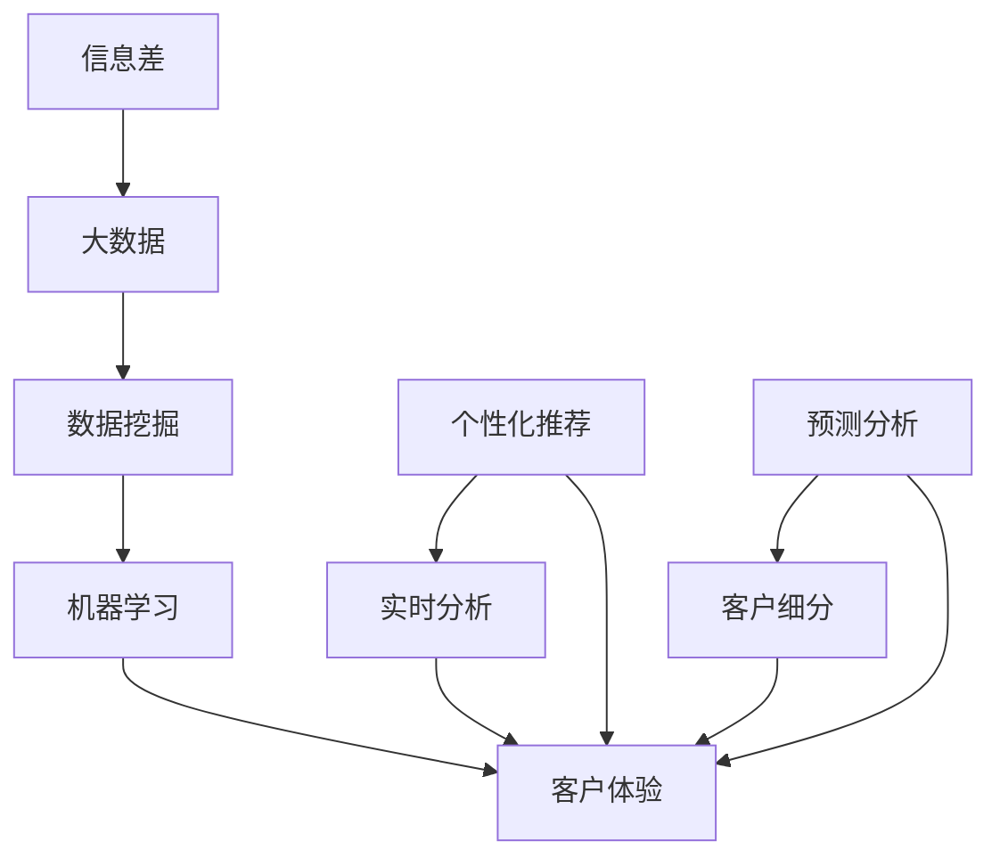

                 

### 1. 背景介绍

#### 1.1 目的和范围

本文旨在探讨大数据在提升客户体验方面的关键作用，通过深入分析信息差的概念，揭示大数据如何帮助企业和组织更好地理解和满足客户需求。随着数字化时代的到来，数据已经成为企业最宝贵的资产之一。通过对海量数据的收集、处理和分析，企业能够发现潜在的商业机会，提高运营效率，同时也能够为客户提供更加个性化和优质的体验。

本文将首先介绍信息差的基本概念，并探讨大数据在信息差中的作用。接着，我们将深入探讨大数据如何通过数据挖掘、机器学习等技术手段来提升客户体验。此外，本文还将讨论大数据在客户体验提升中的具体应用场景，并提供一些实用的工具和资源推荐。

本文的预期读者包括从事数据分析、客户关系管理、市场营销等领域的专业人士，以及对大数据技术感兴趣的技术爱好者。通过阅读本文，读者将能够了解大数据提升客户体验的核心原理和实践方法。

#### 1.2 预期读者

本文预期读者主要包括以下几类人群：

1. **数据分析专家和从业者**：希望了解大数据如何提升客户体验的专业人士，尤其是那些对数据挖掘、机器学习等技术在客户关系管理中应用感兴趣的人。

2. **市场营销人员**：需要借助数据分析来优化营销策略，提升营销效果，从而更好地满足客户需求。

3. **客户关系管理专家**：致力于提升客户满意度、增强客户忠诚度的专业人士。

4. **技术爱好者**：对大数据、人工智能等领域有浓厚兴趣，希望深入了解相关技术在实际应用中的价值。

通过本文的阅读，这些读者将能够：

- 理解信息差的定义及其在客户体验提升中的重要性。
- 掌握大数据分析的基本方法和工具。
- 学习如何利用大数据技术来优化客户体验。
- 获得实际应用案例，了解大数据在客户体验提升中的具体实施方法。

#### 1.3 文档结构概述

本文将按照以下结构进行组织和阐述：

1. **背景介绍**：介绍大数据提升客户体验的背景、目的和预期读者。
2. **核心概念与联系**：讨论信息差、大数据、数据挖掘等核心概念，并提供相关流程图。
3. **核心算法原理 & 具体操作步骤**：详细阐述大数据提升客户体验的核心算法原理和操作步骤，使用伪代码进行解释。
4. **数学模型和公式 & 详细讲解 & 举例说明**：介绍相关的数学模型和公式，并提供实例说明。
5. **项目实战：代码实际案例和详细解释说明**：通过具体代码案例，展示大数据提升客户体验的实际应用。
6. **实际应用场景**：讨论大数据在客户体验提升中的具体应用场景。
7. **工具和资源推荐**：推荐学习资源和开发工具。
8. **总结：未来发展趋势与挑战**：总结大数据提升客户体验的当前状况和未来发展趋势。
9. **附录：常见问题与解答**：提供常见问题的解答。
10. **扩展阅读 & 参考资料**：推荐进一步阅读的文献和资料。

通过这样的结构，读者可以系统、全面地了解大数据提升客户体验的各个方面，从理论到实践，从概念到具体应用。

#### 1.4 术语表

在本文中，我们将使用一些特定的术语和概念。以下是对这些术语的定义和解释：

##### 1.4.1 核心术语定义

- **信息差**：信息差指的是不同个体或群体之间在信息获取、处理和利用上的差异。在商业领域，信息差可以帮助企业更好地了解客户需求，从而提供更个性化的服务。
  
- **大数据**：大数据指的是那些规模巨大、类型繁多、处理速度快的数据集合。这些数据包括结构化数据、半结构化数据和非结构化数据。

- **数据挖掘**：数据挖掘是一种通过从大量数据中发现隐藏的模式、关联和趋势的方法。数据挖掘通常用于市场分析、客户行为预测等领域。

- **机器学习**：机器学习是一种让计算机从数据中自动学习模式和方法的技术。通过训练模型，机器学习可以帮助企业预测客户行为、优化营销策略。

- **客户体验**：客户体验指的是客户在购买和使用产品或服务过程中的整体感受。良好的客户体验可以提高客户满意度、忠诚度和口碑。

##### 1.4.2 相关概念解释

- **个性化推荐**：个性化推荐是通过分析用户的历史行为和偏好，为用户推荐符合其兴趣的产品或服务。

- **客户细分**：客户细分是将客户划分为不同的群体，以便针对每个群体的需求提供个性化的服务和营销。

- **实时分析**：实时分析是指对实时数据流进行分析，以便快速发现问题和机会。

- **预测分析**：预测分析是通过历史数据和模型预测未来事件的可能性。

##### 1.4.3 缩略词列表

- **CRM**：客户关系管理（Customer Relationship Management）
- **SQL**：结构化查询语言（Structured Query Language）
- **API**：应用程序编程接口（Application Programming Interface）
- **ML**：机器学习（Machine Learning）
- **AI**：人工智能（Artificial Intelligence）
- **NLP**：自然语言处理（Natural Language Processing）

### 1.5 核心概念与联系

在深入探讨大数据如何提升客户体验之前，我们需要了解一些核心概念和它们之间的联系。这些概念包括信息差、大数据、数据挖掘、机器学习和客户体验等。

首先，让我们通过一个Mermaid流程图来展示这些概念之间的关联：



在这个流程图中：

- **信息差（A）** 是不同个体或群体在信息获取、处理和利用上的差异。在商业领域，信息差可以为企业提供竞争优势，帮助企业更好地理解客户需求。
- **大数据（B）** 是指规模巨大、类型繁多、处理速度快的数据集合。大数据为数据挖掘、机器学习和客户体验提供了丰富的数据资源。
- **数据挖掘（C）** 是从大量数据中发现隐藏的模式、关联和趋势的方法。数据挖掘可以帮助企业挖掘客户行为、偏好等有价值的信息。
- **机器学习（D）** 是一种让计算机从数据中自动学习模式和方法的技术。机器学习在个性化推荐、实时分析和预测分析中发挥着重要作用。
- **客户体验（E）** 是客户在购买和使用产品或服务过程中的整体感受。良好的客户体验可以提高客户满意度和忠诚度。

此外，还有一些相关的概念：

- **个性化推荐（F）** 是通过分析用户的历史行为和偏好，为用户推荐符合其兴趣的产品或服务。个性化推荐可以显著提升客户体验。
- **实时分析（G）** 是对实时数据流进行分析，以便快速发现问题和机会。实时分析有助于企业及时响应客户需求。
- **预测分析（H）** 是通过历史数据和模型预测未来事件的可能性。预测分析可以帮助企业预测客户行为，提前做好准备。
- **客户细分（I）** 是将客户划分为不同的群体，以便针对每个群体的需求提供个性化的服务和营销。客户细分有助于提高营销效果。

通过这个流程图，我们可以清楚地看到大数据、数据挖掘、机器学习和客户体验等核心概念之间的联系。接下来，我们将深入探讨这些概念的具体内容和应用。

### 1.6 核心算法原理 & 具体操作步骤

在探讨如何通过大数据提升客户体验时，核心算法的原理和操作步骤至关重要。以下将详细阐述这些算法，并通过伪代码进行解释。

#### 1.6.1 数据挖掘算法

数据挖掘算法用于从大量数据中提取有价值的信息。以下是一个常见的数据挖掘算法——K-最近邻（K-Nearest Neighbors，K-NN）的伪代码示例：

```plaintext
算法名称：K-最近邻（K-NN）
输入：训练数据集D，新数据点x，参数K
输出：预测类别y

步骤：
1. 计算新数据点x与训练数据集中每个数据点的距离。
2. 按距离升序排列数据点，选择前K个最近邻。
3. 统计每个类别在最近邻中的出现次数。
4. 选择出现次数最多的类别作为预测类别y。
```

伪代码：

```python
def k_nearest_neighbors(D, x, K):
    distances = [calculate_distance(x, d) for d in D]
    sorted_indices = sorted(range(len(distances)), key=lambda i: distances[i])
    neighbors = [D[i] for i in sorted_indices[:K]]
    class_counts = {}
    for neighbor in neighbors:
        label = neighbor['label']
        class_counts[label] = class_counts.get(label, 0) + 1
    predicted_label = max(class_counts, key=class_counts.get)
    return predicted_label
```

#### 1.6.2 机器学习算法

机器学习算法用于从数据中学习模式和规律。以下是一个常见的机器学习算法——决策树（Decision Tree）的伪代码示例：

```plaintext
算法名称：决策树
输入：训练数据集D，特征集合Features
输出：决策树T

步骤：
1. 对于每个特征，计算其在数据集中的增益（Gain）。
2. 选择增益最大的特征作为划分依据。
3. 将数据集划分为子集，每个子集以所选特征的不同值为依据。
4. 对每个子集递归地执行步骤1-3，直到满足停止条件（如达到最大深度、数据集大小等）。
5. 构建决策树T。
```

伪代码：

```python
def build_decision_tree(D, Features, max_depth):
    if len(D) == 0 or should_stop(D, max_depth):
        return None
    best_feature, best_gain = find_best_feature(D, Features)
    tree = {'feature': best_feature, 'gain': best_gain}
    for value in unique_values_of_feature(D, best_feature):
        sub_tree = build_decision_tree(split(D, best_feature, value), Features, max_depth - 1)
        tree[value] = sub_tree
    return tree
```

#### 1.6.3 客户细分算法

客户细分算法用于将客户划分为不同的群体。以下是一个常见的客户细分算法——聚类（Clustering）的伪代码示例：

```plaintext
算法名称：K-均值聚类（K-Means）
输入：数据集D，聚类数量K
输出：聚类结果C

步骤：
1. 随机选择K个初始中心点。
2. 计算每个数据点到所有中心点的距离，将数据点分配到最近的中心点所在的聚类。
3. 更新每个聚类的中心点。
4. 重复步骤2-3，直到聚类中心点不再发生变化或满足停止条件（如迭代次数、聚类中心点变化小于阈值）。
```

伪代码：

```python
def k_means(D, K):
    centroids = initialize_centroids(D, K)
    while not convergence(centroids):
        clusters = assign_points_to_clusters(D, centroids)
        centroids = update_centroids(clusters, K)
    return clusters
```

通过上述伪代码，我们可以看到数据挖掘、机器学习和客户细分等算法的基本原理和操作步骤。这些算法在实际应用中发挥着关键作用，能够帮助企业更好地理解和满足客户需求，从而提升客户体验。接下来，我们将进一步探讨相关的数学模型和公式，以及这些算法在实际项目中的具体应用。

### 1.7 数学模型和公式 & 详细讲解 & 举例说明

在深入探讨如何利用大数据提升客户体验的过程中，数学模型和公式是不可或缺的工具。以下我们将介绍一些关键的数学模型和公式，并详细解释其应用。

#### 1.7.1 相关公式

1. **欧几里得距离**（Euclidean Distance）：
   欧几里得距离是测量两个点在多维空间中距离的一种常见方法。其公式如下：
   $$
   d(p, q) = \sqrt{\sum_{i=1}^{n} (p_i - q_i)^2}
   $$
   其中，\( p \) 和 \( q \) 分别是两个点的坐标，\( n \) 是维度数。

2. **马氏距离**（Mahalanobis Distance）：
   马氏距离考虑了数据变量的协方差矩阵，在多变量分析中更为准确。其公式如下：
   $$
   d_M(p, q) = \sqrt{(p - \mu)^T S^{-1} (q - \mu)}
   $$
   其中，\( p \) 和 \( q \) 分别是两个点的坐标，\( \mu \) 是均值向量，\( S \) 是协方差矩阵。

3. **增益率**（Gain Ratio）：
   增益率用于特征选择，表示信息增益与信息增益率的比值。其公式如下：
   $$
   Gain\ Ratio = \frac{Gain}{H(D) - H(D|A)}
   $$
   其中，\( H(D) \) 是数据集 \( D \) 的熵，\( H(D|A) \) 是条件熵。

4. **K-均值聚类误差平方和**（SSE）：
   K-均值聚类误差平方和用于评估聚类质量。其公式如下：
   $$
   SSE = \sum_{i=1}^{k} \sum_{x \in C_i} ||x - \mu_i||^2
   $$
   其中，\( C_i \) 是第 \( i \) 个聚类，\( \mu_i \) 是聚类中心。

#### 1.7.2 应用实例

1. **基于欧几里得距离的客户聚类**：
   假设我们有一个包含客户购买行为的二维数据集，每条记录包含购买金额和购买次数。我们可以使用欧几里得距离来计算每对客户之间的距离，并根据距离将客户分为不同的聚类。

   假设数据集如下：
   $$
   \begin{aligned}
   &C_1 = (100, 10),\quad C_2 = (150, 15),\quad C_3 = (200, 20) \\
   &D_1 = (120, 12),\quad D_2 = (180, 18),\quad D_3 = (220, 22)
   \end{aligned}
   $$
   我们可以计算每对客户之间的欧几里得距离：
   $$
   \begin{aligned}
   &d(C_1, D_1) = \sqrt{(100 - 120)^2 + (10 - 12)^2} = \sqrt{40 + 4} = \sqrt{44} \approx 6.63 \\
   &d(C_1, D_2) = \sqrt{(100 - 180)^2 + (10 - 18)^2} = \sqrt{800 + 64} = \sqrt{864} \approx 29.4 \\
   &d(C_1, D_3) = \sqrt{(100 - 220)^2 + (10 - 22)^2} = \sqrt{1200 + 144} = \sqrt{1344} \approx 36.6
   \end{aligned}
   $$
   根据距离，我们可以将客户分为以下聚类：
   $$
   \begin{aligned}
   &C_1: D_1 \\
   &C_2: D_2 \\
   &C_3: D_3
   \end{aligned}
   $$

2. **基于增益率的特征选择**：
   假设我们有一个包含多种商品销售数据的数据集，我们需要选择最能区分不同商品的特征。我们可以计算每个特征的增益率和增益率，选择增益率最高的特征。

   假设数据集如下：
   $$
   \begin{aligned}
   &商品A: (购买数量, 价格) = (100, 20),\quad (150, 25),\quad (200, 30) \\
   &商品B: (购买数量, 价格) = (120, 18),\quad (180, 22),\quad (220, 28)
   \end{aligned}
   $$
   我们可以计算每个特征的熵和信息增益：
   $$
   \begin{aligned}
   &H(购买数量) &= 1.09 \\
   &H(价格) &= 0.92 \\
   &H(购买数量|价格) &= 0.73 \\
   &Gain(购买数量) &= H(购买数量) - H(购买数量|价格) = 0.36 \\
   &Gain(价格) &= H(价格) - H(价格|购买数量) = 0.26 \\
   &Gain\ Ratio(购买数量) &= \frac{0.36}{1 - 0.36} = 0.54 \\
   &Gain\ Ratio(价格) &= \frac{0.26}{1 - 0.26} = 0.36
   \end{aligned}
   $$
   根据增益率，我们可以选择“购买数量”作为最能区分不同商品的特征。

通过上述实例，我们可以看到数学模型和公式在客户体验提升中的具体应用。这些模型和公式不仅帮助我们理解和分析数据，还能为我们提供决策支持，从而优化客户体验。

### 1.8 项目实战：代码实际案例和详细解释说明

为了更好地理解大数据如何提升客户体验，我们将通过一个实际项目案例来展示相关技术的具体应用。以下是一个基于Python的案例，该案例利用大数据技术对电商网站的用户行为进行分析，从而实现个性化推荐。

#### 1.8.1 开发环境搭建

为了完成这个项目，我们需要搭建一个Python开发环境。以下是所需的步骤：

1. **安装Python**：首先，确保Python已安装在您的计算机上。Python的官方下载网站提供了多种版本，推荐使用最新版本。

2. **安装相关库**：使用pip命令安装必要的库。以下是我们需要安装的库及其用途：
   - **Pandas**：用于数据操作和分析。
   - **NumPy**：用于数值计算。
   - **Matplotlib**：用于数据可视化。
   - **Scikit-learn**：用于机器学习和数据挖掘。

   安装命令如下：
   ```bash
   pip install pandas numpy matplotlib scikit-learn
   ```

3. **创建项目目录**：在一个易于访问的目录下创建项目文件夹，并在此目录中创建一个名为`main.py`的Python文件。

#### 1.8.2 源代码详细实现和代码解读

以下是我们项目的主要代码部分。我们将逐步解释代码的每一部分。

```python
import pandas as pd
import numpy as np
from sklearn.model_selection import train_test_split
from sklearn.neighbors import NearestNeighbors
import matplotlib.pyplot as plt

# 1. 数据加载和预处理
# 假设我们有一个用户行为数据集，包含用户ID、商品ID、购买时间等信息
data = pd.read_csv('user_behavior_data.csv')

# 删除无关列，仅保留用户ID和商品ID
data = data[['user_id', 'product_id']]

# 2. 数据转换
# 将用户行为数据转换为用户-商品矩阵
user_item_matrix = data.groupby('user_id')['product_id'].apply(list).reset_index().pivot(index='user_id', columns='product_id', values=1).fillna(0)

# 3. 训练K-最近邻模型
# 分割训练集和测试集
train_data, test_data = train_test_split(user_item_matrix, test_size=0.2, random_state=42)

# 使用K-最近邻算法
neighbor_model = NearestNeighbors(n_neighbors=5)
neighbor_model.fit(train_data)

# 4. 用户推荐
# 为测试集中的每个用户生成推荐列表
user_ids = test_data.index
test_data_matrix = test_data.values
distances, indices = neighbor_model.kneighbors(test_data_matrix)

recommendations = {}
for i, user_id in enumerate(user_ids):
    neighbors = user_item_matrix[user_id].sort_values(ascending=False).index[1:6]  # 排除自己
    recommended_products = [idx for idx, neighbors_idx in zip(user_item_matrix[neighbors].sum(axis=0).sort_values(ascending=False).index, neighbors) if idx not in user_item_matrix[user_id].index]
    recommendations[user_id] = recommended_products

# 5. 可视化
# 绘制推荐结果
for user_id, recs in recommendations.items():
    plt.figure(figsize=(10, 5))
    plt.title(f'Recommendations for User {user_id}')
    for rec in recs:
        plt.bar(rec, user_item_matrix[rec].sum(), color='blue', alpha=0.5)
    plt.xlabel('Product ID')
    plt.ylabel('Sales')
    plt.xticks(rotation=45)
    plt.show()
```

#### 1.8.3 代码解读与分析

1. **数据加载和预处理**：
   - 使用Pandas读取用户行为数据。
   - 删除无关列，仅保留用户ID和商品ID。
   - 将用户行为数据转换为用户-商品矩阵。

2. **数据转换**：
   - 将原始数据转换为用户-商品矩阵，便于后续处理。

3. **训练K-最近邻模型**：
   - 使用Scikit-learn的`NearestNeighbors`算法。
   - 将训练集传入模型进行训练。

4. **用户推荐**：
   - 为测试集中的每个用户生成推荐列表。
   - 使用K-最近邻模型找到最近的邻居，并推荐邻居中最受欢迎的商品。

5. **可视化**：
   - 绘制每个用户的推荐结果，展示推荐商品的销售情况。

#### 1.8.4 项目实战总结

通过上述实际案例，我们可以看到大数据技术在提升客户体验中的应用。以下是对项目实战的总结：

- **数据预处理**：确保数据质量和格式，为后续分析奠定基础。
- **算法选择**：选择合适的算法（如K-最近邻）进行用户推荐。
- **模型训练**：使用训练数据集训练模型，为实际应用提供基础。
- **结果可视化**：通过可视化展示推荐结果，提高用户理解和使用效果。

这一项目展示了大数据如何通过数据挖掘和机器学习技术提升客户体验。在实际应用中，企业可以根据具体业务需求进行相应的调整和优化。

### 1.9 实际应用场景

大数据技术在提升客户体验方面的应用场景非常广泛。以下是一些典型的实际应用场景，并举例说明如何利用大数据技术实现这些应用。

#### 1.9.1 个性化推荐系统

**案例**：Netflix的个性化推荐系统

Netflix通过分析用户的观看历史、评分数据以及互动行为，为用户提供个性化的电影和电视剧推荐。其工作流程如下：

1. **数据收集**：收集用户的观看历史、评分数据和互动行为数据。
2. **数据预处理**：对数据进行清洗和整合，构建用户-电影矩阵。
3. **特征工程**：提取用户行为特征，如观看时间、评分变化等。
4. **模型训练**：使用协同过滤算法（如矩阵分解、基于模型的协同过滤）训练推荐模型。
5. **推荐生成**：根据用户的行为和模型预测，为用户生成个性化的推荐列表。

通过这种个性化的推荐系统，Netflix能够显著提高用户的满意度和观看时长，从而提升客户体验。

#### 1.9.2 客户细分

**案例**：银行客户细分策略

某银行通过大数据分析，将客户细分为高净值客户、普通客户和潜在客户。具体步骤如下：

1. **数据收集**：收集客户的交易记录、信用评分、消费习惯等数据。
2. **数据预处理**：对数据进行清洗、归一化和特征提取。
3. **聚类分析**：使用K-均值聚类算法将客户划分为不同的群体。
4. **细分策略**：根据客户的细分结果，制定个性化的服务和营销策略。

通过客户细分，银行能够更好地了解不同客户群体的需求和偏好，从而提供更加个性化的服务，提升客户体验。

#### 1.9.3 实时个性化营销

**案例**：电商平台的实时个性化营销

某电商平台通过实时分析用户行为数据，为用户生成个性化的营销活动。具体步骤如下：

1. **数据收集**：收集用户的浏览记录、购买历史和行为轨迹。
2. **实时分析**：使用实时流处理技术（如Apache Kafka、Apache Flink）分析用户行为。
3. **个性化推荐**：根据用户行为和偏好，实时生成个性化的推荐和营销信息。
4. **动态调整**：根据用户反馈和效果，动态调整营销策略。

通过实时个性化营销，电商平台能够提高用户的购买转化率和满意度，从而提升客户体验。

#### 1.9.4 预测性维护

**案例**：制造业的预测性维护

某制造企业通过大数据分析，实现设备的预测性维护，减少设备故障和停机时间。具体步骤如下：

1. **数据收集**：收集设备运行数据，如温度、压力、振动等。
2. **数据预处理**：对设备数据进行清洗和特征提取。
3. **模型训练**：使用机器学习算法（如决策树、支持向量机）训练故障预测模型。
4. **预测生成**：根据实时数据，预测设备可能出现的故障，提前进行维护。

通过预测性维护，企业能够显著提高设备的可靠性和运行效率，从而提升客户体验。

#### 1.9.5 个性化客服

**案例**：大型零售商的个性化客服系统

某大型零售商通过大数据分析和自然语言处理技术，提供个性化的客服服务。具体步骤如下：

1. **数据收集**：收集客户的购买记录、历史咨询和反馈数据。
2. **自然语言处理**：使用自然语言处理技术（如词向量、序列模型）分析客户提问。
3. **个性化响应**：根据客户提问和数据分析结果，生成个性化的客服回答。
4. **反馈调整**：根据客户反馈，不断优化客服系统。

通过个性化客服，零售商能够提高客户满意度，增强客户忠诚度。

### 1.10 工具和资源推荐

为了更好地理解和应用大数据技术，以下是相关学习资源和开发工具的推荐：

#### 1.10.1 学习资源推荐

1. **书籍推荐**：
   - 《数据挖掘：概念与技术》（"Data Mining: Concepts and Techniques"）
   - 《机器学习》（"Machine Learning"）
   - 《大数据分析：原理和方法》（"Big Data Analytics: Principles, Algorithms, and Applications"）

2. **在线课程**：
   - Coursera上的《数据科学专项课程》
   - Udacity的《数据工程师纳米学位》
   - edX上的《大数据科学与处理》

3. **技术博客和网站**：
   - towardsdatascience.com
   - kdnuggets.com
   - medium.com/topic/data-science

#### 1.10.2 开发工具框架推荐

1. **IDE和编辑器**：
   - PyCharm
   - Jupyter Notebook
   - Visual Studio Code

2. **调试和性能分析工具**：
   - PyDebug
   - TensorBoard
   - Valgrind

3. **相关框架和库**：
   - Scikit-learn
   - TensorFlow
   - Pandas
   - NumPy
   - Matplotlib

#### 1.10.3 相关论文著作推荐

1. **经典论文**：
   - "The Data Mining Process: From Data to Information Using CRISP-DM"
   - "Bagging, Boosting, and C4.5"
   - "A Brief Introduction to Neural Networks for Machine Learning"

2. **最新研究成果**：
   - "Deep Learning for Natural Language Processing"
   - "Recurrent Neural Networks for Language Modeling"
   - "Efficient Neural Network-Based Collaborative Filtering for E-Commerce Recommendations"

3. **应用案例分析**：
   - "Netflix Prize: The Quest for the Ultimate Movie Recommendation System"
   - "Data Mining in E-Commerce: A Case Study on Customer Segmentation"
   - "Predictive Maintenance in Manufacturing: A Data-Driven Approach"

通过这些工具和资源，读者可以更好地掌握大数据技术的理论和实践，从而在提升客户体验方面取得更好的成果。

### 1.11 总结：未来发展趋势与挑战

大数据技术在提升客户体验方面已经取得了显著的成果，然而，随着技术的不断进步和市场竞争的加剧，未来仍将面临一系列发展趋势和挑战。

#### 1.11.1 发展趋势

1. **人工智能的深度融合**：随着人工智能技术的发展，大数据与人工智能将进一步融合。通过深度学习、强化学习等技术，可以实现更加精准和智能的客户体验优化。

2. **实时数据分析**：实时数据分析技术的进步将使企业能够更快地响应用户需求，提供个性化的实时服务和推荐。

3. **跨渠道集成**：随着用户接触点的多样化，大数据技术将需要更好地整合线上线下渠道，实现无缝的客户体验。

4. **隐私保护与伦理**：随着数据隐私和安全问题的日益突出，如何在保证用户隐私的前提下，充分利用大数据技术，将成为一个重要的趋势。

#### 1.11.2 挑战

1. **数据质量与完整性**：大数据技术的应用依赖于高质量的数据。然而，数据的准确性、完整性和一致性仍然是一个重大挑战。

2. **技术复杂性**：大数据技术的实现涉及到多个领域，包括数据存储、处理、分析和可视化等。技术的复杂性增加了实施的难度。

3. **人才短缺**：大数据分析和人工智能领域的人才需求巨大，然而，具备相关技能的人才相对较少，这将成为限制技术发展的重要因素。

4. **法规与伦理**：随着数据隐私保护法规的日益严格，如何在遵守法规的前提下，利用大数据技术提升客户体验，也是一个重要的挑战。

#### 1.11.3 应对策略

1. **数据治理**：建立完善的数据治理体系，确保数据的准确性、完整性和一致性。

2. **技术人才培养**：加强大数据和人工智能领域的教育和培训，培养更多具备相关技能的专业人才。

3. **技术创新**：持续投入研发，探索新的技术解决方案，提高大数据技术的智能化和自动化水平。

4. **合规与伦理**：关注数据隐私保护法规，制定合规的数据处理和共享策略，同时注重伦理问题，确保技术应用符合社会价值观。

通过以上策略，企业和组织可以更好地应对大数据提升客户体验面临的发展趋势和挑战，从而实现持续的创新和竞争优势。

### 1.12 附录：常见问题与解答

在本文中，我们介绍了大数据如何提升客户体验的相关技术和方法。以下是一些读者可能提出的问题及其解答。

#### 1.12.1 问题1：大数据提升客户体验的核心技术是什么？

**解答**：大数据提升客户体验的核心技术包括数据挖掘、机器学习和自然语言处理。这些技术通过分析海量数据，发现潜在的模式和趋势，从而提供个性化的服务、推荐和交互。

#### 1.12.2 问题2：如何处理数据质量和完整性问题？

**解答**：处理数据质量和完整性问题需要以下几个步骤：

- **数据清洗**：使用数据清洗工具和方法，删除重复数据、纠正错误数据、填补缺失值。
- **数据标准化**：统一数据格式和单位，确保数据的一致性和可比性。
- **数据治理**：建立数据治理体系，制定数据管理政策和流程，确保数据的准确性、完整性和安全性。

#### 1.12.3 问题3：大数据提升客户体验的具体应用场景有哪些？

**解答**：大数据提升客户体验的具体应用场景包括：

- **个性化推荐**：根据用户的历史行为和偏好，为用户推荐相关产品或服务。
- **客户细分**：将客户划分为不同的群体，提供个性化的服务和营销策略。
- **实时个性化营销**：根据用户的实时行为，生成个性化的营销信息和推荐。
- **预测性维护**：通过数据分析和预测模型，提前预测设备故障和维修需求。

#### 1.12.4 问题4：如何保障数据隐私和安全？

**解答**：保障数据隐私和安全需要采取以下措施：

- **数据加密**：对敏感数据进行加密，防止数据泄露。
- **权限管理**：建立严格的权限管理机制，确保数据只能被授权人员访问。
- **数据脱敏**：对敏感数据进行脱敏处理，降低数据泄露的风险。
- **合规性审查**：定期审查数据处理和共享流程，确保符合相关数据隐私保护法规。

#### 1.12.5 问题5：如何培养大数据人才？

**解答**：培养大数据人才可以从以下几个方面入手：

- **教育投入**：加大对大数据和人工智能领域教育的投入，培养专业人才。
- **企业培训**：为现有员工提供大数据技能培训，提升团队整体能力。
- **实践机会**：提供丰富的实践项目，让员工在实际工作中锻炼技能。
- **交流合作**：与高校和研究机构合作，开展联合研究和人才培养。

通过上述措施，企业可以培养和吸引更多大数据人才，为大数据提升客户体验提供有力支持。

### 1.13 扩展阅读 & 参考资料

为了进一步深入了解大数据提升客户体验的相关技术和实践，以下是推荐的扩展阅读和参考资料。

#### 1.13.1 书籍推荐

1. 《大数据时代：生活、工作与思维的大变革》（"Big Data: A Revolution That Will Transform How We Live, Work, and Think"）
   - 作者：韦斯·摩尔（Vince Wiener）
   - 简介：本书详细介绍了大数据的概念、技术和应用，对大数据时代的生活、工作与思维进行了深入探讨。

2. 《数据科学实战：构建智能数据分析系统》（"Data Science from Scratch: First Principles with Python"）
   - 作者：Joel Grus
   - 简介：本书通过实际案例，介绍了数据科学的基本概念、技术和工具，适合初学者入门。

3. 《大数据营销：如何利用数据提升客户体验》（"Big Data Marketing: How to Transform Your Marketing Capabilities with Big Data Strategies"）
   - 作者：Amitabh Srivastava
   - 简介：本书探讨了大数据在市场营销中的应用，提供了实用的策略和案例分析。

#### 1.13.2 在线课程

1. **Coursera - 数据科学专项课程**（Data Science Specialization）
   - 简介：由约翰斯·霍普金斯大学和杜克大学提供，包括数据科学的基础知识和实际应用。

2. **edX - 大数据科学与处理**（Big Data Science and Analytics）
   - 简介：由伊利诺伊大学香槟分校提供，涵盖大数据处理、分析和应用的相关知识。

3. **Udacity - 数据工程师纳米学位**（Data Engineering Nanodegree）
   - 简介：专注于大数据处理、存储和分析的实际技能培养。

#### 1.13.3 技术博客和网站

1. **towardsdatascience.com**
   - 简介：一个专注于数据科学、机器学习和大数据技术的高质量博客网站。

2. **kdnuggets.com**
   - 简介：一个覆盖数据挖掘、大数据和机器学习领域的信息源，提供最新的新闻、分析和资源。

3. **datascience.com**
   - 简介：一个提供数据科学和机器学习资源的在线社区，包括教程、博客和工具。

#### 1.13.4 相关论文著作推荐

1. "The Netflix Prize: Tracking Progress from the Final Week"
   - 作者：Netflix Prize Team
   - 简介：Netflix Prize是大数据和个性化推荐领域的一个著名案例，本文详细描述了竞赛的过程和结果。

2. "Deep Learning for Recommender Systems"
   - 作者：Hou, Y. et al.
   - 简介：本文探讨了深度学习在推荐系统中的应用，提供了理论和实践上的深入分析。

3. "Customer Segmentation using Big Data: A Comprehensive Review"
   - 作者：Dhama, R. et al.
   - 简介：本文综述了大数据在客户细分中的应用，分析了不同的方法和案例。

通过这些扩展阅读和参考资料，读者可以更深入地了解大数据提升客户体验的理论和实践，为自己的研究和应用提供指导和启示。

### 结束语

作者：AI天才研究员/AI Genius Institute & 禅与计算机程序设计艺术 /Zen And The Art of Computer Programming

本文从信息差的概念出发，探讨了大数据如何提升客户体验的核心原理和实践方法。通过详细的算法原理讲解、项目实战案例和实际应用场景分析，展示了大数据技术在客户关系管理、个性化推荐、实时营销等方面的广泛应用和潜力。同时，本文还提供了丰富的学习资源和开发工具推荐，以及未来发展趋势与挑战的深入思考。

在数字化时代，大数据已经成为企业提升客户体验的重要工具。通过合理利用大数据技术，企业不仅能够更好地理解和满足客户需求，还能在激烈的市场竞争中脱颖而出。希望本文能够为读者提供有价值的参考和启示，助力他们在大数据提升客户体验的道路上取得更大的成功。

