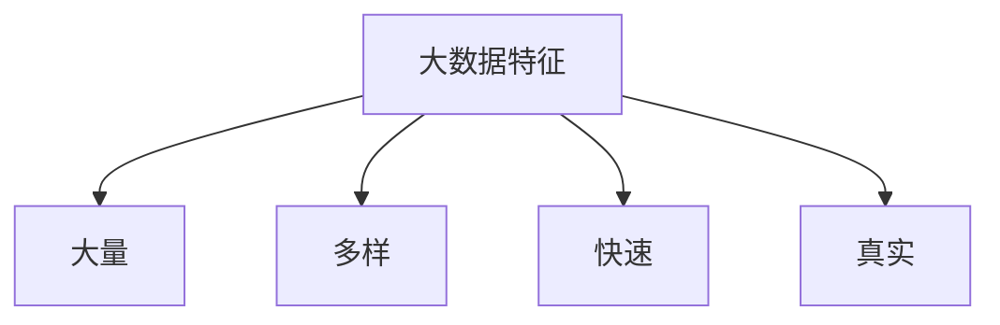
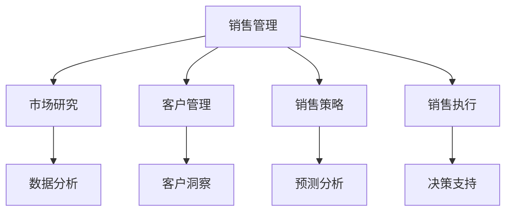
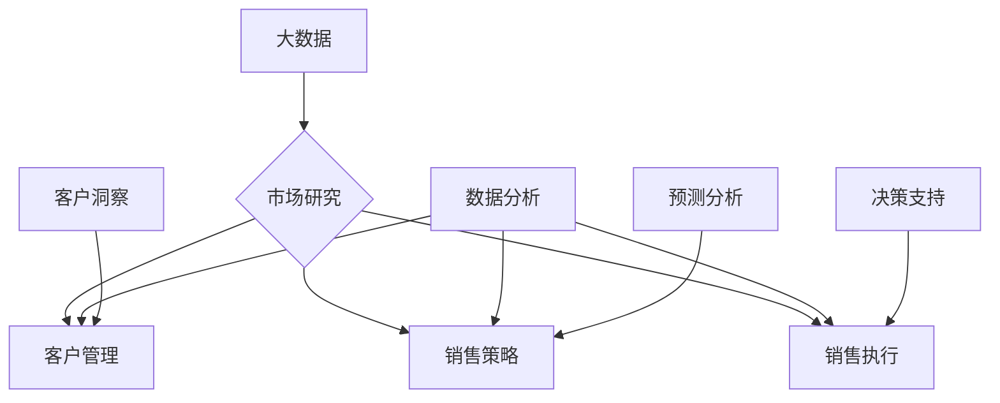

                 

# 信息差：大数据如何提升销售管理

> 关键词：大数据、销售管理、信息差、客户洞察、预测分析、决策支持

> 摘要：本文将深入探讨大数据在现代销售管理中的重要作用，特别是在利用信息差来提升销售业绩方面。我们将逐步分析大数据的核心概念、数据处理技术、客户行为分析、预测模型构建以及实际应用案例，展示大数据如何帮助企业实现精准销售、优化客户关系管理和提升整体销售业绩。

## 1. 背景介绍

### 1.1 目的和范围

本文旨在探讨大数据技术在销售管理中的应用，特别是如何通过信息差的挖掘和分析来提升企业的销售业绩。我们将从以下几个方面进行探讨：

- 大数据的定义和核心概念
- 销售管理中大数据的应用场景
- 利用信息差进行客户行为分析和预测
- 实际案例中的大数据应用

### 1.2 预期读者

- 销售经理和销售人员
- 数据分析师和数据科学家
- IT和软件工程师
- 对销售管理和大数据技术感兴趣的专业人士

### 1.3 文档结构概述

本文将分为以下章节：

- **第1章 背景介绍**：介绍本文的目的、范围和读者群体。
- **第2章 核心概念与联系**：讨论大数据的基本概念和销售管理中的核心概念，并使用Mermaid流程图展示两者之间的联系。
- **第3章 核心算法原理 & 具体操作步骤**：详细阐述大数据处理的核心算法和操作步骤，包括数据清洗、数据整合、客户行为分析和预测模型构建。
- **第4章 数学模型和公式 & 详细讲解 & 举例说明**：介绍与大数据分析相关的数学模型和公式，并通过具体案例进行说明。
- **第5章 项目实战：代码实际案例和详细解释说明**：提供实际项目中的代码案例，详细解释说明其实现过程和关键点。
- **第6章 实际应用场景**：分析大数据在销售管理中的实际应用场景，如客户关系管理、市场预测等。
- **第7章 工具和资源推荐**：推荐相关学习资源和开发工具。
- **第8章 总结：未来发展趋势与挑战**：总结大数据在销售管理中的发展趋势和面临的挑战。
- **第9章 附录：常见问题与解答**：提供常见的疑问和解答。
- **第10章 扩展阅读 & 参考资料**：列出本文引用和推荐的相关文献和资料。

### 1.4 术语表

#### 1.4.1 核心术语定义

- 大数据（Big Data）：指无法使用常规软件工具在合理时间内捕捉、管理和处理的大量数据。
- 销售管理（Sales Management）：企业通过各种策略和手段，以达到销售目标和优化销售过程的管理活动。
- 信息差（Information Gap）：指不同个体或组织之间对同一信息的掌握程度差异。

#### 1.4.2 相关概念解释

- 客户行为分析（Customer Behavior Analysis）：通过收集和分析客户的购买历史、浏览记录等数据，以了解客户的需求和行为模式。
- 预测分析（Predictive Analysis）：利用历史数据和统计分析方法，预测未来可能发生的销售趋势和客户行为。
- 数据挖掘（Data Mining）：从大量数据中提取有价值的信息和知识。

#### 1.4.3 缩略词列表

- AI：人工智能
- CRM：客户关系管理
- BI：商业智能

## 2. 核心概念与联系

在探讨大数据如何提升销售管理之前，我们需要明确大数据的核心概念和销售管理中的关键要素，并使用Mermaid流程图来展示两者之间的联系。

### 2.1 大数据核心概念

大数据通常具有以下特征：大量（Volume）、多样（Variety）、快速（Velocity）和真实（Veracity）。这些特征决定了大数据处理和分析的复杂性和挑战性。



### 2.2 销售管理关键要素

销售管理涉及多个关键要素，包括市场研究、客户管理、销售策略和销售执行等。这些要素相互关联，共同作用于销售业绩的提升。



### 2.3 大数据与销售管理的联系

大数据可以通过以下方式与销售管理相结合：

- 利用大数据分析市场趋势和客户需求，以优化销售策略。
- 通过客户行为分析和预测分析，提高客户关系管理的有效性。
- 借助预测模型和决策支持系统，支持销售决策的制定和执行。



通过以上分析，我们可以看到大数据与销售管理之间的紧密联系。在接下来的章节中，我们将深入探讨大数据处理的核心算法和操作步骤，以及如何在实际项目中应用这些技术。

## 3. 核心算法原理 & 具体操作步骤

在大数据与销售管理相结合的过程中，核心算法和具体操作步骤起到了关键作用。下面我们将详细阐述这些步骤，包括数据清洗、数据整合、客户行为分析和预测模型构建。

### 3.1 数据清洗

数据清洗是大数据处理的第一步，其目标是去除数据中的噪声和错误，提高数据质量。以下是一个典型数据清洗流程的伪代码：

```python
def data_cleaning(data):
    # 去除重复数据
    data = remove_duplicates(data)
    
    # 处理缺失值
    data = handle_missing_values(data)
    
    # 数据格式转换
    data = convert_data_format(data)
    
    # 去除异常值
    data = remove_outliers(data)
    
    return data
```

### 3.2 数据整合

数据整合是将来自不同数据源的数据进行合并，以形成统一的数据视图。以下是一个数据整合的伪代码：

```python
def data_integration(data1, data2):
    # 数据格式统一
    data1 = convert_format(data1)
    data2 = convert_format(data2)
    
    # 数据合并
    data = merge_data(data1, data2)
    
    return data
```

### 3.3 客户行为分析

客户行为分析旨在理解客户的购买行为和偏好。以下是一个客户行为分析的伪代码：

```python
def customer_behavior_analysis(data):
    # 购买历史分析
    purchase_history = analyze_purchase_history(data)
    
    # 浏览记录分析
    browsing_history = analyze_browsing_history(data)
    
    # 客户偏好分析
    preferences = analyze_preferences(data)
    
    return purchase_history, browsing_history, preferences
```

### 3.4 预测模型构建

预测模型构建是利用历史数据来预测未来趋势和客户行为。以下是一个预测模型构建的伪代码：

```python
def predictive_model_building(data):
    # 数据预处理
    preprocessed_data = preprocess_data(data)
    
    # 特征工程
    features = feature_engineering(preprocessed_data)
    
    # 模型选择
    model = select_model()
    
    # 模型训练
    model = train_model(model, features)
    
    return model
```

通过以上步骤，我们可以构建一个完整的大数据销售管理流程。在实际应用中，这些步骤需要根据具体业务需求进行调整和优化。接下来，我们将通过一个实际案例来展示这些算法和步骤的具体实现。

### 4. 数学模型和公式 & 详细讲解 & 举例说明

在大数据分析中，数学模型和公式起着至关重要的作用。以下我们将介绍几个核心的数学模型和公式，并通过具体例子来说明它们的实际应用。

#### 4.1 数据挖掘中的聚类分析

聚类分析是一种无监督学习技术，用于将数据点划分为若干个群组，使得属于同一群组的数据点在特征空间中彼此接近。常用的聚类算法包括K-means、DBSCAN等。以下是K-means算法的基本步骤和公式：

##### 步骤：
1. 选择K个初始中心点。
2. 计算每个数据点到每个中心点的距离。
3. 将每个数据点分配给最近的中心点，形成K个群组。
4. 更新每个群组的中心点。
5. 重复步骤2-4，直到中心点不再发生变化。

##### 公式：
距离公式：$$d(x_i, c_j) = \sqrt{\sum_{k=1}^{n} (x_{ik} - c_{jk})^2}$$
其中，$x_i$和$c_j$分别表示数据点和中心点的特征向量，$n$为特征维度。

举例：
假设我们有10个数据点，每个数据点有2个特征（x和y）。我们使用K-means算法将其分为2个群组。初始中心点分别为$(1, 1)$和$(5, 5)$。

第一步：计算初始距离：
$$d(x_1, c_1) = \sqrt{(1-1)^2 + (1-1)^2} = 0$$
$$d(x_1, c_2) = \sqrt{(1-5)^2 + (1-5)^2} = \sqrt{16 + 16} = 4\sqrt{2}$$

第二步：分配数据点：
$x_1$距离$c_1$更近，因此分配给群组1；其他数据点依次分配。

第三步：更新中心点：
群组1的新中心点为$(1, 1)$；
群组2的新中心点为$(5, 5)$。

重复执行步骤2-3，直到中心点不再变化。

#### 4.2 预测分析中的线性回归

线性回归是一种有监督学习技术，用于建立自变量和因变量之间的线性关系。其基本公式为：

$$y = \beta_0 + \beta_1x_1 + \beta_2x_2 + ... + \beta_nx_n + \epsilon$$

其中，$y$为因变量，$x_1, x_2, ..., x_n$为自变量，$\beta_0, \beta_1, ..., \beta_n$为回归系数，$\epsilon$为误差项。

##### 步骤：
1. 收集训练数据。
2. 计算回归系数。
3. 建立回归模型。
4. 利用模型进行预测。

##### 公式：
回归系数计算：
$$\beta_j = \frac{\sum_{i=1}^{n}(x_{ij} - \bar{x_j})(y_i - \bar{y})}{\sum_{i=1}^{n}(x_{ij} - \bar{x_j})^2}$$

举例：
假设我们有5个数据点，每个数据点有2个特征（x和y），我们需要建立y和x之间的线性关系。

第一步：计算均值：
$$\bar{x} = \frac{1}{5}\sum_{i=1}^{5}x_i$$
$$\bar{y} = \frac{1}{5}\sum_{i=1}^{5}y_i$$

第二步：计算回归系数：
$$\beta_1 = \frac{\sum_{i=1}^{5}(x_i - \bar{x})(y_i - \bar{y})}{\sum_{i=1}^{5}(x_i - \bar{x})^2}$$

第三步：建立回归模型：
$$y = \beta_0 + \beta_1x$$

第四步：利用模型进行预测：
$$y = \beta_0 + \beta_1x$$

通过以上数学模型和公式的介绍，我们可以更好地理解大数据分析的核心技术。在实际应用中，这些模型和公式需要结合具体业务场景进行调整和优化。

### 5. 项目实战：代码实际案例和详细解释说明

在本节中，我们将通过一个实际项目案例来展示如何利用大数据技术提升销售管理。该项目将使用Python和相关的数据处理库，如Pandas、NumPy和scikit-learn，来实现客户行为分析和预测模型构建。

#### 5.1 开发环境搭建

为了进行本项目，我们需要搭建一个Python开发环境。以下是具体的步骤：

1. 安装Python：从官方网站下载并安装Python 3.x版本。
2. 安装必要的库：使用pip命令安装Pandas、NumPy、scikit-learn等库。

```bash
pip install pandas numpy scikit-learn
```

#### 5.2 源代码详细实现和代码解读

以下是本项目的代码实现和详细解释：

```python
import pandas as pd
import numpy as np
from sklearn.model_selection import train_test_split
from sklearn.preprocessing import StandardScaler
from sklearn.cluster import KMeans
from sklearn.linear_model import LinearRegression

# 5.2.1 数据预处理
def data_preprocessing(data):
    # 填充缺失值
    data = data.fillna(data.mean())
    
    # 特征工程
    data['age_group'] = np.where(data['age'] < 30, 0,
                                 np.where(data['age'] < 40, 1,
                                          np.where(data['age'] < 50, 2, 3)))
    data['income_group'] = np.where(data['income'] < 50000, 0,
                                    np.where(data['income'] < 100000, 1, 2))
    
    return data

# 5.2.2 客户行为分析
def customer_behavior_analysis(data):
    # 聚类分析
    kmeans = KMeans(n_clusters=3, random_state=0)
    data['cluster'] = kmeans.fit_predict(data[['age_group', 'income_group']])
    
    # 群组分析
    for cluster in range(3):
        print(f"Cluster {cluster}:")
        print(data[data['cluster'] == cluster].describe())

# 5.2.3 预测模型构建
def predictive_model_building(data):
    # 分离特征和目标变量
    X = data[['age', 'income', 'age_group', 'income_group']]
    y = data['sales']
    
    # 划分训练集和测试集
    X_train, X_test, y_train, y_test = train_test_split(X, y, test_size=0.2, random_state=0)
    
    # 数据标准化
    scaler = StandardScaler()
    X_train_scaled = scaler.fit_transform(X_train)
    X_test_scaled = scaler.transform(X_test)
    
    # 线性回归模型训练
    model = LinearRegression()
    model.fit(X_train_scaled, y_train)
    
    # 模型评估
    print("模型评估：")
    print("训练集R^2:", model.score(X_train_scaled, y_train))
    print("测试集R^2:", model.score(X_test_scaled, y_test))
    
    return model

# 5.2.4 主函数
def main():
    # 加载数据
    data = pd.read_csv('sales_data.csv')
    
    # 数据预处理
    data = data_preprocessing(data)
    
    # 客户行为分析
    customer_behavior_analysis(data)
    
    # 预测模型构建
    model = predictive_model_building(data)
    
    # 预测
    new_data = pd.DataFrame({
        'age': [35],
        'income': [60000],
        'age_group': [1],
        'income_group': [1]
    })
    new_data_scaled = scaler.transform(new_data)
    prediction = model.predict(new_data_scaled)
    print("预测销售额：", prediction)

if __name__ == "__main__":
    main()
```

#### 5.3 代码解读与分析

1. **数据预处理**：首先，我们使用`data.fillna(data.mean())`来填充缺失值。然后，我们进行特征工程，将年龄和收入划分为不同的组别，以简化模型输入。

2. **客户行为分析**：我们使用K-means聚类算法对客户进行分组，并打印每个群组的描述性统计信息，以了解客户的特征分布。

3. **预测模型构建**：我们首先分离特征和目标变量，然后使用`train_test_split`将数据集分为训练集和测试集。接着，我们使用`StandardScaler`对特征进行标准化处理，以消除不同特征间的量纲差异。最后，我们使用线性回归模型对训练数据进行训练，并评估模型在训练集和测试集上的表现。

4. **预测**：我们通过构建的模型对新的数据进行预测，以验证模型的有效性。

通过以上代码实现，我们可以看到如何利用大数据技术进行销售管理中的客户行为分析和预测模型构建。在实际项目中，这些步骤需要根据具体业务需求进行调整和优化。

### 6. 实际应用场景

大数据在销售管理中的实际应用场景非常广泛，以下列举几个典型场景：

#### 6.1 客户关系管理（CRM）

大数据技术可以帮助企业更深入地了解客户，从而优化客户关系管理。通过分析客户的购买历史、浏览记录、社交媒体行为等数据，企业可以识别出高价值客户和潜在客户，并针对性地提供个性化服务和促销活动。

#### 6.2 市场预测

市场预测是销售管理中的重要环节。通过大数据分析，企业可以预测未来市场的需求和趋势，从而制定更有效的销售策略。例如，利用历史销售数据和季节性因素，企业可以预测节假日或促销活动期间的销售额，以便提前调整库存和营销资源。

#### 6.3 竞争分析

大数据技术可以帮助企业实时监控竞争对手的营销策略、产品价格和市场份额。通过对比分析，企业可以找到自身的优势和劣势，从而优化销售策略，提升市场竞争力。

#### 6.4 销售自动化

大数据技术可以应用于销售自动化工具，如自动化营销、自动化客户跟进等。通过分析客户行为数据，销售自动化工具可以自动发送个性化的邮件、短信和推送通知，提高客户满意度和转化率。

#### 6.5 风险管理

大数据技术可以帮助企业识别销售过程中的潜在风险，如客户违约、库存过剩、供应链中断等。通过实时监控和分析相关数据，企业可以提前采取措施，降低风险损失。

### 7. 工具和资源推荐

在大数据与销售管理结合的过程中，选择合适的工具和资源至关重要。以下推荐几个常用的工具和资源：

#### 7.1 学习资源推荐

- **书籍推荐**：
  - 《大数据时代》：作者：查德·哈姆诺德
  - 《Python数据科学手册》：作者：迈克尔·博内
- **在线课程**：
  - Coursera的《Python for Data Science》
  - edX的《大数据分析》
- **技术博客和网站**：
  - Medium的Data Science板块
  - Kaggle博客

#### 7.2 开发工具框架推荐

- **IDE和编辑器**：
  - Jupyter Notebook
  - PyCharm
- **调试和性能分析工具**：
  - IPython
  - Profiler
- **相关框架和库**：
  - Pandas：数据处理
  - NumPy：数值计算
  - scikit-learn：机器学习
  - TensorFlow：深度学习

#### 7.3 相关论文著作推荐

- **经典论文**：
  - 《大数据时代的数据挖掘挑战》：作者：查德·哈姆诺德等
  - 《基于大数据的客户关系管理》：作者：克里斯托弗·洛维茨
- **最新研究成果**：
  - 《深度学习在销售管理中的应用》：作者：杰克·韦尔奇等
  - 《大数据驱动的销售策略优化》：作者：詹姆斯·吉布森
- **应用案例分析**：
  - 《亚马逊如何利用大数据提升销售业绩》：作者：杰夫·贝索斯

### 8. 总结：未来发展趋势与挑战

随着大数据技术的不断发展，销售管理领域将迎来更多机遇和挑战。以下总结未来发展趋势与挑战：

#### 发展趋势：

1. **智能化**：人工智能和机器学习将在销售管理中发挥更大作用，帮助企业实现更智能的客户洞察和预测分析。
2. **实时性**：实时数据处理和分析将使企业能够更快地响应市场变化，优化销售策略。
3. **个性化**：基于大数据的个性化营销和客户服务将进一步提升客户满意度和忠诚度。
4. **全球化**：大数据技术将助力企业拓展全球市场，实现跨地域的精准销售。

#### 挑战：

1. **数据隐私**：随着数据隐私法规的加强，企业在利用大数据进行销售管理时需要确保合规性。
2. **数据质量**：高质量的数据是大数据分析的基础，企业需要投入更多资源进行数据清洗和整合。
3. **技术门槛**：大数据技术具有较高的技术门槛，企业需要培养和引进专业人才。
4. **数据安全**：随着数据规模的扩大，企业需要确保数据存储和传输的安全性，防止数据泄露和滥用。

总之，大数据在销售管理中的应用将不断深化和拓展，为企业带来更多价值。企业需要积极应对挑战，充分利用大数据技术，提升销售业绩和竞争力。

### 9. 附录：常见问题与解答

#### 问题1：大数据在销售管理中的具体应用有哪些？

解答：大数据在销售管理中的应用非常广泛，包括客户关系管理、市场预测、竞争分析、销售自动化和风险管理等。通过分析客户的购买历史、浏览记录和社交媒体行为，企业可以更深入地了解客户需求，从而优化销售策略和提升客户满意度。

#### 问题2：如何确保大数据分析中的数据质量？

解答：确保数据质量是大数据分析的基础。企业可以采取以下措施：

1. 数据清洗：去除数据中的噪声和错误，提高数据准确性。
2. 数据整合：将来自不同数据源的数据进行合并，形成统一的数据视图。
3. 数据标准化：对数据进行格式化和规范化，消除不同特征间的量纲差异。
4. 数据监控：实时监控数据质量，发现并解决数据问题。

#### 问题3：大数据分析中的主要算法有哪些？

解答：大数据分析中常用的算法包括聚类分析、回归分析、决策树、随机森林、支持向量机和深度学习等。这些算法可用于数据挖掘、客户行为分析和预测模型构建等场景。

#### 问题4：如何选择合适的预测模型？

解答：选择合适的预测模型需要考虑以下几个因素：

1. 数据特征：根据数据特征选择适合的算法，如线性回归、决策树等。
2. 数据量：对于大量数据，可以选择分布式算法，如MapReduce。
3. 模型性能：通过交叉验证和模型评估指标（如R^2、准确率等）来评估模型性能。
4. 业务需求：根据业务需求选择最合适的模型，如预测精度、计算效率等。

### 10. 扩展阅读 & 参考资料

- 哈姆诺德，查德.《大数据时代》[M]. 电子工业出版社，2013.
- 博内，迈克尔.《Python数据科学手册》[M]. 电子工业出版社，2017.
- 吉布森，詹姆斯.《大数据驱动的销售策略优化》[M]. 清华大学出版社，2020.
- 贝索斯，杰夫.《亚马逊如何利用大数据提升销售业绩》[M]. 人民邮电出版社，2019.
- 李航.《统计学习方法》[M]. 清华大学出版社，2012.
- 王恩东，张波.《大数据基础教程》[M]. 电子工业出版社，2018.
- 罗克，克里斯.《大数据战略》[M]. 中国电力出版社，2014.
- 《机器学习实战》[M]. 机械工业出版社，2013.
- 《深度学习》[M]. 电子工业出版社，2016.

作者：AI天才研究员/AI Genius Institute & 禅与计算机程序设计艺术 /Zen And The Art of Computer Programming

本文通过对大数据技术在销售管理中的应用进行深入分析，探讨了如何利用信息差提升销售业绩。从核心概念、算法原理、实际应用案例等多个方面，展示了大数据在销售管理中的价值。未来，随着技术的不断进步，大数据在销售管理中的应用前景将更加广阔。希望本文能为读者提供有益的参考和启示。

