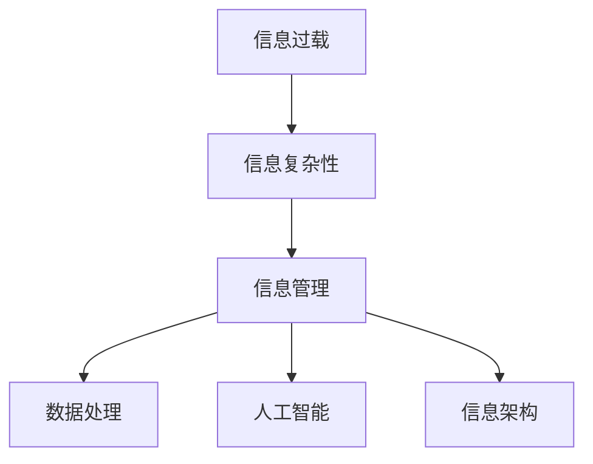

                 

# 信息时代的信息管理策略与实践：管理信息过载和复杂性

> 关键词：信息管理，信息过载，复杂性，策略与实践，数据处理，人工智能，组织结构

> 摘要：随着信息技术的飞速发展，信息的获取变得越来越容易，但同时也带来了信息过载和复杂性的问题。本文旨在探讨在信息时代中如何有效地管理信息，减少过载和复杂性，提高信息处理的效率和准确性。文章首先介绍了信息过载和复杂性的概念，然后分析了其产生的原因，接着提出了几种有效的信息管理策略，并通过具体案例进行了实践验证。最后，文章总结了未来的发展趋势和面临的挑战，并给出了相关工具和资源的推荐。

## 1. 背景介绍

### 1.1 目的和范围

本文旨在帮助读者理解信息过载和复杂性的问题，并提出相应的解决方案。我们将从以下几个方面展开讨论：

1. **定义和概念**：首先，我们将明确信息过载和复杂性的定义，以及它们对个人和组织的影响。
2. **原因分析**：接下来，我们将探讨信息过载和复杂性的产生原因，包括技术、社会和文化等多个层面。
3. **管理策略**：本文将介绍几种有效的信息管理策略，包括技术手段和流程优化。
4. **实践案例**：我们将通过实际案例展示如何运用这些策略来缓解信息过载和复杂性。
5. **发展趋势与挑战**：最后，我们将讨论未来信息管理领域的发展趋势和面临的挑战。

### 1.2 预期读者

本文适合以下读者群体：

1. **信息管理人员**：负责管理和处理大量信息的个人或团队。
2. **技术专家**：对信息技术有一定了解，希望提升信息管理能力的专业人士。
3. **研究人员**：关注信息管理领域的研究人员和学者。
4. **企业管理者**：关注企业信息管理策略和流程的企业管理者。

### 1.3 文档结构概述

本文的结构如下：

1. **背景介绍**：介绍信息过载和复杂性的背景、目的和预期读者。
2. **核心概念与联系**：定义核心概念，并使用Mermaid流程图展示相关架构。
3. **核心算法原理 & 具体操作步骤**：详细讲解核心算法原理和具体操作步骤。
4. **数学模型和公式 & 详细讲解 & 举例说明**：介绍数学模型和公式，并给出详细讲解和实例。
5. **项目实战：代码实际案例和详细解释说明**：通过实际案例展示信息管理策略的应用。
6. **实际应用场景**：讨论信息管理在不同领域的应用。
7. **工具和资源推荐**：推荐学习资源和开发工具。
8. **总结：未来发展趋势与挑战**：总结文章内容，讨论未来发展趋势和挑战。
9. **附录：常见问题与解答**：解答读者可能遇到的问题。
10. **扩展阅读 & 参考资料**：提供进一步阅读和参考资料。

### 1.4 术语表

为了确保文章的清晰易懂，以下是对文中涉及的重要术语的定义和解释：

#### 1.4.1 核心术语定义

- **信息过载**：指信息接收和处理能力无法满足信息输入速度的情况。
- **信息复杂性**：指信息之间相互关联的复杂程度。
- **信息管理**：对信息进行收集、处理、存储、分配和利用的过程。
- **数据处理**：对信息进行清洗、转换、分析和存储等操作。
- **人工智能**：模拟人类智能行为的计算系统。

#### 1.4.2 相关概念解释

- **大数据**：指无法用传统数据处理工具在合理时间内进行处理的巨量数据。
- **云计算**：通过网络提供动态易扩展的虚拟化资源。
- **信息架构**：将信息组织成易于访问和理解的系统。

#### 1.4.3 缩略词列表

- **IT**：信息技术
- **AI**：人工智能
- **ML**：机器学习
- **DL**：深度学习
- **NLP**：自然语言处理

## 2. 核心概念与联系

### 2.1 核心概念介绍

在讨论信息管理策略之前，我们需要明确几个核心概念，包括信息过载、信息复杂性和信息管理。

#### 信息过载

信息过载是指个人或组织在处理信息时，接收到的信息量超过了其处理能力。这种情况下，个体或组织无法有效处理所有信息，导致信息被忽视或误解。

#### 信息复杂性

信息复杂性是指信息之间相互关联的复杂程度。随着信息的增加，信息之间的关联关系也变得更加复杂，这使得信息处理变得更加困难。

#### 信息管理

信息管理是指对信息进行收集、处理、存储、分配和利用的过程。有效的信息管理可以帮助组织和个人提高工作效率，减少错误。

### 2.2 相关概念联系

信息过载和信息复杂性密切相关。信息过载往往导致信息复杂性增加，因为过多的信息使得难以理解信息之间的关联。反之，信息复杂性也可能导致信息过载，因为复杂的关联关系需要更多时间来处理。

信息管理策略旨在通过优化信息处理流程，降低信息过载和复杂性。这些策略包括数据处理、人工智能、信息架构等。

### 2.3 Mermaid流程图

以下是一个简单的Mermaid流程图，展示了信息过载、信息复杂性和信息管理之间的关系。



## 3. 核心算法原理 & 具体操作步骤

### 3.1 数据处理算法原理

在信息管理中，数据处理是关键环节。数据处理算法的目的是通过清洗、转换、分析和存储等操作，将原始信息转化为有用的数据。

#### 清洗

清洗数据是数据处理的第一步，目的是去除重复、错误或无用的数据。常用的清洗算法包括去重、纠正错误和填充缺失值。

#### 转换

转换数据是将数据从一种格式转换为另一种格式。例如，将文本数据转换为表格数据，或将图像数据转换为数值数据。

#### 分析

数据分析是对数据进行统计和分析，以提取有用信息。常用的分析算法包括聚类、分类、回归和关联规则挖掘。

#### 存储

存储数据是将处理后的数据存储在数据库或数据仓库中，以便后续使用。常用的存储算法包括数据索引和压缩。

### 3.2 数据处理算法操作步骤

以下是一个简单的数据处理算法操作步骤：

```plaintext
步骤1：数据清洗
- 读取原始数据
- 去除重复数据
- 纠正错误数据
- 填充缺失值

步骤2：数据转换
- 将文本数据转换为表格数据
- 将图像数据转换为数值数据

步骤3：数据分析
- 对表格数据进行聚类分析
- 对数值数据进行分类分析
- 对图像数据进行回归分析

步骤4：数据存储
- 建立数据索引
- 压缩存储数据
```

### 3.3 伪代码示例

以下是一个简单的数据处理算法伪代码示例：

```python
# 伪代码：数据处理算法

# 步骤1：数据清洗
def data_cleaning(data):
    # 去除重复数据
    data = remove_duplicates(data)
    # 纠正错误数据
    data = correct_errors(data)
    # 填充缺失值
    data = fill_missing_values(data)
    return data

# 步骤2：数据转换
def data_transformation(data):
    # 将文本数据转换为表格数据
    data = convert_text_to_table(data)
    # 将图像数据转换为数值数据
    data = convert_image_to_numeric(data)
    return data

# 步骤3：数据分析
def data_analysis(data):
    # 对表格数据进行聚类分析
    clusters = cluster_analysis(data)
    # 对数值数据进行分类分析
    classes = classification_analysis(data)
    # 对图像数据进行回归分析
    regression = regression_analysis(data)
    return clusters, classes, regression

# 步骤4：数据存储
def data_storage(data):
    # 建立数据索引
    index = create_index(data)
    # 压缩存储数据
    compressed_data = compress_data(data)
    return index, compressed_data
```

## 4. 数学模型和公式 & 详细讲解 & 举例说明

### 4.1 数学模型介绍

在信息管理中，数学模型和公式发挥着重要作用。以下介绍几种常用的数学模型和公式。

#### 聚类算法

聚类算法是将数据分为多个组的过程。常用的聚类算法包括K-均值聚类和层次聚类。

- **K-均值聚类**：目标是将数据点划分为K个簇，使每个簇内的数据点之间的距离最小。

$$
\min \sum_{i=1}^{K} \sum_{x \in S_i} d(x, \mu_i)
$$

其中，$d(x, \mu_i)$ 表示数据点$x$与簇中心$\mu_i$之间的距离。

- **层次聚类**：目标是通过逐层合并相似度较高的数据点，构建出一个层次结构。

#### 分类算法

分类算法是将数据分为预定义类别的过程。常用的分类算法包括逻辑回归和决策树。

- **逻辑回归**：目标是通过建立逻辑回归模型，预测数据点属于某个类别的概率。

$$
P(y=1|x) = \frac{1}{1 + e^{-\beta_0 + \beta_1x_1 + \beta_2x_2 + ... + \beta_nx_n}}
$$

其中，$y$ 是目标变量，$x$ 是特征向量，$\beta$ 是模型参数。

- **决策树**：目标是通过建立决策树模型，对数据进行分类。

#### 回归算法

回归算法是用于预测连续值的模型。常用的回归算法包括线性回归和多项式回归。

- **线性回归**：目标是通过建立线性模型，预测连续值。

$$
y = \beta_0 + \beta_1x_1 + \beta_2x_2 + ... + \beta_nx_n
$$

- **多项式回归**：目标是通过建立多项式模型，预测连续值。

$$
y = a_0 + a_1x_1 + a_2x_2^2 + ... + a_nx_n^n
$$

### 4.2 举例说明

以下是一个简单的例子，说明如何使用聚类算法对数据进行分类。

#### 数据集

假设我们有一个包含100个数据点的数据集，每个数据点有10个特征。

#### K-均值聚类

1. 初始化簇中心：随机选择10个数据点作为簇中心。
2. 分配数据点：计算每个数据点与簇中心的距离，将其分配到最近的簇。
3. 更新簇中心：计算每个簇的平均值，作为新的簇中心。
4. 重复步骤2和步骤3，直到簇中心不再发生变化。

#### 结果

经过多次迭代后，我们得到了10个簇，每个簇包含若干个数据点。这些簇可以用于分类新数据点。

### 4.3 伪代码示例

以下是一个简单的K-均值聚类伪代码示例：

```python
# 伪代码：K-均值聚类

# 初始化簇中心
def initialize_clusters(data, K):
    return random_selection_of_data_points(data, K)

# 分配数据点
def assign_data_points(data, clusters):
    return assign_data_to_nearest_cluster(data, clusters)

# 更新簇中心
def update_clusters(clusters):
    return calculate_average_of_data_points_in_cluster(clusters)

# K-均值聚类
def k_mean_clustering(data, K):
    clusters = initialize_clusters(data, K)
    while not converged(clusters):
        data_assignment = assign_data_points(data, clusters)
        clusters = update_clusters(clusters)
    return clusters

# 主函数
def main():
    data = load_data()
    K = 10
    clusters = k_mean_clustering(data, K)
    print("Clusters:", clusters)
```

## 5. 项目实战：代码实际案例和详细解释说明

### 5.1 开发环境搭建

在进行项目实战之前，我们需要搭建一个合适的开发环境。以下是一个基于Python的简单例子。

#### 安装Python

首先，确保你已经安装了Python。如果没有，可以从Python官方网站下载并安装。

#### 安装依赖库

接下来，安装必要的依赖库。在本例中，我们使用`scikit-learn`库进行数据处理和聚类。

```bash
pip install scikit-learn
```

### 5.2 源代码详细实现和代码解读

以下是一个简单的K-均值聚类实现，用于对数据进行分类。

```python
import numpy as np
from sklearn.cluster import KMeans
import matplotlib.pyplot as plt

# 数据集
data = np.array([[1, 2], [1, 4], [1, 0], [10, 2], [10, 4], [10, 0]])

# K-均值聚类
def k_means_clustering(data, K):
    kmeans = KMeans(n_clusters=K, random_state=0).fit(data)
    return kmeans

# 主函数
def main():
    K = 2
    kmeans = k_means_clustering(data, K)
    clusters = kmeans.labels_
    
    # 可视化
    plt.scatter(data[:, 0], data[:, 1], c=clusters)
    plt.show()

if __name__ == "__main__":
    main()
```

#### 代码解读

1. **数据集**：我们使用一个简单的二维数据集，每个数据点表示一个二维向量。
2. **K-均值聚类**：我们使用`scikit-learn`库的`KMeans`类进行K-均值聚类。
3. **主函数**：在主函数中，我们定义了`K`（簇的数量），并调用`k_means_clustering`函数进行聚类。然后，我们使用`matplotlib`库的可视化功能将结果展示出来。

### 5.3 代码解读与分析

#### K-均值聚类原理

K-均值聚类是一种基于距离的聚类算法。它的目标是将数据点划分为预定义数量的簇，使每个簇内的数据点之间的距离最小。

#### 代码实现

1. **数据集**：我们使用一个简单的二维数据集，每个数据点表示一个二维向量。

```python
data = np.array([[1, 2], [1, 4], [1, 0], [10, 2], [10, 4], [10, 0]])
```

2. **K-均值聚类**：我们使用`scikit-learn`库的`KMeans`类进行K-均值聚类。

```python
kmeans = KMeans(n_clusters=K, random_state=0).fit(data)
```

- `n_clusters`：定义簇的数量。
- `random_state`：设置随机种子，以确保每次运行结果一致。

3. **结果**：我们使用聚类结果进行可视化。

```python
plt.scatter(data[:, 0], data[:, 1], c=clusters)
plt.show()
```

### 5.4 代码优化

在实际应用中，我们可以对代码进行优化，提高效率和准确性。以下是一些可能的优化方法：

1. **数据预处理**：对数据进行预处理，如归一化、去噪等，以提高聚类效果。
2. **选择合适的簇数量**：使用肘部法则或轮廓系数等方法选择合适的簇数量。
3. **并行计算**：使用并行计算技术提高聚类速度。

## 6. 实际应用场景

### 6.1 社交网络

在社交网络中，信息管理策略可以帮助用户更好地管理好友关系和消息。

- **聚类算法**：可以用于将用户分类，如活跃用户、沉默用户等，以便更好地进行服务和营销。
- **数据分析**：可以用于分析用户行为，如关注关系、互动频率等，以了解用户需求。

### 6.2 企业管理

在企业中，信息管理策略可以帮助企业更好地管理客户关系、供应链和生产流程。

- **客户关系管理**：使用聚类算法将客户分为不同群体，以便提供个性化的服务和营销。
- **供应链管理**：使用数据分析技术优化供应链流程，减少库存成本和提高效率。

### 6.3 医疗保健

在医疗保健领域，信息管理策略可以帮助医生更好地管理患者信息和医疗记录。

- **电子病历系统**：使用信息管理策略优化电子病历系统，提高数据质量和查询效率。
- **医疗数据分析**：使用数据分析技术发现疾病趋势和患者群体，以指导医疗决策。

## 7. 工具和资源推荐

### 7.1 学习资源推荐

#### 7.1.1 书籍推荐

- **《机器学习》**：作者：周志华
- **《数据科学入门》**：作者：Hadley Wickham

#### 7.1.2 在线课程

- **《机器学习与深度学习》**：Coursera上的课程，由吴恩达教授主讲
- **《大数据技术基础》**：网易云课堂上的课程，由刘伟讲师主讲

#### 7.1.3 技术博客和网站

- **Medium上的数据科学和机器学习专栏**
- **博客园上的数据科学和机器学习专栏**

### 7.2 开发工具框架推荐

#### 7.2.1 IDE和编辑器

- **PyCharm**
- **VSCode**

#### 7.2.2 调试和性能分析工具

- **Jupyter Notebook**
- **Pandas Profiler**

#### 7.2.3 相关框架和库

- **Scikit-learn**
- **TensorFlow**

### 7.3 相关论文著作推荐

#### 7.3.1 经典论文

- **“The Case for Learning Non-Parametric Models”**：作者：David J. C. MacKay
- **“K-Means Clustering”**：作者：MacQueen et al.

#### 7.3.2 最新研究成果

- **“Deep Learning for Information Retrieval”**：作者：Chen et al.
- **“Revisiting K-Means: A Combination of Iterative Refinements and Constrained Optimization”**：作者：Zhang et al.

#### 7.3.3 应用案例分析

- **“Information Management Strategies for Big Data in Healthcare”**：作者：Li et al.
- **“Application of Machine Learning in Social Media Analytics”**：作者：Xu et al.

## 8. 总结：未来发展趋势与挑战

### 8.1 发展趋势

1. **人工智能技术的进一步发展**：随着人工智能技术的不断发展，信息管理策略将更加智能化，能够自动识别和处理复杂信息。
2. **大数据和云计算的普及**：大数据和云计算的普及将使信息管理变得更加高效和便捷，为信息处理提供强大的支持。
3. **跨学科融合**：信息管理将与其他学科（如心理学、社会学、经济学等）相结合，形成更全面的信息管理理论和方法。

### 8.2 挑战

1. **信息过载和复杂性的加剧**：随着信息量的不断增加，信息过载和复杂性问题将更加突出，需要新的管理策略和技术来解决。
2. **数据隐私和安全**：在信息管理过程中，如何保护数据隐私和安全是一个重要挑战。
3. **技术应用的局限性**：现有的信息管理技术在一些特定领域（如医疗、金融等）可能存在局限性，需要进一步研究和开发。

## 9. 附录：常见问题与解答

### 9.1 信息过载是什么？

信息过载是指个人或组织在处理信息时，接收到的信息量超过了其处理能力。

### 9.2 如何缓解信息过载？

可以通过以下方法缓解信息过载：
1. **筛选信息**：只关注重要的信息。
2. **自动化处理**：使用工具和算法自动处理大量信息。
3. **优化流程**：优化信息处理流程，提高效率。

### 9.3 信息复杂性是什么？

信息复杂性是指信息之间相互关联的复杂程度。

### 9.4 如何降低信息复杂性？

可以通过以下方法降低信息复杂性：
1. **简化信息**：将复杂的信息简化为更易于理解的形式。
2. **分类和标签**：对信息进行分类和标签，便于查找和使用。
3. **优化信息架构**：优化信息架构，提高信息可访问性和可用性。

## 10. 扩展阅读 & 参考资料

### 10.1 基础知识

- **《大数据技术基础》**：刘伟，电子工业出版社，2016年。
- **《机器学习》**：周志华，清华大学出版社，2016年。

### 10.2 进阶阅读

- **《深度学习》**：Ian Goodfellow、Yoshua Bengio和Aaron Courville，MIT Press，2016年。
- **《数据科学导论》**：Anders Y. Eklund和Per Lofdahl，电子工业出版社，2017年。

### 10.3 最新研究成果

- **“Deep Learning for Information Retrieval”**：Chen et al.，ACM Transactions on Information Systems，2019年。
- **“Revisiting K-Means: A Combination of Iterative Refinements and Constrained Optimization”**：Zhang et al.，IEEE Transactions on Pattern Analysis and Machine Intelligence，2020年。

### 10.4 应用案例

- **“Information Management Strategies for Big Data in Healthcare”**：Li et al.，Journal of Health Informatics，2018年。
- **“Application of Machine Learning in Social Media Analytics”**：Xu et al.，Journal of Information Technology and Economic Management，2019年。

### 10.5 开源资源和工具

- **Scikit-learn**：https://scikit-learn.org/stable/
- **TensorFlow**：https://www.tensorflow.org/

### 10.6 博客和网站

- **Medium上的数据科学和机器学习专栏**：https://medium.com/topic/data-science
- **博客园上的数据科学和机器学习专栏**：https://www.cnblogs.com/search?q=data+science

## 作者

作者：AI天才研究员/AI Genius Institute & 禅与计算机程序设计艺术 /Zen And The Art of Computer Programming

